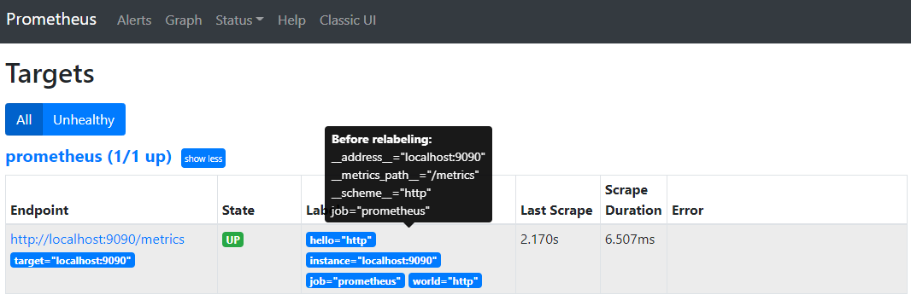

- [Abstract](#abstract)
- [Architecture](#architecture)
- [Materials](#materials)
- [Install](#install)
  - [Install on osx](#install-on-osx)
  - [Deploy with docker on OSX](#deploy-with-docker-on-osx)
  - [Deploy with docker on Win32](#deploy-with-docker-on-win32)
  - [Deploy Prometheus & Grafana docker-compose stack with docker-swarm](#deploy-prometheus--grafana-docker-compose-stack-with-docker-swarm)
  - [Deploy GitHub Monitoring Stack with docker-compose](#deploy-github-monitoring-stack-with-docker-compose)
- [Basic](#basic)
- [PromQL](#promql)
  - [Data Model](#data-model)
  - [Time Series](#time-series)
  - [Data Types](#data-types)
  - [Examples](#examples)
  - [Basics](#basics)
    - [Time series Sslectors](#time-series-sslectors)
      - [Instant vector selectors](#instant-vector-selectors)
      - [Range Vector Selectors](#range-vector-selectors)
      - [Time Duration](#time-duration)
      - [Offset modifier](#offset-modifier)
  - [Operators](#operators)
    - [Binary operators](#binary-operators)
      - [Arithmetic binary operators](#arithmetic-binary-operators)
      - [Comparison binary operators](#comparison-binary-operators)
      - [Logical/set binary operators](#logicalset-binary-operators)
    - [Vector matching](#vector-matching)
    - [Aggregation operators](#aggregation-operators)
    - [Binary operator precedence](#binary-operator-precedence)
  - [Functions](#functions)
  - [HTTP API](#http-api)
    - [Expression queries](#expression-queries)
      - [Instance queries](#instance-queries)
      - [Range queries](#range-queries)
  - [Histogram](#histogram)
    - [prometheus http request duration seconds](#prometheus-http-request-duration-seconds)
    - [grpc server handling seconds](#grpc-server-handling-seconds)
  - [Summary](#summary)
  - [Summary vs Histogram](#summary-vs-histogram)
  - [irate vs rate](#irate-vs-rate)
- [Metric Types](#metric-types)
- [How to Develop Prometheus Client](#how-to-develop-prometheus-client)
  - [Simple Instrumentation](#simple-instrumentation)
  - [Metric types](#metric-types-1)
- [Advanced](#advanced)
  - [How to reload configuration](#how-to-reload-configuration)
  - [Prometheus High Availability](#prometheus-high-availability)
  - [How to delete metrics](#how-to-delete-metrics)
  - [How to drop metrics](#how-to-drop-metrics)
  - [How to relabel](#how-to-relabel)

----

# Abstract

서버를 모니터링하는 시스템이다. 모니터링을 원하는 서버에 Exporter 를 설치한다. Prometheus 는 여러 Exporter 들에게 접속하여 데이터를 얻어온다. 즉 pulling 한다. 알림을 받을 규칙을 만들어서 Alert Manager 로 보내면 Alert Manager 가 규칙에 따라 알림을 보낸다.

# Architecture


# Materials

* [Prometheus란?](https://medium.com/finda-tech/prometheus%EB%9E%80-cf52c9a8785f)
* [Prometheus 를 알아보자](https://gompangs.tistory.com/entry/Prometheus-%EB%A5%BC-%EC%95%8C%EC%95%84%EB%B3%B4%EC%9E%90)
* [오픈소스 모니터링 시스템 Prometheus #1](https://blog.outsider.ne.kr/1254)
  * [오픈소스 모니터링 시스템 Prometheus #2](https://blog.outsider.ne.kr/1255)
* [How To Install Prometheus on Ubuntu 16.04](https://www.digitalocean.com/community/tutorials/how-to-install-prometheus-on-ubuntu-16-04)
* [Prometheus with Kubernetes](https://www.slideshare.net/jinsumoon33/kubernetes-prometheus-monitoring)

# Install

## Install on osx

```bash
$ brew install prometheus
```

## Deploy with docker on OSX

```bash
$ docker pull prom/prometheus
$ vim ~/tmp/prometheus.yml
$ docker run \
    --rm \
    --name my-prometheus \
    -p 9090:9090 \
    -v ~/tmp/prometheus.yml:/etc/prometheus/prometheus.yml \
    prom/prometheus
```

## Deploy with docker on Win32

```console
$ code D:\tmp\prometheus\prometheus.yml

$ docker run --rm --name my-prometheus -p 9090:9090 -v D:\tmp\prometheus\prometheus.yml:/etc/prometheus/prometheus.yml prom/prometheus

# Open Browser http://localhost:9090
```

* `D:\tmp\prometheus\prometheus.yml`

```yml
global:
  scrape_interval:     15s # By default, scrape targets every 15 seconds.

  # Attach these labels to any time series or alerts when communicating with
  # external systems (federation, remote storage, Alertmanager).
  external_labels:
    monitor: 'codelab-monitor'

# A scrape configuration containing exactly one endpoint to scrape:
# Here it's Prometheus itself.
scrape_configs:
  # The job name is added as a label `job=<job_name>` to any timeseries scraped from this config.
  - job_name: 'prometheus'

    # Override the global default and scrape targets from this job every 5 seconds.
    scrape_interval: 5s

    static_configs:
      - targets: ['localhost:9090']
      
```

## Deploy Prometheus & Grafana docker-compose stack with docker-swarm

* [A Prometheus & Grafana docker-compose stack](https://github.com/vegasbrianc/prometheus)
  * Prometheus, Grafana
  
----

```bash
$ cd my/docker/
$ git clone git@github.com:vegasbrianc/prometheus.git
$ HOSTNAME=$(hostname) docker stack deploy -c docker-stack.yml prom
# open Grafana dashboard http://192.168.10.1:3000
# admin / foobar (/grafana/config.monitoring)
$ docker stack ps prom
$ docker service ls
$ docker service logs prom_<service_name>
```

## Deploy GitHub Monitoring Stack with docker-compose

* [github-monitoring](https://github.com/vegasbrianc/github-monitoring)
  * [A Prometheus & Grafana docker-compose stack](https://github.com/vegasbrianc/prometheus) 를 이용한 project 이다.
  * 특정 github repo 들을 등록하면 github 통계를 grafana 로 확인할 수 있다.
  * github exporter, prometheus, grafana 로 구성된다.
  
----  

```bash
$ git clone git@github.com:vegasbrianc/github-monitoring.git
$ cd github-monitoring
# Create Private Access Token in GitHub and paste it to docker-compose.yml
$ vim docker-compose.yml
$ docker-compose up -d
# Open browser http://localhost:3000 with admin / foobar
$ docker-compose down 
```

# Basic

- run prometheus

  - ```$ prometheus --config.file=prometheus.yml```
  - prometheus.yml

    ```yml
    global:
      scrape_interval:     15s # By default, scrape targets every 15 seconds.

      # Attach these labels to any time series or alerts when communicating with
      # external systems (federation, remote storage, Alertmanager).
      external_labels:
        monitor: 'codelab-monitor'

    # A scrape configuration containing exactly one endpoint to scrape:
    # Here it's Prometheus itself.
    scrape_configs:
      # The job name is added as a label `job=<job_name>` to any timeseries scraped from this config.
      - job_name: 'prometheus'

        # Override the global default and scrape targets from this job every 5 seconds.
        scrape_interval: 5s

        static_configs:
          - targets: ['localhost:9090']
      - job_name: "node"
        static_configs:
          - targets:
              - "localhost:9100"
            labels:
              resin_app: RESIN_APP_ID
              resin_device_uuid: RESIN_DEVICE_UUID
    ```

- exporter
  - 특정 machine 에서 자료를 수집한다. URL 을 통해 prometheus 가 pulling 한다.
  - [node_exporter](https://github.com/prometheus/node_exporter) 는
    linux 의 cpu 등등의 정보를 수집한다. 실행후
    `http://<your-device-ip>:9100/metrics` 를 브라우저로 접속한다.

- scraping
  - config file 의 scrape_configs 를 설정하여 prometheus 가 targeting 할 수 있도록 하자.
  - prometheus.yml
  
    ```yaml
    ...
    scrape_configs:  
      - job_name: "node"
        static_configs:
        - targets:
            - "localhost:9100"
          labels:
            resin_app: RESIN_APP_ID
            resin_device_uuid: RESIN_DEVICE_UUID
    ...
    ```
  
- alert
  - alertmanager 를 이용하여 관리자에게 email 등등의 알람을 전송 할 수 있다.
  
  - prometheus rulefile, a.rules

    ```
    ALERT cpu_threshold_exceeded  
      IF (100 * (1 - avg by(job)(irate(node_cpu{mode='idle'}[5m])))) > THRESHOLD_CPU
      ANNOTATIONS {
        summary = "Instance {{ $labels.instance }} CPU usage is dangerously high",
        description = "This device's CPU usage has exceeded the threshold with a value of {{ $value }}.",
      }
    ```
  
  - alertmanager configfile, a.yml
    
    ```yml
    route:  
      group_by: [Alertname]
      # Send all notifications to me.
      receiver: email-me
      # When a new group of alerts is created by an incoming alert, wait at
      # least 'group_wait' to send the initial notification.
      # This way ensures that you get multiple alerts for the same group that start
      # firing shortly after another are batched together on the first
      # notification.
      group_wait: 30s

      # When the first notification was sent, wait 'group_interval' to send a batch
      # of new alerts that started firing for that group.
      group_interval: 5m

      # If an alert has successfully been sent, wait 'repeat_interval' to
      # resend them.
      repeat_interval: 3h

    templates:  
    - '/etc/ALERTMANAGER_PATH/default.tmpl'

    receivers:  
    - name: email-me
      email_configs:
      - to: GMAIL_ACCOUNT
        from: GMAIL_ACCOUNT
        smarthost: smtp.gmail.com:587
        html: '{{ template "email.default.html" . }}'
        auth_username: "GMAIL_ACCOUNT"
        auth_identity: "GMAIL_ACCOUNT"
        auth_password: "GMAIL_AUTH_TOKEN"
    ```

# PromQL

* [Prometheus Query(PromQL) 기본 이해하기](https://devthomas.tistory.com/15)
* [QUERY EXAMPLES](https://prometheus.io/docs/prometheus/latest/querying/examples/)
* [QUERYING PROMETHEUS](https://prometheus.io/docs/prometheus/latest/querying/basics/)
* [Prometheus Blog Series (Part 2): Metric types](https://blog.pvincent.io/2017/12/prometheus-blog-series-part-2-metric-types/)
* [Go gRPC Interceptors for Prometheus monitoring](https://github.com/grpc-ecosystem/go-grpc-prometheus)
* [TRACKING REQUEST DURATION WITH PROMETHEUS](https://povilasv.me/prometheus-tracking-request-duration/)

----

## Data Model

다음은 Prometheus 가 metric 을 춣력하는 형태이다.

```
http_requests_total{method="POST", handler="/hello"} 1037
```

다음과 같은 형식이다.

```
<metric-name>{<label-name>=<label-value>, ...} <metric-value> [<timestamp>]
```

## Time Series

* Time series is a series of time and value. For example, `[[1m,0.1],[2m,0.2],[3m,0.3]]` is time series.
* Sample is one of time series members. For example, `[1m,0.1]` is a sample.

## Data Types

* **Instant vector**
  * a set of time series containing a single sample for each time series, all sharing the same timestamp
  * multiple samples per one time slot.
    ```c
    http_requests_total{method="POST", handler="/messages"} 1037
    http_requests_total{method="GET", handler="/messages"} 500
    ```
* **Range vector**
  * a set of time series containing a range of data points over time for each time series
  ```c
  http_requests_total{method="POST", handler="/messages"}[5m]
  [1037 @1551242271.728, 1038 @1551242331.728, 1040 @1551242391.728]

  http_requests_total{method="GET", handler="/messages"}[5m]
  [500 @1551242484.013, 501 @1551242544.013, 502 @1551242604.013]
  ```
* **Scalar**
  * a simple numeric floating point value
* **String (Deprecated)**
  * a simple string value; currently unused

## Examples

* `http_request_total` 
  * return all time series with the metric.

* `prometheus_http_requests_total{handler="/metrics"}`
  * return all time series in graph
  * return the last data in console

* `prometheus_http_requests_total{handler="/metrics"}[5m]`
  * error because the result is range vector in graph
  * return the last 5min data in console

* `http_request_total` 
  * return all time series with the metric

* `http_requests_total{job="apiserver", handler="/api/comments"}`
  * return all time series with the metric and the given job and handler lables

* `http_requests_total{job=~".*server"}`
  * `~` means REGEX
  * `=, !=, =~, !~`
  * use `.+` instead of `.*`

    ```
    {job=~".*"}              # Bad!
    {job=~".+"}              # Good!
    {job=~".*",method="get"} # Good!
    ```
* `http_requests_total{environment=~"staging|testing|development",method!="GET"}`
  * or 

* `{__name__="http_requests_total"}` is same with `http_requests_total`

* `{__name__=~"job:.*"}`
  * return all time series starts with `job:`

* `rate(http_requests_total[5m])`
  * subquery
  * return 5-minute rate of the metric
  * `s, m, h, d, w, y` means each `seconds, minutes, hours, days, weeks, years`

* `max_over_time(deriv(rate(distance_covered_total[5s])[30s:5s])[10m:])`
  * this is an example of nested subquery but too complicated.

* `rate(http_requests_total[5m])`
  * Return the per-second rate for all time series with the http_requests_total metric name, as measured over the last 5 minutes.

* `sum by (job) (rate(http_requests_total[5m]))`
  * get sum of rates grouped by job

* `(instance_memory_limit_bytes - instance_memory_usage_bytes) / 1024 / 1024`
  * get the unused memory in MiB for every instance

* `sum by (app, proc) (instance_memory_limit_bytes - instance_memory_usage_bytes) / 1024 / 1024`
  * get the sum of the unused memory grouped by app, proc

* `topk(3, sum by (app, proc) (rate(instance_cpu_time_ns[5m])))`
  * top 3 CPU users grouped by app, proc
  * These are datas
  ```
  instance_cpu_time_ns{app="lion", proc="web", rev="34d0f99", env="prod", job="cluster-manager"}
  instance_cpu_time_ns{app="elephant", proc="worker", rev="34d0f99", env="prod", job="cluster-manager"}
  instance_cpu_time_ns{app="turtle", proc="api", rev="4d3a513", env="prod", job="cluster-manager"}
  instance_cpu_time_ns{app="fox", proc="widget", rev="4d3a513", env="prod", job="cluster-manager"}
  ...
  ```

* `http_requests_total offset 5m`
  * returns the value of http_requests_total 5 minutes in the past relative to the current query evaluation time

* `sum(http_requests_total{method="GET"} offset 5m)`
  * subquery sum with offset
  * `sum(http_requests_total{method="GET"}) offset 5m // INVALID.`

* `rate(http_requests_total[5m] offset 1w)`
  * subquery rate with offset

* `count by (app) (instance_cpu_time_ns)`
  * get the count of the running instances grouped by app

## Basics

### Time series Sslectors
#### Instant vector selectors

return instant vector

```bash
http_requests_total
http_requests_total{job="prometheus",group="canary"}
http_requests_total{environment=~"staging|testing|development",method!="GET"}
{job=~".*"}              # Bad!
{job=~".+"}              # Good!
{job=~".*",method="get"} # Good!
{__name__=~"job:.*"}
on{} # Bad!
{__name__="on"} # Good!
```

#### Range Vector Selectors

return range vector

```
http_requests_total{job="prometheus"}[5m]
```

#### Time Duration

```
ms - milliseconds
s - seconds
m - minutes
h - hours
d - days - assuming a day has always 24h
w - weeks - assuming a week has always 7d
y - years - assuming a year has always 365d
```

```
5h
1h30m
5m
10s
```

#### Offset modifier

```c
http_requests_total offset 5m
sum(http_requests_total{method="GET"} offset 5m) // GOOD.
sum(http_requests_total{method="GET"}) offset 5m // INVALID.
rate(http_requests_total[5m] offset 1w)
```

## Operators

### Binary operators

#### Arithmetic binary operators

```
+ (addition)
- (subtraction)
* (multiplication)
/ (division)
% (modulo)
^ (power/exponentiation)
```

#### Comparison binary operators

```
== (equal)
!= (not-equal)
> (greater-than)
< (less-than)
>= (greater-or-equal)
<= (less-or-equal)
```

#### Logical/set binary operators

```
and (intersection)
or (union)
unless (complement)
```

### Vector matching

???

### Aggregation operators

It is same with group by of SQL.

* sum (calculate sum over dimensions)
* min (select minimum over dimensions)
* max (select maximum over dimensions)
* avg (calculate the average over dimensions)
* stddev (calculate population standard deviation over dimensions)
* stdvar (calculate population standard variance over dimensions)
* count (count number of elements in the vector)
* count_values (count number of elements with the same value)
* bottomk (smallest k elements by sample value)
* topk (largest k elements by sample value)
* quantile (calculate φ-quantile (0 ≤ φ ≤ 1) over dimensions)

### Binary operator precedence

```
^
*, /, %
+, -
==, !=, <=, <, >=, >
and, unless
or
```

## Functions

* `abs()`
* `rate()`

## HTTP API

### Expression queries

#### Instance queries

```
GET /api/v1/query
POST /api/v1/query
```

`resultType` is `vector`.

```console
$ curl 'http://localhost:9090/api/v1/query?query=up&time=2015-07-01T20:10:51.781Z'
{
   "status" : "success",
   "data" : {
      "resultType" : "vector",
      "result" : [
         {
            "metric" : {
               "__name__" : "up",
               "job" : "prometheus",
               "instance" : "localhost:9090"
            },
            "value": [ 1435781451.781, "1" ]
         },
         {
            "metric" : {
               "__name__" : "up",
               "job" : "node",
               "instance" : "localhost:9100"
            },
            "value" : [ 1435781451.781, "0" ]
         }
      ]
   }
}
```

#### Range queries

```
GET /api/v1/query_range
POST /api/v1/query_range
```

`resultType` is `matrix`.

```
$ curl 'http://localhost:9090/api/v1/query_range?query=up&start=2015-07-01T20:10:30.781Z&end=2015-07-01T20:11:00.781Z&step=15s'
{
   "status" : "success",
   "data" : {
      "resultType" : "matrix",
      "result" : [
         {
            "metric" : {
               "__name__" : "up",
               "job" : "prometheus",
               "instance" : "localhost:9090"
            },
            "values" : [
               [ 1435781430.781, "1" ],
               [ 1435781445.781, "1" ],
               [ 1435781460.781, "1" ]
            ]
         },
         {
            "metric" : {
               "__name__" : "up",
               "job" : "node",
               "instance" : "localhost:9091"
            },
            "values" : [
               [ 1435781430.781, "0" ],
               [ 1435781445.781, "0" ],
               [ 1435781460.781, "1" ]
            ]
         }
      ]
   }
}
```

## Histogram

* [Prometheus monitoring for your gRPC Go servers.](https://github.com/grpc-ecosystem/go-grpc-prometheus)
* [How does a Prometheus Histogram work?](https://www.robustperception.io/how-does-a-prometheus-histogram-work)

----

Usually measure the latency. Can adjust time period when make the range vector. But Summary can't.

### prometheus http request duration seconds

* data

  ```json
  # HELP prometheus_http_request_duration_seconds Histogram of latencies for HTTP requests.
  # TYPE prometheus_http_request_duration_seconds histogram
  prometheus_http_request_duration_seconds_bucket{handler="/",le="0.1"} 25547
  prometheus_http_request_duration_seconds_bucket{handler="/",le="0.2"} 26688
  prometheus_http_request_duration_seconds_bucket{handler="/",le="0.4"} 27760
  prometheus_http_request_duration_seconds_bucket{handler="/",le="1"} 28641
  prometheus_http_request_duration_seconds_bucket{handler="/",le="3"} 28782
  prometheus_http_request_duration_seconds_bucket{handler="/",le="8"} 28844
  prometheus_http_request_duration_seconds_bucket{handler="/",le="20"} 28855
  prometheus_http_request_duration_seconds_bucket{handler="/",le="60"} 28860
  prometheus_http_request_duration_seconds_bucket{handler="/",le="120"} 28860
  prometheus_http_request_duration_seconds_bucket{handler="/",le="+Inf"} 28860
  prometheus_http_request_duration_seconds_sum{handler="/"} 1863.80491025699
  prometheus_http_request_duration_seconds_count{handler="/"} 28860
  ```

* the number of observations per second over the last five minutes on average
  * `rate(prometheus_http_request_duration_seconds_sum[5m]`
* how long they took per second on average
  * `rate(prometheus_http_request_duration_seconds_count[5m])`
* the average duration of one observation
  * `rate(prometheus_http_request_duration_seconds_sum[5m] / rate(prometheus_http_request_duration_seconds_count[5m])`
* 0.9 quantile (the 90th percentile) of seconds
  * `histogram_quantile(0.9, rate(prometheus_http_request_duration_seconds_bucket[5m]))`

### grpc server handling seconds

* data

  ```json
  grpc_server_handling_seconds_bucket{grpc_code="OK",grpc_method="PingList",grpc_service="mwitkow.testproto.TestService",grpc_type="server_stream",le="0.005"} 1
  grpc_server_handling_seconds_bucket{grpc_code="OK",grpc_method="PingList",grpc_service="mwitkow.testproto.TestService",grpc_type="server_stream",le="0.01"} 1
  grpc_server_handling_seconds_bucket{grpc_code="OK",grpc_method="PingList",grpc_service="mwitkow.testproto.TestService",grpc_type="server_stream",le="0.025"} 1
  grpc_server_handling_seconds_bucket{grpc_code="OK",grpc_method="PingList",grpc_service="mwitkow.testproto.TestService",grpc_type="server_stream",le="0.05"} 1
  grpc_server_handling_seconds_bucket{grpc_code="OK",grpc_method="PingList",grpc_service="mwitkow.testproto.TestService",grpc_type="server_stream",le="0.1"} 1
  grpc_server_handling_seconds_bucket{grpc_code="OK",grpc_method="PingList",grpc_service="mwitkow.testproto.TestService",grpc_type="server_stream",le="0.25"} 1
  grpc_server_handling_seconds_bucket{grpc_code="OK",grpc_method="PingList",grpc_service="mwitkow.testproto.TestService",grpc_type="server_stream",le="0.5"} 1
  grpc_server_handling_seconds_bucket{grpc_code="OK",grpc_method="PingList",grpc_service="mwitkow.testproto.TestService",grpc_type="server_stream",le="1"} 1
  grpc_server_handling_seconds_bucket{grpc_code="OK",grpc_method="PingList",grpc_service="mwitkow.testproto.TestService",grpc_type="server_stream",le="2.5"} 1
  grpc_server_handling_seconds_bucket{grpc_code="OK",grpc_method="PingList",grpc_service="mwitkow.testproto.TestService",grpc_type="server_stream",le="5"} 1
  grpc_server_handling_seconds_bucket{grpc_code="OK",grpc_method="PingList",grpc_service="mwitkow.testproto.TestService",grpc_type="server_stream",le="10"} 1
  grpc_server_handling_seconds_bucket{grpc_code="OK",grpc_method="PingList",grpc_service="mwitkow.testproto.TestService",grpc_type="server_stream",le="+Inf"} 1
  grpc_server_handling_seconds_sum{grpc_code="OK",grpc_method="PingList",grpc_service="mwitkow.testproto.TestService",grpc_type="server_stream"} 0.0003866430000000001
  grpc_server_handling_seconds_count{grpc_code="OK",grpc_method="PingList",grpc_service="mwitkow.testproto.TestService",grpc_type="server_stream"} 1
  ```

* request inbound rate
  * `sum(rate(grpc_server_started_total{job="foo"}[1m])) by (grpc_service)`
* unary request error rate
  * `sum(rate(grpc_server_handled_total{job="foo",grpc_type="unary",grpc_code!="OK"}[1m])) by (grpc_service)`
* unary request error percentage
  ```json
  sum(rate(grpc_server_handled_total{job="foo",grpc_type="unary",grpc_code!="OK"}[1m])) by (grpc_service)
  / 
  sum(rate(grpc_server_started_total{job="foo",grpc_type="unary"}[1m])) by (grpc_service)
  * 100.0
  ```
* average response stream size
  ```json
  sum(rate(grpc_server_msg_sent_total{job="foo",grpc_type="server_stream"}[10m])) by (grpc_service)
  /
  sum(rate(grpc_server_started_total{job="foo",grpc_type="server_stream"}[10m])) by (grpc_service)
  ``` 
* 99%-tile latency of unary requests
  * `histogram_quantile(0.99, sum(rate(grpc_server_handling_seconds_bucket{job="foo",grpc_type="unary"}[5m])) by (grpc_service,le))`
* percentage of slow unary queries (>250ms)
  * `100.0 - (sum(rate(grpc_server_handling_seconds_bucket{job="foo",grpc_type="unary",le="0.25"}[5m])) by (grpc_service) / sum(rate(grpc_server_handling_seconds_count{job="foo",grpc_type="unary"}[5m])) by (grpc_service)) * 100.0`

## Summary

* [How does a Prometheus Summary work?](https://www.robustperception.io/how-does-a-prometheus-summary-work)

----

* data

  ```json
  # HELP prometheus_rule_evaluation_duration_seconds The duration for a rule to execute.
  # TYPE prometheus_rule_evaluation_duration_seconds summary
  prometheus_rule_evaluation_duration_seconds{quantile="0.5"} 6.4853e-05
  prometheus_rule_evaluation_duration_seconds{quantile="0.9"} 0.00010102
  prometheus_rule_evaluation_duration_seconds{quantile="0.99"} 0.000177367
  prometheus_rule_evaluation_duration_seconds_sum 1.623860968846092e+06
  prometheus_rule_evaluation_duration_seconds_count 1.112293682e+09
  ```

* the number of observations per second over the last five minutes on average
  * `rate(prometheus_rule_evaluation_duration_seconds_count[5m])`
* how long they took per second on average  
  * `rate(prometheus_rule_evaluation_duration_seconds_sum[5m])`
* the average duration of one observation  
  * `rate(prometheus_rule_evaluation_duration_seconds_sum[5m] / rate(prometheus_rule_evaluation_duration_seconds_count[5m])`
  
## Summary vs Histogram

* Histogram can adjust time period when make the range vector. But Summary can't.
* Histogram costs more than Summary in server-side.

## irate vs rate

* [Why irate from Prometheus doesn't capture spikes](https://valyala.medium.com/why-irate-from-prometheus-doesnt-capture-spikes-45f9896d7832)

# Metric Types

* [The 4 Types Of Prometheus Metrics](https://tomgregory.com/the-four-types-of-prometheus-metrics/)

-----

* Counter
  * 오로지 늘어나기만 하는 수치
  * `rate(request_count[5m])` 와 같이 `rate()` 을 사용할 수 있다.
* Gauge
  * 늘어나거나 줄어드는 수치
  * `avg_over_time(queue_size[5m])` 와 같이 `avg_over_time()` 을 사용할 수 있다.
* Histogram
  * 미리 정한 bucket 에 수치를 담는다.
  * 다음은 `4.467s, 9.213s, and 9.298s` 의 예이다.
  ```
  # HELP request_duration Time for HTTP request.
  # TYPE request_duration histogram
  request_duration_bucket{le="0.005",} 0.0
  request_duration_bucket{le="0.01",} 0.0
  request_duration_bucket{le="0.025",} 0.0
  request_duration_bucket{le="0.05",} 0.0
  request_duration_bucket{le="0.075",} 0.0
  request_duration_bucket{le="0.1",} 0.0
  request_duration_bucket{le="0.25",} 0.0
  request_duration_bucket{le="0.5",} 0.0
  request_duration_bucket{le="0.75",} 0.0
  request_duration_bucket{le="1.0",} 0.0
  request_duration_bucket{le="2.5",} 0.0
  request_duration_bucket{le="5.0",} 1.0
  request_duration_bucket{le="7.5",} 1.0
  request_duration_bucket{le="10.0",} 3.0
  request_duration_bucket{le="+Inf",} 3.0
  request_duration_count 3.0
  request_duration_sum 22.978489699999997
  ```
  * 다음과 같이 query 한다.

  ```
  rate(request_duration_sum[5m])
  /
  rate(request_duration_count[5m])  
  ```
  * `histogram_quantile(0.95, sum(rate(request_duration_bucket[5m])) by (le))` 와 같이 `historgram_quantile()` 을 사용가능하다.

* Summary
  * historgram 과 비슷하다. `histogram_quantile()` 을 사용할 수 없다.

  ```
  # HELP request_duration_summary Time for HTTP request.
  # TYPE request_duration_summary summary
  request_duration_summary{quantile="0.95",} 7.4632192
  request_duration_summary_count 5.0
  request_duration_summary_sum 27.338737899999998
  ```
  * 다음과 같이 query 한다.
  
  ```
  rate(request_duration_summary_sum[5m])
  /
  rate(request_duration_summary_count[5m])
  ```
  
**Metric Type Comparison Table**

|	 |Counter |	Gauge |	Histogram |	Summary |
|--|--|--|--|--|
| **General**				| | | |  |
| Can go up and down |	✗ |	✓ |	✓ |	✓ |
| Is a complex type (publishes multiple values per metric)	| ✗ |	✗ |	✓ |	✓ |
| Is an approximation	| ✗ |	✗ |	✓ |	✓ |
| **Querying**		| | | |	|
| Can query with rate function	| ✓	| ✗	| ✗	| ✗ |
| Can calculate percentiles	| ✗	| ✗	| ✓	| ✓ |
| Can query with histogram_quantile function	| ✗	| ✗	| ✓	| ✗ |

# How to Develop Prometheus Client

## Simple Instrumentation

* [INSTRUMENTING A GO APPLICATION FOR PROMETHEUS](https://prometheus.io/docs/guides/go-application/)

----

* run client
  * main.go

    ```go
    package main

    import (
      "math/rand"
      "net/http"
      "time"

      "github.com/prometheus/client_golang/prometheus"
      "github.com/prometheus/client_golang/prometheus/promauto"
      "github.com/prometheus/client_golang/prometheus/promhttp"
    )

    func recordMetrics() {
      go func() {
        for {
          opsProcessed.Inc()

          if n := rand.Intn(100); n%2 == 0 {
            httpReqs.WithLabelValues("200 OK", "GET").Inc()
          } else {
            httpReqs.WithLabelValues("200 OK", "POST").Inc()
          }

          apiLatency.WithLabelValues("myapp").Observe(float64(rand.Intn(100)))

          time.Sleep(2 * time.Second)
        }
      }()
    }

    var (
      opsProcessed = promauto.NewCounter(prometheus.CounterOpts{
        Name: "myapp_processed_ops_total",
        Help: "The total number of processed events",
      })

      httpReqs = prometheus.NewCounterVec(
        prometheus.CounterOpts{
          Name: "myapp_http_requests_total",
          Help: "How many HTTP requests processed, partitioned by status code and HTTP method.",
        },
        []string{"code", "method"},
      )

      apiLatency = prometheus.NewHistogramVec(
        prometheus.HistogramOpts{
          Name:    "myapp_api_latency",
          Help:    "api latency",
          Buckets: prometheus.LinearBuckets(0, 5, 20),
        },
        []string{"target_group"},
      )
    )

    func init() {
      //prometheus.MustRegister(opsProcessed)
      prometheus.MustRegister(httpReqs)
      prometheus.MustRegister(apiLatency)
    }

    func main() {
      recordMetrics()

      http.Handle("/metrics", promhttp.Handler())
      http.ListenAndServe(":2112", nil)
    }
    ```
  * run client

    ```bash
    $ go mod init main
    $ go build
    $ go run main.go
    $ curl http://localhost:2112/metrics
    ```

* run server
  * prometheus.yml

    ```yml
    # my global config
    global:
      scrape_interval:     15s # Set the scrape interval to every 15 seconds. Default is every 1 minute.
      evaluation_interval: 15s # Evaluate rules every 15 seconds. The default is every 1 minute.
      # scrape_timeout is set to the global default (10s).

    # Alertmanager configuration
    alerting:
      alertmanagers:
      - static_configs:
        - targets:
          # - alertmanager:9093

    # Load rules once and periodically evaluate them according to the global 'evaluation_interval'.
    rule_files:
      # - "first_rules.yml"
      # - "second_rules.yml"

    # A scrape configuration containing exactly one endpoint to scrape:
    # Here it's Prometheus itself.
    scrape_configs:
      # The job name is added as a label `job=<job_name>` to any timeseries scraped from this config.
      - job_name: 'prometheus'
        # metrics_path defaults to '/metrics'
        # scheme defaults to 'http'.
        static_configs:
        - targets: ['localhost:9090']
      - job_name: myapp
        scrape_interval: 10s
        static_configs:
        - targets:
          - host.docker.internal:2112
    ```
  * run server

    ```bash
    $ docker pull prom/prometheus
    $ vim ~/tmp/prometheus.yml
    $ docker run \
        --rm -d \
        -p 9090:9090 \
        -v ~/tmp/prometheus.yml:/etc/prometheus/prometheus.yml \
        --name my-prometheus \
        prom/prometheus
    ```
  * open browser
    * status page: `localhost:9090`
    * metrics endpoint: `localhost:9090/metrics`

## Metric types

* [METRIC TYPES](https://prometheus.io/docs/concepts/metric_types/)

----

There are 4 kinds of metric types such as Counter, Gauge, Histogram, Summary.

**Counter**

This is a cumulative metric. For example, the number of requests served, tasks completed, http total send bytes, http total request, running time or errors. There is just increment no decrement. 

[Counter doc](https://godoc.org/github.com/prometheus/client_golang/prometheus#Counter)

```go
httpReqs := prometheus.NewCounterVec(
    prometheus.CounterOpts{
        Name: "http_requests_total",
        Help: "How many HTTP requests processed, partitioned by status code and HTTP method.",
    },
    []string{"code", "method"},
)
prometheus.MustRegister(httpReqs)

httpReqs.WithLabelValues("404", "POST").Add(42)

// If you have to access the same set of labels very frequently, it
// might be good to retrieve the metric only once and keep a handle to
// it. But beware of deletion of that metric, see below!
m := httpReqs.WithLabelValues("200", "GET")
for i := 0; i < 1000000; i++ {
    m.Inc()
}
// Delete a metric from the vector. If you have previously kept a handle
// to that metric (as above), future updates via that handle will go
// unseen (even if you re-create a metric with the same label set
// later).
httpReqs.DeleteLabelValues("200", "GET")
// Same thing with the more verbose Labels syntax.
httpReqs.Delete(prometheus.Labels{"method": "GET", "code": "200"})
```

**Gauge**

This is a metric that represents a single numerical value that can arbitrarily go up and down. For example, memory, disk usage, temperature, current cpu usage, current thread count.

[Gauge doc](https://godoc.org/github.com/prometheus/client_golang/prometheus#Gauge)

```go
opsQueued := prometheus.NewGauge(prometheus.GaugeOpts{
    Namespace: "our_company",
    Subsystem: "blob_storage",
    Name:      "ops_queued",
    Help:      "Number of blob storage operations waiting to be processed.",
})
prometheus.MustRegister(opsQueued)

// 10 operations queued by the goroutine managing incoming requests.
opsQueued.Add(10)
// A worker goroutine has picked up a waiting operation.
opsQueued.Dec()
// And once more...
opsQueued.Dec()
```

**Histogram**

A histogram samples observations (usually things like request durations or response sizes) and counts them in configurable buckets. It also provides a sum of all observed values. For example, TPS.

[Histogram doc](https://godoc.org/github.com/prometheus/client_golang/prometheus#Histogram)

```go
temps := prometheus.NewHistogram(prometheus.HistogramOpts{
    Name:    "pond_temperature_celsius",
    Help:    "The temperature of the frog pond.", // Sorry, we can't measure how badly it smells.
    Buckets: prometheus.LinearBuckets(20, 5, 5),  // 5 buckets, each 5 centigrade wide.
})

// Simulate some observations.
for i := 0; i < 1000; i++ {
    temps.Observe(30 + math.Floor(120*math.Sin(float64(i)*0.1))/10)
}

// Just for demonstration, let's check the state of the histogram by
// (ab)using its Write method (which is usually only used by Prometheus
// internally).
metric := &dto.Metric{}
temps.Write(metric)
fmt.Println(proto.MarshalTextString(metric))
```

```
histogram: <
  sample_count: 1000
  sample_sum: 29969.50000000001
  bucket: <
    cumulative_count: 192
    upper_bound: 20
  >
  bucket: <
    cumulative_count: 366
    upper_bound: 25
  >
  bucket: <
    cumulative_count: 501
    upper_bound: 30
  >
  bucket: <
    cumulative_count: 638
    upper_bound: 35
  >
  bucket: <
    cumulative_count: 816
    upper_bound: 40
  >
>
```

**Summary**

[Summary doc](https://godoc.org/github.com/prometheus/client_golang/prometheus#Summary)

```go
temps := prometheus.NewSummary(prometheus.SummaryOpts{
    Name:       "pond_temperature_celsius",
    Help:       "The temperature of the frog pond.",
    Objectives: map[float64]float64{0.5: 0.05, 0.9: 0.01, 0.99: 0.001},
})

// Simulate some observations.
for i := 0; i < 1000; i++ {
    temps.Observe(30 + math.Floor(120*math.Sin(float64(i)*0.1))/10)
}

// Just for demonstration, let's check the state of the summary by
// (ab)using its Write method (which is usually only used by Prometheus
// internally).
metric := &dto.Metric{}
temps.Write(metric)
fmt.Println(proto.MarshalTextString(metric))
```

```
summary: <
  sample_count: 1000
  sample_sum: 29969.50000000001
  quantile: <
    quantile: 0.5
    value: 31.1
  >
  quantile: <
    quantile: 0.9
    value: 41.3
  >
  quantile: <
    quantile: 0.99
    value: 41.9
  >
>
```

# Advanced

## How to reload configuration

* [Reloading Prometheus’ Configuration](https://www.robustperception.io/reloading-prometheus-configuration)

----

```bash
$ kill -HUP 1234
```

## Prometheus High Availability

* [Prometheus High Availability](https://ssup2.github.io/theory_analysis/Prometheus_High_Availability/)

----

multiple prometheus and ALB with sticky session

## How to delete metrics

* [프로메테우스 시계열 데이터 삭제하기](https://kangwoo.github.io/devops/prometheus/delete-metrics-from-prometheus/)
  
-----

You should turn on the argument `--web.enable-admin-api`.

```bash
# Delete metrics with specific labels
curl -X POST \
	-g 'http://localhost:9090/api/v1/admin/tsdb/delete_series?match[]={foo="bar"}'

# Delete metrics with specific labels
curl -X POST \
	-g 'http://localhost:9090/api/v1/admin/tsdb/delete_series?match[]={job="node_exporter"}'

# Delete metrics with specific labels
curl -X POST \
	-g 'http://localhost:9090/api/v1/admin/tsdb/delete_series?match[]={instance="172.22.0.1:9100"}'

# Delete all metrics 
curl -X POST \
	-g 'http://localhost:9090/api/v1/admin/tsdb/delete_series?match[]={__name__=~".+"}'

# Let's do compaction right now
curl -X POST -g 'http://localhost:9090/api/v1/admin/tsdb/clean_tombstones'
```

## How to drop metrics

* [Dropping metrics at scrape time with Prometheus](https://www.robustperception.io/dropping-metrics-at-scrape-time-with-prometheus)

-----

Check top 10 metrics

```yaml
topk(20, count by (__name__, job)({__name__=~".+"}))
```

```yaml
scrape_configs:
 - job_name: 'my_job'
   static_configs:
     - targets:
       - my_target:1234
   metric_relabel_configs:
   - source_labels: [ __name__ ]
     regex: 'my_too_large_metric'
     action: drop
```

## How to relabel

* [170. [Prometheus] 2편. PromQL 사용하기, k8s에서 Meta Label과 relabel을 활용한 기본 라벨 설정, 그 외의 이야기 @ naverblog](https://blog.naver.com/PostView.nhn?blogId=alice_k106&logNo=221535575875)
* [relabel_config @ prometheus](https://prometheus.io/docs/prometheus/latest/configuration/configuration/#relabel_config)
* [Prometheus Relabel Rules and the ‘action’ Parameter](https://blog.freshtracks.io/prometheus-relabel-rules-and-the-action-parameter-39c71959354a)
* [Life of a Label @ robustperception](https://www.robustperception.io/life-of-a-label)
  * [PromCon 2016: Life of a Label - Brian Brazil @ youtube](https://www.youtube.com/watch?v=b5-SvvZ7AwI)

----

Prometheus 는 metric data 의 특정 label 을 보고 조건이 맞으면 metric data 를 keep 할 수도 있고 drop 할 수도 있다. 

또한 metric data 의 label 을 교체 및 추가할 수도 있다. 이것을 relabel 이라고 한다.

기본적으로 `__address__, job` 와 같은 label 은 `instance, job` 으로 relabel 된다. `__` 로 시작하는 label 은 meta label 이라고 한다.

[relabel_config @ prometheus](https://prometheus.io/docs/prometheus/latest/configuration/configuration/#relabel_config) 를 참고하면 다양한 action 들을 확인할 수 있다.

많이 사용하는 action 은 **keep**, **drop**, **replace** 와 **labelmap** 이다. **replace** 는 교체하는 것이고 **labelmap** 은 새로운 label 을 만들어서 값을 복사하는 것이다. **labelmap** 은 항상 처음에 와야 한다???

`__` 로 시작하는 label 을 meta label 이라고 한다. meta label 들은 relabel process 후 제거된다.

다음과 같이 `prometheus.yml` 을 만들어서 docker 를 이용하여 실험할 수 있다.

```yml
global:
  scrape_interval:     15s # By default, scrape targets every 15 seconds.
  external_labels:
    monitor: 'codelab-monitor'

scrape_configs:
  - job_name: 'prometheus'
    scrape_interval: 5s
    static_configs:
      - targets: ['localhost:9090']

    relabel_configs:
      - source_labels: [__address__]
        target_label: __param_target
      - source_labels: [__scheme__]
        action: replace
        target_label: hello
      - action: labelmap
        regex: __scheme__
        replacement: world      
```


