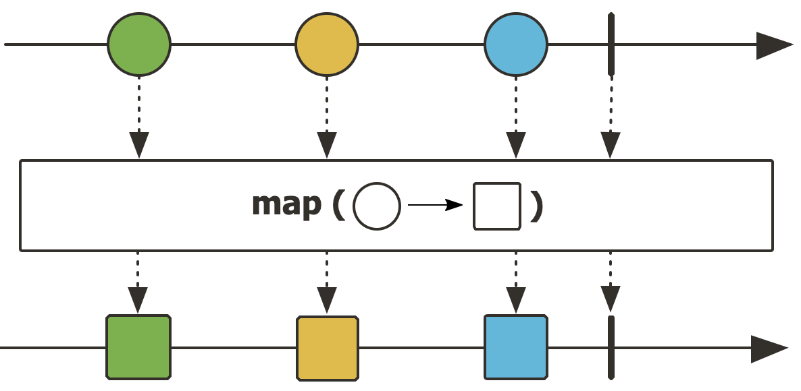
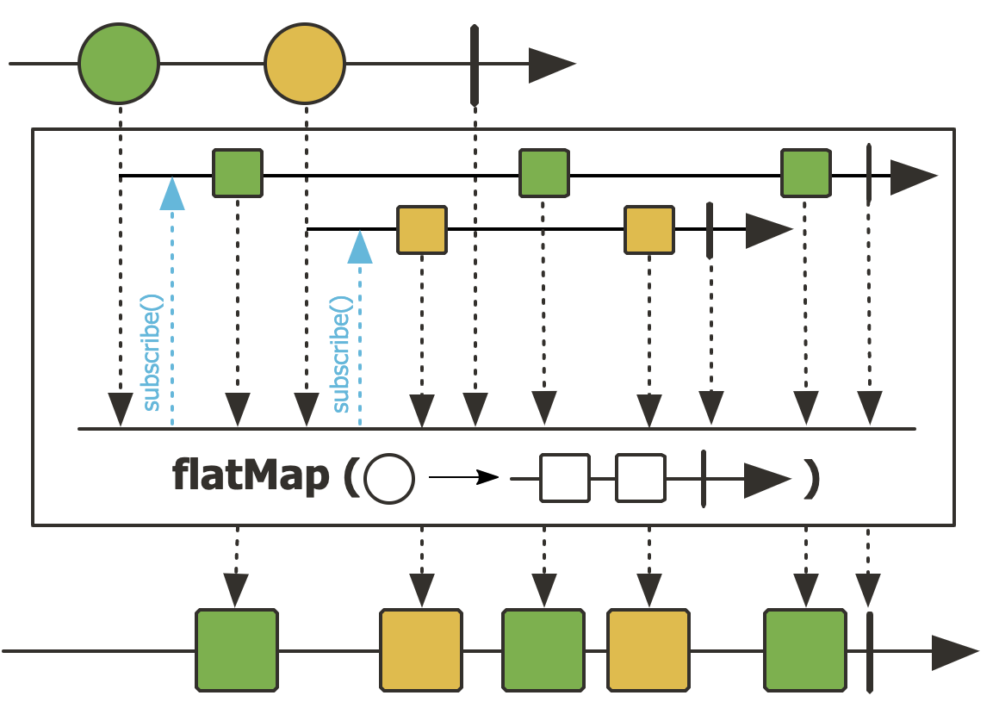
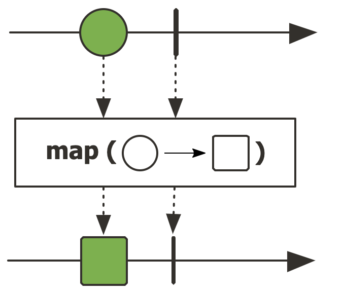
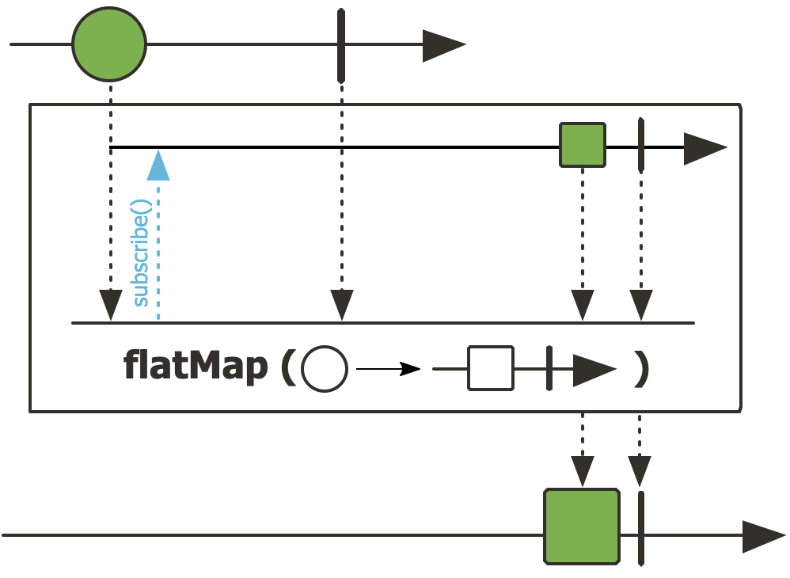

- [Abstract](#abstract)
- [References](#references)
- [Materials](#materials)
- [Basic](#basic)
  - [Asynchronous VS non-blocking](#asynchronous-vs-non-blocking)
  - [Overview](#overview)
  - [Marble Diagram](#marble-diagram)
  - [map and flatMap](#map-and-flatmap)
  - [map vs flatMap](#map-vs-flatmap)
  - [Flux](#flux)
  - [Mono](#mono)
  - [StepVerifier](#stepverifier)
  - [Transform](#transform)
  - [Merge](#merge)
  - [Request](#request)
  - [Error](#error)
  - [Adapt](#adapt)
  - [Others Operations](#others-operations)
  - [Reactive to Blocking](#reactive-to-blocking)
  - [Blocking to Reactive](#blocking-to-reactive)

----

# Abstract

[Reactor](https://projectreactor.io/) 는 [Reactive Streams @ TIL](/reactivestreams/README.md) 의 implementation 중 하나이다. Spring Webflux 는 [Reactor](https://projectreactor.io/) 를 이용하여 구현되었다.

[rx.js](/rxjs/README.md) 를 먼저 이해했다면 reactor 는 쉽게 이해할 수 있다.

# References

* [reactor-core/reactor-core/src/test/java/reactor/core/publisher/](https://github.com/reactor/reactor-core/tree/main/reactor-core/src/test/java/reactor/core/publisher)
  * rector-core publisher 의 test code
* [Reactive Programming with Reactor 3 @ tech.io](https://tech.io/playgrounds/929/reactive-programming-with-reactor-3/Intro)
  * [sol](https://gist.github.com/kjs850/a29addc92b98b51ea05a09587be34071)
* [ex-reactor @ github](https://github.com/iamslash/java-ex/tree/master/ex-reactor)
* [Java Asynchronous & Non Blocking programming With Reactor @ udemy](https://matchgroup.udemy.com/course/complete-java-reactive-programming/learn/lecture/24545814#overview)
  * [src](https://github.com/vinsguru/java-reactive-programming-course)

# Materials

* [[리액터] 리액티브 프로그래밍 1부 리액티브 프로그래밍 소개 @ youtube](https://www.youtube.com/watch?v=VeSHa_Xsd2U&list=PLfI752FpVCS9hh_FE8uDuRVgPPnAivZTY)
* [reactor reference](https://projectreactor.io/docs/core/release/reference/)
  * [kor](https://godekdls.github.io/Reactor%20Core/contents/)
  * [Appendix A: Which operator do I need?](https://projectreactor.io/docs/core/release/reference/index.html#which-operator)
  * [Appendix B: How to read marble diagrams?](https://projectreactor.io/docs/core/release/reference/index.html#howtoReadMarbles)
* [Testing Reactive Streams Using StepVerifier and TestPublisher @ baeldung](https://www.baeldung.com/reactive-streams-step-verifier-test-publisher)
  * [Combining Publishers in Project Reactor @ baeldung](https://www.baeldung.com/reactor-combine-streams)
* [Error handling with reactive streams](https://kalpads.medium.com/error-handling-with-reactive-streams-77b6ec7231ff)
* [사용하면서 알게 된 Reactor, 예제 코드로 살펴보기](https://tech.kakao.com/2018/05/29/reactor-programming/)

# Basic

## Asynchronous VS non-blocking

* [Blocking-NonBlocking-Synchronous-Asynchronous](https://homoefficio.github.io/2017/02/19/Blocking-NonBlocking-Synchronous-Asynchronous/)

Synchronous 와 Asynchronous 의 관심사는 job 이다. 즉, 어떤 A job, B job 을 수행할 때 A job 이 B job 과 시간을 맞추면서 실행하면 Synchronous 이다. 그러나 시간을 맞추지 않고 각자 수행하면 Asynchronous 이다.

Blocking 과 Non-blocking 의 관심사는 function 이다. 즉, A function 이 B function 을 호출할 때 B function 이 리턴할 때까지 A function 이 기다린다면 Blocking 이다. 그러나 B function 이 리턴하기 전에 A function 이 수행할 수 있다면 Non-blocking 이다.

## Overview

[Reactor](https://projectreactor.io/) 는 [Reactive Streams @ TIL](/reactivestreams/README.md) 의 implementation 이다. 
즉, 다음과 같은 interface 들을 잘 구현했다는 의미이다. 

```java
public interface Publisher<T> {
    public void subscribe(Subscriber<? super T> s);
}

public interface Subscriber<T> {
    public void onSubscribe(Subscription s);
    public void onNext(T t);
    public void onError(Throwable t);
    public void onComplete();
}

public interface Subscription {
    public void request(long n);
    public void cancel();
}

public interface Processor<T, R> extends Subscriber<T>, Publisher<R> {
}
```

[Reactor](https://projectreactor.io/) 의 세계관에서 꼭 기억해야할 2
가지 주체가 있다.  바로 **Publisher** 와 **Subscriber** 이다. Publisher 는
data 를 공급하는 쪽이고 Subscriber 는 data 를 소비하는 쪽이다.  Mono,
Flux 는 Publisher 를 구현한다. 곧, Publisher 이다.

또한 element, stream 을 잘 기억하자. element 는 datum (하나의 데이터) 을 의미하고
stream 은 element 의 모음이다. 그리고 lazy 하다. 즉, evaulate
될때 마다 element 를 만들어 낸다. Mono, Flux 는 stream 이라고 할 수
있다.

Mono 는 element 가 하나인 stream 이다. Flux 는 element 가 여러개인 
stream 이다.

다음과 같이 Mono instance 를 생성하자. 하나의 element 를 갖는 하나의 stream 이 만들어 졌다. 

```java
Mono<String> mono = Mono.jst("Hello World");
```

steam 이 만들어졌으니 이제 stream 을 소비해 보자. `mono.subscribe()` 에
`Subscriber` instance 를 전달해야 한다. 다음과 같이 Lambda funtion 을 
전달해 보자. 

```java
mono.subscribe(a -> {
                System.out.println(a);
});
```

다음은 `Mono::subscribe()` 의 code 이다. 

```java
// reactor/core/publisher/Mono.java
	public final Disposable subscribe(Consumer<? super T> consumer) {
		Objects.requireNonNull(consumer, "consumer");
		return subscribe(consumer, null, null);
	}
// reactor/core/publisher/Mono.java
	public final Disposable subscribe(
			@Nullable Consumer<? super T> consumer,
			@Nullable Consumer<? super Throwable> errorConsumer,
			@Nullable Runnable completeConsumer) {
		return subscribe(consumer, errorConsumer, completeConsumer, (Context) null);
	}
// reactor/core/publisher/Mono.java
	public final Disposable subscribe(
			@Nullable Consumer<? super T> consumer,
			@Nullable Consumer<? super Throwable> errorConsumer,
			@Nullable Runnable completeConsumer,
			@Nullable Context initialContext) {
		return subscribeWith(new LambdaMonoSubscriber<>(consumer, errorConsumer,
				completeConsumer, null, initialContext));
	}  

// reactor/core/publisher/LambdaMonoSubscriber.java
final class LambdaMonoSubscriber<T> implements InnerConsumer<T>, Disposable {

	final Consumer<? super T>            consumer;
	final Consumer<? super Throwable>    errorConsumer;
	final Runnable                       completeConsumer;
	final Consumer<? super Subscription> subscriptionConsumer;
	final Context                        initialContext;

	volatile Subscription subscription;
...    
	LambdaMonoSubscriber(@Nullable Consumer<? super T> consumer,
			@Nullable Consumer<? super Throwable> errorConsumer,
			@Nullable Runnable completeConsumer,
			@Nullable Consumer<? super Subscription> subscriptionConsumer,
			@Nullable Context initialContext) {
		this.consumer = consumer;
		this.errorConsumer = errorConsumer;
		this.completeConsumer = completeConsumer;
		this.subscriptionConsumer = subscriptionConsumer;
		this.initialContext = initialContext == null ? Context.empty() : initialContext;
	}
...
}    
```

Functional Interface 인
`Consumer` instance 가 전달되어 `LambdaMonoSubscriber<>` 의
constructor 로 전달된다.  `LambdaMonoSubscriber<>` 는 `Subscriber`
interface 를 implement 한다.  즉, `LambdaMonoSubscriber<>` 는
`Subscriber` 이다. 처음 전달된 `Consumer` instance 의 `accept()` 는
`Subscriber` 의 `onNext()` 에서 호출된다.

정리하면 `Mono::subscribe()` 를 호출하여 stream 을 소비했다. 어떻게 소비하는지 
Lambda function 에 정의했다.

## Marble Diagram

reactor 의 operator 들을 이해하기 위해서는 marble diagram 을 해석할 수 있어야 한다.

* [Understanding Marble Diagrams for Reactive Streams @ medium](https://medium.com/@jshvarts/read-marble-diagrams-like-a-pro-3d72934d3ef5#c162)

예를 들어 `Flux::map()` 의 marble diagram 을 살펴보자.



중간에 네모상자는 mapper 를 의미한다. 동그라미 element 를 받아서 네모 element 를 return 한다. 맨 윗줄의 동그라미는 직선위에 늘어서 있다. 직선이 곧 stream 이다. 맨 아랫줄의 네모는 mapper 에 의해 변형된 element 를 의미한다. 역시 stream 에 늘어서 있다.

이번에는 `Flux::flatMap()` 의 marble diagram 을 살펴보자.
 


중간에 네모상자는 mapper 를 의미한다. 동그라미 element 를 받아서 네모들이 포함된 stream 을 return 한다. 네모 상자 안의 두개의 inner stream 들을 주목하자. 각각 동그라미 element 를 입력으로 받아 inner stream 을 return 한다. 두개의 inner stream 들은 각각 펼쳐져서 맨 아랫줄의 stream 에 섞여서 merge 된다. 

## map and flatMap

Mono, Flux 의 operator 중 `map(), flatmap()` 이 중요하다. 

다음은 `Mono::map()` 의 marble diagram 이다.



`Mono::map()` 은 Lambda function `mapper` 를 argument 로 받는다. `mapper` 는 
element 를 arguement 로 받아서 element 를 return 한다. `Mono::map()` 은
stream 의 하나 뿐인 element 를 새로운 element 로 교체한다. 

```java
// reactor/core/publisher/Mono.java
public abstract class Mono<T> implements CorePublisher<T> {
...
	public final <R> Mono<R> map(Function<? super T, ? extends R> mapper) {
		if (this instanceof Fuseable) {
			return onAssembly(new MonoMapFuseable<>(this, mapper));
		}
		return onAssembly(new MonoMap<>(this, mapper));
	}
...
}
```

다음은 `Mono::flatMap()` 의 marble diagram 이다.



`Mono::flatMap()` 은 Lambda function `transformer` 를 argument 로 받는다. `transformer`
는 element 를 arguement 로 받아서 변형한 다음 새로운 stream 에 담아서 return 한다. 즉, 
새로운 `Mono` instance 를 return 한다.
`Mono::flatMap()` 은 `transformer` 가 return 한 stream 을 펼친 다음
element 를 새로운 stream 에 삽입한다. `Mono` 는 element 가 하나뿐인 stream 이기 때문에
결과적으로 `Mono::map()` 과 `Mono::flatMap()` 이 stream 에 수행한 결과는 같다.

```java
// reactor/core/publisher/Mono.java
public abstract class Mono<T> implements CorePublisher<T> {
...
	public final <R> Mono<R> flatMap(Function<? super T, ? extends Mono<? extends R>>
			transformer) {
		return onAssembly(new MonoFlatMap<>(this, transformer));
	}
...
}
```
다음은 `Flux::map()` 의 marble diagram 이다.


`Flux::map()` 은 Lambda function `mapper` 를 argument 로 받는다. `mapper` 는 
element 를 arguement 로 받아서 element 를 return 한다. `Mono::map()` 은
stream 의 여러 element 들을 새로운 element 들로 교체한다.

```java
// reactor/core/publisher/Flux.java
public abstract class Flux<T> implements CorePublisher<T> {
...
	public final <V> Flux<V> map(Function<? super T, ? extends V> mapper) {
		if (this instanceof Fuseable) {
			return onAssembly(new FluxMapFuseable<>(this, mapper));
		}
		return onAssembly(new FluxMap<>(this, mapper));
	}
...
}
```

다음은 `Flux::flatMap()` 의 marble diagram 이다.


`Flux::flatMap()` 은 Lambda function `mapper` 를 argument 로 받는다. `mapper`
는 element 를 arguement 로 받아서 변형한 다음 새로운 stream 에 담아서 return 한다. 즉, 
새로운 `Flux` instance 를 return 한다.
`Flux::flatMap()` 은 `mapper` 가 return 한 stream 들을 펼친 다음
element 들을 새로운 stream 에 삽입한다. 여러 stream 들이 하나의 stream 에 merge
되는 것과 같다.

```java
// reactor/core/publisher/Flux.java
public abstract class Flux<T> implements CorePublisher<T> {
...
	public final <R> Flux<R> flatMap(Function<? super T, ? extends Publisher<? extends R>> mapper) {
		return flatMap(mapper, Queues.SMALL_BUFFER_SIZE, Queues
				.XS_BUFFER_SIZE);
	}
...
}
```

## map vs flatMap

* [Reactor map, flatMap method는 언제 써야할까?](https://luvstudy.tistory.com/95)
* [Project Reactor: map() vs flatMap() @ baeldung](https://www.baeldung.com/java-reactor-map-flatmap)

----

이제 `Flux::map()` 과 `Flux::flatMap()` 의 차이를 성능면에서 생각해 보자.
다음은 `Flux::map()` 과 `Flux::flatMap()` 예이다. [Project Reactor: map() vs flatMap() @ baeldung](https://www.baeldung.com/java-reactor-map-flatmap) 참고.


```java
// this mapper means map function argument
Function<String, String> mapper = String::toUpperCase;
Flux<String> inFlux = Flux.just("baeldung", ".", "com");
Flux<String> outFlux = inFlux.map(mapper);
StepVerifier.create(outFlux)
  .expectNext("BAELDUNG", ".", "COM")
  .expectComplete()
  .verify();

// this mapper means flatMap function argument
Function<String, Publisher<String>> mapper = s -> Flux.just(s.toUpperCase().split(""));  
Flux<String> inFlux = Flux.just("baeldung", ".", "com");
Flux<String> outFlux = inFlux.flatMap(mapper);
List<String> output = new ArrayList<>();
outFlux.subscribe(output::add);
assertThat(output).containsExactlyInAnyOrder("B", "A", "E", "L", "D", "U", "N", "G", ".", "C", "O", "M");
```

`Flux::map()` 은 synchronous function 이다. 다음은 `Flux::map()` 의 comment 이다.

* Transform the items emitted by this Flux by applying a synchronous function to each item. [map() for Flux](https://projectreactor.io/docs/core/release/api/reactor/core/publisher/Flux.html#map-java.util.function.Function-)


따라서 `Flux::map()` 을 호출하는 thread 는 blocking 될 것이다. non-blocking method 를 `Flux::map()` 의 mapper
에 호출하는 것은 소용없는 일이다. `Flux::map()` 은 `Flux::publishOn(), Flux::subscribeOn()` 를 이용하여
별도의 thread pool 즉, Schedule Worker 에서 실행하는 것이 좋다. 그렇지 않으면 event-loop thread 가 blocking 될 수 있다.
이 것을 Reactor Meltdown 이라고 한다.

`Flux::flatMap()` 은 asynchronous function 이다. 다음은  `Flux::flatMap()` 의 comment 이다.

* Transform the elements emitted by this Flux asynchronously into Publishers, then flatten these inner publishers into a single Flux through merging, which allow them to interleave. [flatMap() for Flux](https://projectreactor.io/docs/core/release/api/reactor/core/publisher/Flux.html#flatMap-java.util.function.Function-)


따라서 `Flux::flatMap()` 을 호출하는 thread 는 blocking 되지 않을 것이다. 또한 `Flux::flatMap()` 여러 stream 들의 element 들이 서로 섞여서 새로운 stream 에 merging 된다. 이 것은 mapper 가 blocking 되지 않아서 여러 stream 들이 제 각각 element 들을 새로운 stream 으로 공급하기 때문이다.

`Flux::map()` 은 왜 blocking 될까??? 

## Flux

Flux is a publisher which implements Publisher.

```java
        Flux<String> flux = Flux.just("foo", "bar");
        // empty
        StepVerifier.create(Flux.empty())
            .expectNextCount(0)
            .verifyComplete();
        // never
        StepVerifier.create(Flux.never())
            .thenCancel()
            .verify();
        // just
        StepVerifier.create(flux)
            .expectNext("foo")
            .expectNext("bar")
            .verifyComplete();
        // fromIterable
        List<String> l = Arrays.asList("foo", "bar");
        StepVerifier.create(Flux.fromIterable(l))
            .expectNext("foo")
            .expectNext("bar")
            .verifyComplete();
        // error
        StepVerifier.create(Flux.error(new RuntimeException()))
            .expectError(RuntimeException.class)
            .verify();
        // interval, take
        StepVerifier
            .withVirtualTime(() -> Flux.interval(Duration.ofSeconds(1)).take(2))
            .expectSubscription()
            .expectNoEvent(Duration.ofSeconds(1))
            .expectNext(0L)
            .thenAwait(Duration.ofSeconds(1))
            .expectNext(1L)
            .verifyComplete();
```

## Mono

Mono is a publisher which implements Publisher.

```java
        Mono<String> mono = Mono.just("foo");
        // empty
        StepVerifier.create(Mono.empty())
                .expectNextCount(0)
                .verifyComplete();
        // never
        StepVerifier.create(Mono.never())
                .thenCancel()
                .verify();
        // just
        StepVerifier.create(mono)
            .expectNext("foo")
            .verifyComplete();
        // error
        StepVerifier.create(Mono.error(new RuntimeException()))
                .expectError(RuntimeException.class)
                .verify();
        // map
        StepVerifier.create(mono.map(s -> s.toUpperCase()))
            .expectNext("FOO")
            .verifyComplete();
        // flatMap
        StepVerifier.create(mono.flatMap(s -> Mono.just(s.toUpperCase())))
            .expectNext("FOO")
            .verifyComplete();
```

## StepVerifier

You can validate Mono, Flux with StepVerifier.

```java
        // StepVerifier
        // You can validate Mono, Flux with StepVerifier.
        // for example think about test codes.
        Flux<String> flux = Flux.just("foo", "bar");
        StepVerifier.create(flux)
                .expectNext("foo")
                .expectNext("bar")
                .verifyComplete();
        StepVerifier.create(flux)
                .expectNext("foo")
                .expectNext("bar")
                .verifyError(RuntimeException.class);
        StepVerifier.create(flux)
                .assertNext(a -> Assertions.assertSame(a, "foo"))
                .assertNext(a -> Assertions.assertSame(a, "bar"))
                .verifyComplete();

        Flux<Long> take10 = Flux.interval(Duration.ofMillis(100))
                .take(10);
        StepVerifier.create(take10)
                .expectNextCount(10)
                .verifyComplete();
        // Use VirtualTimer when test big Flux.
        StepVerifier.withVirtualTime(() -> Mono.delay(Duration.ofHours(3)))
                .expectSubscription()
                .expectNoEvent(Duration.ofHours(2))
                .thenAwait(Duration.ofHours(1))
                .expectNextCount(1)
                .expectComplete()
                .verify();
        StepVerifier.withVirtualTime(flux)
                .thenAwait(Duration.ofHours(1))
                .expectNextCount(3600)
                .verifyComplete();
```

## Transform

map is synchronous, flatMap is asynchronous.


flatMapSequential supports sequnce with parallel.


```java
        Flux<String> flux = Flux.just("foo", "bar");
        // map
        StepVerifier.create(flux.map(s -> s.toUpperCase()))
            .expectNext("FOO")
            .expectNext("BAR")
            .verifyComplete();
        // flatMap
        StepVerifier.create(flux.flatMap(s -> Mono.just(s.toUpperCase())))
            .expectNext("FOO")
            .expectNext("BAR")
            .verifyComplete();
        StepVerifier.create(flux.flatMap(s -> Flux.just(s.toUpperCase())))
            .expectNext("FOO")
            .expectNext("BAR")
            .verifyComplete();
```

## Merge

```java
        // Combining Publishers in Project Reactor
        // https://www.baeldung.com/reactor-combine-streams
        int min = 1, max = 5;
        Flux<Integer> evenNumbers = Flux
            .range(min, max)
            .filter(x -> x % 2 == 0); // i.e. 2, 4
        Flux<Integer> oddNumbers = Flux
            .range(min, max)
            .filter(x -> x % 2 > 0);  // ie. 1, 3, 5
        // concat
        StepVerifier.create(Flux.concat(evenNumbers, oddNumbers))
            .expectNext(2, 4, 1, 3, 5)
            .verifyComplete();
        // concatWith
        StepVerifier.create(evenNumbers.concatWith(oddNumbers))
            .expectNext(2, 4, 1, 3, 5)
            .verifyComplete();
        // combineLatest
        Flux<Integer> fluxOfIntegers = Flux.combineLatest(
            evenNumbers,
            oddNumbers,
            (a, b) -> a + b);
        StepVerifier.create(fluxOfIntegers)
            .expectNext(5)  // 4 + 1
            .expectNext(7)  // 4 + 3
            .expectNext(9)  // 4 + 5
            .expectComplete()
            .verify();
        // merge
        // If there is no delay, interleaving will not happen.
        StepVerifier.create(Flux.merge(evenNumbers, oddNumbers))
            .expectNext(2, 4, 1, 3, 5)
            .verifyComplete();
        Flux<Integer> fluxOfDelayedIntegers = Flux.merge(
            evenNumbers.delayElements(Duration.ofMillis(500L)),
            oddNumbers.delayElements(Duration.ofMillis(300L))
        );
        StepVerifier.create(fluxOfDelayedIntegers)
            .expectNext(1, 2, 3, 5, 4)
            .verifyComplete();
        // mergeSequential
        Flux<Integer> fluxOfMergeSequentialIntegers = Flux.mergeSequential(
            evenNumbers,
            oddNumbers);
        StepVerifier.create(fluxOfMergeSequentialIntegers)
            .expectNext(2, 4, 1, 3, 5)
            .verifyComplete();
        // mergeDelayError
        Flux<Integer> fluxOfMergeDelayErrorIntegers = Flux.mergeDelayError(
            1,
            evenNumbers.delayElements(Duration.ofMillis(500L)),
            oddNumbers.delayElements(Duration.ofMillis(300L))
        );
        StepVerifier.create(fluxOfMergeDelayErrorIntegers)
            .expectNext(1, 2, 3, 5, 4)
            .verifyComplete();
        // mergeWith
        StepVerifier.create(evenNumbers.mergeWith(oddNumbers)) // .doOnNext(System.out::println)
            .expectNext(2, 4, 1, 3, 5)
            .verifyComplete();
        // zip
        Flux<Integer> fluxOfZipIntegers = Flux.zip(evenNumbers, oddNumbers, (a, b) -> a + b);
        StepVerifier.create(fluxOfZipIntegers)
            .expectNext(3, 7)
            .verifyComplete();
        // zipWith
        Flux<Integer> fluxOfZipWithIntegers = evenNumbers.zipWith(oddNumbers, (a, b) -> a + b);
        StepVerifier.create(fluxOfZipWithIntegers)
            .expectNext(3, 7)
            .verifyComplete();
```

## Request

* [Spring’s WebFlux / Reactor Parallelism and Backpressure](https://www.e4developer.com/2018/04/28/springs-webflux-reactor-parallelism-and-backpressure/)

Publisher 가 제공한 data 를 Subscriber 가 throttling 하는 것을 Back pressure 하고 한다. 즉, Subscriber 가 요청한 만큼만 data 가 넘어온다. `request()` 를 통해 back pressure 를 할 수 있다. 그러나 request() 는 기본적으로 unbounded 이다. Subscriber class 를 통해 back pressure 할 수 있다. 


```java
        // StepVerifier handle request (backpressure) with create function.
        Flux<Long> flux = Flux.just(1l, 2l, 3l, 4l);
        StepVerifier.create(flux)
                .expectNextCount(4)
                .expectComplete();
        // StepVerifier handle request (backpressure) with create, thenRequest.
        // thenCancel will cancel the reactor stream.
        StepVerifier.create(flux, 1)
                .expectNext(User.SKLER)
                .thenRequest(1)
                .expectNext(User.JESSE)
                .thenCancel();
        //
        repository.findAll().log();
        //
        repository.findAll().logs()
                .doONSubscribe(a -> System.out.println("Starting:"))
                .doOnNext(p -> System.out.println(p.getFirst() + p.getLastName()))
                .doOnComplete(() -> System.out.println("The end!"));
        //
        Flux<Long> flux = Flux.interval(Duration.ofMillis(100))
                .take(4)
                .log();
        flux.doOnNext(a -> {
            System.out.println(a);
            System.out.println(Thread.currentThread().getName());
        }).blockLast();
        // Spring will handle Subscription request.
        List<Integer> vals = new ArrayList<>();
        for (int i = 0; i < Integer.MAX_VALUE; i++)
            vals.add(i);
        Flux<Integer> flux = Flux.fromIterable(vals).log();
        flux.doOnNext(a -> {
            System.out.println(a);
            System.out.println(Thread.currentThread().getName());
        }).blockLast();
        // verify should be after expectComplete
        Flux<Integer> flux = Flux.just(0, 1, 2).log();
        StepVerifier.create(flux)
                .expectNext(0)
                .expectComplete()
                .verify();
        // You can cancel the reactor stream with thenCancel.
        // StepVerifier should be end with verify().
        Flux<Integer> flux = Flux.just(0, 1, 2).log();
        StepVerifier.create(flux)
                .expectNext(0)
                .thenRequest(1)
                .expectNext(1)
                .thenCancel()
                .verify();
        // request is unbounded
        Flux.range(1, 100)
                .doOnNext(System.out::println)
                .subscribe();
        // You can handle request by Subscriber
        // This is a back pressure.
        // This will request 10 after requesting 10.
        Flux.range(1, 100)
                .log()
                .doOnNext(System.out::println)
                .subscribe(new Subscriber<Integer>() {
                    private Subscription subscription;
                    private int count;
                    @Override
                    public void onSubscribe(Subscription s) {
                        this.subscription = s;
                        this.subscription.request(10);
                    }

                    @Override
                    public void onNext(Integer integer) {
                        count++;
                        if (count % 10 == 0) {
                            this.subscription.request(10);
                        }
                    }

                    @Override
                    public void onError(Throwable t) {

                    }

                    @Override
                    public void onComplete() {

                    }
                });

        Flux<Integer> flux = Flux
            .range(1, 10)
            .filter(x -> x % 2 == 0); // i.e. 2, 4, 6, 8, 10
        // thenRequest
        StepVerifier.create(flux)
            .thenRequest(Long.MAX_VALUE)
            .expectNextCount(5)
            .verifyComplete();
        // thenCancel
        StepVerifier.create(flux)
            .thenRequest(1)
            .expectNext(2)
            .thenRequest(1)
            .expectNext(4)
            .thenCancel();
        // doOnSubscribe, doOnNext, doOnComplete
        StepVerifier.create(flux
                            .doOnSubscribe(i -> System.out.println("Started"))
                            .doOnNext(i -> System.out.printf("%d\n", i))
                            .doOnComplete(() -> System.out.println("Ended")))
            .expectNextCount(5)
            .verifyComplete();                
```

## Error

```java
        // Return 2 when error has occurred.
        Mono<Object> mono = Mono.error(new RuntimeException());
        mono
                .log()
                .onErrorReturn(2)
                .doOnNext(System.out::println)
                .subscribe();
        // Return Mono when error has occurred.
        Mono<Object> mono = Mono.error(new RuntimeException());
        mono
                .log()
                .onErrorReturn(Mono.just(2))
                .doOnNext(System.out::println)
                .subscribe();
        // Return reactor stream when error. You should use lambda for onErrorResume.
        Mono<Object> mono = Mono.error(new RuntimeException());
        mono
                .log()
                .onErrorResume(e -> Mono.just(2))
                .doOnNext(System.out::println)
                .subscribe();
        // Error handling with reactive streams.
        // https://kalpads.medium.com/error-handling-with-reactive-streams-77b6ec7231ff
        // onErrorReturn
        Flux<String> fluxOnErrorReturn = Flux.just("A", "B")
            .map(a -> {
                if (a.equals("B")) {
                    throw new RuntimeException("ERROR");
                }
                return a;
            })
            .onErrorReturn("C");
        StepVerifier.create(fluxOnErrorReturn)
            .expectSubscription()
            .expectNext("A", "C")
            .verifyComplete();
        // onErrorResume
        Flux<String> fluxOnErrorResume = Flux.just("A", "B")
            .map(a -> {
                if (a.equals("B")) {
                    throw new RuntimeException("ERROR");
                }
                return a;
            })
            .onErrorResume(v -> Flux.just("C"));
        StepVerifier.create(fluxOnErrorResume)
            .expectSubscription()
            // expect the fallback value
            .expectNext("A", "C")
            .verifyComplete();
        // Exceptions.propagate
        Flux<String> fluxExceptionsPropagate = Flux.just("A", "B", "C")
            .log()
            .map(element -> {
                try {
                    if (element.equals("C")) {
                        throw new IOException("Failed IO");
                    }
                    return element;
                } catch (IOException e) {
                    // convert the checked exception to runtime (unchecked exception)
                    throw Exceptions.propagate(e);
                }
            });
        fluxExceptionsPropagate.subscribe(
            event -> System.out.printf("event received %s\n", event.toString()),
            error -> {
                if (Exceptions.unwrap(error) instanceof IOException) {
                    System.out.println("Something went wrong during I/O operation");
                } else {
                    System.out.println("Something went wrong");
                }
            });
```

## Adapt

Rxjava 2 와 Reactor 3 를 switching 한다. 즉, Flux 와 Flowable 를 switching 한다.

```java
       // answer 1
       Flowable flowable = Flowable.fromPublisher(Flux.just(2));
       // answer 2
       Flux<Integer> flux = Flux.from(flowable);
       // answer 3
       Flux<Integer> flux = Flux.just(2);
       Observable<Integer> observable = Observable.just(2);
       // answer 4
       Flux.from(observable.toFlowable(BackpressureStrategy.BUFFER));
       // answer 5
       Mono<Integer> mono = Mono.just(2);
       Single<Integer> single = Single.just(2);
       Mono.from(single.toFlowable());
       Single.fromPublisher(mono);
       CompletableFuture<String> future = CompletableFuture.supplyAsync(() -> "hello");
       future.thenApply(s -> s.toUpperCase());
       future.get();
       Mono<String> mono = Mono.just("Hello").map(s -> s.toUpperCase());
       Mono.fromFuture(future);
       mono.toFuture();
```

## Others Operations

```java
        // https://tech.kakao.com/2018/05/29/reactor-programming/
        // zip with Function
        Flux<String> fooFlux = Flux.just("foo");
        Flux<String> barFlux = Flux.just("bar");
        Flux<String> bazFlux = Flux.just("baz");
        StepVerifier.create(Flux.zip(arr -> (String)arr[0] + " " + (String)arr[1] + " " + (String)arr[2],
            fooFlux, barFlux, bazFlux))
            .expectNext("foo bar baz")
            .verifyComplete();
        // firstWithSignal
        Mono<String> fooMono = Mono.just("foo");
        Mono<String> barMono = Mono.just("bar");
        StepVerifier.create(Mono.firstWithSignal(fooMono, barMono))
            .expectNext("foo")
            .verifyComplete();
        StepVerifier.create(Flux.firstWithSignal(fooFlux, barFlux))
            .expectNext("foo")
            .verifyComplete();
        // then
        StepVerifier.create(fooMono.then())
            .verifyComplete();
        // justOrEmpty
        StepVerifier.create(Mono.justOrEmpty(null))
            .verifyComplete();
        // defaultIfEmpty
        StepVerifier.create(Mono.justOrEmpty(null).defaultIfEmpty("foo"))
            .expectNext("foo")
            .verifyComplete();
        // collectList
        Mono<List<Integer>> listMono = Flux.range(1, 5).collectList();
        StepVerifier.create(listMono)
            .expectNext(Arrays.asList(1, 2, 3, 4, 5))
            .verifyComplete();
        // groupBy
        // concatMap
        // reduce
```

## Reactive to Blocking

```java
        // block
        Mono<String> fooMono = Mono.just("foo");
        assertEquals(fooMono.block(), "foo");
        // toIterable
        Flux<String> listFlux = Flux.just("foo", "bar", "baz");
        Iterable<String> nameBlockingIterable = listFlux.toIterable();
        List<String> nameList = new ArrayList<>();
        nameBlockingIterable.forEach(a -> nameList.add(a));
        assertThat(nameList).contains("foo", "bar", "baz");
```

## Blocking to Reactive

The `subscribeOn()` method allow to isolate a sequence from the start on a provided Scheduler.
`subscribeOn()` run `subscribe()`, `onSubscribe` and request on a specified Scheduler's Scheduler.Worker.

`publishOn()` run `onComplete()` and `onError()` on a supplied Scheduler Worker. This operator influences the treading context where the rest of the operators in the chain below it will execute, up to a new occurence of `publishOn()`.

```java
        // subscribeOn
        // Run subscribe, onSubscribe and request on a specified scheduler
        Flux<String> subscribeOnFlux = Flux.just("red", "white", "blue")
//            .log()
            .map(String::toUpperCase)
            .subscribeOn(Schedulers.parallel());
        StepVerifier.create(subscribeOnFlux)
            .expectNext("RED", "WHITE", "BLUE")
            .verifyComplete();
        // publishOn
        // Run onNext, onComplete and onError on a supplied scheduler
        Flux<String> publishOnFlux =  Flux.just("red", "white", "blue")
            .publishOn(Schedulers.boundedElastic());
        StepVerifier.create(publishOnFlux)
            .expectNext("red", "white", "blue")
            .verifyComplete();
```
