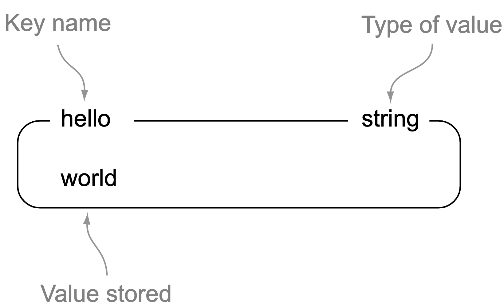
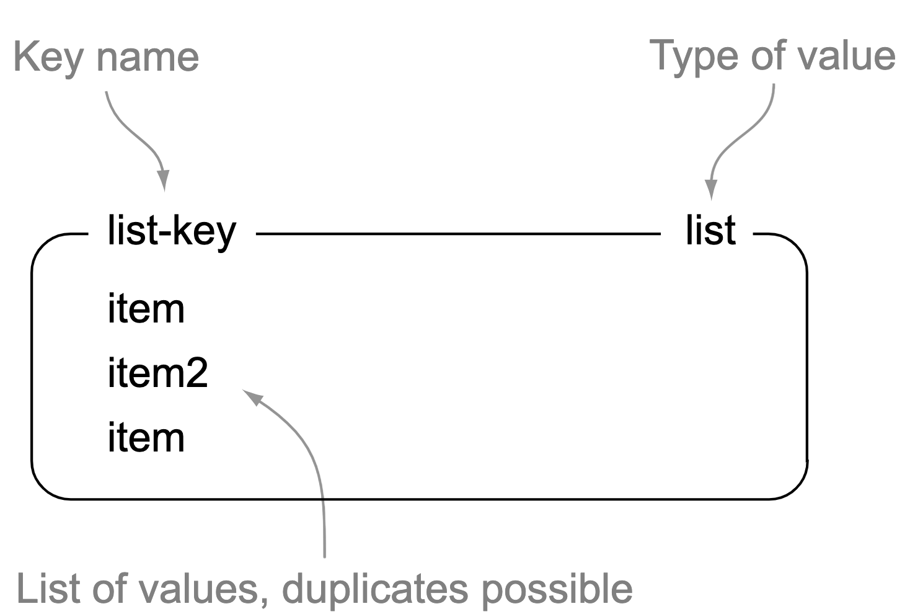
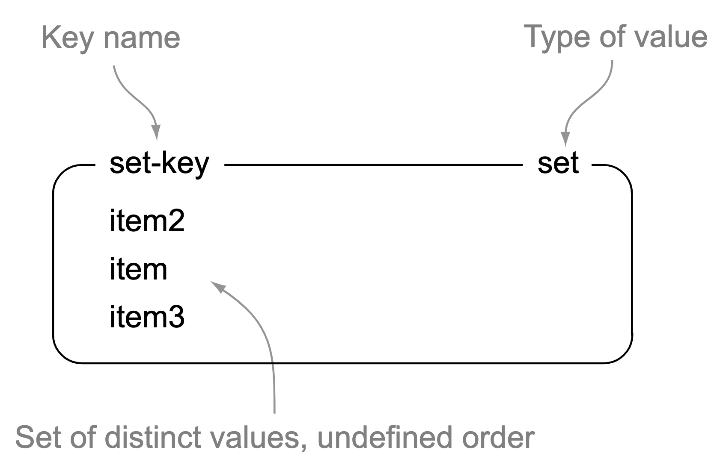
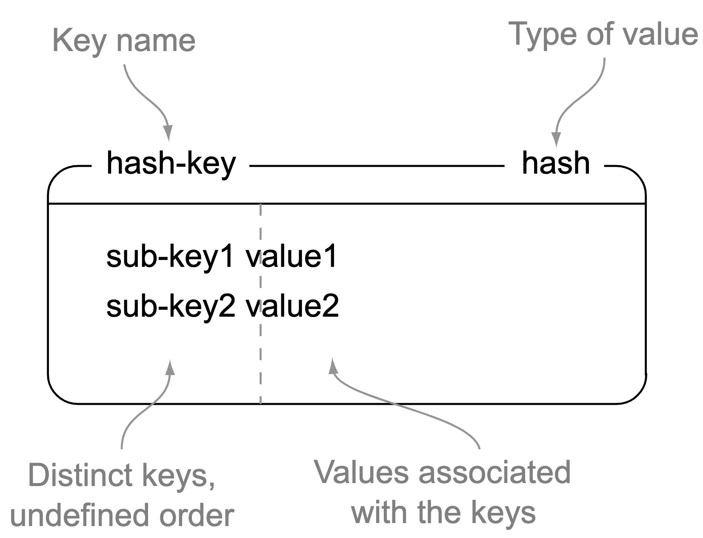
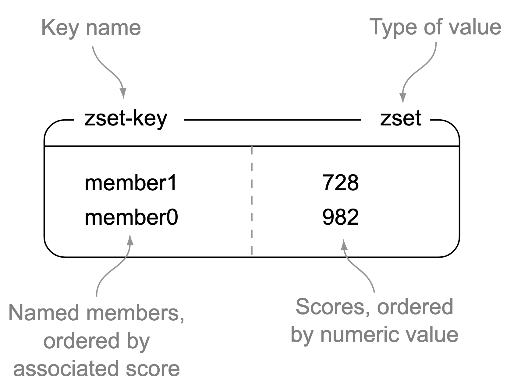

- [Abstract](#abstract)
- [References](#references)
- [Materials](#materials)
- [Features](#features)
- [Install](#install)
  - [Install with docker](#install-with-docker)
- [Sentinel](#sentinel)
- [Cluster](#cluster)
- [Redis Data Types](#redis-data-types)
  - [Strings in Redis](#strings-in-redis)
  - [Lists in Redis](#lists-in-redis)
  - [Sets in Redis](#sets-in-redis)
  - [Hashes in Redis](#hashes-in-redis)
  - [Sorted sets in Redis](#sorted-sets-in-redis)
- [Commands](#commands)
  - [Client/Server](#clientserver)
  - [Database](#database)
  - [Scripts](#scripts)
  - [HyperL­ogLogs](#hyperloglogs)
  - [Strings](#strings)
  - [Lists](#lists)
  - [Sets](#sets)
  - [Sorted Sets](#sorted-sets)
  - [Hashes](#hashes)
  - [Common](#common)
  - [Geo](#geo)
  - [Pub/Sub](#pubsub)
  - [Streams](#streams)
  - [Transaction](#transaction)
- [Caveats](#caveats)
  - [Prevent O(N) command](#prevent-on-command)
  - [redis.conf](#redisconf)
  - [Fail Over](#fail-over)
  - [Monitoring](#monitoring)
  - [Redis for Cache or Persistent Store](#redis-for-cache-or-persistent-store)
- [Advanced](#advanced)
  - [How to debug](#how-to-debug)
  - [Redis Clients](#redis-clients)

----

# Abstract

redis 에 대해 정리한다.

# References

* [Redis in Action @ manning](https://www.manning.com/books/redis-in-action)
  * [src](git@github.com:josiahcarlson/redis-in-action.git)

# Materials

* [[우아한테크세미나] 191121 우아한레디스 by 강대명님](https://www.youtube.com/watch?v=mPB2CZiAkKM) 
* [강대명 <대용량 서버 구축을 위한 Memcached와 Redis>](https://americanopeople.tistory.com/177)
* [대용량 서버 구축을 위한 Memcached와 Redis](http://www.hanbit.co.kr/store/books/look.php?p_code=E1904063627)
* [redis Introduction](https://bcho.tistory.com/654)
* [redis cheatsheet](https://www.cheatography.com/tasjaevan/cheat-sheets/redis/)
* [redis @ github](https://github.com/antirez/redis)
* [try redis](https://try.redis.io/)
  * web 에서 redis 를 실습할 수 있다.
* [redisgate](http://redisgate.kr/redis/introduction/redis_intro.php)
  * 한글 redis 강좌
* [hiredis](https://github.com/redis/hiredis)
  * minimal redis client

# Features

redis 는 REmote dIctionary System 의 약자이다. 

redis 는 disk 에 데이터를 저장할 수 있다. RDB (snapshot), AOF (append olny file) 의 방법이 있다. RDB 는 한번에 메모리의 데이터를 디스크로 저장하는 방법이다. AOF 는 조금씩 디스크에 저장하는 방법이다. 두가지 방법을 적절히 혼합하여 사용하면 좋다. [참고](http://redisgate.kr/redis/configuration/redis_overview.php)

string, set, sorted set, hash, list 등의 datatype 을 지원한다. collection data type (set, sorted set, hash, list) 의 경우 그 개수는 10,000 개 이하가 좋다.

Sentinel 은 redis monitoring tool 이다. redis 의 master, slave 들을 지켜보고 있다가 장애처리를 해준다. `> redis-sentinel sentinel.conf` 와 같이 실행한다.

redis 3.0 부터 cluster 기능을 지원한다.

master 와 여러개의 slave 들로 read replica 구성을 할 수 있다.

# Install

## Install with docker

```bash
$ docker pull redis
$ docker run --rm -p 6379:6379 --name my-redis -d redis
## link volumf of local host
# docker run --name my-redis -d -v /your/dir:/data redis redis-server --appendonly yes
## link volume of other container
# docker run --name my-redis -d --volumes-from some-volume-container redis redis-server --appendonly yes
$ docker exec -it my-redis /bin/bash
> redis-cli

```

# Sentinel

* [sentinel](http://redisgate.kr/redis/sentinel/sentinel.php)
* [twemproxy를 이용한 redis failover @ youtube](https://www.youtube.com/watch?v=xMSVlUnBy6c)
  * twemproxy 와 sentinel 을 이용한 failover 방법을 설명한다. 

----


sentinel 은 Master 와 Redis Slave 를 fail over 처리 한다.
sentinel 은 twemproxy 와 같은 machine 에서 실행해야 한다.
만약 Redis Mater 가 죽으면 twemproxy 의 설정파일을 수정하여
Redis Slave 의 주소를 Redis Master 의 주소로 교체한다.

# Cluster

* [Docker기반 Redis 구축하기 - (10) Redis Cluster Mode 설정하기](https://jaehun2841.github.io/2018/12/03/2018-12-03-docker-10/#docker-entrypointsh)
* [vishnunair/docker-redis-cluster](https://hub.docker.com/r/vishnunair/docker-redis-cluster/)
* [레디스 클러스터 소개](http://redisgate.kr/redis/cluster/cluster_introduction.php)
* [레디스 클러스터 구성](http://redisgate.kr/redis/cluster/cluster_configuration.php)
* [[Redis Documentation #2] 레디스 클러스터 튜토리얼](https://medium.com/garimoo/redis-documentation-2-%EB%A0%88%EB%94%94%EC%8A%A4-%ED%81%B4%EB%9F%AC%EC%8A%A4%ED%84%B0-%ED%8A%9C%ED%86%A0%EB%A6%AC%EC%96%BC-911ba145e63)
* [Redis - Cluster 설정](https://daddyprogrammer.org/post/1601/redis-cluster/)

----

* Redis 3 부터 cluster mode 를 지원한다.
* Cluster Mode 에서는 Redis Sentinel 의 도움없이 Cluster 자체적으로 Failover 를
  진행한다.
* Cluster Mode 에서는 Master-Slave 노드 구조를 가질 수 있고, 노드 간 Replication
  을 지원한다.
* Cluster Mode 에서는 redis key 의 HashCode 에 대해 CRC16 의 16384 modules (key
  % 16384) 연산을 실행 Auto Sharding을 지원한다.
* Application Sharding 이 필요없기 때문에, Spring-Data-Redis 사용이 가능하다.

```bash
$ docker pull vishnunair/docker-redis-cluster:latest
$ docker run --rm -d -p 6000:6379 -p 6001:6380 -p 6002:6381 -p 6003:6382 -p 6004:6383 -p 6005:6384 --name my-redis-cluster vishnunair/docker-redis-cluster
$ docker exec -it my-redis-cluster redis-cli
# 127.0.0.1:6379> SET helloworld 1
# OK
# 127.0.0.1:6379> SET helloworld 2
# OK
# 127.0.0.1:6379> GET helloworld
# "2"
```

# Redis Data Types

## Strings in Redis

* [1.2.1 Strings in Redis](https://redis.com/ebook/part-1-getting-started/chapter-1-getting-to-know-redis/1-2-what-redis-data-structures-look-like/1-2-1-strings-in-redis/)



## Lists in Redis

* [1.2.2 Lists in Redis](https://redis.com/ebook/part-1-getting-started/chapter-1-getting-to-know-redis/1-2-what-redis-data-structures-look-like/1-2-2-lists-in-redis/)



## Sets in Redis

* [1.2.3 Sets in Redis](https://redis.com/ebook/part-1-getting-started/chapter-1-getting-to-know-redis/1-2-what-redis-data-structures-look-like/1-2-3-sets-in-redis/)



## Hashes in Redis

* [1.2.4 Hashes in Redis](https://redis.com/ebook/part-1-getting-started/chapter-1-getting-to-know-redis/1-2-what-redis-data-structures-look-like/1-2-4-hashes-in-redis/)



## Sorted sets in Redis

* [1.2.5 Sorted sets in Redis](https://redis.com/ebook/part-1-getting-started/chapter-1-getting-to-know-redis/1-2-what-redis-data-structures-look-like/1-2-5-sorted-sets-in-redis/)



# Commands

## Client/Server

| Command | Description | Exapmle |
|---------|-------------|---------|
| `SELECT`  | Set current database by index | `> SELECT 8` |

## Database

| Command | Description | Exapmle |
|---------|-------------|---------|
| `DUMP` | Serialise item | |
| `RESTORE` | Deseri­alise | |

## Scripts

| Command | Description | Exapmle |
|---------|-------------|---------|
| `EVAL` | Run | |
| `EVALSHA` | Run cached | |

## HyperL­ogLogs

HyperLogLog 는 집합의 원소의 개수를 추정하는 방법으로 2.8.9 에 추가되었다.

| Command | Description | Exapmle |
|---------|-------------|---------|
| `PFADD` | add elements | `> PFADD k1 e1 e2` |
| `PFCOUNT` | get counts of key | `> PFCOUNT k1` |
| `PFMERGE` | merge keys | `> PFMERGE dstkey k1 k2` |

## Strings

* [STRINGS Intro](http://redisgate.kr/redis/command/strings.php)

----

key 와 value 가 일 대 일 관계이다. 한편, Lists, Sets, Sorted Sets, Hashes 는 일 대 다 관계이다.

* SET: `SET, SETNX, SETEX, SETPEX, MSET, MSETNX, APPEND, SETRANGE`
* GET: `GET, MGET, GETRANGE, STRLEN`
* INCR: `INCR, DECR, INCRBY, DECRBY, INCRBYFLOAT`

## Lists

* SET (PUSH): `LPUSH, RPUSH, LPUSHX, RPUSHX, LSET, LINSERT, RPOPLPUSH`
* GET: `LRANGE, LINDEX, LLEN`
* POP: `LPOP, RPOP, BLPOP, BRPOP`
* REM: `LREM, LTRIM`
* BLOCK: `BLPOP, BRPOP, BRPOPLPUSH`

## Sets

* SET: `SADD, SMOVE`
* GET: `SMEMBERS, SCARD, SRANDMEMBER, SISMEMBER, SSCAN`
* POP: `SPOP`
* REM: `SREM`
* 집합연산: `SUNION, SINTER, SDIFF, SUNIONSTORE, SINTERSTORE, SDIFFSTORE`

## Sorted Sets

* [ZSETS internals](redis_code_tour.md#zsets-internals)
* [Redis Sorted Set](https://jupiny.com/2020/03/28/redis-sorted-set/)

------

* SET: `ZADD`
* GET: `ZRANGE, ZRANGEBYSCORE, ZRANGEBYLEX, ZREVRANGE, ZREVRANGEBYSCORE, ZREVRANGEBYLEX, ZRANK, ZREVRANK, ZSCORE, ZCARD, ZCOUNT, ZLEXCOUNT, ZSCAN`
* POP: `ZPOPMIN, ZPOPMAX`
* REM: `ZREM, ZREMRANGEBYRANK, ZREMRANGEBYSCORE, ZREMRANGEBYLEX`
* INCR: `ZINCRBY`
* 집합연산: `ZUNIONSTORE, ZINTERSTORE`

## Hashes

* SET: `HSET, HMSET, HSETNX`
* GET: `HGET, HMGET, HLEN, HKEYS, HVALS, HGETALL, HSTRLEN, HSCAN, HEXISTS`
* REM: `HDEL`
* INCR: `HINCRBY, HINCRBYFLOAT`

## Common

5 가지 Data type 에 관계없이 모든 Key 적용되는 명령이다.

* Key 확인, 조회: `EXISTS, KEYS, SCAN, SORT`
* Key 이름 변경: `RENAME, RENAMENX`
* Key 자동 소멸 관련: `EXPIRE, EXPIREAT, TTL, PEXPIRE, EXPIREAT, PTTL, PERSIST`
* 정보 확인: `TYPE, OBJECT`
* 샘플링: `RANDOMKEY`
* Data 이동: `MOVE, DUMP, RESTORE, MIGRATE`

## Geo

3.2 에 도입된 기능이다. 두 지점/도시의 경도(세로선/longitude)와 위도(가로선/latitude)를 입력해서 두 지점의 거리를 구한다.

* 경도/위도 입력: `GEOADD`
* 경도/위도 조회: `GEOPOS`
* 거리 조회: `GEODIST`
* 주변 지점 조회: `GEORADIUSBYMEMBER, GEORADIUS`
* 해시값 조회: `GEOHASH`
* 범위 조회: `ZRANGE`
* 삭제 조회: `ZREM`
* 개수 조회: `ZCARD`

## Pub/Sub

Pub 으로 message 를 보내고 Sub 으로 message 를 받는다.

## Streams

로그 데이터를 처리하기 위해서 5.0 에 도입된 데이터 타입이다.

## Transaction

* [[redis] 트랜잭션(Transaction) - 이론편](https://sabarada.tistory.com/177)

----

Redis 의 Transaction 은 `MULTI, ..., EXEC` 로 사용한다. Roll Back 을 지원하지 않는다.

```r
# Normal transaction
>> MULTI
"OK"
>> SET SABARADA BLOG
"QUEUED"
>> SET KAROL BLOG
"QUEUED"
>> GET SABARADA # GET will be queued
"QUEUED"
>> EXEC         # Execute queued commands
1) "OK"
2) "OK"
3) "BLOG"       # Get was executed
```

`MULTI, ..., DISCARD` 를 사용하면 queued commands 를 취소할 수 있다.

```r
>> MULTI
"OK"
>> SET SABARADA BLOG
"QUEUED"
>> SET KAROL BLOG
"QUEUED"
>> GET SABARADA
"QUEUED"
>> DISCARD
"OK"
```

queued commands 중 일부가 지원하지 않는 command 라면 Discard 된다.

```r
>> MULTI
"OK"
>> SET SABARADA 4
"QUEUED"
>> HSET SABARADA 2 3
"QUEUED"
>> DD HKD
(error) unknown command `DD`, with args beginning with: `HKD`, 
>> EXEC
(error) Transaction discarded because of previous errors.
```

잘못된 Data Type 의 command 를 사용한 경우는 잘 못된 부분을 제외하고 실행된다.
`SABARADA` 는 strings type 이기 때문에 `HSET SABARADA 2 3` 는 건너뛴다.

```r
>> MULTI
"OK"
>> HSET SABARADA 2 3
"QUEUED"
>> SET SABARADA 4
"QUEUED"
>> EXEC
ERROR: Something went wrong.
```

`WATCH` 를 이용하면 특정 변수에 lock 을 설정할 수 있다.

```r
>> WATCH SABARADA
"OK"
>> MULTI
"OK"
>> SET SABARADA 3
"QUEUED"
>> EXEC
1) "OK"
```

`WATCH` 를 특정 변수에 사용하고 그 변수를 변경했다면 
이후 Transaction 에서 그 변수를 변경할 수 없다.

```r
>> WATCH KAROL
"OK"
>> SET KAROL 7
"OK"
>> MULTI
"OK"
>> SET KAROL 5
"QUEUED"
>> EXEC
(nil)
```

`WATCH` 를 특정 변수에 사용하고 그 변수를 변경한다.
그리고 `UNWATCH` 를 사용한다. 이후 Transaction 에서
그 변수를 변경할 수 있다.

```r
>> WATCH KAROL
"OK"
>> SET KAROL 8
"OK"
>> UNWATCH
"OK"
>> MULTI
"OK"
>> SET KAROL 4
"QUEUED"
>> EXEC 
1) "OK"
```

`WATCH` 를 특정 변수에 사용하고 그 변수를 변경한다.
이후 첫번째 Transaction 에서 그 변수를 변경하는 것을 실패한다.
이때 `UNWATCH` 가 묵시적으로 호출된다.
이후 두번째 Transaction 에서 그 변수를 변경할 수 있다.

```r
>> WATCH KAROL
"OK"
>> SET KAROL 22
"OK"
>> MULTI
"OK"
>> SET KAROL 11
"QUEUED"
>> EXEC
(nil)
>> MULTI
"OK"
>> SET KAORL 11
"QUEUED"
>> EXEC
1) "OK"
```

# Caveats

## Prevent O(N) command

O(N) command 는 피하자.

Redis 는 single thread 이다. 한번에 하나의 command 를 처리한다. 따라서 하나의 command 를 수행하는데 시간이 오래걸린다면 그 뒤의 command 는 latency 가 증가된다.

예를 들어 list 의 모든 데이터를 지운다고 해보자. 아이템의 개수가 많다면 system 의 latency 가 증가할 수 밖에 없다. 

## redis.conf

* Maxclient 는 50,000
* RDB/AOF 는 끄자. 보다 안정적이다.
* keys command 는 사용못하게 하자. AWS 는 이미 그렇게 하고 있다. 
* 99% 의 서비스가 keys 혹은 RDB/AOF 때문에 발생한다. 그래도 RDB/AOF 가 필요하다면 replica 만 켠다.
* client-output-buffer-limit
  * Redis 는 buffer limit 이 넘어간 client 의 접속을 끊는다. 

## Fail Over

* coordinator (zookeeper, etcd, consul) 에 redis 를 등록해두고 fail over 처리한다. 특정 redis 가 죽으면 coordinator 가 application server 에게 notify 해준다. 
* 특정 vip 를 redis primary 에 할당한다. redis primary 가 fail 하면 다른 redis 에 그 vip 를 할당한다.
* 특정 vip 를 redis primary 에 할당한다. redis primary 가 fail 하면 다른 redis 에 그 DNS 를 할당한다. DNS caching 을 유의해야 한다. AWS 는 DNS 기반으로 Fail Over 하고 있다.

## Monitoring

RedisInfo 를 통해서 얻을 수 있다.

* RSS (Resident Segment Set) : Physical Memory Size
* Used Memory
* Connection Number
  * Redis 는 Single Thread Server 이다. 접속을 자주 끊고 맺는지 확인해야 한다.
* 초당 처리수

그 밖의 기본 정보. 

* CPU
* Disk
* Network RX/TX

## Redis for Cache or Persistent Store

Redis 를 Cache 로 사용한다면 대부분 큰 문제는 없다. Redis 가 죽어도 서비스의 지장은 없기 때문이다.

Redis 를 Persistent Store 로 사용한다면 얘기가 달라진다. Replica 들은 RDB/AOF 를 적용해서 backup 해야 한다.

# Advanced

## How to debug

* [Set up vscode debug](#set-up-vscode-debug)

## Redis Clients

* [RedisInsight](https://github.com/RedisInsight/RedisInsight)
