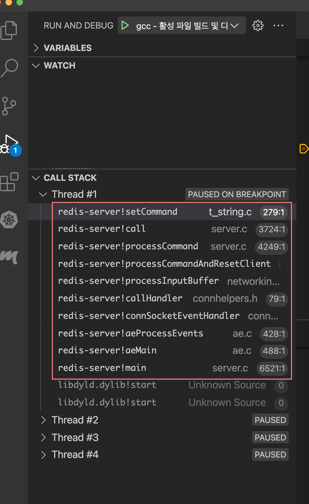

- [Abstract](#abstract)
- [References](#references)
- [Set up vscode debug](#set-up-vscode-debug)
- [Mostly Single Threaded](#mostly-single-threaded)
- [RedisFork](#redisfork)
- [ZSETS internals](#zsets-internals)

----

# Abstract

Redis 코드를 분석해서 정리한다.

# References

* [Redis 다중 스레드 네트워크 모델이 완전히 공개되었습니다.](https://strikefreedom.top/multiple-threaded-network-model-in-redis#toc-head-21)
* [Redis @ github](https://github.com/redis/redis)
* [Redis 소스를 분석해보자.](https://dol9.tistory.com/188)

# Set up vscode debug

* [redis debugging in vscode](https://github.com/wenfh2020/youtobe/blob/master/redis-debug.md)

다음과 같은 파일을 `~/.vscode` 에 생성한 후 디버깅하자. `"stopAtEntry": true` 때문에 break point 를 설정하지 않아도 entrypoint 에서 정지할 것이다.

> `~/.vscode/launch.json`

```json
{
    // Use IntelliSense to learn about possible attributes.
    // Hover to view descriptions of existing attributes.
    // For more information, visit: https://go.microsoft.com/fwlink/?linkid=830387
    "version": "0.2.0",
    "configurations": [
        
        {
            "name": "lldb debug",
            "type": "cppdbg",
            "request": "launch",
            "program": "${workspaceFolder}/src/redis-server",
            "args": [
                "redis.conf"
            ],
            "stopAtEntry": true,
            "cwd": "${workspaceFolder}",
            "environment": [],
            "externalConsole": false,
            "MIMode": "lldb",
            "preLaunchTask": "shell"
        }
    ]
}
```

> `~/.vscode/task.json`

```json
{
    "tasks": [
        {
            "type": "shell",
            "label": "shell",
            "command": "/usr/bin/make",
        }
    ],
    "version": "2.0.0"
}
```

# Mostly Single Threaded

Redis 는 command 를 Single Thread 에서 처리한다. 이것은 Atomicity 를 보장해준다. Multi Thread 기능이 추가되었긴 하지만 이것은 I/O Multiplexing 을 위한 것이다. 예를 들어 여러 쓰레드에서 socket 을 통해 읽은 command 들은 Main thread 에서만 처리된다. 

다음은 `src/redis-cli` 로 접속하고 `SET hello 1` 을 수행했을 때 `src/redis-server` 의 call stack 의 모습이다.



# RedisFork

Redis 는 AOF/RDB 를 수행할 때 `fork()` 를 호출한다. 이때 memory copy 가 발생할 것이다. 따라서 AOF/RDB 를 도입한다면 항상 Physical Memory 가 충분한지 모니터링해야 한다.

```c
// src/server.c
int redisFork(int purpose) {
    if (isMutuallyExclusiveChildType(purpose)) {
        if (hasActiveChildProcess())
            return -1;

        openChildInfoPipe();
    }
...
}

// src/aof.c
int rewriteAppendOnlyFileBackground(void) {
    pid_t childpid;

    if (hasActiveChildProcess()) return C_ERR;
    if (aofCreatePipes() != C_OK) return C_ERR;
    if ((childpid = redisFork(CHILD_TYPE_AOF)) == 0) {
        char tmpfile[256];
...
}

// src/rdb.c
int rdbSaveBackground(char *filename, rdbSaveInfo *rsi) {
    pid_t childpid;

    if (hasActiveChildProcess()) return C_ERR;

    server.dirty_before_bgsave = server.dirty;
    server.lastbgsave_try = time(NULL);

    if ((childpid = redisFork(CHILD_TYPE_RDB)) == 0) {
        int retval;
...    
}
```

# ZSETS internals

* [Redis SKIP List of  ZSETS (SORTED SETS) @ redisgate](http://redisgate.kr/redis/configuration/internal_skiplist.php)
* [DesignSkiplist @ learntocode](https://github.com/iamslash/learntocode/blob/master/leetcode2/DesignSkiplist/README.md)
  * Designing Skip List 

---

Redis 의 ZSETS 는 [skip list](https://github.com/iamslash/learntocode/blob/master/fundamentals/list/skiplist/README.md) 를 이용하여 구현함.
