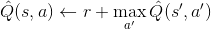
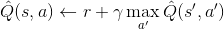
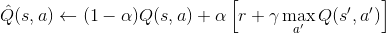
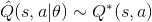
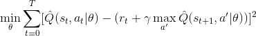

- [Abstract](#abstract)
- [Materials](#materials)
- [Dummy Q-learning](#dummy-q-learning)
- [Q-learning exploit, exploration, discounted reward](#q-learning-exploit-exploration-discounted-reward)
- [Q-learning in non-deterministic world](#q-learning-in-non-deterministic-world)
- [Q-Network](#q-network)
- [DQN NIPS 2013](#dqn-nips-2013)
- [DQN Nature 2015](#dqn-nature-2015)
- [Policy Gradient](#policy-gradient)
- [A2C (Advantaged Actor-Critic)](#a2c-advantaged-actor-critic)
- [A3C (Async Advantaged Actor-Critic)](#a3c-async-advantaged-actor-critic)
 
----

# Abstract

reinforcement learning 에 대해 정리한다.

# Materials

* [모두를 위한 딥러닝 @ github](https://hunkim.github.io/ml/)
  * 김훈님의 동영상 강좌이다. DQN 까지 쉽게 설명한다.
* [RLCode와 A3C 쉽고 깊게 이해하기 @ youtube](https://www.youtube.com/watch?v=gINks-YCTBs)
  * RLCode 의 리더 이웅원님의 동영상 강좌이다. 강화학습의 Policy Gradient, A3C 등을 설명한다.
  * [slide](https://www.slideshare.net/WoongwonLee/rlcode-a3c)
* [파이썬과 케라스로 배우는 강화학습 @ wikibooks](http://wikibook.co.kr/reinforcement-learning/)
  * 이웅원님이 저술한 강화학습 책. 모두를 위한 딥러닝을 모두 보고 책을 읽는 것이 좋다.
  * [draft @ gitbooks](https://dnddnjs.gitbooks.io/rl/)
  * [src](https://github.com/rlcode/reinforcement-learning)
* [Reinforcement Learning: An Introduction by Richard S. Sutton and Andrew G. Barto](https://tensorflowkorea.files.wordpress.com/2017/11/bookdraft2017nov5.pdf)
  * 강화학습의 바이블
* [deeplearning reinforcement learning nanodegree @ udacity](https://www.udacity.com/course/deep-reinforcement-learning-nanodegree--nd893) 
  * [preview @ udacity](https://www.udacity.com/course/ud893-preview) 
  * [src](https://github.com/udacity/deep-reinforcement-learning)
* [RL Course by David Silver @ youtube](https://www.youtube.com/watch?v=2pWv7GOvuf0&list=PLqYmG7hTraZDM-OYHWgPebj2MfCFzFObQ)
  * Policy Gradient 의 자세한 설명이 있음

# Dummy Q-learning

현재의 상태가 있다. 그리고 상태를 변경할 액션이 있다. 액션은 현재 상태를 다음 상태로 변경하고 보상을 준다. 보상이 많이 주어지는 방향으로 상태를 변경해 가는 것이 강화 학습의 핵심이다. 이것을 dummy q learning 이라고 하고 다음과 같이 수식으로 표현한다.



```latex
\hat{Q}(s,a) \leftarrow r + \max_{a{}'} \hat{Q}(s{}',a{}') 
```

다음은 openai gym 으로 frozenlake 를 dummy q learning 으로 구현한 것이다.

```python

```

# Q-learning exploit, exploration, discounted reward

기본적으로 액션을 선택할 때 보상이 많이 주어지는 방향을 고려한다. 이것을 exploit 이라고 한다. 그러나 경우에 따라서 보상이 많은 방향이 아닌 것을 선택해야 할 필요가 있다. 이것을 exploration 이라고 한다. 상태가 점점 변화될 때마다 보상의 가중치를 낮출 필요가 있다. 이것을 discounted future reward 라고 한다. 이것들을 다음과 같이 수식으로 표현할 수 있다.



```latex
\hat{Q}(s,a) \leftarrow r + \gamma \max_{a{}'} \hat{Q}(s{}',a{}') 
```

다음은 openai gym, frozenlake 를 이용하여 q learning with exploit vs exploration, discounted future reward 을 구현한 것이다.

```python
```

# Q-learning in non-deterministic world

액션의 결과가 정해져 있는 세계를 deterministic world 라고 한다. 액션의 결과가 정해져 있지 않는 세계를 non-deterministic world 라고 한다. non-deterministic world 의 경우 learning rate 를 도입하여 앞으로 보상이 많은 방향만 선택하는 것을 방지해보자. 이것을 다음과 같이 수식으로 표현할 수 있다.



```latex
\hat{Q}(s,a) \leftarrow (1-\alpha )Q(s,a) + \alpha \left [ r + \gamma \max_{a{}'} Q(s{}',a{}')  \right ]
```

다음은 openai gym, frozenlake 를 이용하여 non-deterministic q learning 을 구현한 것이다.

```python
```

# Q-Network

Q-table 를 사용한 강화학습은 메모리를 너무 많이 필요로 한다. 상태를 입력으로 하고 액션을 출력으로 하는 NN 을 제작하여 Q-table 대신 사용하자. 

NN 을 통해 예측한 값(액션)이 최적의 값(액션)에 수렴하면 학습이 성공한 것이다. 이것을 수식으로 표현하면 다음과 같다. `^` 은 예측을 의미하고 `*` 는 최적을 의미한다.



```latex
\hat{Q}(s,a|\theta) \sim  Q^{*}(s, a)
```

예측한 값을 최적의 값에 수렴시키기 위해 두 값에 대한 RMS 를 최소화 하는 `theta` 즉 `W` 를 학습을 통해 찾는다.



```latex
\min_{\theta} \sum_{t=0}^{T}  [ \hat{Q}(s_{t},a_{t} | \theta) - ( r_{t} + \gamma \max_{a{'}} \hat{Q}(s_{t+1},a{'} | \theta) ) ]^{2}
```

이때 non-determinic world 를 고려하기 위해 learning rate 를 도입할 필요는 없다. NN 는 non-deterministic world 가 반영된다.

다음은 q-network 를 openai 의 cartpole 과 tensorflow 를 이용하여 구현한 것이다.

```python
```

그러나 q-network 는 `Correlations between samples, Non-stationary targets` 때문에 잘 동작하지 않는다.

# DQN NIPS 2013

q-network 에서 replay memory 가 적용된 것이다.

[Playing Atari with Deep Reinforcement Learning](https://arxiv.org/abs/1312.5602)

다음은 q-network with replay 를 구현한 것이다.

```py
```

# DQN Nature 2015

DQN Nips 2013 에서 double DQN 이 적용된 것이다.

[Human-level control through deep reinforcement
learning](https://storage.googleapis.com/deepmind-media/dqn/DQNNaturePaper.pdf)


다음은 q-network with replay, with target 을 구현한 것이다.

```python
```

# Policy Gradient

[Policy Gradient Methods for
Reinforcement Learning with Function
Approximation](https://papers.nips.cc/paper/1713-policy-gradient-methods-for-reinforcement-learning-with-function-approximation.pdf)

[Simple Statistical Gradient-Following Algorithms for Connectionist Reinforcement Learning](http://www-anw.cs.umass.edu/~barto/courses/cs687/williams92simple.pdf)

# A2C (Advantaged Actor-Critic)

Actor 는 Policy-iteration 이다. Critic 은 Value-iteration 이다.

# A3C (Async Advantaged Actor-Critic)

A2C 에 Multithread 를 도입하여 데이터의 관계가 밀접하지 않게 해보자. 