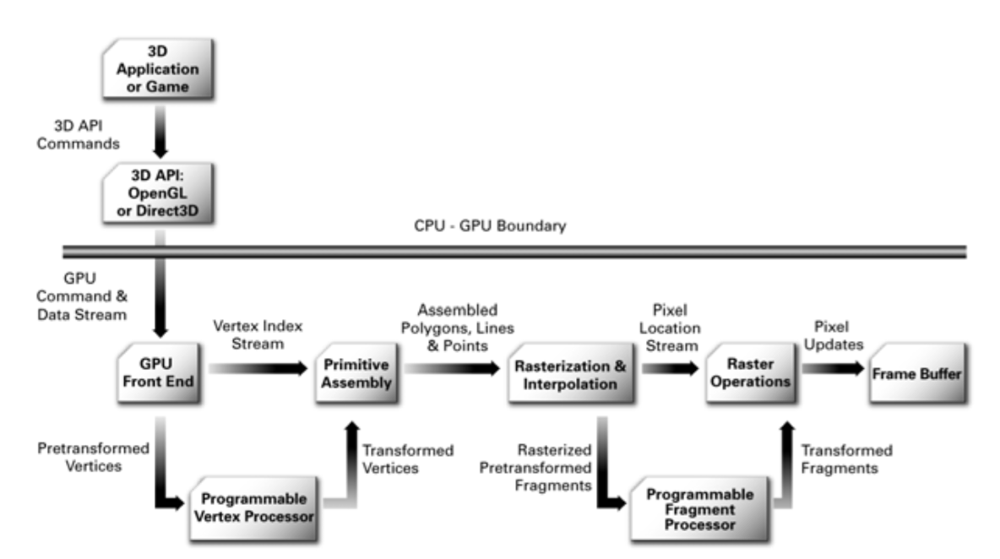

# Abstract

- 렌더링 파이프라인에대해 정리한다.

# Learning Material

- [3차원 그래픽스(게임 프로그래밍을위한)](http://media.korea.ac.kr/book/)
  - 3차원 그래픽스 기반이론을 매우 자세히 풀어썼다. 저자의
    홈페이지에서 제공하는 슬라이드는 각종 그림과 수식을 가득 포함하고 있다.
  - [3D Graphics for Game Programming lecture notes](3dgraphics_for_game_programming_lecture_notes/)
- [The Cg Tutorial, Chapter 1: Introduction](http://download.nvidia.com/developer/cg/Cg_Tutorial/Chapter_1.pdf)를 
  읽고 정리한다. 다음의 그림들을 보면서 rendering pipeline을 overview해보자.
- [scratchapixel](http://www.scratchapixel.com/)
  - 밑바닥부터 설명하는 computer graphics

# The Graphics Hardware Pipeline
  
- The Programmable Graphics Pipeline

- programmable vertex processor flow chart

- programmable fragment processor flow chart

- standard opengl and direct3d raster operations

# unity3d rendering pipeline

- [Optimizing graphics rendering in Unity games](https://unity3d.com/kr/learn/tutorials/temas/performance-optimization/optimizing-graphics-rendering-unity-games?playlist=44069)와
  [unity3d rendering pipeline](https://www.youtube.com/watch?v=qHpKfrkpt4c)를 읽고 정리한다.
- a.obj를 unity3d에서 rendering한다고 해보자. 먼저 CPU에서 batch를 적당히 구성하여 
  GPU에게 전송한다. GPU는 batch의 command들을 차례대로 실행한다. 이때 setpass call과 draw call등을
  차례대로 실행한다. a.obj에 맵핑되어 있는 vertex shader, fragment shader를 차례대로 실행하고
  raster operation을 진행한다. raster operation에서 scissor test, alpha test, sencil test,
  depth test, blending등을 수행후 framebuffer에 기록한다. framebuffer를 flipping하여
  화면에 픽셀들을 뿌려준다.
- CPU는 GPU에게 command들의 덩어리를 전송한다. 이때 전송되는 하나의 단위를 
  batch라고 한다. batch는 draw call, set VB, set IB, 
  Set Transform, Set Shader, Set Texture, Set Blending, 
  Set Z enable 등등을 포함한다.
- draw call은 opengl의 경우 glDrawArrays, glDrawElements 과 같은
  함수 호출과 같다. directx의 경우 gDevice->Draw* 함수 호출과 같다.
- Set Shader, Set Texture, Set Blending, Set Z enable등을 
  SetPass Call이라고 한다. 즉 SetPass call은 render state을 
  바꾸는 command들이다.
- 10개의 오브젝트가 있다고 해보자. 이때 모두 같은 머터리얼을 사용한다면
  draw call이 10개이고 setpass call은 1개이기 때문에 batch는 11개이다.
  하지만 모두 다른 머터리얼을 사용한다면 draw call이 10개이고 setpass call은
  10개이기 때문에 batch는 20개이다. 
- 만약 10개의 오브젝트를 rendering하기 위해 1개의 batch에 command들을 
  잘 구성할 수 있다면 10개의 batch보다 효율적이다. 이러한 행위를 batching이라고 한다.
- GPU가 CPU로 부터 넘겨받은 batch의 command에 SetPass Call포함되어 있다면 GPU는 
  renderstate을 갱신하고 Draw Call이 포함되어 있다면 renderstate에 설정된
  shader에 의해 mesh를 rendering한다.
- CPU입장에서 GPU에게 전송하는 command들중 setpass call이 가장 비용이 크다.
  따라서 CPU bound인 경우 SetPass call command를 줄이는 것은 성능향상의 
  가장 좋은 방법이다.
