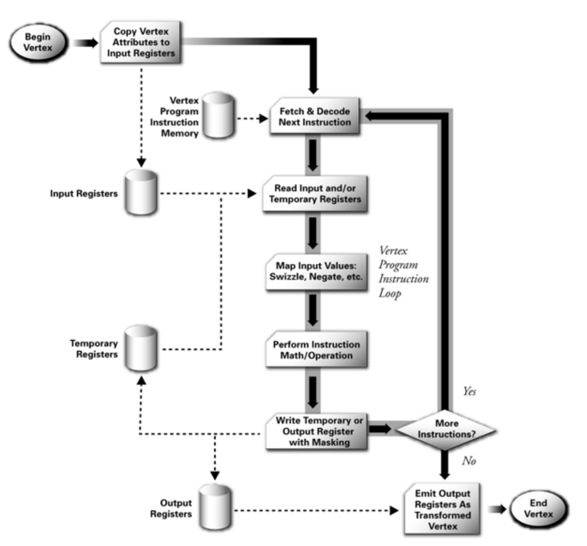

- [Abstract](#abstract)
- [Learning Material](#learning-material)
- [Simple Rendering Pipeline](#simple-rendering-pipeline)
- [Advanced Rendering Pipeline](#advanced-rendering-pipeline)
- [Unity3d Rendering Pipeline](#unity3d-rendering-pipeline)

-------------------------------------------------------------------------------

# Abstract

- 렌더링 파이프라인에대해 정리한다.

# Materials

- [Unity3d Rendering Pipelines](https://catlikecoding.com/unity/tutorials/rendering/)
- [GPU how to work](http://pixeljetstream.blogspot.kr/2015/02/life-of-triangle-nvidias-logical.html)
  - GPU가 어떻게 작동하는 가를 렌더링 파이프 라인과 함께 설명함
- [3차원 그래픽스(게임 프로그래밍을위한)](http://media.korea.ac.kr/book/)
  - 3차원 그래픽스 기반이론을 매우 자세히 풀어썼다. 저자의
    홈페이지에서 제공하는 슬라이드는 각종 그림과 수식을 가득 포함하고 있다.
  - [3D Graphics for Game Programming lecture notes](../gamegraphics/3dgraphics_for_game_programming_lecture_notes/)
- [The Cg Tutorial, Chapter 1: Introduction](http://download.nvidia.com/developer/cg/Cg_Tutorial/Chapter_1.pdf)를 
  읽고 정리한다. 다음의 그림들을 보면서 rendering pipeline을 overview해보자.
- [scratchapixel](http://www.scratchapixel.com/)
  - 밑바닥부터 설명하는 computer graphics

# Simple Rendering Pipeline

rendering pipeline을 간단히 4단계로 생각해 볼 수 있다.  vertex
processing은 transformation, animation, lighting을 처리하고
programmable하다.  rasterization은 fragment를 만들어
낸다. programmable하지 못하고 hardwired하다.  fragment processing은
lighting, texturing을 처리하고 programmable하다.  output merging은
z-buffering, alpha blending, z-culling등 이 수행되고 hardwired하다.

# Advanced Rendering Pipeline
  
다음은 nvidia cg tutorial에 나와 있는 rendering pipeline들이다.  
  
- The Programmable Graphics Pipeline

- standard opengl and direct3d raster operations

- programmable vertex processor flow chart

- programmable fragment processor flow chart

# Unity3d Rendering Pipeline

- [Optimizing graphics rendering in Unity games](https://unity3d.com/kr/learn/tutorials/temas/performance-optimization/optimizing-graphics-rendering-unity-games?playlist=44069)와
  [unity3d rendering pipeline](https://www.youtube.com/watch?v=qHpKfrkpt4c)를 읽고 정리한다.
- a.obj를 unity3d에서 rendering한다고 해보자. 먼저 CPU에서 여러 command 들을 하나의 batch 에 적당히 구성하여 
  GPU에게 전송한다. 이때 하나의 batch 는 render-state 을 세팅하는 command들의 모임인 SetPass Call 과 오브젝트들을 그리는 Draw Call 로 구성된다.
- SetPass Call 은 set VB, set IB, 
  Set Transform, Set Shader, Set Texture, Set Blending, 
  Set Z enable 등등을 포함한다.
- Draw Call 은 설정된 render-state 으로 오브젝트를 렌더링한다. opengl 의 경우 glDrawArrays, glDrawElements 과 같은
  함수 호출에 의해, directx의 경우 gDevice->Draw* 함수 호출에 의해 만들어 진다.
- 하나의 SetPass call 과 하나의 Draw call 은 하나의 batch 로 그룹화될 수 있다. 만약 Draw call 이 10개라면 batch 는 10개가 된다. 이때 10 개의 오브젝트들에 대해 SetPass call 을 잘 구성해서 하나의 Draw call 로 rendering 할 수 있다면 batch 는 한개로 줄어든다. 이렇게 하나의 batch 로 줄이는 행위를 batching 이라고 한다.
- 앞서 언급한 바와 같이 10개의 오브젝트가 하나의 머터리얼을 사용한다면 `scene view | stats` 에서 `SetPass calls` 는 1개, `batches` 는 1개, `Saved by batching` 은 9개가 된다.
- CPU입장에서 GPU에게 전송하는 command 들 중 SetPass Call 이 가장 비용이 크다.
  따라서 CPU bound인 경우 SetPass Call 을 줄이는 것은 성능향상의 
  가장 좋은 방법이다.
