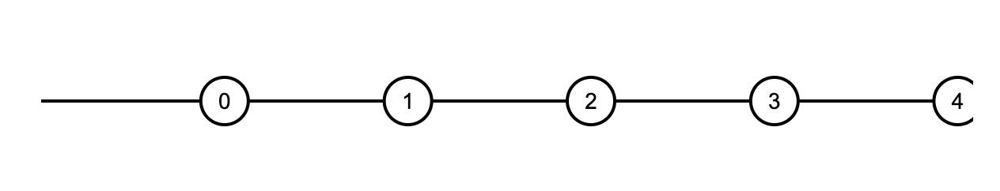
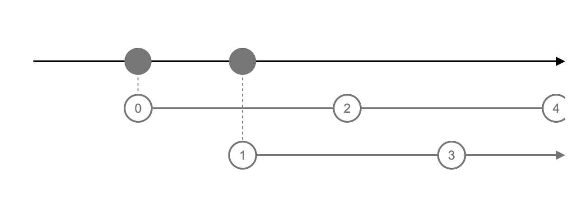
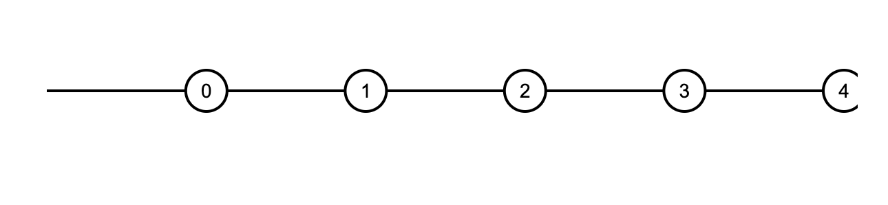
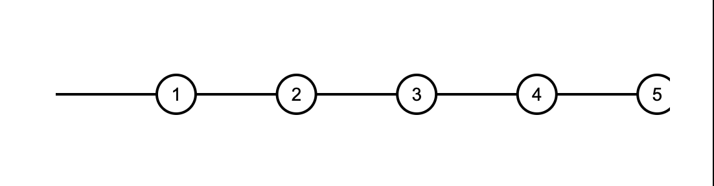

- [References](#references)
- [Materials](#materials)
- [Basic](#basic)
- [Operators](#operators)
  - [Creation Operators](#creation-operators)
  - [Join Creation Operators](#join-creation-operators)
  - [Transformation Operators](#transformation-operators)
  - [Filtering Operators](#filtering-operators)
  - [Join Operators](#join-operators)
  - [Multicasting Operators](#multicasting-operators)
  - [Error Handling Operators](#error-handling-operators)
  - [Utility Operators](#utility-operators)
  - [Conditional and Boolean Operators](#conditional-and-boolean-operators)
  - [Mathematical and Aggregate Operators](#mathematical-and-aggregate-operators)
- [Advanced](#advanced)
  - [Higher-order observable](#higher-order-observable)
  - [merge vs mergeAll vs mergeMap vs mergeMapTo](#merge-vs-mergeall-vs-mergemap-vs-mergemapto)

---

# References

* [rxjs](https://rxjs.dev/guide/operators)
* [Rx Visualizer](https://rxviz.com/)
  * 킹왕짱 rx 시각화 툴
* [rxmarbles](https://rxmarbles.com/)
  * rx.js 를 marble diagram 으로 파악할 수 있다. 그러나 컨텐츠가 완벽하지 않다.
* [jsfiddle](https://jsfiddle.net/)
  * javascript web-ide
* [stackblitz](https://stackblitz.com/edit/rxjs-6fukuf?devtoolsheight=60)
  * rx.js web-ide

# Materials

* [rx.js @ yalco](https://www.yalco.kr/lectures/rxjs/)
  * [src @ gitlab](https://gitlab.com/yalco/yalco-rxjs-practice-server)
  * [reactive programming @ inflearn](https://www.inflearn.com/course/%EC%96%84%EC%BD%94-%EC%9E%90%EB%B0%94%EC%8A%A4%ED%81%AC%EB%A6%BD%ED%8A%B8-reactivex?inst=3a1f0365#curriculum)
* [learn rx.js](https://www.learnrxjs.io/)
* [rx.js @ udemy](https://matchgroup.udemy.com/course/rxjs-course/learn/lecture/10897630#reviews)
* [reactive how](https://reactive.how/)
  * reactive 시각화

# Basic

- **Observable**: represents the idea of an invokable collection of future values or events.
- **Observer**: is a collection of callbacks that knows how to listen to values delivered by the Observable.
- **Subscription**: represents the execution of an Observable, is primarily useful for cancelling the execution.
- **Operators**: are pure functions that enable a functional programming style of dealing with collections with operations like map, filter, concat, reduce, etc.
- **Subject**: is equivalent to an EventEmitter, and the only way of multicasting a value or event to multiple Observers.
- **Schedulers**: are centralized dispatchers to control concurrency, allowing us to coordinate when computation happens on e.g. setTimeout or requestAnimationFrame or others.

# Operators

## Creation Operators

- ajax
- bindCallback
- bindNodeCallback
- defer
- empty
- from
- fromEvent
- fromEventPattern
- generate
- interval
- of
- range
- throwError
- timer
- iif

## Join Creation Operators

- combineLatest
- concat
- forkJoin
- merge
- partition
- race
- zip

## Transformation Operators

- buffer
- bufferCount
- bufferTime
- bufferToggle
- bufferWhen
- concatMap
- concatMapTo
- exhaust
- exhaustMap
- expand
- groupBy
- map
- mapTo
- mergeMap
- mergeMapTo
- mergeScan
- pairwise
- partition
- pluck
- scan
- switchScan
- switchMap
- switchMapTo
- window
- windowCount
- windowTime
- windowToggle
- windowWhen

## Filtering Operators

- audit
- auditTime
- debounce
- debounceTime
- distinct
- distinctUntilChanged
- distinctUntilKeyChanged
- elementAt
- filter
- first
- ignoreElements
- last
- sample
- sampleTime
- single
- skip
- skipLast
- skipUntil
- skipWhile
- take
- takeLast
- takeUntil
- takeWhile
- throttle
- throttleTime

## Join Operators

- combineLatestAll
- concatAll
- exhaustAll
- mergeAll
- switchAll
- startWith
- withLatestFrom

## Multicasting Operators

- multicast
- publish
- publishBehavior
- publishLast
- publishReplay
- share

## Error Handling Operators

- catchError
- retry
- retryWhen

## Utility Operators

- tap
- delay
- delayWhen
- dematerialize
- materialize
- observeOn
- subscribeOn
- timeInterval
- timestamp
- timeout
- timeoutWith
- toArray

## Conditional and Boolean Operators

- defaultIfEmpty
- every
- find
- findIndex
- isEmpty

## Mathematical and Aggregate Operators

- count
- max
- min
- reduce

# Advanced

## Higher-order observable

observable 은 value 가 element 이다. higher observable 은 또 다른 observable 이 element 이다.

예를 들어 다음은 0 부터 숫자를 만들어내는 observable 이다.

```js
const { interval, of } = Rx;
const { partition, groupBy, mergeAll, concatAll, switchAll, exhaustMap, mergeMap } = RxOperators;

interval(500).pipe(
)
```

이것을 marble diagram 으로 표현하면 다음과 같다. 



다음은 0 부터 짝수를 만들어내는 observable 과 홀수를 만들어내는 observable 를 element 로 하는 higher observable 이다.

```js
const { interval, of } = Rx;
const { partition, groupBy, mergeAll, concatAll, switchAll, exhaustMap, mergeMap } = RxOperators;

interval(1000).pipe(
  groupBy(n => n % 2),
)
```

이것을 marble diagram 으로 표현하면 다음과 같다. higher observable 의 element 개수는 2 개임을 주의하자.



mergeAll() 를 사용하면 higher observable 의 element 를 합쳐서 다시 observable 로 만들 수 있다.

```js
const { interval, of } = Rx;
const { partition, groupBy, mergeAll, concatAll, switchAll, exhaustMap, mergeMap } = RxOperators;

interval(1000).pipe(
  groupBy(n => n % 2),
  mergeAll()
)
```



mergeMap() 를 사용해서 higher-order observable 의 element 인 observable 의 element 를 하나 늘려서 합치고 다시 observable 로 만들자.

```js
const { interval, of } = Rx;
const { map, partition, groupBy, mergeAll, concatAll, switchAll, exhaustMap, mergeMap } = RxOperators;

interval(1000).pipe(
  groupBy(n => n % 2),
  mergeMap(o$ => o$.pipe(map(a => a + 1))),
)
```



## merge vs mergeAll vs mergeMap vs mergeMapTo

* [RxJS: merge() vs. mergeAll() vs. mergeMap()](https://medium.com/@damianczapiewski/rxjs-merge-vs-mergeall-vs-mergemap-7d8f40fc4756)

----

merge 는 여러개의 Observable 들을 입력으로 받아서 합친다. 그리고 하나의 Observerble 를 리턴한다. 입력으로 주어지는 Observable 의 element 는 String, Number 와 같은 value 이다. [merge @ rxjs](https://rxjs.dev/api/index/function/merge) 참고.

mergeAll 은 Observable 을 입력으로 받아서 합친다. 단, 입력으로 주어지는 Observable 의 element 는 또 다른 Observable 이다. mergeAll 은 element 에 해당하는 Observable 을 unwind 하고 합친다. [mergeAll](https://rxjs.dev/api/operators/mergeAll) 참고. [mergeAll @ rxjs](https://rxjs.dev/api/operators/mergeAll) 에서 아래로 향한 대각선은 하나의 element 가 또 다른 Observable 임을 의미한다.

mergeMap 은 merge 와 mergeAll 을 합한 것이다. [mergeMap @ rxjs](https://rxjs.dev/api/operators/mergeMap)

mergeMapTo 은 mergeMap 과 비슷하다. 입력으로 mapping function 대신 Observable 을 받는다. [mergeMapTo @ rxjs](https://rxjs.dev/api/operators/mergeMapTo)

```js
mergeMapTo<T, R, O extends ObservableInput<unknown>>(
  innerObservable: O, 
  resultSelector?: number | 
    ((outerValue: T, innerValue: ObservedValueOf<O>, outerIndex: number, innerIndex: number) => R), 
  concurrent: number = Infinity
): OperatorFunction<T, ObservedValueOf<O> | R>
```

```js
// merge
import { interval, merge } from 'rxjs';
import { take } form 'rxjs/operators';
const intA$ = interval(750).pipe(take(3));
const intB$ = interval(1000).pipe(take(3));
merge(intA$, intB$)
  .subscribe(console.log);
// after 750ms emits 0 from intA$
// after 1s    emits 0 from intB$
// after 1.5s  emits 1 from intA$
// after 2s    emits 1 from intB$
// after 2.25s emits 2 from intA$
// after 3s    emits 3 from intB$

// mergeAll
import { interval } from 'rxjs';
import { map, take } from 'rxjs/operators';
const int$ = interval(1000).pipe(
  take(2),
  map(int => interval(500).pipe(take(3))
);
// map 에서 Observable 을 리턴한다. 이것을 Inner Observable 이라고 하자.
// // Inner Observable 을 log 로 출력한다.
int$.subscribe(console.log);
// Observable
// Observable

import { interval } from 'rxjs';
import { map, take, mergeAll } from 'rxjs/operators';
const int$ = interval(1000).pipe(
  take(2),
  map(int => interval(500).pipe(take(3)),
  mergeAll()
);
// map 에서 Observable 을 리턴한다. 이것을 Inner Observable 이라고 하자.
// Inner Observable 을 unwind 하고 합친다.
int$.subscribe(console.log);

// mergeMap
import { interval } from 'rxjs';
import { take, mergeMap } from 'rxjs/operators';
const int$ = interval(1000).pipe(
  take(2),
  mergeMap(int => interval(500).pipe(take(3))
);
// mergeMap = map + mergeAll
int$.subscribe(console.log);

// mergeMapTo
import { fromEvent, interval } from 'rxjs';
import { mergeMapTo } from 'rxjs/operators';

const clicks = fromEvent(document, 'click');
const result = clicks.pipe(mergeMapTo(interval(1000)));
result.subscribe(x => console.log(x));
```
