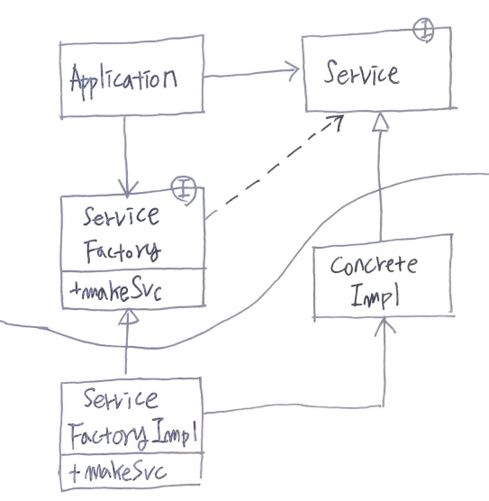

- [Abstract](#abstract)
- [Materials](#materials)
- [Basic](#basic)
- [SRP](#srp)
- [OCP](#ocp)
- [LSP](#lsp)
- [ISP](#isp)
- [DIP](#dip)
- [IoC](#ioc)
- [IoC vs DIP vs DI](#ioc-vs-dip-vs-di)

----

# Abstract

로버트 마틴이 정리한 객체 지향 프로그래밍 및 설계의 다섯 가지 기본 원칙을 마이클 페더스가 두문자어 기억술로 소개한 것이다.

# Materials

* [SOLID](https://johngrib.github.io/wiki/SOLID/)
* [SOLID 원칙](https://dev-momo.tistory.com/entry/SOLID-%EC%9B%90%EC%B9%99)
* [SOLID & IoC Principles](https://www.slideshare.net/PavloHodysh/solid-ioc-principles-66628530)

# Basic

| | | Title  | Description |
|--|--|--|--|
| S | SRP | 단일 책임 원칙 (Single responsibility principle) |  한 클래스는 하나의 책임만 가져야 한다. |
| O | OCP | 개방-폐쇄 원칙 (Open/closed principle) | 소프트웨어 요소는 확장에는 열려 있으나 변경에는 닫혀 있어야 한다. |
| L | LSP | 리스코프 치환 원칙 (Liskov substitution principle) | 프로그램의 객체는 프로그램의 정확성을 깨뜨리지 않으면서 하위 타입의 인스턴스로 바꿀 수 있어야 한다. |
| I | ISP | 인터페이스 분리 원칙 (Interface segregation principle) | 특정 클라이언트를 위한 인터페이스 여러 개가 범용 인터페이스 하나보다 낫다. |
| D | DIP | 의존관계 역전 원칙 (Dependency inversion principle) | 추상화에 의존해야지, 구체화에 의존하면 안된다. |

# SRP

A class should have only **one reason** to change. by Robert C. Martin.

# OCP

Objects or entitles should be open for **extension**, but closed for **modification**. Bertrand Meyer.

Fruit 라는 interface 를 만들고 Banana, Orange, Applce 과 같이 class 들을 만들어
implement 하자. Client 는 Fruit 를 바라보고 구현되어 있다. 이후 Kiwi class 를
만들어 Fruit 를 implement 하자. **기능**이 확장되었다. 그러나 Client 의 code 는
**수정**할 필요가 없다.  

# LSP

Let f(x) be a property of objects X of type T. Then f(y) should be true for objects Y of type S where S is a subtype of T. Barbara Liskov.

"is-a" 관계가 성립되지 않으면 `S` 는 `T` 의 자식이 아니다.

# ISP

**Many** client-specific **interfaces** are better than one general-purpose interface. Rober C. Martin.

# DIP

One should depend upon **abstractions**, not on concretions. Rober C. Martin.

Interface 를 사용하면 Dependency 를 Inversion 할 수 있다. 예를 들어 다음과 같은 경우를 살펴보자.

Application 은 ServiceFactory 라는 Interface 의 makeSvc 를 호출하여 ConcreteImpl 을 생성하고 Service Interface type 으로 소유한다. concreteImple 이라는 conrete class 에 변경이 생겨도 Application 은 수정할 필요가 없다.

만약 ServiceFactory 가 없었다고 해보자. Application 은 ConcretImpl 을 직접 생성해야 한다. 즉, ServiceFactory 라는 abstraction 에 의존하지 않고 ConcretImple 이라는 concret 에 의존하는 것이다.

ConcreteImpl 의 기능이 수정되었다면 Application 역시 수정되야할 수도 있다. 

따라서 ConcretImpl 과 같은 Concrete 에 의존하지 말고 ServiceFactory 와 같은 Abstraction 에 의존하라는 얘기이다.

# IoC

* [IoC, DI, DIP 개념 잡기](https://vagabond95.me/posts/about-ioc-dip-di/)

---

IoC 란 코드의 흐름을 제어하는 주체가 바뀌는 것을 의미한다. 

예를 들어 Library 를 사용하면 Library 를 호출하는 Host 가 코드 흐름을 제어하는
주체이다. 그러나 

Framework 를 사용하면 Host 는 Framework 에서 제공하는 Handler 들을 정의한다.
이것은 코드 흐름을 제어하는 주체가 Host 가 아닌 Framework 임을 의미한다. 이것이
IoC 의 예이다.

# IoC vs DIP vs DI

IoC, DIP, DI 에 대한 의견이 많다. 다음과 같은 글을 참고해서 이해하자.

* [IoC, DI, DIP 개념 잡기](https://vagabond95.me/posts/about-ioc-dip-di/)
* [DIP in the Wild](https://martinfowler.com/articles/dipInTheWild.html#YouMeanDependencyInversionRight)
* [A curry of Dependency Inversion Principle (DIP), Inversion of Control (IoC), Dependency Injection (DI) and IoC Container](https://www.codeproject.com/Articles/538536/A-curry-of-Dependency-Inversion-Principle-DIP-Inve#Dependency%20Inversion%20Principle%20(DIP))
