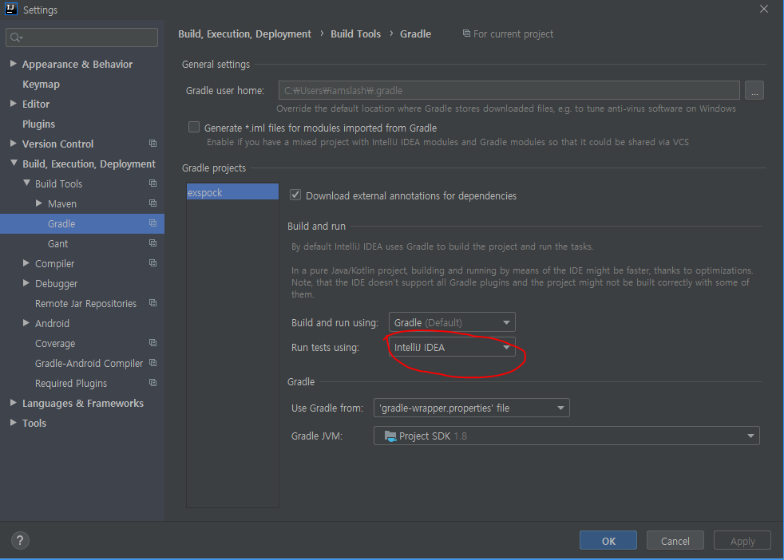
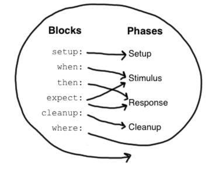
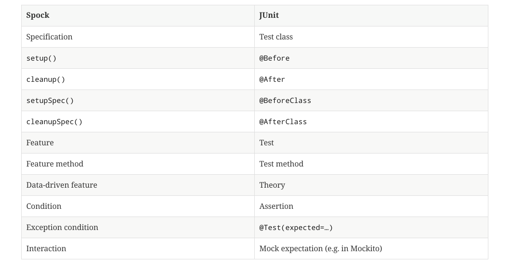

- [Abstract](#abstract)
- [Materials](#materials)
- [Feature](#feature)
  - [IOC (Inversion Of Control)](#ioc-inversion-of-control)
  - [DI (Dependency Injection)](#di-dependency-injection)
  - [AOP (Aspect Oriented Programming)](#aop-aspect-oriented-programming)
  - [PSA (Portable Service Abstraction)](#psa-portable-service-abstraction)
- [Spring Framework Core](#spring-framework-core)
- [Spring Boot](#spring-boot)
- [Spring Web MVC](#spring-web-mvc)
- [Spring Data JPA](#spring-data-jpa)
- [Spring REST API](#spring-rest-api)
- [Spring Security](#spring-security)
- [Spring Example Application](#spring-example-application)
- [Spring Batch](#spring-batch)
- [Examples](#examples)
  - [Spring Elasticsearch](#spring-elasticsearch)
  - [Spring Kafka](#spring-kafka)
  - [Spring memcached](#spring-memcached)
  - [Spring MongoDB](#spring-mongodb)
  - [Spring MySQL](#spring-mysql)
  - [Spring Postgres](#spring-postgres)
  - [Spring redis](#spring-redis)
  - [Spring ldap](#spring-ldap)
- [Tips](#tips)
  - [Active profile](#active-profile)
  - [Test Active profile](#test-active-profile)
  - [@ConfigurationProperties](#configurationproperties)
  - [Test of `@ConfigurationProperties`](#test-of-configurationproperties)
  - [Http requests logging](#http-requests-logging)
  - [Http responses logging](#http-responses-logging)
  - [Slf4J logging](#slf4j-logging)
  - [Sprint Boot Test with JUnit](#sprint-boot-test-with-junit)
  - [Spring Boot Test with Spock](#spring-boot-test-with-spock)
  - [Spring Boot Exception Handling](#spring-boot-exception-handling)
  - [Spring WebMvcConfigure](#spring-webmvcconfigure)
  - [Transactional](#transactional)
  - [Spring with flyway](#spring-with-flyway)
  - [Custom Data Binder in Spring MVC](#custom-data-binder-in-spring-mvc)
  - [Caching in spring boot](#caching-in-spring-boot)

----

# Abstract

- spring framework 에 대해 정리한다.

# Materials

- [Spring Guides](https://spring.io/guides)
  - Topics Guides are very useful.
- [spring-examples by iamslash](https://github.com/iamslash/spring-examples)
- [baeldung spring](https://www.baeldung.com/start-here)
  - 킹왕짱 튜토리얼
  - [src](https://github.com/eugenp/tutorials)
- [All Tutorials on Mkyong.com](https://www.mkyong.com/tutorials/spring-boot-tutorials/)
  - spring boot 를 포함한 여러 java tech turotials 
  - [src](https://github.com/mkyong/spring-boot)
- [예제로 배우는 스프링 입문 (개정판) @ inflearn](https://www.inflearn.com/course/spring_revised_edition#)
  - [spring-petclinic @ github](https://github.com/spring-projects/spring-petclinic)
- [백기선의 Spring 완전 정복 로드맵 - 에이스 개발자가 되자! @ inflearn](https://www.inflearn.com/roadmaps/8)
  - 유료이긴 하지만 유용하다
- [스프링 레퍼런스 번역](https://blog.outsider.ne.kr/category/JAVA?page=1)
- [Spring Framework Documentation](https://docs.spring.io/spring/docs/current/spring-framework-reference/)
  - Overview	
    - history, design philosophy, feedback, getting started.
  - Core	
    - IoC Container, Events, Resources, i18n, Validation, Data Binding, Type Conversion, SpEL, AOP.
  - Testing	
    - Mock Objects, TestContext Framework, Spring MVC Test, WebTestClient.
  - Data Access	
    - Transactions, DAO Support, JDBC, O/R Mapping, XML Marshalling.
  - Web Servlet	
    - Spring MVC, WebSocket, SockJS, STOMP Messaging.
  - Web Reactive	
    - Spring WebFlux, WebClient, WebSocket.
  - Integration	
    - Remoting, JMS, JCA, JMX, Email, Tasks, Scheduling, Caching.
  - Languages	
    - Kotlin, Groovy, Dynamic Languages.

# Feature

## IOC (Inversion Of Control)

* [IOC 와 DI 에 대해서 @ tistory](https://mo-world.tistory.com/entry/IOC%EC%99%80-DI-%EC%97%90-%EB%8C%80%ED%95%98%EC%97%AC-%EC%8A%A4%ED%94%84%EB%A7%81-%EA%B0%9C%EB%85%90-%EC%9D%B4%ED%95%B4%ED%95%98%EA%B8%B0-%EC%89%BD%EA%B2%8C-%EC%84%A4%EB%AA%85)

----

Spring Container 가 코드의 흐름을 제어할 수 있다. 즉, 내가 코드의 흐름을 제어하는 것을
Spring Container 가 가져갔다고 해서 inversion of control 이라고 한다.
Spring Container 가 object 의 life cycle 을 나 대신 관리한다. 
IOC 때문에 DI, AOP 가 가능하다.

## DI (Dependency Injection)

object 를 내가 생성하지 않고 Spring Container 가 생성해서 주입해준다.

## AOP (Aspect Oriented Programming)

반복되는 코드를 분리해서 모듈화하는 프로그래밍 기법이다. 반복되는 코드를 `cross-cutting`, 분리된 모듈을 `aspect` 라고 한다. 따라서 AOP 를 적용하면 반복되는 코드를 줄일 수 있다. 이때 반복되는 코드와 같이 해야할 일들을 `advice`, 어디에 적용해야 하는지를 `pointcut`, 적용해야할 class 를 `target`, method 를 호출할 때 aspect 를 삽입하는 지점을 `joinpoint` 라고 한다. 

AOP 는 언어별로 다양한 구현체가 있다. java 는 주로 AspectJ 를 사용한다. 또한 AOP 는 compile, load, run time 에 적용 가능하다. 만약 Foo 라는 class 에 A 라는 aspect 를 적용한다고 해보자. 

* compile time 에 AOP 를 적용한다면 Foo 의 compile time 에 aspect 가 적용된 byte 코드를 생성한다. 그러나 compile time 이 느려진다.
* load time 에 AOP 를 적용한다면 VM 이 Foo 를 load 할 때 aspect 가 적용된 Foo 를 메모리에 로드한다. 이것을 AOP weaving 이라고 한다. AOP weaving 을 위해서는 agent 를 포함하여 복잡한 설정을 해야 한다.
* rum time 에 AOP 를 적용한다면 VM 이 Foo 를 실행할 때 aspect 를 적용한다. 수행성능은 load time 과 비슷할 것이다. 대신 복잡한 설정이 필요없다.

## PSA (Portable Service Abstraction)

annotation 을 사용하여 service 와 loosely coupled 한 코드를 만들 수 있다.

예를 들어 `@Controller, @RequestMapping` 을 사용한 코드는 tomcat, jetty, netty, undertow 와 같은 servlet container 중 어느 것을 사용해도 많은 수정을 할 필요 없다. 즉, 여러 Spring Web MVC 들을 추상화했다고 할 수 있다.

다음은 Spring Web MVC 를 추상화한 구현이다.

```java
```

또한 `@Transactional` 을 사용한 코드는 JpaTransactionManager, DatasourceTransactionManager, HibernateTransactionManager 중 어느 것을 사용해도 많은 수정을 할 필요 없다. 즉, 여러 Transaction Manager 들을 추상화했다고 할 수 있다.

다음은 TransactionManager 를 추상화한 구현이다.

```java
```

# Spring Framework Core

[Spring Framework Core](SpringFrameworkCore.md)

# Spring Boot

[Spring Boot](SpringBoot.md)

# Spring Web MVC

[Spring Web MVC](SpringWebMvc.md)

# Spring Data JPA

[Spring Data JPA](SpringDataJpa.md)

# Spring REST API

[Spring REST API](SpringRestApi.md)

# Spring Security

[Spring Security](SpringSecurity.md)

# Spring Example Application

[Spring JPA Example](SpringExampleApplication.md)

# Spring Batch

* [Creating a Batch Service](https://spring.io/guides/gs/batch-processing/)
  * [src](https://github.com/spring-guides/gs-batch-processing)
* [1. Spring Batch 가이드 - 배치 어플리케이션이란?](https://jojoldu.tistory.com/324?category=902551)
  * [2. Spring Batch 가이드 - Batch Job 실행해보기](https://jojoldu.tistory.com/325)
  * [src](https://github.com/jojoldu/spring-batch-in-action)
* [Spring Batch](https://spring.io/projects/spring-batch)

----

[Spring Batch](SpringBatch.md)

# Examples

## Spring Elasticsearch

* [exelasticsearch](https://github.com/iamslash/spring-examples/tree/master/exelasticsearch/)

## Spring Kafka

* [exkafka](https://github.com/iamslash/spring-examples/tree/master/exkafka/)

## Spring memcached

* [exmemcached](https://github.com/iamslash/spring-examples/tree/master/exmemcached/)

## Spring MongoDB

* [exmongodb]()

## Spring MySQL

* [exmysql]()

## Spring Postgres

* [expostgresql]()

## Spring redis

* [exredis]()

## Spring ldap

* [exldap]()

# Tips

## Active profile

* [spring profile 을 사용하여 환경에 맞게 deploy 하기](https://www.lesstif.com/pages/viewpage.action?pageId=18220309)

----

Spring application 을 시작할 때 JVM option 으로 profile 을 선택할 수 있다. 두개 이상을 선택해도 됨.

```bash
-Dspring.profiles.active=local
-Dspring.profiles.active=local,develop
```

## Test Active profile

test class 를 작성할 때 `application.yml` 대신 `application-test.yml` 을 사용하고 싶다면 다음과 같이 `@ActiveProfiles("test")` 를 사용한다.

```java
@RunWith(SpringRunner.class)
@SpringBootTest
@AutoConfigureMockMvc
@ActiveProfiles("test")
public class PostControllerTest {
}
```

## @ConfigurationProperties

* [spring-examples/exconfigproperties](https://github.com/iamslash/spring-examples/tree/master/exconfig)
* [Guide to @ConfigurationProperties in Spring Boot](https://www.baeldung.com/configuration-properties-in-spring-boot)
  * [src](https://github.com/eugenp/tutorials/tree/master/spring-boot-modules/spring-boot-properties)
* [Testing Spring Boot @ConfigurationProperties @ baeldung](https://www.baeldung.com/spring-boot-testing-configurationproperties)
  * [src](https://github.com/eugenp/tutorials/tree/master/spring-boot-modules/spring-boot-testing)
* [23. Externalized Configuration @ spring-boot 1.2.2](https://docs.spring.io/spring-boot/docs/1.2.2.RELEASE/reference/html/boot-features-external-config.html)

----

This is Externalized Configuration order.

* Command line arguments.
* JNDI attributes from java:comp/env.
* Java System properties (System.getProperties()).
* OS environment variables.
* A RandomValuePropertySource that only has properties in random.*.
* Profile-specific application properties outside of your packaged jar (application-{profile}.properties and YAML variants)
* Profile-specific application properties packaged inside your jar (application-{profile}.properties and YAML variants)
* Application properties outside of your packaged jar (application.properties and YAML variants).
* Application properties packaged inside your jar (application.properties and YAML variants).
* @PropertySource annotations on your @Configuration classes.
* Default properties (specified using SpringApplication.setDefaultProperties).

Create a `src/main/resources/application-develop.properties`

```
iamslash.authcookie: HelloWorld
iamslash.authcookieSalt: HelloWorld
```

Create a mapping class `src/main/java/com/iamslash/exconfig/config/FooSetting.java`

```java
@ConfigurationProperties(prefix = "iamslash")
public class AuthConfigProperties {
  private String authcookie;
  private String authcookieSalt;

  public String getAuthcookie() {
    return authcookie;
  }
  public void setAuthcookie(String authcookie) {
    this.authcookie = authcookie;
  }
  public String getAuthcookieSalt() {
    return authcookieSalt;
  }
  public void setAuthcookieSalt(String authcookieSalt) {
    this.authcookieSalt = authcookieSalt;
  }
}
```

Add `@EnableConfiguration` to `src/main/java/com/iamslash/exconfig/ExApplication`.

```java
@SpringBootApplication
@EnableConfigurationProperties(AuthConfigProperties.class)
public class Application { ... }
```

And Use `AuthConfigProperties` with `@Autowired`.

```java
@SpringBootApplication
@EnableConfigurationProperties(AuthConfigProperties.class)
public class ExconfigApplication {

	@Autowired
	AuthConfigProperties authConfigProperties;

	public static void main(String[] args) {
		SpringApplication.run(ExconfigApplication.class, args);
	}

	@PostConstruct
	public void print() {
		System.out.println("++++++++++++++++++++++++++++++++++++++++++++++++++++++++++++++++++++++++++++++++");
		System.out.println("iamslash.authcookie: " + authConfigProperties.getAuthcookie());
		System.out.println("iamslash.authcookiesalt: " + authConfigProperties.getAuthcookieSalt());
		System.out.println("++++++++++++++++++++++++++++++++++++++++++++++++++++++++++++++++++++++++++++++++");
	}

}
```

## Test of `@ConfigurationProperties`

Add `src/test/java/com.iamslash.exconfig.config.AuthConfigPropertiesTest.java`

```java
@ExtendWith(SpringExtension.class)
@EnableConfigurationProperties(value=AuthConfigProperties.class)
@TestPropertySource("classpath:application-develop.properties")
class AuthConfigPropertiesTest {

  @Autowired
  private AuthConfigProperties authConfigProperties;

  @Test
  void getAuthcookie() {
    assertEquals("HelloWorld", authConfigProperties.getAuthcookie());
  }
}
```

* @ExtendWith – integrates Spring's TestContext framework with JUnit5
* @EnableConfigurationProperties – enables support for @ConfigurationProperties beans (in this case, the AuthConfigProperties bean)
* @TestPropertySource – specifies a testing file that overrides the default application.properties file

## Http requests logging

* [Spring – Log Incoming Requests](https://www.baeldung.com/spring-http-logging)

* `src/main/java/com.iamslash.alpha.common.RequestLoggingFilterConfig.java`

```java
package org.springframework.security.oauth.samples.common;

import org.springframework.context.annotation.Bean;
import org.springframework.context.annotation.Configuration;
import org.springframework.web.filter.CommonsRequestLoggingFilter;

@Configuration
public class RequestLoggingFilterConfig {

  @Bean
  public CommonsRequestLoggingFilter logFilter() {
    CommonsRequestLoggingFilter filter
            = new CommonsRequestLoggingFilter();
    filter.setIncludeQueryString(true);
    filter.setIncludePayload(true);
    filter.setMaxPayloadLength(10000);
    filter.setIncludeHeaders(true);
    filter.setAfterMessagePrefix("REQUEST DATA : \n");
    return filter;
  }
}
```

* `src/main/resources/application.yaml`

```yaml
server:
  port: 8092

logging:
  level:
    root: INFO
    org.springframework.web: DEBUG
    org.springframework.web.filter: DEBUG
    org.springframework.web.filter.CommonsRequestLoggingFilter: DEBUG
    org.springframework.security: INFO
    org.springframework.security.oauth2: INFO
#    org.springframework.boot.autoconfigure: DEBUG
```

## Http responses logging

* [Logging Spring WebClient Calls](https://www.baeldung.com/spring-log-webclient-calls)

## Slf4J logging

`@Slf4J` is defined in lombok. Update build.gradle dependencies.

```gradle
dependencies {
	implementation 'org.springframework.boot:spring-boot-starter-logging'
	implementation 'org.projectlombok:lombok'
	annotationProcessor 'org.projectlombok:lombok'
}
```

Add `@Slf4J` on classes.

```java

@Slf4j
@SpringBootApplication
@EnableConfigurationProperties(AuthConfigProperties.class)
public class ExconfigApplication {

//	private static final Logger log = LoggerFactory.getLogger(ExconfigApplication.class);

	@Autowired
	AuthConfigProperties authConfigProperties;

	public static void main(String[] args) {
		SpringApplication.run(ExconfigApplication.class, args);
	}

	@PostConstruct
	public void print() {
		log.info("");
		log.info("++++++++++++++++++++++++++++++++++++++++++++++++++++++++++++++++++++++++++++++++");
		log.info("iamslash.authcookie: " + authConfigProperties.getAuthcookie());
		log.info("iamslash.authcookiesalt: " + authConfigProperties.getAuthcookieSalt());
		log.info("++++++++++++++++++++++++++++++++++++++++++++++++++++++++++++++++++++++++++++++++");
	}

}
```

## Sprint Boot Test with JUnit

* [Spring Boot Test](https://cheese10yun.github.io/spring-boot-test/#null)
* [Spring Boot에서 테스트를 - 1](https://hyper-cube.io/2017/08/06/spring-boot-test-1/)

----

* Spring Boot Test
* `@WebMvcTest`
* `@DataJpaTest`
* `@RestClientTest`
* `@JsonTest`

* Dependencies of `build.gradle` 

  ```gradle
  dependencies {
    implementation 'org.springframework.boot:spring-boot-starter-web'
    testImplementation('org.springframework.boot:spring-boot-starter-test') {
      exclude group: 'org.junit.vintage', module: 'junit-vintage-engine'
    }
  }
  ```

* Test Class
  * `@SpringBootTest` 의 `WebEnvironment` 는 기본값이 `SpringBootTest.WebEnvironment.MOCK` 이다.
  * `Mock Dispatcher` 가 실행되어 Controller 를 test 할 수 있다.

  ```java
  @RunWith(SpringRunner.class)
  @SpringBootTest(webEnvironment=SpringBootTest.WebEnvironment.MOCK)
  @AutoConfigureMockMvc
  public class DemoTest {
    @Autowired
    MockMvc mockMvc;
    @Test
    public void hello() throws Exception {
      mockMvc.perform(get("/hello"))
        .andExpect(status().isOk())
        .andExpect(content().string("hello"))
        .andDo(print());
    }
  }
  ```

* RandomPort 를 사용하면 Servlet Container 가 실행된다. 
  * mockMvc 대신 TestRestTemplate 를 사용해야 한다.

  ```java
  @RunWith(SpringRunner.class)
  @SpringBootTest(webEnvironment=SpringBootTest.WebEnvironment.RANDOM_PORT)
  public class DemoTest {

    @Autowired
    TestRestTemplate testRestTemplate;
    
    @Test
    public void hello() throws Exception {
      String result = testRestTemplate.getForObject("/hello", String.class);
      assertThat(result).isEqualTo("hello");
    }
  }
  ```

* Service 를 mocking 해보자.
  
  ```java
  @RunWith(SpringRunner.class)
  @SpringBootTest(webEnvironment=SpringBootTest.WebEnvironment.RANDOM_PORT)
  public class DemoTest {

    @Autowired
    TestRestTemplate testRestTemplate;
    
    @MockBean
    HelloService mockHelloService;
    
    @Test
    public void hello() throws Exception {
      when(mockHelloService.getName()).thenReturn("hello");

      mockMvc.perform(get("/hello"))
        .andExpect(status().isOk())
        .andExpect(content().string("hello"))
        .andDo(print());
    }
  }
  ```

* WebTestClient 를 사용하면 Asynchronous http client 를 사용할 수 있다.

  ```gradle
  dependencies {
    implementation 'org.springframework.boot:spring-boot-starter-web'
    implementation 'org.springframework.boot:spring-boot-starter-webflux'
    testImplementation('org.springframework.boot:spring-boot-starter-test') {
      exclude group: 'org.junit.vintage', module: 'junit-vintage-engine'
    }
  }
  ```

  ```java
  @RunWith(SpringRunner.class)
  @SpringBootTest(webEnvironment=SpringBootTest.WebEnvironment.RANDOM_PORT)
  public class DemoTest {

    @Autowired
    WebTestClient webTestClient;
    
    @MockBean
    HelloService mockHelloService;
    
    @Test
    public void hello() throws Exception {
      when(mockHelloService.getName()).thenReturn("hello");

      webTestClient.get().uri("/hello").exchange()
        .expectStatus().isOk()
        .expectBody(String.class)
        .isEqualTo("hell");
    }
  }
  ```

* Json 만 lightweight 하게 test 할 수 있다.

  ```java
  @RunWith(SpringRunner.class)
  @JsonTest
  public class DemoTest {
    ...
  }
  ```

* `@SpringBootTest` 에는 많은 test annotation 들이 포함되어 있다. 그것을 각각 이용하면 layer 별로 test 할 수 있다. 이것을 slicing test 라고 한다. `@WebMvcTest` 를 이용하여 특정 Controller 만 사용해 보자.

  ```java
  @RunWith(SpringRunner.class)
  @WebMvcTest(DemoController.class)
  public class DemoControllerTest {
    @MockBean
    DemoService demoService;

    @Autowired
    MockMvc mockMvc

    @Test
    public void hello() throws Exception {
      when(mockHelloService.getName()).thenReturn("hello");

      webTestClient.get().uri("/hello").exchange()
        .expectStatus().isOk()
        .expectBody(String.class)
        .isEqualTo("hello");
    }
  }
  ```

* OutputCapture 를 이용하면 log message 를 test 할 수 있다.

  ```java
  @RestController
  public class DemoController {
    Logger logger = LoggerFactory.getLogger(DemoController.class);
    @Autowired
    private DemoService demoService;

    @GetMapping("/hello")
    public String hello() {
      logger.info("Foo");
      System.out.println("Bar");
      return "hello";
    }
  }
  ```

  ```java
  @RunWith(SpringRunner.class)
  @WebMvcTest(DemoController.class)
  public class DemoControllerTest {
    @Rule
    public OutputCapture outputCapture = new OutputCapture();

    @MockBean
    DemoService demoService;

    @Autowired
    MockMvc mockMbc

    @Test
    public void hello() throws Exception {
      when(mockHelloService.getName()).thenReturn("hello");

      mockMvc.perform(get("/hello"))
        .andExpect(content().string("hello"));

      assertThat(outputCapture.toString())
        .contains("Foo")
        .contains("Bar");        
    }
  }
  ```

## Spring Boot Test with Spock

* [Spock Primer](http://spockframework.org/spock/docs/1.0/spock_primer.html)
* [spring-examples/exspock](https://github.com/iamslash/spring-examples/tree/master/exspock)
* [SpringBoot 환경에서 Spock 사용하기](https://jojoldu.tistory.com/229)
  * [src](https://github.com/jojoldu/blog-code/tree/master/spring-boot-spock)
* [Testing with Spring and Spock](https://www.baeldung.com/spring-spock-testing)
* [Introduction to Testing with Spock and Groovy](https://www.baeldung.com/groovy-spock)

----

다음과 같이 build.gradle 을 설정한다.

```gradle
plugins {
	id 'org.springframework.boot' version '2.2.6.RELEASE'
	id 'io.spring.dependency-management' version '1.0.9.RELEASE'
	id 'java'
	id 'groovy'
}

group = 'com.iamslash'
version = '0.0.1-SNAPSHOT'
sourceCompatibility = '1.8'

repositories {
	mavenCentral()
}

dependencies {
	implementation 'org.springframework.boot:spring-boot-starter'
	implementation 'org.springframework.boot:spring-boot-starter-web'
	testImplementation('org.springframework.boot:spring-boot-starter-test') {
		exclude group: 'org.junit.vintage', module: 'junit-vintage-engine'
	}
	testImplementation('org.junit.jupiter:junit-jupiter:5.4.0')
	testImplementation('org.spockframework:spock-core:1.1-groovy-2.4')
	testImplementation('org.spockframework:spock-spring:1.1-groovy-2.4')
}

test {
	useJUnitPlatform()
}
```

다음과 같이 UserControllerTest.java 를 작성한다.

```java
@WebMvcTest(UserController.class)
class UserControllerTest extends Specification {

    @Autowired
    MockMvc mockMvc;

    def "one plus one should equal two"() {
        expect:
        1 + 1 == 2
    }

    def "Should be able to remove from list"() {
        given:
        def list = [1, 2, 3, 4]

        when:
        list.remove(0)

        then:
        list == [2, 3, 4]
    }

    def "Should get an index out of bounds when removing a non-existent item"() {
        given:
        def list = [1, 2, 3, 4]

        when:
        list.remove(20)

        then:
        thrown(IndexOutOfBoundsException)
        list.size() == 4
    }

    def "numbers to the power of two"(int a, int b, int c) {
        expect:
        Math.pow(a, b) == c

        where:
        a | b | c
        1 | 2 | 1
        2 | 2 | 4
        3 | 2 | 9
    }

    def "CreateUser"() {
        given:
        String userJson = "{\"username\":\"iamslash\", \"password\":\"world\"}";

        expect:
        mockMvc.perform(post("/api/v1/user")
                .contentType(MediaType.APPLICATION_JSON)
                .accept(MediaType.APPLICATION_JSON)
                .content(userJson))
                .andExpect(status().isOk())
                .andExpect(jsonPath("\$.username", is(equalTo("iamslash"))));
    }
}
```

IntelliJ 2020.1 에서 test methods 들이 실행되지 않을 수 있다. 다음과 같이 `Run tests using` 을 `Gralde` 에서 `IntelliJ IDEA` 로 바꾼다.



spock 은 다음과 같은 feature method 들이 있다.

* given (setup) : 테스트 하기 위한 기본 설정
* when : 테스트할 대상 코드를 실행
* then : 테스트할 대상 코드의 결과 검증 
* expect : 테스트할 대상 코드를 실행 및 검증 (when + then)
* where : feature 메소드를 파라미터로 삼아 실행.

다음은 feature method 들의 lifecycle 이다.



다음과 같이 mock object 를 생성할 수 있다.

```groovy
def mockService = Mock(FooService)
// same as above
FooService mockService = Mock()
```

다음과 같이 `>>` 를 사용하여 method 를 mocking 하거나 exception 을 throw 할 수 있다.

```groovy
mockService.findName(1) >> "iamslash"

mockService.validate() >> { throw new ResourceNotFoundException }
```

다음과 같이 method 호출의 횟수를 검증할 수도 있다.

```groovy
then:
// 2 times exactly
2 * mockService.savePoint(customer, point) 

// 3 times at least 
(3.._) * mockService.savePoint(customer, point) 

// 3 times at most
(_..3) * mockService.savePoint(customer, point) 

// 2 times at most with any parameters
(_..2) * mockService.savePoint(_, _)
```

다음은 spock 과 junit 을 비교한 것이다.



## Spring Boot Exception Handling

* [(Spring Boot)오류 처리에 대해](https://supawer0728.github.io/2019/04/04/spring-error-handling/)
* [스프링부트 : REST어플리케이션에서 예외처리하기](https://springboot.tistory.com/33)
* [Error Handling for REST with Spring](https://www.baeldung.com/exception-handling-for-rest-with-spring)

## Spring WebMvcConfigure

spring Web Mvc 는 다음과 같은 설정들 덕분에 사용가능하다.

`org.springframework.boot:spring-boot-autoconfigure` 에 Web Mvc 설정이 포함되어 있다.

* `META-INF/spring.factories` 에 WebMvcAutoConfiguration 가 enable 되어 있다.

```
org.springframework.boot.autoconfigure.EnableAutoConfiguration=\
...
org.springframework.boot.autoconfigure.web.servlet.WebMvcAutoConfiguration,\
...
```

* `org.springframework.boot.autoconfigure/web/servlet/WebMvcAutoConfiguration` 에 `@Configuration` 이 첨부되어 있다.

```java
@Configuration(proxyBeanMethods = false)
@ConditionalOnWebApplication(type = Type.SERVLET)
@ConditionalOnClass({ Servlet.class, DispatcherServlet.class, WebMvcConfigurer.class })
@ConditionalOnMissingBean(WebMvcConfigurationSupport.class)
@AutoConfigureOrder(Ordered.HIGHEST_PRECEDENCE + 10)
@AutoConfigureAfter({ DispatcherServletAutoConfiguration.class, TaskExecutionAutoConfiguration.class,
		ValidationAutoConfiguration.class })
public class WebMvcAutoConfiguration {
  ...
```

* `org.springframework.boot.autoconfigure/web.servlet/WebMvcProperties` 에 `spring.mvc` 로 시작하는 properties 들이 포함된다.

```java
@ConfigurationProperties(prefix = "spring.mvc")
public class WebMvcProperties {
  ...
```

## Transactional

* [[Spring] Transactional 정리 및 예제](https://goddaehee.tistory.com/167)
  *  isolation 참고
* [Isolation Levels in Database Management Systems](https://www.youtube.com/watch?v=-gxyut1VLcs)
* [Why do We Have Repeatable Read and Serializable Isolation Levels?](https://www.youtube.com/watch?v=xR70UlE_xbo)

-----

Transaction problems 는 다음과 같다.

* Dirty Read
  * A transaction 이 값을 1 에서 2 로 수정하고 아직 commit 하지 않았다. B transaction 은 값을 2 로 읽어들인다. 만약 A transaction 이 rollback 되면 B transaction 은 잘못된 값 2 을 읽게 된다.

* Non-repeatable Read
  * A transaction 이 한번 읽어온다. B transaction 이 Update 한다. A transaction 이 다시 한번 읽어온다. 이때 처음 읽었던 값과 다른 값을 읽어온다.
  
    ```
    BEGIN TRAN
      SELECT SUM(Revenue) AS Total FROM Data;
      --another tran updates a row
      SELECT Revenue AS Detail FROM Data;
    COMMIT  
    ```

* Phantom Read
  * A transaction 이 한번 읽어온다. B transaction 이 insert 한다. A transaction 이 다시 한번 읽어온다. 이때 처음 읽었던 record 들에 하나 더 추가된 혹은 하나 삭제된 record 들을 읽어온다.

    ```
    BEGIN TRAN
      SELECT SUM(Revenue) AS Total FROM Data;
      --another tran inserts/deletes a row
      SELECT Revenue AS Detail FROM Data;
    COMMIT  
    ```

위와 같은 Transactinal problems 를 해결하기 위해 다음과 같은 방법을 사용해 보자.

* Isolation
  * DEFAULT
    * DB 의 isolation level 을 따른다.
  * READ_UNCOMMITED (level 0)
    * Commit 되지 않은 데이터 읽기가 가능하다.
    * Dirty Read, Non-repeatable Read, Phantom Read 가 발생한다.
  * READ_COMMITED (level 1)
    * Transaction 이 Commit 된 데이터만 읽기가 가능하다.
    * Dirty Read 를 해결한다. 그러나 Nonrepeatable REad, Phatom Read 가 여전히 발생한다.
  * REPEATABLE_READ (level 2)
    * new rows can be inserted into the dataset.
    * Dirty Read, Non-Repeatable Read 를 해결한다.
    * Phantom Read 가 여전히 발생한다.
  * SERIALIZABLE (level 3)
    * all the rows are locked for the duration of the transaction, no insert, update or delete is allowed.
    * This reduces the performance.
    * Dirty Read, Non-Repeatable Read, Phantom Read 를 해결한다.

| Isolation level | Dirty Read | Non-repeatable Read | Phantom Read |
| --------------- | ---------- | ------------------- | ------------ |
| Read uncommited | O          | O                   | O            |
| Read commited   | X          | O                   | O            |
| Repeatable Read | X          | X                   | O            |
| Serializable    | X          | X                   | X            |

* Propagation
  * REQUIRED
    * Parent Transaction 에서 실행한다. Parent Transaction 이 없을 경우 새로운 Transaction 을 생성한다. Default
  * SUPPORTS
    * 이미 시작된 Transaction 이 있으면 참여하고 그렇지 않으면 Transaction 없이 실행한다.
  * REQUIRES_NEW
    * Parent Transaction 을 부시하고 새로운 Transaction 을 생성한다.
  * MANDATORY
    * 이미 시작된 Transaction 이 있다면 참여한다. 그렇지 않으면 Exception 을 발생한다. 혼자서는 Transaction 을 진행하면 안되는 경우다.
  * NOT_SUPPORTED
    * 이미 시작된 Transaction 을 사용하지 않는다. 기다린다???
  * NEVER
    * Transaction 을 사용하지 않도록 한다. 이미 진행중인 Transaction 이 있다면 Exception 을 발생한다.
  * NESTED
    * 이미 진행중인 Transaction 이 있다면 중첩된 Transaction 을 시작한다.
    * REQUIRES_NEW 처럼 독립적인 Transaction 을 생성하는 것과는 다르다.
    * Nested Transaction 은 Parent Transaction 의 Commit, Rollback 에 영향을 받는다. 그러나 자신의 Transaction 은 Parent Transaction 에게 양향을 주지는 않는다.
    * NESTED Transaction 은 JDBC 3.0 의 savepoint 와 DataSourceTransactionManager 를 이용할 경우에 가능하다.

* readOnley property
  * Transaction 을 읽기 전용으로 설정한다.
  * `@Transactional(readOnly = true)`

* Transaction Rollback Exception
  * Runtime Exception 이 발생하면 Rollback 된다. Checked Exception 이 발생하면 Commit 된다.
  * `rollbackFor` 를 이용하여 특정 Exception 에 대해 Rollback 할 수 있다.
    * `@Transactional(rollbackFor=Exception.class)`
  * `noRollbackFor` 를 이용하여 특정 Exception 에 대해 Rollback 되지 않게 할 수 있다.
    * `@Transactional(noRollbackFor=Exception.class)`

* timeout property
  * 지정한 시간내에 메소드 수행이 완료되지 않으면 rollback 을 수행한다. (Default = -1)
  * `@Transactional(timeout=10)`

## Spring with flyway

* [spring-examples/exflyway](https://github.com/iamslash/spring-examples/exflyway)
* [Flyway](/flyway/README.md)
* [Flyway gradle plugin](https://flywaydb.org/documentation/gradle/#tasks)
* [Flyway 공부](http://chanwookpark.github.io/dbmigration/flyway/2016/08/23/flyway/)

-----

[Flyway](/flyway/README.md) 를 참고하여 `src/main/resources/db/migration` 에 `V*__*.sql` 을 작성한다.

다음과 같이 build.gradle 을 설정한다.

```gradle
plugins {
	id 'org.springframework.boot' version '2.2.7.RELEASE'
	id 'io.spring.dependency-management' version '1.0.9.RELEASE'
	id 'java'
	id "org.flywaydb.flyway" version "6.4.1"
}

group = 'com.iamslash'
version = '0.0.1-SNAPSHOT'
sourceCompatibility = '1.8'

repositories {
	mavenCentral()
}

dependencies {
	implementation 'org.springframework.boot:spring-boot-starter'
	implementation 'org.springframework.boot:spring-boot-starter-web'
	implementation 'org.springframework.boot:spring-boot-starter-data-jpa'
	implementation 'org.flywaydb:flyway-core'
	implementation 'mysql:mysql-connector-java'
	testImplementation('org.springframework.boot:spring-boot-starter-test') {
		exclude group: 'org.junit.vintage', module: 'junit-vintage-engine'
	}
}

flyway {
	url = 'jdbc:mysql://localhost:3306/foo'
	user = 'iamslash'
	password = '1'
}

test {
	useJUnitPlatform()
}
```

다음과 같이 flyway command 를 실행할 수 있다.

```console
$ ./gradlew flywayValidate

$ ./gradlew flywayInfo

$ ./gradlew flywayClean

$ ./gradlew flywayMigrate
```

## Custom Data Binder in Spring MVC

* [A Custom Data Binder in Spring MVC](https://www.baeldung.com/spring-mvc-custom-data-binder)

----

There are 3 more Spring's Data Binding mechanism including Binding Individual Objects to Request Parameters, Binding a Hierarchy of Objects, Binding Domain Objects. This is a Binding Domain Objects. For a instance, You can map specific HTTP header to Object.

1. Custom Argument Resolver

```java
@Retention(RetentionPolicy.RUNTIME)
@Target(ElementType.PARAMETER)
public @interface Version {
}
```

2. Implement a custom `HandlerMethodArgumentResolver`.

```java
public class HeaderVersionArgumentResolver
  implements HandlerMethodArgumentResolver {
 
    @Override
    public boolean supportsParameter(MethodParameter methodParameter) {
        return methodParameter.getParameterAnnotation(Version.class) != null;
    }
 
    @Override
    public Object resolveArgument(
      MethodParameter methodParameter, 
      ModelAndViewContainer modelAndViewContainer, 
      NativeWebRequest nativeWebRequest, 
      WebDataBinderFactory webDataBinderFactory) throws Exception {
  
        HttpServletRequest request 
          = (HttpServletRequest) nativeWebRequest.getNativeRequest();
 
        return request.getHeader("Version");
    }
}
```

3. Letting Spring know where to search for them.

```java
@Configuration
public class WebConfig implements WebMvcConfigurer {
 
    //...
 
    @Override
    public void addArgumentResolvers(
      List<HandlerMethodArgumentResolver> argumentResolvers) {
        argumentResolvers.add(new HeaderVersionArgumentResolver());
    }
}
```

4. Use it in a controller.

```java
@GetMapping("/version/{id}")
public ResponseEntity getVersion(
  @PathVariable Long id, @Version String version) {
    return ...;
}
```

## Caching in spring boot

* [A Guide To Caching in Spring @ baeldung](https://www.baeldung.com/spring-cache-tutorial)

----

* `@Caching`
* `@CacheEvict`
* `@Cacheable`
* `@CacheConfig`
