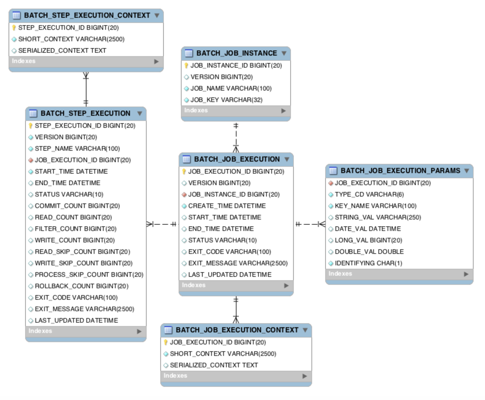

- [Materials](#materials)
- [Basic](#basic)
	- [Concept](#concept)
	- [Simple Spring Batch](#simple-spring-batch)
	- [Simple Spring Batch with mysql](#simple-spring-batch-with-mysql)
	- [Spring Batch Meta Data](#spring-batch-meta-data)
	- [Run specific Job, next, on, from, decide](#run-specific-job-next-on-from-decide)

----

# Materials

* Jojoldu Spring Batch Guide
  * [src](https://github.com/jojoldu/spring-batch-in-action)
  * [1. Spring Batch 가이드 - 배치 어플리케이션이란?](https://jojoldu.tistory.com/324?category=902551)
  * [2. Spring Batch 가이드 - Batch Job 실행해보기](https://jojoldu.tistory.com/325)
  * [3. Spring Batch 가이드 - 메타테이블엿보기](https://jojoldu.tistory.com/326?category=902551)
  * [4. Spring Batch 가이드 - Spring Batch Job Flow](https://jojoldu.tistory.com/328?category=902551)
  * [5. Spring Batch 가이드 - Spring Batch Scope & Job Parameter](https://jojoldu.tistory.com/330?category=902551)
  * [6. Spring Batch 가이드 - Chunk 지향 처리](https://jojoldu.tistory.com/331?category=902551)
    * [Spring Batch에서 영속성 컨텍스트 문제 (processor에서 lazyException 발생할때)](https://jojoldu.tistory.com/146)
    * [Spring Batch Paging Reader 사용시 같은 조건의 데이터를 읽고 수정할때 문제](https://jojoldu.tistory.com/337?category=902551)
  * [7. Spring Batch 가이드 - ItemReader](https://jojoldu.tistory.com/336?category=902551)
  * [8. Spring Batch 가이드 - ItemWriter](https://jojoldu.tistory.com/339?category=902551)
  * [9. Spring Batch 가이드 - ItemProcessor](https://jojoldu.tistory.com/347?category=902551)
    * [Spring batch & JPA에서 N+1 문제 해결](https://jojoldu.tistory.com/414?category=902551)
    * [Spring Batch 공통 설정 관리하기 (feat. 젠킨스 Environment variables)](https://jojoldu.tistory.com/445?category=902551)
    * [3. AWS Code Deploy로 배포 Jenkins에서 배치 Jenkins로 Spring Batch 배포하기 - 젠킨스 연동](https://jojoldu.tistory.com/445?category=902551)
    * [Spring Batch의 멱등성 유지하기](https://jojoldu.tistory.com/451?category=902551)
  * [10. Spring Batch 가이드 - Spring Batch 테스트 코드](https://jojoldu.tistory.com/455?category=902551)
    * [10.1. Spring Batch 단위 테스트 코드 - Reader 편](https://jojoldu.tistory.com/456?category=902551)
  * [Spring Batch와 QuerydslItemReader](https://jojoldu.tistory.com/473?category=902551)
  * [Spring Batch의 유니크 Job Parameter 활용하기](https://jojoldu.tistory.com/487?category=902551)
  * [Spring Batch 관리 도구로서의 Jenkins](https://jojoldu.tistory.com/489?category=902551)
  * [JobParameter 활용 방법 (feat. LocalDate 파라미터 사용하기)](https://jojoldu.tistory.com/490?category=902551)

* [Spring Batch - Reference Documentation](https://docs.spring.io/spring-batch/docs/current/reference/html/index.html)

# Basic

## Concept

Spring batch 는 job 과 step 으로 구성된다. 하나의 job 은 여러 step 들로 구성된다. 하나의 step 은 여러 tasklet 으로 구성된다. 특히 ChuckOrientedTasklet 은 chuck 단위로 처리하고 ItemReader, ItemWriter, ItemProcessor 로 구성된다. 이때 ItemProcessor 는 생략할 수 있다.


## Simple Spring Batch

* [exbatch](https://github.com/iamslash/spring-examples/exbatch)

-----

build.gradle

```gradle
plugins {
	id 'org.springframework.boot' version '2.2.7.RELEASE'
	id 'io.spring.dependency-management' version '1.0.9.RELEASE'
	id 'java'
	id 'eclipse'
}

group = 'com.iamslash'
version = '0.0.1-SNAPSHOT'
sourceCompatibility = '1.8'

repositories {
	mavenCentral()
}

dependencies {
	implementation 'org.springframework.boot:spring-boot-starter-batch'
	implementation 'org.springframework.boot:spring-boot-starter-data-jpa'
	implementation 'org.springframework.boot:spring-boot-starter-data-jdbc'
	implementation 'com.h2database:h2'
	implementation 'mysql:mysql-connector-java'
	implementation 'org.projectlombok:lombok'
	testImplementation('org.springframework.boot:spring-boot-starter-test') {
		exclude group: 'org.junit.vintage', module: 'junit-vintage-engine'
	}
	testImplementation('org.springframework.batch:spring-batch-test')
}

test {
	useJUnitPlatform()
}
```

다음과 같이 Application class 에 `@EnableBatchProcessing` 을 추가한다.

```java
@EnableBatchProcessing
@SpringBootApplication
public class ExbatchApplication {

	public static void main(String[] args) {
		SpringApplication.run(ExbatchApplication.class, args);
	}

}
```

이제 Job 생성을 위해 다음과 같이 `SimpleJobConfiguration.java` 을 작성한다. Spring Batch Job 은 `@Configuration` 으로 등록해서 사용한다.

```java
@Slf4j
@RequiredArgsConstructor
@Configuration
public class SimpleJobConfiguration {
  public static final String JOB_NAME = "simpleJob";
  private final JobBuilderFactory jobBuilderFactory;
  private final StepBuilderFactory stepBuilderFactory;

  @Bean
  public Job simpleJob() {
    return jobBuilderFactory.get(JOB_NAME)
        .start(simpleStep1())
        .build();
  }

  @Bean
  public Step simpleStep1() {
    return stepBuilderFactory.get("simpleStep1")
        .tasklet((contribution, chunkContext) -> {
          log.info(">>>>> This is simpleStep1");
          return RepeatStatus.FINISHED;
        })
        .build();
  }
}
```

이제 `ExbatchApplication` 실행하면 `simpleJob` 및 `simpleStep1` 이 실행됨을 확인할 수 있다.

## Simple Spring Batch with mysql

* [exbatch](https://github.com/iamslash/spring-examples/exbatch)

-----

Spring Batch 는 Meta Data 를 활용하여 이전에 실행한 Job, 최근 실패한 Job, 성공한 Job 등을 확인할 수 있다. 또한 다시 Job 을 실행한다면 어디서 부터 시작하면 되는지 그 Job 에 어떤 Step 들이 있고 성공 또는 실패한 Step 들을 확인할 수 있다.

다음은 Spring Batch 의 Meta Data Schema 이다.



먼저 mysql 을 다음과 같이 실행힌다.

```console
$ docker run -p3306:3306 --rm --name my-mysql -e MYSQL_ROOT_PASSWORD=1 -e MYSQL_DATABASE=spring_batch -e MYSQL_USER=iamslash -e MYSQL_PASSWORD=1 -d mysql

$ docker ps
$ docker exec -it my-mysql /bin/bash

$ mysql -u iamslash -p
mysql> 
```

그리고 Spring Batch Meta Data 를 제작한다. `org.springframework.batch:spring-batch-core:4.2.2.RELEASE/schema-mysql.sql` 을 실행한다. 화면에 복사 붙여넣기 해도 잘됨. 마지막에 commit 을 잊지 말자.

```sql
-- Autogenerated: do not edit this file

CREATE TABLE BATCH_JOB_INSTANCE  (
	JOB_INSTANCE_ID BIGINT  NOT NULL PRIMARY KEY ,
	VERSION BIGINT ,
	JOB_NAME VARCHAR(100) NOT NULL,
	JOB_KEY VARCHAR(32) NOT NULL,
	constraint JOB_INST_UN unique (JOB_NAME, JOB_KEY)
) ENGINE=InnoDB;

CREATE TABLE BATCH_JOB_EXECUTION  (
	JOB_EXECUTION_ID BIGINT  NOT NULL PRIMARY KEY ,
	VERSION BIGINT  ,
	JOB_INSTANCE_ID BIGINT NOT NULL,
	CREATE_TIME DATETIME NOT NULL,
	START_TIME DATETIME DEFAULT NULL ,
	END_TIME DATETIME DEFAULT NULL ,
	STATUS VARCHAR(10) ,
	EXIT_CODE VARCHAR(2500) ,
	EXIT_MESSAGE VARCHAR(2500) ,
	LAST_UPDATED DATETIME,
	JOB_CONFIGURATION_LOCATION VARCHAR(2500) NULL,
	constraint JOB_INST_EXEC_FK foreign key (JOB_INSTANCE_ID)
	references BATCH_JOB_INSTANCE(JOB_INSTANCE_ID)
) ENGINE=InnoDB;

CREATE TABLE BATCH_JOB_EXECUTION_PARAMS  (
	JOB_EXECUTION_ID BIGINT NOT NULL ,
	TYPE_CD VARCHAR(6) NOT NULL ,
	KEY_NAME VARCHAR(100) NOT NULL ,
	STRING_VAL VARCHAR(250) ,
	DATE_VAL DATETIME DEFAULT NULL ,
	LONG_VAL BIGINT ,
	DOUBLE_VAL DOUBLE PRECISION ,
	IDENTIFYING CHAR(1) NOT NULL ,
	constraint JOB_EXEC_PARAMS_FK foreign key (JOB_EXECUTION_ID)
	references BATCH_JOB_EXECUTION(JOB_EXECUTION_ID)
) ENGINE=InnoDB;

CREATE TABLE BATCH_STEP_EXECUTION  (
	STEP_EXECUTION_ID BIGINT  NOT NULL PRIMARY KEY ,
	VERSION BIGINT NOT NULL,
	STEP_NAME VARCHAR(100) NOT NULL,
	JOB_EXECUTION_ID BIGINT NOT NULL,
	START_TIME DATETIME NOT NULL ,
	END_TIME DATETIME DEFAULT NULL ,
	STATUS VARCHAR(10) ,
	COMMIT_COUNT BIGINT ,
	READ_COUNT BIGINT ,
	FILTER_COUNT BIGINT ,
	WRITE_COUNT BIGINT ,
	READ_SKIP_COUNT BIGINT ,
	WRITE_SKIP_COUNT BIGINT ,
	PROCESS_SKIP_COUNT BIGINT ,
	ROLLBACK_COUNT BIGINT ,
	EXIT_CODE VARCHAR(2500) ,
	EXIT_MESSAGE VARCHAR(2500) ,
	LAST_UPDATED DATETIME,
	constraint JOB_EXEC_STEP_FK foreign key (JOB_EXECUTION_ID)
	references BATCH_JOB_EXECUTION(JOB_EXECUTION_ID)
) ENGINE=InnoDB;

CREATE TABLE BATCH_STEP_EXECUTION_CONTEXT  (
	STEP_EXECUTION_ID BIGINT NOT NULL PRIMARY KEY,
	SHORT_CONTEXT VARCHAR(2500) NOT NULL,
	SERIALIZED_CONTEXT TEXT ,
	constraint STEP_EXEC_CTX_FK foreign key (STEP_EXECUTION_ID)
	references BATCH_STEP_EXECUTION(STEP_EXECUTION_ID)
) ENGINE=InnoDB;

CREATE TABLE BATCH_JOB_EXECUTION_CONTEXT  (
	JOB_EXECUTION_ID BIGINT NOT NULL PRIMARY KEY,
	SHORT_CONTEXT VARCHAR(2500) NOT NULL,
	SERIALIZED_CONTEXT TEXT ,
	constraint JOB_EXEC_CTX_FK foreign key (JOB_EXECUTION_ID)
	references BATCH_JOB_EXECUTION(JOB_EXECUTION_ID)
) ENGINE=InnoDB;

CREATE TABLE BATCH_STEP_EXECUTION_SEQ (
	ID BIGINT NOT NULL,
	UNIQUE_KEY CHAR(1) NOT NULL,
	constraint UNIQUE_KEY_UN unique (UNIQUE_KEY)
) ENGINE=InnoDB;

INSERT INTO BATCH_STEP_EXECUTION_SEQ (ID, UNIQUE_KEY) select * from (select 0 as ID, '0' as UNIQUE_KEY) as tmp where not exists(select * from BATCH_STEP_EXECUTION_SEQ);

CREATE TABLE BATCH_JOB_EXECUTION_SEQ (
	ID BIGINT NOT NULL,
	UNIQUE_KEY CHAR(1) NOT NULL,
	constraint UNIQUE_KEY_UN unique (UNIQUE_KEY)
) ENGINE=InnoDB;

INSERT INTO BATCH_JOB_EXECUTION_SEQ (ID, UNIQUE_KEY) select * from (select 0 as ID, '0' as UNIQUE_KEY) as tmp where not exists(select * from BATCH_JOB_EXECUTION_SEQ);

CREATE TABLE BATCH_JOB_SEQ (
	ID BIGINT NOT NULL,
	UNIQUE_KEY CHAR(1) NOT NULL,
	constraint UNIQUE_KEY_UN unique (UNIQUE_KEY)
) ENGINE=InnoDB;

INSERT INTO BATCH_JOB_SEQ (ID, UNIQUE_KEY) select * from (select 0 as ID, '0' as UNIQUE_KEY) as tmp where not exists(select * from BATCH_JOB_SEQ);
```

다음과 같이 `src/main/resources/application.yml` 을 작성한다.

```yml
spring:
  profiles:
    active: local-h2

---
spring:
  profiles: local-h2
  datasource:
    hikari:
      jdbc-url: jdbc:h2:mem:testdb;DB_CLOSE_DELAY=-1;DB_CLOSE_ON_EXIT=FALSE
      username: iamslash
      password: 1
      driver-class-name: org.h2.Driver
---
spring:
  profiles: local-mysql
  datasource:
    hikari:
      jdbc-url: jdbc:mysql://localhost:3306/spring_batch
      username: iamslash
      password: 1
      driver-class-name: com.mysql.jdbc.Driver
```

다음과 같이 VM option 을 설정하고 실행한다.

```console
-Dspring.profiles.active=local-mysql
```

## Spring Batch Meta Data

`BATCH_JOB_INSTANCE` 의 내용을 확인해 보자. 방금 실행한 `simpleJob` 을 확인할 수 있다.

```console
mysql> select * from BATCH_JOB_INSTANCE;
+-----------------+---------+-----------+----------------------------------+
| JOB_INSTANCE_ID | VERSION | JOB_NAME  | JOB_KEY                          |
+-----------------+---------+-----------+----------------------------------+
|               1 |       0 | simpleJob | d41d8cd98f00b204e9800998ecf8427e |
+-----------------+---------+-----------+----------------------------------+
1 row in set (0.00 sec)
```

Job 에 Parameter 를 전달할 수 있다. 이전 Job 의 Parameter 와 현재 Job 의 Parameter 가 달라야 새로운 Job 이 실행된다. 다음과 같이 Job 에 Parameter 를 넘겨졀 수 있도록 SimpleJob 을 수정한다.

```java
@Slf4j
@RequiredArgsConstructor
@Configuration
public class SimpleJobConfiguration {
  public static final String JOB_NAME = "simpleJob";
  private final JobBuilderFactory jobBuilderFactory;
  private final StepBuilderFactory stepBuilderFactory;

  @Bean
  public Job simpleJob() {
    return jobBuilderFactory.get(JOB_NAME)
        .start(simpleStep1(null))
        .build();
  }

  @Bean
  @JobScope
  public Step simpleStep1(@Value("#{jobParameters[requestDate]}") String requestDate) {
    return stepBuilderFactory.get("simpleStep1")
        .tasklet((contribution, chunkContext) -> {
          log.info(">>>>> This is simpleStep1");
          return RepeatStatus.FINISHED;
        })
        .build();
  }
}
```

그리고 다음과 같이 Program arguments 를 설정하고 `local-mysql` profile 을 실행한다.

```console
requestDate=20200515
```

다시 BATCH_JOB_INSTANCE 를 확인한다.

```console
mysql> select * from BATCH_JOB_INSTANCE;
+-----------------+---------+-----------+----------------------------------+
| JOB_INSTANCE_ID | VERSION | JOB_NAME  | JOB_KEY                          |
+-----------------+---------+-----------+----------------------------------+
|               1 |       0 | simpleJob | d41d8cd98f00b204e9800998ecf8427e |
|               2 |       0 | simpleJob | cfb76ad9663511a193c068517a46e609 |
+-----------------+---------+-----------+----------------------------------+
```

또한 BATCH_JOB_EXECUTION_PARAMS 도 확인해 보자.

```console
mysql> select * from BATCH_JOB_EXECUTION_PARAMS;
+------------------+---------+-------------+------------+---------------------+----------+------------+-------------+
| JOB_EXECUTION_ID | TYPE_CD | KEY_NAME    | STRING_VAL | DATE_VAL            | LONG_VAL | DOUBLE_VAL | IDENTIFYING |
+------------------+---------+-------------+------------+---------------------+----------+------------+-------------+
|                2 | STRING  | requestDate | 20200515   | 1970-01-01 00:00:00 |        0 |          0 | Y           |
+------------------+---------+-------------+------------+---------------------+----------+------------+-------------+
```

한번 더 실행하고 BATCH_JOB_INSTANCE 를 확인해보자. Parameter 가 달라지지 않았기 때문에 변화가 없다.

## Run specific Job, next, on, from, decide

SpringJobBuilder::next 는 단순히 다음 step 을 실행한다. 다음과 같이 `com.iamslash.exbatch.stepnextjob.StepNextJobConfiguration` 을 추가한다.

```java

@Slf4j
@Configuration
@RequiredArgsConstructor
public class StepNextJobConfiguration {

  private final JobBuilderFactory jobBuilderFactory;
  private final StepBuilderFactory stepBuilderFactory;

  @Bean
  public Job stepNextJob() {
    return jobBuilderFactory.get("stepNextJob")
        .start(step1())
        .next(step2())
        .next(step3())
        .build();
  }

  @Bean
  public Step step1() {
    return stepBuilderFactory.get("step1")
        .tasklet((contribution, chunkContext) -> {
          log.info(">>>>> This is Step1");
          return RepeatStatus.FINISHED;
        })
        .build();
  }

  @Bean
  public Step step2() {
    return stepBuilderFactory.get("step2")
        .tasklet((contribution, chunkContext) -> {
          log.info(">>>>> This is Step2");
          return RepeatStatus.FINISHED;
        })
        .build();
  }

  @Bean
  public Step step3() {
    return stepBuilderFactory.get("step3")
        .tasklet((contribution, chunkContext) -> {
          log.info(">>>>> This is Step3");
          return RepeatStatus.FINISHED;
        })
        .build();
  }
}
```

특정한 Job 만 실행해보자. 다음과 같이 application.yml 을 수정한다. `job.name` 이 NULL 이면 NONE 이 전달된다. NONE 이 전달되면 아무 Job 도 실행되지 않는다.

```yml
spring:
  profiles:
    active: local-h2
  batch:
    job:
      names: ${job.name:NONE}
---
spring:
  profiles: local-h2
  datasource:
    hikari:
      jdbc-url: jdbc:h2:mem:testdb;DB_CLOSE_DELAY=-1;DB_CLOSE_ON_EXIT=FALSE
      username: iamslash
      password: 1
      driver-class-name: org.h2.Driver
---
spring:
  profiles: local-mysql
  datasource:
    hikari:
      jdbc-url: jdbc:mysql://localhost:3306/spring_batch
      username: iamslash
      password: 1
      driver-class-name: com.mysql.jdbc.Driver
```

다음과 같이 Program Arguments 를 설정하고 실행한다.

```console
--job.name=stepNextJob version=1
```

BATCH_JOB_EXECUTION 를 확인해 보자. `stepNextJob` 이 실행되었다.

```
mysql> select * from BATCH_JOB_EXECUTION;
+------------------+---------+-----------------+---------------------+---------------------+---------------------+-----------+-----------+--------------+---------------------+----------------------------+
| JOB_EXECUTION_ID | VERSION | JOB_INSTANCE_ID | CREATE_TIME         | START_TIME          | END_TIME            | STATUS    | EXIT_CODE | EXIT_MESSAGE | LAST_UPDATED        | JOB_CONFIGURATION_LOCATION |
+------------------+---------+-----------------+---------------------+---------------------+---------------------+-----------+-----------+--------------+---------------------+----------------------------+
|                1 |       2 |               1 | 2020-05-15 11:40:14 | 2020-05-15 11:40:14 | 2020-05-15 11:40:15 | COMPLETED | COMPLETED |              | 2020-05-15 11:40:15 | NULL                       |
|                2 |       2 |               2 | 2020-05-15 11:57:18 | 2020-05-15 11:57:18 | 2020-05-15 11:57:18 | COMPLETED | COMPLETED |              | 2020-05-15 11:57:18 | NULL                       |
|                3 |       2 |               3 | 2020-05-15 12:12:58 | 2020-05-15 12:12:58 | 2020-05-15 12:12:58 | COMPLETED | COMPLETED |              | 2020-05-15 12:12:58 | NULL                       |
+------------------+---------+-----------------+---------------------+---------------------+---------------------+-----------+-----------+--------------+---------------------+----------------------------+
```

다음은 on 을 사용하여 step 들을 control flow 해 보자. 다음과 같이 `com.iamslash.exbatch.stepnextconditionaljob.StepNextConditionalJob` 을 작성한다.

```java

@Slf4j
@Configuration
@RequiredArgsConstructor
public class StepNextConditionalJobConfiguration {

  private final JobBuilderFactory jobBuilderFactory;
  private final StepBuilderFactory stepBuilderFactory;

  @Bean
  public Job stepNextConditionalJob() {
    return jobBuilderFactory.get("stepNextConditionalJob")
        .start(conditionalJobStep1())
        .on("FAILED")
        .to(conditionalJobStep3())
        .on("*")
        .end()
        .from(conditionalJobStep1())
        .on("*")
        .to(conditionalJobStep2())
        .next(conditionalJobStep3())
        .on("*")
        .end()
        .end()
        .build();
  }

  @Bean
  public Step conditionalJobStep1() {
    return stepBuilderFactory.get("step1")
        .tasklet((contribution, chunkContext) -> {
          log.info(">>>>> This is stepNextConditionalJob Step1");
          contribution.setExitStatus(ExitStatus.FAILED);
          return RepeatStatus.FINISHED;
        })
        .build();
  }

  @Bean
  public Step conditionalJobStep2() {
    return stepBuilderFactory.get("conditionalJobStep2")
        .tasklet((contribution, chunkContext) -> {
          log.info(">>>>> This is stepNextConditionalJob Step2");
          return RepeatStatus.FINISHED;
        })
        .build();
  }

  @Bean
  public Step conditionalJobStep3() {
    return stepBuilderFactory.get("conditionalJobStep3")
        .tasklet((contribution, chunkContext) -> {
          log.info(">>>>> This is stepNextConditionalJob Step3");
          return RepeatStatus.FINISHED;
        })
        .build();
  }
}
```

step1 이 실패하면 다음과 같은 flow 를 갖는다.

```
step1 -> step3 -> end
```

step1 이 성공하면 다음과 같은 flow 를 갖는다.

```
step1 -> step2 -> step3 -> end
```

이번에는 decider 를 이용하여 flow control 해 보자. 다음과 같이 `` 를 작성한다.

```java

@Slf4j
@Configuration
@RequiredArgsConstructor
public class DeciderJobConfiguration {
  private final JobBuilderFactory jobBuilderFactory;
  private final StepBuilderFactory stepBuilderFactory;

  @Bean
  public Job deciderJob() {
    return jobBuilderFactory.get("deciderJob")
        .start(startStep())
        .next(decider())
        .from(decider())
        .on("ODD")
        .to(oddStep())
        .from(decider())
        .on("EVEN")
        .to(evenStep())
        .end()
        .build();
  }

  @Bean
  public Step startStep() {
    return stepBuilderFactory.get("startStep")
        .tasklet((contribution, chunkContext) -> {
          log.info(">>>>> Start!");
          return RepeatStatus.FINISHED;
        })
        .build();
  }

  @Bean
  public Step evenStep() {
    return stepBuilderFactory.get("evenStep")
        .tasklet((contribution, chunkContext) -> {
          log.info(">>>>> 짝수입니다.");
          return RepeatStatus.FINISHED;
        })
        .build();
  }

  @Bean
  public Step oddStep() {
    return stepBuilderFactory.get("oddStep")
        .tasklet((contribution, chunkContext) -> {
          log.info(">>>>> 홀수입니다.");
          return RepeatStatus.FINISHED;
        })
        .build();
  }

  @Bean
  public JobExecutionDecider decider() {
    return new OddDecider();
  }

  public static class OddDecider implements JobExecutionDecider {

    @Override
    public FlowExecutionStatus decide(JobExecution jobExecution, StepExecution stepExecution) {
      Random rand = new Random();

      int randomNumber = rand.nextInt(50) + 1;
      log.info("랜덤숫자: {}", randomNumber);

      if(randomNumber % 2 == 0) {
        return new FlowExecutionStatus("EVEN");
      } else {
        return new FlowExecutionStatus("ODD");
      }
    }
  }
}
```
