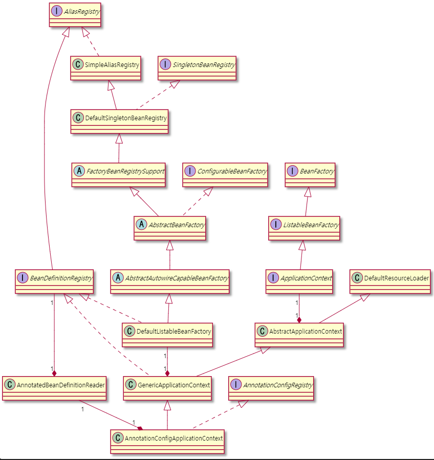
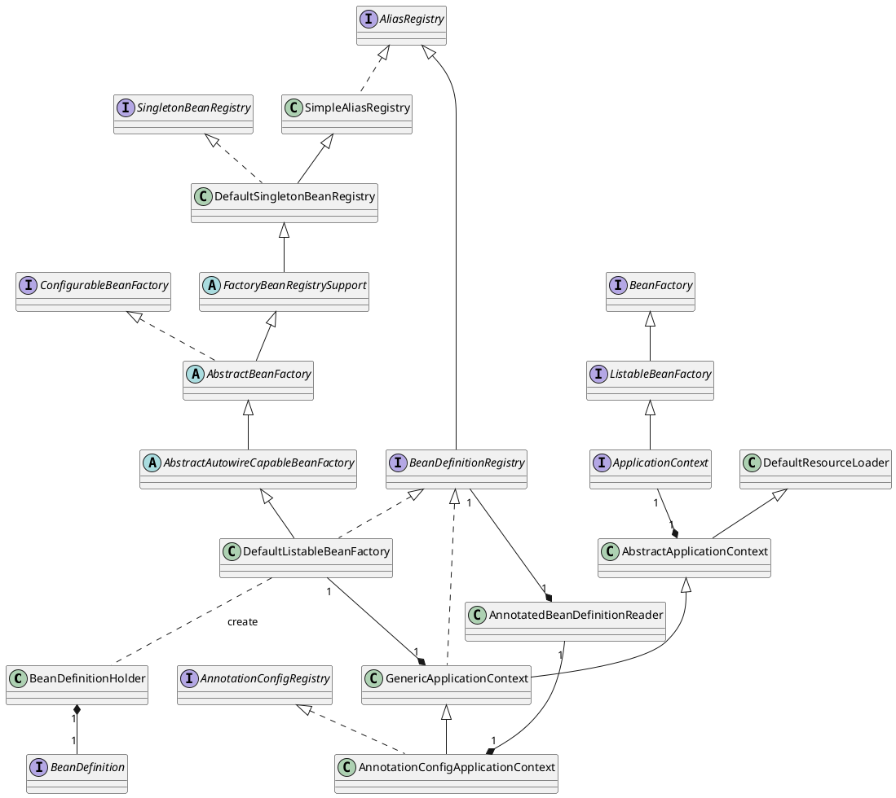

- [Abstract](#abstract)
- [How to run SpringApplication](#how-to-run-springapplication)
- [How to gather WebApplicationInitializer and run them](#how-to-gather-webapplicationinitializer-and-run-them)
- [How to read application.yml](#how-to-read-applicationyml)
- [How to event handler works](#how-to-event-handler-works)
- [How to ApplicationRunner works](#how-to-applicationrunner-works)
- [Beans Processing](#beans-processing)
	- [Summary](#summary)
	- [Class Diagram](#class-diagram)
- [How to register beans](#how-to-register-beans)
	- [Summary](#summary-1)
	- [Sequences](#sequences)
- [How to instantiate Bean](#how-to-instantiate-bean)
	- [Summary](#summary-2)
- [How autoconfigure works](#how-autoconfigure-works)
	- [Summary](#summary-3)
	- [Sequences](#sequences-1)
- [How to read bootstrap.yml](#how-to-read-bootstrapyml)
- [How to process HTTP request](#how-to-process-http-request)

----

# Abstract

This is about code tour of spring-boot-2.2.6.

# How to run SpringApplication

* `/org/springframework/boot/SpringApplication.class::run`

```java
	/**
	 * Run the Spring application, creating and refreshing a new
	 * {@link ApplicationContext}.
	 * @param args the application arguments (usually passed from a Java main method)
	 * @return a running {@link ApplicationContext}
	 */
	public ConfigurableApplicationContext run(String... args) {
		StopWatch stopWatch = new StopWatch();
		stopWatch.start();
		ConfigurableApplicationContext context = null;
		Collection<SpringBootExceptionReporter> exceptionReporters = new ArrayList<>();
		configureHeadlessProperty();
		SpringApplicationRunListeners listeners = getRunListeners(args);
		listeners.starting();
		try {
			ApplicationArguments applicationArguments = new DefaultApplicationArguments(args);
			ConfigurableEnvironment environment = prepareEnvironment(listeners, applicationArguments);
			configureIgnoreBeanInfo(environment);
			Banner printedBanner = printBanner(environment);
			context = createApplicationContext();
			exceptionReporters = getSpringFactoriesInstances(SpringBootExceptionReporter.class,
					new Class[] { ConfigurableApplicationContext.class }, context);
			prepareContext(context, environment, listeners, applicationArguments, printedBanner);
			refreshContext(context);
			afterRefresh(context, applicationArguments);
			stopWatch.stop();
			if (this.logStartupInfo) {
				new StartupInfoLogger(this.mainApplicationClass).logStarted(getApplicationLog(), stopWatch);
			}
			listeners.started(context);
			callRunners(context, applicationArguments);
		}
		catch (Throwable ex) {
			handleRunFailure(context, ex, exceptionReporters, listeners);
			throw new IllegalStateException(ex);
		}

		try {
			listeners.running(context);
		}
		catch (Throwable ex) {
			handleRunFailure(context, ex, exceptionReporters, null);
			throw new IllegalStateException(ex);
		}
		return context;
	}
```

# How to gather WebApplicationInitializer and run them

`WebApplicationInitiliazer` 를 extend 하는 class 를 정의하면 어떤 원리에 의해 실행되는지 정리한다.

* `org.springframework.web.SpringServletContainerInitializer::onStartup`
  * `webAppInitializerClasses` argument 로 `WebApplicationInitializer` class 들을 가져온다.
  * `WebApplicationInitializer` instace 들을 생성한다.
  * `WebApplicationInitializer` instace 들을 순회하면서 하나씩 실행한다.

```java
	@Override
	public void onStartup(@Nullable Set<Class<?>> webAppInitializerClasses, ServletContext servletContext)
			throws ServletException {

		List<WebApplicationInitializer> initializers = new LinkedList<>();

		if (webAppInitializerClasses != null) {
			for (Class<?> waiClass : webAppInitializerClasses) {
				// Be defensive: Some servlet containers provide us with invalid classes,
				// no matter what @HandlesTypes says...
				if (!waiClass.isInterface() && !Modifier.isAbstract(waiClass.getModifiers()) &&
						WebApplicationInitializer.class.isAssignableFrom(waiClass)) {
					try {
						initializers.add((WebApplicationInitializer)
								ReflectionUtils.accessibleConstructor(waiClass).newInstance());
					}
					catch (Throwable ex) {
						throw new ServletException("Failed to instantiate WebApplicationInitializer class", ex);
					}
				}
			}
		}

		if (initializers.isEmpty()) {
			servletContext.log("No Spring WebApplicationInitializer types detected on classpath");
			return;
		}

		servletContext.log(initializers.size() + " Spring WebApplicationInitializers detected on classpath");
		AnnotationAwareOrderComparator.sort(initializers);
		for (WebApplicationInitializer initializer : initializers) {
			initializer.onStartup(servletContext);
		}
	}
```

# How to read application.yml

* `org/springframework/boot/SpringApplication::run`

```java
	public ConfigurableApplicationContext run(String... args) {
		StopWatch stopWatch = new StopWatch();
		stopWatch.start();
		ConfigurableApplicationContext context = null;
		Collection<SpringBootExceptionReporter> exceptionReporters = new ArrayList<>();
		configureHeadlessProperty();
		SpringApplicationRunListeners listeners = getRunListeners(args);
		listeners.starting();
		try {
			ApplicationArguments applicationArguments = new DefaultApplicationArguments(args);
			ConfigurableEnvironment environment = prepareEnvironment(listeners, applicationArguments);

```

* `org/springframework/boot/context/config/ConfigFileApplicationListener::onApplicationEvent`

```java
	@Override
	public void onApplicationEvent(ApplicationEvent event) {
		if (event instanceof ApplicationEnvironmentPreparedEvent) {
			onApplicationEnvironmentPreparedEvent((ApplicationEnvironmentPreparedEvent) event);
		}
		if (event instanceof ApplicationPreparedEvent) {
			onApplicationPreparedEvent(event);
		}
	}
```

* `org/springframework/boot/context/config/ConfigFileApplicationListener::load`

```java
		void load() {
			FilteredPropertySource.apply(this.environment, DEFAULT_PROPERTIES, LOAD_FILTERED_PROPERTY,
					(defaultProperties) -> {
						this.profiles = new LinkedList<>();
						this.processedProfiles = new LinkedList<>();
						this.activatedProfiles = false;
						this.loaded = new LinkedHashMap<>();
						initializeProfiles();
						while (!this.profiles.isEmpty()) {
							Profile profile = this.profiles.poll();
							if (isDefaultProfile(profile)) {
								addProfileToEnvironment(profile.getName());
							}
							load(profile, this::getPositiveProfileFilter,
									addToLoaded(MutablePropertySources::addLast, false));
							this.processedProfiles.add(profile);
						}
						load(null, this::getNegativeProfileFilter, addToLoaded(MutablePropertySources::addFirst, true));
						addLoadedPropertySources();
						applyActiveProfiles(defaultProperties);
					});
		}
```

* `org/springframework/boot/context/config/ConfigFileApplicationListener::load`

```java
		private void load(String location, String name, Profile profile, DocumentFilterFactory filterFactory,
				DocumentConsumer consumer) {
			if (!StringUtils.hasText(name)) {
				for (PropertySourceLoader loader : this.propertySourceLoaders) {
					if (canLoadFileExtension(loader, location)) {
						load(loader, location, profile, filterFactory.getDocumentFilter(profile), consumer);
						return;
					}
				}
				throw new IllegalStateException("File extension of config file location '" + location
						+ "' is not known to any PropertySourceLoader. If the location is meant to reference "
						+ "a directory, it must end in '/'");
			}
			Set<String> processed = new HashSet<>();
			for (PropertySourceLoader loader : this.propertySourceLoaders) {
				for (String fileExtension : loader.getFileExtensions()) {
					if (processed.add(fileExtension)) {
						loadForFileExtension(loader, location + name, "." + fileExtension, profile, filterFactory,
								consumer);
					}
				}
			}
		}
```

* `org/springframework/boot/context/config/ConfigFileApplicationListener::loadForFileExtension`

```java

public class ConfigFileApplicationListener implements EnvironmentPostProcessor, SmartApplicationListener, Ordered {

	private static final String DEFAULT_PROPERTIES = "defaultProperties";

	// Note the order is from least to most specific (last one wins)
	private static final String DEFAULT_SEARCH_LOCATIONS = "classpath:/,classpath:/config/,file:./,file:./config/";

	private static final String DEFAULT_NAMES = "application";
...
	private void loadForFileExtension(PropertySourceLoader loader, String prefix, String fileExtension,
			Profile profile, DocumentFilterFactory filterFactory, DocumentConsumer consumer) {
		DocumentFilter defaultFilter = filterFactory.getDocumentFilter(null);
		DocumentFilter profileFilter = filterFactory.getDocumentFilter(profile);
		if (profile != null) {
			// Try profile-specific file & profile section in profile file (gh-340)
			String profileSpecificFile = prefix + "-" + profile + fileExtension;
			load(loader, profileSpecificFile, profile, defaultFilter, consumer);
			load(loader, profileSpecificFile, profile, profileFilter, consumer);
			// Try profile specific sections in files we've already processed
			for (Profile processedProfile : this.processedProfiles) {
				if (processedProfile != null) {
					String previouslyLoaded = prefix + "-" + processedProfile + fileExtension;
					load(loader, previouslyLoaded, profile, profileFilter, consumer);
				}
			}
		}
		// Also try the profile-specific section (if any) of the normal file
		load(loader, prefix + fileExtension, profile, profileFilter, consumer);
	}
```

* `org/springframework/boot/context/config/ConfigFileApplicationListener::load`

```java
		private void load(PropertySourceLoader loader, String location, Profile profile, DocumentFilter filter,
				DocumentConsumer consumer) {
			try {
				Resource resource = this.resourceLoader.getResource(location);
				if (resource == null || !resource.exists()) {
					if (this.logger.isTraceEnabled()) {
						StringBuilder description = getDescription("Skipped missing config ", location, resource,
								profile);
						this.logger.trace(description);
					}
					return;
				}
				if (!StringUtils.hasText(StringUtils.getFilenameExtension(resource.getFilename()))) {
					if (this.logger.isTraceEnabled()) {
						StringBuilder description = getDescription("Skipped empty config extension ", location,
								resource, profile);
						this.logger.trace(description);
					}
					return;
				}
				String name = "applicationConfig: [" + location + "]";
				List<Document> documents = loadDocuments(loader, name, resource);
				if (CollectionUtils.isEmpty(documents)) {
					if (this.logger.isTraceEnabled()) {
						StringBuilder description = getDescription("Skipped unloaded config ", location, resource,
								profile);
						this.logger.trace(description);
					}
					return;
				}
				List<Document> loaded = new ArrayList<>();
				for (Document document : documents) {
					if (filter.match(document)) {
						addActiveProfiles(document.getActiveProfiles());
						addIncludedProfiles(document.getIncludeProfiles());
						loaded.add(document);
					}
				}
				Collections.reverse(loaded);
				if (!loaded.isEmpty()) {
					loaded.forEach((document) -> consumer.accept(profile, document));
					if (this.logger.isDebugEnabled()) {
						StringBuilder description = getDescription("Loaded config file ", location, resource, profile);
						this.logger.debug(description);
					}
				}
			}
			catch (Exception ex) {
				throw new IllegalStateException("Failed to load property source from location '" + location + "'", ex);
			}
		}

```

# How to event handler works

* `org/springframework/boot/SpringApplication::run`

```java
	public ConfigurableApplicationContext run(String... args) {
...
		try {
			listeners.running(context);
		}
		catch (Throwable ex) {
			handleRunFailure(context, ex, exceptionReporters, null);
			throw new IllegalStateException(ex);
		}
		return context;
	}
```

* `/org/springframework/boot/context/event/EventPublishingRunListener::running`

```java
	@Override
	public void running(ConfigurableApplicationContext context) {
		context.publishEvent(new ApplicationReadyEvent(this.application, this.args, context));
	}
```

* `org.springframework.context.event.ApplicationListenerMethodAdapter::onApplicationEvent`

```java
	@Override
	public void onApplicationEvent(ApplicationEvent event) {
		processEvent(event);
	}
```

# How to ApplicationRunner works

* `org/springframework/boot/SpringApplication::run`

```java
	public ConfigurableApplicationContext run(String... args) {
    ...
			listeners.started(context);
			callRunners(context, applicationArguments);
```

* `org/springframework/boot/SpringApplication::callRunners`

```java
	private void callRunners(ApplicationContext context, ApplicationArguments args) {
		List<Object> runners = new ArrayList<>();
		runners.addAll(context.getBeansOfType(ApplicationRunner.class).values());
		runners.addAll(context.getBeansOfType(CommandLineRunner.class).values());
		AnnotationAwareOrderComparator.sort(runners);
		for (Object runner : new LinkedHashSet<>(runners)) {
			if (runner instanceof ApplicationRunner) {
				callRunner((ApplicationRunner) runner, args);
			}
			if (runner instanceof CommandLineRunner) {
				callRunner((CommandLineRunner) runner, args);
			}
		}
	}
```
# Beans Processing

* [Spring IoC Container를 까보자 #Bean 등록은 어떻게 될까?](https://blog.woniper.net/336?category=699184)

-----

## Summary

* Register Bean Definition to `Map<String, BeanDefinition>`.
* `getBean` instantiate Bean with `BeanDefinition` and save to `Map<String, Object>` for cache.

## Class Diagram

Bean Processing 을 이해하기 위해 먼저 class diagram 을 파악한다.





# How to register beans

## Summary

* `DefaultListableBeanFactory.registerBeanDefinition` register bean-name, bean-definition to `Map<String, BeanDefinition>`.

## Sequences

* `org.springframework.boot.SpringApplication::refresh`

```java
	public ConfigurableApplicationContext run(String... args) {
		StopWatch stopWatch = new StopWatch();
		stopWatch.start();
		ConfigurableApplicationContext context = null;
		Collection<SpringBootExceptionReporter> exceptionReporters = new ArrayList<>();
		configureHeadlessProperty();
		SpringApplicationRunListeners listeners = getRunListeners(args);
		listeners.starting();
		try {
			ApplicationArguments applicationArguments = new DefaultApplicationArguments(args);
			ConfigurableEnvironment environment = prepareEnvironment(listeners, applicationArguments);
			configureIgnoreBeanInfo(environment);
			Banner printedBanner = printBanner(environment);
			context = createApplicationContext();
			exceptionReporters = getSpringFactoriesInstances(SpringBootExceptionReporter.class,
					new Class[] { ConfigurableApplicationContext.class }, context);
			prepareContext(context, environment, listeners, applicationArguments, printedBanner);
			refreshContext(context);
```

* `org.springframework.boot.SpringApplication::refreshContext`

```java
	private void refreshContext(ConfigurableApplicationContext context) {
		refresh(context);
		if (this.registerShutdownHook) {
			try {
				context.registerShutdownHook();
			}
			catch (AccessControlException ex) {
				// Not allowed in some environments.
			}
		}
	}
```

* `org.springframework.boot.SpringApplication::refresh`

```java
	@Override
	public void refresh() throws BeansException, IllegalStateException {
		synchronized (this.startupShutdownMonitor) {
			// Prepare this context for refreshing.
			prepareRefresh();

			// Tell the subclass to refresh the internal bean factory.
			ConfigurableListableBeanFactory beanFactory = obtainFreshBeanFactory();

			// Prepare the bean factory for use in this context.
			prepareBeanFactory(beanFactory);

			try {
				// Allows post-processing of the bean factory in context subclasses.
				postProcessBeanFactory(beanFactory);

				// Invoke factory processors registered as beans in the context.
				invokeBeanFactoryPostProcessors(beanFactory);

				// Register bean processors that intercept bean creation.
				registerBeanPostProcessors(beanFactory);

				// Initialize message source for this context.
				initMessageSource();

				// Initialize event multicaster for this context.
				initApplicationEventMulticaster();

				// Initialize other special beans in specific context subclasses.
				onRefresh();

				// Check for listener beans and register them.
				registerListeners();

				// Instantiate all remaining (non-lazy-init) singletons.
				finishBeanFactoryInitialization(beanFactory);

				// Last step: publish corresponding event.
				finishRefresh();
			}

			catch (BeansException ex) {
				if (logger.isWarnEnabled()) {
					logger.warn("Exception encountered during context initialization - " +
							"cancelling refresh attempt: " + ex);
				}

				// Destroy already created singletons to avoid dangling resources.
				destroyBeans();

				// Reset 'active' flag.
				cancelRefresh(ex);

				// Propagate exception to caller.
				throw ex;
			}

			finally {
				// Reset common introspection caches in Spring's core, since we
				// might not ever need metadata for singleton beans anymore...
				resetCommonCaches();
			}
		}
	}
```

* `org.springframework.context.support.AbstractApplicationContext::refresh`

```java

	@Override
	public void refresh() throws BeansException, IllegalStateException {
		synchronized (this.startupShutdownMonitor) {
			// Prepare this context for refreshing.
			prepareRefresh();

			// Tell the subclass to refresh the internal bean factory.
			ConfigurableListableBeanFactory beanFactory = obtainFreshBeanFactory();

			// Prepare the bean factory for use in this context.
			prepareBeanFactory(beanFactory);

			try {
				// Allows post-processing of the bean factory in context subclasses.
				postProcessBeanFactory(beanFactory);

				// Invoke factory processors registered as beans in the context.
				invokeBeanFactoryPostProcessors(beanFactory);

				// Register bean processors that intercept bean creation.
				registerBeanPostProcessors(beanFactory);

				// Initialize message source for this context.
				initMessageSource();

				// Initialize event multicaster for this context.
				initApplicationEventMulticaster();

				// Initialize other special beans in specific context subclasses.
				onRefresh();

				// Check for listener beans and register them.
				registerListeners();

				// Instantiate all remaining (non-lazy-init) singletons.
				finishBeanFactoryInitialization(beanFactory);

				// Last step: publish corresponding event.
				finishRefresh();
			}

			catch (BeansException ex) {
				if (logger.isWarnEnabled()) {
					logger.warn("Exception encountered during context initialization - " +
							"cancelling refresh attempt: " + ex);
				}

				// Destroy already created singletons to avoid dangling resources.
				destroyBeans();

				// Reset 'active' flag.
				cancelRefresh(ex);

				// Propagate exception to caller.
				throw ex;
			}

			finally {
				// Reset common introspection caches in Spring's core, since we
				// might not ever need metadata for singleton beans anymore...
				resetCommonCaches();
			}
		}
	}
```

# How to instantiate Bean

## Summary

* `AnnotationConfigApplicationContext::getBean` starts to instantiate Bean.
* `AbstractBeanFactory.doGetBean` instantiate Bean.

# How autoconfigure works

## Summary

Spring Framework 는 classpath 에 존재하는 모든 `spring.factories` 파일들을 읽어들인다.

`@SpringBootApplication` 은 `@EnableAutoConfiguration` 을 포함하고 있다. `@SpringBootApplication` 이 사용되었다면 `spring-boot-autoconfigure-*/META-INF/spring.factories` 에 존재하는 `org.springframework.boot.autoconfigure.EnableAutoConfiguration` key 의 value 에 해당하는 `@Configuration Class` 들을 모아서 조건에 따라 Import 한다. 즉, 각 `@Configuration Class` 에 `@Bean` 이 부착된 method 들을 실행하여 Spring Bean 을 등록할 것이다.

```conf
# Auto Configure
org.springframework.boot.autoconfigure.EnableAutoConfiguration=\
org.springframework.boot.autoconfigure.admin.SpringApplicationAdminJmxAutoConfiguration,\
org.springframework.boot.autoconfigure.aop.AopAutoConfiguration,\
org.springframework.boot.autoconfigure.amqp.RabbitAutoConfiguration,\
org.springframework.boot.autoconfigure.batch.BatchAutoConfiguration,\
org.springframework.boot.autoconfigure.cache.CacheAutoConfiguration,\
```

## Sequences

`FACTORIES_RESOURCE_LOCATION` 에 `spring.factories` 파일 경로가 hard coding 되어 있다.

```java
// org.springframework.core.io.support.SpringFactoriesLoader
public final class SpringFactoriesLoader {

	/**
	 * The location to look for factories.
	 * <p>Can be present in multiple JAR files.
	 */
	public static final String FACTORIES_RESOURCE_LOCATION = "META-INF/spring.factories";

...
}
```

`loadFactoryNames` 에서 classpath 에 포함된 `spring.factories` 파일들을 로딩한다.
 
```java
// org.springframework.core.io.support.SpringFactoriesLoader
public final class SpringFactoriesLoader {
...	
	public static List<String> loadFactoryNames(Class<?> factoryType, @Nullable ClassLoader classLoader) {
		ClassLoader classLoaderToUse = classLoader;
		if (classLoaderToUse == null) {
			classLoaderToUse = SpringFactoriesLoader.class.getClassLoader();
		}
		String factoryTypeName = factoryType.getName();
		return loadSpringFactories(classLoaderToUse).getOrDefault(factoryTypeName, Collections.emptyList());
	}

	private static Map<String, List<String>> loadSpringFactories(ClassLoader classLoader) {
		Map<String, List<String>> result = cache.get(classLoader);
		if (result != null) {
			return result;
		}

		result = new HashMap<>();
		try {
			Enumeration<URL> urls = classLoader.getResources(FACTORIES_RESOURCE_LOCATION);
```

# How to read bootstrap.yml

* Should have spring-cloud-commons-2.2.2.RELEASE.jar

* `org.springframework.cloud.bootstrap.BootstrapApplicationListener`

```java
public class BootstrapApplicationListener
		implements ApplicationListener<ApplicationEnvironmentPreparedEvent>, Ordered {

	/**
	 * Property source name for bootstrap.
	 */
	public static final String BOOTSTRAP_PROPERTY_SOURCE_NAME = "bootstrap";

	/**
	 * The default order for this listener.
	 */
	public static final int DEFAULT_ORDER = Ordered.HIGHEST_PRECEDENCE + 5;

	/**
	 * The name of the default properties.
	 */
	public static final String DEFAULT_PROPERTIES = "springCloudDefaultProperties";

	private int order = DEFAULT_ORDER;
```

* `org.springframework.boot.SpringApplication::run`

```java
	public ConfigurableApplicationContext run(String... args) {
		StopWatch stopWatch = new StopWatch();
		stopWatch.start();
		ConfigurableApplicationContext context = null;
		Collection<SpringBootExceptionReporter> exceptionReporters = new ArrayList<>();
		configureHeadlessProperty();
		SpringApplicationRunListeners listeners = getRunListeners(args);
		listeners.starting();
		try {
			ApplicationArguments applicationArguments = new DefaultApplicationArguments(args);
			ConfigurableEnvironment environment = prepareEnvironment(listeners, applicationArguments);
```

* `org.springframework.cloud.bootstrap.BootstrapApplicationListener::onApplicationEvent`

```java
	@Override
	public void onApplicationEvent(ApplicationEnvironmentPreparedEvent event) {
		ConfigurableEnvironment environment = event.getEnvironment();
		if (!environment.getProperty("spring.cloud.bootstrap.enabled", Boolean.class,
				true)) {
			return;
		}
		// don't listen to events in a bootstrap context
		if (environment.getPropertySources().contains(BOOTSTRAP_PROPERTY_SOURCE_NAME)) {
			return;
		}
		ConfigurableApplicationContext context = null;
		String configName = environment
				.resolvePlaceholders("${spring.cloud.bootstrap.name:bootstrap}");
		for (ApplicationContextInitializer<?> initializer : event.getSpringApplication()
				.getInitializers()) {
			if (initializer instanceof ParentContextApplicationContextInitializer) {
				context = findBootstrapContext(
						(ParentContextApplicationContextInitializer) initializer,
						configName);
			}
		}
		if (context == null) {
			context = bootstrapServiceContext(environment, event.getSpringApplication(),
					configName);
			event.getSpringApplication()
					.addListeners(new CloseContextOnFailureApplicationListener(context));
		}

		apply(context, event.getSpringApplication(), environment);
	}
```

* `org.springframework.cloud.bootstrap.BootstrapApplicationListener::bootstrapServiceContext`

```java
	private ConfigurableApplicationContext bootstrapServiceContext(
			ConfigurableEnvironment environment, final SpringApplication application,
			String configName) {
		StandardEnvironment bootstrapEnvironment = new StandardEnvironment();
		MutablePropertySources bootstrapProperties = bootstrapEnvironment
				.getPropertySources();
		for (PropertySource<?> source : bootstrapProperties) {
			bootstrapProperties.remove(source.getName());
		}
		String configLocation = environment
				.resolvePlaceholders("${spring.cloud.bootstrap.location:}");
		String configAdditionalLocation = environment
				.resolvePlaceholders("${spring.cloud.bootstrap.additional-location:}");
		Map<String, Object> bootstrapMap = new HashMap<>();
		bootstrapMap.put("spring.config.name", configName);
		// if an app (or test) uses spring.main.web-application-type=reactive, bootstrap
		// will fail
		// force the environment to use none, because if though it is set below in the
		// builder
		// the environment overrides it
		bootstrapMap.put("spring.main.web-application-type", "none");
		if (StringUtils.hasText(configLocation)) {
			bootstrapMap.put("spring.config.location", configLocation);
		}
		if (StringUtils.hasText(configAdditionalLocation)) {
			bootstrapMap.put("spring.config.additional-location",
					configAdditionalLocation);
		}
		bootstrapProperties.addFirst(
				new MapPropertySource(BOOTSTRAP_PROPERTY_SOURCE_NAME, bootstrapMap));
		for (PropertySource<?> source : environment.getPropertySources()) {
			if (source instanceof StubPropertySource) {
				continue;
			}
			bootstrapProperties.addLast(source);
		}
		// TODO: is it possible or sensible to share a ResourceLoader?
		SpringApplicationBuilder builder = new SpringApplicationBuilder()
				.profiles(environment.getActiveProfiles()).bannerMode(Mode.OFF)
				.environment(bootstrapEnvironment)
				// Don't use the default properties in this builder
				.registerShutdownHook(false).logStartupInfo(false)
				.web(WebApplicationType.NONE);
		final SpringApplication builderApplication = builder.application();
		if (builderApplication.getMainApplicationClass() == null) {
			// gh_425:
			// SpringApplication cannot deduce the MainApplicationClass here
			// if it is booted from SpringBootServletInitializer due to the
			// absense of the "main" method in stackTraces.
			// But luckily this method's second parameter "application" here
			// carries the real MainApplicationClass which has been explicitly
			// set by SpringBootServletInitializer itself already.
			builder.main(application.getMainApplicationClass());
		}
		if (environment.getPropertySources().contains("refreshArgs")) {
			// If we are doing a context refresh, really we only want to refresh the
			// Environment, and there are some toxic listeners (like the
			// LoggingApplicationListener) that affect global static state, so we need a
			// way to switch those off.
			builderApplication
					.setListeners(filterListeners(builderApplication.getListeners()));
		}
		builder.sources(BootstrapImportSelectorConfiguration.class);
		final ConfigurableApplicationContext context = builder.run();
		// gh-214 using spring.application.name=bootstrap to set the context id via
		// `ContextIdApplicationContextInitializer` prevents apps from getting the actual
		// spring.application.name
		// during the bootstrap phase.
		context.setId("bootstrap");
		// Make the bootstrap context a parent of the app context
		addAncestorInitializer(application, context);
		// It only has properties in it now that we don't want in the parent so remove
		// it (and it will be added back later)
		bootstrapProperties.remove(BOOTSTRAP_PROPERTY_SOURCE_NAME);
		mergeDefaultProperties(environment.getPropertySources(), bootstrapProperties);
		return context;
	}
```

# How to process HTTP request

WIP
