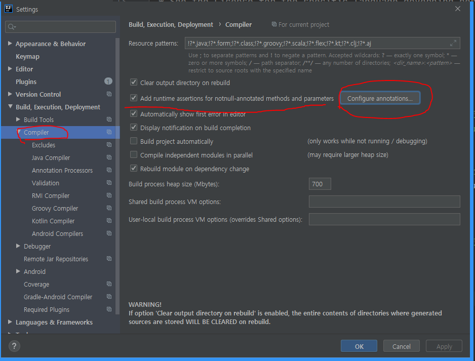
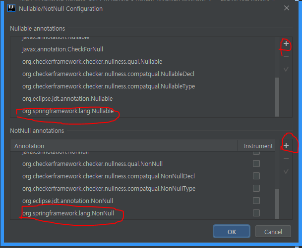

- [Materials](#materials)
- [Basics](#basics)
  - [RDBMS and Java](#rdbms-and-java)
  - [ORM](#orm)
  - [JPA Programming: Setting JPA project](#jpa-programming-setting-jpa-project)
  - [JPA Programming: Entity mapping](#jpa-programming-entity-mapping)
  - [JPA Programming: Value type mapping](#jpa-programming-value-type-mapping)
  - [JPA Programming: 1 to n mapping](#jpa-programming-1-to-n-mapping)
  - [JPA Programming: Cascade](#jpa-programming-cascade)
  - [JPA Programming: Fetch](#jpa-programming-fetch)
  - [JPA Programming: Query](#jpa-programming-query)
  - [Introduction of JPA](#introduction-of-jpa)
  - [Core concepts](#core-concepts)
- [Advanced](#advanced)
  - [Introduction of JPA](#introduction-of-jpa-1)
  - [Spring Data Common: Repository](#spring-data-common-repository)
  - [Spring Data Common: Repository Interface](#spring-data-common-repository-interface)
  - [Spring Data Common: Handling Null](#spring-data-common-handling-null)
  - [Spring Data Common: Making a query](#spring-data-common-making-a-query)
  - [Spring Data Common: Async Query](#spring-data-common-async-query)
  - [Spring Data Common: Custom Repository](#spring-data-common-custom-repository)
  - [Spring Data Common: Basic Repository Customizing](#spring-data-common-basic-repository-customizing)
  - [Spring Data Common: Domain Event](#spring-data-common-domain-event)
  - [Spring Data Common: QueryDSL](#spring-data-common-querydsl)
  - [Spring Data Common: Web: Web Support Features](#spring-data-common-web-web-support-features)
  - [Spring Data Common: Web: DomainClassConverter](#spring-data-common-web-domainclassconverter)
  - [Spring Data Common: Web: Pageable and Sort Parameters](#spring-data-common-web-pageable-and-sort-parameters)
  - [Spring Data Common: Web: HATEOAS](#spring-data-common-web-hateoas)
  - [Spring Data Common: Summary](#spring-data-common-summary)
  - [Spring Data JPA: JPA Repository](#spring-data-jpa-jpa-repository)
  - [Spring Data JPA: Saving Entity](#spring-data-jpa-saving-entity)
  - [Spring Data JPA: Query method](#spring-data-jpa-query-method)
  - [Spring Data JPA: Query method Sort](#spring-data-jpa-query-method-sort)
  - [Spring Data JPA: Named Parameter and SpEL](#spring-data-jpa-named-parameter-and-spel)
  - [Spring Data JPA: Update query method](#spring-data-jpa-update-query-method)
  - [Spring Data JPA: EntityGraph](#spring-data-jpa-entitygraph)
  - [Spring Data JPA: Projection](#spring-data-jpa-projection)
  - [Spring Data JPA: Specifications](#spring-data-jpa-specifications)
  - [Spring Data JPA: Query by Example](#spring-data-jpa-query-by-example)
  - [Spring Data JPA: Transaction](#spring-data-jpa-transaction)
  - [Spring Data JPA: Auditing](#spring-data-jpa-auditing)
  - [JPA Cache](#jpa-cache)

----

# Materials

* [Spring Data JPA - Reference Documentation](https://docs.spring.io/spring-data/jpa/docs/current/reference/html/#reference)
* [스프링 프레임워크 핵심 기술 @ inflearn](https://www.inflearn.com/course/spring-framework_core/)
* [자바 ORM 표준 JPA 프로그래밍:스프링 데이터 예제 프로젝트로 배우는 전자정부 표준 데이터베이스 프레임 - 김영한](https://www.coupang.com/vp/products/20488571?itemId=80660090&vendorItemId=3314421212&q=%EA%B9%80%EC%98%81%ED%95%9C+JPA&itemsCount=4&searchId=13ac45f1095144b5bd41dfc0783f0478&rank=0&isAddedCart=)
  * [src](https://github.com/holyeye/jpabook)

# Basics

## RDBMS and Java

* dependency

```xml
<dependency>
  <groupId>org.postgresql</groupId>
<artifactId>postgre
```

* run postgres

```bash
$ docker run -p 5432:5432 -e POSTGRES_PASSWORD=1 -e POSTGRES_USER=iamslash -e POSTGRES_DB=iamslash --name my-postgres -d postgres

$ docker exec -i -t my-postgres

$ su - postgres

$ psql iamslash
\list
\dt
SELECT * FROM account;
```

* Java

```java
public class Appliation {
  public static void main(String[] args) throws SQLException {
    String url = "jdbc:postgresql://localhost:5432/iamslash";
    String username = "iamslash";
    String password = "1";

    try (Connection connection = DriverManager.getConnection(url, username, password)) {
      System.out.println("Connection created: " + connection);
      String sql = "INSERT INTO ACCOUNT VALUES(1, 'iamslash', 'xxxx')";
      try (PreparedStatement statement = connection.prepareStatement(
        statement.execute());)
    }
  }
}
```

* Cons
  * Have to handle connection pools.
  * SQL is different depends on RDMBS server.
  * It's not easy to use lazy query.

## ORM

* Using Domain models

```java
Account account = new Account("iamslash", "xxxx");
accountRepository.save(account);
```

* Pros
  * Can use OOP.
  * Can use design pattern.
  * Can reuse codes.

* In a nutshell, object/relational mapping is the automated (and transparent) persistence of objects in a Java application to the tables in an SQL database, using metadata that describes the mapping between the classes of the application and the schema of the SQL database.
  * Java Persistence with Hibernate, Second Edition

Using JPA is better than Using JDBC.

## JPA Programming: Setting JPA project

> * [데이터베이스 초기화 @ TIL](https://github.com/iamslash/TIL/blob/3833c3dba5db0c33551741d9c9b8cc09954b86e2/spring/SpringBoot.md#%EC%8A%A4%ED%94%84%EB%A7%81-%EB%8D%B0%EC%9D%B4%ED%84%B0-7-%EB%B6%80-%EB%8D%B0%EC%9D%B4%ED%84%B0%EB%B2%A0%EC%9D%B4%EC%8A%A4-%EC%B4%88%EA%B8%B0%ED%99%94)

> * [Show Hibernate/JPA SQL Statements from Spring Boot @ baeldung](https://www.baeldung.com/sql-logging-spring-boot)

```conf
spring.jpa.show-sql=true
spring.jpa.properties.hibernate.format_sql=true
```

## JPA Programming: Entity mapping

> * [Defining JPA Entities @ baeldung](https://www.baeldung.com/jpa-entities)

----

> `@Entity`

This is nothing but POJOs representing data that can be persisted to the database. 

```java
@Entity
public class Student {    
}
```

> `@Table`

the name of the table in the database and the name of the entity will not be the same.

```java
@Entity
@Table(name="STUDENT")
public class Student {    
}
```

> `@Id`

the primary key

> `@GeneratedValue`

We can generate the identifiers in different ways which are specified by the @GeneratedValue annotation.

```java
@Entity
public class Student {
    @Id
    @GeneratedValue(strategy=GenerationType.AUTO)
    private Long id;    
    private String name;
}
```

> `@Column`

the details of a column in the table.

```java
@Entity
@Table(name="STUDENT")
public class Student {
    @Id
    @GeneratedValue(strategy=GenerationType.AUTO)
    private Long id;
    
    @Column(name="STUDENT_NAME", length=50, nullable=false, unique=false)
    private String name;
}
```

> `@Temporal`

we may have to save temporal values in our table

```java
@Entity
@Table(name="STUDENT")
public class Student {
    @Id
    @GeneratedValue(strategy=GenerationType.AUTO)
    private Long id;
    
    @Column(name="STUDENT_NAME", length=50, nullable=false, unique=false)
    private String name;
    
    @Transient
    private Integer age;
    
    @Temporal(TemporalType.DATE)
    private Date birthDate;
}
```

> `@Transient`

It specifies that the field will not be persisted.

```java
@Entity
@Table(name="STUDENT")
public class Student {
    @Id
    @GeneratedValue(strategy=GenerationType.AUTO)
    private Long id;
    
    @Column(name="STUDENT_NAME", length=50, nullable=false)
    private String name;
    
    @Transient
    private Integer age;
}
```

> application.properties

```conf
spring.jp.show-sql=true
spring.jpa.properties.hibernate.format_sql=true
```

## JPA Programming: Value type mapping

> * [JPA @Embedded And @Embeddable @ baeldung](https://www.baeldung.com/jpa-embedded-embeddable)

----

> `@Embeddable`

a class will be embedded by other entities.

```java
@Embeddable
public class ContactPerson {
    private String firstName;
    private String lastName;
    private String phone;
}
```

> `@Embedded`

embed a type into another entity.

```java
@Entity
public class Company {

    @Id
    @GeneratedValue
    private Integer id;

    private String name;

    private String address;

    private String phone;

    @Embedded
    private ContactPerson contactPerson;
}
```

> `@AttributeOverrides, @AttributeOverride`

override the column properties of our embedded type.

```java
@Embedded
@AttributeOverrides({
  @AttributeOverride( name = "firstName", column = @Column(name = "contact_first_name")),
  @AttributeOverride( name = "lastName", column = @Column(name = "contact_last_name")),
  @AttributeOverride( name = "phone", column = @Column(name = "contact_phone"))
})
private ContactPerson contactPerson;
```

## JPA Programming: 1 to n mapping

> * [[JPA] @ManyToMany, 다대다[N:M] 관계 @ tistory](https://ict-nroo.tistory.com/127)
> * [Many-To-Many Relationship in JPA @ baeldung](https://www.baeldung.com/jpa-many-to-many)
> * [Hibernate One to Many Annotation Tutorial @ baeldung](https://www.baeldung.com/hibernate-one-to-many)

----------

Many to Many relationship 은 anomolies 를 발생시킨다. 두 테이블 사이에 relation table 을 만들어서 Many to one, one to many 로 해결해야 한다. JPA 의 `@JoinTable` 을 이용해서 relation table 을 generate 할 수 있다. 그러나 JPA 가 만들어주는 naming convention 보다는 manual 하게 table 을 만들 것을 추천한다. 서비스를 운영하다 보면 직접 table 에 operation 을 할 수도 있기 때문이다.

This is an example of schema.

```sql
CREATE TABLE `Cart` (
  `cart_id` int(11) unsigned NOT NULL AUTO_INCREMENT,
  PRIMARY KEY (`cart_id`)
) ENGINE=InnoDB AUTO_INCREMENT=5 DEFAULT CHARSET=utf8;

CREATE TABLE `Items` (
  `id` int(11) unsigned NOT NULL AUTO_INCREMENT,
  `cart_id` int(11) unsigned NOT NULL,
  PRIMARY KEY (`id`),
  KEY `cart_id` (`cart_id`),
  CONSTRAINT `items_ibfk_1` FOREIGN KEY (`cart_id`) REFERENCES `Cart` (`cart_id`)
) ENGINE=InnoDB AUTO_INCREMENT=7 DEFAULT CHARSET=utf8;
```

This is an example of `@OneToMany`

 `@OneToMany` annotation is used to define the property in Items class that will be used to map the mappedBy variable. That is why we have a property named `cart` in the Items class

 It's also important to note that the `@ManyToOne` annotation is associated with the Cart class variable. `@JoinColumn` annotation references the mapped column.

```java
@Entity
@Table(name="CART")
public class Cart {

    //...
    @OneToMany(mappedBy="cart")
    private Set<Items> items;	
    // getters and setters
}
...
@Entity
@Table(name="ITEMS")
public class Items {
    
    //...
    @ManyToOne
    @JoinColumn(name="cart_id", nullable=false)
    private Cart cart;

    public Items() {}    
    // getters and setters
}
```

## JPA Programming: Cascade

* [Overview of JPA/Hibernate Cascade Types @ baeldung](https://www.baeldung.com/jpa-cascade-types)
* [JPA’s 4 Lifecycle States](https://thorben-janssen.com/entity-lifecycle-model/)

----

When we perform some action on the target entity, the same action will be applied to the associated entity.

* ALL
* PERSIST
* MERGE
* REMOVE
* REFRESH
* DETACH


## JPA Programming: Fetch

* `@OneToMany`: Lazy Fetch
* `@ManyToOne`: Eager Fetch

## JPA Programming: Query

## Introduction of JPA

* [Introduction to Spring Data JPA @ baeldung](https://www.baeldung.com/the-persistence-layer-with-spring-data-jpa)

-----

`@EnableJpaRepositories` makes the Spring JPA repository support and specify the
package that contains the DAO interfaces.

`@EnableJpaRepositories` 

```java
@EnableJpaRepositories(basePackages = "com.baeldung.spring.data.persistence.repository") 
public class PersistenceConfig { 
}
```

`@Repository` 가 없어도 Bean 으로 등록해준다.

```java
public interface IFooDAO extends JpaRepository<Foo, Long> {
    Foo findByName(String name);
}
```

## Core concepts

This is an application.properties for debugging.

```conf
# application.properties
logging.level.org.hibernate.SQL=debug
logging.level.org.hibernate.type.descriptor.sql=trace
```

# Advanced

## Introduction of JPA

## Spring Data Common: Repository

`@NoRepositoryBean` 은 Repository Bean 이지만 Bean 으로 등록하지 않기 위해
사용한다. 주로 `Respository` 를 상속한 중간의 Repository interface 들에
부착한다. 참고로 `Respository` interface 는 Marker interface 이다.

```java
// com.iamslash.exjpa.AppRunner
@Component
@Transactional
public class AppRunner implements ApplicationRunner {
  @Autowired
  PostRepository postRepository;

  @Override
  public void run(ApplicationArguments args) throws Exception {
    Post post = new Post();
    post.setTitle("spring");

    Comment comment = new Comment();
    comment.setComment("hello");

    postRepository.save(post);
  }
}

// com.iamslash.exjpa.PostRepository
public interface PostRepository extends JpaRepository<Post, Long> {
...
}

// org\springframework\data\jpa\repository\JpaRepository.java
@NoRepositoryBean
public interface JpaRepository<T, ID> extends PagingAndSortingRepository<T, ID>, QueryByExampleExecutor<T> {
...  
}

// org\springframework\data\repository\PagingAndSortingRepository.java
@NoRepositoryBean
public interface PagingAndSortingRepository<T, ID> extends CrudRepository<T, ID> {
...
}

// org\springframework\data\repository\CrudRepository.java
@NoRepositoryBean
public interface CrudRepository<T, ID> extends Repository<T, ID> {
...
}

// org\springframework\data\repository\Repository.java
@Indexed
public interface Repository<T, ID> {
...  
}
```

다음은 `PostRepository` 의 unit test 구현이다. `@DataJpaTest` 를 사용하면 in
memory db 인 `h2` 를 사용한다. `build.gradle` 의 dependency 에 `h2` 를 추가해야
한다.

```java
// src/test/java/com.iamslash.exjpa.ExjpaApplication.PostRepositoryTest.java
@RunWith(SpringRunner.class)
@DataJpaTest
public class PostRepositoryTest {
  
  @Autowired
  PostRepository postRepository;

  @Test
  public void crudRepository() {
    // Given
    Post pos = new Post();
    post.setTitle("Hello world");
    assertThat(post.getId()).isNull();

    // When
    Post newPost = postRepository.save(post);

    // Then
    assertThat(newPost.getId()).isNotNull();

    // When
    List<Post> posts = postRepository.findAll();

    // Then
    assertThat(posts.size()).is(1);
    assertThat(posts).contains(newPost);

    // When
    Page<Post> page = postRepository.findAll(PageRequest.of(0, 10));
    assertThat(page.getTotalElements()).isEqualTo(1);
    assertThat(page.getNumber()).isEqualsTo(0);
    assertThat(page.getSize()).isEqualTo(10);
    assertThat(page.getNumberOfElements()).isEqualsTo(1);

    // When
    page = postRepository.findByTitleContains("spring", PageRequest.of(0, 10));
    // Then
    assertThat(page.getTotalElements()).isEqualTo(1);
    assertThat(page.getNumber()).isEqualsTo(0);
    assertThat(page.getSize()).isEqualTo(10);
    assertThat(page.getNumberOfElements()).isEqualsTo(1);

    // When
    long spring = postRepository.countByTitleContains("spring");
    // Then
    assertThat(spring).isEqualTo(1);
  }
}
```

위에서 사용한 `findByTitleContains` 는 `PostRepository` 에 다음과 같이 선언해야
한다. JPA 는 method name 을 보고 query 를 생성해 준다.

```java
public interface PostRepository extends JpaRepository<Post, Long> {
  Page<Post> findByTitleContains(String title, Pageable pageable);
  long countByTitleContains(String title);
}
```

## Spring Data Common: Repository Interface

`JpaRepository` 가 제공하는 method 들을 모두 사용하지 않고 꼭 필요한 method 만
사용하고 싶다. `JpaRepository` 를 상속하지 않고 Repository interface 를 제작해
보자.

```java
// src/main/java/com.iamslash.exjpa/CommentRepository.java
@RepositoryDefinition(domainClass = Comment.class, idClass = Long.class)
public interface CommentRepository {
  Comment save(Comment comment);
  List<Comment> findAll();
}

// src/test/java/com.iamslash.exjpa/CommentRepositoryTest.java
@RunWith(SpringRunner.class)
@DataJpaTest
public class CommentRepositoryTest {

  @Autowired
  CommentRepository commentRepository;

  @Test
  public void crud() {
    Comment comment = new Comment();
    comment.setComment("Hello Comment");
    commentRepository.save(comment);

    List<Comment> all = commentRepository.findAll();
    assertThat(all.size()).isEqualTo(1);
  }
}
```

이번에는 Repository interface 를 만들고 그것을 상속하는 CommentRepository 를
제작해 보자.

```java
// src/main/java/com.iamslash.exjpa/MyRepository
@NoRepositoryBean
public interface MyRepository<T, Id extends Serializable> extends Repository<T, Id> {
  <E extends T> E save(E entity);
  List<T> findAll();
  long count();
}

// src/main/java/com.iamslash.exjpa/CommentRepository
public interface CommentRepository implement MyRepository {
}

// src/test/java/com.iamslash.exjpa/CommentRepositoryTest.java
@RunWith(SpringRunner.class)
@DataJpaTest
public class CommentRepositoryTest {

  @Autowired
  CommentRepository commentRepository;

  @Test
  public void crud() {
    Comment comment = new Comment();
    comment.setComment("Hello Comment");
    commentRepository.save(comment);

    List<Comment> all = commentRepository.findAll();
    assertThat(all.size()).isEqualTo(1);

    long count = commentRepository.findAll();
    assertThat(count).isEqualTo(1);
  }
}
```

## Spring Data Common: Handling Null

`@NonNull, @Nullable` 를 이용하면 annotation 만으로 Null 을 check 하는 코드를
생성할 수 있다.

```java
// src/main/java/com.iamslash.exjpa/MyRepository
@NoRepositoryBean
public interface MyRepository<T, Id extends Serializable> extends Repository<T, Id> {
  <E extends T> E save(@NonNull E entity);
  
  List<T> findAll();
  
  long count();
  
  @Nullable
  <E extends T> E findById(Id id);
}
```

IntelliJ 에서 `@NonNull, @Nullable` 에 대한 intelli sense 를 원한다면 다음과 같이 spring 의 nonnull, nonnullable 을 추가한다.





## Spring Data Common: Making a query

## Spring Data Common: Async Query

## Spring Data Common: Custom Repository

## Spring Data Common: Basic Repository Customizing

## Spring Data Common: Domain Event

## Spring Data Common: QueryDSL

## Spring Data Common: Web: Web Support Features

## Spring Data Common: Web: DomainClassConverter

## Spring Data Common: Web: Pageable and Sort Parameters

## Spring Data Common: Web: HATEOAS

## Spring Data Common: Summary

## Spring Data JPA: JPA Repository

## Spring Data JPA: Saving Entity

## Spring Data JPA: Query method

## Spring Data JPA: Query method Sort

## Spring Data JPA: Named Parameter and SpEL

## Spring Data JPA: Update query method

## Spring Data JPA: EntityGraph

## Spring Data JPA: Projection

## Spring Data JPA: Specifications

## Spring Data JPA: Query by Example

## Spring Data JPA: Transaction

* [transactional @ TIL](https://github.com/iamslash/TIL/blob/3833c3dba5db0c33551741d9c9b8cc09954b86e2/spring/README.md#transactional)

## Spring Data JPA: Auditing

* [Auditing with JPA, Hibernate, and Spring Data JPA](https://www.baeldung.com/database-auditing-jpa)

----

There 3 ways for Auditing including Auditing With JPA, Hibernate Envers, Spring Data JPA in Spring. This is a Auditing using Spring Data JPA.

0. Enableing JPA Auditing. 

just add @EnableJpaAuditing on your @Configuration class.

```java
@Configuration
@EnableTransactionManagement
@EnableJpaRepositories
@EnableJpaAuditing
public class PersistenceConfig { ... }
```

1. Adding Spring's Entity Callback Listener.

```java
@Entity
@EntityListeners(AuditingEntityListener.class)
public class Hello { ... }
```

2. Tracking Created and Last Modified Date.

```java
@Entity
@EntityListeners(AuditingEntityListener.class)
public class Hello {     
    //...     
    @Column(name = "created_date", nullable = false, updatable = false)
    @CreatedDate
    private long createdDate;
 
    @Column(name = "modified_date")
    @LastModifiedDate
    private long modifiedDate;     
    //...     
}
```

3. Auditing the Author of Changes With Spring Security.

```java
@Entity
@EntityListeners(AuditingEntityListener.class)
public class Bar {     
    //...     
    @Column(name = "created_by")
    @CreatedBy
    private String createdBy;
 
    @Column(name = "modified_by")
    @LastModifiedBy
    private String modifiedBy;     
    //...     
}
```

4. Getting the author from SecurityContext's Authentication.

```java
public class AuditorAwareImpl implements AuditorAware<String> {
  
    @Override
    public String getCurrentAuditor() {
        // your custom logic
    }
 
}
```

5. Configuring to use AuditorAwareImpl to look up the current principal.

```java
@EnableJpaAuditing(auditorAwareRef="auditorProvider")
public class PersistenceConfig {     
    //...     
    @Bean
    AuditorAware<String> auditorProvider() {
        return new AuditorAwareImpl();
    }     
    //...    
}
```

## JPA Cache

* [JPA 캐시](https://gunju-ko.github.io/jpa/2019/01/14/JPA-2%EC%B0%A8%EC%BA%90%EC%8B%9C.html)

-----

JPA Cache 는 1-level Cache, 2-level Cache 가 있다.

**1-level Cache** 는 Persistence Context 안에 존재한다. 하나의 HTTP Request 가 시작되고 종료될 때까지 발생하는 하나의 Transaction 동안 유지된다. 

2-level Cache 는 Application 이 시작해서 종료될때까지 유지된다. Redis 와 같이 외부의 Cache 도 2-level Cache 이다???
