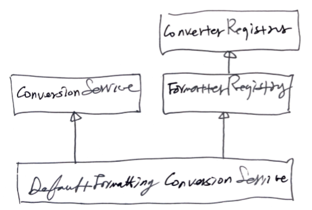

- [Materials](#materials)
- [IoC Container and Bean](#ioc-container-and-bean)
  - [Spring IoC Container and Bean](#spring-ioc-container-and-bean)
  - [Application Context and Setting Bean](#application-context-and-setting-bean)
  - [@Autowire](#autowire)
  - [@Component and Component Scan](#component-and-component-scan)
  - [Scope of Bean](#scope-of-bean)
  - [Environment Profile](#environment-profile)
  - [Environment Property](#environment-property)
  - [MessageSource](#messagesource)
  - [ApplicationEventPublisher](#applicationeventpublisher)
  - [ResourceLoader](#resourceloader)
- [Resource and Validation](#resource-and-validation)
  - [Resource Abstraction](#resource-abstraction)
  - [Validation Abstraction](#validation-abstraction)
- [Data Binding](#data-binding)
  - [PropertyEditor](#propertyeditor)
  - [Converter and Formatter](#converter-and-formatter)
- [SpEL (Spring Expression Language)](#spel-spring-expression-language)
- [Spring AOP (Aspected Oriented Programming)](#spring-aop-aspected-oriented-programming)
  - [Overview](#overview)
  - [Proxy Based AOP](#proxy-based-aop)
  - [@AOP](#aop)
- [Null-Safty](#null-safty)

----

# Materials

* [스프링 프레임워크 핵심 기술 @ inflearn](https://www.inflearn.com/course/spring-framework_core/)
* [스프링 프레임워크 핵심 기술 정리 (백기선님 인프런 강좌)](https://academey.github.io/spring/2019/03/15/sprign-framework-core.html)

# IoC Container and Bean

## Spring IoC Container and Bean

IOC Container 가 관리하는 객체를 Bean 이라고 한다. 마치 MS 의 COM 과 비슷한 것 같다. IOC Container 가 생성하고 다른 class 에 DI (Dependency Injection) 한다. Bean 은 주로 Singleton 이다.

다음은 `BookService` Bean 의 구현이다. `@service` 를 사용해서 Bean 이 되었다. `@Autowired` 를 사용해서 IOC Container 가 생성한 `BookRepository` Bean 을 얻어올 수 있다. `BookRepository` Bean 을 Dependency Injection 에 의해 constructor 에서 argument 로 전달받는다. `@PostConstruct` 를 사용해서 `BookService` Bean 이 생성된 후 함수가 실행되도록 구현했다.

```java
@service
public class BookService {
  @Autowired
  private BookRepository bookRepository;
  
  public BookService(BookRepository bookRepository) {
    this.bookRepository = bookRepository;
  }
  
  public Book save(Book book) {
    book.setCreated(new Date());
    book.setBookStatus(BookStatus.DRAFT);
    return bookRepository.save(book);
  }
  
  @PostConstruct
  public void postConstruct() {
    System.out.println("==============================");
    System.out.println("BookService::postConstruct");
  }
}
...
@Repository
public class BookRepository {
  public Book save(Book book) {
    return null;
  }
}
```

IOC 의 핵심은 [BeanFactory interface](https://docs.spring.io/spring-framework/docs/current/javadoc-api/org/springframework/beans/factory/BeanFactory.html) 이다. 다음과 같이 Bean 의 lifecycle 을 이해할 수 있다. 

* BeanNameAware's setBeanName
* BeanClassLoaderAware's setBeanClassLoader
* BeanFactoryAware's setBeanFactory
* EnvironmentAware's setEnvironment
* EmbeddedValueResolverAware's setEmbeddedValueResolver
* ResourceLoaderAware's setResourceLoader (only applicable when running in an application context)
* ApplicationEventPublisherAware's setApplicationEventPublisher (only applicable when running in an application context)
* MessageSourceAware's setMessageSource (only applicable when running in an application context)
* ApplicationContextAware's setApplicationContext (only applicable when running in an application context)
* ServletContextAware's setServletContext (only applicable when running in a web application context)
* postProcessBeforeInitialization methods of BeanPostProcessors
* InitializingBean's afterPropertiesSet
* a custom init-method definition
* postProcessAfterInitialization methods of BeanPostProcessors

[ApplicationContext](https://docs.spring.io/spring-framework/docs/current/javadoc-api/org/springframework/context/ApplicationContext.html) 는 가장 많이 사용하는 [BeanFactory](https://docs.spring.io/spring-framework/docs/current/javadoc-api/org/springframework/beans/factory/BeanFactory.html) 이다.

## Application Context and Setting Bean

Bean 을 생성하는 방법크게 xml 혹은 class 를 이용하는 방법이 있다.

먼저 xml 에 생성하고자 하는 Bean 을 모두 표기해보자. `bookService` 에서 `bookRepository` 를 DI 해야한다. 따라서 `bookRepository` Bean 을 reference 하기 위해 `property` 가 사용되었음을 주목하자. Bean 이 늘어날 때 마다 application.xml 에 모두 등록해야 한다. 상당히 귀찮다.

```xml
<bean id="bookService" 
      class="..."
      autowire="default">
  <property name="bookRespository" ref="bookRespository"/>
</bean>      
<bean id="bookRespository"
      class="..."/>
```

```java
public class DemoApplication {
  public static void main(String[] args) {
    ApplicationContext ctx = new ClassPathXmlApplicationContext(...);
    String[] names = ctx.getBeanDefinitionNames();
    System.out.println(Arrays.toString(names));
    BookService bookService = (BookService) ctx.getBean(s:"bookService");
    System.out.println(bookService.bookRepository != null);    
  }
}
```

또 다른 방법은 application.xml 에 component scan 을 사용하여 간단히 Bean 설정할 수 있다. Bean class 들은 `@Component` 를 사용해야 한다. `@Bean, @Service, @Repository` 는 `@Component` 를 확장한 annotation 이다. DI 를 위해 `@Autowired` 를 사용한다.

```xml
<context:component-scan base-package="..."/>
```

ApplicationConfig class 를 사용해서 Bean 을 등록할 수 있다. 여전히 component scan 은 xml 에서 수행한다.

```java
@Configuration
public class ApplicationConfig {
  @Bean
  public BookRepository bookRepository() {
    return new BookRespotiroy();
  }
  @Bean
  public BookService bookService() {
    BookService bookService = new BookService();
    bookService.setBookRepository(bookRepository());
    return bookService;
  }
}
```

```java
public class DemoApplication {
  public static void main(String[] args) {
    ApplicationContext ctx = new AnnotationConfigApplicationContext(ApplicationConfig.class);
    String[] names = ctx.getBeanDefinitionNames();
    System.out.println(Arrays.toString(names));
    BookService bookService = (BookService) ctx.getBean(s:"bookService");
    System.out.println(bookService.bookRepository != null);    
  }
}
```

이번에는 component scan 마저 annotation 을 이용해보자. 더 이상 xml 은 필요 없다.

```java
@Configuration
@ComponentScan(basePackageClasses = DemoApplication.class)
public class ApplicationConfig {
}
...
@SpringBootApplication
public class DemoApplication {
  public static void main(String[] args) {

  }
}
```

## @Autowire

Bean 의 constructor 에 `@Autowire` 를 사용하여 DI 해보자.

```java
// BookService.java
@Service
public class BookService {
  BookRepository bookRepository;
  
  @Autowire
  public BookService(BookRepository bookRepository) {
    this.bookRepository = bookRepository;
  }
}
// BookRepository.java
@Repository
public class BookRepository {  
}

// DemoApplication.java
```

Bean 의 setter 에 `@Autowire` 를 사용하여 DI 해보자.

```java
// BookService.java
@Service
public class BookService {
  BookRepository bookRepository;
  
  @Autowire(required = false)
  public setBookRepository(BookRepository bookRepository) {
    this.bookRepository = bookRepository;
  }
}
// BookRepository.java
@Repository
public class BookRepository {  
}

// DemoApplication.java
```

Bean 의 field 에 `@Autowire` 를 사용하여 DI 해보자.

```java
// BookService.java
@Service
public class BookService { 
  @Autowire(required = false)
  BookRepository bookRepository;
}
// BookRepository.java
@Repository
public class BookRepository {  
}

// DemoApplication.java
```

이번에는 여러개의 Bean 을 DI 해보자. `@Primary`, `@Qulifier`, `List` 를 사용할 수 있다.

다음은 `@Primary` 를 사용하여 `BookRepository` 를 상속받은 class 들 중 어느것을 사용할지 선택한 구현이다.

```java
// BookService.java
@Service
public class BookService { 
  @Autowire
  BookRepository bookRepository;

  public void printBookRepository() {
    System.out.println(bookRespository.getClass());
  }
}

// BookRepository.java
@Repository
public class BookRepository {  
}

// MyBookRepository.java
@Repository @Primary
public class MyBookRepository implements BookRepository {
}

// YourBookRepository.java
@Repository
public class YourBookRepository implements BookRepository {
}

// BookServiceRunner.java
@Component
public class BookServiceRunner implements ApplicationRunner {
  @Autowired
  BookRepository bookRepository;

  @Override
  public void run(ApplicationArguments args) throws Exception {
    bookRepository.printBookRepository();
  }
}
```

다음은 `@Qualifier` 를 사용해서 `@Autowired` 할 때 사용할 Bean 을 고르는 구현이다.

```java
// BookService.java
@Service
public class BookService { 
  @Autowired @Qualifier("MyBookRepository")
  BookRepository bookRepository;

  public void printBookRepository() {
    System.out.println(bookRespository.getClass());
  }
}

// BookRepository.java
@Repository
public class BookRepository {  
}

// MyBookRepository.java
@Repository
public class MyBookRepository implements BookRepository {
}

// YourBookRepository.java
@Repository
public class YourBookRepository implements BookRepository {
}
```

이번에는 List 를 사용하여 여러개의 Bean 을 모두 DI 하는 방법이다.

```java
// BookService.java
@Service
public class BookService { 
  @Autowired
  List<BookRepository> bookRepositories;

  public void printBookRepository() {
    this.bookRepositories.forEach(System.out::println);
  }
}

// BookRepository.java
@Repository
public class BookRepository {  
}

// MyBookRepository.java
@Repository
public class MyBookRepository implements BookRepository {
}

// YourBookRepository.java
@Repository
public class YourBookRepository implements BookRepository {
}
```

field 의 이름을 DI 하고 싶은 Bean 의 이름으로 설정하면 그 Bean 을 DI 할 수 있다.

```java
// BookService.java
@Service
public class BookService { 
  @Autowired
  BookRepository myBookRepository;

  public void printBookRepository() {
    System.out.println(mybookRepository.getClass());
  }
}

// BookRepository.java
@Repository
public class BookRepository {  
}

// MyBookRepository.java
@Repository
public class MyBookRepository implements BookRepository {
}

// YourBookRepository.java
@Repository
public class YourBookRepository implements BookRepository {
}
```

주로 `@Primary` 를 사용하는 것이 좋다.

그렇다면 `@Autowired` 는 어떤 시점에 object 를 생성하여 DI 를 하는 것인가? 

`BeanFactory` 가 `BeanPostProcessor` 를 검색한다. `AutowiredAnnotationBeanPostProcess` 이미 등록되어 있는 `BeanPostProcessor` 이다. `BeanFactory` 는 `AutowiredAnnotationBeanPostProcess` Bean 을 검색하여 다른 Bean 들을 순회하고 그 Bean 의 initialization 전에 `AutowiredAnnotationBeanPostProcess` 의 logic 즉 DI 를 수행한다. 

다음과 같이 `@PostConstruct` 를 사용하면 `myBookRepository` 가 이미 DI 되었음을 알 수 있다.

```java
@Service
public class BookService {
  @Autowired
  BookRepository myBookREpository;

  @PostConstruct
  public void setup() {
    System.out.println(myBookRepository.getClass());
  }
}
```

다음은 `ApplicationRunner` 를 사용하여 `AutowiredAnnotationBeanPostProcess` 가 등록되어 있는지 확인하는 구현이다.

```java
@Component
public class MyRunner implements ApplicationRunner {
  @Autowired
  ApplicationContext applicationContext;

  @Override
  public void run(ApplicationArguments args) throws Exception {
    AutowiredAnnotationBeanPostProcessor bean = applicationContext.getBean(AutowiredAnnotationBeanPostProcessor.class);
    System.out.println(bean);
  }
}
```

## @Component and Component Scan

annotation 은 Spring 3.1 부터 도입되었다. `@Compoent` 를 포함하여 그것을 상속한 `@Repository, @Service, @Controller, @Configuration` 을 선언하면 component scan 의 대상이된다.

`DemoApplication` class 에 `@SpringBootApplication` 이 선언되었다.  `SpringBootApplication.java` 를 살펴보면 `@ComponentScan` 을 선언하여 component scan 을 실행한다. 이때 필터설정을 통하여 특정 bean 들을 exclude 할수도 있다. 

```java
// DemoApplication.java
@SpringBootApplication
public class DemoApplication {
  public static void main(String[] args) {
    SpringApplication.run(DemoApplication.class, args);
  }
}

// SpringBootApplication.java
@Target(Element.Type)
@Retention(RetentionPolicy.RUNTIME)
@Documented
@Inherited
@SpringBootConfiguration
@EnableAutoConfiguration
@ComponentScan(excludeFilters = {
  @Filter(type = FilterType.CUSTOM, classes = TypeExcludeFilter.class),
  @Filter(type = FilterType.CUSTOM, classes = AutoConfigurationExcludeFilter.class)})
public @interface SpringBootApplication {
  ...
}
```

위와 같은 경우 `DemoApplication` 와 다른 package 는 component scan 이 될 수 없다. 다른 package 의 bean 을 function 을 이용하여 component scan 해 보자. 예를 들어 `MyService`  는 다른 package 에 정의되어 있고 `DemoApplication` 에서 별도로 등록해 보자.

```java
// MyService in other package

// DemoApplication.java
@SpringBootApplication
public class DemoApplication {
  
  @Autowired
  MyService myService;

  public static void main(String[] args) {
    var app = new SpringApplication(DemoApplication.class);
    app.addInitializers((ApplicationContextInitializer<GenericApplicationContext>) ctx -> {
      ctx.registerBean(MyService.class);
    });
  }
}
```

function 을 이용하여 component 를 등록하는 방법은 추천하지 않는다.

## Scope of Bean

Spring Component 는 `Single, Prototype` 의 scope 을 갖는다. `Single scope` 은 인스턴스가 하나이다. `Prototype scope` 은 `@Component @Scope("prototype")` 를 선언하여 DI 할 때 마다 instance 를 생성한다.

```java
// Single.java
@Component
public class Single {

  @Autowired
  private Proto proto;

  public Proto getProto() {
    return proto;
  }
}

// Proto.java
@Component @Scope("prototype")
public class Proto {
}

// AppRunner.java
@Component
public class AppRunner implements ApplicationRunner {
  @Autowired
  ApplicationContext ctx;

  @Override
  public void run(ApplicationArguments args) throws Exception {
    System.out.println("proto");

    System.out.println(ctx.getBean(Proto.class));
    System.out.println(ctx.getBean(Proto.class));
    System.out.println(ctx.getBean(Proto.class));

    System.out.println("single");

    System.out.println(ctx.getBean(Single.class));
    System.out.println(ctx.getBean(Single.class));
    System.out.println(ctx.getBean(Single.class));        

    System.out.println("proto by single");    
    System.out.println(ctx.getBean(Single.class).getProto());  // same
    System.out.println(ctx.getBean(Single.class).getProto());  // same
    System.out.println(ctx.getBean(Single.class).getProto());  // same          
  }
}
```

그러나 `proto by single` 인 경우 `proto` instance 는 모두 같다. 다음과 같이 `proxyMode` 를 사용하면 proto bean 을 감싸는 proxy 가 생성되고 참조할 때마다 instance 가 만들어진다.

```java
// Proto.java
@Component @Scope("prototype", proxyMode = ScopedProxyMode.TARGET_CLASS)
public class Proto {
}
```

물론 annotation 없이 다음과 같은 방법으로 prototype scope 을 구현할 수 있다. 그러나 Single 이 POJO 에서 멀어진다. 추천하지 않는다.

```java
// Single.java
@Component
public class Single {

  @Autowired
  private ObjectProvider<Proto> proto;

  public Proto getProto() {
    return proto.getIfAvailable();
  }
}
```

## Environment Profile

ApplicationContext 는 EnvironmentCapable 를 구현한다. Component 를 `test, stage, production` 과 같은 특정 환경에서만 등록할 수 있다.

먼저 다음과 같이 현재의 프로파일을 출력해보자.

```java
// AppRunner.java
@Component
public class AppRunner implements ApplicationRunner {
  @Autowried
  ApplicationContext ctx;

  @Override
  public void run(ApplicationArguments args) throws Exception {
    Environment environment = ctx.getEnvironment();
    System.out.println(Arrays.toString(environment.getActiveProfiles()));
    System.out.println(Arrays.toString(environment.getDefaultProfiles()));   
  }
}
```

VM option 으로 `-Dspring.profiles.active="test"` 을 삽입하여 profile 을 설정할 수 있다. 그리고 다음과 같이 configuration class 를 제작하자.

```java
//TestConfiguration
@Configuration
@Profile("test")
public class TestConfiguration {
  @Bean
  public BookRepository bookRepository() {
    return new TestBookRepository();
  }
}
```

한편 다음과 같이 method 에 profile 을 정의할 수도 있다.

```java
//TestBookRepository.java
@Repository
@Profile("test")
public class TestBookRepository implements BookRepository {

}
```

다음과 같이 logic expression 을 사용할 수도 있다.
```java
//TestBookRepository.java
@Repository
@Profile("!prod")
public class TestBookRepository implements BookRepository {

}
```

## Environment Property

다양한 방법으로 key value 쌍을 읽어올 수 있다. 

VM option 으로 `"-Dapp.name=foo"` 을 설정하자. 다음과 같이 얻어올 수 있다.

```java
@Component
public class AppRunner implements ApplicationRunner {
  @Autowired
  ApplicationContext ctx;

  @autowired
  BookRepository bookRepository;

  @Override
  public void run(ApplicationAguments args) throws Exception {
    Environment environment = ctx.getEnvironment();
    System.out.println(environment.getProperty("app.name"));
    System.out.println(environment.getProperty("app.about"));
  }
}
```

또한 app.properties 를 만들고 다음과 같이 읽어올 수 있다.

```java
// app.properties
app.about = bar
app.name = baz

// DemoApplication.java
@SpringBootApplication
@PropertySource("classpath:/app.properties")
public class DemoApplication {
  ...
}
```

app.properties 보다는 VM option 이 우선순위가 높다.

## MessageSource

ApplicationContext 는 MessageSource 를 구현한다. MessageSource 를 field 로 DI 하면 i18n 을 처리할 수 있다.

```java
//messages.properties
greeting=Hello {0}

//messages_ko_KR.properties
greeting=안녕 {0}

// AppRunner.java
public class AppRunner implements ApplicationRunner {
  @Autowired
  MessageSource messageSource;

  @Override
  public void run(ApplicationArguements args) throws Exceptio {
    System.out.println(messageSource.getMessage("greeting", new String[]{"foo"}, Local.KOREA));
    System.out.println(messageSource.getMessage("greeting", new String[]{"foo"}));
  }
}
```

## ApplicationEventPublisher

ApplicationContext 는 ApplicationEventPublisher 를 구현한다. ApplicationContext 가 field 로 DI 되면 event 를 보내고 처리할 수 있다. 

```java
// MyEvent.java
public class MyEvent extends ApplicationEvent {
  private int data;

  public MyEvent(Object src) {
    super(src);
  }

  public MyEvent(Object src, int data) {
    super(src);
    this.data = data;
  }

  public int getData() {
    return data;
  }
}

// AppRunner.java
@Component
public class AppRunner implements ApplicationRunner {
  @Autowired
  ApplicationEventPublisher publishEvent;

  @Override
  public void run(ApplicationArguments args) throws Exception {
    publishEvent.publishEvent(new MyEvent(this, 100));
  }
}

// MyEventHandler.java
@Component
public class MyEventHandler implements ApplicationListener<MyEvent> {
  @Override
  public void onApplicationEvent(MyEvent evt) {
    puslishEvent.publishEvent("I got it " + evt.getData());
  }
}
```

그러나 Spring 4.2 부터는 MyEvent 가 ApplicationEvent 를 상속할 필요가 없고 MyEventHandler 가 ApplicationListener 를 상속 할 필요가 없다. 더욱 POJO 스러운 코드를 만들 수 있다.

```java
// MyEvent.java
public class MyEvent {
  private int data;
  private Object src;

  public MyEvent(Object src, int data) {
    this.src = src;
    this.data = data;
  }

  public Object getSrc() {
    return src;
  }

  public int getData() {
    return data;
  }
}

// MyEventHandler.java
@Component
public class MyEventHandler {
  
  @EventListener
  public void handle(MyEvent evt) {
    puslishEvent.publishEvent("I got it " + evt.getData());
  }
}
```

이번에는 또 다른 Handler 를 정의해 보자. 핸들러의 우선순위를 조정하고 싶다면 `@Order` 를 사용해보자.

```java
// YourEventHandler.java
@Component
public class YourEventHandler {
  
  @EventListener
  @Order(Ordered.HIGHEST_PRECEDENCE + 2)
  public void handle(MyEvent evt) {
    puslishEvent.publishEvent("YourEventHandler::I got it " + evt.getData());
  }
}
```

또한 `@Async, @EnableAsync` 를 사용하여 비동기로 event 를 handle 할 수 있다. 비동기이기 때문에 더 이상 `@Order` 는 의미없다.

```java
// YourEventHandler.java
@Component
public class YourEventHandler {
  
  @EventListener
  @Async
  public void handle(MyEvent evt) {
    puslishEvent.publishEvent("YourEventHandler::I got it " + evt.getData());
  }
}

//DemoApplication
@SpringBootApplication
@EnableAsync
public class DemoApplication {
  public static void main(Stringp[ args)){
    SpringAppilcation.run(DemoApplication.class, args);
  }
}
```

이번에는 ApplicationContext 가 제공하는 이벤트를 핸들링 해보자.

```java
@Component
public class MyEventHandler {
  @EventListener
  @Async
  public void handle(MyEvent evt) {
    System.out.println(Thread.currentThread().toString());
    System.out.println("I got it MyEvent : " + evt.getData());
  }
  
  @EventListener
  @Async
  public void handle(ContextRefreshedEvent evt) {
    System.out.println(Thread.currentThread().toString());
    System.out.println("I got it ContextRefreshedEvent : ");
  }

  @EventListener
  @Async
  public void handle(ContextClosedEvent evt) {
    System.out.println(Thread.currentThread().toString());
    System.out.println("I got it ContextClosedEvent : ");
  }
}
```

## ResourceLoader

ApplicationContext 는 ResourceLoader 를 구현한다. ApplicationContext 가 field 로 DI 되면 resource 를 접근할 수 있다. 예를 들어 `~/src/main/resources/a.txt` 를 만들고 build 하면 `~/classpath/a.txt` 로 이동한다. 이것을 java 에서 접근해 보자.

```java
// AppRunner.java
@Component
public class AppRunner implements ApplicationRunner {
  @Autowired
  ResourceLoader resourceLoader;

  @Override
  public void run(ApplicationArguements args) throws Exception {
    Resource resource = resourceLoader.getResource("classpath:a.txt");
    System.out.println(resource.exists());
    System.out.println(resource.getDescription());
    System.out.print(Files.readString(Path.of(resource.getURI())));
  }
}
```

# Resource and Validation

## Resource Abstraction

`java.net.URL` 를 `org.springfamework.core.io.Resource` 로 추상화 했다. 즉, 모든 resource 를 `Resource` 로 접근할 수 있다. Resource 의 구현체는 `UrlResource, ClassPathResource, FileSystemResource, ServletContextResource` 를 주목할 만 하다.

resource string 에 `classpath, file` 과 같은 prefix 를 사용하는 것이 좋다.

예를 들어 `~/src/main/resources/a.txt` 를 만들고 build 하면 `~/classpath/a.txt` 로 이동한다. 이것을 java 에서 접근해 보자.

```java
// AppRunner.java
@Component
public class AppRunner implements ApplicationRunner {
  @Autowired
  ResourceLoader resourceLoader;

  @Override
  public void run(ApplicationArguements args) throws Exception {
    Resource resource = resourceLoader.getResource("classpath:a.txt");
    //Resource resource = resourceLoader.getResource("file:///a.txt");
    System.out.println(resource.exists());
    System.out.println(resource.getDescription());
    System.out.print(Files.readString(Path.of(resource.getURI())));
  }
}
```

## Validation Abstraction

검증을 `org.springframework.validation.Validator` 로 추상화 했다.

예를 들어 다음과 같이 `Event` 를 정의하고 그것의 validator `EventValidator` 를 정의해보자.

```java
//Event.java
public class Event {
  Integer id;
  String title;
  public Integer getId() {
    return id;
  }
  public void setId(Integer id) {
    this.id = id;
  }
  public String getTitle() {
    return title;
  }
  public void setTitle(String title) {
    this.title = title;
  }
}

//EventValidator.java
public class EventValidator implements Validator {
  @Override
  public boolean supoprts(Class<?> clazz) {
    return Event.class.equals(clazz);
  }

  @Override
  public void validate(Object target, Errors errors) {
    ValidationUtils.rejectIfEmptyOrWhitespace(error, "title", "notempty", "Empty title is not allowed.");
  }
}

// AppRunner.java
@Component
public class AppRunner implements ApplicationRunner {

  @Override
  public void run(ApplicationArguements args) throws Exception {
    Event evt = new Event();
    EventValidator evtValidator = new EventValidator();
    Error errors = new BeanPropertyBindingResult(evt, "event");

    evtValidtor.validate(evt, errors);
    System.out.println(erros.hasErrors());
    errors.getAllErrors().forEach(e -> {
      System.out.println("===== error code =====");
      Arrays.stream(e.getCodes().forEach(System.out::println));
      System.out.println(e.getDefaultMessage());
    })
  }
}
```

그러나 위와 같은 방법 보다는 다음과 같이 `@NotEmpty, @NotNull, @Min, @Max, @Email` 을 이용하는 것이 더욱 간결하다.

```java
//Event.java
public class Event {
  Integer id;

  @NotEmpty
  String title;

  @NotNull @Min(0)
  Integer limit;

  @Email
  String email;

  public Integer getId() {
    return id;
  }
  public void setId(Integer id) {
    this.id = id;
  }
  public String getTitle() {
    return title;
  }
  public void setTitle(String title) {
    this.title = title;
  }
}

// AppRunner.java
@Component
public class AppRunner implements ApplicationRunner {

  @Autowired
  Validator validator;

  @Override
  public void run(ApplicationArguements args) throws Exception {
    System.out.println(validate.getClass());

    Event evt = new Event();
    evt.setLimit(-1);
    evt.setEmail("aaa");
    Error errors = new BeanPropertyBindingResult(evt, "event");

    validator.validate(evt, errors);

    System.out.println(erros.hasErrors());
    
    errors.getAllErrors().forEach(e -> {
      System.out.println("===== error code =====");
      Arrays.stream(e.getCodes().forEach(System.out::println));
      System.out.println(e.getDefaultMessage());
    })
  }
}
```

# Data Binding

## PropertyEditor

사용자가 입력한 값을 object 로 binding 하는 것을 data binding 이라 한다. 예를 들어 xml, *.perperties 파일에서 값을 읽어서 object 로 binding 하는 것을 포함한다. 

Spring 은 PropertyEditor 를 제공하여 data binding 을 할 수 있게 해준다. PropertyEditor 를 구현하면 많은 method 를 구현해야 한다. PropertyEditorSupport 는 PropertyEditor 를 상속한다. PropertyEditorSuport 를 상속하면 보다 적은 method 를 구현하여 data binding 을 할 수 있다.

다음은 `/Foo/1` 과 같은 url 을 넘겨받아 `Foo` instance 로 변환하는 구현이다.

```java
// Foo.java
public class Foo {
  private Integer id;
  private String title;
  public Foo(Integer id) {
    this.id = id;
  }
  public Integer getId() {
    return id;
  }
  public void setId(Integer id) {
    this.id = id;
  }
  public String getTitle() {
    return title;
  }
  public void setTitle(String title) {
    this.title = title;
  }
  public String toString() {
    return "Foo:: " +
      "id: " + this.id + 
      "title: " + this.title;
  }
}

// FooController.java
@RestController
public class FooController {

  @InitBinder
  public void init(WebDataBinder webDataBinder) {
    webDataBinder.registerCustomEditor(Foo.class, new FooEditor());
  }

  @GetMapping("/foo/{foo}")
  public String getFoo(@PathVariable Foo foo) {
    System.out.println(foo);
    return foo.getId().toString();
  }
}

// FooControllerTest.java
@RunWith(SpringRunner.class)
@WebMvcTest
public class FoocontrollerTest {  
  @Autowired
  MockMvc mockMvc;

  @Test
  public void getTest() throws Exception {
    mockMvc.perform(get("/foo/1"))
           .andExect(status().isOK())
           .andExpect(content().string("1"));      
  }
}

// FooEditor.java
public class FooEditor extends PropertyEditorSupport {
  @Override
  public String getAsText() {
    return super.getAsText();
  }

  @Override
  public void setAsText(String text) throws IllegalArgumentException {
    setvalue(new Foo(Integer.parseInt(text)));
  }
}
```

FooEditor 는 thread-safe 하지 않다. 유의해야 한다.

## Converter and Formatter

PropertyEditor 의 단점을 보완하기 위해 Converter 와 Formatter 가 탄생했다.

다음은 Converter 의 예이다.

```java
// FooConverter
public class FooConverter {
  
  public static class StringToFooConverter implements Converter<String, Foo> {
    @Override
    public Foo convert(String src) {
      return new Foo(Integer.parseInt(src));
    }
  }

  public static class FooToStringConverter implements  Converter<Foo, String> {
    @Override
    public String convert(Foo src) {
      return src.getId().toString();
    }
  }
}
```

Spring Boot 를 사용하지 않는다면 Converter 를 FormatterRegistry 에 등록해야 한다.

```java
// WebConfig.java
@Configuration
public class WebConfig implements WebMvcConfigurer {
  @Override
  public void addFormatters(FormatterRegistry registry) {
    registry.addConverter(new EventConverter.StringToEventConverter());
  }
}
```

다음은 Formatter 의 예이다.

```java
// FooFormatter.java
public class FooFormatter implements Formatter<Foo> {
  @Override
  public Foo parse(String text, Locale locale) throws ParseException {
    return new Foo(Integer.parseInt(text));
  }

  @Override
  public String print(Foo object, Locale locale) {
    return object.getId().toString();
  }
}
```

역시 Bean 으로 등록하지 않고 사용하려면 
Formatter 를 FormatterRegistry 에 등록해야 한다.

```java
// WebConfig.java
@Configuration
public class WebConfig implements WebMvcConfigurer {
  @Override
  public void addFormatters(FormatterRegistry registry) {
    registry.addFormatter(new FooFormatter());
  }
}
```

이번에는 Converter 를 별도의 등록없이 `@Component` 를 이용하여 Bean 으로 선언한다. 그러면 Spring Boot 에서 손쉽게 사용할 수 있다.

```java
// FooConverter
public class FooConverter {
  
  @Component
  public static class StringToFooConverter implements Converter<String, Foo> {
    @Override
    public Foo convert(String src) {
      return new Foo(Integer.parseInt(src));
    }
  }

  @Component
  public static class FooToStringConverter implements  Converter<Foo, String> {
    @Override
    public String convert(Foo src) {
      return src.getId().toString();
    }
  }
}
```

다음은 Formatter 를 별도의 등록없이 `@Component` 를 이용하여 Bean 으로 선언하고 사용해보자. `@WebMvcTest` 는 Test code 실행을 위해 특정 class 들을 Bean 으로 등록할 수 있다.

```java
// FooFormatter.java
@Component
public class FooFormatter implements Formatter<Foo> {
  @Override
  public Foo parse(String text, Locale locale) throws ParseException {
    return new Foo(Integer.parseInt(text));
  }

  @Override
  public String print(Foo object, Locale locale) {
    return object.getId().toString();
  }
}

// FooControllerTest.java
@RunWith(SpringRunner.class)
@WebMvcTest({FooFormatter.class, FooController.class})
public class FooControllerTest {
  @Autowired
  MockMvc mockMvc;

  @Test
  public void getTest() throws Exception {
    mockMvc.perform(get("/foo/1"))
           .andExpect(status().isOk())
           .andExpect(content().string("1"));
  }
}
```

주로 Formatter 를 사용하자.

실제 어떠한 `Converter, Formatter` 가 등록되어 있는지 다음과 같이 확인할 수 있다.

```java
//AppRunner.java
@Component
public class AppRunner implements ApplicationRunner {
  @Autowired
  ConversionService conversionService;

  @Override
  public void run(ApplicationArguements args) throws Exception {
    System.out.println(conversionService);
    System.out.println(conversionService.getClass().toString());
  }
}
```

PropertyEditor 는 DataBinder 를 통해서 변환업무를 수행한다. Converter, Formatter 는 ConversionService 를 통해서 변환업무를 수행한다.  DefaultFormattingConversionService 는 ConversionService 의 구현체이다. 그리고 DefaultFormattingConversionService 는 FormatterRegistry, Converter Registry 도 구현한다.

다음은 ConversionService 의 class diagram 이다.



그리고 Spring Boot 에서 다음과 같이 ConversionService Bean 을 출력해보면 `class org.springframework.boot.autoconfigure.web.format.WebConversionService` 가 등록되어 있음을 알 수 있다. `WebConversionService` 는 `DefaultFormattingConversionService` 를 상속한 class 이다.

```java
//AppRunner.java
@Component
public class AppRunner implements ApplicationRunner {
  @Autowired
  ConversionService conversionService;

  @Override
  public void run(ApplicationArguements args) throws Exception {
    System.out.println(conversionService.getClass().toString());
  }
}
```

# SpEL (Spring Expression Language)

객체 그래프를 조회하고 조작하는 기능을 제공한다. `#{}` 를 이용하면 expression 을 사용할 수 있다. `${}` 를 이용하면 properties 의 값을 얻어올 수 있다.

다음은 `@Value` annotation 에 `SpEL` 을 사용한 에이다.

```java
@Component
public class AppRunner implements ApplicationRunner {
  @Value("#{1 + 1}")
  int value;

  @Value("#{'Foo ' + 'Bar'}")
  String greeting;

  @Value("#{Baz}")
  String something;

  @Value("#{1 eq 1}")
  boolean bval;

  @Override
  public void run(ApplicationArguments args) throws Exception {
    System.out.println("==========");
    System.out.println(value);
    System.out.println(greeting);
    System.out.println(bval);    
    System.out.println(something);    
  }
}
```

다음은 `${}` 을 이용하여 properties 의 값을 얻어오는 구현이다.

```java
// application.properties
name=Foo

// AppRunner.java
@Component
public class AppRunner implements ApplicationRunner {
  @Value("${name.value}")
  String name

  @Override
  public void run(ApplicationArguments args) throws Exception {
    System.out.println("==========");
    System.out.println(name);
  }
}
```

expression 안에 properties 는 가능하다. 그러나 반대는 불가능하다.

```java
// application.properties
name=Foo

// AppRunner.java
@Component
public class AppRunner implements ApplicationRunner {
  @Value("#{${name.value} eq 100}")
  bool bval;

  @Override
  public void run(ApplicationArguments args) throws Exception {
    System.out.println("==========");
    System.out.println(bval);
  }
}
```

Bean 의 field 를 접근할 수 있다. 다음은 `Foo` Bean 의 `data` field 를 접근한 예이다.

```java
// AppRunner.java
@Component
public class AppRunner implements ApplicationRunner {
  @Value("#{Foo.data}")
  int data;

  @Override
  public void run(ApplicationArguments args) throws Exception {
    System.out.println("==========");
    System.out.println(data);
  }
}
```

SpEL 은 ExpressionParser 를 사용하여 evaluation 한다. 다음은 ExpressionParser 를 사용하여 직접 evaluation 하는 예이다.

```java
public void run(ApplicationArguements args) throws Exception {
  ExpressionParser parser = new SpelExpressionParser();
  Expression exp = parser.parseExpression("1 + 2");
  Integer val = exp.getValue(Integer.class);
  System.out.println(val);
}
```

# Spring AOP (Aspected Oriented Programming)

## Overview

반복되는 코드를 분리해서 모듈화하는 프로그래밍 기법이다. 반복되는 코드를 `cross-cutting`, 분리된 모듈을 `aspect` 라고 한다. 따라서 AOP 를 적용하면 반복되는 코드를 줄일 수 있다. 이때 반복되는 코드와 같이 해야할 일들을 `advice`, 어디에 적용해야 하는지를 `pointcut`, 적용해야할 class 를 `target`, method 를 호출할 때 aspect 를 삽입하는 지점을 `joinpoint` 라고 한다. 

AOP 는 언어별로 다양한 구현체가 있다. java 는 주로 AspectJ 를 사용한다. 또한 AOP 는 compile, load, run time 에 적용 가능하다. 만약 Foo 라는 class 에 A 라는 aspect 를 적용한다고 해보자. 

* compile time 에 AOP 를 적용한다면 Foo 의 compile time 에 aspect 가 적용된 byte 코드를 생성한다. 그러나 compile time 이 느려진다.
* load time 에 AOP 를 적용한다면 VM 이 Foo 를 load 할 때 aspect 가 적용된 Foo 를 메모리에 로드한다. 이것을 AOP weaving 이라고 한다. AOP weaving 을 위해서는 agent 를 포함하여 복잡한 설정을 해야 한다.
* rum time 에 AOP 를 적용한다면 VM 이 Foo 를 실행할 때 aspect 를 적용한다. 수행성능은 load time 과 비슷할 것이다. 대신 복잡한 설정이 필요없다.

## Proxy Based AOP

Spring 은 run time 에 Proxy Bean 을 만들어서 특정 Bean 의 methods 가 호출될 때 apect 를 실행하도록 한다.

예를 `A, B, C` 라는 class 를 구현한다고 해보자. `A, B, C` 의 methods 의 수행성능을 측정하기 위해 코드를 삽입하려고 한다. 수행속도를 측정하는 코드는 모든 methods 에서 반복되기 마련이다. 다음과 같이 Proxy Bean 을 만들어서 run time 에 AOP 를 적용해보자.

```java
// IService
public class IService {
  void create();
  void puslish();
  void delete();
}

// AService
@Service
public class AService implements IService {
  @Override
  public void create() {
    try {
      Thread.sleep(1000);
    } catch (InterruptedException e) {
      e.printStackTrace();
    }
    System.out.println("Created");
  }

  @Override
  public void publish() {
    try {
      Thread.sleep(2000);
    } catch (InterruptedException e) {
      e.printStackTrace();
    }
    System.out.println("Published");
  }

  @Override
  public void delete() {
    System.out.println("Deleted");
  }
}

// ProxyService
@Primary
@Service
public class ProxyService implements IService {

  @Autowired
  Iservice iservice;

  @Override
  public void create() {    
    long begin = System.currentTimeMillis();
    iservice.create();
    System.out.println(System.currentTimeMillis() - begin);
  }

  @Override
  public void publish() {
    long begin = System.currentTimeMillis();
    iservice.publish();
    System.out.println(System.currentTimeMillis() - begin);
  }

  @Override
  public void delete() {
    iservice.delete();
  }
}

// AppRunner
@Component
public class AppRunner implements ApplicationRunner {
  @Autowired
  IService iservice;

  @Override
  public void run(ApplicationArguements args) throws Exception {
    iservice.create();
    iservice.publish();
    iservice.delete();
  }
}

// spring 의 web 을 이용하면 runtime 이 느려지므로 
// 다음과 같이 web 을 제거하여 실행할 수 있다.
// DemoApplication
@SpringBootApplication
public class DemoApplication {
  public static void main(String[] args) {
    SpringApplication app = new SpringApplication(DemoApplication.class);
    app.setWebApplicationType(WebApplicationType.NONE);
    app.run(args);
  }
}
```

그러나 Spring 에서 프로그래머가 위와 같이 Proxy class 를 제공할 필요는 없다. `AbstractAutoProxyCreate` 가 runtime 에 Proxy class 를 제공해 준다. `AbstractAutoProxyCreate` 는 `BeanPostProcessor` 를 구현한다.

## @AOP

annotation 을 이용하여 AOP 를 구현해보자.

pom.xml 에 dependency 를 입력한다.

```xml
<dependencies>
  <dependency>
    <groupId>org.springframework.boot</groupId>
    <artifactId>spring-boot-starter-app</artifactId>
  </dependency>
```

`AbstractAutoProxyCreate` 에게 `PerfAspect` 가 `aspect` 임을 알리기 위해 `@Aspect` 를 선언한다. 그리고 component scan 을 위해 `@Component` 를 선언한다. `logPerf` 의 내용은 `advice` 라고 할 수 있다. `@Around` advice 를 사용하면 `proceed()` 전후로 advice 를 적용할 수 있다. `@Around` 의 `"execution(* com.iamslash.*.IService.*(..))"` 는 `IService` 의 모든 method 들을 의미한다. 즉, `pointcut` 이다. `pointcut` 을 재사용할 수도 있다.

```java
@Component
@Aspect
public class PerfAspect {

  @Around("execution(* com.iamslash.*.IService.*(..))")
  public Object logPerf(ProceedingJointPoint pjp) {
    long begin = System.currentTimeMillis();
    Object retVal = pjp.proceed();
    System.out.println(System.currentTimeMillis() - begin);
    return retVal;
  }
}
```

위와 같이 `PerAspect` 를 작성하면 `IService` 의 모든 method `create, publish, delete` 에 `advice` 가 적용된다. 만약 `delete` 에는 적용되는 것을 원하지 않는다면 다음과 같이 별도의 annotation `PerfLogging` 을 제작하고 사용하기를 원하는 method 에만 선언하자.

```java
// PerfLogging.java
@Documented
@Target(ElementType.METHOD)
@Retention(RetentionPolicy.CLASS)
public @interface PerfLogging {

}

// AService
@Primary
@Service
public class AService implements IService {

  @Autowired
  Iservice iservice;

  @PerfLogging
  @Override
  public void create() {    
    iservice.create();
  }

  @PerfLogging
  @Override
  public void publish() {
    iservice.publish();
  }

  @Override
  public void delete() {
    iservice.delete();
  }
}
```

advice 의 종류는 `@Around, @Before, @AfterReturning, @AfterThrowing` 이 있다. 

# Null-Safty

Spring 은 argument 와 return value 가 null 인지 IDE 의 도움을 받아 compile time 에 검증할 수 있는 annotation `@NonNull` 을 제공한다. `@NonNull` 을 사용하려면 IntelliJ 의 `Menu | Preferences | Build, Excecution, Deployment | Compiler` 을 선택한다. `Add Runtime Assertions for notnullable-annotated methods and parameters` 를 체크하고 `Configure Annotations` 를 클릭한다. 그리고 `Nullable, NonNullable` annotation 을 추가해야 한다.

```java
// AService.java
public class AService {
  @NonNull
  public String createStr(@NonNull String name) {
    return "created : " + name;
  }
}

// ARunner.java
public class ARunner implements ApplicationRunner {
  @Autowired
  AService aservice;

  @Override
  public void run(ApplicationArguments args) throws Exception {
    aservice.createStr(null);
  }
}
```

또한 package 위에 `@NonNull` 을 사용하면 그 패키지에서 사용하는 모든 methods 의 parameter, return value 가 notnullable 인지 IDE 를 통해서 검증할 수 있다.

```java
@NonNullApi
package com.iamslash.A
```
