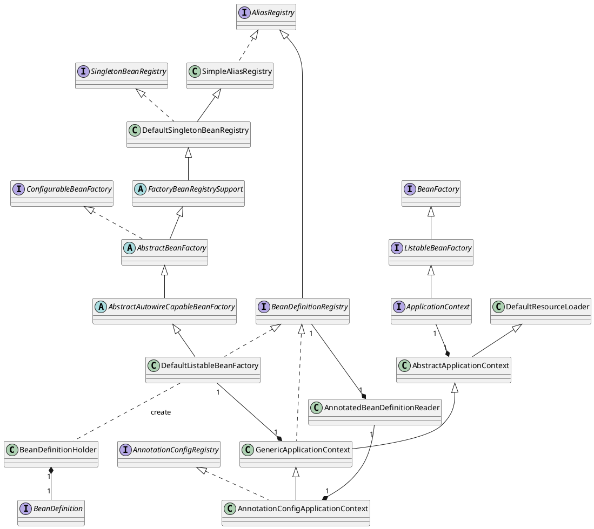
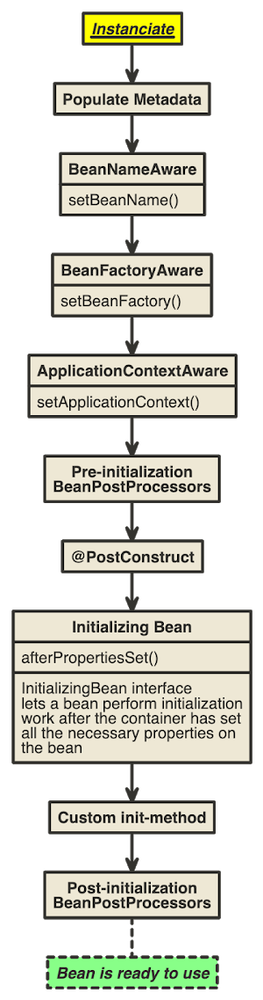

- [Reading `application.yml` Flow](#reading-applicationyml-flow)
- [How Event Handler Works](#how-event-handler-works)
- [How ApplicationRunner Works](#how-applicationrunner-works)
- [Processing Bean](#processing-bean)
- [Reading Bean](#reading-bean)
- [Registering Beans](#registering-beans)
- [Instantiating Bean](#instantiating-bean)

----

# Reading `application.yml` Flow

```java
// org.springframework.context.ConfigurableApplicationContext
public interface ConfigurableApplicationContext extends ApplicationContext, Lifecycle, Closeable {
...
	public ConfigurableApplicationContext run(String... args) {
		StopWatch stopWatch = new StopWatch();
		stopWatch.start();
		ConfigurableApplicationContext context = null;
		Collection<SpringBootExceptionReporter> exceptionReporters = new ArrayList<>();
		configureHeadlessProperty();
		SpringApplicationRunListeners listeners = getRunListeners(args);
		listeners.starting();
		try {
			ApplicationArguments applicationArguments = new DefaultApplicationArguments(args);
			ConfigurableEnvironment environment = prepareEnvironment(listeners, applicationArguments);

// org.springframework.boot.context.config.ConfigFileApplicationListener
public class ConfigFileApplicationListener implements EnvironmentPostProcessor, SmartApplicationListener, Ordered {
...
	@Override
	public void onApplicationEvent(ApplicationEvent event) {
		if (event instanceof ApplicationEnvironmentPreparedEvent) {
			onApplicationEnvironmentPreparedEvent((ApplicationEnvironmentPreparedEvent) event);
		}
		if (event instanceof ApplicationPreparedEvent) {
			onApplicationPreparedEvent(event);
		}
	}

// org.springframework.boot.context.config.ConfigFileApplicationListener
public class ConfigFileApplicationListener implements EnvironmentPostProcessor, SmartApplicationListener, Ordered {
...
		void load() {
			FilteredPropertySource.apply(this.environment, DEFAULT_PROPERTIES, LOAD_FILTERED_PROPERTY,
					(defaultProperties) -> {
						this.profiles = new LinkedList<>();
						this.processedProfiles = new LinkedList<>();
						this.activatedProfiles = false;
						this.loaded = new LinkedHashMap<>();
						initializeProfiles();
						while (!this.profiles.isEmpty()) {
							Profile profile = this.profiles.poll();
							if (isDefaultProfile(profile)) {
								addProfileToEnvironment(profile.getName());
							}
							load(profile, this::getPositiveProfileFilter,
									addToLoaded(MutablePropertySources::addLast, false));
							this.processedProfiles.add(profile);
						}
						load(null, this::getNegativeProfileFilter, addToLoaded(MutablePropertySources::addFirst, true));
						addLoadedPropertySources();
						applyActiveProfiles(defaultProperties);
					});
		}
// org.springframework.boot.context.config.ConfigFileApplicationListener
public class ConfigFileApplicationListener implements EnvironmentPostProcessor, SmartApplicationListener, Ordered {
...
		private void load(String location, String name, Profile profile, DocumentFilterFactory filterFactory,
				DocumentConsumer consumer) {
			if (!StringUtils.hasText(name)) {
				for (PropertySourceLoader loader : this.propertySourceLoaders) {
					if (canLoadFileExtension(loader, location)) {
						load(loader, location, profile, filterFactory.getDocumentFilter(profile), consumer);
						return;
					}
				}
				throw new IllegalStateException("File extension of config file location '" + location
						+ "' is not known to any PropertySourceLoader. If the location is meant to reference "
						+ "a directory, it must end in '/'");
			}
			Set<String> processed = new HashSet<>();
			for (PropertySourceLoader loader : this.propertySourceLoaders) {
				for (String fileExtension : loader.getFileExtensions()) {
					if (processed.add(fileExtension)) {
						loadForFileExtension(loader, location + name, "." + fileExtension, profile, filterFactory,
								consumer);
					}
				}
			}
		}

// org.springframework.boot.context.config.ConfigFileApplicationListener
public class ConfigFileApplicationListener implements EnvironmentPostProcessor, SmartApplicationListener, Ordered {

	private static final String DEFAULT_PROPERTIES = "defaultProperties";

	// Note the order is from least to most specific (last one wins)
	private static final String DEFAULT_SEARCH_LOCATIONS = "classpath:/,classpath:/config/,file:./,file:./config/";

	private static final String DEFAULT_NAMES = "application";
...
	private void loadForFileExtension(PropertySourceLoader loader, String prefix, String fileExtension,
			Profile profile, DocumentFilterFactory filterFactory, DocumentConsumer consumer) {
		DocumentFilter defaultFilter = filterFactory.getDocumentFilter(null);
		DocumentFilter profileFilter = filterFactory.getDocumentFilter(profile);
		if (profile != null) {
			// Try profile-specific file & profile section in profile file (gh-340)
			String profileSpecificFile = prefix + "-" + profile + fileExtension;
			load(loader, profileSpecificFile, profile, defaultFilter, consumer);
			load(loader, profileSpecificFile, profile, profileFilter, consumer);
			// Try profile specific sections in files we've already processed
			for (Profile processedProfile : this.processedProfiles) {
				if (processedProfile != null) {
					String previouslyLoaded = prefix + "-" + processedProfile + fileExtension;
					load(loader, previouslyLoaded, profile, profileFilter, consumer);
				}
			}
		}
		// Also try the profile-specific section (if any) of the normal file
		load(loader, prefix + fileExtension, profile, profileFilter, consumer);
	}

// org.springframework.boot.context.config.ConfigFileApplicationListener
public class ConfigFileApplicationListener implements EnvironmentPostProcessor, SmartApplicationListener, Ordered {
...
		private void load(PropertySourceLoader loader, String location, Profile profile, DocumentFilter filter,
				DocumentConsumer consumer) {
			try {
				Resource resource = this.resourceLoader.getResource(location);
				if (resource == null || !resource.exists()) {
					if (this.logger.isTraceEnabled()) {
						StringBuilder description = getDescription("Skipped missing config ", location, resource,
								profile);
						this.logger.trace(description);
					}
					return;
				}
				if (!StringUtils.hasText(StringUtils.getFilenameExtension(resource.getFilename()))) {
					if (this.logger.isTraceEnabled()) {
						StringBuilder description = getDescription("Skipped empty config extension ", location,
								resource, profile);
						this.logger.trace(description);
					}
					return;
				}
				String name = "applicationConfig: [" + location + "]";
				List<Document> documents = loadDocuments(loader, name, resource);
				if (CollectionUtils.isEmpty(documents)) {
					if (this.logger.isTraceEnabled()) {
						StringBuilder description = getDescription("Skipped unloaded config ", location, resource,
								profile);
						this.logger.trace(description);
					}
					return;
				}
				List<Document> loaded = new ArrayList<>();
				for (Document document : documents) {
					if (filter.match(document)) {
						addActiveProfiles(document.getActiveProfiles());
						addIncludedProfiles(document.getIncludeProfiles());
						loaded.add(document);
					}
				}
				Collections.reverse(loaded);
				if (!loaded.isEmpty()) {
					loaded.forEach((document) -> consumer.accept(profile, document));
					if (this.logger.isDebugEnabled()) {
						StringBuilder description = getDescription("Loaded config file ", location, resource, profile);
						this.logger.debug(description);
					}
				}
			}
			catch (Exception ex) {
				throw new IllegalStateException("Failed to load property source from location '" + location + "'", ex);
			}
		}

```

# How Event Handler Works

```java
// org.springframework.boot.SpringApplication
public class SpringApplication {
...
	public ConfigurableApplicationContext run(String... args) {
...
		try {
			listeners.running(context);

// org.springframework.boot.context.event.EventPublishingRunListener
public class EventPublishingRunListener implements SpringApplicationRunListener, Ordered {
...
	@Override
	public void running(ConfigurableApplicationContext context) {
		context.publishEvent(new ApplicationReadyEvent(this.application, this.args, context));
	}

// org.springframework.context.event.ApplicationListenerMethodAdapter
public class ApplicationListenerMethodAdapter implements GenericApplicationListener {
...
	@Override
	public void onApplicationEvent(ApplicationEvent event) {
		processEvent(event);
	}
```

# How ApplicationRunner Works

```java
// org.springframework.boot.SpringApplication
public class SpringApplication {
...
	public ConfigurableApplicationContext run(String... args) {
    ...
			listeners.started(context);
			callRunners(context, applicationArguments);

// org.springframework.boot.SpringApplication
public class SpringApplication {
...
	private void callRunners(ApplicationContext context, ApplicationArguments args) {
		List<Object> runners = new ArrayList<>();
		runners.addAll(context.getBeansOfType(ApplicationRunner.class).values());
		runners.addAll(context.getBeansOfType(CommandLineRunner.class).values());
		AnnotationAwareOrderComparator.sort(runners);
		for (Object runner : new LinkedHashSet<>(runners)) {
			if (runner instanceof ApplicationRunner) {
				callRunner((ApplicationRunner) runner, args);
			}
			if (runner instanceof CommandLineRunner) {
				callRunner((CommandLineRunner) runner, args);
			}
		}
	}
```

# Processing Bean

* [Spring IoC Container를 까보자 #Bean 등록은 어떻게 될까?](https://blog.woniper.net/336?category=699184)

-----

* Register Bean Definition to `Map<String, BeanDefinition>`.
* `getBean` instantiate Bean with `BeanDefinition` and save to `Map<String, Object>` for cache.
* Context Object has Beans.

Bean Processing 을 이해하기 위해 먼저 class diagram 을 파악한다.




# Reading Bean

`ListableBeanFactory::getBeansWithAnnotation()` 으로 특정 Bean 을 읽어올 수 있다.

```java
// org.springframework.boot.context.properties.ConfigurationPropertiesBean
public final class ConfigurationPropertiesBean {
...
	public static Map<String, ConfigurationPropertiesBean> getAll(ApplicationContext applicationContext) {
		Assert.notNull(applicationContext, "ApplicationContext must not be null");
		if (applicationContext instanceof ConfigurableApplicationContext) {
			return getAll((ConfigurableApplicationContext) applicationContext);
		}
		Map<String, ConfigurationPropertiesBean> propertiesBeans = new LinkedHashMap<>();
		applicationContext.getBeansWithAnnotation(ConfigurationProperties.class)
				.forEach((beanName, bean) -> propertiesBeans.put(beanName, get(applicationContext, bean, beanName)));

// org.springframework.context.ApplicationContext
public interface ApplicationContext extends EnvironmentCapable, ListableBeanFactory, HierarchicalBeanFactory,
		MessageSource, ApplicationEventPublisher, ResourcePatternResolver {

// org.springframework.beans.factory.ListableBeanFactory
public interface ListableBeanFactory extends BeanFactory {
...
	Map<String, Object> getBeansWithAnnotation(Class<? extends Annotation> annotationType) throws BeansException;

// org.springframework.beans.factory.support.DefaultListableBeanFactory
public class DefaultListableBeanFactory extends AbstractAutowireCapableBeanFactory
		implements ConfigurableListableBeanFactory, BeanDefinitionRegistry, Serializable {
...
	@Override
	public Map<String, Object> getBeansWithAnnotation(Class<? extends Annotation> annotationType) {
		String[] beanNames = getBeanNamesForAnnotation(annotationType);

// org.springframework.beans.factory.support.DefaultListableBeanFactory
public class DefaultListableBeanFactory extends AbstractAutowireCapableBeanFactory
		implements ConfigurableListableBeanFactory, BeanDefinitionRegistry, Serializable {
...
	@Override
	public String[] getBeanNamesForAnnotation(Class<? extends Annotation> annotationType) {
		List<String> result = new ArrayList<>();
		for (String beanName : this.beanDefinitionNames) {
			BeanDefinition beanDefinition = getBeanDefinition(beanName);
			if (!beanDefinition.isAbstract() && findAnnotationOnBean(beanName, annotationType) != null) {

// org.springframework.beans.factory.support.DefaultListableBeanFactory
public class DefaultListableBeanFactory extends AbstractAutowireCapableBeanFactory
		implements ConfigurableListableBeanFactory, BeanDefinitionRegistry, Serializable {
...
	@Override
	@Nullable
	public <A extends Annotation> A findAnnotationOnBean(String beanName, Class<A> annotationType)
			throws NoSuchBeanDefinitionException {

		return findMergedAnnotationOnBean(beanName, annotationType)
				.synthesize(MergedAnnotation::isPresent).orElse(null);

// org.springframework.beans.factory.support.DefaultListableBeanFactory
public class DefaultListableBeanFactory extends AbstractAutowireCapableBeanFactory
		implements ConfigurableListableBeanFactory, BeanDefinitionRegistry, Serializable {
...

```

# Registering Beans

* `DefaultListableBeanFactory.registerBeanDefinition` register bean-name, bean-definition to `Map<String, BeanDefinition>`.

```java
// org.springframework.boot.SpringApplication::refresh
	public ConfigurableApplicationContext run(String... args) {
		StopWatch stopWatch = new StopWatch();
		stopWatch.start();
		ConfigurableApplicationContext context = null;
		Collection<SpringBootExceptionReporter> exceptionReporters = new ArrayList<>();
		configureHeadlessProperty();
		SpringApplicationRunListeners listeners = getRunListeners(args);
		listeners.starting();
		try {
			ApplicationArguments applicationArguments = new DefaultApplicationArguments(args);
			ConfigurableEnvironment environment = prepareEnvironment(listeners, applicationArguments);
			configureIgnoreBeanInfo(environment);
			Banner printedBanner = printBanner(environment);
			context = createApplicationContext();
			exceptionReporters = getSpringFactoriesInstances(SpringBootExceptionReporter.class,
					new Class[] { ConfigurableApplicationContext.class }, context);
			prepareContext(context, environment, listeners, applicationArguments, printedBanner);
			refreshContext(context);

// org.springframework.boot.SpringApplication::refreshContext
	private void refreshContext(ConfigurableApplicationContext context) {
		refresh(context);
		if (this.registerShutdownHook) {
			try {
				context.registerShutdownHook();
			}
			catch (AccessControlException ex) {
				// Not allowed in some environments.
			}
		}
	}

// org.springframework.boot.SpringApplication::refresh
	@Override
	public void refresh() throws BeansException, IllegalStateException {
		synchronized (this.startupShutdownMonitor) {
			// Prepare this context for refreshing.
			prepareRefresh();

			// Tell the subclass to refresh the internal bean factory.
			ConfigurableListableBeanFactory beanFactory = obtainFreshBeanFactory();

			// Prepare the bean factory for use in this context.
			prepareBeanFactory(beanFactory);

			try {
				// Allows post-processing of the bean factory in context subclasses.
				postProcessBeanFactory(beanFactory);

				// Invoke factory processors registered as beans in the context.
				invokeBeanFactoryPostProcessors(beanFactory);

				// Register bean processors that intercept bean creation.
				registerBeanPostProcessors(beanFactory);

				// Initialize message source for this context.
				initMessageSource();

				// Initialize event multicaster for this context.
				initApplicationEventMulticaster();

				// Initialize other special beans in specific context subclasses.
				onRefresh();

				// Check for listener beans and register them.
				registerListeners();

				// Instantiate all remaining (non-lazy-init) singletons.
				finishBeanFactoryInitialization(beanFactory);

				// Last step: publish corresponding event.
				finishRefresh();
			}

			catch (BeansException ex) {
				if (logger.isWarnEnabled()) {
					logger.warn("Exception encountered during context initialization - " +
							"cancelling refresh attempt: " + ex);
				}

				// Destroy already created singletons to avoid dangling resources.
				destroyBeans();

				// Reset 'active' flag.
				cancelRefresh(ex);

				// Propagate exception to caller.
				throw ex;
			}

			finally {
				// Reset common introspection caches in Spring's core, since we
				// might not ever need metadata for singleton beans anymore...
				resetCommonCaches();
			}
		}
	}
```

다음은 Registering Bean 의 sequence diagram 이다.

* [A process of Spring Bean from scratch](https://programming.vip/docs/a-process-of-spring-bean-from-scratch.html)



# Instantiating Bean

* `AnnotationConfigApplicationContext::getBean()` starts to instantiate Bean.
* `AbstractBeanFactory.doGetBean` instantiate Bean.
