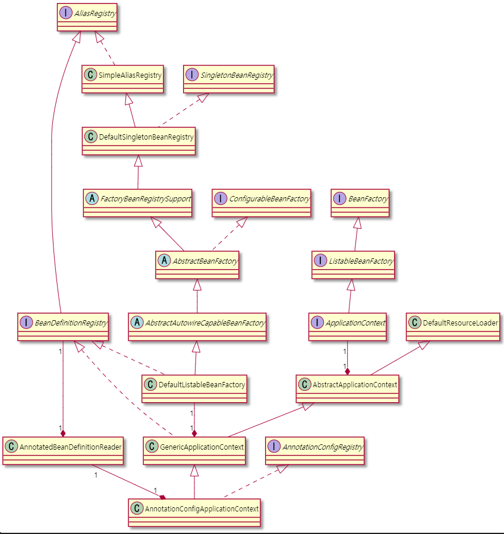

- [Reading `application.yml` Flow](#reading-applicationyml-flow)
- [How Event Handler Works](#how-event-handler-works)
- [How ApplicationRunner Works](#how-applicationrunner-works)
- [Processing Bean](#processing-bean)
- [Getting Bean Instance](#getting-bean-instance)
- [Registering Bean Definition](#registering-bean-definition)
- [Creating Bean Instance](#creating-bean-instance)
- [Instanciating SingleTon Bean Instances](#instanciating-singleton-bean-instances)

----

# Reading `application.yml` Flow

```java
// org.springframework.context.ConfigurableApplicationContext
public interface ConfigurableApplicationContext extends ApplicationContext, Lifecycle, Closeable {
...
	public ConfigurableApplicationContext run(String... args) {
		StopWatch stopWatch = new StopWatch();
		stopWatch.start();
		ConfigurableApplicationContext context = null;
		Collection<SpringBootExceptionReporter> exceptionReporters = new ArrayList<>();
		configureHeadlessProperty();
		SpringApplicationRunListeners listeners = getRunListeners(args);
		listeners.starting();
		try {
			ApplicationArguments applicationArguments = new DefaultApplicationArguments(args);
			ConfigurableEnvironment environment = prepareEnvironment(listeners, applicationArguments);

// org.springframework.boot.context.config.ConfigFileApplicationListener
public class ConfigFileApplicationListener implements EnvironmentPostProcessor, SmartApplicationListener, Ordered {
...
	@Override
	public void onApplicationEvent(ApplicationEvent event) {
		if (event instanceof ApplicationEnvironmentPreparedEvent) {
			onApplicationEnvironmentPreparedEvent((ApplicationEnvironmentPreparedEvent) event);
		}
		if (event instanceof ApplicationPreparedEvent) {
			onApplicationPreparedEvent(event);
		}
	}

// org.springframework.boot.context.config.ConfigFileApplicationListener
public class ConfigFileApplicationListener implements EnvironmentPostProcessor, SmartApplicationListener, Ordered {
...
		void load() {
			FilteredPropertySource.apply(this.environment, DEFAULT_PROPERTIES, LOAD_FILTERED_PROPERTY,
					(defaultProperties) -> {
						this.profiles = new LinkedList<>();
						this.processedProfiles = new LinkedList<>();
						this.activatedProfiles = false;
						this.loaded = new LinkedHashMap<>();
						initializeProfiles();
						while (!this.profiles.isEmpty()) {
							Profile profile = this.profiles.poll();
							if (isDefaultProfile(profile)) {
								addProfileToEnvironment(profile.getName());
							}
							load(profile, this::getPositiveProfileFilter,
									addToLoaded(MutablePropertySources::addLast, false));
							this.processedProfiles.add(profile);
						}
						load(null, this::getNegativeProfileFilter, addToLoaded(MutablePropertySources::addFirst, true));
						addLoadedPropertySources();
						applyActiveProfiles(defaultProperties);
					});
		}
// org.springframework.boot.context.config.ConfigFileApplicationListener
public class ConfigFileApplicationListener implements EnvironmentPostProcessor, SmartApplicationListener, Ordered {
...
		private void load(String location, String name, Profile profile, DocumentFilterFactory filterFactory,
				DocumentConsumer consumer) {
			if (!StringUtils.hasText(name)) {
				for (PropertySourceLoader loader : this.propertySourceLoaders) {
					if (canLoadFileExtension(loader, location)) {
						load(loader, location, profile, filterFactory.getDocumentFilter(profile), consumer);
						return;
					}
				}
				throw new IllegalStateException("File extension of config file location '" + location
						+ "' is not known to any PropertySourceLoader. If the location is meant to reference "
						+ "a directory, it must end in '/'");
			}
			Set<String> processed = new HashSet<>();
			for (PropertySourceLoader loader : this.propertySourceLoaders) {
				for (String fileExtension : loader.getFileExtensions()) {
					if (processed.add(fileExtension)) {
						loadForFileExtension(loader, location + name, "." + fileExtension, profile, filterFactory,
								consumer);
					}
				}
			}
		}

// org.springframework.boot.context.config.ConfigFileApplicationListener
public class ConfigFileApplicationListener implements EnvironmentPostProcessor, SmartApplicationListener, Ordered {

	private static final String DEFAULT_PROPERTIES = "defaultProperties";

	// Note the order is from least to most specific (last one wins)
	private static final String DEFAULT_SEARCH_LOCATIONS = "classpath:/,classpath:/config/,file:./,file:./config/";

	private static final String DEFAULT_NAMES = "application";
...
	private void loadForFileExtension(PropertySourceLoader loader, String prefix, String fileExtension,
			Profile profile, DocumentFilterFactory filterFactory, DocumentConsumer consumer) {
		DocumentFilter defaultFilter = filterFactory.getDocumentFilter(null);
		DocumentFilter profileFilter = filterFactory.getDocumentFilter(profile);
		if (profile != null) {
			// Try profile-specific file & profile section in profile file (gh-340)
			String profileSpecificFile = prefix + "-" + profile + fileExtension;
			load(loader, profileSpecificFile, profile, defaultFilter, consumer);
			load(loader, profileSpecificFile, profile, profileFilter, consumer);
			// Try profile specific sections in files we've already processed
			for (Profile processedProfile : this.processedProfiles) {
				if (processedProfile != null) {
					String previouslyLoaded = prefix + "-" + processedProfile + fileExtension;
					load(loader, previouslyLoaded, profile, profileFilter, consumer);
				}
			}
		}
		// Also try the profile-specific section (if any) of the normal file
		load(loader, prefix + fileExtension, profile, profileFilter, consumer);
	}

// org.springframework.boot.context.config.ConfigFileApplicationListener
public class ConfigFileApplicationListener implements EnvironmentPostProcessor, SmartApplicationListener, Ordered {
...
		private void load(PropertySourceLoader loader, String location, Profile profile, DocumentFilter filter,
				DocumentConsumer consumer) {
			try {
				Resource resource = this.resourceLoader.getResource(location);
				if (resource == null || !resource.exists()) {
					if (this.logger.isTraceEnabled()) {
						StringBuilder description = getDescription("Skipped missing config ", location, resource,
								profile);
						this.logger.trace(description);
					}
					return;
				}
				if (!StringUtils.hasText(StringUtils.getFilenameExtension(resource.getFilename()))) {
					if (this.logger.isTraceEnabled()) {
						StringBuilder description = getDescription("Skipped empty config extension ", location,
								resource, profile);
						this.logger.trace(description);
					}
					return;
				}
				String name = "applicationConfig: [" + location + "]";
				List<Document> documents = loadDocuments(loader, name, resource);
				if (CollectionUtils.isEmpty(documents)) {
					if (this.logger.isTraceEnabled()) {
						StringBuilder description = getDescription("Skipped unloaded config ", location, resource,
								profile);
						this.logger.trace(description);
					}
					return;
				}
				List<Document> loaded = new ArrayList<>();
				for (Document document : documents) {
					if (filter.match(document)) {
						addActiveProfiles(document.getActiveProfiles());
						addIncludedProfiles(document.getIncludeProfiles());
						loaded.add(document);
					}
				}
				Collections.reverse(loaded);
				if (!loaded.isEmpty()) {
					loaded.forEach((document) -> consumer.accept(profile, document));
					if (this.logger.isDebugEnabled()) {
						StringBuilder description = getDescription("Loaded config file ", location, resource, profile);
						this.logger.debug(description);
					}
				}
			}
			catch (Exception ex) {
				throw new IllegalStateException("Failed to load property source from location '" + location + "'", ex);
			}
		}

```

# How Event Handler Works

```java
// org.springframework.boot.SpringApplication
public class SpringApplication {
...
	public ConfigurableApplicationContext run(String... args) {
...
		try {
			listeners.running(context);

// org.springframework.boot.context.event.EventPublishingRunListener
public class EventPublishingRunListener implements SpringApplicationRunListener, Ordered {
...
	@Override
	public void running(ConfigurableApplicationContext context) {
		context.publishEvent(new ApplicationReadyEvent(this.application, this.args, context));
	}

// org.springframework.context.event.ApplicationListenerMethodAdapter
public class ApplicationListenerMethodAdapter implements GenericApplicationListener {
...
	@Override
	public void onApplicationEvent(ApplicationEvent event) {
		processEvent(event);
	}
```

# How ApplicationRunner Works

```java
// org.springframework.boot.SpringApplication
public class SpringApplication {
...
	public ConfigurableApplicationContext run(String... args) {
    ...
			listeners.started(context);
			callRunners(context, applicationArguments);

// org.springframework.boot.SpringApplication
public class SpringApplication {
...
	private void callRunners(ApplicationContext context, ApplicationArguments args) {
		List<Object> runners = new ArrayList<>();
		runners.addAll(context.getBeansOfType(ApplicationRunner.class).values());
		runners.addAll(context.getBeansOfType(CommandLineRunner.class).values());
		AnnotationAwareOrderComparator.sort(runners);
		for (Object runner : new LinkedHashSet<>(runners)) {
			if (runner instanceof ApplicationRunner) {
				callRunner((ApplicationRunner) runner, args);
			}
			if (runner instanceof CommandLineRunner) {
				callRunner((CommandLineRunner) runner, args);
			}
		}
	}
```

# Processing Bean

* [Spring IoC Container를 까보자 #Bean 등록은 어떻게 될까?](https://blog.woniper.net/336?category=699184)

-----

* Register Bean Definition to `Map<String, BeanDefinition>`.
* `getBean` instantiate Bean with `BeanDefinition` and save to `Map<String, Object>` for cache.
* Context Object has Beans.

Bean Processing 을 이해하기 위해서는 다음의 Class Diagram 을 이해해야 한다. 자꾸
보면 외워진다.




# Getting Bean Instance

`ListableBeanFactory::getBeansWithAnnotation()` 으로 특정 Bean 을 읽어올 수 있다.

[Getting Bean Instance](SpringAnnotationsCodeTour.md#getting-bean-instance) 참고.

# Registering Bean Definition

* `DefaultListableBeanFactory.registerBeanDefinition` register bean-name, bean-definition to `Map<String, BeanDefinition>`.

[Registering Bean Flow](SpringAnnotationsCodeTour.md#registering-bean-flow) 참고.

* [A process of Spring Bean from scratch](https://programming.vip/docs/a-process-of-spring-bean-from-scratch.html)


# Creating Bean Instance

* `AnnotationConfigApplicationContext::getBean()` starts to instantiate Bean.
* `AbstractBeanFactory.doGetBean` instantiate Bean.
  
[Creating Bean Intstance](SpringAnnotationsCodeTour.md#creating-bean-instance) 참고.

# Instanciating SingleTon Bean Instances

`ConfigurableListableBeanFactory::preInstantiateSingletons()` 에서 SingleTon Bean Instances 를 생성한다.

```java
// org.springframework.beans.factory.config.ConfigurableListableBeanFactory
public interface ConfigurableListableBeanFactory
		extends ListableBeanFactory, AutowireCapableBeanFactory, ConfigurableBeanFactory {
...
	@Override
	public void preInstantiateSingletons() throws BeansException {
```

다음은 SpringApplication 이
`ConfigurableListableBeanFactory::preInstantiateSingletons()` 를 호출하기 까지
흐름을 추적한 것이다. `AbstractBeanFactory::getBean()` 를 호출하면 `DefaultSingletonBeanRegistry::singletonObjects`
에 없으면 Bean Instance 를 생성한다. [Creating Bean Instance](SpringAnnotationsCodeTour.md#creating-bean-instance) 참고.

```java
// com.iamslash.exannotation.ExAnnotationApp
@SpringBootApplication
public class ExAnnotationApp {

    public static void main(String[] args) {
        new SpringApplicationBuilder()
            .sources(ExAnnotationApp.class)
            .run(args);

// org.springframework.boot.builder.SpringApplicationBuilder
public class SpringApplicationBuilder {
...
	public ConfigurableApplicationContext run(String... args) {
		if (this.running.get()) {
			// If already created we just return the existing context
			return this.context;
		}
		configureAsChildIfNecessary(args);
		if (this.running.compareAndSet(false, true)) {
			synchronized (this.running) {
				// If not already running copy the sources over and then run.
				this.context = build().run(args);

// org.springframework.boot.SpringApplication
public class SpringApplication {
...
	public ConfigurableApplicationContext run(String... args) {
		StopWatch stopWatch = new StopWatch();
		stopWatch.start();
		ConfigurableApplicationContext context = null;
		Collection<SpringBootExceptionReporter> exceptionReporters = new ArrayList<>();
		configureHeadlessProperty();
		SpringApplicationRunListeners listeners = getRunListeners(args);
		listeners.starting();
		try {
			ApplicationArguments applicationArguments = new DefaultApplicationArguments(args);
			ConfigurableEnvironment environment = prepareEnvironment(listeners, applicationArguments);
			configureIgnoreBeanInfo(environment);
			Banner printedBanner = printBanner(environment);
			context = createApplicationContext();
			exceptionReporters = getSpringFactoriesInstances(SpringBootExceptionReporter.class,
					new Class[] { ConfigurableApplicationContext.class }, context);
			prepareContext(context, environment, listeners, applicationArguments, printedBanner);
			refreshContext(context);

// org.springframework.boot.SpringApplication
public class SpringApplication {
...
	private void refreshContext(ConfigurableApplicationContext context) {
		refresh(context);

// org.springframework.boot.SpringApplication
public class SpringApplication {
...
	protected void refresh(ApplicationContext applicationContext) {
		Assert.isInstanceOf(AbstractApplicationContext.class, applicationContext);
		((AbstractApplicationContext) applicationContext).refresh();

// org.springframework.boot.web.servlet.context.ServletWebServerApplicationContext
public class ServletWebServerApplicationContext extends GenericWebApplicationContext
		implements ConfigurableWebServerApplicationContext {
...
	@Override
	public final void refresh() throws BeansException, IllegalStateException {
		try {
			super.refresh();

// org.springframework.context.support.AbstractApplicationContext
public abstract class AbstractApplicationContext extends DefaultResourceLoader
		implements ConfigurableApplicationContext {
...
	@Override
	public void refresh() throws BeansException, IllegalStateException {
		synchronized (this.startupShutdownMonitor) {
			// Prepare this context for refreshing.
			prepareRefresh();

			// Tell the subclass to refresh the internal bean factory.
			ConfigurableListableBeanFactory beanFactory = obtainFreshBeanFactory();

			// Prepare the bean factory for use in this context.
			prepareBeanFactory(beanFactory);

			try {
				// Allows post-processing of the bean factory in context subclasses.
				postProcessBeanFactory(beanFactory);

				// Invoke factory processors registered as beans in the context.
				invokeBeanFactoryPostProcessors(beanFactory);

				// Register bean processors that intercept bean creation.
				registerBeanPostProcessors(beanFactory);

				// Initialize message source for this context.
				initMessageSource();

				// Initialize event multicaster for this context.
				initApplicationEventMulticaster();

				// Initialize other special beans in specific context subclasses.
				onRefresh();

				// Check for listener beans and register them.
				registerListeners();

				// Instantiate all remaining (non-lazy-init) singletons.
				finishBeanFactoryInitialization(beanFactory);

// org.springframework.context.support.AbstractApplicationContext
public abstract class AbstractApplicationContext extends DefaultResourceLoader
		implements ConfigurableApplicationContext {
...
	protected void finishBeanFactoryInitialization(ConfigurableListableBeanFactory beanFactory) {
		// Initialize conversion service for this context.
		if (beanFactory.containsBean(CONVERSION_SERVICE_BEAN_NAME) &&
				beanFactory.isTypeMatch(CONVERSION_SERVICE_BEAN_NAME, ConversionService.class)) {
			beanFactory.setConversionService(
					beanFactory.getBean(CONVERSION_SERVICE_BEAN_NAME, ConversionService.class));
		}

		// Register a default embedded value resolver if no bean post-processor
		// (such as a PropertyPlaceholderConfigurer bean) registered any before:
		// at this point, primarily for resolution in annotation attribute values.
		if (!beanFactory.hasEmbeddedValueResolver()) {
			beanFactory.addEmbeddedValueResolver(strVal -> getEnvironment().resolvePlaceholders(strVal));
		}

		// Initialize LoadTimeWeaverAware beans early to allow for registering their transformers early.
		String[] weaverAwareNames = beanFactory.getBeanNamesForType(LoadTimeWeaverAware.class, false, false);
		for (String weaverAwareName : weaverAwareNames) {
			getBean(weaverAwareName);
		}

		// Stop using the temporary ClassLoader for type matching.
		beanFactory.setTempClassLoader(null);

		// Allow for caching all bean definition metadata, not expecting further changes.
		beanFactory.freezeConfiguration();

		// Instantiate all remaining (non-lazy-init) singletons.
		beanFactory.preInstantiateSingletons();

// org.springframework.beans.factory.config.ConfigurableListableBeanFactory
public interface ConfigurableListableBeanFactory
		extends ListableBeanFactory, AutowireCapableBeanFactory, ConfigurableBeanFactory {
...
	@Override
	public void preInstantiateSingletons() throws BeansException {
		if (logger.isTraceEnabled()) {
			logger.trace("Pre-instantiating singletons in " + this);
		}

		// Iterate over a copy to allow for init methods which in turn register new bean definitions.
		// While this may not be part of the regular factory bootstrap, it does otherwise work fine.
		List<String> beanNames = new ArrayList<>(this.beanDefinitionNames);

		// Trigger initialization of all non-lazy singleton beans...
		for (String beanName : beanNames) {
			RootBeanDefinition bd = getMergedLocalBeanDefinition(beanName);
			if (!bd.isAbstract() && bd.isSingleton() && !bd.isLazyInit()) {
				if (isFactoryBean(beanName)) {
					Object bean = getBean(FACTORY_BEAN_PREFIX + beanName);
					if (bean instanceof FactoryBean) {
						final FactoryBean<?> factory = (FactoryBean<?>) bean;
						boolean isEagerInit;
						if (System.getSecurityManager() != null && factory instanceof SmartFactoryBean) {
							isEagerInit = AccessController.doPrivileged((PrivilegedAction<Boolean>)
											((SmartFactoryBean<?>) factory)::isEagerInit,
									getAccessControlContext());
						}
						else {
							isEagerInit = (factory instanceof SmartFactoryBean &&
									((SmartFactoryBean<?>) factory).isEagerInit());
						}
						if (isEagerInit) {
							getBean(beanName);
						}
					}
				}
				else {
					getBean(beanName);		
```
