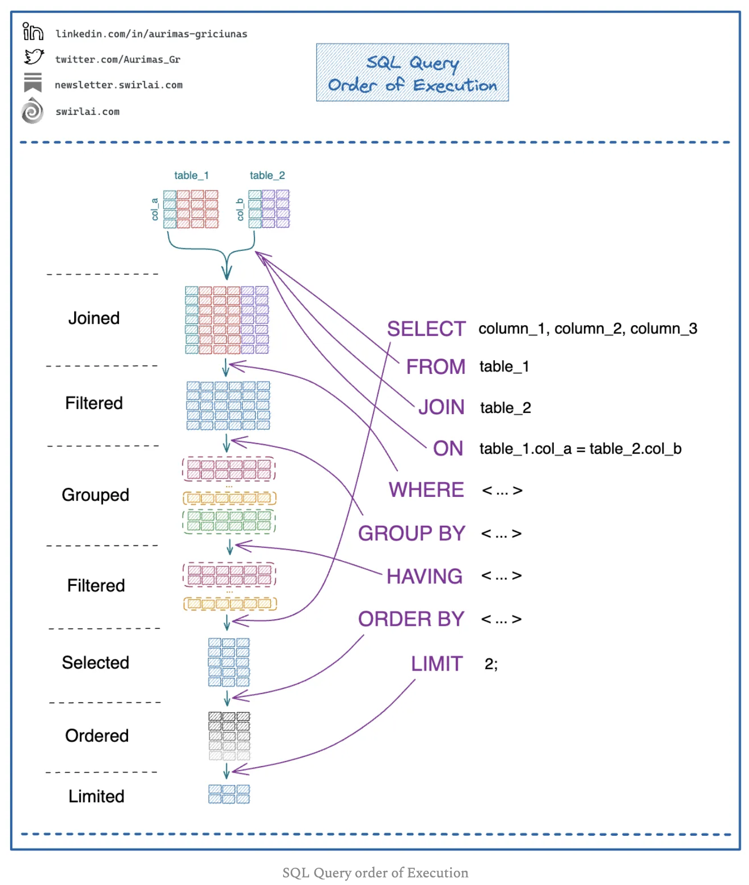
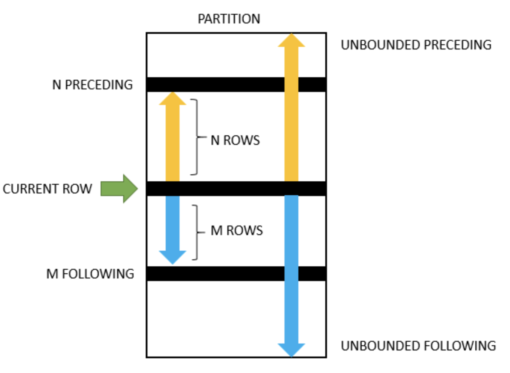

- [Essentials](#essentials)
- [Materials](#materials)
- [SQL Query Order Of Execution](#sql-query-order-of-execution)
- [Prepare Database](#prepare-database)
  - [MySQL](#mysql)
  - [PostreSQL](#postresql)
  - [Sample Data](#sample-data)
- [Basic](#basic)
  - [SQL Types](#sql-types)
  - [Comments](#comments)
  - [Fetching Data](#fetching-data)
    - [Select Statement Order](#select-statement-order)
    - [Select](#select)
    - [Where Operators](#where-operators)
    - [Like](#like)
    - [Wildcards](#wildcards)
  - [Sorting Data](#sorting-data)
    - [Order By](#order-by)
  - [Joning Tables](#joning-tables)
    - [Basic Join](#basic-join)
    - [Join ON vs WHERE](#join-on-vs-where)
    - [Triple Join](#triple-join)
  - [Grouping Data](#grouping-data)
  - [Subqueries](#subqueries)
  - [Common Table Expressions (CTE)](#common-table-expressions-cte)
  - [Set Operators](#set-operators)
  - [Updating Data](#updating-data)
  - [Insert On Duplicate Key Update](#insert-on-duplicate-key-update)
  - [Transactions](#transactions)
  - [Managing Databases](#managing-databases)
  - [Managing Tables](#managing-tables)
  - [Data Types (MySQL)](#data-types-mysql)
    - [Text](#text)
    - [Number](#number)
    - [Date](#date)
  - [Constraints](#constraints)
  - [Globalization](#globalization)
    - [CHARACTER SET](#character-set)
    - [Collation](#collation)
  - [Importing, Exporting CSV](#importing-exporting-csv)
  - [Natural Sorting](#natural-sorting)
  - [Session Variables](#session-variables)
- [Advanced](#advanced)
  - [Indexes](#indexes)
  - [Pivot](#pivot)
  - [Aggregate Functions](#aggregate-functions)
  - [Conditional Aggregate Functions](#conditional-aggregate-functions)
  - [Comparison Functions](#comparison-functions)
  - [Control Flow Functions And Expressions](#control-flow-functions-and-expressions)
  - [Date Functions](#date-functions)
  - [String Functions](#string-functions)
  - [Window Functions](#window-functions)
  - [Number Functions](#number-functions)
  - [Advanced Functions](#advanced-functions)
  - [Operators](#operators)
    - [Arithmetic](#arithmetic)
    - [Bitwise](#bitwise)
    - [Comparison](#comparison)
    - [Compound](#compound)
    - [Logical](#logical)
- [Tips](#tips)
  - [Managing Hierarchical Data in MySQL Using the Adjacency List Model](#managing-hierarchical-data-in-mysql-using-the-adjacency-list-model)
  - [How to Get Row Count in MySQL](#how-to-get-row-count-in-mysql)
  - [MySQL Compare Two Tables](#mysql-compare-two-tables)
  - [How To Find Duplicate Values in MySQL](#how-to-find-duplicate-values-in-mysql)
  - [How To Delete Duplicate Rows in MySQL](#how-to-delete-duplicate-rows-in-mysql)
  - [UUID vs INT for Primary](#uuid-vs-int-for-primary)
  - [MySQL Copy Table With Examples](#mysql-copy-table-with-examples)
  - [How To Copy a MySQL Database](#how-to-copy-a-mysql-database)
  - [MySQL Variables](#mysql-variables)
  - [MySQL SELECT INTO Variable](#mysql-select-into-variable)
  - [How To Compare Successive Rows Within The Same Table in MySQL](#how-to-compare-successive-rows-within-the-same-table-in-mysql)
  - [How To Change MySQL Storage Engine](#how-to-change-mysql-storage-engine)
  - [MySQL REGEXP: Search Based On Regular Expressions](#mysql-regexp-search-based-on-regular-expressions)
  - [MySQL ROW\_NUMBER, This is How You Emulate It](#mysql-row_number-this-is-how-you-emulate-it)
  - [MySQL Select Random Records](#mysql-select-random-records)
  - [How To Select The nth Highest Record In MySQL](#how-to-select-the-nth-highest-record-in-mysql)
  - [MySQL Reset Auto Increment Values](#mysql-reset-auto-increment-values)
  - [MariaDB vs. MySQL](#mariadb-vs-mysql)
  - [MySQL Interval](#mysql-interval)
  - [MySQL NULL: The Beginner’s Guide](#mysql-null-the-beginners-guide)
  - [How to Get MySQL Today’s Date](#how-to-get-mysql-todays-date)
  - [Mapping NULL Values to Other Values](#mapping-null-values-to-other-values)
- [Effecive SQL](#effecive-sql)

-----

# Essentials

- [MySQL Tutorial](https://www.mysqltutorial.org/mysql-basics/)
  - [PlayGround](https://www.mysqltutorial.org/tryit/)
- [The Database Cookbook For Developers](https://sqlfordevs.com/ebook)
- [Explaining The Postgres Meme](https://www.avestura.dev/blog/explaining-the-postgres-meme#level-6-hadal-zone)
- [sqlzoo](http://sqlzoo.net/)
  - tutorial 의 문제들은 필수다.
- [database problems @ leecode](https://leetcode.com/problemset/database/) 
  - 문제들을 모두 풀어보자.
* [cracking the coding interview](http://www.crackingthecodinginterview.com/)
  * databases quiz 가 볼만함

# Materials

- [db-fiddle](https://www.db-fiddle.com/)
  - sql 을 웹에서 테스트할 수 있다. 
- [sql snippet](https://en.wikibooks.org/wiki/Structured_Query_Language/Snippets)
- [sakila](https://dev.mysql.com/doc/sakila/en/sakila-preface.html)
  - 비디오 대여점을 모델링한 example db이다. sql을 참고해서 공부하자.
* [use the idex luke](http://use-the-index-luke.com/)
* [sql @ w3schools](https://www.w3schools.com/sql/default.asp)

# SQL Query Order Of Execution

[SQL Query Order Of Execution](https://www.newsletter.swirlai.com/i/119650808/sql-query-order-of-execution)



# Prepare Database

## MySQL

```bash
$ docker run -p 3306:3306 --rm --name my-mysql -e MYSQL_ROOT_PASSWORD=1 -e MYSQL_DATABASE=hello -e MYSQL_USER=iamslash -e MYSQL_PASSWORD=1 -d mysql

$ docker exec -it my-mysql /bin/bash

$ mysql -u iamslash -p
mysql> show databases
mysql> use hello
```

```sql
CREATE TABLE games
(
  yr   INT NOT NULL PRIMARY KEY,
  city VARCHAR(20)
);
CREATE INDEX idx_yr ON games (yr);
INSERT INTO games(yr, city) VALUES (2004,'Athens');
INSERT INTO games(yr, city) VALUES (2008,'Beijing');
INSERT INTO games(yr, city) VALUES (2012,'London');
SELECT * FROM games;
```

## PostreSQL

```bash
$ docker run --rm -p 5432:5432 -e POSTGRES_PASSWORD=1 -e POSTGRES_USER=iamslash -e POSTGRES_DB=basicdb --name my-postgres -d postgres

$ docker exec -it my-postgres bash

$ psql -U iamslash basicdb
```

```sql
CREATE TABLE games
(
	yr   SERIAL PRIMARY KEY,
	city VARCHAR(20) NOT NULL
);
CREATE INDEX idx_yr ON games USING btree(yr);
INSERT INTO games(yr, city) VALUES (2004,'Athens');
INSERT INTO games(yr, city) VALUES (2008,'Beijing');
INSERT INTO games(yr, city) VALUES (2012,'London');
SELECT * FROM games;
```

## Sample Data

```sql
/* products */
CREATE TABLE products (
    product_id INT PRIMARY KEY,
    product_name VARCHAR(255),
    price DECIMAL(10, 2) NOT NULL
);
INSERT INTO products (product_id, product_name, price)
VALUES (1, 'Product A', 100.00),
       (2, 'Product B', 150.00),
       (3, 'Product C', 200.00);

product_id | product_name | price
-------------------------------
1          | Product A    | 100.00
2          | Product B    | 150.00
3          | Product C    | 200.00

/* customers table */
CREATE TABLE customers (
    customer_id INT PRIMARY KEY,
    customer_name VARCHAR(255) NOT NULL,
    email VARCHAR(255) NOT NULL
);
INSERT INTO customers (customer_id, customer_name, email)
VALUES (1, 'John Doe', 'john.doe@example.com'),
       (2, 'Jane Smith', 'jane.smith@example.com'),
       (3, 'Alice Johnson', 'alice.johnson@example.com');
-- result
customer_id | customer_name | email
---------------------------------------------
1           | John Doe      | john.doe@example.com
2           | Jane Smith    | jane.smith@example.com
3           | Alice Johnson | alice.johnson@example.com     

/* sales */
CREATE TABLE sales (
    sale_id INT PRIMARY KEY,
    product_id INT,
    customer_id INT,
    sale_date DATE,
    quantity INT,
    FOREIGN KEY (product_id) REFERENCES products(product_id),
    FOREIGN KEY (customer_id) REFERENCES customers(customer_id)
);
INSERT INTO sales (sale_id, product_id, customer_id, sale_date, quantity)
VALUES (1, 1, 1, '2022-01-01', 5),
       (2, 2, 2, '2022-01-01', 3),
       (3, 1, 3, '2022-01-02', 2),
       (4, 3, 1, '2022-01-03', 1);
-- result
sale_id | product_id | customer_id | sale_date  | quantity
---------------------------------------------------------
1       | 1          | 1           | 2022-01-01 | 5
2       | 2          | 2           | 2022-01-01 | 3
3       | 1          | 3           | 2022-01-02 | 2
4       | 3          | 1           | 2022-01-03 | 1
```

# Basic

## SQL Types

* **DML** : Data Manipulation Language
  * SELECT, INSERT, UPDATE, DELETE 
* **DDL** : Data Definition Language
  * CREATE, ALTER, DROP, RENAME, TRUNCATE 
* **DCL** : Data Control Language
  * GRANT, REVOKE 
* **TCL** : Transaction Control Language
  * COMMIT, ROLLBACK, SAVEPOINT 

## Comments

```sql
-- This is a multi-line comment
-- that describes the query below.
SELECT name, age
FROM students
WHERE age >= 18
AND age <= 30; /* This comment explains the conditions */
```

## Fetching Data

### Select Statement Order

* [SELECT 실행 순서](https://j2yes.tistory.com/entry/select%EB%AC%B8-%EC%88%9C%EC%84%9C%EC%99%80-having%EC%A0%88)

----

* order of select definition
  * SELECT
  * FROM
  * WHERE
  * GROUP BY
  * HAVING
  * ORDER BY

* order of select execution
  * FROM
  * WHERE
  * GROUP BY
  * HAVING
  * SELECT
  * ORDER BY

### Select

```sql
-- Select From
SELECT * FROM products;

-- WHERE
SELECT * FROM products WHERE price > 150.00;

-- DISTINCT
SELECT DISTINCT price FROM products;

-- COUNT(DISTINCT)
SELECT COUNT(DISTINCT price) FROM products;

-- AND
SELECT * FROM products WHERE price > 100.00 AND price < 200.00;

-- OR
SELECT * FROM products WHERE product_id = 1 OR price = 150.00;

-- IN
SELECT * FROM products WHERE product_id IN (1, 3);

-- NOT IN
SELECT * FROM products WHERE product_id NOT IN (1, 3);

-- BETWEEN
SELECT * FROM products WHERE price BETWEEN 100.00 AND 200.00;

-- LIKE
SELECT * FROM products WHERE product_name LIKE 'Product%';

-- LIMIT
SELECT * FROM products LIMIT 2;

-- IS NULL
SELECT * FROM products WHERE product_name IS NULL;

-- IFNULL
SELECT product_id, IFNULL(product_name, 'N/A') as product_name, price FROM products;

-- NOT
SELECT * FROM products WHERE NOT price = 150.00;

-- Wildcards
SELECT * FROM products WHERE product_name LIKE '%A%';

-- Alias
SELECT product_id AS 'ID', product_name AS 'Name', price AS 'Cost' FROM products;

-- Select Year-Month
SELECT LEFT(order_date, 7) AS month FROM Orders;
```

### Where Operators

| Operator |                   Description                    |
| :------: | :---------------------------------------------- |
|    =     |                      Equal                       |
|    <>    |                    Not Equal                     |
|    >     |                   Greater than                   |
|    <     |                    Less than                     |
|    >=    |              Greater than or equal               |
|    <=    |                Less than or equal                |
| BETWEEN  |            Between an inclusive range            |
|   LIKE   |               Search for a pattern               |
|    IN    | To specify multiple possible values for a column |

### Like

* Mysql
  * `%` - The percent sign represents zero, one, or multiple characters
  * `_` - The underscore represents a single character

```sql
SELECT * 
  FROM products
 WHERE product_name LIKE 'A%';

SELECT * 
  FROM products
 WHERE product_name LIKE '%A';

SELECT * 
  FROM products
 WHERE product_name LIKE '%ct%';

SELECT * 
  FROM products
 WHERE product_name LIKE '_r%';

SELECT * 
  FROM products
 WHERE product_name LIKE 'A_%_%';

SELECT * 
  FROM products
 WHERE product_name LIKE 'A%o';

SELECT * 
  FROM products
 WHERE product_name NOT LIKE 'A%';
```

### Wildcards

* Ms Access, Sql Server
  * [charlist] - Defines sets and ranges of characters to match
  * [^charlist] or [!charlist] - Defines sets and ranges of characters NOT to match

```sql
SELECT * 
  FROM products
 WHERE product_name REGEXP '^[BSP].*';

SELECT * 
  FROM products
 WHERE product_name REGEXP '^[a-c].*';

SELECT * 
  FROM products
 WHERE product_name REGEXP '^[^BSP].*';

SELECT * 
  FROM products
 WHERE product_name NOT REGEXP '^[BSP].*';
```

## Sorting Data

### Order By

```sql
SELECT * FROM products ORDER BY price;
SELECT * FROM products ORDER BY price DESC;
SELECT * FROM products ORDER BY product_name, price;
SELECT * FROM products ORDER BY product_name ASC, price DESC;
```

## Joning Tables

### Basic Join


- [The JOIN operation @ sqlzoo](https://sqlzoo.net/wiki/The_JOIN_operation) 에서 연습하자.

```sql
SELECT * FROM customers, orders;
SELECT * FROM customers JOIN orders;
SELECT * FROM customers INNER JOIN orders ON customers.id = orders.customer_id;

-- LEFT OUTER JOIN, NULL for right empty data
SELECT * 
  FROM customers LEFT OUTER JOIN orders
    ON customers.id = orders.customer_id;

-- RIGHT OUTER JOIN, NULL for left empty data

/* MySQL */
SELECT *
FROM customers RIGHT OUTER JOIN orders
  ON customers.id = orders.customer_id;

/* For databases that do not support RIGHT OUTER JOIN syntax, use the following equivalent with LEFT OUTER JOIN */
SELECT orders.id AS order_id, orders.customer_id, customers.id, customers.name
FROM orders LEFT OUTER JOIN customers
  ON customers.id = orders.customer_id;

-- Full Join
  SELECT customers.name AS customer_name, 
         orders.id AS order_id
    FROM customers FULL OUTER JOIN orders 
      ON customers.id = orders.customer_id
ORDER BY customers.name;

-- SElf Join
  SELECT A.name AS customer_name1, 
         B.name AS customer_name2, A.city
    FROM customers A, customers B
   WHERE A.id <> B.id AND 
         A.city = B.city 
ORDER BY A.city;
```

### Join ON vs WHERE

- `ON` 은 `JOIN` 이 실행되기 전에 적용되고 `WHERE` 는 `JOIN` 이 실행되고 난 다음에 적용된다.

```sql
SELECT * 
  FROM customers a LEFT JOIN orders b 
    ON a.id = b.id AND 
       b.customer_id = 1;

SELECT * 
  FROM customers a LEFT JOIN orders b 
    ON (a.id = b.id) 
 WHERE b.customer_id = 1;
```

### Triple Join

* [Calculate the Influence of Each Salesperson | leetcode](https://leetcode.com/problems/calculate-the-influence-of-each-salesperson/)

```sql
  SELECT s.sale_id, 
         p.product_name, 
         c.customer_name, 
         s.sale_date, 
         s.quantity, 
         p.price, 
         (s.quantity * p.price) as total_sale_price
    FROM sales s
    JOIN products p 
      ON s.product_id = p.product_id
    JOIN customers c 
      ON s.customer_id = c.customer_id
ORDER BY s.sale_id;

-- result
sale_id | product_name | customer_name | sale_date  | quantity | price | total_sale_price
--------------------------------------------------------------------------------------------
1       | Product A    | John Doe      | 2022-01-01 | 5        | 100.00 | 500.00
2       | Product B    | Jane Smith    | 2022-01-01 | 3        | 150.00 | 450.00
3       | Product A    | Alice Johnson | 2022-01-02 | 2        | 100.00 | 200.00
4       | Product C    | John Doe      | 2022-01-03 | 1        | 200.00 | 200.00
```

## Grouping Data

```sql
/* GROUP BY */
  SELECT p.product_id, 
         p.product_name, 
         SUM(s.quantity) AS total_sales
    FROM products p JOIN sales s 
      ON p.product_id = s.product_id
GROUP BY p.product_id, p.product_name;
-- result
product_id | product_name | total_sales
---------------------------------------
1          | Product A    | 7
2          | Product B    | 3
3          | Product C    | 1

/* HAVING */
  SELECT p.product_id, 
         p.product_name, 
         SUM(s.quantity) AS total_sales
    FROM products p JOIN sales s 
      ON p.product_id = s.product_id
GROUP BY p.product_id, p.product_name
  HAVING total_sales > 5;
-- result
product_id | product_name | total_sales
---------------------------------------
1          | Product A    | 7  

/* ROLLUP */
-- produce a summary of the sales table grouped by 
-- both product_id and sale_date, as well as 
-- additional summary rows for totals along each grouping
  SELECT p.product_id, 
         p.product_name, 
         s.sale_date, 
         SUM(s.quantity) AS total_sales
    FROM products p JOIN sales s 
      ON p.product_id = s.product_id
GROUP BY ROLLUP (p.product_id, p.product_name, s.sale_date);
-- result
product_id | product_name | sale_date  | total_sales
----------------------------------------------------
1          | Product A    | 2022-01-01 | 5
1          | Product A    | 2022-01-02 | 2
1          | Product A    | NULL       | 7
2          | Product B    | 2022-01-01 | 3
2          | Product B    | NULL       | 3
3          | Product C    | 2022-01-03 | 1
3          | Product C    | NULL       | 1
NULL       | NULL         | NULL       | 11
```

## Subqueries

```sql
/* Subquery */
SELECT product_id, product_name, price
  FROM products
 WHERE price > (SELECT AVG(price) as average_price
                  FROM products);
-- result
product_id | product_name | price
-----------------------------------
2          | Product B    | 150.00
3          | Product C    | 200.00

/* Derived Table */
-- a derived table d is created using a subquery that 
-- selects all columns from the products table.
SELECT d.product_id, d.product_name, d.price
  FROM (SELECT product_id, product_name, price
          FROM products) d
 WHERE d.price > (SELECT AVG(price)
                    FROM products);
-- result
product_id | product_name | price
-------------------------------
2          | Product B    | 150.00
3          | Product C    | 200.00

/* EXISTS */
-- the EXISTS operator checks if there is at least 
-- one sale of 'Product A' made by the customer. 
-- If such a sale exists, the customer is included in the result set.
SELECT c.customer_id, c.customer_name, c.email
  FROM customers c
 WHERE EXISTS (SELECT 1
                 FROM sales s
                 JOIN products p 
                   ON s.product_id = p.product_id
                WHERE s.customer_id = c.customer_id AND 
                      p.product_name = 'Product A');
-- result
customer_id | customer_name | email
---------------------------------------------
1           | John Doe      | john.doe@example.com
3           | Alice Johnson | alice.johnson@example.com
```

## Common Table Expressions (CTE)

```sql
/* CTE */
WITH customer_sales AS (
    SELECT c.customer_id, 
           c.customer_name, 
           SUM(s.quantity * p.price) as sales_amount
      FROM customers c
      JOIN sales s ON c.customer_id = s.customer_id
      JOIN products p ON s.product_id = p.product_id
  GROUP BY c.customer_id, c.customer_name
)
  SELECT cs.customer_id, 
         cs.customer_name, 
         cs.sales_amount
    FROM customer_sales cs
ORDER BY cs.sales_amount DESC;

-- result
customer_id | customer_name | sales_amount
-------------------------------------------
1           | John Doe      | 700.00
2           | Jane Smith    | 450.00
3           | Alice Johnson | 200.00

/* RECURSIVE CTE */
/* employees table */
CREATE TABLE employees (
    employee_id INT PRIMARY KEY,
    employee_name VARCHAR(255) NOT NULL,
    manager_id INT,
    FOREIGN KEY (manager_id) REFERENCES employees(employee_id)
);
INSERT INTO employees (employee_id, employee_name, manager_id)
VALUES (1, 'CEO', NULL),
       (2, 'Manager A', 1),
       (3, 'Manager B', 1),
       (4, 'Employee A', 2),
       (5, 'Employee B', 2),
       (6, 'Employee C', 3);
-- result
employee_id | employee_name | manager_id
1           | CEO           | NULL
2           | Manager A     | 1
3           | Manager B     | 1
4           | Employee A    | 2
5           | Employee B    | 2
6           | Employee C    | 3

/* recursive CTE */
-- a recursive CTE named employee_hierarchy is created to generate 
-- a hierarchical structure of employees and their managers. 
-- The CTE starts with the base query (top of the hierarchy) and then 
-- recursively appends rows containing employees that report to 
-- the managers in the current hierarchy level. The result shows 
-- a hierarchy of employees and managers with their associated hierarchy levels.
WITH RECURSIVE employee_hierarchy AS (
  -- Base query: Select all employees at the top of the hierarchy (in this case, the CEO)
  SELECT employee_id, 
         employee_name, 
         manager_id, 
         0 as hierarchy_level
    FROM employees
   WHERE manager_id IS NULL
   UNION ALL
  -- Recursive query: Select employees who report to those already in the hierarchy
  SELECT e.employee_id, 
         e.employee_name, 
         e.manager_id, 
         eh.hierarchy_level + 1
    FROM employees e
    JOIN employee_hierarchy eh 
      ON e.manager_id = eh.employee_id
)
  SELECT employee_id, 
         employee_name, 
         manager_id, 
         hierarchy_level
    FROM employee_hierarchy
ORDER BY hierarchy_level, employee_id;

-- result
employee_id | employee_name | manager_id | hierarchy_level
-----------------------------------------------------------
1           | CEO           | NULL       | 0
2           | Manager A     | 1          | 1
3           | Manager B     | 1          | 1
4           | Employee A    | 2          | 2
5           | Employee B    | 2          | 2
6           | Employee C    | 3          | 2
```

## Set Operators

```sql
CREATE TABLE table_A (
    id INT,
    value VARCHAR(255)
);
INSERT INTO table_A (id, value)
VALUES (1, 'A'), (2, 'B'), (3, 'C');

CREATE TABLE table_B (
    id INT,
    value VARCHAR(255)
);
INSERT INTO table_B (id, value)
VALUES (2, 'B'), (3, 'C'), (4, 'D');

-- Table_A:
id | value
1  | A
2  | B
3  | C

-- Table_B:
id | value
2  | B
3  | C
4  | D
```

```sql
/* UNION */
  SELECT id, value 
    FROM table_A
   UNION
  SELECT id, value 
    FROM table_B
ORDER BY id;
-- result
id | value
1  | A
2  | B
3  | C
4  | D

/* UNION ALL */
  SELECT id, value 
    FROM table_A
   UNION ALL
  SELECT id, value 
    FROM table_B
ORDER BY id;
-- result
id | value
1  | A
2  | B
3  | C
2  | B
3  | C
4  | D

/* INTERSECT */
   SELECT id, value 
     FROM table_A
INTERSECT
   SELECT id, value 
     FROM table_B
 ORDER BY id;
-- result
id | value
2  | B
3  | C

/* MINUS */
-- PostgreSQL, SQL Server, and SQLite use EXCEPT
  SELECT id, value 
    FROM table_A
  EXCEPT
  SELECT id, value 
    FROM table_B
ORDER BY id;

-- Oracle and MySQL do not support EXCEPT or MINUS, 
-- you can achieve the result with LEFT JOIN
   SELECT ta.id, ta.value 
     FROM table_A ta
LEFT JOIN table_B tb 
       ON ta.id = tb.id AND 
          ta.value = tb.value
    WHERE tb.id IS NULL
 ORDER BY ta.id;
-- result
id | value
1  | A
```

## Updating Data

```sql
CREATE TABLE students (
    id INT PRIMARY KEY,
    name VARCHAR(255) NOT NULL,
    age INT NOT NULL,
    email VARCHAR(255)
);

/* INSERT */
INSERT INTO students (id, name, age, email)
VALUES (1, 'John Doe', 25, 'john.doe@example.com');

/* INSERT Multiple Rows */
INSERT INTO students (id, name, age, email)
VALUES (2, 'Jane Smith', 30, 'jane.smith@example.com'),
       (3, 'Alice Johnson', 28, 'alice.johnson@example.com');

/* INSERT INTO SELECT */
-- Insert rows from another table or result set.
-- Assuming we have another table called 'new_students'
INSERT INTO students (id, name, age, email)
SELECT id, name, age, email FROM new_students;

/* INSERT IGNORE */
-- Insert a row and ignore any errors (MySQL-specific).
INSERT IGNORE INTO students (id, name, age, email)
VALUES (1, 'John Doe', 25, 'john.doe@example.com');

/* UPDATE */
UPDATE students
   SET age = 26, 
       email = 'john.doe.new@example.com'
 WHERE id = 1;

/* UPDATE JOIN */
-- Updates rows in a table based on a join condition.
-- Assuming we have a 'student_scores' table with student ids and scores
UPDATE students s
  JOIN student_scores ss 
    ON s.id = ss.student_id
   SET s.age = s.age + 1
 WHERE ss.score >= 50;

/* DELETE */
DELETE FROM students
 WHERE id = 1;

/* ON DELETE CASCADE */
-- For when initially creating a table with a foreign key dependency
CREATE TABLE student_classes (
    student_id INT,
    class_id INT,
    PRIMARY KEY (student_id, class_id),
    FOREIGN KEY (student_id) REFERENCES students(id) ON DELETE CASCADE
);

/* DELETE JOIN */
-- Delete rows from a table based on a join condition.
-- Assuming we have a 'student_classes' table with student ids and class ids
DELETE s FROM students s
  JOIN student_classes sc ON s.id = sc.student_id
 WHERE sc.class_id = 101;

/* REPLACE */
-- Insert a row or replace it if it already exists (MySQL-specific).
REPLACE INTO students (id, name, age, email)
 VALUES (1, 'John Doe', 25, 'john.doe@example.com');

/* Prepared Statement */
-- Prepare a statement to be executed multiple times with different
-- Example using MySQL
PREPARE update_student_age FROM
    'UPDATE students SET age = ? WHERE id = ?';
-- Update student with id 1's age to 26
SET @new_age = 26;
SET @student_id = 1;
EXECUTE update_student_age USING @new_age, @student_id;
-- Update student with id 2's age to 31
SET @new_age = 31;
SET @student_id = 2;
EXECUTE update_student_age USING @new_age, @student_id;
-- Cleanup
DEALLOCATE PREPARE update_student_age;
```

## Insert On Duplicate Key Update

* [13.2.6.2 INSERT ... ON DUPLICATE KEY UPDATE Statement | MySQL](https://dev.mysql.com/doc/refman/8.0/en/insert-on-duplicate.html)

Primary key columns 가 없으면 삽입하고 있으면 가공해서 수정하라.

```sql
INSERT INTO t1 (a,b,c) VALUES (1,2,3)
  ON DUPLICATE KEY UPDATE c = c + 1;

-- Same with above one when the recoard exists
UPDATE t1 SET c = c + 1 WHERE a = 1;
```

Upsert 와는 다르다. Upsert 는 없으면 삽입하고 있으면 제공된 값으로 수정하라는
의미이다. 보통 제공된 값의 연산이 없다. 예를 들어 `c = c + 1` 는 지원하지 않고
`c = 3` 만 지원한다. [Upsert in SQL: What is an Upsert, and When Should You Use
One?](https://www.cockroachlabs.com/blog/sql-upsert/)

다음은 DockroachDB Upsert 의 예이다.

```sql
UPSERT INTO employees 
            (id, name, email) 
     VALUES (2, ‘Dennis’, ‘dennisp@weyland.corp’);
```

`ON DUPLICATE KEY UDATE...` 의 `VALUES()` 는 `INSERT INTO` 로 제공된 column 을
의미한다. 그러나 MySQL 8.0.20 이후로 deprecate 되었다. 대신 alias 를 사용하라고
한다.

```sql
-- With VALUES()
 INSERT INTO t1 (a,b,c) 
      VALUES (1,2,3),(4,5,6)
ON DUPLICATE KEY UPDATE c = VALUES(a) + VALUES(b);

-- W/O VALUES()
 INSERT INTO t1 (a,b,c) 
      VALUES (1,2,3)
ON DUPLICATE KEY UPDATE c = 3;
 INSERT INTO t1 (a,b,c) 
      VALUES (4,5,6)
ON DUPLICATE KEY UPDATE c = 9;
```

```sql
-- alias instead of VALUES()
INSERT INTO t1 (a,b,c) VALUES (1,2,3),(4,5,6) AS new
  ON DUPLICATE KEY UPDATE c = new.a + new.b;

-- omit alias
INSERT INTO t1 (a,b,c) VALUES (1,2,3),(4,5,6) AS new(m,n,p)
  ON DUPLICATE KEY UPDATE c = m + n;
```

## Transactions

```sql
/* COMMIT */
BEGIN; -- Start a new transaction
INSERT INTO students (id, name, age, email)
VALUES (1, 'John Doe', 25, 'john.doe@example.com');
-- Save the changes made by the transaction
COMMIT;

/* ROLLBACK */
BEGIN; -- Start a new transaction
INSERT INTO students (id, name, age, email)
VALUES (2, 'Jane Smith', 30, 'jane.smith@example.com');
-- Undo the changes made by the transaction
ROLLBACK;

/* Table Locking - PostreSQL*/
BEGIN; -- Start a new transaction
-- Lock the 'students' table for this transaction
LOCK TABLE students IN EXCLUSIVE MODE;
-- Perform an operation on the locked table
UPDATE students SET age = age + 1 WHERE id = 1;
-- Save the changes and release the lock
COMMIT;

/* Table Locking - MySQL*/
BEGIN; -- Start a new transaction
-- Lock the 'students' table for WRITE operations for this transaction
LOCK TABLES students WRITE;
-- Perform an operation on the locked table
UPDATE students SET age = age + 1 WHERE id = 1;
-- Save the changes
COMMIT;
-- Release the lock
UNLOCK TABLES;
```

## Managing Databases

```sql
/* Selecting DB */
USE myDatabase;
/* Create DB */
CREATE DATABASE newDatabase;
/* Drop DB */
DROP DATABASE unwantedDatabase;
```

## Managing Tables

```sql
/* MySQL storage engines */
CREATE TABLE employees_innodb (
    employee_id INT AUTO_INCREMENT PRIMARY KEY,
    first_name VARCHAR(50),
    last_name VARCHAR(50),
    birth_date DATE,
    hire_date DATE
) ENGINE=InnoDB;

/* CREATE TABLE */
CREATE TABLE employees (
    employee_id INT PRIMARY KEY,
    first_name VARCHAR(50),
    last_name VARCHAR(50),
    birth_date DATE,
    hire_date DATE
);

/* AUTO_INCREMENT */
CREATE TABLE products (
    product_id INT AUTO_INCREMENT PRIMARY KEY,
    name VARCHAR(100),
    price DECIMAL(10,2)
);

/* ALTER TABLE */
ALTER TABLE employees
ADD COLUMN email VARCHAR(100) UNIQUE;

/* Renaming tables */
RENAME TABLE old_table_name TO new_table_name;

/* Adding a new column to a table */
ALTER TABLE employees
  ADD COLUMN phone_number VARCHAR(15);

/* Dropping a new column to a table */
ALTER TABLE employees
 DROP COLUMN email;

/* DROP TABLE */
DROP TABLE table_name;

/* Temporal table */
CREATE TEMPORARY TABLE temp_employees (
    employee_id INT PRIMARY KEY,
    first_name VARCHAR(50),
    last_name VARCHAR(50)
);

/* TRUNCATE TABLE */
-- The TRUNCATE TABLE statement is a Data Definition 
-- Language (DDL) command used in SQL to delete all rows 
-- from a table quickly and more efficiently compared to 
-- the DELETE statement. When you execute the TRUNCATE 
-- TABLE command, it removes all data from the table but 
-- retains its structure (columns, constraints, etc.) for 
-- future use.
TRUNCATE TABLE table_name;

/* Generated columns */
-- full_name is generated by CONCAT expression.
-- he STORED keyword means the resulting value will be 
-- physically stored in the table, rather than being computed 
-- on-the-fly when queried.
CREATE TABLE students (
    student_id INT AUTO_INCREMENT PRIMARY KEY,
    first_name VARCHAR(50),
    last_name VARCHAR(50),
    full_name VARCHAR(100) GENERATED ALWAYS AS (CONCAT(first_name, ' ', last_name)) STORED
);
```

## Data Types (MySQL)

보통 text, number, date 로 구분한다. 

### Text

| Data type | storage | Description |
| :- | :-- | :-- |
| `CHAR(M)` | M × w bytes, 0 <= M <= 255, where w is the number of bytes required for the maximum-length character in the character set. | Holds a fixed length string (can contain letters, numbers, and special characters). The fixed size is specified in parenthesis. Can store up to 255 characters |
| `VARCHAR(M)` | L + 1 bytes if column values require 0 − 255 bytes, L + 2 bytes if values may require more than 255 bytes1 | Holds a variable length string (can contain letters, numbers, and special characters). The maximum size is specified in parenthesis. Can store up to 255 characters. Note: If you put a greater value than 255 it will be converted to a TEXT type |
| TINYTEXT | L + 1 bytes, where L < 2^8 | Holds a string with a maximum length of 255 characters |
| TEXT |                                                L + 2 bytes, where L < 2^16                                                 |                                                                                                                     Holds a string with a maximum length of 65,535 characters                                                                                                                      |
|            BLOB             |                                                L + 2 bytes, where L < 2^16                                                 |                                                                                                                 For BLOBs (Binary Large OBjects). Holds up to 65,535 bytes of data                                                                                                                 |
|         MEDIUMTEXT          |                                                L + 3 bytes, where L < 2^24                                                 |                                                                                                                   Holds a string with a maximum length of 16,777,215 characters                                                                                                                    |
|         MEDIUMBLOB          |                                                L + 3 bytes, where L < 2^24                                                 |                                                                                                               For BLOBs (Binary Large OBjects). Holds up to 16,777,215 bytes of data                                                                                                               |
|          LONGTEXT           |                                                L + 4 bytes, where L < 2^32                                                 |                                                                                                                  Holds a string with a maximum length of 4,294,967,295 characters                                                                                                                  |
|          LONGBLOB           |                                                L + 4 bytes, where L < 2^32                                                 |                                                                                                             For BLOBs (Binary Large OBjects). Holds up to 4,294,967,295 bytes of data                                                                                                              |
| ENUM('value1','value2',...) |                    1 or 2 bytes, depending on the number of enumeration values (65,535 values maximum)                     | Let you enter a list of possible values. You can list up to 65535 values in an ENUM list. If a value is inserted that is not in the list, a blank value will be inserted. Note: The values are sorted in the order you enter them. You enter the possible values in this format: ENUM('X','Y','Z') |
| SET('value1','value2',...)  |                    1, 2, 3, 4, or 8 bytes, depending on the number of set members (64 members maximum)                     |                                                                                                 Similar to ENUM except that SET may contain up to 64 list items and can store more than one choice                                                                                                 |

### Number

|  Data type | storage | Description |
| :--: | :---: | :-- |
|  `TINYINT(M)`  |  1 | `-128 `to `127` normal. `0 to 255` UNSIGNED. The maximum number of digits may be specified in parenthesis |
| `SMALLINT(M)`  |                         2                         |                                                               `-32768` to `32767` normal. `0` to `65535` UNSIGNED. The maximum number of digits may be specified in parenthesis                                                               |
| `MEDIUMINT(M)` |  3 | `-8388608` to `8388607` normal. `0` to `16777215` UNSIGNED. The maximum number of digits may be specified in parenthesis |
|    `INT(M)`    |                         4 |                                                       `-2147483648` to `2147483647` normal. `0` to `4294967295` UNSIGNED. The maximum number of digits may be specified in parenthesis |
|  `BIGIINT(M)`  |                         8 |                                         `-9223372036854775808` to `9223372036854775807` normal. `0` to `18446744073709551615` UNSIGNED. The maximum number of digits may be specified in parenthesis |
|  `FLOAT(M,d)`  | `4` bytes if `0 <= p <= 24`, `8` bytes if `25 <= p <= 53` | A small number with a floating decimal point. The maximum number of digits may be specified in the size parameter. The maximum number of digits to the right of the decimal point is specified in the d parameter |
| `DOUBLE(M,d)`  | 8 | A large number with a floating decimal point. The maximum number of digits may be specified in the size parameter. The maximum number of digits to the right of the decimal point is specified in the d parameter |
| `DECIMAL(M,d)` | total `M` digits, fraction `d` digits | A DOUBLE stored as a string , allowing for a fixed decimal point. The maximum number of digits may be specified in the size parameter. The maximum number of digits to the right of the decimal point is specified in the d parameter |

* The integer types have an extra option called `UNSIGNED`. Normally,
  the integer goes from an negative to positive value. Adding the
  `UNSIGNED` attribute will move that range up so it starts at zero
  instead of a negative number.

### Date

| Data type | storage | Description |
| :-------: | :-----: | :--- |
|   DATE    |    3    | A date. Format: `YYYY-MM-DD`, The supported range is from '1000-01-01' to '9999-12-31' |
| DATETIME  |    8    | A date and time combination. Format: `YYYY-MM-DD HH:MI:SS`, The supported range is from '`1000-01-01 00:00:00`' to '`9999-12-31 23:59:59`' |
| TIMESTAMP |    4    | A timestamp. `TIMESTAMP` values are stored as the number of seconds since the Unix epoch ('`1970-01-01 00:00:00`' UTC). Format: `YYYY-MM-DD HH:MI:SS`, The supported range is from '`1970-01-01 00:00:01`' UTC to `'2038-01-09 03:14:07`' UTC |
|   TIME    |    3    | A time. Format: HH:MI:SS, The supported range is from '`-838:59:59`' to '`838:59:59`' |
|   YEAR    |    1    |                          A year in two-digit or four-digit format., Values allowed in four-digit format: `1901` to `2155`. Values allowed in two-digit format: 70 to 69, representing years from 1970 to 2069 |

* Even if `DATETIME` and `TIMESTAMP` return the same format, they work
  very differently. In an `INSERT` or `UPDATE` query, the `TIMESTAMP`
  automatically set itself to the current date and time. `TIMESTAMP`
  also accepts various formats, like `YYYYMMDDHHMISS`, `YYMMDDHHMISS`,
  `YYYYMMDD`, or `YYMMDD`.

## Constraints

```sql
/* NOT NULL */
CREATE TABLE customers (
    customer_id INT AUTO_INCREMENT PRIMARY KEY,
    first_name VARCHAR(50) NOT NULL,
    last_name VARCHAR(50) NOT NULL
);

/* Primary key */
CREATE TABLE orders (
    order_id INT AUTO_INCREMENT PRIMARY KEY,
    customer_id INT,
    order_date DATE
);

/* Foreign key */
CREATE TABLE order_items (
    order_item_id INT AUTO_INCREMENT PRIMARY KEY,
    order_id INT,
    product_id INT,
    FOREIGN KEY (order_id) REFERENCES orders(order_id)
);

/* Disable foreign key checks */
SET FOREIGN_KEY_CHECKS=0;
-- Do some actions here that require disabling foreign key checks
SET FOREIGN_KEY_CHECKS=1;

/* UNIQUE constraint */ 
CREATE TABLE users (
    user_id INT AUTO_INCREMENT PRIMARY KEY,
    username VARCHAR(50) UNIQUE,
    email VARCHAR(100) UNIQUE
);

/* CHECK constraint */
-- MySQL 8.0.16 and later versions
CREATE TABLE employees (
    employee_id INT PRIMARY KEY,
    birth_date DATE,
    hire_date DATE CHECK (hire_date > birth_date)
);

/* DEFAULT */
CREATE TABLE products (
    product_id INT AUTO_INCREMENT PRIMARY KEY,
    name VARCHAR(100),
    price DECIMAL(10,2) DEFAULT 0.00
);
```

## Globalization

```sql
/* Set character set and collation for a database */
CREATE DATABASE my_database 
    CHARACTER SET utf8mb4
    COLLATE utf8mb4_unicode_ci;

/* Set character set and collation for a table */
CREATE TABLE my_table (
    column1 VARCHAR(50),
    column2 VARCHAR(50)
) CHARACTER SET utf8mb4
  COLLATE utf8mb4_unicode_ci;

/* Set character set and collation for a column */
CREATE TABLE my_table (
    column1 VARCHAR(50) CHARACTER SET utf8mb4 COLLATE utf8mb4_unicode_ci,
    column2 VARCHAR(50)
);

/* Alter the character set and collation of a database */
ALTER DATABASE my_database
    CHARACTER SET utf8mb4
    COLLATE utf8mb4_unicode_ci;

/* Alter character set and collation for a table */
ALTER TABLE my_table
    CHARACTER SET utf8mb4
    COLLATE utf8mb4_unicode_ci;

/* Alter character set and collation for a column */
ALTER TABLE my_table
    MODIFY column1 VARCHAR(50) CHARACTER SET utf8mb4 COLLATE utf8mb4_unicode_ci;
```

### CHARACTER SET

In MySQL, a character set is a set of symbols or characters that can be
represented and stored in the database. A character set essentially defines the
encoding used to represent these characters in bytes. Each character set may
contain multiple collations that determine how character data should be compared
and sorted.

MySQL supports several character sets, such as:

* `utf8`: This character set can store any Unicode character using 1 to 3 bytes
  per character, but it doesn't fully support the latest Unicode standard due to
  **the 3-byte limitation**. It is suitable for most languages and compatible
  with earlier MySQL versions.
* `utf8mb4`: This character set can represent any Unicode character using 
  **1 to 4 bytes** per character and fully supports the latest Unicode standard,
  including emojis. It is the recommended character set for most applications
  and is the default character set as of **MySQL 8.0**.
* `latin1`: This character set is also known as **ISO-8859-1** or **Western European**.
  It uses **1 byte** per character to store characters from various Western European
  languages, such as English, French, German, and Spanish.
* `ascii`: This character set represents the **7-bit ASCII** standard, which only
  includes basic English letters, digits, some punctuation marks, and control
  characters.
* `binary`: This character set treats data as raw binary bytes without any
  conversion or interpretation. It is suitable for storing binary data, such as
  **images** or **encrypted content**.

Each character set in MySQL comes with one or more collations that define how
character comparisons and sorting operations should be performed. When creating
a database, table, or column, you can specify the character set and collation to
suit the requirements of your application.

### Collation

Collation refers to a set of rules that determine how character data is sorted
and compared in a database. It defines the order in which characters and strings
are sorted, and how case sensitivity, accents, and other language-specific
attributes are treated during string comparisons.

In MySQL, a collation is related to a specific character set, which is a
collection of characters that can be represented within the database. Each MySQL
character set has one or more collations, and each collation defines how
characters within that specific character set are compared and ordered.

For example, the `utf8mb4` character set supports multiple collations, such as:

* `utf8mb4_general_ci`: Case-insensitive, accent-sensitive comparisons, using a
  simple and fast algorithm.
* `utf8mb4_unicode_ci`: Case-insensitive, accent-sensitive comparisons, using
  the Unicode standard for more accurate results.
* `utf8mb4_unicode_520_ci`: Similar to utf8mb4_unicode_ci, but uses Unicode
  5.2.0 standard for even better accuracy.
* `utf8mb4_bin`: Binary collation, which performs comparisons based on the
  binary values of characters; it is case-sensitive and accent-sensitive.

Choosing the correct collation for your database, tables, or columns can have a
significant impact on how your data is stored, searched, and ordered, as well as
on the performance of your queries.

## Importing, Exporting CSV

```sql
/* Importing */
CREATE TABLE employees (
    employee_id INT PRIMARY KEY,
    first_name VARCHAR(50),
    last_name VARCHAR(50),
    birth_date DATE,
    hire_date DATE
);
 LOAD DATA INFILE 'path/to/your/csvfile.csv'
INTO TABLE employees IGNORE 1 ROWS
    FIELDS TERMINATED BY ',' 
  ENCLOSED BY '"' 
     LINES TERMINATED BY '\n'
(employee_id, first_name, last_name, birth_date, hire_date); -- set the relevant column names here
```

```sql
/* Exporting */
  SELECT * 
    FROM employees
    INTO OUTFILE 'path/to/your/outputfile.csv'
  FIELDS TERMINATED BY ',' 
ENCLOSED BY '"' 
   LINES TERMINATED BY '\n';
```

## Natural Sorting

```sql
-- as-is
Version1.1
Version1.10
Version1.2
Version1.21
Version1.3
Version2.0

-- to-be
Version1.1
Version1.2
Version1.3
Version1.10
Version1.21
Version2.0
```

```sql
CREATE TABLE software_versions (
    id INT AUTO_INCREMENT PRIMARY KEY,
    version_name VARCHAR(50)
);
INSERT INTO software_versions (version_name)
VALUES ('Version1.1'), 
       ('Version1.10'), 
       ('Version1.2'), 
       ('Version1.21'), 
       ('Version1.3'), 
       ('Version2.0');
+----+-------------+
| id | version_name|
+----+-------------+
|  1 | Version1.1  |
|  2 | Version1.10 |
|  3 | Version1.2  |
|  4 | Version1.21 |
|  5 | Version1.3  |
|  6 | Version2.0  |
+----+-------------+       
```

```sql
-- SUBSTRING_INDEX
SELECT SUBSTRING_INDEX("www.w3schools.com", ".", 1);
-- result
www

-- SUBSTRING
SELECT SUBSTRING("SQL Tutorial", 5, 3) AS ExtractString;
-- result
Tut

-- Natural sorting using a combination of SUBSTRING_INDEX and CAST functions:
SELECT *
FROM software_versions
ORDER BY
    -- sort by the first part (before the dot) as a number
    CAST(SUBSTRING_INDEX(version_name, '.', 1) AS UNSIGNED),       
    -- sort by the second part (after the dot) as a number
    CAST(SUBSTRING_INDEX(version_name, '.', -1) AS UNSIGNED);
-- result
+----+-------------+
| id | version_name|
+----+-------------+
|  1 | Version1.1  |
|  3 | Version1.2  |
|  5 | Version1.3  |
|  2 | Version1.10 |
|  4 | Version1.21 |
|  6 | Version2.0  |
+----+-------------+    
```

## Session Variables

* [9.4 User-Defined Variables](https://dev.mysql.com/doc/refman/8.0/en/user-variables.html)
* [MySQL: @variable vs. variable. What's the difference? @ stackoverflow](https://stackoverflow.com/questions/1009954/mysql-variable-vs-variable-whats-the-difference)

-----

You can store a value in a user-defined variable in one statement and refer to
it later in another statement.

```sql
SET @var1 = 1
SELECT @var2 := 2
```

# Advanced

## Indexes

```sql
/* Creating indexes */  
CREATE INDEX idx_product_name ON products (product_name);

/* Removing indexes */
DROP INDEX idx_product_name ON products;

/* Listing table indexes */
SHOW INDEX FROM customers;

/* Unique indexes */
CREATE UNIQUE INDEX idx_unique_email ON customers (email);

/* Prefix indexes */
-- Creating a prefix index on the first 10 characters of 
-- the product_name column in the products table
CREATE INDEX idx_product_name_prefix ON products (product_name(10));

/* Invisible indexes */
-- An invisible index is a feature supported by some database management systems 
-- (e.g., MySQL starting from version 8.0) that allows you to make an index "invisible" 
-- to the query optimizer. When an index is invisible, the optimizer will not consider 
-- it when generating query execution plans, effectively ignoring the index as if it doesn't exist.
--
-- The primary use case for invisible indexes is to test the impact of adding or 
-- removing an index on the performance of queries without actually dropping 
-- the index from the table. This can be very useful during the development and 
-- tuning processes because it allows you to quickly assess the impact of 
-- index changes without the need to recreate the index every time during testing.
-- They are solely meant for testing and analysis purposes.
CREATE INDEX idx_invisible_price ON products (price) INVISIBLE;
-- Make the index invisible
ALTER TABLE products ALTER INDEX idx_invisible_price INVISIBLE;
-- Make the index visible
ALTER TABLE products ALTER INDEX idx_invisible_price VISIBLE;

/* Descending indexes */
CREATE INDEX idx_desc_sale_date ON sales (sale_date DESC);

/* Composite indexes */
CREATE INDEX idx_product_customer ON sales (product_id, customer_id);

/* Index cardinality */
-- Cardinality, in the context of database indexes, refers to 
-- the number of unique values in the indexed column(s).
SHOW INDEX FROM products;
-- result
Table     | Non_unique | Key_name                | Seq_in_index | Column_name  | Collation | Cardinality | Sub_part | Packed | Null | Index_type | Comment | Index_comment
------------------------------------------------------------------------------------------------------------------------------------------------------------------------------
products  |          1 | idx_product_name        |           1  | product_name | A         |           3 |      NULL |   NULL |      | BTREE      |         | 
products  |          1 | idx_product_name_prefix |           1  | product_name | A         |           3 |       10 |   NULL |      | BTREE      |         | 
products  |          1 | idx_invisible_price     |           1  | price        | A         |           3 |      NULL |   NULL |      | BTREE      |         | INVISIBLE

/* USE INDEX hint */
-- Using the USE INDEX hint to use only the idx_product_customer 
-- index when querying the sales table
SELECT *
  FROM sales USE INDEX (idx_product_customer)
 WHERE product_id = 1 AND 
       customer_id = 1;

/* FORCE INDEX hint */
-- Using the FORCE INDEX hint to force the query optimizer to use the
-- idx_desc_sale_date index when querying the sales table
SELECT *
  FROM sales FORCE INDEX (idx_desc_sale_date)
 WHERE sale_date BETWEEN '2022-01-01' AND '2022-01-03';
-- the main difference between USE INDEX and FORCE INDEX is 
-- the level of control they offer over the index selection process. 
-- USE INDEX serves as a suggestion for the optimizer to consider, 
-- while FORCE INDEX enforces the use of specified index(es) 
-- even if it might not be the best choice.
```

## Pivot

> * [ProductsPriceforEachStore @ learntocode](https://github.com/iamslash/learntocode/tree/master/leetcode2/ProductsPriceforEachStore)
> * [Case - PIVOT](https://velog.io/@ifyouseeksoomi/Mysql-Case-PIVOT)
> * [MySQL Pivot: rotating rows to columns](https://linuxhint.com/mysql_pivot/)

특정 column 값들을 새로운 column 으로 전환하는 것을 pivot 이라고 한다.

예를 들어 다음과 같이 Products table 의 데이터를 살펴보자. store column 의 값들에 해당하는 row 를 새로운 table 의 column 으로 회전해 보자.

```sql
SELECT product_id, store, price
  FROM Products;

Result:
+-------------+--------+-------+
| product_id  | store  | price |
+-------------+--------+-------+
| 0           | store1 | 95    |
| 0           | store3 | 105   |
| 0           | store2 | 100   |
| 1           | store1 | 70    |
| 1           | store3 | 80    |
+-------------+--------+-------+

  SELECT product_id,
         MAX(CASE 
               WHEN store='store1' THEN price
             END) AS store1,
         MAX(CASE 
               WHEN store='store2' THEN price
             END) AS store2,
         MAX(CASE 
               WHEN store='store3' THEN price
             END) AS store3
    FROM Products 
GROUP BY product_id;


After pivot:
+-------------+--------+--------+--------+
| product_id  | store1 | store2 | store3 |
+-------------+--------+--------+--------+
| 0           | 95     | 100    | 105    |
| 1           | 70     | null   | 80     |
+-------------+--------+--------+--------+
```

## Aggregate Functions

> [MySQL Aggregate Functions | mysqltutorial](https://www.mysqltutorial.org/mysql-aggregate-functions.aspx)

An aggregate function performs a calculation on multiple values and returns a
single value. Aggregate functions are `MIN, MAX, COUNT, AVG, SUM`.

Syntax for aggregate functions.

```sql
function_name(DISTINCT | ALL expression)
```

```sql
SELECT MIN(price) AS SmallestPrice FROM products;
-> SmallestPrice: 100.00

SELECT MAX(price) AS LargestPrice FROM products;
-> LargestPrice: 200.00

SELECT COUNT(product_id) FROM products;
-> COUNT(ProductID): 3

SELECT AVG(price) FROM products;
-> AVG(price): 150.00

SELECT SUM(price) FROM products;
-> SUM(price): 450.00
```

## Conditional Aggregate Functions

* [CONDITIONAL AGGREGATE FUNCTIONS MAGIC IN MYSQL](https://www.sobstel.org/blog/conditional-aggregate-functions-magic-in-mysql/)
* [12.20.1 Aggregate Function Descriptions @ mysql](https://dev.mysql.com/doc/refman/8.0/en/aggregate-functions.html)
* [Using Condition Inside COUNT() In SQL Server](https://www.mytecbits.com/microsoft/sql-server/using-condition-inside-count)

----

Aggregate function 에 conditional expression 을 argument 로 전달할 수 있다.
`COUNT` 는 `0` 대신 `NULL` 을 사용해야한다.

```sql
-- IF COUNT()
SELECT COUNT(IF(price < 150, 1, NULL)) as products_less_than_150
  FROM products;
-- CASE COUNT()
SELECT COUNT(CASE WHEN price < 150 THEN 1 ELSE NULL END) as products_less_than_150
  FROM products;
-- NULLIF COUNT()
SELECT COUNT(NULLIF(price >= 150, 1)) as products_less_than_150
  FROM products;
-- LESS COUNT()
SELECT COUNT(CASE WHEN price < 100 THEN 1 ELSE NULL END) as products_less_than_100,
       COUNT(CASE WHEN price >= 100 AND price < 150 THEN 1 ELSE NULL END) as products_between_100_and_150,
       COUNT(CASE WHEN price >= 150 THEN 1 ELSE NULL END) as products_greater_than_150
  FROM products;
```


## Comparison Functions

COALESCE, GREATEST, LEAST, ISNULL

```sql
-- COALESCE
-- COALESCE 함수는 여러 값 중에서 NULL이 아닌 첫 번째 값을 반환합니다. 
-- 예를 들어, 다음 SQL 쿼리는 products 테이블에서 product_name이 
-- NULL이 아닌 경우, product_name을 반환하고, NULL인 경우, 'N/A'를 반환합니다.
SELECT product_id, 
       COALESCE(product_name, 'N/A') AS product_name, 
       price
FROM products;
product_id | product_name | price
-------------------------------
1          | Product A    | 100.00
2          | Product B    | 150.00
3          | Product C    | 200.00

-- GREATEST & LEAST
SELECT product_id,
       product_name,
       price,
       GREATEST(price - 50, 0) AS discounted_price,
       LEAST(price + 50, 300) AS increased_price
FROM products;
product_id | product_name | price  | discounted_price | increased_price
------------------------------------------------------------------------
1          | Product A    | 100.00 | 50.00            | 150.00
2          | Product B    | 150.00 | 100.00           | 200.00
3          | Product C    | 200.00 | 150.00           | 250.00
-- 각 제품의 할인 가격(price - 50이나 0 중에 큰 값)과 
-- 가격 증가(price + 50이나 300 중에 작은 값)를 구합니다.
-- 이렇게 GREATEST와 LEAST를 사용하면 손쉽게 최대값과 최소값을 얻을 수 있습니다.

-- ISNULL
-- 첫 번째 인수가 NULL인지 확인하고 NULL이 아닌 경우 첫 번째 인수를 반환하며, 
-- NULL인 경우 두 번째 인수를 반환합니다.
INSERT INTO products (product_id, product_name, price)
VALUES (4, 'Product D', NULL);
SELECT product_id,
       product_name,
       ISNULL(price, 0.00) AS price
FROM products;
product_id | product_name | price
---------------------------------
1          | Product A    | 100.00
2          | Product B    | 150.00
3          | Product C    | 200.00
4          | Product D    | 0.00
```

## Control Flow Functions And Expressions

CASE, IF, IFNULL, NULLIF

```sql
-- CASE
SELECT product_id,
       product_name,
       price,
       CASE
           WHEN price < 150 THEN 'Low'
           WHEN price >= 150 AND price <= 200 THEN 'Medium'
           ELSE 'High'
       END AS price_category
FROM products;
product_id | product_name | price  | price_category
---------------------------------------------------
1          | Product A    | 100.00 | Low
2          | Product B    | 150.00 | Medium
3          | Product C    | 200.00 | Medium

-- IF
SELECT product_id,
       product_name,
       price,
       IF(price < 150, 'Low', 'High') AS price_category
FROM products;
product_id | product_name | price  | price_category
---------------------------------------------------
1          | Product A    | 100.00 | Low
2          | Product B    | 150.00 | High
3          | Product C    | 200.00 | High

-- IFNULL
INSERT INTO products (product_id, product_name, price)
VALUES (4, 'Product D', NULL);
SELECT product_id,
       product_name,
       IFNULL(price, 0.00) AS price
FROM products;
product_id | product_name | price
---------------------------------
1          | Product A    | 100.00
2          | Product B    | 150.00
3          | Product C    | 200.00
4          | Product D    | 0.00

-- NULLIF
-- 두 인자가 동일한 값일 경우 NULL을 반환하며, 
-- 그렇지 않은 경우 첫 번째 인자를 반환합니다.
INSERT INTO products (product_id, product_name, price)
VALUES (5, 'Product E', 0.00);
SELECT product_id,
       product_name,
       NULLIF(price, 0.00) AS price
FROM products;
product_id | product_name | price
---------------------------------
1          | Product A    | 100.00
2          | Product B    | 150.00
3          | Product C    | 200.00
4          | Product D    | NULL
5          | Product E    | NULL
```

## Date Functions

```
ADDDATE	Returns a date after a certain time/date interval has been added
ADDTIME	Returns a time/datetime after a certain time interval has been added
CURDATE	Returns the current date
CURRENT_DATE	Returns the current date
CURRENT_TIME	Returns the current time
CURRENT_TIMESTAMP	Returns the current date and time
CURTIME	Returns the current time
DATE	Extracts the date value from a date or datetime expression
DATEDIFF	Returns the difference in days between two date values
DATE_ADD	Returns a date after a certain time/date interval has been added
DATE_FORMAT	Formats a date as specified by a format mask
DATE_SUB	Returns a date after a certain time/date interval has been subtracted
DAY	Returns the day portion of a date value
DAYNAME	Returns the weekday name for a date
DAYOFMONTH	Returns the day portion of a date value
DAYOFWEEK	Returns the weekday index for a date value
DAYOFYEAR	Returns the day of the year for a date value
EXTRACT	Extracts parts from a date
FROM_DAYS	Returns a date value from a numeric representation of the day
HOUR	Returns the hour portion of a date value
LAST_DAY	Returns the last day of the month for a given date
LOCALTIME	Returns the current date and time
LOCALTIMESTAMP	Returns the current date and time
MAKEDATE	Returns the date for a certain year and day-of-year value
MAKETIME	Returns the time for a certain hour, minute, second combination
MICROSECOND	Returns the microsecond portion of a date value
MINUTE	Returns the minute portion of a date value
MONTH	Returns the month portion of a date value
MONTHNAME	Returns the full month name for a date
NOW	Returns the current date and time
PERIOD_ADD	Takes a period and adds a specified number of months to it
PERIOD_DIFF	Returns the difference in months between two periods
QUARTER	Returns the quarter portion of a date value
SECOND	Returns the second portion of a date value
SEC_TO_TIME	Converts numeric seconds into a time value
STR_TO_DATE	Takes a string and returns a date specified by a format mask
SUBDATE	Returns a date after which a certain time/date interval has been subtracted
SUBTIME	Returns a time/datetime value after a certain time interval has been subtracted
SYSDATE	Returns the current date and time
TIME	Extracts the time value from a time/datetime expression
TIME_FORMAT	Formats a time as specified by a format mask
TIME_TO_SEC	Converts a time value into numeric seconds
TIMEDIFF	Returns the difference between two time/datetime values
TIMESTAMP	Converts an expression to a datetime value and if specified adds an optional time interval to the value
TO_DAYS	Converts a date into numeric days
WEEK	Returns the week portion of a date value
WEEKDAY	Returns the weekday index for a date value
WEEKOFYEAR	Returns the week of the year for a date value
YEAR	Returns the year portion of a date value
YEARWEEK	Returns the year and week for a date value
```

```sql
mysql> SELECT DATE_ADD('2008-01-02', INTERVAL 31 DAY);
        -> '2008-02-02'
mysql> SELECT ADDDATE('2008-01-02', INTERVAL 31 DAY);
        -> '2008-02-02'
mysql> SELECT ADDDATE('2008-01-02', 31);
        -> '2008-02-02'
        
mysql> SELECT ADDTIME('2007-12-31 23:59:59.999999', '1 1:1:1.000002');
        -> '2008-01-02 01:01:01.000001'
mysql> SELECT ADDTIME('01:00:00.999999', '02:00:00.999998');
        -> '03:00:01.999997'
        
mysql> SELECT CURDATE();
        -> '2008-06-13'
mysql> SELECT CURDATE() + 0;
        -> 20080613        

-- CURRENT_DATE and CURRENT_DATE() are synonyms for CURDATE().
-- CURRENT_TIME and CURRENT_TIME() are synonyms for CURTIME().        
-- CURRENT_TIMESTAMP and CURRENT_TIMESTAMP() are synonyms for NOW().

mysql> SELECT CURTIME();
        -> '23:50:26'
mysql> SELECT CURTIME() + 0;
        -> 235026.000000

mysql> SELECT DATE('2003-12-31 01:02:03');
        -> '2003-12-31'

mysql> SELECT DATEDIFF('2007-12-31 23:59:59','2007-12-30');
        -> 1
mysql> SELECT DATEDIFF('2010-11-30 23:59:59','2010-12-31');
        -> -31

mysql> SELECT '2008-12-31 23:59:59' + INTERVAL 1 SECOND;
        -> '2009-01-01 00:00:00'
mysql> SELECT INTERVAL 1 DAY + '2008-12-31';
        -> '2009-01-01'
mysql> SELECT '2005-01-01' - INTERVAL 1 SECOND;
        -> '2004-12-31 23:59:59'
mysql> SELECT DATE_ADD('2000-12-31 23:59:59',
    ->                 INTERVAL 1 SECOND);
        -> '2001-01-01 00:00:00'
mysql> SELECT DATE_ADD('2010-12-31 23:59:59',
    ->                 INTERVAL 1 DAY);
        -> '2011-01-01 23:59:59'
mysql> SELECT DATE_ADD('2100-12-31 23:59:59',
    ->                 INTERVAL '1:1' MINUTE_SECOND);
        -> '2101-01-01 00:01:00'
mysql> SELECT DATE_SUB('2005-01-01 00:00:00',
    ->                 INTERVAL '1 1:1:1' DAY_SECOND);
        -> '2004-12-30 22:58:59'
mysql> SELECT DATE_ADD('1900-01-01 00:00:00',
    ->                 INTERVAL '-1 10' DAY_HOUR);
        -> '1899-12-30 14:00:00'
mysql> SELECT DATE_SUB('1998-01-02', INTERVAL 31 DAY);
        -> '1997-12-02'
mysql> SELECT DATE_ADD('1992-12-31 23:59:59.000002',
    ->            INTERVAL '1.999999' SECOND_MICROSECOND);
        -> '1993-01-01 00:00:01.000001'
        
mysql> SELECT 6/4;
        -> 1.5000
mysql> SELECT DATE_ADD('2009-01-01', INTERVAL 6/4 HOUR_MINUTE);
        -> '2009-01-04 12:20:00'
        
mysql> SELECT CAST(6/4 AS DECIMAL(3,1));
        -> 1.5
mysql> SELECT DATE_ADD('1970-01-01 12:00:00',
    ->                 INTERVAL CAST(6/4 AS DECIMAL(3,1)) HOUR_MINUTE);
        -> '1970-01-01 13:05:00'
        
mysql> SELECT DATE_ADD('2013-01-01', INTERVAL 1 DAY);
        -> '2013-01-02'
mysql> SELECT DATE_ADD('2013-01-01', INTERVAL 1 HOUR);
        -> '2013-01-01 01:00:00'
        
mysql> SELECT DATE_ADD('2009-01-30', INTERVAL 1 MONTH);
        -> '2009-02-28'

mysql> SELECT DATE_ADD('2006-07-00', INTERVAL 1 DAY);
        -> NULL
mysql> SELECT '2005-03-32' + INTERVAL 1 MONTH;
        -> NULL
        
mysql> SELECT DATE_FORMAT('2009-10-04 22:23:00', '%W %M %Y');
        -> 'Sunday October 2009'
mysql> SELECT DATE_FORMAT('2009-10-04 22:23:00', '%W %M %d %Y');
        -> 'Sunday October 04 2009'
mysql> SELECT DATE_FORMAT('2009-10-04 22:23:00', '%W %M %e %Y');
        -> 'Sunday October 4 2009'
        
mysql> SELECT DATE_FORMAT('2007-10-04 22:23:00', '%H:%i:%s');
        -> '22:23:00'
mysql> SELECT DATE_FORMAT('1900-10-04 22:23:00',
    ->                 '%D %y %a %d %m %b %j');
        -> '4th 00 Thu 04 10 Oct 277'
mysql> SELECT DATE_FORMAT('1997-10-04 22:23:00',
    ->                 '%H %k %I %r %T %S %w');
        -> '22 22 10 10:23:00 PM 22:23:00 00 6'
mysql> SELECT DATE_FORMAT('1999-01-01', '%X %V');
        -> '1998 52'
mysql> SELECT DATE_FORMAT('2006-06-00', '%d');
        -> '00'

-- DAY() is a synonym for DAYOFMONTH().

mysql> SELECT DAYNAME('2007-02-03');
        -> 'Saturday'

mysql> SELECT DAYOFMONTH('2007-02-03');
        -> 3
    
mysql> SELECT DAYOFWEEK('2007-02-03');
        -> 7
        
mysql> SELECT DAYOFYEAR('2007-02-03');
        -> 34
        
mysql> SELECT EXTRACT(YEAR FROM '2009-07-02');
       -> 2009
mysql> SELECT EXTRACT(YEAR_MONTH FROM '2009-07-02 01:02:03');
       -> 200907
mysql> SELECT EXTRACT(DAY_MINUTE FROM '2009-07-02 01:02:03');
       -> 20102
mysql> SELECT EXTRACT(MICROSECOND
    ->                FROM '2003-01-02 10:30:00.000123');
        -> 123

mysql> SELECT FROM_DAYS(730669);
        -> '2000-07-03'

mysql> SELECT HOUR('10:05:03');
        -> 10
mysql> SELECT HOUR('272:59:59');
        -> 272
        
mysql> SELECT LAST_DAY('2003-02-05');
        -> '2003-02-28'
mysql> SELECT LAST_DAY('2004-02-05');
        -> '2004-02-29'
mysql> SELECT LAST_DAY('2004-01-01 01:01:01');
        -> '2004-01-31'
mysql> SELECT LAST_DAY('2003-03-32');
        -> NULL
        
-- LOCALTIME and LOCALTIME() are synonyms for NOW().
-- LOCALTIMESTAMP and LOCALTIMESTAMP() are synonyms for NOW().

mysql> SELECT MAKEDATE(2011,31), MAKEDATE(2011,32);
        -> '2011-01-31', '2011-02-01'
mysql> SELECT MAKEDATE(2011,365), MAKEDATE(2014,365);
        -> '2011-12-31', '2014-12-31'
mysql> SELECT MAKEDATE(2011,0);
        -> NULL
        
mysql> SELECT MAKETIME(12,15,30);
        -> '12:15:30'

mysql> SELECT MICROSECOND('12:00:00.123456');
        -> 123456
mysql> SELECT MICROSECOND('2009-12-31 23:59:59.000010');
        -> 10

mysql> SELECT MINUTE('2008-02-03 10:05:03');
        -> 5

mysql> SELECT MONTH('2008-02-03');
        -> 2
        
mysql> SELECT MONTHNAME('2008-02-03');
        -> 'February'
        
mysql> SELECT NOW();
        -> '2007-12-15 23:50:26'
mysql> SELECT NOW() + 0;
        -> 20071215235026.000000
        
mysql> SELECT NOW(), SLEEP(2), NOW();
+---------------------+----------+---------------------+
| NOW()               | SLEEP(2) | NOW()               |
+---------------------+----------+---------------------+
| 2006-04-12 13:47:36 |        0 | 2006-04-12 13:47:36 |
+---------------------+----------+---------------------+

mysql> SELECT SYSDATE(), SLEEP(2), SYSDATE();
+---------------------+----------+---------------------+
| SYSDATE()           | SLEEP(2) | SYSDATE()           |
+---------------------+----------+---------------------+
| 2006-04-12 13:47:44 |        0 | 2006-04-12 13:47:46 |
+---------------------+----------+---------------------+

mysql> SELECT PERIOD_ADD(200801,2);
        -> 200803
        
mysql> SELECT PERIOD_DIFF(200802,200703);
        -> 11
        
mysql> SELECT QUARTER('2008-04-01');
        -> 2
        
mysql> SELECT SECOND('10:05:03');
        -> 3
       
mysql> SELECT SEC_TO_TIME(2378);
        -> '00:39:38'
mysql> SELECT SEC_TO_TIME(2378) + 0;
        -> 3938
        
mysql> SELECT STR_TO_DATE('01,5,2013','%d,%m,%Y');
        -> '2013-05-01'
mysql> SELECT STR_TO_DATE('May 1, 2013','%M %d,%Y');
        -> '2013-05-01'
        
mysql> SELECT STR_TO_DATE('a09:30:17','a%h:%i:%s');
        -> '09:30:17'
mysql> SELECT STR_TO_DATE('a09:30:17','%h:%i:%s');
        -> NULL
mysql> SELECT STR_TO_DATE('09:30:17a','%h:%i:%s');
        -> '09:30:17'

mysql> SELECT STR_TO_DATE('abc','abc');
        -> '0000-00-00'
mysql> SELECT STR_TO_DATE('9','%m');
        -> '0000-09-00'
mysql> SELECT STR_TO_DATE('9','%s');
        -> '00:00:09'
        
mysql> SELECT STR_TO_DATE('00/00/0000', '%m/%d/%Y');
        -> '0000-00-00'
mysql> SELECT STR_TO_DATE('04/31/2004', '%m/%d/%Y');
        -> '2004-04-31'
        
mysql> SET sql_mode = '';
mysql> SELECT STR_TO_DATE('15:35:00', '%H:%i:%s');
+-------------------------------------+
| STR_TO_DATE('15:35:00', '%H:%i:%s') |
+-------------------------------------+
| 15:35:00                            |
+-------------------------------------+
mysql> SET sql_mode = 'NO_ZERO_IN_DATE';
mysql> SELECT STR_TO_DATE('15:35:00', '%h:%i:%s');
+-------------------------------------+
| STR_TO_DATE('15:35:00', '%h:%i:%s') |
+-------------------------------------+
| NULL                                |
+-------------------------------------+
mysql> SHOW WARNINGS\G
*************************** 1. row ***************************
  Level: Warning
   Code: 1411
Message: Incorrect datetime value: '15:35:00' for function str_to_date

mysql> SELECT DATE_SUB('2008-01-02', INTERVAL 31 DAY);
        -> '2007-12-02'
mysql> SELECT SUBDATE('2008-01-02', INTERVAL 31 DAY);
        -> '2007-12-02'
mysql> SELECT SUBDATE('2008-01-02 12:00:00', 31);
        -> '2007-12-02 12:00:00'
mysql> SELECT SUBDATE('2019-12-02', -1);
        -> '2019-12-03'

mysql> SELECT SUBTIME('2007-12-31 23:59:59.999999','1 1:1:1.000002');
        -> '2007-12-30 22:58:58.999997'
mysql> SELECT SUBTIME('01:00:00.999999', '02:00:00.999998');
        -> '-00:59:59.999999'
        
mysql> SELECT NOW(), SLEEP(2), NOW();
+---------------------+----------+---------------------+
| NOW()               | SLEEP(2) | NOW()               |
+---------------------+----------+---------------------+
| 2006-04-12 13:47:36 |        0 | 2006-04-12 13:47:36 |
+---------------------+----------+---------------------+

mysql> SELECT SYSDATE(), SLEEP(2), SYSDATE();
+---------------------+----------+---------------------+
| SYSDATE()           | SLEEP(2) | SYSDATE()           |
+---------------------+----------+---------------------+
| 2006-04-12 13:47:44 |        0 | 2006-04-12 13:47:46 |
+---------------------+----------+---------------------+

mysql> SELECT TIME('2003-12-31 01:02:03');
        -> '01:02:03'
mysql> SELECT TIME('2003-12-31 01:02:03.000123');
        -> '01:02:03.000123'

mysql> SELECT TIMEDIFF('2000:01:01 00:00:00',
    ->                 '2000:01:01 00:00:00.000001');
        -> '-00:00:00.000001'
mysql> SELECT TIMEDIFF('2008-12-31 23:59:59.000001',
    ->                 '2008-12-30 01:01:01.000002');
        -> '46:58:57.999999'
        
mysql> SELECT TIMESTAMP('2003-12-31');
        -> '2003-12-31 00:00:00'
mysql> SELECT TIMESTAMP('2003-12-31 12:00:00','12:00:00');
        -> '2004-01-01 00:00:00'
        
mysql> SELECT TO_DAYS(950501);
        -> 728779
mysql> SELECT TO_DAYS('2007-10-07');
        -> 733321
        
mysql> SELECT TO_DAYS('2008-10-07'), TO_DAYS('08-10-07');
        -> 733687, 733687
        
mysql> SELECT TO_DAYS('0000-00-00');
+-----------------------+
| to_days('0000-00-00') |
+-----------------------+
|                  NULL |
+-----------------------+
1 row in set, 1 warning (0.00 sec)

mysql> SHOW WARNINGS;
+---------+------+----------------------------------------+
| Level   | Code | Message                                |
+---------+------+----------------------------------------+
| Warning | 1292 | Incorrect datetime value: '0000-00-00' |
+---------+------+----------------------------------------+
1 row in set (0.00 sec)


mysql> SELECT TO_DAYS('0000-01-01');
+-----------------------+
| to_days('0000-01-01') |
+-----------------------+
|                     1 |
+-----------------------+
1 row in set (0.00 sec)

mysql> SELECT WEEK('2008-02-20');
        -> 7
mysql> SELECT WEEK('2008-02-20',0);
        -> 7
mysql> SELECT WEEK('2008-02-20',1);
        -> 8
mysql> SELECT WEEK('2008-12-31',1);
        -> 53
        
mysql> SELECT YEAR('2000-01-01'), WEEK('2000-01-01',0);
        -> 2000, 0

mysql> SELECT WEEK('2000-01-01',2);
        -> 52

mysql> SELECT YEAR('2000-01-01'), WEEK('2000-01-01',0);
        -> 2000, 0
        
mysql> SELECT WEEK('2000-01-01',2);
        -> 52
        
mysql> SELECT YEARWEEK('2000-01-01');
        -> 199952
mysql> SELECT MID(YEARWEEK('2000-01-01'),5,2);
        -> '52'
        
mysql> SELECT WEEKDAY('2008-02-03 22:23:00');
        -> 6
mysql> SELECT WEEKDAY('2007-11-06');
        -> 1
        
mysql> SELECT WEEKOFYEAR('2008-02-20');
        -> 8
        
mysql> SELECT YEAR('1987-01-01');
        -> 1987
        
mysql> SELECT YEARWEEK('1987-01-01');
        -> 198652
```

## String Functions

```
ASCII	Returns the number code that represents the specific character
CHAR_LENGTH	Returns the length of the specified string (in characters)
CHARACTER_LENGTH	Returns the length of the specified string (in characters)
CONCAT	Concatenates two or more expressions together
CONCAT_WS	Concatenates two or more expressions together and adds a separator between them
FIELD	Returns the position of a value in a list of values
FIND_IN_SET	Returns the position of a string in a string list
FORMAT	Formats a number as a format of "#,###.##", rounding it to a certain number of decimal places
INSERT	Inserts a substring into a string at a specified position for a certain number of characters
INSTR	Returns the position of the first occurrence of a string in another string
LCASE	Converts a string to lower-case
LEFT	Extracts a substring from a string (starting from left)
LENGTH	Returns the length of the specified string (in bytes)
LOCATE	Returns the position of the first occurrence of a substring in a string
LOWER	Converts a string to lower-case
LPAD	Returns a string that is left-padded with a specified string to a certain length
LTRIM	Removes leading spaces from a string
MID	Extracts a substring from a string (starting at any position)
POSITION	Returns the position of the first occurrence of a substring in a string
REPEAT	Repeats a string a specified number of times
REPLACE	Replaces all occurrences of a specified string
REVERSE	Reverses a string and returns the result
RIGHT	Extracts a substring from a string (starting from right)
RPAD	Returns a string that is right-padded with a specified string to a certain length
RTRIM	Removes trailing spaces from a string
SPACE	Returns a string with a specified number of spaces
STRCMP	Tests whether two strings are the same
SUBSTR	Extracts a substring from a string (starting at any position)
SUBSTRING	Extracts a substring from a string (starting at any position)
SUBSTRING_INDEX	Returns the substring of string before number of occurrences of delimiter
TRIM	Removes leading and trailing spaces from a string
UCASE	Converts a string to upper-case
UPPER	Converts a string to upper-case
```

```sql
SELECT ASCII('2'); 
-- 2

SELECT CHAR_LENGTH('hello world'); 
-- 11

SELECT CONCAT('My', 'S', 'QL'); 
-- 'MySQL'
SELECT CONCAT('My', NULL, 'QL'); 
-- NULL
SELECT CONCAT(14.3); 
-- '14.3'

SELECT CONCAT_WS(',','First name','Second name','Last Name');
-- 'First name,Second name,Last Name'

SELECT CONCAT_WS(',','First name',NULL,'Last Name');
-- 'First name,Last Name'

SELECT FIELD('ej', 'Hej', 'ej', 'Heja', 'hej', 'foo');
-- 2
SELECT FIELD('fo', 'Hej', 'ej', 'Heja', 'hej', 'foo');
-- 0

SELECT FIND_IN_SET('b','a,b,c,d');
-- 2

SELECT FORMAT(12332.123456, 4);
-- '12,332.1235'
SELECT FORMAT(12332.1,4);
-- '12,332.1000'
SELECT FORMAT(12332.2,0);
-- '12,332'
SELECT FORMAT(12332.2,2,'de_DE');
-- '12.332,20'

SELECT INSERT('Quadratic', 3, 4, 'What');
-- 'QuWhattic'
SELECT INSERT('Quadratic', -1, 4, 'What');
-- 'Quadratic'
SELECT INSERT('Quadratic', 3, 100, 'What');
-- 'QuWhat'

SELECT INSTR('foobarbar', 'bar');
-- 4
SELECT INSTR('xbar', 'foobar');
-- 0

-- use LOWER instead of LCASE
SELECT LOWER('QUADRATICALLY');
        -> 'quadratically'
-- LOWER() (and UPPER()) are ineffective when applied to 
-- binary strings (BINARY, VARBINARY, BLOB). 
-- To perform lettercase conversion, 
-- convert the string to a nonbinary string:
SET @str = BINARY 'New York';
mysql> SELECT LOWER(@str), LOWER(CONVERT(@str USING latin1));
+-------------+-----------------------------------+
| LOWER(@str) | LOWER(CONVERT(@str USING latin1)) |
+-------------+-----------------------------------+
| New York    | new york                          |
+-------------+-----------------------------------+

SELECT LEFT('foobarbar', 5);
-- 'fooba'

SELECT LENGTH('text');
-- 4

SELECT LOCATE('bar', 'foobarbar');
-- 4
SELECT LOCATE('xbar', 'foobar');
-- 0
SELECT LOCATE('bar', 'foobarbar', 5);
-- 7

SELECT LPAD('hi',4,'??');
-- '??hi'
SELECT LPAD('hi',1,'??');
-- 'h'

SELECT LTRIM('  barbar');
-- 'barbar'

-- MID(str,pos,len) is a synonym for SUBSTRING(str,pos,len).

-- POSITION(substr IN str) is a synonym for LOCATE(substr,str).

SELECT REPEAT('MySQL', 3);
-- 'MySQLMySQLMySQL'

SELECT REPLACE('www.mysql.com', 'w', 'Ww');
-- 'WwWwWw.mysql.com'

SELECT REVERSE('abc');
-- 'cba'

SELECT RIGHT('foobarbar', 4);
-- 'rbar'

SELECT RPAD('hi',5,'?');
-- 'hi???'
SELECT RPAD('hi',1,'?');
-- 'h'

SELECT RTRIM('barbar   ');
-- 'barbar'

SELECT SPACE(6);
-- '      '

-- SUBSTR() is a synonym for SUBSTRING().

SELECT SUBSTRING('Quadratically',5);
-- 'ratically'
SELECT SUBSTRING('foobarbar' FROM 4);
-- 'barbar'
SELECT SUBSTRING('Quadratically',5,6);
-- 'ratica'
SELECT SUBSTRING('Sakila', -3);
-- 'ila'
SELECT SUBSTRING('Sakila', -5, 3);
-- 'aki'
SELECT SUBSTRING('Sakila' FROM -4 FOR 2);
-- 'ki'

SELECT SUBSTRING_INDEX('www.mysql.com', '.', 2);
-- 'www.mysql'
SELECT SUBSTRING_INDEX('www.mysql.com', '.', -2);
-- 'mysql.com'

SELECT TRIM('  bar   ');
-- 'bar'
SELECT TRIM(LEADING 'x' FROM 'xxxbarxxx');
-- 'barxxx'
SELECT TRIM(BOTH 'x' FROM 'xxxbarxxx');
-- 'bar'
SELECT TRIM(TRAILING 'xyz' FROM 'barxxyz');
-- 'barx'

-- UCASE() is a synonym for UPPER().

SELECT UPPER('Hej');
-- 'HEJ'
```

## Window Functions

MySQL since version 8.0.

```sql
CREATE TABLE sales(
    sales_employee VARCHAR(50) NOT NULL,
    fiscal_year INT NOT NULL,
    sale DECIMAL(14,2) NOT NULL,
    PRIMARY KEY(sales_employee,fiscal_year)
);

INSERT INTO sales(sales_employee,fiscal_year,sale)
VALUES('Bob',2016,100),
      ('Bob',2017,150),
      ('Bob',2018,200),
      ('Alice',2016,150),
      ('Alice',2017,100),
      ('Alice',2018,200),
       ('John',2016,200),
      ('John',2017,150),
      ('John',2018,250);

SELECT * FROM sales;

sales_employee | fiscal_year | sale
-----------------------------------
Bob            | 2016        | 100
Bob            | 2017        | 150
Bob            | 2018        | 200
Alice          | 2016        | 150
Alice          | 2017        | 100
Alice          | 2018        | 200
John           | 2016        | 200
John           | 2017        | 150
John           | 2018        | 250
```

Window Function 중 `SUM()` 의 간단한 예이다.

```sql
SELECT 
    fiscal_year, 
    sales_employee,
    sale,
    SUM(sale) OVER (PARTITION BY fiscal_year) total_sales
FROM
    sales;
fiscal_year | sales_employee | sale | total_sales
------------------------------------------------
2016        | Bob            | 100  | 450
2016        | Alice          | 150  | 450
2016        | John           | 200  | 450
2017        | Bob            | 150  | 400
2017        | Alice          | 100  | 400
2017        | John           | 150  | 400
2018        | Bob            | 200  | 650
2018        | Alice          | 200  | 650
2018        | John           | 250  | 650
```

Window Function Syntax

```sql
window_function_name(expression) OVER ( 
   [partition_defintion]
   [order_definition]
   [frame_definition]
)
-- for empty arguments of OVER
window_function_name(expression) OVER()

-- partition_clause 
PARTITION BY <expression>[{,<expression>...}]

-- order_by_clause 
ORDER BY <expression> [ASC|DESC], [{,<expression>...}]

-- frame_clause 
frame_unit {<frame_start>|<frame_between>}

-- fame_start
UNBOUNDED PRECEDING: frame starts at the first row of the partition.
        N PRECEDING: a physical N of rows before the first current row. 
                     N can be a literal number or an expression that
                     evaluates to a number.
        CURRENT ROW: the row of the current calculation
-- frame_between
BETWEEN frame_boundary_1 AND frame_boundary_2   
-- frame_boundary_1, frame_boundary_2
        frame_start: as mentioned previously.
UNBOUNDED FOLLOWING: the frame ends at the final row in the partition.
        N FOLLOWING: a physical N of rows after the current row.

-- MySQL uses this frame_definition by default for empty fame_defintion 
RANGE BETWEEN UNBOUNDED PRECEDING AND CURRENT ROW        
```



Examples

```sql
-- ROW_NUMBER 
-- 각 fiscal_year 내에서 sale이 높은 순서대로 행 번호를 부여하는 SQL 문입니다. 
-- 이때 ROW_NUMBER() 함수를 사용합니다.
SELECT 
    fiscal_year,
    sales_employee,
    sale,
    ROW_NUMBER() OVER (
        PARTITION BY fiscal_year
        ORDER BY sale DESC
    ) row_number
FROM
    sales;
fiscal_year | sales_employee | sale | row_number
------------------------------------------------
2016        | John           | 200  | 1
2016        | Alice          | 150  | 2
2016        | Bob            | 100  | 3
2017        | Bob            | 150  | 1
2017        | John           | 150  | 2
2017        | Alice          | 100  | 3
2018        | John           | 250  | 1
2018        | Alice          | 200  | 2
2018        | Bob            | 200  | 3
-- ROW_NUMBER() OVER (...) 구문을 사용하여 각 fiscal_year 기준(sales_employee별로 분리된 것)으로 
-- sale 내림차순으로 행 번호를 할당합니다. ROW_NUMBER 함수는 중복값이 있어도 행 번호를 고유하게 할당하기 
-- 때문에, 2017년 Bob과 John은 서로 다른 번호가 할당됩니다.

-- DENSE_RANK
-- 각 fiscal_year 내에서 sale이 높은 순서대로 순위를 매기는 SQL 문입니다.
SELECT 
    fiscal_year, 
    sales_employee, 
    sale,
    DENSE_RANK() OVER (
        PARTITION BY fiscal_year
        ORDER BY sale DESC
    ) sale_rank
FROM 
    sales;
fiscal_year | sales_employee | sale | sale_rank
------------------------------------------------
2016        | John           | 200  | 1
2016        | Alice          | 150  | 2
2016        | Bob            | 100  | 3
2017        | Bob            | 150  | 1
2017        | John           | 150  | 1
2017        | Alice          | 100  | 2
2018        | John           | 250  | 1
2018        | Alice          | 200  | 2
2018        | Bob            | 200  | 2
-- DENSE_RANK는 중복값이 있을 때 순위에 건너뛰지 않고 차례대로 부여하므로 
-- 2017년 Bob과 John은 모두 1등이고 Alice는 2등입니다.

-- RANK
-- 각 fiscal_year 내에서 sale이 높은 순서대로 순위를 매기는 SQL 문입니다. 
-- 이번에는 RANK() 함수를 사용하여 순위를 매깁니다.
SELECT 
    fiscal_year, 
    sales_employee, 
    sale,
    RANK() OVER (
        PARTITION BY fiscal_year
        ORDER BY sale DESC
    ) sale_rank
FROM 
    sales;
fiscal_year | sales_employee | sale | sale_rank
------------------------------------------------
2016        | John           | 200  | 1
2016        | Alice          | 150  | 2
2016        | Bob            | 100  | 3
2017        | Bob            | 150  | 1
2017        | John           | 150  | 1
2017        | Alice          | 100  | 3
2018        | John           | 250  | 1
2018        | Alice          | 200  | 2
2018        | Bob            | 200  | 2
-- RANK는 중복값이 있을 때 순위에 건너뛰기를 부여하므로 2017년 Bob과 
-- John은 모두 1등이고, Alice는 3등입니다.

-- LAG
-- 각 sales_employee 별 이전 연도(fiscal_year)의 판매량(sale)을 현재 행에 표시하는 
-- SQL 문입니다. 이때 LAG() 함수를 사용합니다.
SELECT 
    fiscal_year,
    sales_employee,
    sale,
    LAG(sale) OVER (
        PARTITION BY sales_employee
        ORDER BY fiscal_year
    ) previous_year_sale
FROM 
    sales;
fiscal_year | sales_employee | sale | previous_year_sale
---------------------------------------------------------
2016        | Alice          | 150  | NULL
2017        | Alice          | 100  | 150
2018        | Alice          | 200  | 100
2016        | Bob            | 100  | NULL
2017        | Bob            | 150  | 100
2018        | Bob            | 200  | 150
2016        | John           | 200  | NULL
2017        | John           | 150  | 200
2018        | John           | 250  | 150
-- 여기서 LAG(sale) OVER (...) 구문은 각 sales_employee 별로 정렬된 
-- fiscal_year에서 sale 값을 가져옵니다. 이전 연도의 sale 값이 없는 경우(NULL), 
-- 예를 들어 2016년의 데이터는 없습니다.

-- LEAD
-- sales_employee 별 다음 연도(fiscal_year)의 판매량(sale)을 현재 행에 
-- 표시하는 SQL 문입니다. 이때 LEAD() 함수를 사용합니다.
SELECT 
    fiscal_year,
    sales_employee,
    sale,
    LEAD(sale) OVER (
        PARTITION BY sales_employee
        ORDER BY fiscal_year
    ) next_year_sale
FROM 
    sales;
fiscal_year | sales_employee | sale | next_year_sale
-----------------------------------------------------
2016        | Alice          | 150  | 100
2017        | Alice          | 100  | 200
2018        | Alice          | 200  | NULL
2016        | Bob            | 100  | 150
2017        | Bob            | 150  | 200
2018        | Bob            | 200  | NULL
2016        | John           | 200  | 150
2017        | John           | 150  | 250
2018        | John           | 250  | NULL
-- LEAD(sale) OVER (...) 구문은 각 sales_employee 별로 정렬된 fiscal_year에서 
-- 다음 연도의 sale 값을 가져옵니다. 다음 연도의 sale 값이 없는 경우(NULL), 
-- 예를 들어 2018년 이후에는 없습니다.

-- SUM
-- 각 sales_employee 별로 각 연도(fiscal_year)의 판매량(sale)과 그 이전 
-- 두 연도의 판매량의 합계를 구하는 SQL 문입니다. 
-- 이때 ROWS BETWEEN N PRECEDING AND CURRENT ROW 절을 사용합니다.
SELECT 
    fiscal_year,
    sales_employee,
    sale,
    SUM(sale) OVER (
        PARTITION BY sales_employee
        ORDER BY fiscal_year
        ROWS BETWEEN 2 PRECEDING AND CURRENT ROW
    ) three_year_sales_sum
FROM 
    sales;
fiscal_year | sales_employee | sale | three_year_sales_sum
-----------------------------------------------------------
2016        | Alice          | 150  | 150
2017        | Alice          | 100  | 250
2018        | Alice          | 200  | 450
2016        | Bob            | 100  | 100
2017        | Bob            | 150  | 250
2018        | Bob            | 200  | 450
2016        | John           | 200  | 200
2017        | John           | 150  | 350
2018        | John           | 250  | 600
```

## Number Functions

```
ABS	Returns the absolute value of a number
ACOS	Returns the arc cosine of a number
ASIN	Returns the arc sine of a number
ATAN	Returns the arc tangent of a number or the arc tangent of n and m
ATAN2	Returns the arc tangent of n and m
AVG	Returns the average value of an expression
CEIL	Returns the smallest integer value that is greater than or equal to a number
CEILING	Returns the smallest integer value that is greater than or equal to a number
COS	Returns the cosine of a number
COT	Returns the cotangent of a number
COUNT	Returns the number of records in a select query
DEGREES	Converts a radian value into degrees
DIV	Used for integer division
EXP	Returns e raised to the power of number
FLOOR	Returns the largest integer value that is less than or equal to a number
GREATEST	Returns the greatest value in a list of expressions
LEAST	Returns the smallest value in a list of expressions
LN	Returns the natural logarithm of a number
LOG	Returns the natural logarithm of a number or the logarithm of a number to a specified base
LOG10	Returns the base-10 logarithm of a number
LOG2	Returns the base-2 logarithm of a number
MAX	Returns the maximum value of an expression
MIN	Returns the minimum value of an expression
MOD	Returns the remainder of n divided by m
PI	Returns the value of PI displayed with 6 decimal places
POW	Returns m raised to the nth power
POWER	Returns m raised to the nth power
RADIANS	Converts a value in degrees to radians
RAND	Returns a random number or a random number within a range
ROUND	Returns a number rounded to a certain number of decimal places
SIGN	Returns a value indicating the sign of a number
SIN	Returns the sine of a number
SQRT	Returns the square root of a number
SUM	Returns the summed value of an expression
TAN	Returns the tangent of a number
TRUNCATE	Returns a number truncated to a certain number of decimal places
```

```sql
SELECT ABS(2);
-- 2
SELECT ABS(-32);
-- 32

SELECT ACOS(1);
-- 0
SELECT ACOS(1.0001);
-- NULL
SELECT ACOS(0);
-- 1.5707963267949

SELECT ASIN(0.2);
-- 0.20135792079033
SELECT ASIN('foo');

+-------------+
| ASIN('foo') |
+-------------+
|           0 |
+-------------+
1 row in set, 1 warning (0.00 sec)

SHOW WARNINGS;
+---------+------+-----------------------------------------+
| Level   | Code | Message                                 |
+---------+------+-----------------------------------------+
| Warning | 1292 | Truncated incorrect DOUBLE value: 'foo' |
+---------+------+-----------------------------------------+

SELECT ATAN(-2,2);
-- -0.78539816339745
SELECT ATAN2(PI(),0);
-- 1.5707963267949

-- CEIL() is a synonym for CEILING().

SELECT CEILING(1.23);
-- 2
SELECT CEILING(-1.23);
-- -1

SELECT COS(PI());
-- -1

SELECT COT(12);
-- -1.5726734063977
SELECT COT(0);
-- out-of-range error

SELECT DEGREES(PI());
-- 180
SELECT DEGREES(PI() / 2);
-- 90

SELECT EXP(2);
-- 7.3890560989307
SELECT EXP(-2);
-- 0.13533528323661
SELECT EXP(0);
-- 1

SELECT FLOOR(1.23), FLOOR(-1.23);
-- 1, -2

SELECT LOG(2);
-- 0.69314718055995
SELECT LOG(-2);
-- NULL

SELECT LOG2(65536);
-- 16
SELECT LOG2(-100);
-- NULL

SELECT LOG10(2);
-- 0.30102999566398
SELECT LOG10(100);
-- 2
SELECT LOG10(-100);
-- NULL

SELECT MOD(234, 10);
-- 4
SELECT 253 % 7;
-- 1
SELECT MOD(29,9);
-- 2
SELECT 29 MOD 9;
-- 2
SELECT MOD(34.5,3);
-- 1.5

SELECT PI();
-- 3.141593
SELECT PI()+0.000000000000000000;
-- 3.141592653589793116

SELECT POW(2,2);
-- 4
SELECT POW(2,-2);
-- 0.25

-- POWER() is a synonym for POW().

SELECT RADIANS(90);
-- 1.5707963267949

SELECT FLOOR(7 + (RAND() * 5));

mysql> CREATE TABLE t (i INT);
Query OK, 0 rows affected (0.42 sec)

mysql> INSERT INTO t VALUES(1),(2),(3);
Query OK, 3 rows affected (0.00 sec)
Records: 3  Duplicates: 0  Warnings: 0

mysql> SELECT i, RAND() FROM t;
+------+------------------+
| i    | RAND()           |
+------+------------------+
|    1 | 0.61914388706828 |
|    2 | 0.93845168309142 |
|    3 | 0.83482678498591 |
+------+------------------+
3 rows in set (0.00 sec)

mysql> SELECT i, RAND(3) FROM t;
+------+------------------+
| i    | RAND(3)          |
+------+------------------+
|    1 | 0.90576975597606 |
|    2 | 0.37307905813035 |
|    3 | 0.14808605345719 |
+------+------------------+
3 rows in set (0.00 sec)

mysql> SELECT i, RAND() FROM t;
+------+------------------+
| i    | RAND()           |
+------+------------------+
|    1 | 0.35877890638893 |
|    2 | 0.28941420772058 |
|    3 | 0.37073435016976 |
+------+------------------+
3 rows in set (0.00 sec)

mysql> SELECT i, RAND(3) FROM t;
+------+------------------+
| i    | RAND(3)          |
+------+------------------+
|    1 | 0.90576975597606 |
|    2 | 0.37307905813035 |
|    3 | 0.14808605345719 |
+------+------------------+
3 rows in set (0.01 sec)

mysql> SELECT ROUND(-1.23);
        -> -1
mysql> SELECT ROUND(-1.58);
        -> -2
mysql> SELECT ROUND(1.58);
        -> 2
mysql> SELECT ROUND(1.298, 1);
        -> 1.3
mysql> SELECT ROUND(1.298, 0);
        -> 1
mysql> SELECT ROUND(23.298, -1);
        -> 20
mysql> SELECT ROUND(150.000,2), ROUND(150,2);
+------------------+--------------+
| ROUND(150.000,2) | ROUND(150,2) |
+------------------+--------------+
|           150.00 |          150 |
+------------------+--------------+        
mysql> SELECT ROUND(2.5), ROUND(25E-1);
+------------+--------------+
| ROUND(2.5) | ROUND(25E-1) |
+------------+--------------+
| 3          |            2 |
+------------+--------------+        
        
mysql> SELECT SIGN(-32);
        -> -1
mysql> SELECT SIGN(0);
        -> 0
mysql> SELECT SIGN(234);
        -> 1
        
mysql> SELECT SIN(PI());
        -> 1.2246063538224e-16
mysql> SELECT ROUND(SIN(PI()));
        -> 0
        
mysql> SELECT SQRT(4);
        -> 2
mysql> SELECT SQRT(20);
        -> 4.4721359549996
mysql> SELECT SQRT(-16);
        -> NULL
        
mysql> SELECT TAN(PI());
        -> -1.2246063538224e-16
mysql> SELECT TAN(PI()+1);
        -> 1.5574077246549        

mysql> SELECT TRUNCATE(1.223,1);
        -> 1.2
mysql> SELECT TRUNCATE(1.999,1);
        -> 1.9
mysql> SELECT TRUNCATE(1.999,0);
        -> 1
mysql> SELECT TRUNCATE(-1.999,1);
        -> -1.9
mysql> SELECT TRUNCATE(122,-2);
       -> 100
mysql> SELECT TRUNCATE(10.28*100,0);
       -> 1028
```

## Advanced Functions

```
BIN	Converts a decimal number to a binary number
BINARY	Converts a value to a binary string
CASE	Lets you evaluate conditions and return a value when the first condition is met
CAST	Converts a value from one datatype to another datatype
COALESCE	Returns the first non-null expression in a list
CONNECTION_ID	Returns the unique connection ID for the current connection
CONV	Converts a number from one number base to another
CONVERT	Converts a value from one datatype to another, or one character set to another
CURRENT_USER	Returns the user name and host name for the MySQL account used by the server to authenticate the current client
DATABASE	Returns the name of the default database
IF	Returns one value if a condition is TRUE, or another value if a condition is FALSE
IFNULL	Lets you to return an alternate value if an expression is NULL
ISNULL	Tests whether an expression is NULL
LAST_INSERT_ID	Returns the first AUTO_INCREMENT value that was set by the most recent INSERT or UPDATE statement
NULLIF	Compares two expressions
SESSION_USER	Returns the user name and host name for the current MySQL user
SYSTEM_USER	Returns the user name and host name for the current MySQL user
USER	Returns the user name and host name for the current MySQL user
VERSION	Returns the version of the MySQL database
```

```sql
mysql> SELECT BIN(12);
        -> '1100'

mysql> SELECT 'a' = 'A';
        -> 1
mysql> SELECT BINARY 'a' = 'A';
        -> 0
mysql> SELECT 'a' = 'a ';
        -> 1
mysql> SELECT BINARY 'a' = 'a ';
        -> 0

-- The CAST() function takes an expression of any type and produces a result value of the specified type, similar to CONVERT(). 

mysql> SELECT CASE 1 WHEN 1 THEN 'one'
    ->     WHEN 2 THEN 'two' ELSE 'more' END;
        -> 'one'
mysql> SELECT CASE WHEN 1>0 THEN 'true' ELSE 'false' END;
        -> 'true'
mysql> SELECT CASE BINARY 'B'
    ->     WHEN 'a' THEN 1 WHEN 'b' THEN 2 END;
        -> NULL
        
mysql> SELECT COALESCE(NULL,1);
        -> 1
mysql> SELECT COALESCE(NULL,NULL,NULL);
        -> NULL

mysql> SELECT CONNECTION_ID();
        -> 23786
        
mysql> SELECT CONV('a',16,2);
        -> '1010'
mysql> SELECT CONV('6E',18,8);
        -> '172'
mysql> SELECT CONV(-17,10,-18);
        -> '-H'
mysql> SELECT CONV(10+'10'+'10'+X'0a',10,10);
        -> '40'

SELECT CONVERT('abc' USING utf8);

mysql> SELECT USER();
        -> 'davida@localhost'
mysql> SELECT * FROM mysql.user;
ERROR 1044: Access denied for user ''@'localhost' to
database 'mysql'
mysql> SELECT CURRENT_USER();
        -> '@localhost'
        
mysql> SELECT DATABASE();
        -> 'test'
        
mysql> SELECT LAST_INSERT_ID();
        -> 195
        
mysql> USE test;

mysql> CREATE TABLE t (
       id INT AUTO_INCREMENT NOT NULL PRIMARY KEY,
       name VARCHAR(10) NOT NULL
       );

mysql> INSERT INTO t VALUES (NULL, 'Bob');

mysql> SELECT * FROM t;
+----+------+
| id | name |
+----+------+
|  1 | Bob  |
+----+------+

mysql> SELECT LAST_INSERT_ID();
+------------------+
| LAST_INSERT_ID() |
+------------------+
|                1 |
+------------------+

mysql> INSERT INTO t VALUES
       (NULL, 'Mary'), (NULL, 'Jane'), (NULL, 'Lisa');

mysql> SELECT * FROM t;
+----+------+
| id | name |
+----+------+
|  1 | Bob  |
|  2 | Mary |
|  3 | Jane |
|  4 | Lisa |
+----+------+

mysql> SELECT LAST_INSERT_ID();
+------------------+
| LAST_INSERT_ID() |
+------------------+
|                2 |
+------------------+

mysql> SELECT IF(1>2,2,3);
        -> 3
mysql> SELECT IF(1<2,'yes','no');
        -> 'yes'
mysql> SELECT IF(STRCMP('test','test1'),'no','yes');
        -> 'no'
        
mysql> SELECT IFNULL(1,0);
        -> 1
mysql> SELECT IFNULL(NULL,10);
        -> 10
mysql> SELECT IFNULL(1/0,10);
        -> 10
mysql> SELECT IFNULL(1/0,'yes');
        -> 'yes'
        
mysql> SELECT 1 IS NULL, 0 IS NULL, NULL IS NULL;
        -> 0, 0, 1
        
-- SESSION_USER() is a synonym for USER().
-- SYSTEM_USER() is a synonym for USER().

mysql> SELECT USER();
        -> 'davida@localhost'

mysql> SELECT VERSION();
        -> '5.7.22-standard'
```

## Operators

### Arithmetic

| Operator | Description |
| :------: | :--------- |
|    +     |     Add     |
|    -     |     Sub     |
|    *     |     Mul     |
|    /     |     Div     |
|    %     |   Modulo    |

### Bitwise

| Operator | Description |
| :------: | :--------- |
|    &     |     AND     |
|    \|    |      OR     |
|    ^     |     XOR     |

### Comparison

| Operator |      Description      |
| :------: | :------------------- |
|    =     |         Equal         |
|    <>    |       Not Equal       |
|    >     |     Greater than      |
|    <     |       Less than       |
|    >=    | Greater than or equal |
|    <=    |  Less than or equal   |

### Compound

| Operator |  Description   |
| :------: | :------------ |
|    +=    |   Add equals   |
|    -=    |   Sub equals   |
|    *=    | multiply equal |
|    /=    |   div equal    |
|    %=    |  modulo equal  |
|    &=    |   AND equal    |
|    ^=    |   XOR equal    |
|   \|=    |    OR equal    |

### Logical

| Operator | Description |
| :-- | :-- |
| `ALL` | `TRUE` if all of the subquery values meet the condition |
| `AND` | `TRUE` if all the conditions separated by AND is TRUE |
| `ANY` | `TRUE` if any of the subquery values meet the condition |
| `BETWEEN` | `TRUE` if the operand is within the range of comparisons |
| `EXISTS` | `TRUE` if the subquery returns one or more records |
| `IN` | `TRUE` if the operand is equal to one of a list of expressions |
| `LIKE` | `TRUE` if the operand matches a pattern |
| `NOT` | Displays a record if the condition(s) is `NOT TRUE` |
| `OR` | `TRUE` if any of the conditions separated by OR is TRUE |
| `SOME` | `TRUE` if any of the subquery values meet the condition  |

# Tips

## Managing Hierarchical Data in MySQL Using the Adjacency List Model

```sql

/* employees */
CREATE TABLE employees (
  EmployeeID INT PRIMARY KEY,
  EmployeeName VARCHAR(50),
  ManagerID INT,
  FOREIGN KEY (ManagerID) REFERENCES employees(EmployeeID)
);
INSERT INTO employees (EmployeeID, EmployeeName, ManagerID) VALUES
(1, 'Alice', NULL),
(2, 'Bob', 1),
(3, 'Carol', 1),
(4, 'Dave', 2),
(5, 'Eve', 3),
(6, 'Frank', 2);
-- result
EmployeeID | EmployeeName | ManagerID
1          | Alice        | NULL
2          | Bob          | 1
3          | Carol        | 1
4          | Dave         | 2
5          | Eve          | 3
6          | Frank        | 2

/* Querying for the direct subordinates of a manager, 
   let's say Alice (EmployeeID = 1) */
SELECT * FROM employees WHERE ManagerID = 1;

/* find all the subordinates of a manager, 
   including indirect subordinates, */
WITH RECURSIVE hierarchies AS (
  SELECT EmployeeID, EmployeeName, ManagerID
  FROM employees
  WHERE ManagerID = 1
  UNION ALL
  SELECT e.EmployeeID, e.EmployeeName, e.ManagerID
  FROM employees e
  JOIN hierarchies h ON e.ManagerID = h.EmployeeID
)
SELECT * FROM hierarchies;
-- result
EmployeeID | EmployeeName | ManagerID
2          | Bob          | 1
3          | Carol        | 1
4          | Dave         | 2
6          | Frank        | 2
5          | Eve          | 3
```

## How to Get Row Count in MySQL

The `information_schema` database contains metadata about other databases and
tables. You can query the `TABLE_ROWS` column in the `information_schema.tables`
table to get an approximate row count for a specific table.

```sql
SELECT TABLE_ROWS 
  FROM information_schema.tables
 WHERE table_schema = 'my_database' AND 
       table_name = 'employees';
```

## MySQL Compare Two Tables

```sql
/* Comparing table schemas */
SELECT column_name, 
       data_type, 
       column_type, 
       ordinal_position, 
       is_nullable
  FROM information_schema.columns
 WHERE table_schema = 'your_database' AND 
       table_name = 'table1'
 UNION ALL
SELECT column_name, 
       data_type, 
       column_type, 
       ordinal_position, 
       is_nullable
  FROM information_schema.columns
 WHERE table_schema = 'your_database' AND 
       table_name = 'table2'
ORDER BY column_name;

/* Checking if both tables have the same content */
-- This will return the total number of rows in both tables, 
-- the number of common rows, the number of rows unique to table1, 
-- and the number of rows unique to table2.
WITH cte1 AS (
  SELECT * FROM table1
  UNION ALL
  SELECT * FROM table2
),
cte2 AS (
  SELECT * FROM table1
  INTERSECT
  SELECT * FROM table2
),
cte3 AS (
  SELECT * FROM table1
  EXCEPT
  SELECT * FROM table2
),
cte4 AS (
  SELECT * FROM table2
  EXCEPT
  SELECT * FROM table1
)
SELECT 
  (SELECT COUNT(*) FROM cte1) AS total_rows,
  (SELECT COUNT(*) FROM cte2) AS common_rows,
  (SELECT COUNT(*) FROM cte3) AS table1_only,
  (SELECT COUNT(*) FROM cte4) AS table2_only;

/* Comparing specific columns in both tables */
-- Using LEFT JOIN to find rows in table1 that do not have a match in table2
SELECT t1.*
  FROM table1 t1
  LEFT JOIN table2 t2 
    ON t1.column_name = t2.column_name
 WHERE t2.column_name IS NULL;
-- Using INNER JOIN to find rows that have matching values in both tables
SELECT t1.* 
  FROM table1 t1
  JOIN table2 t2 
    ON t1.column_name = t2.column_name;
```

## How To Find Duplicate Values in MySQL

```sql
/* Using GROUP BY and HAVING to identify 
   duplicate values based on a single column */
SELECT email, COUNT(*) as count
  FROM employees
 GROUP BY email
HAVING COUNT(*) > 1;

/* Using GROUP BY and HAVING for duplicate values 
   based on multiple columns */
SELECT email, phone, COUNT(*) as count
  FROM employees
 GROUP BY email, phone
HAVING COUNT(*) > 1;

/* Finding complete duplicate rows */
SELECT *
  FROM employees
 WHERE (email, phone) IN (SELECT email, phone
                            FROM employees
                           GROUP BY email, phone
                          HAVING COUNT(*) > 1);
```

## How To Delete Duplicate Rows in MySQL

```sql
/* Delete duplicates based on a single column, 
   keeping one unique row */
DELETE t1
  FROM employees t1
  JOIN (SELECT MIN(id) as min_id, email
          FROM employees
         GROUP BY email
        HAVING COUNT(*) > 1) t2 
    ON t1.email = t2.email AND 
       t1.id > t2.min_id

/* Delete duplicates based on multiple columns, 
   keeping one unique row */
DELETE t1
  FROM employees t1
  JOIN (SELECT MIN(id) as min_id, email, phone
          FROM employees
         GROUP BY email, phone
        HAVING COUNT(*) > 1) t2 
    ON t1.email = t2.email AND 
       t1.phone = t2.phone AND 
       t1.id > t2.min_id 
```

## UUID vs INT for Primary

INT for Primary

```sql
CREATE TABLE employees_int (
  EmployeeID INT AUTO_INCREMENT PRIMARY KEY,
  EmployeeName VARCHAR(50),
  ManagerID INT,
  FOREIGN KEY (ManagerID) REFERENCES employees_int(EmployeeID)
);
INSERT INTO employees_int (EmployeeName, ManagerID) VALUES
('Alice', NULL),
('Bob', 1),
('Carol', 1),
('Dave', 2),
('Eve', 3),
('Frank', 2);
SELECT * FROM employees_int WHERE ManagerID = 1;
```

UUID for Primary

```sql
CREATE TABLE employees_uuid (
  EmployeeID CHAR(36) DEFAULT (UUID()) PRIMARY KEY,
  EmployeeName VARCHAR(50),
  ManagerID CHAR(36),
  FOREIGN KEY (ManagerID) REFERENCES employees_uuid(EmployeeID)
);
-- Inserting the first employee (manager) with a specific UUID
INSERT INTO employees_uuid (EmployeeID, EmployeeName, ManagerID) VALUES
('6f1432de-7bc0-47e4-a23b-b656a41f52b4', 'Alice', NULL);

-- Inserting other employees with the UUID of the manager
INSERT INTO employees_uuid (EmployeeName, ManagerID) VALUES
('Bob', '6f1432de-7bc0-47e4-a23b-b656a41f52b4'),
('Carol', '6f1432de-7bc0-47e4-a23b-b656a41f52b4');

-- ...add more employee records
SELECT * FROM employees_uuid WHERE ManagerID = '6f1432de-7bc0-47e4-a23b-b656a41f52b4';
```

Advantages of UUID as Primary Key:

* UUIDs are unique across different tables, databases, and even servers.
* Inserting new data doesn't cause index fragmentation in the database.
* UUIDs can be generated in a distributed system without the need for a
  centralized ID generation system.

Advantages of INT as Primary Key:

* INTs are smaller in size (4 bytes) compared to UUIDs (16 bytes stored and 36
  characters displayed).
* INTs offer better performance due to smaller size in database queries and
  indexing.
* INTs are easier to read, understand and manage for humans compared to UUIDs.

Choose between UUID and INT for primary keys based on the specific requirements
and constraints of your applications. If you need a globally unique identifier
that could be created on different systems without a centralized authority, UUID
is a better choice. If your application requires better performance with simpler
and smaller identifiers, INT is the better option.

## MySQL Copy Table With Examples

```sql
/* Copy the entire table, including structure and data */
CREATE TABLE employees_copy AS SELECT * FROM employees;

/* Copy only the structure of the table, without any data */
CREATE TABLE employees_structure_copy LIKE employees;

/* Copy a table with selective data using a WHERE clause */
CREATE TABLE employees_with_manager AS 
SELECT * FROM employees WHERE ManagerID IS NOT NULL;

/* Copy specific columns of the table */
CREATE TABLE employee_names AS 
SELECT EmployeeID, EmployeeName FROM employees;

/* Insert all data from employees_copy table 
   into the existing employees table */
INSERT INTO employees SELECT * FROM employees_copy;
```

## How To Copy a MySQL Database

```sql
/* Using mysqldump command line tool */
-- Export the source database to a dump file
> mysqldump -u [source_username] -p [source_password] [source_database] > backup.sql
-- Create a new database for the copy
> mysql -u [destination_username] -p [destination_password] -e 'CREATE DATABASE [destination_database]'
-- Import the dump file into the new database
> mysql -u [destination_username] -p [destination_password] [destination_database] < backup.sql

/* Using CREATE DATABASE and SELECT statements */
-- Create a new database for the copy
CREATE DATABASE destination_database;
-- Copy each table from the source database 
-- to the new database using the CREATE TABLE and INSERT INTO statements
USE source_database;
CREATE TABLE destination_database.table_name AS SELECT * FROM source_database.table_name;
-- Repeat the above CREATE TABLE statement for each table you want to copy.
```

## MySQL Variables

```sql
/* System Variables */
-- View the current value of max_connections
SHOW VARIABLES LIKE 'max_connections';
-- Change the value of max_connections for the current session
SET SESSION max_connections = 200;
-- Change the global value of max_connections (requires the SUPER privilege)
SET GLOBAL max_connections = 200;

/* User-defined Variables */
-- Set a user-defined variable
SET @name = 'John Doe';
-- Use the user-defined variable in a SELECT statement
SELECT * FROM users WHERE full_name = @name;
-- Use user-defined variables to store intermediate values for calculations
SET @tax_rate = 0.15;
SET @price = 500.00;
SET @tax = @price * @tax_rate;
SET @total_amount = @price + @tax;
SELECT @price AS Price, @tax AS Tax, @total_amount AS TotalAmount;

/* Stored Program Local Variables */
-- Declare and use a stored program local variable within a stored procedure
DELIMITER //

CREATE PROCEDURE GetEmployeeInformation(IN employee_id INT)
BEGIN
  -- Declare a local variable
  DECLARE employee_name VARCHAR(255);
  
  -- Set the value of the local variable
  SELECT full_name INTO employee_name
  FROM employees
  WHERE id = employee_id;
  
  -- Use the local variable in a SELECT statement
  SELECT employee_name AS EmployeeName, department_id AS DepartmentID
  FROM employees
  WHERE full_name = employee_name;
END//

DELIMITER ;

-- To call this stored procedure
CALL GetEmployeeInformation(1);

```

## MySQL SELECT INTO Variable

## How To Compare Successive Rows Within The Same Table in MySQL

## How To Change MySQL Storage Engine

## MySQL REGEXP: Search Based On Regular Expressions

## MySQL ROW_NUMBER, This is How You Emulate It

## MySQL Select Random Records

## How To Select The nth Highest Record In MySQL

## MySQL Reset Auto Increment Values

## MariaDB vs. MySQL

## MySQL Interval

## MySQL NULL: The Beginner’s Guide

## How to Get MySQL Today’s Date

## Mapping NULL Values to Other Values

[Dr. E.F. Codd](https://en.wikipedia.org/wiki/Edgar_F._Codd) created the
relational model for databases and introduced the concept of NULL. In this
model, NULL represents unknown or missing information. MySQL also supports NULL
for missing or inapplicable data. 

Use `IF` for mapping to other values.

```sql
IF(exp, exp_result1, exp_result2)
```

Examples.

```sql
SELECT 
    customername, 
    IF(state IS NULL, 'N/A', state) state, 
    country
FROM
    customers
ORDER BY country;
```

# Effecive SQL

* [Effective SQL](sql_effective.md)
