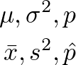
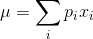
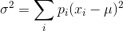
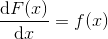
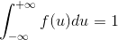
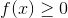
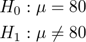
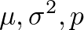

- [Abstract](#abstract)
- [Materials](#materials)
- [Terms](#terms)
  - [모집단 (population)과 표본 (sample)](#%EB%AA%A8%EC%A7%91%EB%8B%A8-population%EA%B3%BC-%ED%91%9C%EB%B3%B8-sample)
  - [일화적증거 (anecdotal evidence)](#%EC%9D%BC%ED%99%94%EC%A0%81%EC%A6%9D%EA%B1%B0-anecdotal-evidence)
  - [응답자그룹 (cohort)](#%EC%9D%91%EB%8B%B5%EC%9E%90%EA%B7%B8%EB%A3%B9-cohort)
  - [결합확률 (joint probability)](#%EA%B2%B0%ED%95%A9%ED%99%95%EB%A5%A0-joint-probability)
  - [조건부확률 (conditional probability)](#%EC%A1%B0%EA%B1%B4%EB%B6%80%ED%99%95%EB%A5%A0-conditional-probability)
  - [독립사건 (independent event)](#%EB%8F%85%EB%A6%BD%EC%82%AC%EA%B1%B4-independent-event)
  - [베이즈 정리 (Bayes' theorem)](#%EB%B2%A0%EC%9D%B4%EC%A6%88-%EC%A0%95%EB%A6%AC-bayes-theorem)
  - [확률변수 (random variable)](#%ED%99%95%EB%A5%A0%EB%B3%80%EC%88%98-random-variable)
  - [확률질량함수 (PMF, Probability Mass Function)](#%ED%99%95%EB%A5%A0%EC%A7%88%EB%9F%89%ED%95%A8%EC%88%98-pmf-probability-mass-function)
  - [평균 (mean)](#%ED%8F%89%EA%B7%A0-mean)
  - [편차 (deviation)](#%ED%8E%B8%EC%B0%A8-deviation)
  - [분산 (variance)](#%EB%B6%84%EC%82%B0-variance)
  - [표준편차 (standard deviation)](#%ED%91%9C%EC%A4%80%ED%8E%B8%EC%B0%A8-standard-deviation)
  - [극단값 (Outlier)](#%EA%B7%B9%EB%8B%A8%EA%B0%92-outlier)
  - [상대위험도 (ralative risk)](#%EC%83%81%EB%8C%80%EC%9C%84%ED%97%98%EB%8F%84-ralative-risk)
  - [최빈값 (mode)](#%EC%B5%9C%EB%B9%88%EA%B0%92-mode)
  - [백분위수 (percentile)](#%EB%B0%B1%EB%B6%84%EC%9C%84%EC%88%98-percentile)
  - [누적분포함수 (CDF, Cumulative Distribution Function)](#%EB%88%84%EC%A0%81%EB%B6%84%ED%8F%AC%ED%95%A8%EC%88%98-cdf-cumulative-distribution-function)
  - [확률밀도함수 (PDF, probability density function)](#%ED%99%95%EB%A5%A0%EB%B0%80%EB%8F%84%ED%95%A8%EC%88%98-pdf-probability-density-function)
  - [통계적 가설검정 (statistical hypothesis testing)](#%ED%86%B5%EA%B3%84%EC%A0%81-%EA%B0%80%EC%84%A4%EA%B2%80%EC%A0%95-statistical-hypothesis-testing)
  - [귀무가설 (null hypothesis)과 대립가설 (antagonistic hypothesis)](#%EA%B7%80%EB%AC%B4%EA%B0%80%EC%84%A4-null-hypothesis%EA%B3%BC-%EB%8C%80%EB%A6%BD%EA%B0%80%EC%84%A4-antagonistic-hypothesis)
  - [검정통계량 (test statistic)](#%EA%B2%80%EC%A0%95%ED%86%B5%EA%B3%84%EB%9F%89-test-statistic)
  - [기각역 (critical region)과 채택역 (acceptance region)](#%EA%B8%B0%EA%B0%81%EC%97%AD-critical-region%EA%B3%BC-%EC%B1%84%ED%83%9D%EC%97%AD-acceptance-region)
  - [상관분석 (correlation analysis)](#%EC%83%81%EA%B4%80%EB%B6%84%EC%84%9D-correlation-analysis)
  - [회귀분석 (regression)](#%ED%9A%8C%EA%B7%80%EB%B6%84%EC%84%9D-regression)

-------------------------------------------------------------------------------

# Abstract

- 개발자가 알아야할 확률 통계지식에 대해 적는다.

# Materials

- [확률 및 통계 - 이상화](http://www.kocw.net/home/search/kemView.do?kemId=1056974)
  - 킹왕짱 강좌
  - [pdf](http://www.kocw.net/home/cview.do?lid=783ed9142748e2dd)
- [CS109: Probability for Computer Scientists](http://web.stanford.edu/class/cs109//)
  - 스탠포드 대학의 통계학 강좌
  - 강의자료가 쓸만함
- [Statistics Harvad @ youtube](https://www.youtube.com/watch?v=KbB0FjPg0mw&list=PL2SOU6wwxB0uwwH80KTQ6ht66KWxbzTIo&index=1)
  - 하버드 대학의 통계학 강좌
- [seeing theory](http://students.brown.edu/seeing-theory/)
  - 브라운 대학교에서 만든 인터랙티브 통계 강좌
- [나부랭이의 수학블로그-통계](http://math7.tistory.com/category/%ED%86%B5%EA%B3%84)
  - 통계를 아주 찰지게 정리한 블로그
- Think Stats 프로그래머를 위한 통계 및 데이터 분석 방법
  - [code](https://github.com/AllenDowney/ThinkStats2)
- [무료수학인강](https://www.youtube.com/channel/UCJDRAlbClO9hdcCjegL1HBw/playlists)
  - 고교 수학을 정리한 동영상
- [45분 만에 정리하는 확률과 통계 개념 강의](https://www.youtube.com/watch?v=IF-YLQ_-SAI)
  - 짧은 시간에 확률과 통계의 개념을 정리했다.
- [생각의질서 확률과통계](http://www.mimacstudy.com/tcher/lctr/lctrDetail.ds?pid=PL00030103)
  - 한석원선생의강좌
- [권세혁](http://wolfpack.hnu.ac.kr/)
  - 권세혁교수의 자료들

# Terms

## 모집단 (population)과 표본 (sample)

- 전국의 성인남자가 2500만명이라고 하자. 이때 성인남자의 평균키를 알고
  싶다. 2500만명을 모두 조사하기에는 시간과 비용이 부족하다. 그래서
  100명만 뽑아서 조사하고 2500만명을 추정해보자. 이때 2500명과 같이
  조사하고자 하는 대상 전체를 모집단이라고 하고 100명과 같이 조사를
  위해 뽑은 대상을 표본 혹은 표본 집단이라고 한다.
- 모집단의 평균, 분산, 비율과 표본집단의 평균, 분산, 비율은 다음과
  같이 구분해서 표현한다.



```latex
\mu, \sigma^{2}, p \\
\bar{x}, s^{2}, \hat{p}
```

## 일화적증거 (anecdotal evidence)

- 공개되지 않고, 일반적으로 개인적 데이터에 바탕을 둔 보고

## 응답자그룹 (cohort)

## 결합확률 (joint probability)

- 사건 A와 B가 동시에 발생할 확률 
- `P(A∩B) or P(A,B)`
  
## 조건부확률 (conditional probability)

- 사건 B가 사실일 경우 사건 A에 대한 확률 
- `P(A|B) = P(A,B) / P(B)`

## 독립사건 (independent event)

- 사건 A와 사건 B의 교집합이 공집합인 경우 A와 B는 서로 독립이라고 한다. 
- `P(A,B) = P(A)P(B)`
- `P(A|B) = P(A,B) / P(B) = P(A)P(B) / P(B) = P(A)`
  
## 베이즈 정리 (Bayes' theorem)

- `P(A|B) = P(B|A)P(A) / P(B)`
- 증명

```
P(A,B) = P(A|B)P(B)
P(A,B) = P(B|A)P(A)
P(A|B)P(B) = P(B|A)P(A)
P(A|B) = P(B|A)P(A) / P(B)
```

## 확률변수 (random variable)

- 표본공간을 수치화 하기위한 변수
- 보통 대문자로 표현한다.
   
```
예) 두개의 동전을 던져서 나타나는 앞면의 개수를 기록해보자.
    
    X       0,    1,    2,  합계
    확률  0.25,  0.5, 0.25,    1

    위와 같은 표를 확률분포표라고 한다.

    동전의 앞면을 H, 동전의 뒷면을 T라고 하자. 표본 공간은
    다음과 같이 정의된다.
    {HH, HT, TH, TT}

    확률변수 X를 정의하기 위해서는 먼저 규칙(두개의 동전을 던져서
    나타나는 앞면의 개수)이 있어야 하고 규칙에 해당하는 값들이
    확률변수 X의 후보들이다.

    특정 확률변수에 대한 확률은 P(X = x_i)혹은 P(x_i)로 표현한다.
    P(X)를 함수로 표현할 수 있다면 그것을 확률질량함수라고 한다.

    위의 경우 확률변수의 개수는 3개다. 확률변수의 개수가 유한하다면
    이산확률분포라고 하고 무한하다면 연속확률분포라고 한다.
```

## 확률질량함수 (PMF, Probability Mass Function)

- 확률변수를 인자로 하고 그 확률변수의 확률을 리턴값으로 표현할 수 있는 함수

```python
n = float(len(t))
pmf = {}
for x, freq in hist.items():
  pmf[x] = freq / n
```

## 평균 (mean)

- 기대값이라고도 한다. 자료의 우수성을 의미한다.



```latex
\mu = \sum_{i} p_{i} x_{i}
```

## 편차 (deviation)

- 확률변수의 값에서 평균을 뺀 것
  
```latex
x_{i} - \mu
```

## 분산 (variance)

- 편차의 제곱의 평균. 자료의 흩어진 정도를 의미한다.
- 자료가 멀리 멀리 떨어져 있을 수록 분산의 값은 크다.



```latex
\sigma^{2} = \sum_{i} p_{i} (x_{i} - \mu)^{2} 
```

## 표준편차 (standard deviation)

- 분산의 제곱근

```latex
\sigma = \sqrt{\sigma^{2}}
```

## 극단값 (Outlier)
  
- 중심경향에서 멀리 떨어져있는 이상값, 특이값

## 상대위험도 (ralative risk)

- 두 분포의 차이를 측정할때 쓰는 두 확률의 비율
- 첫 아이가 출산 예정일 보다 일찍 태어날 확률은 18.2%이다. 첫아이 외에
  다른 아이가 일찍 태어날 확률은 16.8%이다. 이때 상대 위험도는
  1.08이다. 이 것은 첫아이가 출산 예정일보다 일찍 태어날 확률이 8%
  이상된다는 의미이다.

## 최빈값 (mode)

- 표본에서 빈도수가 가장 높은 값

## 백분위수 (percentile)

```python
def PercentileRank(scores, your_score):
  count = 0
  for score in scores:
    if score <= your_score:
      count += 1
  percentile_rank = 100.0 * count / len(scores)
  return percentile_rank

def Percentile(scores, percentile_rank):
  scores.sort()
  for score in scores:
    if PercentileRank(scores, score) >= percentile_rank:
      return score
```

## 누적분포함수 (CDF, Cumulative Distribution Function)

- 확률변수를 인자로 하고 음의 무한대로부터 특정 확률변수까지의
    누적된 확률값을 리턴하는 함수
- `F(x) = P({X < x}) = P(X < x)`

```python
def Cdf(t, x):
  count = 0.0
  for value in t:
    if value <= x:
      count += 1.0
  prob = count / len(t)
  return prob
```

## 확률밀도함수 (PDF, probability density function) 

- 확률변수를 인자로 하고 특정 확률변수에 대해 누적분포함수값의
  기울기를 리턴하는 함수
- 확률 밀도 함수는 특정 확률 변수 구간의 확률이 다른 구간에 비해
  상대적으로 얼마나 높은가를 나타내는 것이며 그 값 자체가 확률은
  아니다라는 점을 명심해야 한다.
- F(x)를 CDF라고 하고 f(x)를 PDF라고 하자.



```latex
\frac{\mathrm{d} F(x)}{\mathrm{d} x} = f(x)
```


```latex
F(x) = \int_{-\infty}^{x} f(u) du
```



```latex
\int_{-\infty}^{+\infty} f(u) du = 1
```



```latex
f(x) \geq 0
```

## 통계적 가설검정 (statistical hypothesis testing)

- 모집단에서 표본을 추출하여 표본 통계량을 이용해서 "모집단은 이럴
  것이다."라는 가설을 검정하는 것이다. 
- 하나의 가설이 만들어 지면 그것의 불완전성 때문에 새로운 가설이
  만들어 질 수 있고 현재의 가설은 새로운 가설에 의해 대체되기도 한다.

## 귀무가설 (null hypothesis)과 대립가설 (antagonistic hypothesis)

- 귀무가설은 모집단을 검정하기 위해 만들어낸 현재의 가설이다.
- 대립가설은 귀무가설을 대체할 수 있는 새로운 가설이다.
- 귀무가설과 대립가설은 중복됨이 없이 정반대여야 하다. 귀무가설이 =,
  ≤, ≥ 으로 표현된다면 각각에 대해 대립가설은 ≠, >, < 으로
  표현한다.
- 예) 인간의 평균수명이 80년이라고 하자. 실제로 그러한지 검정하고
  싶다. 이때 귀무가설은 "인간의 평균수명은 80년이다."이고 대립가설은
  "인간의 평균수명은 80년이 아니다."이다. 그리고 기호를 통해서 다음과
  같이 표현한다.



```latex
H_{0} : \mu = 80 \\
H_{1} : \mu \neq 80
```

## 검정통계량 (test statistic)

- "모집단의 모수가 이럴 것이다."라는 가설을 다루기 위해
  모수(popluation parameter)인 평균, 분산, 비율을 이용하여 귀무가설과
  대립가설을 설정한다. 하지만 모수를 사용할 수 없다. 워낙에 모집단이
  크기 때문에 시간과 비용이 너무 많이 소모된다. 그래서 통계에서는
  표본을 뽑아 표본통계량으로 계산을 한다. 이 표본통계량을
  가설검정에서는 검정통계량이라고 부른다.
  


- 검정통계량(표본통계량)은 정규분포, t분포, x^2분포, F분포를 활용한다.

## 기각역 (critical region)과 채택역 (acceptance region)

- 귀무가설, 대립가설과 같이 두개의 가설이 있을때 귀무가설이 탈락하면
  대립가설이 채택되는 것이다. 귀무가설이 더 옳은데도 귀무가설을
  탈락시키는 확률을 보통 α라고 한다. 유의수준이라고도 한다. 1 - α는
  채택역(acceptance region)이라고 한다.

## 상관분석 (correlation analysis)

- 두개의 변수 x, y가 있다고 해보자. 두 변수가 어떠한 관계에 있는지
  파악하는 분석이 상관분석이다. 예를 들면 키(x)가 클루록 몸무게(y)가
  크다.
- 두 확률변수가 양의 상관 관계, 음의 상관 관계 혹은 상관 관계가 없을
  수 있다.

## 회귀분석 (regression)

- 표본의 데이터들이 일정한 패턴을 이루고 있다면 이 패턴을 활용해서
  무엇인가를 예측하는 분석이 회귀분석이다. "학생이 소유한 책이 x권이면
  종합점수가 y이다."의 경우를 살펴보자. 일정한 패턴을 찾아봤더니 y =
  50 + 30x가 되었다고 하자. 그러면 5권의 책을 가지고 있다면 종합점수는
  200점이라고 예측 할 수 있다.
- 회귀분석에서 새로운 표본을 뽑았을 때, 이 표본은 전혀 별개의 것이
  아니라 평균으로 돌아가려는 특성이 있다. 그래서 이름이
  "회귀"분석이다. 회귀분석이라는 이름은 이상하다.
- 회귀분석으로 예측하기 위해서는 공식을 잘 만들어내야 한다. 이 공식을
  회귀식이라고 한다.
