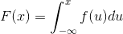

# Abstract

- 개발자가 알아야할 확률 통계지식에 대해 적는다.

# Material

- [나부랭이의 수학블로그-통계](http://math7.tistory.com/category/%ED%86%B5%EA%B3%84)
  - 통계를 아주 찰지게 정리한 블로그
- Think Stats 프로그래머를 위한 통계 및 데이터 분석 방법
  - [code](https://github.com/AllenDowney/ThinkStats2)
- [무료수학인강](https://www.youtube.com/channel/UCJDRAlbClO9hdcCjegL1HBw/playlists)
  - 고교 수학을 정리한 동영상
- [45분 만에 정리하는 확률과 통계 개념 강의](https://www.youtube.com/watch?v=IF-YLQ_-SAI)
  - 짧은 시간에 확률과 통계의 개념을 정리했다.
- [생각의질서 확률과통계](http://www.mimacstudy.com/tcher/lctr/lctrDetail.ds?pid=PL00030103)
  - 한석원선생의강좌
- [권세혁](http://wolfpack.hnu.ac.kr/)
  - 권세혁교수의 자료들

# Terms

## 일화적증거 anecdotal evidence

- 공개되지 않고, 일반적으로 개인적 데이터에 바탕을 둔 보고

## 응답자그룹 cohort

## joint probability 결합확률

- 사건 A와 B가 동시에 발생할 확률 
- `P(A∩B) or P(A,B)`
  
## conditional probability 조건부확률

- 사건 B가 사실일 경우 사건 A에 대한 확률 
- `P(A|B) = P(A,B) / P(B)`

## independent event 독립사건

- 사건 A와 사건 B의 교집합이 공집합인 경우 A와 B는 서로 독립이라고 한다. 
- `P(A,B) = P(A)P(B)`
- `P(A|B) = P(A,B) / P(B) = P(A)P(B) / P(B) = P(A)`
  
## Bayes' theorem 베이즈 정리

- `P(A|B) = P(B|A)P(A) / P(B)`
- 증명

```
P(A,B) = P(A|B)P(B)
P(A,B) = P(B|A)P(A)
P(A|B)P(B) = P(B|A)P(A)
P(A|B) = P(B|A)P(A) / P(B)
```

## random variable 확률변수

- 표본공간을 수치화 하기위한 변수
- 보통 대문자로 표현한다.
   
```
예) 두개의 동전을 던져서 나타나는 앞면의 개수를 기록해보자.
    
    X       0,    1,    2,  합계
    확률  0.25,  0.5, 0.25,    1

    위와 같은 표를 확률분포표라고 한다.

    동전의 앞면을 H, 동전의 뒷면을 T라고 하자. 표본 공간은
    다음과 같이 정의된다.
    {HH, HT, TH, TT}

    확률변수 X를 정의하기 위해서는 먼저 규칙(두개의 동전을 던져서
    나타나는 앞면의 개수)이 있어야 하고 규칙에 해당하는 값들이
    확률변수 X의 후보들이다.

    특정 확률변수에 대한 확률은 P(X = x_i)혹은 P(x_i)로 표현한다.
    P(X)를 함수로 표현할 수 있다면 그것을 확률질량함수라고 한다.

    위의 경우 확률변수의 개수는 3개다. 확률변수의 개수가 유한하다면
    이산확률분포라고 하고무한하다면 연속확률분포라고 한다.
```

## 확률질량함수 Probability Mass Function, PMF

- 확률변수를 인자로 하고 그 확률변수의 확률을 리턴값으로 표현할 수 있는 함수

```python
n = float(len(t))
pmf = {}
for x, freq in hist.items():
  pmf[x] = freq / n
```

## mean 평균

- 기대값이라고도 한다. 자료의 우수성을 의미한다.

```latex
\mu = \sum_{i} p_{i} x_{i}
```


## deviation 편차

- 확률변수의 값에서 평균을 뺀 것
  
```latex
x_{i} - \mu
```

## variance 분산

- 편차의 제곱의 평균. 자료의 흩어진 정도를 의미한다.
- 자료가 멀리 멀리 떨어져 있을 수록 분산의 값은 크다.

```latex
\sigma^{2} = \sum_{i} p_{i} (x_{i} - \mu)^{2} 

```


## standard deviation 표준편차

- 분산의 제곱근

```latex
\sigma = \sqrt{\sigma^{2}}
```

## 극단값 Outlier
  
- 중심경향에서 멀리 떨어져있는 이상값, 특이값

## 상대위험도 ralative risk

- 두 분포의 차이를 측정할때 쓰는 두 확률의 비율

- 첫 아이가 출산 예정일 보다 일찍 태어날 확률은 18.2%이다. 첫아이 외에
  다른 아이가 일찍 태어날 확률은 16.8%이다. 이때 상대 위험도는
  1.08이다. 이 것은 첫아이가 출산 예정일보다 일찍 태어날 확률이 8%
  이상된다는 의미이다.

## 최빈값 mode

- 표본에서 빈도수가 가장 높은 값

## 백분위수 percentile

```python
def PercentileRank(scores, your_score):
  count = 0
  for score in scores:
    if score <= your_score:
      count += 1
  percentile_rank = 100.0 * count / len(scores)
  return percentile_rank

def Percentile(scores, percentile_rank):
  scores.sort()
  for score in scores:
    if PercentileRank(scores, score) >= percentile_rank:
      return score
```

## 누적분포함수 Cumulative Distribution Function, CDF

- 확률변수를 인자로 하고 음의 무한대로부터 특정 확률변수까지의
    누적된 확률값을 리턴하는 함수
- `F(x) = P({X < x}) = P(X < x)`

```python
def Cdf(t, x):
  count = 0.0
  for value in t:
    if value <= x:
      count += 1.0
  prob = count / len(t)
  return prob
```

## PDF(probability density function) 확률밀도함수

- 확률변수를 인자로 하고 특정 확률변수에 대해 누적분포함수값의
  기울기를 리턴하는 함수
- 확률 밀도 함수는 특정 확률 변수 구간의 확률이 다른 구간에 비해
  상대적으로 얼마나 높은가를 나타내는 것이며 그 값 자체가 확률은
  아니다라는 점을 명심해야 한다.
- F(x)를 CDF라고 하고 f(x)를 PDF라고 하자.

```latex
\frac{\mathrm{d} F(x)}{\mathrm{d} x} = f(x)
```


```latex
F(x) = \int_{-\infty}^{x} f(u) du
```



```latex
\int_{-\infty}^{+\infty} f(u) du = 1
```


```latex
f(x) \geq 0
```


## 통계적 가설검정

- 

## 귀무가설(null hypothesis)과 대립가설

- 귀무가설은 모집단을 검정하기 위해 만들어낸 현재의 가설이다.
- 대립가설은 귀무가설을 대체할 수 있는 새로운 가설이다.
- 귀무가설과 대립가설은 중복됨이 없이 정반대여야 하다.
- 예) 
