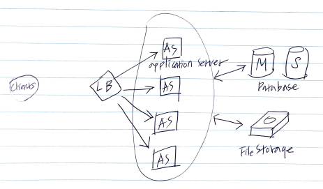
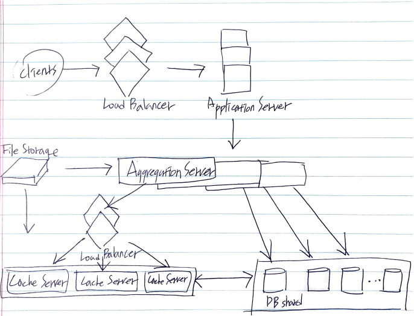

- [Requirements and Goals of the System](#Requirements-and-Goals-of-the-System)
- [Capacity Estimation and Contraints](#Capacity-Estimation-and-Contraints)
- [System APIs](#System-APIs)
- [High Level System Design](#High-Level-System-Design)
- [Database Schema](#Database-Schema)
- [Data Sharding](#Data-Sharding)
- [Cache](#Cache)
- [TimelineGeneration](#TimelineGeneration)
- [Replication and Fault Tolerance](#Replication-and-Fault-Tolerance)
- [Load Balancing](#Load-Balancing)
- [Monitoring](#Monitoring)
- [Extended Requirements](#Extended-Requirements)

-----

# Requirements and Goals of the System

* Functional Requirements
  * 유저는 새로운 트윗을 작성할 수 있다.
  * 유저는 다른 유저를 팔로우할 수 있다.
  * 유저는 트윗를 북마크할 수 있다.
  * 서비스는 유저의 타임라인을 생성할 수 있다.
  * 서비스는 유저가 팔로우하는 사람들의 탑 트윗들을 보여줄 수 있다.
  * 트윗은 사진과 동영상도 포함시킬 수 있다.

* Non-functional Requirements
  * highly available
  * 200 ms 안에 타임라인을 생성해야 한다.

* Extended Requirements

  * Searching for tweets.
  * Replying to a tweet.
  * Trending topics – current hot topics/searches.
  * Tagging other users.
  * Tweet Notification.
  * Who to follow? Suggestions?
  * Moments.

# Capacity Estimation and Contraints

* `1 B` total users, `200 M` DAU. `100 M` new tweets every day   and on average each user follows `200` people
* How many favorites per day?
  * each user favorites five tweets per day
  * `200 M users * 5 favorites = 1 B favorites`
* How many total tweet-views will our system generate?
  * a user visits their timeline two times a day and visits five other people's pages. on each page if a user sees `20` tweets.
  * `200 M DAU * ((2 + 5) * 20 tweets) = 28 B / day`
* Storage Estimates
  * 140 characters, 30 bytes to store metadata with each tweet (ID, timestamp, user ID, etc...)
  * `100 M * (280 + 30) bytes = 30 GB / day`
  * average a photo is `200 KB`, a video is `2 MB`
  * `(100 M / 5 photos * 200KB) + (100 M / 10 videos * 2 MB) = 24 TB / day`
* Bandwidth Estimates
  * total ingress `24 TB / day` this would translate into `290 MB / sec`
  * total egress
  * `(28 B * 280 bytes) / 86400s of text = 93 MB / s`
  * `(28 B * 200 KB) / 86400s of photos = 13 GB / s`
  * `(28 B / 10 / 3 * 2 MB) / 86400s of videos = 22 GB / s`
  * `total = 35 GB / s`

# System APIs

```c
tweet(api_dev_key, 
  tweet_data, 
  tweet_location, 
  user_location,
  media_ids,
  maximum_results_to_return)

parameters:
returns: url to access that tweet  
```

# High Level System Design

`1000 M / 86400s = 1150 tweets / sec` write, `28 B / 86400s = 325K twees / sec` read. read-heavy system

write load is `100 M tweets`, read load is `28 B tweets`.
receive 1160 new tweets and 325 K read requrests per sec.



# Database Schema

|  | Table |  |
|:-|:------|:-|
|  | **Tweet**  |  |
| PK | TweetID | int | 
| | UserID | int |
| | TweetLatitude | int |
| | TweetLongitude | int |
| | UserLatitude | int |
| | USerLongitude | int |
| | CreationDate | DateTime |
| | NumFavorites | int |
| | | |
|  | **User**  |  |
| PK | UserID | int |
| | Name | varchar(20) |
| | Email | varchar(32) |
| | DateOfBirth | DateTime |
| | CreationDate | DateTime |
| | LastLogin | DateTime |
| | | |
|  | **UserFollow**  |  |
| PK | UserID1 | int |
| PK | UserID2 | int |
| | | |
|  | **UserFollow**  |  |
| PK | TweetID | int |
| PK | UserID | int |
| | CreationDate | DateTime |

# Data Sharding

* Sharding based on UserID
* Sharding based on TweetID
* Sharding based on Tweet creation time
* What if we can combine sharding by TweetID and Tweet creation time
  
# Cache

* Which cache replacement policy would best fit our needs?
  * LRU
* How can we have a more intelligent cache? 
  * 80-20 rule, 20 % of tweets generating 80 % of read traffic
* What if we cache the latest data?

# TimelineGeneration

[Designing Facebook’s Newsfeed](DesigningFacebooksNewsfeed.md)

# Replication and Fault Tolerance

read replication because of read-heavy and fault tolerance because of replication.

# Load Balancing

* Between Clients and Application Servers
* Between Application servers and database replication servers
* Between Aggregation servers and Cache server



# Monitoring
  
* New tweets per day/second, what is the daily peak?
* Timeline delivery stats, how many tweets per day/second our service is delivering.
* Average latency that is seen by the user to refresh timeline.

# Extended Requirements

* How do we serve feeds? 
* Retweet
* Trending Topics
* Who to follow? How to give suggestions? 
* Moments
* Search
  * [Designing Twitter Search](DesigningTwitterSearch.md)

