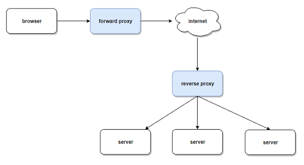

- [Abstract](#abstract)
- [References](#references)
- [Materials](#materials)
- [Prerequisites](#prerequisites)
- [Principles](#principles)
  - [How to approach a system design interview question](#how-to-approach-a-system-design-interview-question)
  - [Distributed System](#distributed-system)
  - [Scalability](#scalability)
  - [Performance vs scalability](#performance-vs-scalability)
  - [Latency vs throughput](#latency-vs-throughput)
  - [Availability vs consistency](#availability-vs-consistency)
    - [CAP (Consistency Availability Partition tolerance)](#cap-consistency-availability-partition-tolerance)
    - [PACELC (Partitioning Availability Consistency Else Latency Consistency)](#pacelc-partitioning-availability-consistency-else-latency-consistency)
  - [Consistency patterns](#consistency-patterns)
  - [Availability patterns](#availability-patterns)
  - [Domain name system](#domain-name-system)
  - [Content delivery network](#content-delivery-network)
  - [Load balancer](#load-balancer)
  - [Reverse proxy](#reverse-proxy)
  - [Application layer](#application-layer)
    - [Service Mesh](#service-mesh)
    - [Service discovery](#service-discovery)
  - [Database](#database)
  - [Cache](#cache)
  - [Asynchronism](#asynchronism)
  - [Communication](#communication)
    - [TCP](#tcp)
    - [UDP](#udp)
    - [RPC](#rpc)
    - [REST (REpresentational State Transfer) API](#rest-representational-state-transfer-api)
    - [RPC VS REST](#rpc-vs-rest)
    - [HTTP 1.x vs HTTP 2.0](#http-1x-vs-http-20)
  - [Security](#security)
    - [WAF (Web Application Fairewall)](#waf-web-application-fairewall)
    - [XSS (Cross Site Scripting)](#xss-cross-site-scripting)
    - [CSRF (Cross Site Request Forgery)](#csrf-cross-site-request-forgery)
    - [XSS vs CSRF](#xss-vs-csrf)
    - [CORS (Cross Origin Resource Sharing)](#cors-cross-origin-resource-sharing)
  - [Database Primary Key](#database-primary-key)
  - [Idempotency](#idempotency)
  - [80/20 rule](#8020-rule)
  - [70% Capacity model](#70-capacity-model)
  - [SLA, SLO, SLI](#sla-slo-sli)
  - [Optimistic Lock vs Pessimistic Lock](#optimistic-lock-vs-pessimistic-lock)
- [System Design Interview](#system-design-interview)
  - [Fundamentals](#fundamentals)
  - [Design Practices](#design-practices)
- [System Design Primer Practices](#system-design-primer-practices)
- [Essential Micro Services](#essential-micro-services)
- [Additional System Design Interview Questions](#additional-system-design-interview-questions)
- [Real World Architecture](#real-world-architecture)
- [Company Architectures](#company-architectures)
- [company engineering blog](#company-engineering-blog)
- [MSA (Micro Service Architecture)](#msa-micro-service-architecture)
- [Cloud Design Patterns](#cloud-design-patterns)
- [DDD](#ddd)
- [Cracking The Coding Interview Quiz](#cracking-the-coding-interview-quiz)

----

# Abstract

- 시스템 디자인에 대해 적어본다. [system deisgn primer](https://github.com/donnemartin/system-design-primer#federation)
  이 너무 잘 정리 되 있어서 기억할 만한 주제들을 열거해 본다.

<p align="center">
  
  <br/>
</p>

# References

* [cloudcraft](https://cloudcraft.co/app)
  * aws architcture diagram tool
* [draw.io](https://www.draw.io/)
  * architecture 를 포함한 다양한 diagram tool
* [webwhiteboard](https://www.webwhiteboard.com/)
  * web white board for system design interview 

# Materials

* [A pattern language for microservices](https://microservices.io/patterns/index.html)
  - microservices 의 기본개념
  - [src](https://github.com/gilbutITbook/007035) 
* [system deisgn primer](https://github.com/donnemartin/system-design-primer#federation)
  - 킹왕짱 내가 다시 정리할 필요성을 못 느낀다.
* [Grokking the System Design Interview](https://www.educative.io/collection/5668639101419520/5649050225344512)
  - 유료 시스템 디자인 인터뷰
* [Grokking the Object Oriented Design Interview](https://www.educative.io/collection/5668639101419520/5692201761767424)
  - 유료 OOD 인터뷰 
* [Here are some of the favorite posts on HighScalability...](http://highscalability.com/all-time-favorites/)
  * great case studies
* [FullStack cafe](https://www.fullstack.cafe/)
* [AWS @ TIL](/aws/README.md)
* [Mastering Chaos - A Netflix Guide to Microservices](https://www.youtube.com/watch?v=CZ3wIuvmHeM)
* [cracking the coding interview](http://www.crackingthecodinginterview.com/)
* [Designing Data-Intensive Applications](https://dataintensive.net/)
- [Azure Cloud Patterns](https://docs.microsoft.com/en-us/azure/architecture/patterns/)
  - [infographic](https://techcommunity.microsoft.com/t5/educator-developer-blog/getting-started-with-azure-design-patterns-and-azure-arm-quick/ba-p/378609?lightbox-message-images-378609=94372i2134F7E89D8BF452)
- [AWS Architect](https://aws.amazon.com/ko/architecture/)
- [GCP Solutions](https://cloud.google.com/solutions/)

# Prerequisites

- Numbers
  - [Names of large numbers](https://en.wikipedia.org/wiki/Names_of_large_numbers)
  - [SI 기본 단위](https://ko.wikipedia.org/wiki/SI_%EA%B8%B0%EB%B3%B8_%EB%8B%A8%EC%9C%84)
  - SI 는 System International 의 줄임말로 국제 단위
  
| Value | short-scale | SI-symbol | SI-prefix |
| ----- | ----------- | --------- | --------- |
| 10^3  | Thousand    | K         | Killo-    |
| 10^6  | Million     | M         | Mega-     |
| 10^9  | Trillion    | G         | Giga-     |
| 10^12 | Quadrillion | T         | Tera-     |
| 10^15 | Quintillion | P         | Peta-     |
| 10^18 | Sextillion  | E         | Exa-      |
| 10^21 | Septillion  | Z         | Zeta-     |
| 10^24 | Octillion   | Y         | Yota-     |

- powers of two table

```
Power           Exact Value         Approx Value        Bytes
---------------------------------------------------------------
7                             128
8                             256
10                           1024   1 thousand           1 KB
16                         65,536                       64 KB
20                      1,048,576   1 million            1 MB
30                  1,073,741,824   1 billion            1 GB
32                  4,294,967,296                        4 GB
40              1,099,511,627,776   1 trillion           1 TB
```

- latency numbers every programmer should know

```
Latency Comparison Numbers
--------------------------
L1 cache reference                           0.5 ns
Branch mispredict                            5   ns
L2 cache reference                           7   ns                      14x L1 cache
Mutex lock/unlock                          100   ns
Main memory reference                      100   ns                      20x L2 cache, 200x L1 cache
Compress 1K bytes with Zippy            10,000   ns       10 us
Send 1 KB bytes over 1 Gbps network     10,000   ns       10 us
Read 4 KB randomly from SSD*           150,000   ns      150 us          ~1GB/sec SSD
Read 1 MB sequentially from memory     250,000   ns      250 us
Round trip within same datacenter      500,000   ns      500 us
Read 1 MB sequentially from SSD*     1,000,000   ns    1,000 us    1 ms  ~1GB/sec SSD, 4X memory
Disk seek                           10,000,000   ns   10,000 us   10 ms  20x datacenter roundtrip
Read 1 MB sequentially from 1 Gbps  10,000,000   ns   10,000 us   10 ms  40x memory, 10X SSD
Read 1 MB sequentially from disk    30,000,000   ns   30,000 us   30 ms 120x memory, 30X SSD
Send packet CA->Netherlands->CA    150,000,000   ns  150,000 us  150 ms

Notes
-----
1 ns = 10^-9 seconds
1 us = 10^-6 seconds = 1,000 ns
1 ms = 10^-3 seconds = 1,000 us = 1,000,000 ns
```


- time

| years | days | hours |    mins |       secs |
| ----: | ---: | ----: | ------: | ---------: |
|     1 |  365 | 8,760 | 525,600 | 31,536,000 |
|       |    1 |    24 |   1,440 |     86,400 |
|       |      |     1 |      60 |      3,600 |
|       |      |       |       1 |         60 |

# Principles

## How to approach a system design interview question

* Outline use cases, constraints, and assumptions
* Create a high level design
* Design core components
* Scale the design

## Distributed System

* [Distributed System](/distributedsystem/README.md)

## Scalability

- vertical scaling
- horizontal scaling
- caching
- load balancing
- database replication
- database partitioning
- asynchronism

## Performance vs scalability

performance 의 문제가 있다면 single user 가 느린 시스템을 경험할 것이다. scalability 의 문제가 있다면 single user 가 빠른 시스템을 경험할 지라도 multi user 는 느린 시스템을 경험할 수 있다???

## Latency vs throughput

Latency 는 어떤 action 을 수행하고 결과를 도출하는데 걸리는 시간이다. Throughput 은 단위 시간당 수행하는 액션 혹은 결과의 수이다.

## Availability vs consistency

### CAP (Consistency Availability Partition tolerance)

* [CAP Theorem @ medium](https://medium.com/system-design-blog/cap-theorem-1455ce5fc0a0)

----


Brewer's theorem 이라고도 한다. Distributed System 은 Consistency, Availability, Partition tolerance 중 3 가지 모두 만족할 수 없다. 2 가지만을 선택해야 한다.

* Consistency
  * 모든 클라이언트는 같은 데이터를 읽는다.
* Availability
  * 서버 노드중 일부가 고장나도 서비스의 지장이 없다.
* Partition tolerance
  * 노드들 끼리 전송하는 네트워크 패킷이 유실되거나 지연되더라도 서비스의 지장이 없다.

### PACELC (Partitioning Availability Consistency Else Latency Consistency)

* [CAP Theorem, 오해와 진실](http://eincs.com/2013/07/misleading-and-truth-of-cap-theorem/)

----


시스템이 Partitioning 상황 즉 네트워크 장애 상황일 때는 Availability 혹은 Consistency 중 하나를 추구하고 일반적인 상황일 때는 Latency 혹은 Consistency 중 하나를 추구하라는 이론이다. 

이것을 다시 한번 풀어보면 이렇다. 네트워크 장애 상황일 때 클라이언트는 일관성은 떨어져도 좋으니 일단 데이터를 받겠다 혹은 일관성있는 데이터 아니면 에러를 받겠다는 말이다. 네트워크 장애가 아닌 보통의 상황일 때 클라이언트는 일관성은 떨어져도 빨리 받겠다 혹은 일관성있는 데이터 아니면 늦게 받겠다는 말이다.

* HBase 는 PC/EC 이다. 네트워크 장애상황일 때 무조건 일관성있는 데이터를 보내고 보통의 상황일 때도 무조건 일관성있는 데이터를 보낸다. 한마디로 일관성 성애자이다.
* Cassandra 는 PA/EL 이다. 일관성은 별로 중요하지 않다. 네트워크 장애상황일 때 일관성은 떨어져도 데이터를 일단 보낸다. 보통의 상황일 때 역시 일관성은 떨어져도 좋으니 일단 빨리 데이터를 보낸다.

## Consistency patterns

* Weak consistency
  * write operation 후에 그 값을 read 할 수 있다고 장담할 수 없다.
  * memcached 가 해당된다.
* Eventual consistency
  * write operation 후에 시간이 걸리기는 하지만 그 값을 read 할 수 있다.
  * DNS, email 이 해당된다.
* Strong consistency
  * write operation 후에 그 값을 바로 read 할 수 있다.
  * RDBMS

## Availability patterns

* Fail-over
  * Active-passive
    * LB 가 active 와 passive 를 health check 한다. acitve 에 장애가 발생하면 passive 를 active 시킨다.
  * Active-active
    * active 를 여러개 운용하기 때문에 load 가 분산된다. DNS 가 모든 active 의 IP 를 알아야할 수도 있다.
* Disadvanges of Fail-over 
  * Active 가 passive 에 data 를 replication 하기 전에 장애가 발생하면 일부 data 를 유실할 수 있다.
* Replication
  * Master-slave replication
  * Master-master replication
* Availabilty in numbers
  * availability 는 uptime 혹은 downtime 을 percent 단위로 표현된다. 예를 들어 99.9% (three 9s) 혹은 99.99% (four 9s) 등으로 표기한다.

* 99.9% availability - three 9s

| Duration           | Acceptable downtime |
| ------------------ | ------------------- |
| Downtime per year  | 8h 45min 57s        |
| Downtime per month | 43m 49.7s           |
| Downtime per week  | 10m 4.8s            |
| Downtime per day   | 1m 26.4s            |

* 99.99% availability - four 9s

| Duration           | Acceptable downtime |
| ------------------ | ------------------- |
| Downtime per year  | 52min 35.7s         |
| Downtime per month | 4m 23s              |
| Downtime per week  | 1m 5s               |
| Downtime per day   | 8.6s                |

## Domain name system

<p align="center">
  
  <br/>
  <i><a href=http://www.slideshare.net/srikrupa5/dns-security-presentation-issa>Source: DNS security presentation</a></i>
</p>

사람이 읽을 수 있는 domain name 을 기계가 이해할 수 있는 IP address 로 번역하는 시스템이다.

* **NS record (name server)** - Specifies the DNS servers for your domain/subdomain.
* **MX record (mail exchange)** - Specifies the mail servers for accepting messages.
* **A record (address)** - Points a name to an IP address.
* **CNAME (canonical)** - Points a name to another name or `CNAME` (example.com to www.example.com) or to an `A` record.

| name      | type  | value      |
| --------- | ----- | ---------- |
| a.foo.com | A     | 192.1.1.15 |
| b.foo.com | CNAME | a.foo.com  |

* [Online DNS Record Viewer](http://dns-record-viewer.online-domain-tools.com/)

## Content delivery network

<p align="center">
  
  <br/>
  <i><a href=https://www.creative-artworks.eu/why-use-a-content-delivery-network-cdn/>Source: Why use a CDN</a></i>
</p>

* Push CDNs
* Pull CDNs

## Load balancer

<p align="center">
  
  <br/>
  <i><a href=http://horicky.blogspot.com/2010/10/scalable-system-design-patterns.html>Source: Scalable system design patterns</a></i>
</p>

* Active-passive
* Active-active
* Layer 4 load balancing
* Layer 7 load balancing
* Horizontal scaling

## Reverse proxy

* [Apache2 설치 (Ubuntu 16.04)](https://lng1982.tistory.com/288)
  
-----

<p align="center">
  
  <br/>
  <i><a href=https://upload.wikimedia.org/wikipedia/commons/6/67/Reverse_proxy_h2g2bob.svg>Source: Wikipedia</a></i>
  <br/>
</p>



forward proxy 는 HTTP req 를 인터넷에 전달한다. reverse proxy 는 HTTP 를 요청을 인터넷으로부터 HTTP req 를 받아서 back-end 서버들에게 전달한다. L4, L7 스위치도 reverse proxy 라고 할 수 있다. reverse 라는 말은 왜 사용되었을까???

nginx, haproxy 와 같은 `reverse proxy` 는 `L7` 에서 `load balaning` 혹은 `SPOF (single point failure)` 를 위해 사용된다.

## Application layer

<p align="center">
  
  <br/>
  <i><a href=http://lethain.com/introduction-to-architecting-systems-for-scale/#platform_layer>Source: Intro to architecting systems for scale</a></i>
</p>

서비스의 성격에 따라 layer 를 두면 SPOF (Single Point of Failure) 를 해결할 수 있다.

### Service Mesh

* [서비스 메쉬란 무엇일까요?](https://www.redhat.com/ko/topics/microservices/what-is-a-service-mesh)

Service Mesh 는 MSA 를 위한 기술중 하나이다. network 부분을 담당하고 sidecar proxy 와 함께 구현된다.

### Service discovery

* service 의 ip, port 등을 등록하고 살아있는지 확인할 수 있다.
* consul, etcd, zookeepr 가 해당된다.

## Database

<p align="center">
  
  <br/>
  <i><a href=https://www.youtube.com/watch?v=w95murBkYmU>Source: Scaling up to your first 10 million users</a></i>
</p>

* RDBMS
  * ACID - set of properties of relational database transactions
    * Atomicity(원자성) - Each transaction is all or nothing
    * Consistency(일관성) - Any transaction will bring the database from one valid state to another
    * Isolation(고립성) - Executing transactions concurrently has the same results as if the transactions were executed serially
    * Durability(영속성) - Once a transaction has been committed, it will remain so.
  * Master-slave replication
  * Master-Master replication
* Federation
  * 수직분할 이라고도 한다. 테이블별로 partitioning 한다.

<p align="center">
  
  <br/>
  <i><a href=https://www.youtube.com/watch?v=w95murBkYmU>Source: Scaling up to your first 10 million users</a></i>
</p>

* Sharding
  * 수평분할 이라고도 한다. 하나의 테이블을 레코드별로 partitioning 한다.
  * [consistent hashing @ TIL](/consistenthasing/README.md)

<p align="center">
  
  <br/>
  <i><a href=http://www.slideshare.net/jboner/scalability-availability-stability-patterns/>Source: Scalability, availability, stability, patterns</a></i>
</p>

* Denormalization
  * [normalization @ TIL](/normalization/README.md)
* SQL Tuning
* NoSQL
  * Key-value store
  * Document store
  * Wide solumn store
  * Graph database
* Schema Design
  * Document DB (embedded data model, normalized data model)
    * Schema Design in MongoDB vs Schema Design in MySQL](https://www.percona.com/blog/2013/08/01/schema-design-in-mongodb-vs-schema-design-in-mysql/)

## Cache

<p align="center">
  
  <br/>
  <i><a href=http://horicky.blogspot.com/2010/10/scalable-system-design-patterns.html>Source: Scalable system design patterns</a></i>
</p>

* Client caching
* CDN caching
* Web server caching
* Database caching
* Application caching
* Caching at the database query level
* CAching at the object level
* When to update the cache
  * Cache-Aside
    * 응용프로그램이 직접 cache를 제어한다.

      ```python
      # reading values
      v = cache.get(k)
      if (v == null) {
        v = sor.get(k)
        cache.put(k, v)
      }

      # writing values
      v = newV
      sor.put(k, v)
      cache.put(k, v)
      ```
  * Read-through
    * `cache` 에 읽기 요청하면 `cache` 가 판단해서 자신이 가지고 있는 값 혹은
      `SOR(system of record)` 로 부터 읽어들인 값을 응답으로 전달한다.
  
  * Write-through
    * `cache` 에 쓰기 요청하면 `cache` 가 판단해서 `SOR(system of record)` 에
      쓰고 자신을 갱신한다.

  * Write-behind
    * `cache` 에 쓰기 요청하면 일단 자신을 갱신하고 요청에 응답한후
      `SOR` 을 갱신한다. `SOR` 갱신이 완료되기 전에 요청에 빠르게 응답한다.

## Asynchronism

<p align="center">
  
  <br/>
  <i><a href=http://lethain.com/introduction-to-architecting-systems-for-scale/#platform_layer>Source: Intro to architecting systems for scale</a></i>
</p>

* Message Queues
  * Redis, RabbitMQ, Amazon SQS
* Task Queues
  * Celery
* Back pressure
  * MQ 가 바쁘면 client 에게 503 Service Unavailable 을 줘서 시스템의 성능저하를 예방한다. 일종의 circuit breaker 같다.

## Communication

* [network @ TIL](/network/README.md)

----

### TCP

TODO

### UDP

TODO

### RPC

TODO

### REST (REpresentational State Transfer) API 

* [1) Rest API란? @ edwith](https://www.edwith.org/boostcourse-web/lecture/16740/)
* [HTTP 응답코드 메소드 정리 GET, POST, PUT, PATCH, DELETE, TRACE, OPTIONS](https://javaplant.tistory.com/18)

----

2000 년도에 로이 필딩 (Roy Fielding) 의 박사학위 논문에서 최초로 소개되었다. REST 형식의 API 를 말한다.

로이 필딩은 현재 공개된 REST API 라고 불리우는 것은 대부분 REST API 가 아니다라고 말한다. REST API 는 다음과 같은 것들을 포함해야 한다고 한다.

* client-server
* stateless
* cache
* uniform interface
* layered system
* code-on-demand (optional)

HTTP 를 사용하면 uniform interface 를 제외하고는 모두 만족 한다. uniform interface 는 다음을 포함한다.

* 리소스가 URI로 식별되야 합니다.
* 리소스를 생성,수정,추가하고자 할 때 HTTP메시지에 표현을 해서 전송해야 합니다.
* 메시지는 스스로 설명할 수 있어야 합니다. (Self-descriptive message)
* 애플리케이션의 상태는 Hyperlink를 이용해 전이되야 합니다.(HATEOAS)

위의 두가지는 이미 만족하지만 나머지 두가지는 HTTP 로 구현하기 어렵다. 예를 들어 HTTP BODY 에 JSON 을 포함했을 때 HTTP message 스스로 body 의 내용을 설명하기란 어렵다. 그리고 웹 게시판을 사용할 때, 리스트 보기를 보면, 상세보기나 글쓰기로 이동할 수 있는 링크가 있습니다.
상세보기에서는 글 수정이나 글 삭제로 갈 수 있는 링크가 있습니다. 이렇게 웹 페이지를 보면, 웹 페이지 자체에 관련된 링크가 있는것을 알 수 있는데 이를 HATEOAS (Hypermedia As The Engine Of Application State) 라고 한다. HATEOAS 를 API 에서 제공하는 것은 어렵다.

결국 HTTP 는 REST API 의 uniform interface 스타일 중 self-descriptive message, HATEOAS 를 제외하고 대부분의 특징들이 구현되어 있다고 할 수 있다. 그래서 REST API 대신 HTTP API 또는 WEB API 라고 한다.

### RPC VS REST

| Operation                       | RPC                                                                                       | REST                                                         |
| ------------------------------- | ----------------------------------------------------------------------------------------- | ------------------------------------------------------------ |
| Signup                          | **POST** /signup                                                                          | **POST** /persons                                            |
| Resign                          | **POST** /resign<br/>{<br/>"personid": "1234"<br/>}                                       | **DELETE** /persons/1234                                     |
| Read a person                   | **GET** /readPerson?personid=1234                                                         | **GET** /persons/1234                                        |
| Read a person’s items list      | **GET** /readUsersItemsList?personid=1234                                                 | **GET** /persons/1234/items                                  |
| Add an item to a person’s items | **POST** /addItemToUsersItemsList<br/>{<br/>"personid": "1234";<br/>"itemid": "456"<br/>} | **POST** /persons/1234/items<br/>{<br/>"itemid": "456"<br/>} |
| Update an item                  | **POST** /modifyItem<br/>{<br/>"itemid": "456";<br/>"key": "value"<br/>}                  | **PUT** /items/456<br/>{<br/>"key": "value"<br/>}            |
| Delete an item                  | **POST** /removeItem<br/>{<br/>"itemid": "456"<br/>}                                      | **DELETE** /items/456                                        |

### HTTP 1.x vs HTTP 2.0

* [나만 모르고 있던 - HTTP/2](https://www.popit.kr/%EB%82%98%EB%A7%8C-%EB%AA%A8%EB%A5%B4%EA%B3%A0-%EC%9E%88%EB%8D%98-http2/)
* [HTTP/2 소개](https://developers.google.com/web/fundamentals/performance/http2/?hl=ko)
* [HTTP1.1 vs HTTP2.0 차이점 간단히 살펴보기](https://medium.com/@shlee1353/http1-1-vs-http2-0-%EC%B0%A8%EC%9D%B4%EC%A0%90-%EA%B0%84%EB%8B%A8%ED%9E%88-%EC%82%B4%ED%8E%B4%EB%B3%B4%EA%B8%B0-5727b7499b78)
* [SPDY는 무엇인가?](https://d2.naver.com/helloworld/140351)
* [Hypertext Transfer Protocol Version 2 (HTTP/2) @ RFC](https://tools.ietf.org/html/rfc7540)
* [What is HTTP/2 – The Ultimate Guide](https://kinsta.com/learn/what-is-http2/)

----

HTTP 1.1 은 1999 년에 출시되었다. 하나의 TCP 연결에 하나의 Request, Response 를 처리한다. 속도와 성능 이슈를 가지고 있다. 따라서 HOL (Head of Line) Blocking - 특정 응답 지연, RTT (Round Trip Time) 증가, 무거운 Header 구조 (Big Cookies) 라는 문제점을 가지고 있었다. 또한 이런 문제들을 해결하기 위해 개발자들은 image sprinte, domain sharding, CSS/JavaScript compression, Data URI 등을 이용하였다. 또한 google 은 SPDY 라는 프로토콜을 만들어서 HTTP 1.1 의 제약사항을 극복하려 했지만 Deprecate 되었다.

HTTP 2 는 속도와 성능이 개선되었다. **Multiplexed Streams** (하나의 TCP 연결에 여러개의 Request, Response 처리), **Stream Prioritization** (Request resource 들 간에 의존관계를 설정), **Server Push**, **Header Compression** (Header 를 HPACK 압축) 의 특징을 갖는다.

## Security

### WAF (Web Application Fairewall)

* [AWS WAF – 웹 애플리케이션 방화벽](https://aws.amazon.com/ko/waf/)
* [웹방화벽이란?](https://www.pentasecurity.co.kr/resource/%EC%9B%B9%EB%B3%B4%EC%95%88/%EC%9B%B9%EB%B0%A9%ED%99%94%EB%B2%BD%EC%9D%B4%EB%9E%80/)

----
  
* 일반적인 방화벽과 달리 웹 애플리케이션의 보안에 특화된 솔루션이다. 
* 애플리케이션의 가용성에 영향을 주거나, SQL Injection, XSS (Cross Site Scripting) 과 같이 보안을 위협하거나, 리소스를 과도하게 사용하는 웹 공격으로부터 웹 애플리케이션을 보호하는 데 도움이 된다.

### XSS (Cross Site Scripting)

* [웹 해킹 강좌 ⑦ - XSS(Cross Site Scripting) 공격의 개요와 실습 (Web Hacking Tutorial #07) @ youtube](https://www.youtube.com/watch?v=DoN7bkdQBXU)

----

* 웹 게시판에 javascript 를 내용으로 삽입해 놓으면 그 게시물을 사용자가 읽을 때 삽입된 스크립트가 실행되는 공격방법

### CSRF (Cross Site Request Forgery)

* [웹 해킹 강좌 ⑩ - CSRF(Cross Site Request Forgery) 공격 기법 (Web Hacking Tutorial #10) @ youtube](https://www.youtube.com/watch?v=nzoUgKPwn_A)

----

* 특정 사용자의 세션을 탈취하는 데에는 실패하였지만 스크립팅 공격이 통할 때 사용할 수 있는 해킹 기법. 피해자가 스크립트를 보는 것과 동시에 자기도 모르게 특정한 사이트에 어떠한 요청(Request) 데이터를 보낸다.

### XSS vs CSRF

* XSS 는 공격대상이 Client 이고 CSRF 는 공격대상이 Server 이다.
* XSS 는 사이트변조나 백도어를 통해 Client 를 공격한다.
* CSRF 는 요청을 위조하여 사용자의 권한을 이용해 서버를 공격한다.

### CORS (Cross Origin Resource Sharing)

XMLHttpRequest 가 cross-domain 을 요청할 수 있도록하는 방법이다. request 를 수신하는 Web Server 에서 설정해야 한다.

## Database Primary Key

* [강대명 <대용량 서버 구축을 위한 Memcached와 Redis>](https://americanopeople.tistory.com/177)

----

예를 들어 이메일 시스템을 디자인한다고 해보자. User 와 Email 테이블의 스키마는 다음과 같다. 

| field           | type      | description                  |
| --------------- | --------- | ---------------------------- |
| user_id         | Long (8B) | unique id (각 DB 별)           |
| email           | String    | 이메일 주소                       |
| shard           | Long      | 자신의 메일 리스트를 저장한 DB server 번호 |
| type            | int       | 활성화 유저인가??                   |
| created_at      | timestamp | 계정 생성시간                      |
| last_login_time | timestamp | 마지막 로그인 시간                   |

| field       | type           | description        |
| ----------- | -------------- | ------------------ |
| mail_id     | Long (8B)      | unique id (각 DB 별) |
| receiver    | String or Long | 수신자                |
| sender      | String or Long | 송신자                |
| subject     | String         | 메일제목               |
| received_at | timestamp      | 수신시간               |
| eml_id      | String or Long | 메일 본문 저장 id or url |
| is_read     | boolean        | 읽었는가??             |
| contents    | String         | 미리보기 (내용의 일부)      |

email file 은 AWS S3 에 저장하자. email file 의 key 를 마련해야 한다. 

* `{receiver_id}_{mail_id}` 
  * `mail_id` 는 이미 shard 마다 중복해서 존재한다. 따라서 `receiver_id` 와 결합하여 사용하자.
  * 그렇다면 `eml_id` 는 필요할까? `{receiver_id}_{mail_id}` 만으로도 eml file 의 key 로 사용할 수 있기 때문이다. 조금 더 key 를 잘 설계할 수는 없을까???
* UUID (Universally Unique Identifier)
  * id 에 시간 정보가 반영되어 있다. id 를 오름차순으로 정렬하면 시간순 으로 데이터를 정렬할 수 있다.
  * 16 bytes (128 bit), 36 characters 이다. 너무 크다.
  * 적은 바이트로 시간 정보를 저장할 수 있었으면 좋겠다.
* `{timestamp: 52 bits}_{sequence: 12bits}` 8 bytes
  * 샤드 아이디도 저장되었으면 좋겠다.
  * timestamp 는 4 bytes 를 모두 사용하면 `1970/01/01` 부터 `2106/02/07 06:28` 까지만 표현 가능하다.  
* `{timestamp: 52 bits}_{shard_id: 12 bits}_{sequence:12 bits}` 8 bytes 
  * IDC 정보도 반영되었으면 좋겠다.
* `{timestamp: 42 bits}_{datacenter_id: 5 bits}_{worker_id: 5 bits}_{sequence: 12bits}` 8 bytes
  * 이것은 twitter 의 id 이다.
* `{timestamp: 41 bits}_{Logical Shard ID: 13 its}_{Auto Increment/1024: 10 bits}` 8 bytes
  * 이것은 Instagram 의 id 이다.
* `{timetamp: 4 bytes}_{machine_id:3 bytes}_{process_id:2 bytes}_{counter:3 bytes}` 12 bytes
  * 이것은 mongoDB 의 ID 이다. 
* `{timestamp}_{shard_id}_{type}_{sequence}` 8 bytes

## Idempotency

* [RESTful API](https://lifeisgift.tistory.com/entry/Restful-API-%EA%B0%9C%EC%9A%94)

----

한글로 멱등성이라고 한다. RESTful API 에서 같은 호출을 여러번 해도 동일한 결과를 리턴하는 것을 말한다.

## 80/20 rule

어떠한 데이터의 20% 만 자주사용한다는 규칙이다. 주로 Cache data size 를 estimate 할 때 사용한다. 예를 들어 total data size 가 100GB 이면 cache data size 는 20GB 로 예측한다. 

## 70% Capacity model

estimated data size 는 total data size 의 70% 라는 규칙이다. 예를 들어 estimated data size 가 70GB 이면 total data size 는 100GB 이면 충분하다고 예측한다.

```
total data size : estimated data size = 100 : 70
```

## SLA, SLO, SLI

* [The Difference between SLI, SLO, and SLA](https://enqueuezero.com/the-difference-between-sli-slo-and-sla.html)

-----

* SLA (Service Level Agreement) is a contract that the service provider promises customers on service availability, performance, etc.
* SLO (Service Level Objective) is a goal that service provider wants to reach.
* SLI (Service Level Indicator) is a measurement the service provider uses for the goal.

## Optimistic Lock vs Pessimistic Lock

* [비관적 Lock, 낙관적 Lock 이해하기](https://medium.com/@jinhanchoi1/%EB%B9%84%EA%B4%80%EC%A0%81-lock-%EB%82%99%EA%B4%80%EC%A0%81-lock-%EC%9D%B4%ED%95%B4%ED%95%98%EA%B8%B0-1986a399a54)
* [Optimistic Locking in JPA](https://www.baeldung.com/jpa-optimistic-locking)
  * [src](https://github.com/eugenp/tutorials/tree/master/persistence-modules/hibernate-jpa)
* [Pessimistic Locking in JPA](https://www.baeldung.com/jpa-pessimistic-locking)
  * [src](https://github.com/eugenp/tutorials/tree/master/persistence-modules/hibernate-jpa)

-----

Database 의 isolation level 보다 융통성있는 locking 방법

# System Design Interview

## Fundamentals

| Basic    |     |
| -------- | --- |
| [Dynamo @ TIL](/dynamodb/README.md) - Highly Available Key-value | [Dynamo: Amazon’s Highly Available Key-value Store](https://www.allthingsdistributed.com/files/amazon-dynamo-sosp2007.pdf) |
| [Kafka @ TIL](/kafka/README.md) - A Distributed Messaging System for Log Processing | [Kafka: a Distributed Messaging System for Log Processing](http://notes.stephenholiday.com/Kafka.pdf) |
| [Consistent Hashing @ TIL](/consistenthasing/README.md) | [Consistent Hashing and Random Trees:](https://www.akamai.com/es/es/multimedia/documents/technical-publication/consistent-hashing-and-random-trees-distributed-caching-protocols-for-relieving-hot-spots-on-the-world-wide-web-technical-publication.pdf) - Original paper |
| [Paxos](https://www.microsoft.com/en-us/research/uploads/prod/2016/12/paxos-simple-Copy.pdf) - Protocol for distributed consensus | |
| [Concurrency Controls](http://sites.fas.harvard.edu/~cs265/papers/kung-1981.pdf) - Optimistic methods for concurrency controls | |
| [Gossip protocol](http://highscalability.com/blog/2011/11/14/using-gossip-protocols-for-failure-detection-monitoring-mess.html) - For failure detection and more. | |
| [Chubby](http://static.googleusercontent.com/media/research.google.com/en/us/archive/chubby-osdi06.pdf) - Lock service for loosely-coupled distributed systems | |
| [zookeeper @ TIL](/zookeeper/README.md) | [ZooKeeper](https://www.usenix.org/legacy/event/usenix10/tech/full_papers/Hunt.pdf) - Wait-free coordination for Internet-scale systems |
| [MapReduce](https://static.googleusercontent.com/media/research.google.com/en//archive/mapreduce-osdi04.pdf) - Simplified Data Processing on Large Clusters | |
| [hadoop @ TIL](/hadoop/README.md) | [Hadoop](http://storageconference.us/2010/Papers/MSST/Shvachko.pdf) - A Distributed File System  | |
| [distributed system @ TIL](/distributedsystem/README.md) | [Key Characteristics of Distributed Systems](Key_Characteristics_of_Distributed_Systems.md) |
| [Load Balancing](grokking/LoadBalancing.md) | | 
| [Caching](grokking/Caching.md) | |
| [Data Partitioning](grokking/DataPartitioning.md) | |
| [Indexes](grokking/Indexes.md) | |
| [Proxies](grokking/Proxies.md) | |
| [Redundancy and Replication](grokking/RedundancyandReplication.md) | |
| [SQL vs. NoSQL](grokking/SQLvsNoSQL.md) | |
| [CAP Theorem](grokking/CAPTheorem.md) |
| [Long-Polling vs WebSockets vs Server-Sent Events](grokking/Long-PollingvsWebSocketsvsServer-SentEvents.md) | |

## Design Practices

| Design                                                                                                         | Implementation |
| -------------------------------------------------------------------------------------------------------------- | -------------- |
| [Designing a URL Shortening service like TinyURL](practices/DesigningUrlShorteningService/DesigningUrlShorteningService.md) | |
| [Designing Pastebin](practices/DesigningPastebin/DesigningPastebin.md) | |
| [Designing Instagram](practices/DesigningInstagram/DesigningInstagram.md) | |
| [Designing Dropbox](practices/DesigningDropbox/DesigningDropbox.md) | |
| [Designing Facebook Messenger]()                                                                               |                |
| [Designing Twitter](practices/DesigningTwitter.md)                                                              |                |
| [Designing Youtube or Netflix]()                                                                               |                |
| [Designing Typeahead Suggestion](practices/DesigningTypeaheadSuggestion/DesigningTypeaheadSuggestion.md)| |
| [Designing an API Rate Limiter](practices/DesigningAnApiRateLimiter.md)                                         |                |
| [Designing Twitter Search](practices/DesigningTwitterSearch.md)                                                 |                |
| [Designing a Web Crawler]()                                                                                    |                |
| [Designing Facebook’s Newsfeed](practices/DesigningFacebooksNewsfeed.md)                                        |
| [Designing Yelp or Nearby Friends]()                                                                           |                |
| [Designing Uber Backend]()                                                                                     |                |
| [Designing Ticketmaster]() | |
| [Designing Podcast Backend]() | |
| [Designing Email Service]() | |

# System Design Primer Practices

| Question                                                                                      |                                                                                                                            |
| --------------------------------------------------------------------------------------------- | -------------------------------------------------------------------------------------------------------------------------- |
| Design Pastebin.com (or Bit.ly)                                                               | [Solution](https://github.com/donnemartin/system-design-primer/blob/master/solutions/system_design/pastebin/README.md)     |
| Design the Twitter timeline (or Facebook feed)<br/>Design Twitter search (or Facebook search) | [Solution](https://github.com/donnemartin/system-design-primer/blob/master/solutions/system_design/twitter/README.md)      |
| Design a web crawler                                                                          | [Solution](https://github.com/donnemartin/system-design-primer/blob/master/solutions/system_design/web_crawler/README.md)  |
| Design Mint.com                                                                               | [Solution](https://github.com/donnemartin/system-design-primer/blob/master/solutions/system_design/mint/README.md)         |
| Design the data structures for a social network                                               | [Solution](https://github.com/donnemartin/system-design-primer/blob/master/solutions/system_design/social_graph/README.md) |
| Design a key-value store for a search engine                                                  | [Solution](https://github.com/donnemartin/system-design-primer/blob/master/solutions/system_design/query_cache/README.md)  |
| Design Amazon's sales ranking by category feature                                             | [Solution](https://github.com/donnemartin/system-design-primer/blob/master/solutions/system_design/sales_rank/README.md)   |
| Design a system that scales to millions of users on AWS                                       | [Solution](https://github.com/donnemartin/system-design-primer/blob/master/solutions/system_design/scaling_aws/README.md)  |

# Essential Micro Services

| Service         |
| --------------- |
| [CMDB](essentials/CMDB.md) |
| [Api Gateway](essentials/ApiGateway.md) |
| [Deployment System](essentials/Deployment.md) |
| [LogViewer](essentials/LogViewer.md) |
| [Monitoring](essentials/Monitoring.md) |
| [Alterting](essentials/Alterting.md) |
| [ABTesting](essentials/ABTesting.md) |

# Additional System Design Interview Questions

| Question                                                    | Reference(s)                                                                                                                                                                                                                                                                                                                                                                                                                                                |
| ----------------------------------------------------------- | ----------------------------------------------------------------------------------------------------------------------------------------------------------------------------------------------------------------------------------------------------------------------------------------------------------------------------------------------------------------------------------------------------------------------------------------------------------- |
| Design a file sync service like Dropbox                     | [youtube.com](https://www.youtube.com/watch?v=PE4gwstWhmc)                                                                                                                                                                                                                                                                                                                                                                                                  |
| Design a search engine like Google                          | [queue.acm.org](http://queue.acm.org/detail.cfm?id=988407)<br/>[stackexchange.com](http://programmers.stackexchange.com/questions/38324/interview-question-how-would-you-implement-google-search)<br/>[ardendertat.com](http://www.ardendertat.com/2012/01/11/implementing-search-engines/)<br>[stanford.edu](http://infolab.stanford.edu/~backrub/google.html)                                                                                             |
| Design a scalable web crawler like Google                   | [quora.com](https://www.quora.com/How-can-I-build-a-web-crawler-from-scratch)                                                                                                                                                                                                                                                                                                                                                                               |
| Design Google docs                                          | [code.google.com](https://code.google.com/p/google-mobwrite/)<br/>[neil.fraser.name](https://neil.fraser.name/writing/sync/)                                                                                                                                                                                                                                                                                                                                |
| Design a key-value store like Redis                         | [slideshare.net](http://www.slideshare.net/dvirsky/introduction-to-redis)                                                                                                                                                                                                                                                                                                                                                                                   |
| Design a cache system like Memcached                        | [slideshare.net](http://www.slideshare.net/oemebamo/introduction-to-memcached)                                                                                                                                                                                                                                                                                                                                                                              |
| Design a recommendation system like Amazon's                | [hulu.com](http://tech.hulu.com/blog/2011/09/19/recommendation-system.html)<br/>[ijcai13.org](http://ijcai13.org/files/tutorial_slides/td3.pdf)                                                                                                                                                                                                                                                                                                             |
| Design a tinyurl system like Bitly                          | [n00tc0d3r.blogspot.com](http://n00tc0d3r.blogspot.com/)                                                                                                                                                                                                                                                                                                                                                                                                    |
| Design a chat app like WhatsApp                             | [highscalability.com](http://highscalability.com/blog/2014/2/26/the-whatsapp-architecture-facebook-bought-for-19-billion.html)                                                                                                                                                                                                                                                                                                                              |
| Design a picture sharing system like Instagram              | [highscalability.com](http://highscalability.com/flickr-architecture)<br/>[highscalability.com](http://highscalability.com/blog/2011/12/6/instagram-architecture-14-million-users-terabytes-of-photos.html)                                                                                                                                                                                                                                                 |
| Design the Facebook news feed function                      | [quora.com](http://www.quora.com/What-are-best-practices-for-building-something-like-a-News-Feed)<br/>[quora.com](http://www.quora.com/Activity-Streams/What-are-the-scaling-issues-to-keep-in-mind-while-developing-a-social-network-feed)<br/>[slideshare.net](http://www.slideshare.net/danmckinley/etsy-activity-feeds-architecture)                                                                                                                    |
| Design the Facebook timeline function                       | [facebook.com](https://www.facebook.com/note.php?note_id=10150468255628920)<br/>[highscalability.com](http://highscalability.com/blog/2012/1/23/facebook-timeline-brought-to-you-by-the-power-of-denormaliza.html)                                                                                                                                                                                                                                          |
| Design the Facebook chat function                           | [erlang-factory.com](http://www.erlang-factory.com/upload/presentations/31/EugeneLetuchy-ErlangatFacebook.pdf)<br/>[facebook.com](https://www.facebook.com/note.php?note_id=14218138919&id=9445547199&index=0)                                                                                                                                                                                                                                              |
| Design a graph search function like Facebook's              | [facebook.com](https://www.facebook.com/notes/facebook-engineering/under-the-hood-building-out-the-infrastructure-for-graph-search/10151347573598920)<br/>[facebook.com](https://www.facebook.com/notes/facebook-engineering/under-the-hood-indexing-and-ranking-in-graph-search/10151361720763920)<br/>[facebook.com](https://www.facebook.com/notes/facebook-engineering/under-the-hood-the-natural-language-interface-of-graph-search/10151432733048920) |
| Design a content delivery network like CloudFlare           | [cmu.edu](http://repository.cmu.edu/cgi/viewcontent.cgi?article=2112&context=compsci)                                                                                                                                                                                                                                                                                                                                                                       |
| Design a trending topic system like Twitter's               | [michael-noll.com](http://www.michael-noll.com/blog/2013/01/18/implementing-real-time-trending-topics-in-storm/)<br/>[snikolov .wordpress.com](http://snikolov.wordpress.com/2012/11/14/early-detection-of-twitter-trends/)                                                                                                                                                                                                                                 |
| Design a random ID generation system                        | [blog.twitter.com](https://blog.twitter.com/2010/announcing-snowflake)<br/>[github.com](https://github.com/twitter/snowflake/)                                                                                                                                                                                                                                                                                                                              |
| Return the top k requests during a time interval            | [ucsb.edu](https://icmi.cs.ucsb.edu/research/tech_reports/reports/2005-23.pdf)<br/>[wpi.edu](http://davis.wpi.edu/xmdv/docs/EDBT11-diyang.pdf)                                                                                                                                                                                                                                                                                                              |
| Design a system that serves data from multiple data centers | [highscalability.com](http://highscalability.com/blog/2009/8/24/how-google-serves-data-from-multiple-datacenters.html)                                                                                                                                                                                                                                                                                                                                      |
| Design an online multiplayer card game                      | [indieflashblog.com](http://www.indieflashblog.com/how-to-create-an-asynchronous-multiplayer-game.html)<br/>[buildnewgames.com](http://buildnewgames.com/real-time-multiplayer/)                                                                                                                                                                                                                                                                            |
| Design a garbage collection system                          | [stuffwithstuff.com](http://journal.stuffwithstuff.com/2013/12/08/babys-first-garbage-collector/)<br/>[washington.edu](http://courses.cs.washington.edu/courses/csep521/07wi/prj/rick.pdf)                                                                                                                                                                                                                                                                  |
| Design an API rate limiter                                  | [https://stripe.com/blog/](https://stripe.com/blog/rate-limiters)                                                                                                                                                                                                                                                                                                                                                                                           |
| Add a system design question                                | [Contribute](#contributing)                                                                                                                                                                                                                                                                                                                                                                                                                                 |

# Real World Architecture

| Type  | System  | Reference(s) |
| --------------- | ------- | ----- |
| Data processing | **MapReduce** - Distributed data processing from Google                                                              | [research.google.com](http://static.googleusercontent.com/media/research.google.com/zh-CN/us/archive/mapreduce-osdi04.pdf)                     |
| Data processing | **Spark** - Distributed data processing from Databricks                                                              | [slideshare.net](http://www.slideshare.net/AGrishchenko/apache-spark-architecture)                                                             |
| Data processing | **Storm** - Distributed data processing from Twitter                                                                 | [slideshare.net](http://www.slideshare.net/previa/storm-16094009)                                                                              |
|                 |                                                                                                                      |                                                                                                                                                |
| Data store      | **Bigtable** - Distributed column-oriented database from Google                                                      | [harvard.edu](http://www.read.seas.harvard.edu/~kohler/class/cs239-w08/chang06bigtable.pdf)                                                    |
| Data store      | **HBase** - Open source implementation of Bigtable                                                                   | [slideshare.net](http://www.slideshare.net/alexbaranau/intro-to-hbase)                                                                         |
| Data store      | **Cassandra** - Distributed column-oriented database from Facebook                                                   | [slideshare.net](http://www.slideshare.net/planetcassandra/cassandra-introduction-features-30103666)                                           |
| Data store      | **DynamoDB** - Document-oriented database from Amazon                                                                | [harvard.edu](http://www.read.seas.harvard.edu/~kohler/class/cs239-w08/decandia07dynamo.pdf)                                                   |
| Data store      | **MongoDB** - Document-oriented database                                                                             | [slideshare.net](http://www.slideshare.net/mdirolf/introduction-to-mongodb)                                                                    |
| Data store      | **Spanner** - Globally-distributed database from Google                                                              | [research.google.com](http://research.google.com/archive/spanner-osdi2012.pdf)                                                                 |
| Data store      | **Memcached** - Distributed memory caching system                                                                    | [slideshare.net](http://www.slideshare.net/oemebamo/introduction-to-memcached)                                                                 |
| Data store      | **Redis** - Distributed memory caching system with persistence and value types                                       | [slideshare.net](http://www.slideshare.net/dvirsky/introduction-to-redis) |
| Data store | **Couchbase** - an open-source, distributed multi-model NoSQL document-oriented database | [couchbase.com](https://www.couchbase.com/) |
| Data store | **Elasticsearch** | [Elasticsearch @ TIL](/elasticsearch/README.md) |
| File system     | **Google File System (GFS)** - Distributed file system                                                               | [research.google.com](http://static.googleusercontent.com/media/research.google.com/zh-CN/us/archive/gfs-sosp2003.pdf)                         |
| File system | **Hadoop File System (HDFS)** - Open source implementation of GFS  | [apache.org](https://hadoop.apache.org/docs/r1.2.1/hdfs_design.html) |
| Monitoring | **Graylog** | [Gralog @ TIL](/graylog/README.md) |
| Monitoring | **Prometheus** | [Prometheus @ TIL](/prometheus/README.md) |
| Monitoring | **Grafana** | [Grafana @ TIL](/grafana/README.md) |
| CI/CD | **Jenkins** | [Jenkins @ TIL](/jenkins/README.md) |
| Misc            | **Chubby** - Lock service for loosely-coupled distributed systems from Google                                        | [research.google.com](http://static.googleusercontent.com/external_content/untrusted_dlcp/research.google.com/en/us/archive/chubby-osdi06.pdf) |
| Misc            | **Dapper** - Distributed systems tracing infrastructure                                                              | [research.google.com](http://static.googleusercontent.com/media/research.google.com/en//pubs/archive/36356.pdf)                                |
| Misc            | **Kafka** - Pub/sub message queue from LinkedIn                                                                      | [slideshare.net](http://www.slideshare.net/mumrah/kafka-talk-tri-hug)                                                                          |
| Misc            | **Zookeeper** - Centralized infrastructure and services enabling synchronization                                     | [slideshare.net](http://www.slideshare.net/sauravhaloi/introduction-to-apache-zookeeper)                                                       |
| Misc            | **ØMQ** - a high-performance asynchronous messaging library, aimed at use in distributed or concurrent applications. | [zeromq.org](http://zeromq.org/)                                                                                                               |
| Misc            | **etcd** - A distributed, reliable key-value store for the most critical data of a distributed system.               | [etcd docs](https://coreos.com/etcd/docs/latest/)                                                                                              |

# Company Architectures

| Company        | Reference(s)                                                                                                                                                                                                                                                                                                                                                                                                                                                                                                                                                                                                                                                                                                                               |
| -------------- | ------------------------------------------------------------------------------------------------------------------------------------------------------------------------------------------------------------------------------------------------------------------------------------------------------------------------------------------------------------------------------------------------------------------------------------------------------------------------------------------------------------------------------------------------------------------------------------------------------------------------------------------------------------------------------------------------------------------------------------------ |
| Amazon         | [Amazon architecture](http://highscalability.com/amazon-architecture)                                                                                                                                                                                                                                                                                                                                                                                                                                                                                                                                                                                                                                                                      |
| Cinchcast      | [Producing 1,500 hours of audio every day](http://highscalability.com/blog/2012/7/16/cinchcast-architecture-producing-1500-hours-of-audio-every-d.html)                                                                                                                                                                                                                                                                                                                                                                                                                                                                                                                                                                                    |
| DataSift       | [Realtime datamining At 120,000 tweets per second](http://highscalability.com/blog/2011/11/29/datasift-architecture-realtime-datamining-at-120000-tweets-p.html)                                                                                                                                                                                                                                                                                                                                                                                                                                                                                                                                                                           |
| DropBox        | [How we've scaled Dropbox](https://www.youtube.com/watch?v=PE4gwstWhmc)                                                                                                                                                                                                                                                                                                                                                                                                                                                                                                                                                                                                                                                                    |
| ESPN           | [Operating At 100,000 duh nuh nuhs per second](http://highscalability.com/blog/2013/11/4/espns-architecture-at-scale-operating-at-100000-duh-nuh-nuhs.html)                                                                                                                                                                                                                                                                                                                                                                                                                                                                                                                                                                                |
| Google         | [Google architecture](http://highscalability.com/google-architecture)                                                                                                                                                                                                                                                                                                                                                                                                                                                                                                                                                                                                                                                                      |
| Instagram      | [14 million users, terabytes of photos](http://highscalability.com/blog/2011/12/6/instagram-architecture-14-million-users-terabytes-of-photos.html)<br/>[What powers Instagram](http://instagram-engineering.tumblr.com/post/13649370142/what-powers-instagram-hundreds-of-instances)                                                                                                                                                                                                                                                                                                                                                                                                                                                      |
| Justin.tv      | [Justin.Tv's live video broadcasting architecture](http://highscalability.com/blog/2010/3/16/justintvs-live-video-broadcasting-architecture.html)                                                                                                                                                                                                                                                                                                                                                                                                                                                                                                                                                                                          |
| Facebook       | [Scaling memcached at Facebook](https://cs.uwaterloo.ca/~brecht/courses/854-Emerging-2014/readings/key-value/fb-memcached-nsdi-2013.pdf)<br/>[TAO: Facebook’s distributed data store for the social graph](https://cs.uwaterloo.ca/~brecht/courses/854-Emerging-2014/readings/data-store/tao-facebook-distributed-datastore-atc-2013.pdf)<br/>[Facebook’s photo storage](https://www.usenix.org/legacy/event/osdi10/tech/full_papers/Beaver.pdf)                                                                                                                                                                                                                                                                                           |
| Flickr         | [Flickr architecture](http://highscalability.com/flickr-architecture)                                                                                                                                                                                                                                                                                                                                                                                                                                                                                                                                                                                                                                                                      |
| Mailbox        | [From 0 to one million users in 6 weeks](http://highscalability.com/blog/2013/6/18/scaling-mailbox-from-0-to-one-million-users-in-6-weeks-and-1.html)                                                                                                                                                                                                                                                                                                                                                                                                                                                                                                                                                                                      |
| Pinterest      | [From 0 To 10s of billions of page views a month](http://highscalability.com/blog/2013/4/15/scaling-pinterest-from-0-to-10s-of-billions-of-page-views-a.html)<br/>[18 million visitors, 10x growth, 12 employees](http://highscalability.com/blog/2012/5/21/pinterest-architecture-update-18-million-visitors-10x-growth.html)                                                                                                                                                                                                                                                                                                                                                                                                             |
| Playfish       | [50 million monthly users and growing](http://highscalability.com/blog/2010/9/21/playfishs-social-gaming-architecture-50-million-monthly-user.html)                                                                                                                                                                                                                                                                                                                                                                                                                                                                                                                                                                                        |
| PlentyOfFish   | [PlentyOfFish architecture](http://highscalability.com/plentyoffish-architecture)                                                                                                                                                                                                                                                                                                                                                                                                                                                                                                                                                                                                                                                          |
| Salesforce     | [How they handle 1.3 billion transactions a day](http://highscalability.com/blog/2013/9/23/salesforce-architecture-how-they-handle-13-billion-transacti.html)                                                                                                                                                                                                                                                                                                                                                                                                                                                                                                                                                                              |
| Stack Overflow | [Stack Overflow architecture](http://highscalability.com/blog/2009/8/5/stack-overflow-architecture.html)                                                                                                                                                                                                                                                                                                                                                                                                                                                                                                                                                                                                                                   |
| TripAdvisor    | [40M visitors, 200M dynamic page views, 30TB data](http://highscalability.com/blog/2011/6/27/tripadvisor-architecture-40m-visitors-200m-dynamic-page-view.html)                                                                                                                                                                                                                                                                                                                                                                                                                                                                                                                                                                            |
| Tumblr         | [15 billion page views a month](http://highscalability.com/blog/2012/2/13/tumblr-architecture-15-billion-page-views-a-month-and-harder.html)                                                                                                                                                                                                                                                                                                                                                                                                                                                                                                                                                                                               |
| Twitter        | [Making Twitter 10000 percent faster](http://highscalability.com/scaling-twitter-making-twitter-10000-percent-faster)<br/>[Storing 250 million tweets a day using MySQL](http://highscalability.com/blog/2011/12/19/how-twitter-stores-250-million-tweets-a-day-using-mysql.html)<br/>[150M active users, 300K QPS, a 22 MB/S firehose](http://highscalability.com/blog/2013/7/8/the-architecture-twitter-uses-to-deal-with-150m-active-users.html)<br/>[Timelines at scale](https://www.infoq.com/presentations/Twitter-Timeline-Scalability)<br/>[Big and small data at Twitter](https://www.youtube.com/watch?v=5cKTP36HVgI)<br/>[Operations at Twitter: scaling beyond 100 million users](https://www.youtube.com/watch?v=z8LU0Cj6BOU) |
| Uber           | [How Uber scales their real-time market platform](http://highscalability.com/blog/2015/9/14/how-uber-scales-their-real-time-market-platform.html)                                                                                                                                                                                                                                                                                                                                                                                                                                                                                                                                                                                          |
| WhatsApp       | [The WhatsApp architecture Facebook bought for $19 billion](http://highscalability.com/blog/2014/2/26/the-whatsapp-architecture-facebook-bought-for-19-billion.html)                                                                                                                                                                                                                                                                                                                                                                                                                                                                                                                                                                       |
| YouTube        | [YouTube scalability](https://www.youtube.com/watch?v=w5WVu624fY8)<br/>[YouTube architecture]                                                                                                                                                                                                                                                                                                                                                                                                                                                                                                                                                                                                                                              |

# company engineering blog

* [Airbnb Engineering](http://nerds.airbnb.com/)
* [Atlassian Developers](https://developer.atlassian.com/blog/)
* [Autodesk Engineering](http://cloudengineering.autodesk.com/blog/)
* [AWS Blog](https://aws.amazon.com/blogs/aws/)
* [Bitly Engineering Blog](http://word.bitly.com/)
* [Box Blogs](https://www.box.com/blog/engineering/)
* [Cloudera Developer Blog](http://blog.cloudera.com/blog/)
* [Dropbox Tech Blog](https://tech.dropbox.com/)
* [Engineering at Quora](http://engineering.quora.com/)
* [Ebay Tech Blog](http://www.ebaytechblog.com/)
* [Evernote Tech Blog](https://blog.evernote.com/tech/)
* [Etsy Code as Craft](http://codeascraft.com/)
* [Facebook Engineering](https://www.facebook.com/Engineering)
* [Flickr Code](http://code.flickr.net/)
* [Foursquare Engineering Blog](http://engineering.foursquare.com/)
* [GitHub Engineering Blog](http://githubengineering.com/)
* [Google Research Blog](http://googleresearch.blogspot.com/)
* [Groupon Engineering Blog](https://engineering.groupon.com/)
* [Heroku Engineering Blog](https://engineering.heroku.com/)
* [Hubspot Engineering Blog](http://product.hubspot.com/blog/topic/engineering)
* [High Scalability](http://highscalability.com/)
* [Instagram Engineering](http://instagram-engineering.tumblr.com/)
* [Intel Software Blog](https://software.intel.com/en-us/blogs/)
* [Jane Street Tech Blog](https://blogs.janestreet.com/category/ocaml/)
* [LinkedIn Engineering](http://engineering.linkedin.com/blog)
* [Microsoft Engineering](https://engineering.microsoft.com/)
* [Microsoft Python Engineering](https://blogs.msdn.microsoft.com/pythonengineering/)
* [Netflix Tech Blog](http://techblog.netflix.com/)
* [Paypal Developer Blog](https://devblog.paypal.com/category/engineering/)
* [Pinterest Engineering Blog](http://engineering.pinterest.com/)
* [Quora Engineering](https://engineering.quora.com/)
* [Reddit Blog](http://www.redditblog.com/)
* [Salesforce Engineering Blog](https://developer.salesforce.com/blogs/engineering/)
* [Slack Engineering Blog](https://slack.engineering/)
* [Spotify Labs](https://labs.spotify.com/)
* [Twilio Engineering Blog](http://www.twilio.com/engineering)
* [Twitter Engineering](https://engineering.twitter.com/)
* [Uber Engineering Blog](http://eng.uber.com/)
* [Yahoo Engineering Blog](http://yahooeng.tumblr.com/)
* [Yelp Engineering Blog](http://engineeringblog.yelp.com/)
* [Zynga Engineering Blog](https://www.zynga.com/blogs/engineering)

# MSA (Micro Service Architecture)

* [Micro Service Architecture @ TIL](msa.md)
* [ftgo monolith @ github](https://github.com/microservices-patterns/ftgo-monolith)
  * [ftgo microservices @ github](https://github.com/microservices-patterns/ftgo-application)

-----

하나의 서비스를 느슨하게 연결된 작은 서비스들로 구성하여 구축하는 software development technique 중 하나이다.

모듈화도 되고 여러 팀이 독립적으로 개발할 수도 있다. 그러나 너무 많은 서비스들의 수때문에 많은 프로토콜을 구현해야 하고 유지보수가 용이하지 않다.

[A pattern language for microservices](https://microservices.io/patterns/index.html) 를 참고하여 pattern 들을 파악하자.

# Cloud Design Patterns

* [Cloud Design Patterns](clouddesignpattern.md)

----

MSA 의 pattern 들과 거의 유사하다.

# DDD

* [DDD @ TIL](/domaindrivendesign/README.md)

# Cracking The Coding Interview Quiz

* Stock Data
* Social Network
* Web Crawler
* Duplicate URLs
* Cache
* Sales Rank
* Personal Financial Manager
* Pastebin

