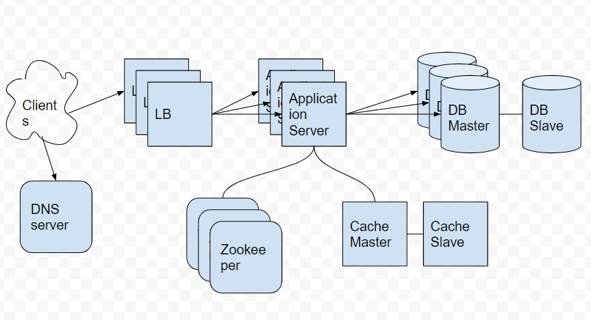

- [Why do we need URL shortening?](#why-do-we-need-url-shortening)
- [Requirements](#requirements)
- [Capacity Estimation and Constraints](#capacity-estimation-and-constraints)
  - [traffic estimates](#traffic-estimates)
  - [Storage estimates](#storage-estimates)
  - [Bandwidth estimates](#bandwidth-estimates)
  - [Memory estimates](#memory-estimates)
  - [High-level estimates](#high-level-estimates)
- [High Level Architecture](#high-level-architecture)
- [Low Level Architecture](#low-level-architecture)
  - [System APIs](#system-apis)
  - [Database Design](#database-design)
  - [Encoding actual URL](#encoding-actual-url)
  - [Generating keys from DBMS](#generating-keys-from-dbms)
  - [Data Partitioning and Replication](#data-partitioning-and-replication)
- [System Extention](#system-extention)
  - [Cache](#cache)
  - [Load Balancer (LB)](#load-balancer-lb)
- [Components to research](#components-to-research)

----

# Why do we need URL shortening?

This provides a shortening URLs.

# Requirements 

* Given a long URL, This service will provide short URL.
* Given a short URL, This service will redirect with long URL.

# Capacity Estimation and Constraints

## traffic estimates

| Number                                                   | Description                  |
| -------------------------------------------------------- | ---------------------------- |
| 100 : 1                                                  | read/write ratio             |
| 500 M                                                    | write per month              |
| 50B (100 * 500 M)                                        | read per month (redirection) |
| 500M / (30 days * 24 hours * 3600 seconds) ~= 200 URLs/s | write QPS                    |
| 100 * 200 URLs/s = 20 K/s                                | read QPS                     |

## Storage estimates

| Number                             | Description                       |
| ---------------------------------- | --------------------------------- |
| 500 M * 5 years * 12 months = 30 B | The number of objects for 5 years |
| 30 B * 500 bytes = 15 TB           | The number of objects for 5 years |

## Bandwidth estimates

| Number                     | Description                   |
| -------------------------- | ----------------------------- |
| 200 * 500 bytes = 100 KB/s | incomming for writing per sec |
| 20 K * 500 bytes = 10 MB/s | outgoing for readding per sec |

## Memory estimates

* **80-20 rule** : 20 % generates 80 % of traffics. Let's cache these 20% hot URLs.

| Number                              | Description                                   |
| ----------------------------------- | --------------------------------------------- |
| 20 K * 3600 secs * 24 hours ~= 1.7B | The number of request for redirection per day |
| 0.2 % 1.7B * 500 bytes ~= 170 GB    | The number of memory to be cached             |

## High-level estimates

| Number   | Description                        |
| -------- | ---------------------------------- |
| 200/s    | New URLs per sec                   |
| 20 K/s   | URL redirections per sec           |
| 100 KB/s | Incoming data for writing per sec  |
| 10 MB/s  | Outgoing data for reading per sec  |
| 15 TB    | Storage for 5 years                |
| 170 GB   | The number of memory to be cached |

# High Level Architecture



# Low Level Architecture

## System APIs

```
short_url createUrl(api_key, long_url)
long_url  readUrl(api_key, short_url)
void      deleteUrl(api_key, short_url)
```

## Database Design

mysql sharding with 16 instances (2 TB for one instance)

## Encoding actual URL

* base36 : `[a-z0-9]`
* base62 : `[a-zA-Z0-9]`
* base64 : `[a-zA-Z0-9-.]`

```
base64 with 6 letter : 64 ^ 6 ~= 68.7 B unique URLs
base64 with 8 letter : 64 ^ 8 ~=  281 T unique URLs
```

## Generating keys from DBMS

If we use Key-DB, we can recycle short URLs.

```
6 letters * 68.7 B = 412 GB
```

## Data Partitioning and Replication

* [Amazon Aurora Connection Management](https://docs.aws.amazon.com/AmazonRDS/latest/AuroraUserGuide/Aurora.Overview.Endpoints.html)

------

* Range-based partitioning 
  * Partitioning for first letter.
  * This will make unbalanced partitioning.
* Hash-based partitioning
  * Partitioning for hashed value.

# System Extention

## Cache

* [Auto Discovery 작동 방법 @ AWS](https://docs.aws.amazon.com/ko_kr/AmazonElastiCache/latest/mem-ug/AutoDiscovery.HowAutoDiscoveryWorks.html)
* [Choosing Your Node Size](https://docs.aws.amazon.com/ko_kr/AmazonElastiCache/latest/mem-ug/nodes-select-size.html)

------

Redis cluster is a good solution. It will cache 170 GB, 20% of daily traffics.

## Load Balancer (LB)

* Between Clients and Application servers with DNS round-robin.
* Between Application servers and DBMS.
* Between Application servers and Cache Servers.

# Components to research

* [memcached](/memcached/README.md)
* [redis](/redis/README.md)
* [mysql](/mysql/README.md)
* AWS Elasticache memcached
* AWS Elasticache redis
* AWS Aurora mysql
* [AWS Elasticache memcached and redis](https://docs.aws.amazon.com/ko_kr/AmazonElastiCache/latest/mem-ug/SelectEngine.html)
* [AWS Aurora 도입전에 알아야 할 몇가지 사실](https://medium.com/hbsmith/aws-aurora-%EB%8F%84%EC%9E%85%EC%97%90-%EB%8C%80%ED%95%9C-%EB%AA%87%EA%B0%80%EC%A7%80-%EC%82%AC%EC%8B%A4-45eb602bad58)
* [Amazon Aurora Connection Management](https://docs.aws.amazon.com/AmazonRDS/latest/AuroraUserGuide/Aurora.Overview.Endpoints.html) 
