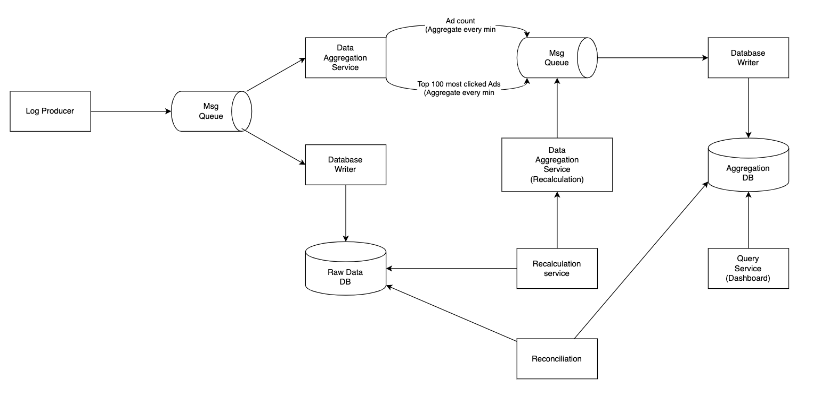
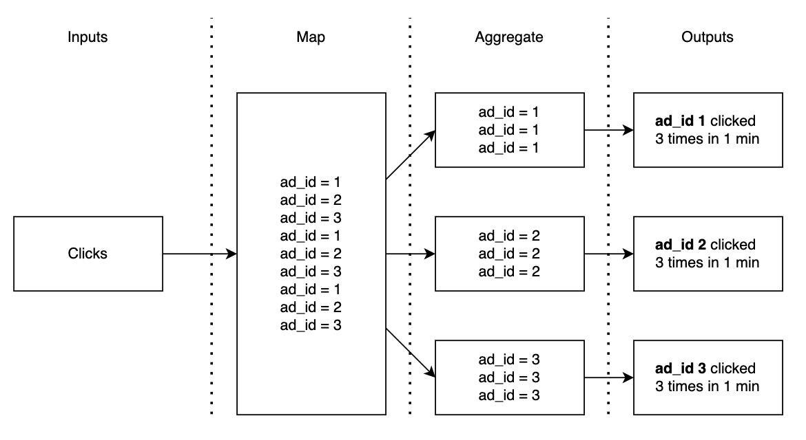
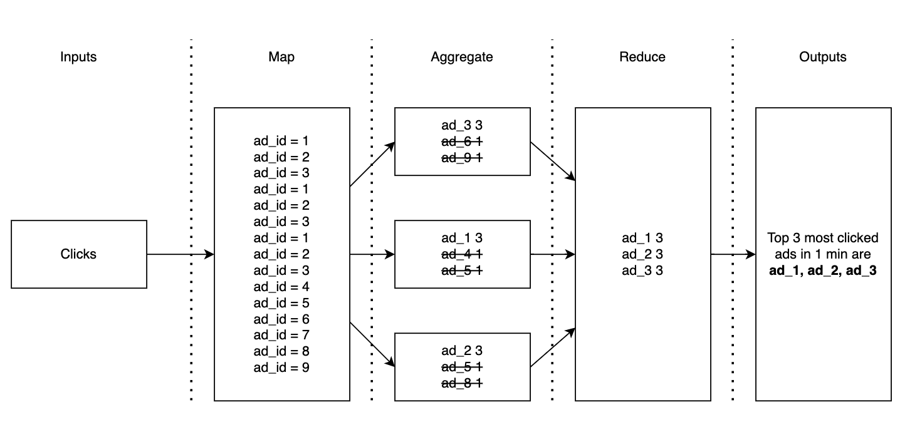
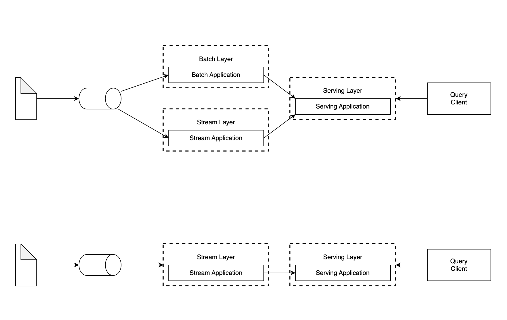
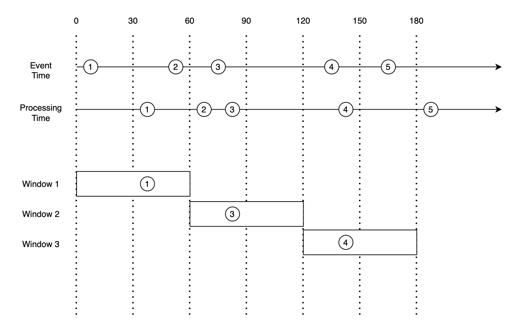
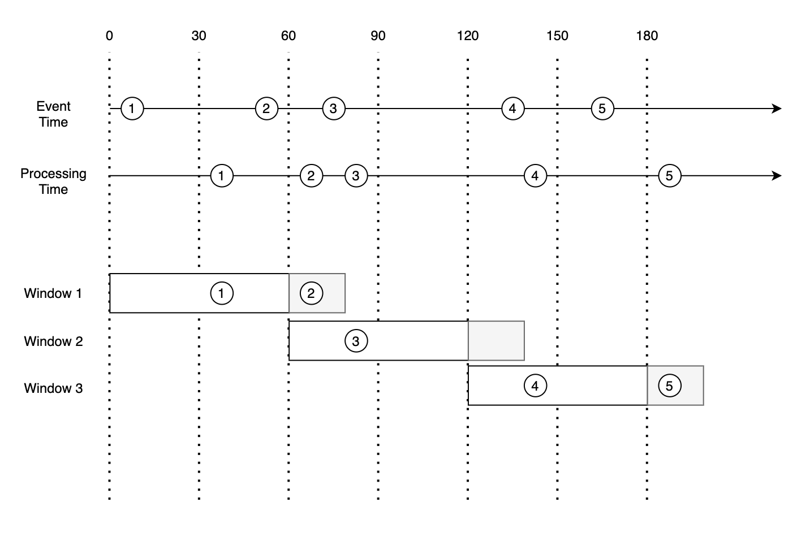
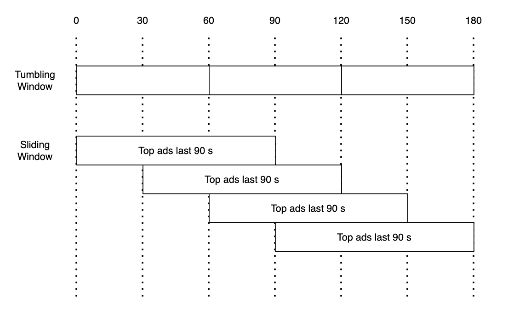

- [Requirements](#requirements)
  - [Functional Requirements](#functional-requirements)
  - [Non-Functional Requirements](#non-functional-requirements)
  - [Estimation](#estimation)
- [High Level Design](#high-level-design)
  - [Query API Design](#query-api-design)
  - [Data Model](#data-model)
    - [Raw Data](#raw-data)
    - [Aggregated Data](#aggregated-data)
  - [Pros And Cons of Data Strategy](#pros-and-cons-of-data-strategy)
  - [Choose The Right Database](#choose-the-right-database)
  - [Architecture](#architecture)
    - [Asynchronous Processing](#asynchronous-processing)
    - [Map Reduce](#map-reduce)
    - [Use Cases](#use-cases)
      - [Aggregate the number of clicks](#aggregate-the-number-of-clicks)
      - [Return top N most clicked ads](#return-top-n-most-clicked-ads)
      - [Data Filtering](#data-filtering)
- [High Level Design Deep Dive](#high-level-design-deep-dive)
  - [Streaming vs Batching](#streaming-vs-batching)
  - [Time](#time)
  - [Aggregation Window](#aggregation-window)
  - [Delivery Guarantees](#delivery-guarantees)
  - [Scale The System](#scale-the-system)
  - [Fault Tolerance](#fault-tolerance)
  - [Data Monitoring And Correctness](#data-monitoring-and-correctness)
  - [Alternative Solution](#alternative-solution)

-----

# Requirements

## Functional Requirements

* Aggregate the number of clicks (ad_id) in the last m minutes.
* Get the top 100 most clicked ad_id every minute.
* Support aggregation filtering.

## Non-Functional Requirements

* The exact data is crucial because the data is used for RTB (Real Time Bidding) and Billing. 
* Should handle delayed or duplicated events.
* Should be resilient to partitial failures.
* End-to-end latency should be a few minutes.

## Estimation

```
* 1 billion DAU
* 1 click per user per day. 1 billion clicks per day.
* QPS
  10^9 event / 10^5 secs = 10,000
* Peak QPS
  QPS * 5 = 50,000 QPS
* Daily Storage
  0.1 KB for 1 click, 0.1 KB * 1 billion = 100 GB.
  0.1 KB * 1,000,000,000 = 100,000,000 KB
                         = 100,000 MB
                         = 100 GB
* Monthly Storage
  100 GB * 30 = 3 TB
* Yearly Storage
  3 TB * 12 = 36 TB
```

# High Level Design

## Query API Design

```
* Aggretate the number of clicks of ad_id in the last m mins.
  * GET /v1/ads/{:ad_id}/aggregated_cnt
  * Req
    * from (long)
    * to (long)
    * filter (long): filter strategy
    * ex) 001 non-US clicks
  * Res
    * ad_id (string)
    * count (long)
* Return top n most clicked ad_ids in the last m mins.
  * GET /v1/ads/popular_ads
  * Req
    * count (integer): top n
    * window (integer): aggreation window size in mins
    * filter (long): filter strategy
  * Res
    * ad_ids (array): list of ads
```

## Data Model

### Raw Data

This is an example of raw data.

```
[AdClickEvent] ad001, 2021-01-01 00:00:01, user 1, 207.xxx.xx.xx, USA
```

Let's change this to structured data for understanding.

| ad_id | click_timestamp | user_id | ip | country |
|--|--|--|--|--|
| ad001 | 2021-01-01 00:00:01 | user1 | 207.xxx.xx.22 | USA |
| ad001 | 2021-01-01 00:00:02 | user1 | 207.xxx.xx.22 | USA |
| ad002 | 2021-01-01 00:00:02 | user2 | 207.xxx.xx.11 | USA |

### Aggregated Data

This is an example of aggregated data.

| ad_id | click_min | count |
|--|--|--|
| ad001 | 202101010000 | 5 |
| ad001 | 202101010001 | 7 |

This is an example of aggregated data for filtering.

| ad_id | click_min | filter_id | count |
|--|--|--|--|
| ad001 | 202101010000 | 0012 | 2 |
| ad001 | 202101010000 | 0023 | 3 |
| ad001 | 202101010001 | 0012 | 1 |
| ad001 | 202101010001 | 0023 | 6 |

This is a filter table.

| filter_id | region | ip | user_id |
|--|--|--|--|
| 0012 | usa | * | 111 |
| 0013 | * | 123.1.2.3 | 123 |

To support top n most clicked ads in the last m mins we need these
options.

| name | type | description|
|--|--|--|
| window_size | integer | The aggregation window size (m mins) |
| update_time_min | timestamp | Last updated timestamp (1 min granularity) |
| most_clicked_ads | array | list of ad ids in JSON |

## Pros And Cons of Data Strategy

Raw Data

* pros
  * Full data set
  * Data filter
  * Data recalculation
* cons
  * Huge data
  * Slow query   

Aggregated Data

* pros
  * Smaller data
  * fast query
* cons
  * data loss

We need to store raw, aggregated data together.

## Choose The Right Database

This is write heavy system because peak QPS is 50,000.
[Cassandra](/cassandra/README.md), InfluxDB is suitable for write heavy system.

## Architecture



### Asynchronous Processing

We use 2 message queues for decoupling services.

This is a dto for first message queue.

```
ad_id | click_timestamp | user_id | ip | country
```

These are dtos for second message queue.

```
ad_id | click_minute | count

update_time_minute | most_clicked_ads
```

### Map Reduce

We use map reduce for counting clicks.

### Use Cases

#### Aggregate the number of clicks

Event data will be partitioned by ad_id in **map nodes**.

We can get the number of clicks by ad_id.



#### Return top N most clicked ads

We can get the top N most clckied ads from the **reduce node**.



#### Data Filtering 

We can get filtering data with a **precalulcated table**.

| ad_id | click_min | country | count |
|--|--|--|--|
| ad001 | 202301010001 | USA | 100 |
| ad001 | 202301010001 | KOR | 100 |
| ad001 | 202301010001 | TR | 100 |
| ad002 | 202301010001 | USA | 100 |
| ad002 | 202301010001 | KOR | 100 |
| ad002 | 202301010001 | TR | 100 |

# High Level Design Deep Dive

## Streaming vs Batching

Lambda And Kappa Architectures



## Time

We consider 2 type of times.

* event time: clicked time
* processing time: processed time

We use both for accuracy.

We miss events when we process event time, processing time in same window.



We can fix it using **water marks**. water marks are additional parts of time window which is adjustable.



## Aggregation Window

According to "Designing Data-Intensive Applications" book, There 4 types of window.

* Tumbling Window (Fixed Window)
* Hopping Window
* Sliding Window
* Session Window



## Delivery Guarantees

We use [Kafka](/kafka/README.md) which provides 3 delivery semantics.

* at-most once.
* at-least once.
* exactly once.

It's important to process duplicates and ensure all events are processed.

Usually at-least is enough but if the accuracy is crucial, exactly once is a good solution.

Processing deduplication in large system is difficult. [An Overview of End-to-End Exactly-Once Processing in Apache Flink (with Apache Kafka, too!)](https://flink.apache.org/2018/02/28/an-overview-of-end-to-end-exactly-once-processing-in-apache-flink-with-apache-kafka-too/)

## Scale The System

**Producers** are easy to be scaled up. **Consumers** are depends on the number of partitions of topics.

Refer [Kafka](/kafka/README.md) for Scaling **brokers**.

Refer [Cassandra](/cassandra/README.md) for scaling **data base**. 

We can resolve hot spot issues allocating more nodes to specific ads.

## Fault Tolerance

When one of aggregation nodes is failed, new aggreation node will load data (ex, top 3 ads in 3 mins).

Primary aggregation node should make a snapshot regularly.

## Data Monitoring And Correctness

**Latency, message queue size, lag time** is important. 

We use reconciliation service for correctness. It will adjust correct the data regularly.

## Alternative Solution

We can use off-the-shelf solutions such as HIVE, [ElasticSearch](/elasticsearch/README.md), ClickHouse.
