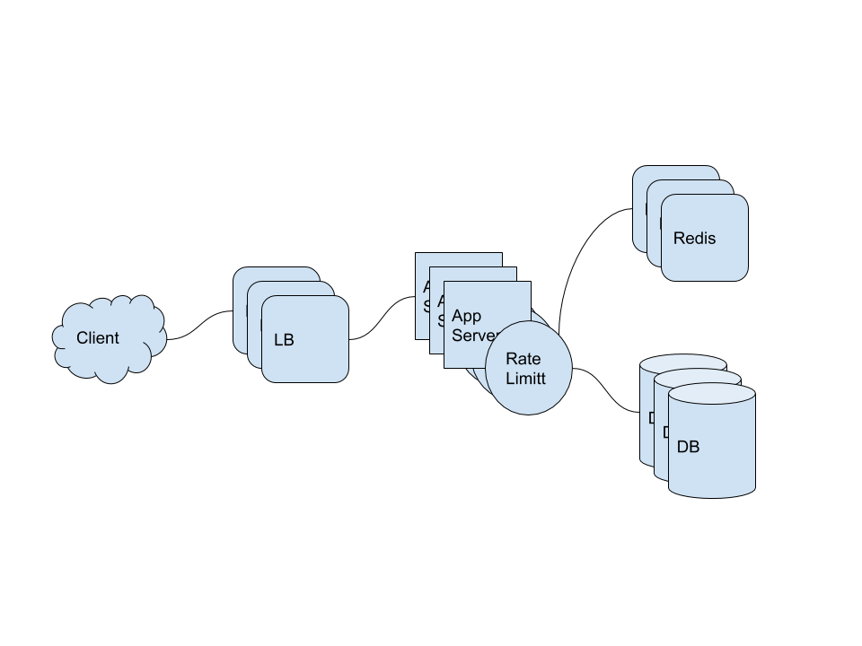

- [Requirements](#requirements)
  - [What is a Rate Limiter?](#what-is-a-rate-limiter)
  - [Why do we need API rate limiting?](#why-do-we-need-api-rate-limiting)
  - [Functional Requirements](#functional-requirements)
  - [Non-functional Requirements](#non-functional-requirements)
  - [How to do Rate Limiting?](#how-to-do-rate-limiting)
  - [What are different types of throttling?](#what-are-different-types-of-throttling)
  - [What are different types of algorithms used for Rate Limiting?](#what-are-different-types-of-algorithms-used-for-rate-limiting)
- [High level design for Rate Limiter](#high-level-design-for-rate-limiter)
- [Low level design for Rate Limiter](#low-level-design-for-rate-limiter)
  - [Fixed window algorithm](#fixed-window-algorithm)
    - [Algorithm](#algorithm)
    - [Problems](#problems)
    - [Estimation](#estimation)
  - [Sliding Window algorithm](#sliding-window-algorithm)
    - [Algorithm](#algorithm-1)
    - [Estimation](#estimation-1)
  - [Sliding Window with Counters](#sliding-window-with-counters)
    - [Algorithm](#algorithm-2)
    - [Estimation](#estimation-2)
  - [Data Sharding and Caching](#data-sharding-and-caching)
  - [Should we rate limit by IP or by user?](#should-we-rate-limit-by-ip-or-by-user)
- [System Extention](#system-extention)
- [Q&A](#qa)
- [References](#references)

----

# Requirements

## What is a Rate Limiter?

The component which throttle APIs.

## Why do we need API rate limiting?

* Misbehaving licents/scripts
* Security
* To prevent abusive behavior and bad design practices
* To keep costs and resource usage under control
* Revenue. Users has to buy rate limit for more traffic.
* To eliminate spikiness in traffic

## Functional Requirements

* Limit the number of requests per sec.

## Non-functional Requirements

* The system is highly available
* The system does't provide long latencies.

## How to do Rate Limiting?

Response 429 Too many requests.

## What are different types of throttling?

* Hard Throttling
  * The number of requests don't exceed the rate limit setting.
* Soft Throttling
  * The percentage of requests don't exceed the rate limit setting.
* Elastic or Dynamic Throttling
  * The system allocate rate limit setting elastically with available resources.

## What are different types of algorithms used for Rate Limiting?

* Fixed window algorithm will throttle m5 for 2/s rate limitting.
* Rolling window algorithm will throttle m3,m4 for 2/s rate limitting.

```
     Fixed Window   Fixed Window
   _______________ _______________
  |               |               |
--|-------|-m1-m2-|-m3-m4-|-m5----|--
  0       |       1       |       2
           ---------------
            Rolling Window
```

# High level design for Rate Limiter



# Low level design for Rate Limiter

## Fixed window algorithm

### Algorithm

This is a record for user rate limit setting

| Key | Value |
|-----|-------|
| userId | {count, startTime} |
| David | 3, 1 |

This is a example of rate limit setting for 3/min rate limit setting.

```
 1: {"David" : {"count": 1, "startTime": 1}
 2: {"David" : {"count": 2, "startTime": 1}
 3: {"David" : {"count": 3, "startTime": 1}
61: {"David" : {"count": 1, "startTime": 61}
62: {"David" : {"count": 2, "startTime": 61}
63: {"David" : {"count": 3, "startTime": 61}
64: {"David" : {"count": 3, "startTime": 61} Reject request
```

### Problems

* This can not handle dense requests. For example, this accept 4 requests for 2/sec rate limit setting.

```
     Fixed Window   Fixed Window
   _______________ _______________
  |               |               |
--|-------|-m1-m2-|-m3-m4-|-m5----|--
  0       |       1       |       2
           ---------------

```

* In distributed system, this algorithm doesn't handle race conditions. we might need a lock system. But this slows down the system. we need to implement a lock for user.

### Estimation

| Number  | Description     |
| -- | --------------- |
| 8 bytes | userId |
| 2 bytes | count up to 65K |
| 2 bytes | minutes and second |
| 12 bytes | record for a user |
| 20 bytes | hash table for a user | 
| 32 MB (12 + 20) bytes * 1 million | data for 1 million users |
| 4 bytes | lock for a user |
| 36 MB | data including lock for 1 million users |

## Sliding Window algorithm

### Algorithm

This is a record for user rate limit setting

| Key | Value |
|-----|-------|
| userId | {sorted set <unixTime>} |
| David | {1, 2, 3} |

This is a example of rate limit setting for 3/min rate limit setting.

```
  1: {"David" : {1}
 61: {"David" : {61}
 62: {"David" : {61,62}
 63: {"David" : {61,62,63}
 64: {"David" : {61,62,63} Reject request
121: {"David" : {62,63,121}
```

### Estimation

| Number  | Description     |
| -- | --------------- |
| 8 bytes | userId |
| 4 bytes | timestamp |
| 500 | rate limit per hour |
| 20 bytes | hash table for a user | 
| 12 KB (8 + (4 + 20 sorted set overhead) * 500 + 20 hash table overhead) |  |
| 12 GB (12 KB * 1 million) | data for 1 million users |
| 4 bytes | lock for a user |

## Sliding Window with Counters

### Algorithm

This is a record for user rate limit setting

| Key | Value |
|-----|-------|
| userId | {timestamp: count,...} |
| David | {0: 1, 60: 2} |

This is a example of rate limit setting for 3/min rate limit setting and every 10 sec window.

```
  0: {"David" : {0:1}
 50: {"David" : {0:1,50:1}
 51: {"David" : {0:1,51:2}
 52: {"David" : {0:1,51:3}
 53: {"David" : {0:1,51:3} Reject request
 63: {"David" : {51:3,63:1}
```

### Estimation

| Number  | Description     |
| -- | --------------- |
| 8 bytes | userId |
| 4 bytes | timestamp |
| 2 bytes | count |
| 500 | rate limit per hour |
| 20 bytes | hash table for a user | 
| 1.6 KB (8 + (4 + 20 redis hash overhead) * 60 + 20 hash table overhead) |  |
| 1.6 GB (1.6 KB * 1 million) | data for 1 million users |

## Data Sharding and Caching

* userid based sharding, consistent hashing for fault tolerance and replication.
* API based rate limiting is a good solution.
  * UrlShortening service has different rate limit setting for createUrl, deleteUrl.
* LRU caching is a good solution for cache eviction.

## Should we rate limit by IP or by user?

* In case of IP based rare limitting, One bad user can cause throttling to other users.
* In case of User based rate limitting, One bad user can cause throttling to other user with login API of wrong token.
* We need to mix two ways. GitHub Enterprise appliance has rate limit setting for non-authenticated users, authenticated users. [Configuring rate limits @ GitHub](https://docs.github.com/en/enterprise-server@2.21/admin/configuration/configuring-rate-limits)

# System Extention

# Q&A

# References
