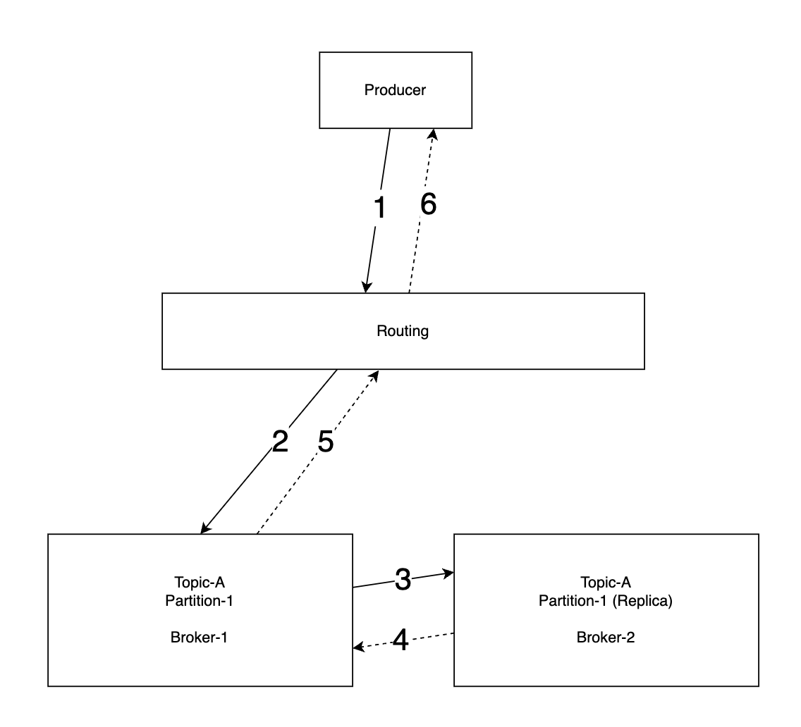

- [Abstract](#abstract)
- [Requirements](#requirements)
  - [Functional Requirement](#functional-requirement)
  - [Non-Functional Requirement](#non-functional-requirement)
- [High Level Design](#high-level-design)
  - [Message Models](#message-models)
    - [Point-to-Point](#point-to-point)
    - [Publish-Subscribe](#publish-subscribe)
  - [Topics, Partitions, Brokers](#topics-partitions-brokers)
  - [Consumer Group](#consumer-group)
  - [High Level Arhictecture](#high-level-arhictecture)
- [High Level Design Deep Dive](#high-level-design-deep-dive)
  - [Data Storage](#data-storage)
  - [Message Data Structure](#message-data-structure)
  - [Batching](#batching)
  - [Producer Flow](#producer-flow)
  - [Consumer Flow](#consumer-flow)
    - [Push model](#push-model)
    - [Pull model](#pull-model)
  - [Consumer Rebalancing](#consumer-rebalancing)
  - [State Storage, Metadata Storage](#state-storage-metadata-storage)
  - [Replication](#replication)
  - [Scalability](#scalability)
  - [Deliver Semantics](#deliver-semantics)
    - [at-most once](#at-most-once)
    - [at-least once](#at-least-once)
    - [exactly once](#exactly-once)
- [Extensions](#extensions)

----

# Abstract

[Kafka](/kafka/README.md) 와 비슷한 message broker 를 디자인한다.

# Requirements

## Functional Requirement

* Producers send messages to msg queue.
* consumers consume msgs from the msg queue.
* messages can be repeatedly consumed.
* Historical data can be truncated.
* Message size is in the kilobyte.
* The system should provide message ordering.
* Users can configure data delivery semantics (at-least once, at-most once, exactly once)

## Non-Functional Requirement

* High throughtput and low latency, configurable.
* High Scalble.
* High persistent and durable.

# High Level Design

## Message Models

### Point-to-Point

A message is sent to a queue and consumed one by one consumer.

### Publish-Subscribe

A message is sent to a topic and consumed one by many consumers who subscribed
the topic.

## Topics, Partitions, Brokers

Messages are persisted by topics. One topic can be consisted of many partitions.
Brokers are servers which have partitions.

## Consumer Group

Consumer group is a set of consumers. Different consumer groups
are able to consume same topics.

## High Level Arhictecture

* **Producers** send messages to specific topics.
* **Consumer groups** consume message from specific topics.
* **Brokers** hold multiple partitions.
* messages are persistend in **data storage** in partitions.
* consumer states are persisted in **state storage**.
* configs and properties of topics are persisted in **meta-data storage**.
* Coordination service are doing these
  * Service discovery
  * Leader election.
  * [Zookeeper](/zookeeper/README.md) or [etcd](/etcd/README.md) are commonly used ones. 

# High Level Design Deep Dive

## Data Storage

We can think 2 options including **DataBase**, **Write-ahead log (WAL)**. Write-ahead log (WAL) is a good solution.

Write-ahead log (WAL) is a file where new entries are appended only. This is suitable for sequential read and write.

## Message Data Structure

| name | type |
|--|--|
| key | byte[] |
| value | byte[] |
| topic | string |
| partition | integer |
| offset | long |
| timestamp | long |
| size | integer |
| crc | integer |

## Batching

Batching is critical to improving performance but batch size is trade-off.

## Producer Flow

1. The producer sends a message to the **routing layer**.
2. The routing layer send the message to the **leader partition** in broker-1.
3. The **follwer partition** pull the message from the leader partition.
4. Ack to leader partition.
5. Ack to routing layer.
6. Ack to producer.

## Consumer Flow

We can think push vs pull model.

### Push model

**Pros**

1. Low latency

**Cons**

1. In case of massive traffics, consumers can be overwhelmed.
2. It is difficult to deal with throttling consumers.

### Pull model

**Pros**

1. Consumers can throttle.
2. In case of massive traffics, we can solve that situation via scaling out consumers.
3. It is suitable for batching.

**Cons**

1. In case of poor traffic, consumer should pull data. But it is not a big deal.

## Consumer Rebalancing

The application rebalances for deciding which consumer is responsible for which partitions. It happenss when new consummer joins or old consumer leave.

## State Storage, Metadata Storage

**State storage** stores these

* The mapping between partitions and consumers.
* The last consumed offsets of consumer groups for each partition.

**Meta-data storage** stores these

* Configs and properties of topics including number of partitions, retention period, distribution of replicas.

## Replication

In-sync replicas are the number of sync. Usually `ACK=1` is good.

`ACK=all` means all followers should ack with the leader.

`ACK=1` means 1 follower should ack with the leader.

`ACK=0` means there is no ack among the leader and the followers. very fast.

## Scalability

We need to considers these for scalability.

* Producers
* Consumers
* Brokers
* Partitions

## Deliver Semantics

There are 3 devlier semantincs including **at-most once**, **at-leaset once**, **exactly once**.

### at-most once

Message will be delivered not more than once. Messages might be lost but are not redelivered.

It is suitable for monitoring metrics.

### at-least once

Messages will be delivered without being lost. 

Duplicates might happen. But we can fix that situation with unique id in
message.

### exactly once

It is most difficult one to implement.

# Extensions

* Message filtering
* Delayed messages
* Scheduled messages
