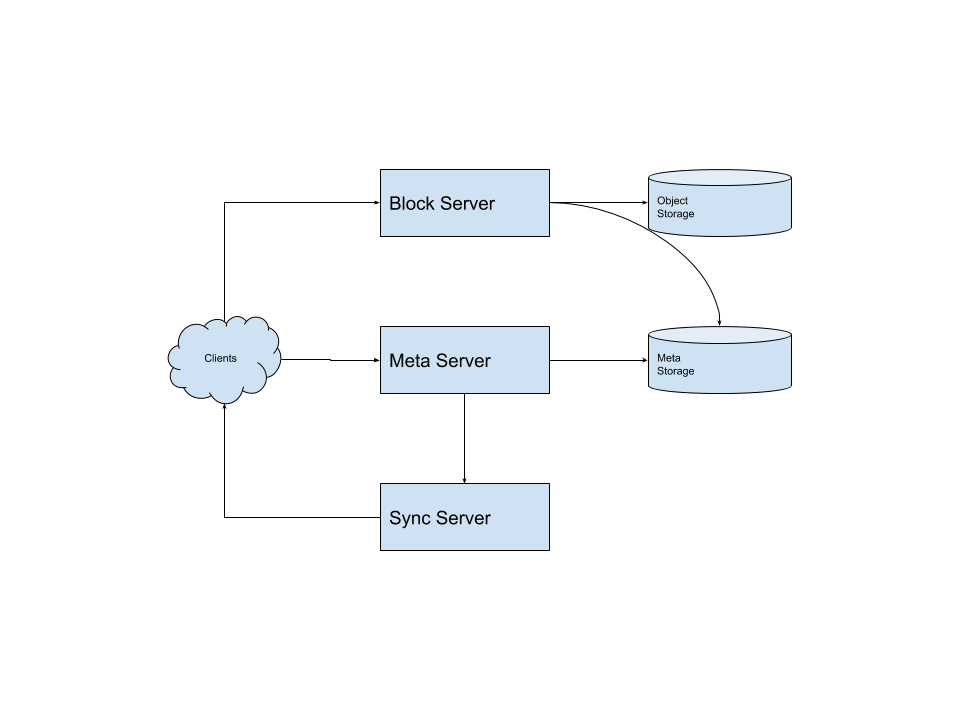
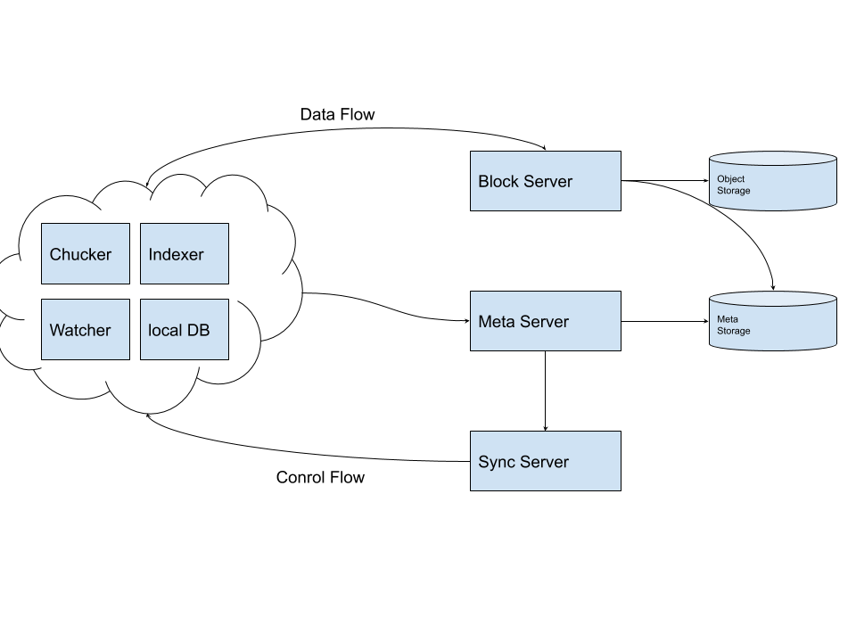
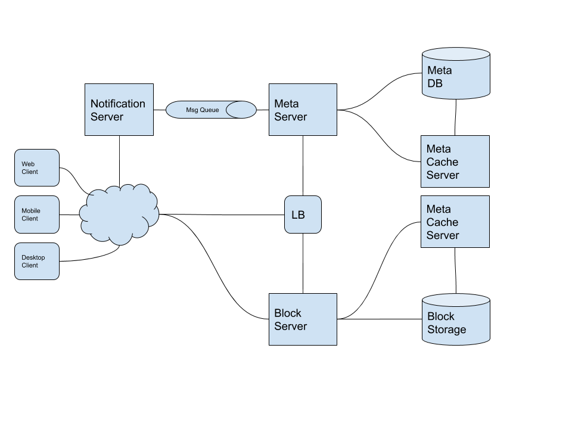

- [Requirements](#requirements)
  - [Functional requirements](#functional-requirements)
  - [Non-functional requirements](#non-functional-requirements)
- [Capacity Estimation and Constraints](#capacity-estimation-and-constraints)
- [High-level Architecture](#high-level-architecture)
- [Log-level Architecture](#log-level-architecture)
  - [Clients](#clients)
  - [Meta Database](#meta-database)
  - [Sync Server](#sync-server)
  - [Message Queue Service](#message-queue-service)
  - [Cloud/Block Storage](#cloudblock-storage)
  - [File Processing Workflow](#file-processing-workflow)
  - [Data Deduplication](#data-deduplication)
- [System Extension](#system-extension)
  - [Metadata Sharding](#metadata-sharding)
  - [Caching](#caching)
  - [Security](#security)
- [Q&A](#qa)
- [References](#references)

------

# Requirements

This is system should suuport Availability, Reliability and Durability, Scalability.

## Functional requirements

* Users can upload, download files from any device.
* Users can share files or folders with others.
* This system supports automatic synchronization between devices
* This system supports GB files.
* This system supports ACID.
* This system supports offline editing. As soon as devices got online, all changes will be synced to the remote servers and other devices.
* This system supports revisions of files so users can go back to previous version.

## Non-functional requirements

* This system supports huge read and write.
* Read to write ratio is same.
* Files will be divided by chunks (4MB).
* This system reduce the amount of data exchange by trasnferring updated chunks only.
* This system reduce the storage space and bandwidth by removing duplicated chunks.
* The client keep a local copy of the metdata(file name, size, etc...)
* The client upload the diffs instead of the whole chunk.

# Capacity Estimation and Constraints

| Number                                       | Description      |
| -------------------------------------------- | ---------------- |
| 500 M   | Total Users |
| 200 | Files per user |
| 100 KB   | Average file size |
| 100 billion   | Total files |
| 10 PB   | Total Storage |

# High-level Architecture

# Log-level Architecture

## Clients

* local DB
  * Keep track of all the files, chunks, versions, locations
* Chunker
  * Will split the files into smaller chunks and Merge chunks to a file.
* Watcher
  * Will monitor local files and notify actions to the indexer.
* Indexer
  * Will handle events from the Watcher and update local DB with modified chunks and files. Once chunks are uploaded to or downloaded from the Object Storage, The indexer will send data to the remote Sync Server to broadcast changes to other clients and update the remote Meta DB.

## Meta Database

This system needs transaction so RDBMS is a good solution. RDBMS needs to store these.

* Chunks
* Files
* User
* Devices
* Workspace (sync folders)

## Sync Server

Receive requests from a Message Queue and send data to Clients.

## Message Queue Service

There are 2 Message Queues including Request Queue, Response Queue.

Clients send data to Request Queue and Sync Server pull data from it.

Sync Server send data to Response Queue and Awaken clients pull data from it. This makes it possible to broadcast notification to other users.

## Cloud/Block Storage

Cloud/Bloack Storage such as AWS S3 makes it possible to save scalable files.

## File Processing Workflow

* Client A uploads chunks to Block storage.
* Client A updates metadata and commits change.
* Client A gets a confirmation and notifications are sent to Client B and C.
* Client B, C receive metadata changes and download updated chunks.

## Data Deduplication

Every chunks has hash (SHA256) and it will be used removing duplicated chunks. There are 2 ways to remove them including post-process deduplication and in-line deduplication.

In case of post-process deduplication, server handles it. In case of in-line deduplication, client handles it.

# System Extension

## Metadata Sharding

Consistent hashing is useful.

## Caching

Memcached with LRU strategy is a good solution. A high-end server can have 144GB of memeory. one such server can cache 36K chunks. 

## Security

# Q&A

# References
