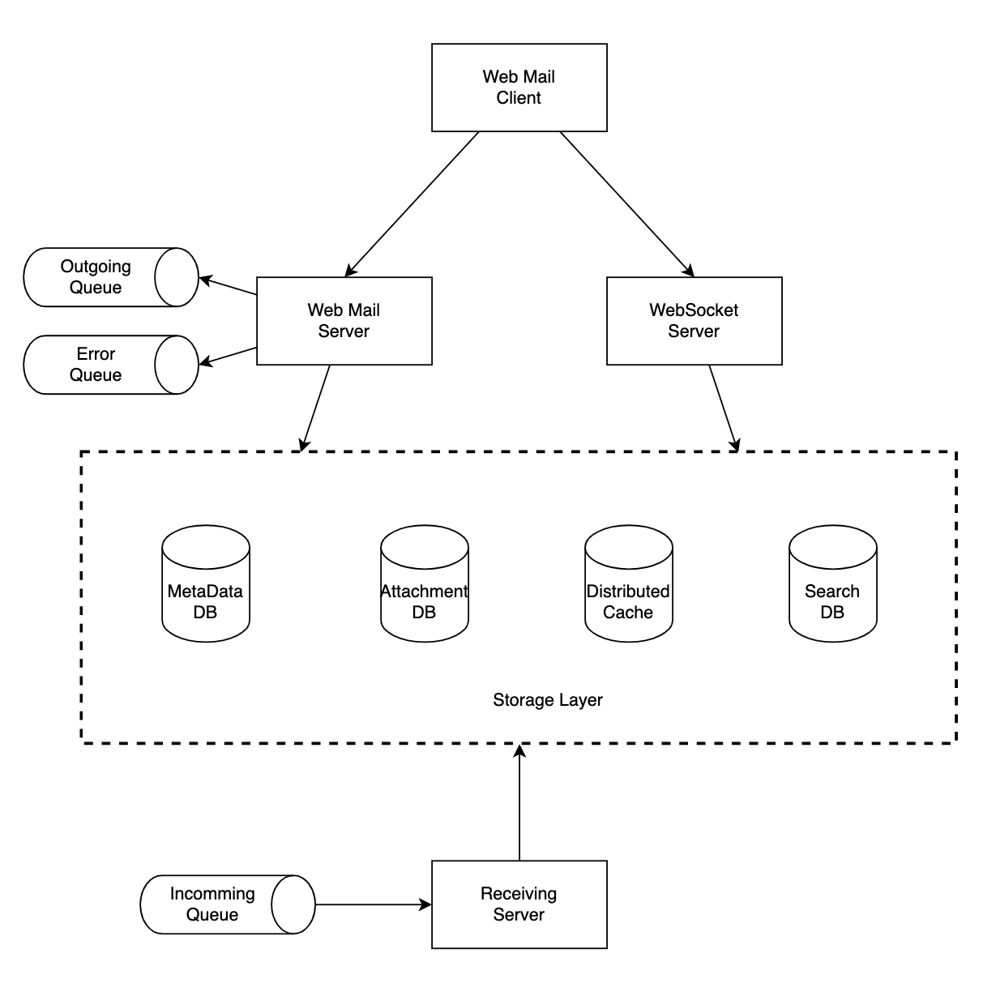
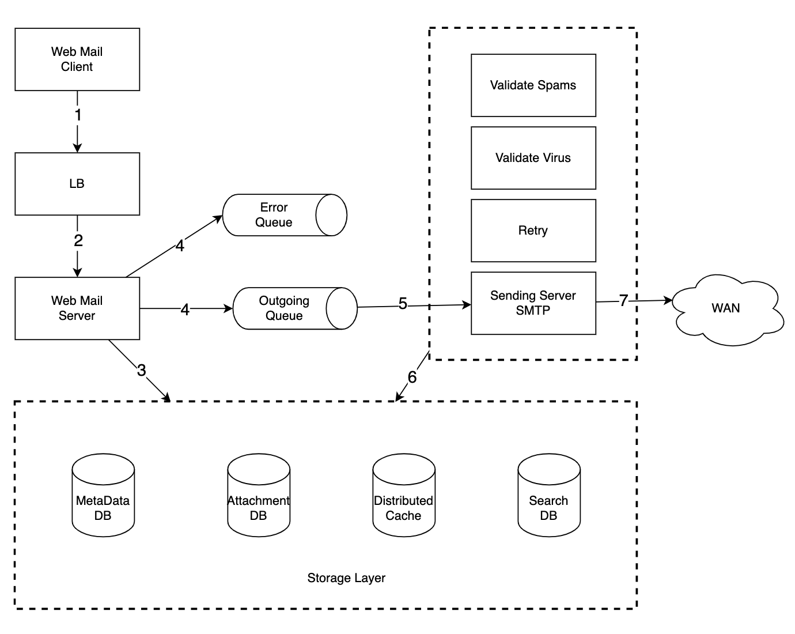
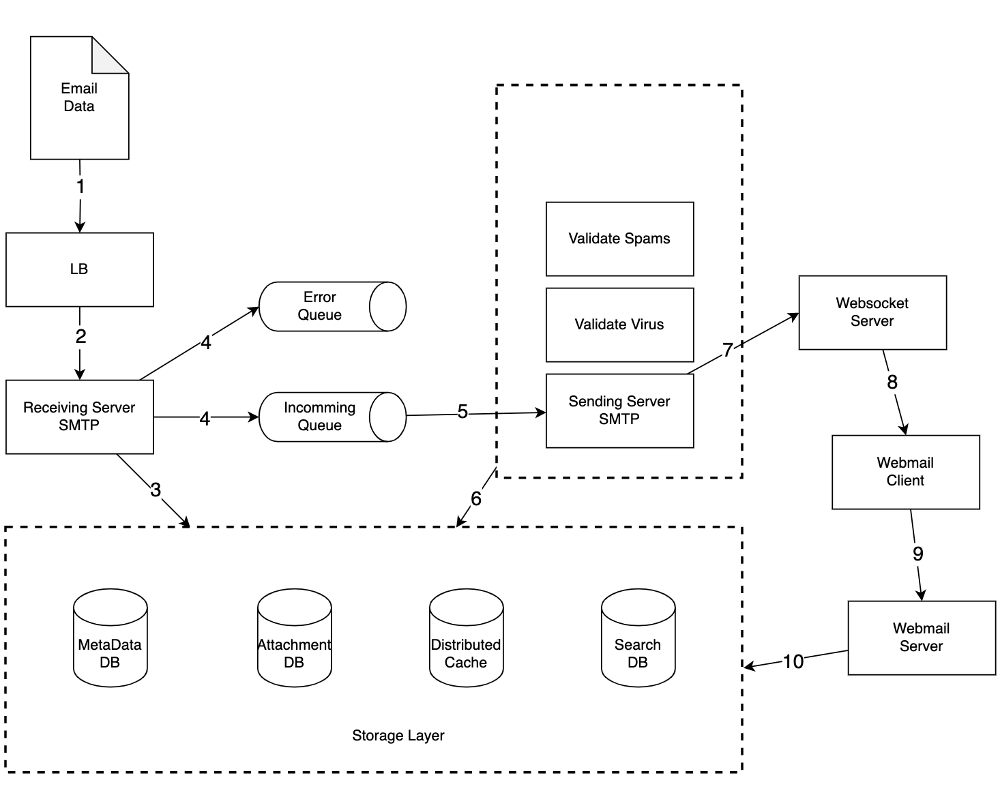

- [Requirements](#requirements)
  - [Functional Requirement](#functional-requirement)
  - [Non-Functional Requirement](#non-functional-requirement)
  - [Estimation](#estimation)
- [High Level Design](#high-level-design)
  - [Email Knowledge 101](#email-knowledge-101)
    - [Email Protocols](#email-protocols)
    - [DNS](#dns)
    - [Attachment](#attachment)
  - [Traditional Mail Servers](#traditional-mail-servers)
  - [Distributed Mail Servers](#distributed-mail-servers)
    - [Email APIs](#email-apis)
    - [System Architecture](#system-architecture)
    - [Email Sending Flow](#email-sending-flow)
    - [Email Receiving Flow](#email-receiving-flow)
- [High Level Design Deep Dive](#high-level-design-deep-dive)
  - [Metadata Database](#metadata-database)
    - [Characteristics](#characteristics)
    - [Choose The Right Database](#choose-the-right-database)
    - [Data Model](#data-model)
    - [Consistency Trade-Off](#consistency-trade-off)
  - [Email Deliverability](#email-deliverability)
  - [Search](#search)
    - [ElasticSearch](#elasticsearch)
    - [Custom Search Engine](#custom-search-engine)
  - [Scalability \& Availability](#scalability--availability)
- [Extension](#extension)
  - [Fault Tolerance](#fault-tolerance)
  - [Compliance](#compliance)
    - [PII](#pii)
    - [GDPR](#gdpr)
  - [Security](#security)
  - [Optimizations](#optimizations)
- [References](#references)

----

# Requirements

## Functional Requirement

* Send and receive emails.
* Fetch all emails.
* Filter emails by read and unread status.
* Search emails by subject, sender and body.
* Ant-spam and anti-virus.

## Non-Functional Requirement

* Reliability
  * Should not lose email data.
* Availability
  * Data should be replicated across multiple nodes.
  * System should work despite of partial system failures.
* Scalability
  * System should respond for massive traffics.
* Flexibility and extensibility
  * System should allow us to add new features or improve performance easily by
    adding new components.

## Estimation

* `1 billion` for **RU**
* `100,000` for **QPS**
  * `(10^9 * 10) / 10^5`
  * One person sends 10 emails per day.
* `730 PB` for **meta-data storage for 1 year**
  * `1 biilion users * 40 emails/day * 365 days * 50 KB`
  * One person receives 40 emails per day.
  * One email has 50 KB meta-data.
* `1,460 PB` for **attatchment storage for 1 year**
  * `1 biilioin users * 40 meails/day * 365 days * 500 KB * 20%`
  * `20%` emails contain attachments
  * One attachment size is `500KB` 

# High Level Design

## Email Knowledge 101

### Email Protocols

**SMTP (Simple Mail Transfer Protocol)**

Protocol for sending Emails.

**POP (Post Office Protocol)**

Protocol for receiving Emails. Receive and delete emails from server.

**IMAP (Internet Message Access Protocol)**

Protocol for receiving Emails. Receive and do not delete emails from server.

**HTTPS**

It's suitable for web-based mail service.

### DNS

We can get **MX (Mail Exchanger) record** using DNS from receiver's Domain. This
is a result for getting MX record from `gmail.com` domain.

```bash
$ nslookup
> set q=mx
> gmail.com
Server:		100.64.0.1
Address:	100.64.0.1#53

Non-authoritative answer:
gmail.com	mail exchanger = 20 alt2.gmail-smtp-in.l.google.com.
gmail.com	mail exchanger = 5 gmail-smtp-in.l.google.com.
gmail.com	mail exchanger = 10 alt1.gmail-smtp-in.l.google.com.
gmail.com	mail exchanger = 40 alt4.gmail-smtp-in.l.google.com.
gmail.com	mail exchanger = 30 alt3.gmail-smtp-in.l.google.com.

Authoritative answers can be found from:
gmail-smtp-in.l.google.com	internet address = 64.233.188.27
alt1.gmail-smtp-in.l.google.com	internet address = 142.250.141.26
alt2.gmail-smtp-in.l.google.com	internet address = 142.250.115.27
alt4.gmail-smtp-in.l.google.com	internet address = 142.250.152.27
alt4.gmail-smtp-in.l.google.com	has AAAA address 2607:f8b0:4001:c56::1a
```

```bash                                        
gmail.com	mail exchanger = 20 alt2.gmail-smtp-in.l.google.com.

"20" is a priority. the lowest is a top priority.
"alt2.gmail-smtp-in.l.google.com" is address of mail servers.
```

### Attachment

The size of attachment should be limited. **MIME (Multipurpose Internet Mail Extension)**
is a spec for sending attachment over the internet. 

## Traditional Mail Servers

* Alice write an email using Outlook client.
* Alice press the send button.
* Outlook client send data to **sending mail server** using SMTP.
* **sending mail server** look up the ddress of the receipient's SMTP server and
  send data to **receiving mail server** using SMTP.
* **receiving mail server** saves the email and makes it available to Bob.
* Bob read the email using IMAP/POP in gmail web site.

## Distributed Mail Servers 

### Email APIs

```c
* POST /v1/messages
* GET /v1/folders
  * Response
    [
      {
        id: "222331",
        name: "David Sun",
        user_id: "iamslash"
      }
    ]
  * id (string): unique folder identifier.
  * name (string): name of the folder.
    * According to RFC6154, default folders are All, Archive, Drafts, Flagged, Junk, Sent and Trash.
  * user_id (string): unique user identifier.  
* GET /v1/folders/{:folder_id}/messages
* GET /v1/messages/{:message_id}
  * Response
    {
      user_id: "",
      from: {name: "", email: ""}
      to: [{name: "", email: ""}]
      subject: ""
      body: ""
      is_read: true
    }
```

### System Architecture



**Web Mail Server**

Web mail servers like gmail servers.

**Web Socket Server**

Web socket servers push server side notification such as receving emails.

[Apache James](https://james.apache.org/)

**Meta Data DB**

[cassandra](/cassandra/README.md) might be a good solution.

**Attachment DB**

S3 might be a good solution.

**Distributed Cache**

[Redis](/redis/README.md) might be a good solution.

**Search DB**

[ElasticSearch](/elasticsearch/README.md) might be a good solution.

### Email Sending Flow



### Email Receiving Flow



# High Level Design Deep Dive

## Metadata Database

### Characteristics

* Email headers are small and frequently accessed.
* Email bodies have various size and infrequently accessed.
* Users read the recent emails.
* System needs high reliability. Data should not be lost.

### Choose The Right Database

* A single column can be a single-digit of MB.
* Strong data consistency.
* Need to reduce DISK I/O.
* High available and fault tolerant.
* Incremental backups.

[Cassandra](/cassandra/README.md) is a good solution.

### Data Model

These are access patterns and table schemas.

> Get all folders for a user.

folders_by_user

| name | type | key |
|--|--|--|
| user_id | UUID | Partition Key |
| folder_id | UUID | |
| folder_name | TEXT | |

> Display all emails for a specific folder

emails_by_folder

| name | type | key |
|--|--|--|
| user_id | UUID | Partition Key |
| folder_id | UUID | Partition Key |
| email_id | TIMEUUID | Clustering Key DESC |
| from | TEXT | |
| subject | TEXT | |
| preview | TEXT | |
| is_read | BOOLEAN | |

> Create/Delete/Get an email

```sql
SELECT * 
  FROM emails_by_user
 WHERE email_id = 12332;  
```

emails_by_user

| name | type | key |
|--|--|--|
| user_id | UUID | Partition Key |
| email_id | TIMEUUID | Clustering Key DESC |
| from | TEXT | |
| to | `LIST<TEXT>` | |
| subject | TEXT | |
| body | TEXT | |
| attachments | `LIST<filename | size` | |

attachments

| name | type | key |
|--|--|--|
| email_id | TIMEUUID | Clustering Key |
| filename | TEXT | Partition Key |
| url | TEXT | |

> Fetch all read or unread emails

```sql
  SELECT *
    FROM emails_by_folder
   WHERE user_id = <user_id> AND
         folder_id = <folder_id> AND
         is_read = true
ORDER BY email_id;        
```

Using read_emails, unread_emails is a good solution for performance.

```sql
  SELECT *
    FROM unread_emails
   WHERE user_id = <user_id> AND
         folder_id = <folder_id>
ORDER BY email_id;        
```

read_emails

| name | type | key |
|--|--|--|
| user_id | UUID | Partition Key |
| folder_id | UUID | Partition Key |
| email_id | TIMEUUID | Clustering Key DESC |
| from | TEXT | |
| subject | TEXT | |
| preview | TEXT | |

unread_emails

| name | type | key |
|--|--|--|
| user_id | UUID | Partition Key |
| folder_id | UUID | Partition Key |
| email_id | TIMEUUID | Clustering Key DESC |
| from | TEXT | |
| subject | TEXT | |
| preview | TEXT | |

> Conversation threads

```json
{
  "headers": {
    "Message-Id": "oijoisiojijosoijdoiiodfijo",
    "In-Reply-To": "soijsoijfsjioijsdoijfji",
    "References": ["sdoiioieiiof"]
  }
}
```

| name | description |
|--|--|
| Message-Id | unique email id |
| In-Reply-to | parent message-id |
| References | list of message IDs related to a thread |

### Consistency Trade-Off

Find trade-off between consistency and availability.

## Email Deliverability

Brand new sending SMTP server needs time to be recognized no harmful server.

* It is recommended to use dedicated-ip address.
* It is recommended to send marketting emails in a specific sending mail server.
  * ISP will mark the specific mail server as promotional.
* It is recommended to warm up sending mail server for good reputation.
* It is recommended to ban spam emails very quickly before it propagates.

## Search

### ElasticSearch

[ElasticSearch](/elasticsearch/README.md) is simple to make it.

### Custom Search Engine

LSM (Log-Structured Merge Tree) is a good solution.

## Scalability & Availability

Message queues are horizontally scalable.

# Extension

## Fault Tolerance

## Compliance

### PII

### GDPR

## Security

## Optimizations

# References
