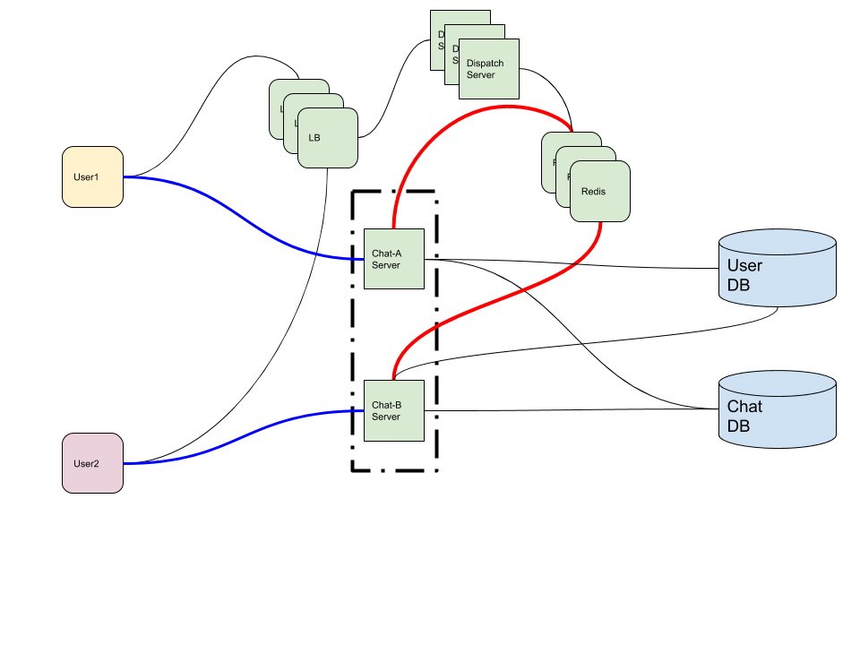

- [Requirements](#requirements)
  - [Functional Requirements](#functional-requirements)
  - [Non-functional Requirements](#non-functional-requirements)
- [System APIs](#system-apis)
- [Capacity Estimation and Constraints](#capacity-estimation-and-constraints)
  - [Traffic Estimation](#traffic-estimation)
  - [Storage Estimation](#storage-estimation)
  - [Bandwith Estimation](#bandwith-estimation)
  - [High-level Estimation](#high-level-estimation)
- [High-level Architecture](#high-level-architecture)
  - [Workflow](#workflow)
- [Low-level Architecture](#low-level-architecture)
- [System Extentions](#system-extentions)
- [Q&A](#qa)
- [References](#references)

-----

# Requirements

## Functional Requirements

* The system supports 1on1 between users.
* The system supports group chats.
* The system supports push notifications.
* The system supports to keep track of online/offline statuses of users.
* The system supports persistent storage of char history.

## Non-functional Requirements

* The system supports real-time chat experience with minimum latency.
* The system supports highly-consistent, users can the same chat history on all their devices.
* The system supports highly-availabilty, but lower availability in the interest of consistency.

# System APIs

???

# Capacity Estimation and Constraints

## Traffic Estimation

| Number                                       | Description      |
| -------------------------------------------- | ---------------- |
| 500 M   | DAU (Daily Active Users) |
| 40 | messages per day for each user |
| 20 billion | messager per day  for all users |

## Storage Estimation

| Number                                       | Description      |
| -------------------------------------------- | ---------------- |
| 100 bytes | average data size for one message   |
| 2 TB / day (20 billion * 100 bytes) | storage per day  |
| 3.6 PB (2 TB/day * 365 days * 5 years) | storage for 5 years |

## Bandwith Estimation

| Number                                       | Description      |
| -------------------------------------------- | ---------------- |
| 25 MB / day (2 TB / 86400 sec) | ingress data size per sec |
| 25 MB / day (2 TB / 86400 sec) | egress data size per sec |

## High-level Estimation

| Number                                       | Description      |
| -------------------------------------------- | ---------------- |
| 2 TB | storage for each day  |
| 3.6 PB | storage for 5 years  |
| 25 MB | ingress data  |
| 25 MB | egress data |

# High-level Architecture

## Workflow

* User-A sends a message to User-B through the chat-A server.
* The chat-A server received the message and sends an ack to User-A.
* The chat-A server stores the message in its database and sends the message to User-B through the chat-B server.
* User-B receives the message and sends the ack to the chat-B server.
* The chat-A server notifies to User-A that the message has been delivered successfully to User-B

# Low-level Architecture

# System Extentions

# Q&A

# References
