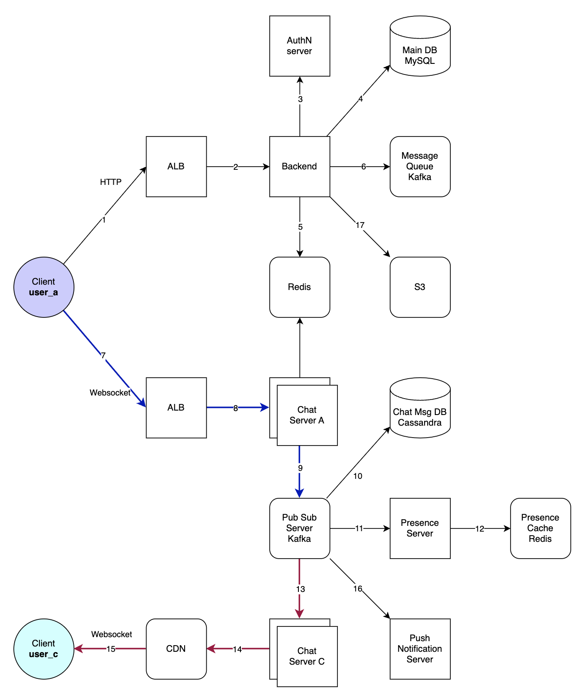

- [Requirements](#requirements)
  - [Functional Requirements](#functional-requirements)
  - [Non-functional Requirements](#non-functional-requirements)
- [Estimation](#estimation)
- [High Level Design](#high-level-design)
  - [Data Base Schema](#data-base-schema)
  - [APIs](#apis)
  - [High-level Architecture](#high-level-architecture)
- [Design Deep Dive](#design-deep-dive)
  - [Service Discovery](#service-discovery)
  - [How many chat server we need?](#how-many-chat-server-we-need)
  - [How to know which chat server hold the connection to which user?](#how-to-know-which-chat-server-hold-the-connection-to-which-user)
  - [How should the server process a 'deliver message' request?](#how-should-the-server-process-a-deliver-message-request)
  - [How does the messenger maintain the sequencing of the messages?](#how-does-the-messenger-maintain-the-sequencing-of-the-messages)
  - [Which storage system for chat messages we should use ?](#which-storage-system-for-chat-messages-we-should-use-)
  - [How should clients eiffiently fetch data form the server ?](#how-should-clients-eiffiently-fetch-data-form-the-server-)
  - [Managing user's status](#managing-users-status)
  - [Partioning Database](#partioning-database)
- [Interview Questions](#interview-questions)
- [References](#references)

-----

# Requirements

## Functional Requirements

* 1on1 chatting between users.
* Acknowledgement for receive and read.
* Keep track of online/offline statuses of users.
* Group chats.
* Share media files.
* push notifications.
* Persistent storage of chat history.

## Non-functional Requirements

* The system supports real-time chat experience with minimum latency.
* The system supports highly-consistent, users can the same chat history on all their devices.
* The system supports highly-availabilty, but lower availability in the interest of consistency.

# Estimation

| Number                                       | Description      |
| -------------------------------------------- | ---------------- |
| 500 M   | DAU (Daily Active Users) |
| 40 | messages per day for each user |
| 20 billion | messager per day  for all users |
| 100 bytes | average data size for one message   |
| 2 TB / day (20 billion * 100 bytes) | storage per day  |
| 3.6 PB (2 TB/day * 365 days * 5 years) | storage for 5 years |
| 25 MB / day (2 TB / 86400 sec) | ingress data size per sec |
| 25 MB / day (2 TB / 86400 sec) | egress data size per sec |
| 2 TB | storage for each day  |
| 3.6 PB | storage for 5 years  |
| 25 MB | ingress data  |
| 25 MB | egress data |

# High Level Design

## Data Base Schema


```
erDiagram
    USERS ||--o{ MESSAGES : "has"
    USERS ||--o{ GROUP_MESSAGES : "has"
    USERS ||--|| PRESENCE : "has"
    USERS }o--o{ FRIENDS : "connected"
    USERS }o--o{ GROUPS : "partOf"
    PRESENCE {
        user_id bigint
        status string
    }
    MESSAGES {
        message_id bigint
        message_fr bigint
        message_to bigint
        content text
        created_at timestamp
    }
    GROUP_MESSAGES {
        channel_id bigint
        message_id bigint
        message_fr bigint
        content text
        created_at timestamp
    }
    FRIENDS {
        user_fr bigint
        user_to bigint
        created_at timestamp        
    }
    GROUPS {
        group_id bigint
        user_id bigint
        created_at timestamp        
    }
```

We can implement `message_id` using following solutions.

- MySQL auto_increment.
- 64-bit sequence number generator like Snowflake. [Designing A Unique ID Generator](/systemdesign/practices/DesigningAUniqeIDGeneratorInDistributedSystems/DesigningAUniqeIDGeneratorInDistributedSystems.md)
- Local sequence number generator inside a chatting session.

## APIs

```c
sendMessage(api_key, msg)
recvMessage(msg, from_user)
```

## High-level Architecture



1. 사용자 A의 클라이언트가 HTTP를 통해 로드 밸런서(LB)에 연결합니다.
2. 로드 밸런서가 사용자 요청을 적절한 백엔드 서버로 전달합니다.
3. 백엔드 서버가 사용자 인증을 위해 AuthN(인증) 서버에 요청합니다.
4. AuthN 서버가 주 데이터베이스(Main DB)에 접근하여 사용자 정보를 읽어옵니다
5. 백엔드 서버가 캐싱 서버인 Redis에 데이터를 저장하거나 조회합니다.
6. 백엔드 서버가 asynchronous job (building chat messages search index) 처리를 위해 메시지 큐인 Kafka로 메시지를 전송합니다.
   1. Redis 에 물어봐서 Web Socket Server 들 중 가장 적당한 것을 얻어옵니다.
7. 사용자 A가 웹소켓 연결을 통해 실시간 통신을 위한 웹소켓 서버에 연결합니다.
8. 웹소켓 서버가 채팅 서버 A로 메시지를 라우팅합니다.
9.  채팅 서버 A가 메시지를 Kafka의 Pub/Sub 시스템에 전달합니다.
10. 채팅 서버 A가 메시지를 Cassandra에 기반한 채팅 메시지 데이터베이스에 저장합니다.
11. Kafka 서버가 사용자의 온라인 상태 정보를 처리하는 프레즌스 서버에 메시지를 전달합니다.
12. 프레즌스 서버가 사용자의 온라인 상태를 캐시하는 데 Redis를 사용합니다.
13. Kafka가 메시지를 다른 채팅 서버인 서버 C에 전달합니다.
14. 채팅 서버 C가 컨텐츠 전송 네트워크(CDN)을 통해 필요한 컨텐츠를 배포합니다.
15. 사용자 C의 클라이언트가 웹소켓을 통해 CDN에서 컨텐츠를 수신합니다.
16. 프레즌스 서버가 사용자의 상태 변화를 푸시 알림 서버로 전송하여 알림을 발송할 수 있도록 합니다.
17. 백엔드 서버가 Amazon S3와 같은 스토리지 서비스에 데이터를 저장하거나 검색합니다.

# Design Deep Dive

## Service Discovery

[Redis](/redis/README.md) is a good solution for discovering chat servers to find a specific user.

## How many chat server we need?

50K connections for one server. Finally 10K servers are suitable for 500 million connectsions a day.

## How to know which chat server hold the connection to which user?

hash map for `{user_id : chat_server_ip}`

## How should the server process a 'deliver message' request? 

* Store the message in the DB
* Send the messag to the receiver
* Send an ack to the sender
* Storing, Sending can be done in background.

## How does the messenger maintain the sequencing of the messages?

Use time stamp in message.

* User-1 sends a message M1 to the Chat-A server for User-2.
* The Chat-A server receives M1 at T1.
* User-2 ends a message M2 to the Chat-B server for User-1.
* The Chat-B server receives M2 at T2. such that T2 > T1.
* Chat servers sends M1 to User-2 and M2 to User-1.

User-1 will see M1 first and then M2, whereas User-2 will see M2 first and then M1.
Client adjust the order of messages by time stamp or message sequnces.

## Which storage system for chat messages we should use ?

NoSQL such [Cassandra](/cassandra/), [DynamoDB](/dynamodb/README.md) are good solutions.

## How should clients eiffiently fetch data form the server ?

[Pagination](/pagination/README.md) is a good solution.

## Managing user's status

* When User-1 logins, it pull status of it's friends.
* When User-1 sends to User-2 that has offline, Chat-A sends a ack with failure and update the status of User-2.
* When User-2 logins, Chat-B broadcast User-2's status to it's friends.
* User-1 can pull the status from Chat-A periodically.

## Partioning Database

* Partitioning based on `user_id` is a good solution.
* Partitioning based on `message_id` is not a good solution because of slow fetching time.

# Interview Questions

- What will happend when the server receives a message for a user who has gone offline ?
  - Store messages and send later
- What will happend when a chat server fails ?
  - Clients will reconnect.
- Should we store multiple copies of user messages ?
  - Reed-Solomon encoding ???
- chat server, websocket server 를 분리한 것의 장점은?
  - chat server 를 roll out 할 때 client 의 접속이 끊어질 필요가 없다. 
- WebSocket 연결이 HTTP 연결과 어떻게 다른가요?
  - WebSocket은 양방향 통신을 지원하는 프로토콜이며, 연결이 지속적으로 유지되어 실시간으로 데이터를 교환할 수 있습니다. HTTP는 기본적으로 단방향 요청/응답 패턴을 가집니다.
- Push Notification Server의 역할은 무엇인가요?
  - 사용자가 오프라인일 때 모바일 기기나 데스크탑에 알림을 보내는 데 사용됩니다.
- 실시간 채팅에서 메시지 순서를 보장하는 방법은 무엇인가요?
  - 메시지 큐와 같은 시스템을 통해 메시지의 순서를 관리하거나, 타임스탬프를 사용하여 클라이언트 측에서 순서를 재정렬할 수 있습니다.
- WebSocket 서버가 스케일링에 직면할 수 있는 문제와 해결 방법은 무엇인가요?
  - WebSocket 서버는 연결 상태를 유지해야 하므로 수평적 스케일링이 어렵습니다. 로드 밸런싱, 스티키 세션, 분산 세션 관리 등의 방법을 사용할 수 있습니다.
- 시스템에서 보안을 유지하기 위한 방법은 무엇인가요?
  - SSL/TLS 암호화, 액세스 제어, 네트워크 보안, 정기적인 보안 감사 및 업데이트 등을 포함할 수 있습니다.
- 분산 시스템에서 시계 동기화 문제를 어떻게 처리하나요?
  - NTP(Network Time Protocol)를 사용하여 서버 간 시간을 동기화하거나, 시간에 민감하지 않은 설계를 고려할 수 있습니다.
- erlang 을 사용했을 때 장점은?
  - WebSocket 서버 구현: Erlang의 OTP 프레임워크를 활용하여 WebSocket 서버를 구현할 수 있습니다. OTP는 동시성과 분산 처리를 위한 강력한 추상화를 제공하며, 높은 연결 수를 감당할 수 있도록 설계되었습니다.
  - Chat Server 구현: Chat server 로직을 Erlang을 사용해 구현할 수 있으며, 여기에는 메시지 라우팅, 사용자 상태 관리, 채팅방 관리 등이 포함됩니다. Erlang의 프로세스 모델은 채팅 시스템에서 발생하는 다양한 동시 작업을 효율적으로 처리할 수 있게 해줍니다.
  - Hot Code Swapping: Erlang은 코드를 실행 중인 노드에서 직접 업데이트하는 hot code swapping을 지원합니다. 이를 통해 WebSocket 서버나 Chat server를 업데이트하는 동안 시스템을 중단하지 않고도 코드 변경을 반영할 수 있습니다.
  - 분산 시스템 구축: Erlang은 분산 시스템 구축에 적합한 언어입니다. 여러 채팅 서버 인스턴스 간의 통신 및 프로세스 관리를 Erlang으로 구현하여 시스템의 확장성과 안정성을 향상시킬 수 있습니다.
  - 내결함성 구현: Erlang의 감시자(supervisor) 트리를 이용하여 서버의 각 컴포넌트를 감시하고, 문제가 발생했을 때 자동으로 복구하도록 구성할 수 있습니다.
  - Presence Server 구현: Erlang은 분산 시스템에서의 노드 간 통신에 탁월하기 때문에, Presence server를 구현하여 사용자의 연결 상태를 관리하는 데에도 사용할 수 있습니다.
  - 메시지 큐 처리: Kafka와 같은 메시지 큐 시스템을 Erlang으로 처리할 수 있으며, Erlang의 비동기 메시지 패싱 패러다임을 활용하여 시스템 간의 느슨한 결합을 유지할 수 있습니다.
- Client 와 Websocket Server 사이에 ALB 를 사용했을 때 장점은?
  - 스케일링과 분산 처리: ALB는 트래픽의 부하를 여러 서버 인스턴스에 균등하게 분산시켜줍니다. 이는 WebSocket 서버의 수평적 확장을 가능하게 하여 피크 시간에도 서비스의 안정성을 보장합니다.
  - 지연 시간 최소화: 클라이언트의 요청을 지리적으로 가장 가까운 서버로 라우팅함으로써, 지연 시간을 최소화할 수 있습니다.
  - 유연한 관리: ALB를 통해 트래픽을 조정하고 관리하면, 서버를 업데이트하거나 유지보수할 때 트래픽을 유연하게 리디렉션할 수 있습니다.
  - 장애 격리: 특정 서버 인스턴스에 문제가 발생했을 때, ALB가 자동으로 건강한 인스턴스로 트래픽을 리디렉션함으로써 장애를 격리하고 서비스 중단을 방지합니다.
  - 보안: ALB는 SSL/TLS 종료와 같은 보안 기능을 제공함으로써 보안 향상에 기여할 수 있습니다. 이는 보안 인증서 관리를 중앙화하고, 서버 자체의 부하를 줄일 수 있습니다.
  - WebSocket 연결 상태 유지: 일부 ALB는 스티키 세션(sticky sessions) 기능을 제공하여 클라이언트의 연결 상태를 유지할 수 있습니다.

# References

- [대규모 채팅 아키텍처는 C10K 문제를 어떻게 해결할까?](https://catchdream.tistory.com/m/249)
- [WHATSAPP System Design: Chat Messaging Systems for Interviews | youtube](https://www.youtube.com/watch?v=vvhC64hQZMk)
* [소개 - 슬랙이 수백만 메시지를 실시간으로 보내는 방법 (슬랙 메시징 구조) | youtube](https://www.youtube.com/watch?v=36F35JZXFKo)
* [01. 2200만 사용자를 위한 채팅 시스템 아키텍처](https://www.youtube.com/watch?v=lCxgddyxDyg)
  * 당근마켓의 채팅시스템
  * Redis 로 user 가 어느 server 에 접속해 있는지 저장
  * Primary DB 로 DynamoDB 사용
  * fluentbit 을 Kafka 전송에 대한 buffer 로 사용. Kafka 에 장애가 발생해도 message 유실을 막을 수 있다.
* [How Slack Works | youtube](https://www.youtube.com/watch?v=WE9c9AZe-DY)
* [Scaling Slack - The Good, the Unexpected, and the Road Ahead | youtube](https://www.youtube.com/watch?v=_M-oHxknfnI)
* [WhatsApp-Engineering Inside-1](https://medium.com/codingurukul/whatsapp-engineering-inside-1-1ef4845ff784)
  * [WhatsApp-Engineering Inside-2](https://medium.com/codingurukul/whatsapp-engineering-inside-2-bdd1ec354748)
* [WhatsApp System Design](https://www.passionatestar.com/whatsapp-system-design/)
* [How to Build a Chat Application with Amazon ElastiCache for Redis | aws](https://aws.amazon.com/ko/blogs/database/how-to-build-a-chat-application-with-amazon-elasticache-for-redis/)
  * [src](https://github.com/aws-samples/elasticache-refarch-chatapp)
* [Spring websocket chatting server(3) – 여러대의 채팅서버간에 메시지 공유하기 by Redis pub/sub](https://daddyprogrammer.org/post/4731/spring-websocket-chatting-server-redis-pub-sub/)
  * [src](https://github.com/codej99/websocket-chat-server/tree/feature/redis-pub-sub)
