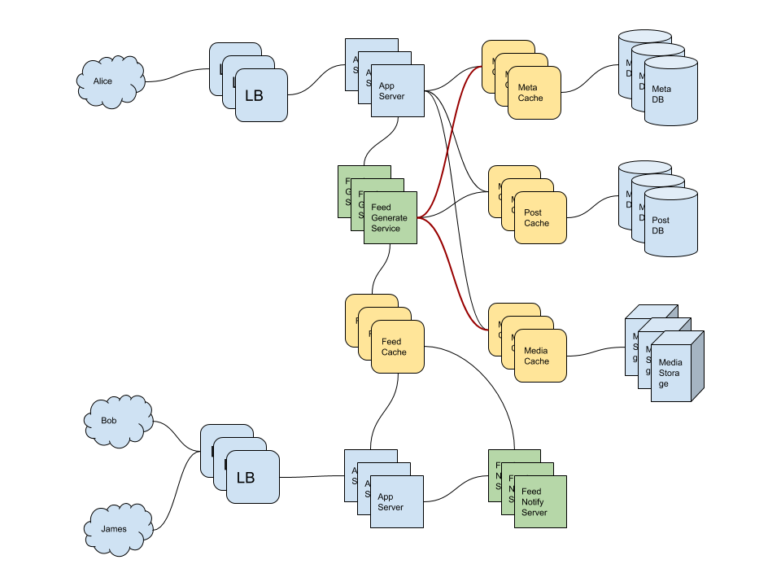

- [Requirements](#requirements)
  - [Functional Requirements](#functional-requirements)
  - [Non-functional Requirements](#non-functional-requirements)
- [Estimation](#estimation)
  - [Traffic Estimates](#traffic-estimates)
  - [Storage Estimates](#storage-estimates)
- [High Level Design](#high-level-design)
  - [System APIs](#system-apis)
  - [Database Schema](#database-schema)
  - [Components](#components)
  - [Feed Generation](#feed-generation)
  - [Feed Publishing](#feed-publishing)
- [Low Level Design](#low-level-design)
  - [Feed Generation](#feed-generation-1)
  - [Feed Publishing](#feed-publishing-1)
    - [Pull or Fand-out-on-load](#pull-or-fand-out-on-load)
    - [Push or Fan-out-on-write](#push-or-fan-out-on-write)
    - [Hybrid](#hybrid)
  - [How to rank posts](#how-to-rank-posts)
  - [Shard](#shard)
- [Extentions](#extentions)
- [Q&A](#qa)
- [Implementation](#implementation)
- [References](#references)

-----

# Requirements

## Functional Requirements

* Facebook newsfeed is generated based on the posts from the people, pages, and groups.
* Users follow other users, pages, groups.
* Feeds contain images, videos, text.
* The system append new posts to alive user's feed as they arrive.

## Non-functional Requirements

* The system generate uers' newsfeed in realtime and maximum latency could be 2 sec.

# Estimation

## Traffic Estimates

| Number                                       | Description      |
| -------------------------------------------- | ---------------- |
| 300   | average follows of users |
| 200 | average follows of pages |
| 300 M | DAU |
| 5 times | average checking times of a user |
| 1.5 B (300 M * 5) | Total checking times of users in a day |
| 17,500 (1.5 B / 86400) | aprozimate requests per day |

## Storage Estimates

| Number                                       | Description      |
| -------------------------------------------- | ---------------- |
| 500 posts   | average posts of a user to check |
| 1 KB | average size of a post |
| 500 KB (500 posts * 1 KB) | average post size of a user |
| 150 TB (500 KB * 300 M) | average posts size of users in a day |
| 1500 machines (150 TB / 100 GB) | number of machines for storing posts |
# High Level Design




## System APIs

```
get_user_feed(
  api_key,
  user_id,
  from_date,
  to_date,
  per_page,
  page,
  exclude_replies
  )

since: from date time
exlucde_replies: include replies or not
```

## Database Schema

```sql
CREATE TABLE user (
    user_id int PRIMARY KEY,
    username text,
    password text,
    email text,
    dateofbirth timestamp,
    created_at timestamp,
    last_login timestamp
);

CREATE TABLE entity (
    entity_id int PRIMARY KEY,
    type int,
    description text,
    created_at timestamp,
    category int,
    phone text,
    email text
);

CREATE TABLE user_follow (
    user_id int,
    entity_id int,
    type int,
    PRIMARY KEY (user_id, entity_id)
);

CREATE TABLE feed_item (
    feed_item_id int PRIMARY KEY,
    user_id int,
    contents text,
    entity_id int,
    latitude int,
    longitude int,
    created_at timestamp,
    likes int
) WITH CLUSTERING ORDER BY (created_at DESC);

CREATE TABLE feed_media (
    feed_item_id int,
    media_id int,
    PRIMARY KEY (feed_item_id, media_id)
);

CREATE TABLE media (
    media_id int PRIMARY KEY,
    type int,
    description text,
    path text,
    latitude int,
    longitude int
) WITH CLUSTERING ORDER BY (created_at DESC);
```

## Components

* Web servers
* Application servers
* Metadata DataBase and Cache
* Posts DataBase and cache
* Video and Photo Storage and cache
* Newsfeed generation Service
* Feed notification service

## Feed Generation

* Gather ids of all users and entities that Alice follows.
* Gather latest, popular posts of users that Alice follows.
* Rank those posts.
* Store these feeds in the cache and return posts of one page.

## Feed Publishing

* When users that Alice follows post new one, the system notify those to Alice. 

# Low Level Design

## Feed Generation

```
SELECT feed_item_id 
  FROM feed_item
 WHERE entity_id in (
   SELECT entity_id 
     FROM user_follow 
    WHERE user_id = <alice-user-id>
 )
```

* In case of users have many followers, system have to store, merge, rank huge number of posts.
* The system needs to pre-generate the timeline and store it in a memory.
* We were supposed to store 500 posts for a user. But 
most of users would check a few page so 200 posts are enough.
* Most of users don't login every day. Let's keep it in cache with LRU eviction algorithm.

## Feed Publishing

* we need to limit max size of per_page with 100.
* we need to default size of per_page with 20.

### Pull or Fand-out-on-load

* Clients will pull when they need feeds.
* This dosn't update new feed without latency.

### Push or Fan-out-on-write

* Servers push to client when there is a new post.
* There must be TCP connection servers.
* TCP connections servers can make a lot of traffics.

### Hybrid

* Fan-out-on-load to users follow a lot of users.
* Fan-out-on-write to users follow a few users.

## How to rank posts

* By created_at.
* machine learning for relavance.

## Shard

* Meta DataBase by user_id. Consistent Hashing.
* Posts DataBase by user_id. Consistent Hashing.

# Extentions

# Q&A

# Implementation

* [fb-clone @ github](https://github.com/rOluochKe/fb-clone)

# References

* [System Design Mock Interview (Dropbox Software Engineer): Design Facebook Newsfeed @ youtube](https://www.youtube.com/watch?v=PDWD6IqU_nQ)
* [Designing Instagram: System Design of News Feed @ youtube](https://www.youtube.com/watch?v=QmX2NPkJTKg)
* [Twitter system design | twitter Software architecture | twitter interview questions @ youtube](https://www.youtube.com/watch?v=wYk0xPP_P_8)
