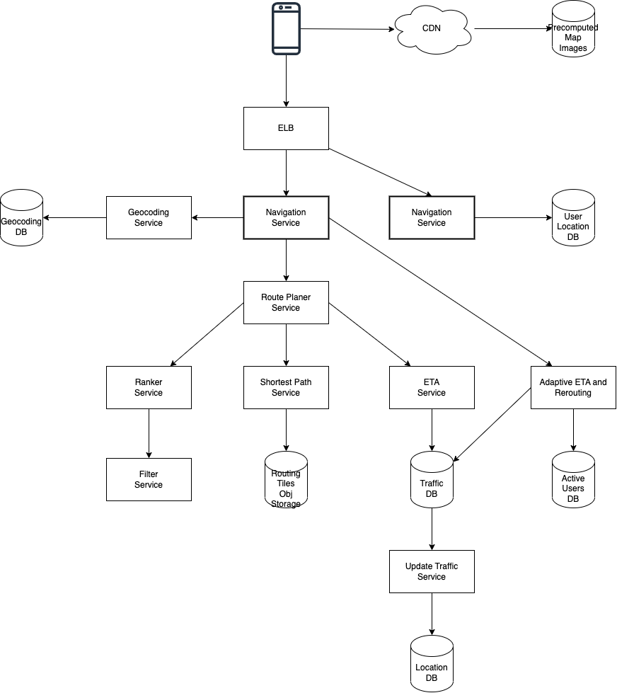

- [Requirements](#requirements)
  - [Functional Requirements](#functional-requirements)
  - [Non-Functional Requirements](#non-functional-requirements)
  - [Estimation](#estimation)
- [High Level Design](#high-level-design)
  - [Map 101](#map-101)
    - [Partitioning System](#partitioning-system)
    - [Going From 3d to 2d](#going-from-3d-to-2d)
    - [Geocoding](#geocoding)
    - [Geohashing](#geohashing)
  - [System Architecture](#system-architecture)
    - [System Architecture Diagram](#system-architecture-diagram)
    - [Location Service](#location-service)
    - [Navigation Service](#navigation-service)
    - [Map Rendering](#map-rendering)
- [High Level Design Deep Dive](#high-level-design-deep-dive)
  - [Data](#data)
    - [Routing Tiles](#routing-tiles)
    - [User Location](#user-location)
    - [Places](#places)
    - [Precomputed Images](#precomputed-images)
  - [Services](#services)
    - [Location Service](#location-service-1)
    - [Rendering Map](#rendering-map)
  - [Navigation Service](#navigation-service-1)
    - [Geocoding Service](#geocoding-service)
    - [Route Planner Service](#route-planner-service)
    - [Shortest Path Service](#shortest-path-service)
    - [ETA Service](#eta-service)
    - [Ranker Service](#ranker-service)
    - [Update Traffic Service](#update-traffic-service)
    - [Adaptive ETA and rerouting](#adaptive-eta-and-rerouting)
  - [Delivery Protocols](#delivery-protocols)

-----

# Requirements

## Functional Requirements

* Client is a mobile device.
* Update user locations.
* Navitation service, ETA service.
* Render maps.

## Non-Functional Requirements

* It should provide right directions.
* Map rendering should be smoothing.
* The client uses a little data and battery.
* It should provide general availability and scalability.

## Estimation

| Number | Description | Calculation |
|--|--|--|
| 1 foot | 0.3048 meters | |
| 1 km | 0.6214 miles | |
| 21 levels | Max level of details | |
| 4.3 trillion tiles | The number of tiles at 21 LOD | |
| 256 * 256 | The number of pixels of 1 tile | |
| 100 KB | The size of 1 tile image | |
| 440 PB | The size of 4.3 trillion tiles images | 4.4 trillion * 100 KB |
| 50 PB | The size of useful area except oceans, deserts, lakes and mountains | 440 PB * 10 % | 

We need images of all LOD. The total size is almost `67PB`. Finally
we can say we need `100PB` roughly.

`50 + 50 / 4 + 50 / 16 + 50 / 64 + ... =~ 67PB`

There are two kins of requests including **navagation request**, **update request**.

| Number | Description | Calculation |
|--|--|--|
| 1 billion | DAU | |
| 35 minutes | Average **navigation request** time for a user per a week | |
| 35 billion minutes | Average **navigation request** time for all users per week | |
| 5 billion minutes | Average navigation request time for all users per day | `35 billion mins / 7 days` |
| 300 billion reqs | GPS **update request** for all users per day | `5 billion mins * 60` |
| 3 million | QPS | `300 billion reqs / 100,000` |
| 15 secs | The seconds of one GPS update request batch | |
| 200,000 | QPS with the batching | 3 million / 15 secs |
| 1 million | Peak QPS | 200,000 * 5 |

# High Level Design

## Map 101

### Partitioning System

**Lat (Latitude)** denotes how far north or south.

**Long (Longitude)** denotes how far east or west.

### Going From 3d to 2d

Projection is mapping coordinates from 3d to 2d.

Google Maps choosed [Web Mercator](https://en.wikipedia.org/wiki/Web_Mercator_projection) for projection.

### Geocoding

Geocoding is converting addresses to geographic coordinates. `1600 Amphitheatre Parkway, Mountain View, Ca` is geocoded to `latitude 37.xx, longitude - 122.xx`.

Reverse geocoding is the opposite of geocoding.

### Geohashing

[Geohash](/systemdesign/practices/DesigningProximityService/DesigningProximityService.md#geohash)

## System Architecture

### System Architecture Diagram



### Location Service

The location service updates locations of users. The client send the batch of locations (15s) and this will decrease traffic of writing locations.

The user location db is write-heavy and has huge data. [cassandra](/cassandra/README.md) can be a good solution.

```c
* POST /v1/locations
  * Request: 
    * locs: JSON encoded array of (userid, latitude, longitude, timestamp) tuples.
```

### Navigation Service

The navigation service finds a route from A to B.

```c
* GET /v1/nav?src=1355+market+street, SF&dst=Disneyland
  * Response:

{
    'distance': {'text':'0.2 mi', 'value': 259},
    'duration':
    'end_location':
    'html_instructions':
    'polyline':
    'start_location':
    'geocoded_waypoints':
    'travel_mode': 'DRIVING'
}
```

### Map Rendering

The map tiles are static and pre-generated on fixed sets of grids. The client get a image by location, LOD (Level Of Detail) from CDN.

This is an example of URL which represents the specific tile.

```c
https://cdn.iamslash.com/tiles/9a9hvu.png
```

# High Level Design Deep Dive

## Data

### Routing Tiles

We can have routing tile images from other ways.

The routing tile processing service will make metadata periodically.

The routing tile metadata has followings.

* graph nodes
* edges between graph nodes
* roads

We can use object store for routing tile images with metadata.

### User Location

We can use [cassandra](/cassandra/README.md) for the user location data. [cassandra](/cassandra/README.md) is suitable for write-heavy workloads, high availabel system. 

This is an example of user location table.

| name | description |
| --- | --- |
| userid | 101 |
| timestamp | 1635740977 |
| latitude | 20.0 |
| longitude | 30.5 |
| user_mode | active |
| driving_mode | driving |

### Places

We can use [Redis](/redis/README.md) for the geocoding database.

### Precomputed Images

We can use AWS S3 for the storage of precomputed images. It can be cached by CDN.

## Services

### Location Service

We have `1 million` location updates per second. [cassandra](/cassandra/README.md) is appropriate.

The composite key is `(user_id, timestamp)`. `user_id` is a partition key. `timestamp` is a clustering key. All data with the same partition key are stored stored in physically and ordered by `timestamp`.

This is an example of user location table.

| name | description |
| --- | --- |
| userid | 101 |
| timestamp | 1635740977 |
| latitude | 20.0 |
| longitude | 30.5 |
| user_mode | active |
| driving_mode | driving |

### Rendering Map

???

## Navigation Service

### Geocoding Service

The geocoding service converts the address to geocode.

```c
https://maps.googleapis.com/maps/api/geocode/json?address=1600+Amphitheatre+Parkway,+mountain+View,+CA

{
    "results" : [
        "formatted_address": "",
        "geometry" : {
            "location" : {
                "lat" : ,
                "lng" :
            }
            "location_type" : "ROOFTOP",
            "viewport" : {
                "northeast" : {
                    "lat" : ,
                    "lng" : 
                },
                "sourtheast" : {
                    "lat" : ,
                    "lng" :
                }
            }
        },
        "place_id" : "",
        "plus_code": {
            "compound_code" : "",
            "global_code" : ""
        },
        "types": ["street_address"]
    ],
    "status" : "OK"
}
```

### Route Planner Service

The route planner get the shorted-path using other services.

### Shortest Path Service

The shortest path service receives the source and destination address. It offers shortes path with the algorithm such as `A*`. It can cache it because the graph data is not changed frequently.

### ETA Service

Once the route planner service receives a list of shortest paths, it send the data to ETA service to get a time estimate. The eta service can use [Machine Leanring](/machinelearning/README.md) with the traffic and hitory data.

### Ranker Service

After the router planner service get the ETA predictions, it sends this to the ranker service to get filtered or sorted data.

### Update Traffic Service

The update traffic service update traffic data asynchronously. This helps the shortest path service to be more accurate.

### Adaptive ETA and rerouting

???

## Delivery Protocols

The server should send data to the client. [websocket](/websocket/README.md) is a good solution.

The mobile push notification is limited for example, 4KB for iOS.
