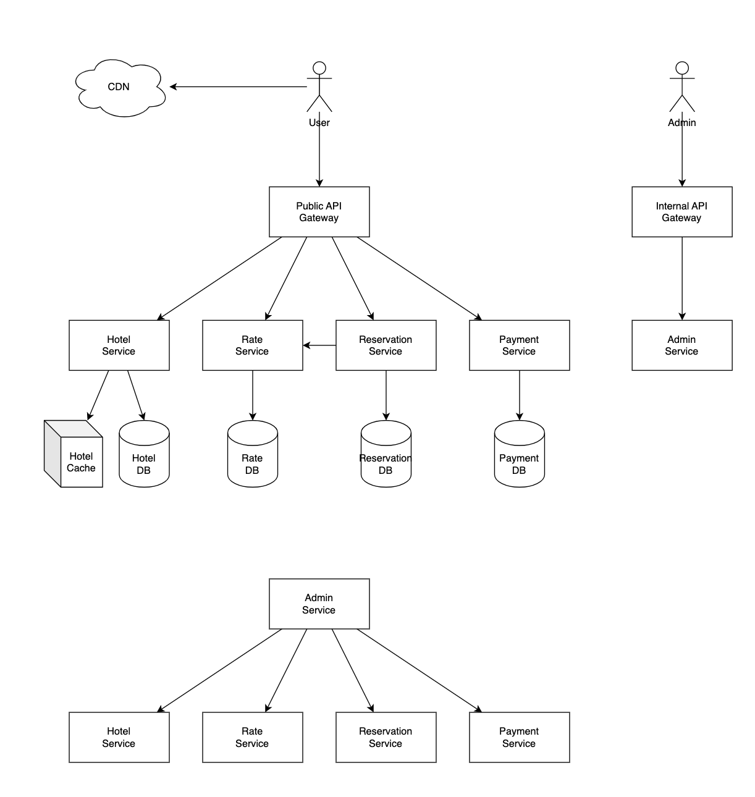

- [Requirements](#requirements)
  - [Functional Requirement](#functional-requirement)
  - [Non-Functional Requirement](#non-functional-requirement)
  - [Estimation](#estimation)
- [High Level Design](#high-level-design)
  - [API Design](#api-design)
  - [Data Model Design](#data-model-design)
  - [High-Level Architecture](#high-level-architecture)
- [High Level Design Deep Dive](#high-level-design-deep-dive)
  - [Reservation By Room Type](#reservation-by-room-type)
  - [Concurrency Issues](#concurrency-issues)
  - [Scalability](#scalability)
    - [Database Sharding](#database-sharding)
    - [Caching](#caching)
  - [Data Consistency Among Services](#data-consistency-among-services)
- [Questions](#questions)
- [References](#references)

----

# Requirements

## Functional Requirement

* Show the hotel related page.
* Show the hotel room-related detail page.
* Reserve a room.
* Admin console to add/remove/update hotel or room info.
* Support the overbooking.
* The price of a hotel room can be changed.

## Non-Functional Requirement

* High concurrency
  * Many people can try to reserve a same room.
* Moderate latency
  * The latency should be small.

## Estimation

| Number | Description | Calculation |
|--|---|--|
| 5,000 | The number of hotels | |
| 1 Million | The number of rooms | |
| 70 % | occupied ratio | |
| 3 days | average stay duration | |
| 240,000 | daily reservation | 1 million x 0.7 / 3 = 233,333 |
| 3 | reservations per sec | 240,000 / 100,000 sec = 3 |
| 300 QPS | View hotel/room detail | |
| 30 QPS | Order booking page | |
| 3 QPS | Reserve rooms | |

# High Level Design

## API Design

```json
* Hotel APIs
  * GET /v1/hotels/<id>
  * POST /v1/hotels
  * PUT /v1/hotels/<id>
  * DELETE /v1/hotels/<id>

* Room APIs
  * GET /v1/hotels/<hotel-id>/rooms/<room-id>
  * POST /v1/hotels/<hotel-id>/rooms
  * PUT /v1/hotels/<hotel-id>/rooms/<room-id>
  * DELETE /v1/hotels/<hotel-id>/rooms/<room-id>

* Rservation APIs
  * GET /v1/reservations
  * GET /v1/reservations/<reserve-id>
  * POST /v1/reservations
    * Request
    {
        "startDate": "2022-03-01",
        "endDate": "2022-03-04",
        "hotelID": "333",
        "roomID": "U1122",
        "reservationID": "12231"
    }
  * DELETE /v1/reservations/<reserve-id>
```

## Data Model Design

* Hotel Service
  * hotel
    * hotel_id (PK)
    * name
    * address
    * location
  * room
    * room_id (PK)
    * room_type_id
    * floor
    * number
    * hotel_id
    * name
    * is_available

* Rate Service
  * room_type_rate
    * hotel_id (PK)
    * date (PK)
    * rate

* Reservation Service
  * reservation
    * reservation_id (PK)
    * hotel_id
    * room_id
    * srtart_date
    * end_date
    * status
    * guest_id

* Guest Service
  * guest
    * guest_id (PK)
    * first_name
    * last_name
    * email

There are **status** of **reservation** table 

* pending
* canceled
* paid
* rejected
* refunded

## High-Level Architecture



# High Level Design Deep Dive

## Reservation By Room Type

Users can make a reservation not by `room_id` but by `room_type`. We can improve the design for reservating by room type. 

This is a improved API.

```json
* Rservation APIs
  * POST /v1/reservations
    * Request
    {
        "startDate": "2022-03-01",
        "endDate": "2022-03-04",
        "hotelID": "333",
        "roomTypeID": "23483727",
        "reservationID": "12231"
    }
```

These are improved database schemas.

* Hotel Service
  * hotel
    * hotel_id (PK)
    * name
    * address
    * location
  * room
    * room_id (PK)
    * room_type_id
    * floor
    * number
    * hotel_id
    * name
    * is_available

* Rate Service
  * room_type_rate
    * hotel_id (PK)
    * date (PK)
    * rate

* Reservation Service
  * room_type_inventory
    * hotel_id
    * room_type_id
    * date
    * total_inventory
    * total_reserved
  * reservation
    * reservation_id (PK)
    * hotel_id
    * room_id
    * srtart_date
    * end_date
    * status
    * guest_id

* Guest Service
  * guest
    * guest_id (PK)
    * first_name
    * last_name
    * email

These are access patterns.

Select rows within a date range.

```sql
SELECT date,
       total_inventory,
       total_reserved
  FROM room_type_inventory
 WHERE room_type_id = ${roomTypeId} AND
       hotel_id = ${hotelId} AND
       date BETWEEN ${startDate} and ${endDate}
```

Thie SQL returns data like this.

| date | total_inventory | total_reserved |
|--|--|--|
| 2021-07-01 | 100 | 97 |
| 2021-07-02 | 100 | 96 |
| 2021-07-03 | 100 | 95 |

For each entry, check the condition.

```c
if ((total_reserved + ${numberOfRoomsToReserve}) <= 110 % * total_inventory)
```

What if data is very big we can think two strategies.

* Use **hot sorage** for recent data, **cold storage** for old data.
* Database sharding. Shard key is hotel_id. The date will be sharded by `hash(hoteL_id) % number_of_db`.

## Concurrency Issues

Solutions for double booking problems of one users.

1. Prohibit double click on client-side.
2. Make APIs idempotent on same reservation.

Solutions for race condition of two users.

1. Pessimistic locking
2. Optimistic locking
3. Database constraints

These are SQLs for business logic.

```sql
-- step 1: Check room inventory
SELECT date,
       total_inventory,
       total_reserved
  FROM room_type_inventory
 WHERE room_type_id = ${roomTypeId} AND
       hotel_id = ${hotelId} AND
       date BETWEEN ${startDate} AND ${endDate}

if ((total_reserved + ${numberOfRoomsToReserved}) > 110% * total_inventory) {
  Rollback
}        

-- step 2: reserve rooms
UPDATE room_type_inventory
   SET total_reserved = total_reserved + ${numberOfRoomsToReserve}
 WHERE room_type_id = ${roomTypeId} AND
       date BETWEEN ${startDate} AND ${endDate} 

-- step 3: commit
Commit  
```

**Pessimistic locking**

Use `SELECT ... FOR UPDATE`. It will provide serializable isolation temporally. [isolation](/isolation/README.md#solution-of-non-repeatable-read-in-repeatable-read-isolation-level)

> Pros:

* It is easy to implement.
* It is suitable heavy contention data.

> Cons:

* Reduce system throughputs.
* Deadlocks may occur.

**Optimistic locking**

[Optimistic Locking](/systemdesign/README.md#optimistic-lock-vs-pessimistic-lock) is
faster than pessimistic locking.

> Pros:

* No need to lock the database.
* It is a good solution when data conflicts are rare.

> Cons:

* When data conflicts are so often it will reduce system throughputs.

The optimistic locking is a good option than Pessimistic locking when TPS is low.

**Database constraints**

```sql
CONSTRAINT `check_room_count` CHECK((`total_inventory - total_reserved` >= 0))
```

> Pros:

* Easy to implement.
* It is a good solution when data conflicts are rare.

> Cons:

* It is similar with optimistic locking.
* Contraint is not under control of SCM such as [git](/git/README.md).
* Not all database support constraints.
  
The constraint is a good option than Pessimistic locking when TPS is low.

## Scalability

The scalability is important when the QPS is 1,000 times higher than before like booking.com.

### Database Sharding

Shard data by `hotel_id % shard_num`. If QPS is `30,000` and the number of shards is `16`, Each shard handles `30,000 / 16 = 1,875` QPS.

- [Sharding](/systemdesign/README.md#sharding)

### Caching

Inventory cache is a good solution for room inventory write heavy system. [Redis](/redis/README.md) is a good solution.

```
key: hotelID_roomTypeID_{date}
val: the number of available rooms for the given hotel ID, room type ID and date
```

[Debezium](/Debezium/README.md) is a good solution for CDC from [MySQL](/mysql/README.md) to [Redis](/redis/README.md).

> Pros:

- Reduced database load.
- High Performance.

> Cons:

- The consistency between database and cache is difficult. We need to handle inconsistency. 

## Data Consistency Among Services

There are two solutions such as [2 Phase Commit](/distributedtransaction/README.md#2-phase-commit) and [SAGAS](/distributedtransaction/README.md#saga).

# Questions

- Design the hotel reservation system. The write QPS is 3.
- Design APIs.
- Design data models.
- How to handle conccurrency issues for the same room reservation of one user?
- How to handle concurrency issues for the same room reservation of two users?
- What is the isolation level of RDBMS?
- What if QPS is 1,000 times higher like booking.com?
  - Sharding for write APIs
  - Caching for read APIs 
- How to handle distributed transactions?
  - 2 phase commit
  - SAGAS

# References

* [RestAppHotelbooking | java](https://github.com/BogushAleksandr/RestAppHotelbooking)
* [Booking Application | go](https://github.com/revel/examples/blob/master/README.md)
* [Hotel Reservation Management System | python](https://github.com/rub9542/Hotel-Reservation-Management-System)
