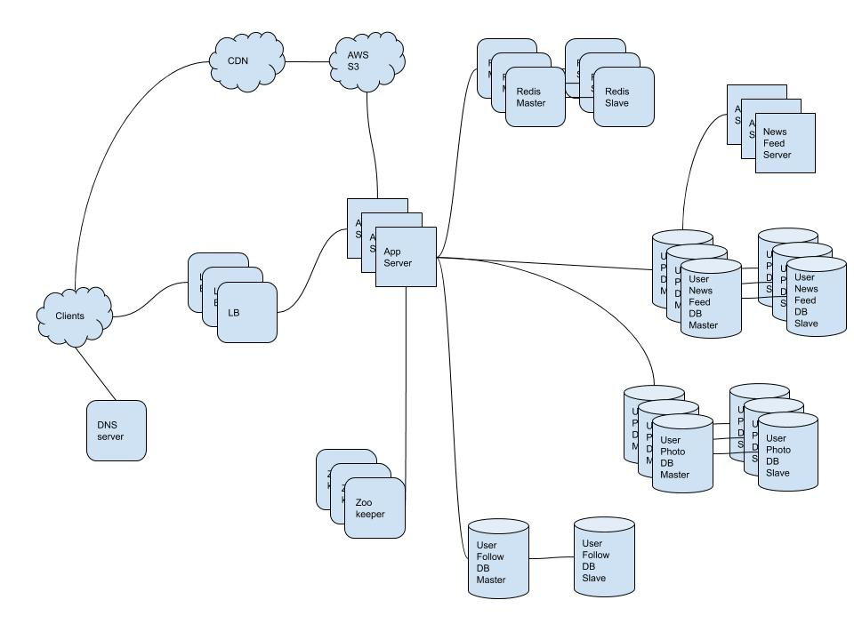

- [Requirements](#requirements)
  - [Functional Requirements](#functional-requirements)
  - [Non-Functional Requirements](#non-functional-requirements)
- [Estimation](#estimation)
  - [Traffic estimates](#traffic-estimates)
  - [Storage estimates](#storage-estimates)
  - [Memory estimates](#memory-estimates)
  - [High-level estimates](#high-level-estimates)
- [High Level Design](#high-level-design)
- [Low Level Design](#low-level-design)
  - [System APIs](#system-apis)
  - [Photo files](#photo-files)
  - [Meta Data Base](#meta-data-base)
  - [Meta Data Base Schema](#meta-data-base-schema)
    - [Photo](#photo)
    - [User](#user)
    - [UserFollow](#userfollow)
  - [Data Base Estimates](#data-base-estimates)
    - [Photo](#photo-1)
    - [User](#user-1)
    - [UserFollow](#userfollow-1)
  - [Reliability and Redundancy](#reliability-and-redundancy)
  - [Data Sharding](#data-sharding)
  - [Ranking and News Feed Generation](#ranking-and-news-feed-generation)
  - [News Feed Creation with Sharded Data](#news-feed-creation-with-sharded-data)
- [Extention](#extention)
  - [Cache and Load Balancing](#cache-and-load-balancing)
- [Q&A](#qa)
- [References](#references)

----

# Requirements

## Functional Requirements

* Users can upload/download/view/search photos.
* Users can follow others.
* The system generates user's new feed.

## Non-Functional Requirements

* Higly Available
* Higly Reliable. All photos, videos should not be lost.
* The maximum latency is 200ms for news feed generation.
* use cannot see a photo for a while.

# Estimation

## Traffic estimates

| Number                                       | Description      |
| -------------------------------------------- | ---------------- |
| 500 M   | Total Users |
| 1 M   | Daily Active Users |
| 2 M per day | New Photos Per Day |
| 23 | New Photos Per Second |
| 200 KB | Average Photo File Size |

## Storage estimates

| Number                                  | Description                                        |
| --------------------------------------- | -------------------------------------------------- |
| 2 M * 200 KB = 400 GB      | Total data size of photos for 1 day |
| 400 GB * 365 days * 10 years ~= 1425 TB  | Total data size of photos for 10 years            |

## Memory estimates

* **80-20 rule** : 20 % generates 80 % of traffics. Let's cache these 20% hot pastes.

| Number               | Description                            |
| -------------------- | -------------------------------------- |
| 0.2 * 400 GB = 80 GB  | The number of cache for read per day   |

## High-level estimates

| Number          | Description                       |
| --------------- | --------------------------------- |
| 1425 TB           | Storage for 10 years              |
| 80 GB           | The number of memory to be cached per day |

# High Level Design

* Amazon RDS supports 16 TB storage. [Amazon RDS, 최대 16TB 크기의 데이터베이스 스토리지 및 MySQL, MariaDB, Oracle, PostgreSQL 엔진의 빠른 확장 지원](https://aws.amazon.com/ko/about-aws/whats-new/2017/11/amazon-rds-now-supports-database-storage-size-up-to-16tb-and-faster-scaling-for-mysql-mariadb-oracle-and-postgresql-engines/)
* Application Servers can be divided into Write Application Servers, Read Application Servers
* Uploading process might be slow, What about using Message Queue and Upload Application Servers?



# Low Level Design

## System APIs

```c
upload(apikey, user_name, photo_data, photo_latitude, photo_longitude, created_at)

download(apikey, photo_url)

viewnewsfeed(apikey, user_name)
```

## Photo files

HDFS or S3

## Meta Data Base

MySQL or MongoDB or Cassandra

## Meta Data Base Schema

### Photo

| **PhotoId: int** | UserId: int | PhotoPath: varchar(256) | PhotoLatitude: int | PhotoLongitude: int | UserLatitude: int | UserLongitude: int | CreatedAt: datetime |
|---|---|--|--|--|--|--|--|
| 123 | 111 | s3://aaaa/aaa/a.png | 1 | 1 | 1 | 1 | 2019-09-03 09:00:00 |

### User

| **UserId: int** | Name: carchar(20) | Email: varchar(30) | DateOfBirth: datetime | CreatedAt: datetime | LastLogin: datetime |
|---|---|--|--|--|--|
| 123 | iamslash@gmail.com | 2019-09-03 09:00:00 | 2019-09-03 09:00:00 | 2019-09-03 09:00:00 |

### UserFollow

| UserId1 | UserId2 | createdAt | modifiedAt |
|---|---|--|--|
| iamslash | johndoe | 2019-09-03 09:00:00 | 2019-09-03 09:00:00 |

## Data Base Estimates

int, datetime is 4 bytes.

### Photo

`PhotoId (4 bytes) + UserId (4 bytes) + PhotoPath (256 bytes) + PhotoLatitude (4 bytes) + PhotoLongitude (4 bytes) + UserLatitude (4 bytes) + UserLongitude (4 bytes) + CreatedAt (4 bytes) = 284 bytes`

| Number          | Description                       |
| --------------- | --------------------------------- |
| 2 M * 284 bytes ~= 0.5 GB per day          | meta data size per day | 
| 0.5 GB * 10 years * 365 days != 1.88 TB | meta data size per 10 years |

### User

`UserId (4 bytes) + Name (20 bytes) + Email (32 bytes) + DateOfBirth (4 bytes) + CreatedAt (4 bytes) + LastLogin (4 bytes) = 68 bytes`

| Number          | Description                       |
| --------------- | --------------------------------- |
| 500 M * 64 bytes ~= 32 GB           | user meta data size | 

### UserFollow

`UserId1 (4 bytes) + UserId2 (4 bytes) = 8 bytes`

| Number          | Description                       |
| --------------- | --------------------------------- |
| 500 M * 500 followers * 8 bytes ~= 1.82 TB           | user follow meta data size | 
| 1.88 TB + 32 GB + 1.82 TB ~= 3.7 TB          | `Photo, User, UserFollow` meta data size for 10 years | 

## Reliability and Redundancy

* MySQL Master - Slave
* Auto scaled application Servers
* SLA of AWS S3 is 99.999999999%

## Data Sharding

* Let's use 16 shards and shardid is UserID % 16.
* Specific shard by userID has all photos by userID.
* PhotoID is `{UserID 8 bytes}{Photo sequence: 2 bytes}`.
* What if photo files by specific UserID are too big?
  * Photos should be distributed by PhotoID.
* We can start 4 physical machines for 16 shards. When we need to seperate shards we can start 16 physical machines updating client database config files.

## Ranking and News Feed Generation

* One user has top 100 photos of following users for news feed.
* Read 100 photos of following users, Sort by recency, likeness, return top 100 photos.
* To improve the efficiency, pregenerate the news feed and store it in a sperate space.

## News Feed Creation with Sharded Data

Let's think about photoID more. Our system makes 23 photos per second. Finally we need `23 * 1.6 billion seconds = 36.8 billion photos` for 50 years.

```
86400 sec/day * 365 (days a year) * 50 (years) => 1.6 billion seconds
```

What about using `{timestamp: 52 bits}{photo sequence: 12 bits}` ???

# Extention

## Cache and Load Balancing

# Q&A

# References

* [Scaling Instagram Infrastructure @ youtube](https://www.youtube.com/watch?v=hnpzNAPiC0E)
