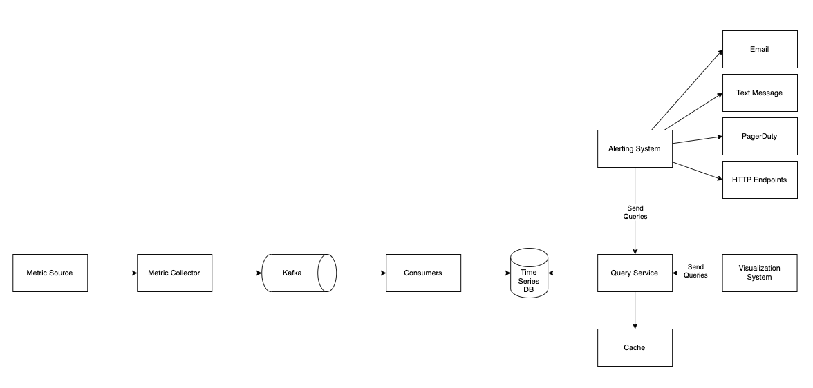

- [Requirements](#requirements)
  - [Functional Requirements](#functional-requirements)
  - [Non-Functional Requirements](#non-functional-requirements)
- [High Level Design](#high-level-design)
  - [Components](#components)
  - [Data Model](#data-model)
    - [Data Access Pattern](#data-access-pattern)
    - [Data Storage System](#data-storage-system)
  - [High Level Architecture](#high-level-architecture)
- [High Level Design Deep Dive](#high-level-design-deep-dive)
  - [Metrics Collection](#metrics-collection)
  - [Scale Metrics Transmission Pipeline](#scale-metrics-transmission-pipeline)
  - [Where Aggregations can happen](#where-aggregations-can-happen)
  - [Query Service](#query-service)
    - [Cache Layer](#cache-layer)
    - [Time-series Database Query](#time-series-database-query)
  - [Storage Layer](#storage-layer)
    - [Time-Series DataBase](#time-series-database)
    - [Space Optimization](#space-optimization)
  - [Alerting System](#alerting-system)
  - [Visualization](#visualization)
- [Extentions](#extentions)

-----

# Requirements

## Functional Requirements

* `100 million` DAU
* `1,000` server pools, `100` machines per pool, `100` metrics per machine
  * `10 million` metrics
* `1 year` data retention
* raw from for `7 days`, `1 minute` resolution for `30 days`, `1 hour` resolution for `1 year`.
* metrics include CPU usage, request count, memory usage, message count in message queues.

## Non-Functional Requirements

* Scalability
* Low latency
* Reliablility
* Flexibility
  * The system should be integrated with new tech stack in the future easily.

# High Level Design

## Components 

* Data collection
  * Collect metric data from different sources.
* Data transmission
  * Transfer data from sources to the metrics monitoring system.
* Data storage
  * Organize and store incomming data.
* Alerting 
  * Generate alerts for anomalies. (Pager duty)
* Visualization
  * Present data in graphs. [Grafana](/grafana/README.md)  

## Data Model

What is the average CPU load across all web servers in the us-west region for
the last 10 minutes? Ths is an example of metrics.

```
CPU.load host=webserver01,region=us-west 1613707265 50
CPU.load host=webserver01,region=us-west 1613707265 62
CPU.load host=webserver02,region=us-west 1613707265 43
CPU.load host=webserver02,region=us-west 1613707265 53
...
CPU.load host=webserver01,region=us-west 1613707265 76
CPU.load host=webserver01,region=us-west 1613707265 83
```

| name | type |
|--|--|
| metric name | String |
| tags/labels | List of `<key:value>` pairs |
| array of values, timestamp | array of `value, timestamp>` pairs | 

### Data Access Pattern

The **write load** is heavy. The **read load** is spiky.

### Data Storage System

General purpose database such as [MySQL](/mysql/README.md) is not a good
solution for time-series data. 

Time-series database is a good solution. OpenTSDB is good but is based on Hadoop
and HBase. It is too complicated. Twitter uses MetricsDB and Amazon offers
Timestream. InfluxDB, [Prometheus](/prometheus/README.md) are good solutions.

InfluxDB (8 cores, 32 GB RAM) can handle over 250,000 writes per second. This is
a benchmarking for InfluxDB.

| vCPU | RAM | IOPS | Writes per sec | Queries per sec | Unique series |
|--|--|--|--|--|--|
| 2-4 | 2-4 GB | `500` | `< 5000` | `< 5` | `< 100,000` |
| 4-6 | 8-32 GB | `500 - 1000` | `< 250,000` | `< 25` | `< 100,000` |
| 8+ | 32+ GB | `1000+` | `> 250,000` | `> 25` | `> 1,000,000` |

## High Level Architecture 



# High Level Design Deep Dive

## Metrics Collection

Pull vs Push

## Scale Metrics Transmission Pipeline

Scal through kafka

alternative to kafka

## Where Aggregations can happen

## Query Service

### Cache Layer

### Time-series Database Query

## Storage Layer

### Time-Series DataBase

### Space Optimization

Data encoding and compression

Downsampling

Cold storage

## Alerting System

## Visualization

# Extentions
