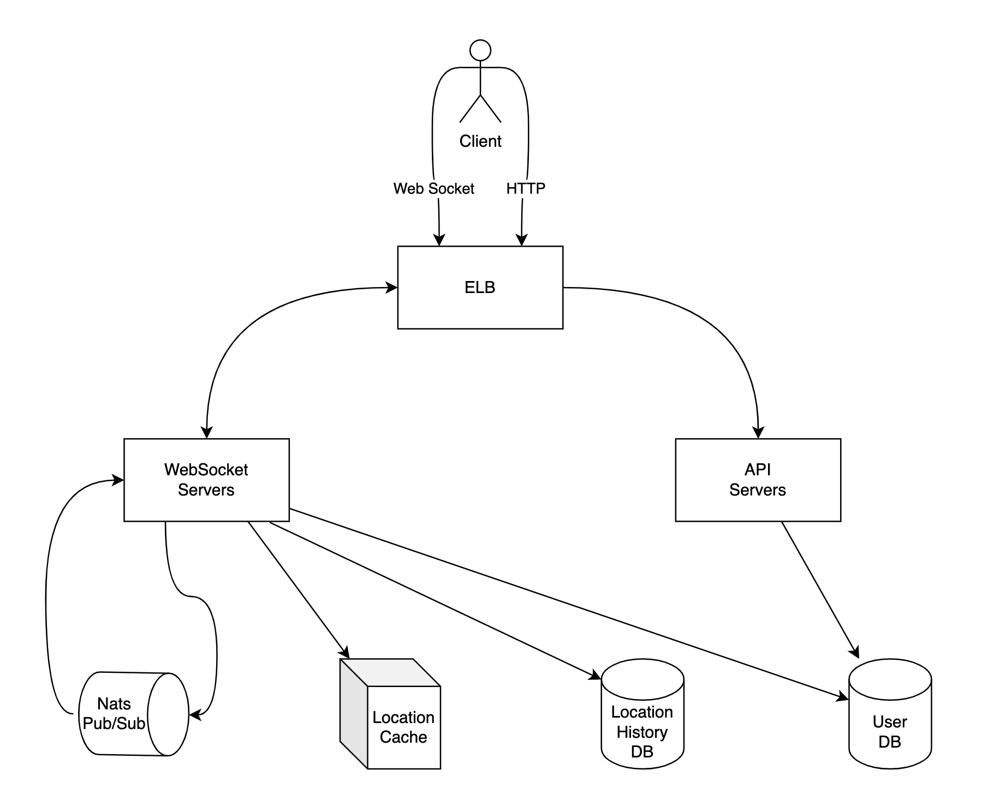

- [Requirements](#requirements)
  - [Functional Requirements](#functional-requirements)
  - [Non-functional Requirements](#non-functional-requirements)
  - [Estimation](#estimation)
- [High Level Design](#high-level-design)
    - [High Level Design Diagram](#high-level-design-diagram)
    - [Restful API Servers](#restful-api-servers)
    - [Websocket Servers](#websocket-servers)
    - [Redis Location Cache](#redis-location-cache)
    - [NATS Pub/Sub Servers](#nats-pubsub-servers)
  - [Periodic Location Update](#periodic-location-update)
  - [API Design](#api-design)
  - [Data Model](#data-model)
    - [User Database](#user-database)
    - [Location Cache](#location-cache)
    - [Location History](#location-history)
- [High Level Design Deep Dive](#high-level-design-deep-dive)
  - [Scalability](#scalability)
    - [API Servers](#api-servers)
    - [Websocket Servers](#websocket-servers-1)
    - [User Database](#user-database-1)
    - [Redis Location Cache](#redis-location-cache-1)
    - [NATS Pub/Sub Servers](#nats-pubsub-servers-1)
  - [Add, Remove Friends](#add-remove-friends)
  - [Users With Many Friends](#users-with-many-friends)
  - [Nearby Random Person](#nearby-random-person)
- [References](#references)

-----

# Requirements

## Functional Requirements

* Users see nearby friends on their mobile applications.
* The list of friends should be updated every few seconds.

## Non-functional Requirements

* Low latency.
* Reliability.
* Eventual consistency.

## Estimation

| Number | Description      | Calculation | 
| ------ | ---------------- | -- |
| 100 million | DAU | |
| 10 million | Concurrent users | 10 % * 100 million |
| 30 secs | Users report their locations every 30 seconds | |
| 334,000 | QPS of updating locations | 10 million / 30 |

# High Level Design

### High Level Design Diagram



### Restful API Servers

The API servers handle adding, reading, updating, removing friends and updting user profiles, etc...

### Websocket Servers

The websocket servers broadcast user locations to mobile devices.

Every client has only one persistent websocket connection to one of servers.

### Redis Location Cache

The redis servers cache the most recent location data for active users.

### NATS Pub/Sub Servers

[nats](/nats/README.md) is a message broker for broadcasting user locations.

## Periodic Location Update

The mobile client applications send the current location over the websocket connection.

## API Design

```
* APIs for websocket servers
  * Periodic location update
    * Request: user_id, latitude, longitude, timestamp
    * Response: 
  * Client receives location updates
    * Notify: friend_id, latitude, longitude, timestamp
  * Websocket initialization
    * Request: user_id, latitude, longitude, timestamp
    * Response: friends' locations
  * Subscribe to a new friend
    * Requeset: friend_id
    * Response: friend_id, latitude, longitude, timestamp
  * Unsubscribe a friend
    * Request: friend_id
    * Response: 

* APIs for api servers
  * add, read, update, remove friends
  * update user profiles
```

## Data Model

### User Database

> `users`

| name | description|
|--|--|
| user_id | |
| name | |
| email | |

> `friends`

| name | description|
|--|--|
| user_id | |
| friend_id | |

### Location Cache

| key | value |
|--|--|
| user_id | `{latitude, longitude, timestamp}` |

### Location History

| name | description |
|--|--|
| user_id | |
| latitude | |
| longitude | |
| timestamp | |

# High Level Design Deep Dive

## Scalability

### API Servers

API Servers are stateless. If we use AWS ELB, Autoscaling
Group, we are able to scale out, scale in them.

### Websocket Servers

Websocket servers are stateful. If we use AWS ELB, we need some operations. 

If we mark one of websocket servers as drain, the connections will be disconnected gradually. Mobile clients will reconnect to other websocket servers.

### User Database

We can use AWS AuroraDB MySQL because the size of `users, friends` are small.

If other team maintain the user database, they can provide APIs through member microservice. 

### Redis Location Cache

[redis](/redis/README.md) sharding by user_id or [redis](/redis/README.md) cluster can be a good solution.

### NATS Pub/Sub Servers

[nats](/nats/README.md) cluster can be a good solution.

## Add, Remove Friends

If the mobile client add friends, it send subscribing that friend to the websocket server for registering NATS Pub/Sub servers.

If the mobile client remove friends, it send unsubscribing that friend to the websocket server for deregistering NATS Pub/Sub servers.

## Users With Many Friends

Limiting the number of friends is a good solution. For example, Facebook has a limit of 5,000 friends.

How can we spread the load of websocket servers for the user has many friends?

## Nearby Random Person

We need to keep NATS Pub/Sub channel by geohash.

The mobile client can find random people's locations by it's geohash.

# References

* [GEOHASH @ joinc](https://www.joinc.co.kr/w/man/12/geohash)
* [Yelp system design | amazon interview question Yelp software architecture @ youtube](https://www.youtube.com/watch?v=TCP5iPy8xqo)
* [Design a proximity server like NearBy or Yelp Part — 1 @ medium](https://medium.com/swlh/design-a-proximity-server-like-nearby-or-yelp-part-1-c8fe2951c534)
  * [Design a proximity server like Yelp Part — 2 @ medium](https://codeburst.io/design-a-proximity-server-like-yelp-part-2-d430879203a5)
* [Quad Tree @ geeksforgeeks](https://www.geeksforgeeks.org/quad-tree/)
* [An interactive explanation of quadtrees.](https://jimkang.com/quadtreevis/)
