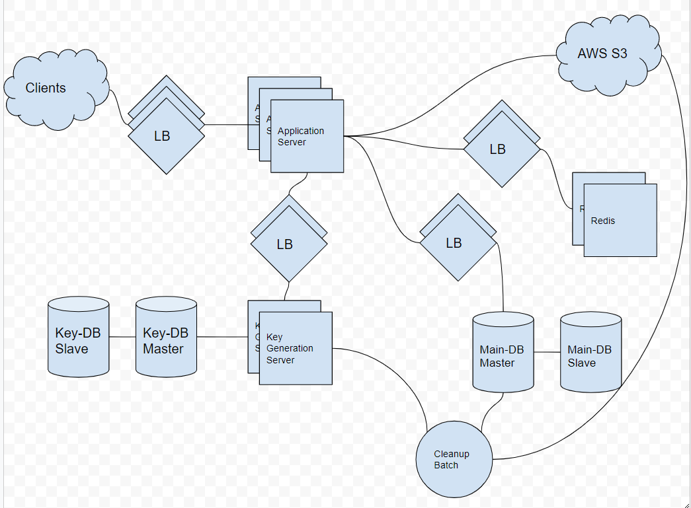

- [Requirements](#requirements)
- [Estimation](#estimation)
  - [Traffic estimates](#traffic-estimates)
  - [Storage estimates](#storage-estimates)
  - [Bandwidth estimates](#bandwidth-estimates)
  - [Memory estimates](#memory-estimates)
  - [High-level estimates](#high-level-estimates)
- [High Level Design](#high-level-design)
- [Low Level Design](#low-level-design)
  - [System APIs](#system-apis)
  - [DataBase](#database)
  - [DataBase Schema](#database-schema)
    - [pastes](#pastes)
    - [users](#users)
  - [Application Layer](#application-layer)
  - [Datastore layer](#datastore-layer)
- [Extention](#extention)
  - [Purging or DB Cleanup](#purging-or-db-cleanup)
  - [Data Partitioning and Replication](#data-partitioning-and-replication)
  - [Cache and Load Balancer](#cache-and-load-balancer)
  - [Security and Permissions](#security-and-permissions)
- [Q\&A](#qa)
- [References](#references)

----

# Requirements

* Functional Requirements
  * 유저는 데이터를 업로드하고 url 을 얻을 수 있다.
  * 유저는 텍스트 데이터만 업로드할 수 있다.
  * 데이터와 url 은 일정시간이 지나면 소멸한다. 유저는 그 유지시간을 정할 수 있다.
  * 유저는 업로드한 데이터의 custom alias 를 만들 수 있다.
* Non-Functional Requirements
  * 시스템의 신뢰도는 높고 업로드된 데이터는 유실 될 수 없다.
  * 시스템의 가용성은 높다.
  * latency 는 매우 낮다.
  * 데이터의 url 은 예측하기 힘들다.
* Extended Requirements
  * Analytics
  * provides REST APIs.
* [Designing a URL Shortening service like TinyURL](Designing_a_URL_Shortening_service_like_TinyURL.md) 과 비슷하다.
* What should be the limit on the amount of text user can paste at a time?
  * 10 MB 이상은 업로드 불가
* Should we impose size limits on custom URLs?
  * URL database  를 위해 필요하다.

# Estimation

## Traffic estimates

| Number                                       | Description      |
| -------------------------------------------- | ---------------- |
| 5 : 1                                        | read/write ratio |
| 1 M                                          | write per day    |
| 5 M                                          | read per day     |
| 1 M / (24 hrs * 3600 secs) = 12 writes / sec | write QPS        |
| 5 M / (24 hrs * 3600 secs) = 58 reads / sec  | read QPS         |

## Storage estimates

| Number                                  | Description                                        |
| --------------------------------------- | -------------------------------------------------- |
| 10 KB                                   | data size per one write                            |
| 1 M * 10 KB = 10 GB                     | data size per one day                              |
| 10 GB * 365 days * 10 years = 36 TB     | data size for 10 years                             |
| 1M * 365 days * 10 years = 3.6 B pastes | The number of pastes for 10 years                  |
| 64 ^ 6 ~= 67.7 B unique strings         | The size of unique strings for base64 6 characters |
| 3.6 B * 6 = 22 GB                       | data size of key for 10 years                      |
| 36 TB * 100 / 70 = 51.4 TB              | total data size for 70 % capacity model            |

## Bandwidth estimates

| Number                | Description                   |
| --------------------- | ----------------------------- |
| 12 * 10 KB = 120 KB/s | incomming for writing per sec |
| 58 * 10 KB = 0.6 MB/s | outgoing for readding per sec |

## Memory estimates

* **80-20 rule** : 20 % generates 80 % of traffics. Let's cache these 20% hot pastes.

| Number               | Description                            |
| -------------------- | -------------------------------------- |
| 5 M * 10 KB != 50 GB | The number of request for read per day |
| 0.2 * 50 GB = 10 GB  | The number of cache for read per day   |

## High-level estimates

| Number          | Description                       |
| --------------- | --------------------------------- |
| 12 writes/s | write per sec                     |
| 58 reads/s  | read per sec                      |
| 120 KB/s        | ingress data for writing per sec  |
| 0.6 MB/s        | egress data for reading per sec   |
| 36 TB           | Storage for 10 years              |
| 10 GB           | The number of memory to be cached |

# High Level Design



# Low Level Design

## System APIs

```c
addPaste(api_dev_key, 
  paste_data, 
  custom_url=None,
  user_name=None, 
  paste_name=None, 
  expire_date=None)

parameters:
returns: (string)  

getPaste(api_dev_key, api_paste_key)

deletePaste(api_dev_key, api_paste_key)
```

## DataBase

Mongo DB sharding

## DataBase Schema

### pastes

| pasteId | content | createdAt | accessedAt |
|---|---|--|--|
| 1xx | abcdefhijilij | 2019-09-03 09:00:00 | 2019-09-03 09:00:00 |

### users

| userId | userEmail | userName | createdAt | modifiedAt |
|---|---|--|--|
| iamslash | iamslash@gmail.com | David Sun | 2019-09-03 09:00:00 | 2019-09-03 09:00:00 |

## Application Layer

* How to handle a write request?
* Isn’t KGS a single point of failure? 
* Can each app server cache some keys from key-DB? 
* How does it handle a paste read request? 

## Datastore layer

* Metadata database: MySQL or Dynamo or Cassandra
* Object storage: amazon s3

# Extention

## Purging or DB Cleanup

* [Designing a URL Shortening service like TinyURL](/systemdesign/grokking/Designing_a_URL_Shortening_service_like_TinyURL/Designing_a_URL_Shortening_service_like_TinyURL.md)

## Data Partitioning and Replication

* [Designing a URL Shortening service like TinyURL](/systemdesign/grokking/Designing_a_URL_Shortening_service_like_TinyURL/Designing_a_URL_Shortening_service_like_TinyURL.md)

## Cache and Load Balancer

* [Designing a URL Shortening service like TinyURL](/systemdesign/grokking/Designing_a_URL_Shortening_service_like_TinyURL/Designing_a_URL_Shortening_service_like_TinyURL.md)

## Security and Permissions

* [Designing a URL Shortening service like TinyURL](/systemdesign/grokking/Designing_a_URL_Shortening_service_like_TinyURL/Designing_a_URL_Shortening_service_like_TinyURL.md)

# Q&A

# References

[Design Pastebin.com (or Bit.ly)](https://github.com/donnemartin/system-design-primer/blob/master/solutions/system_design/pastebin/README.md)
