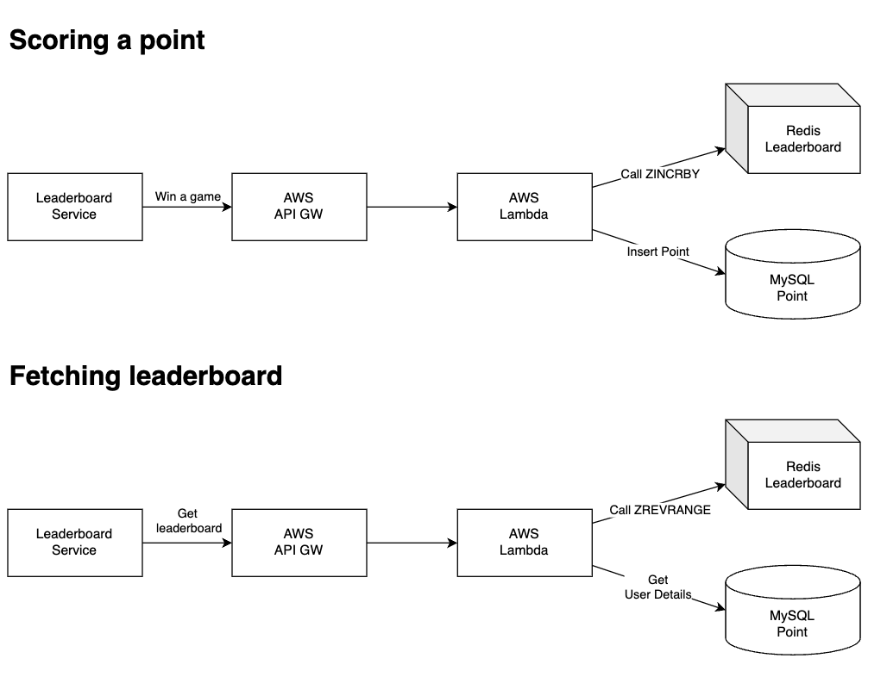

- [Requirements](#requirements)
  - [Functional Requirement](#functional-requirement)
  - [Non-Functional Requirement](#non-functional-requirement)
  - [Estimation](#estimation)
- [High Level Design](#high-level-design)
  - [API Design](#api-design)
  - [Architecture](#architecture)
  - [Data Model](#data-model)
    - [RDBMS](#rdbms)
    - [Redis](#redis)
    - [NOSQL](#nosql)
- [High Level Design Deep Dive](#high-level-design-deep-dive)
  - [Build On The Cloud](#build-on-the-cloud)
  - [Scaling Redis](#scaling-redis)
  - [Redis Manual Sharding](#redis-manual-sharding)
- [Extension](#extension)
  - [Faster Retrieval and Breaking Tie](#faster-retrieval-and-breaking-tie)
  - [System Failure Recovery](#system-failure-recovery)
- [Interview Questions](#interview-questions)
- [References](#references)

----

# Requirements

## Functional Requirement

- The system displays 10 players on the leaderboard.
- The system shows a user's specific rank.
- The system displays users above and below the specific user.

## Non-Functional Requirement

- High availability
- Low latency
- Scalability
- Reliability
- Minimal operational overhead

## Estimation

| Number | Description| |
|--|--|--|
| 5 Millian | DAU | |
| 50 | Updated users per second | 5,000,000 DAU / 100,000 sec |
| 250 | Peak updated users per second | 50 * 5 |
| 10 | A user plays 10 games per day on average | |
| 500 | QPS for updating score | 50 * 10 |
| 2,500 | Peak QPS for updating score | 500 QPS * 5 |
| 1 | The number of fetching top 10 scores in a day | |
| 50 | QPS for fetching top 10 score | 5,000,000 DAU / 100,000 sec | 

# High Level Design

## API Design

```json
* HTTP Request headers 
  * Request
    * Headers
      * authorization
      * content-encoding
      * method
      * content-type
      * user-agent
  * Response
    * Headers
      * status code
      * cache-control
      * content-encoding
      * content-type

* Update a user's score. The POST requests are not idempotent.

  * Request
    /v1/players/:player-id/scores
    method: POST
    authorization: Bearer <JWT>
    content-length: 100
    content-type: application/JSON
    content-encoding: gzip
    {
        player_id: <int>,
        score: <int>,
        location: Geohash
    }
  * Response
    status code: 200 OK           // created synchronously
    status code: 202 accepted     // to be created asynchronously
    status code: 400 bad request
    status code: 403 forbidden

* Get the rank of the player

  * Request
    /v1/players/:player-id
    method: GET
    authorization: Bearer <JWT>
    user-agent: Chrome
    accept: application/json, text/html

  * Response
    status code: 200 OK
    cache-control: private, no-cache, must-revalidate, max-age=5
    content-encoding: gzip
    content-type: application/json

    {
        player_id: "45231",
        player_name: "Rick",
        score: 1562,
        rank: 1,
        updated_at: "2030-10-10T12:11:42Z"
    }

* Get top 10 scores.

  * Rqueset
    /v1/leaderboard/top/:count
    method: GET
    authorization: Bearer <JWT>
    user-agent: Chrome
    accept: application/json, text/html

  * Response
    status code: 200 OK
    cache-control: public, no-cache, must-revalidate, max-age=5
    content-encoding: gzip
    content-type: application/json

    {
        total: 10, (count)
        updated_at: "2030-10-10T12:11:42Z",
        data: [
            {
                player_id: "45231",
                player_name: "Rick",
                score: 1562,
                rank: 1,
            },
            {...}
        ]
    }

* Get ranked surrounding players around the player

  * Request
    /v1/leaderboard/:player-id/:count
    method: GET
    authorization: Bearer <JWT>
    user-agent: Chrome
    accept: application/json, text/html

  * Response
    status code: 200 OK
    cache-control: private, no-cache, must-revalidate, max-age=5
    content-encoding: gzip
    content-type: application/json

    {
        total: 6, (count)
        updated_at: "2030-10-10T12:11:42Z",
        data: [
            {
                player_id: "45231",
                player_name: "Morty",
                score: 1562,
                rank: 2,
            },
            {...}
        ]
    }

* System Health

  * Request
    /:service/health
    method: HEAD
  * Response
    status code: 200 OK
    status code: 500 Internal Error
```

## Architecture

1. Win a game
2. Update the score
3. Update score
4. Get the top 10 from the leaderboard
5. Get the rank of user player


## Data Model

We can think **RDBMS**, **Redis**, **NoSQL** for storages. The Single instance of Redis the best solution. 

### RDBMS

Followings are the RDBMS Schema.


Followings are the Redis Schema.


```
classDiagram
    class Players {
        player_id (key)
        name
        location
        profile_image
        updated_at
    }
    class Leaderboards {
        leaderboard_id (key)
        player_id
        score
    }
    Players : Hash
    Leaderboards : Sorted Set

```

Followings are the access patterns.

```sql
-- Insert a new player
INSERT INTO leaderboards (leaderboard_id, score, created_at, game_id, player_id)
VALUES ("apex_legends", 1, "2050-08-22", "1", "42");

-- Update the score of a player
UPDATE leaderboards
   SET score = score + 1
 WHERE player_id = '42';

-- Fetch the total score of a player for the current month
SELECT sum(score)
  FROM leaderboards
 WHERE player_id = '42' and created_at >= "2025-03-10";

-- Calculate the scores and rank the top 10 players
  SELECT player_id, SUM(score) AS total
    FROM leaderboards
GROUP BY player_id
ORDER BY total DESC
   LIMIT 10; 

-- Calculate the rank of a specific player
SELECT _,
(
  SELECT COUNT(_)
  FROM leaderboards AS l2
  WHERE l2.score >= l1.score
) AS RANK
 FROM leaderboards AS l1
WHERE l1.player_id = '42';
```

Even optimized queries don't scale well. RDBMS is not a good solution.

### Redis

Redis supports sorted sets.

The sorted set is implemented using [skip list](https://github.com/iamslash/learntocode/blob/master/fundamentals/list/skiplist/README.md) which has multiple level indices and the time complexity of inserting is `O(logN)`. [t_zset.c](https://github.com/redis/redis/blob/unstable/src/t_zset.c)

If we use RDBMS instead of Rdis, we need to use this nested sql for getting a rank of the user. This sql is not performant.

```sql
SELECT *,
       (SELECT COUNT(*) FROM leaderboard lb2
         WHERE lb2.score >= lb1.score) RANK
  FROM leaderboard lb1
 WHERE lb1.user_id = {:user_id}; 
```

These are operations of sorted sets. `N` is the number of the set items. `M` is the number of items to be fetched.

| Redis Command | Description                           | Time Complexity  |
|---------------|---------------------------------------|------------------|
| ZADD          | Add a new player                      | O(log(n))        |
| ZINCRBY       | Increment the score of a player       | O(log(n))        |
| ZSCORE        | Fetch the score of a player           | O(1)             |
| ZREVRANK      | Fetch the rank of a player            | O(log(n))        |
| ZREVRANGE     | Fetch the top m players on the leaderboard | O(log(n) + m) |
| ZREM          | Remove a player from the leaderboard  | O(k*log(n))      |

These are examples of sorted sets.

```
* Add a new user.

redis> ZADD key score member
returns the number of elements added to the sorted set

redis> ZADD leaderboard 1 “iamslash”
(integer) 1

* Remove the player.

redis> ZREM key member
returns the number of members removed from the sorted set

redis> ZADD leaderboard 1 “iamslash”
(integer) 1
redis> ZREM leaderboard “iamslash”
(integer) 1

* Get the score of the user.

redis> ZSCORE key member
returns the score of member in the sorted set at key

redis> ZADD leaderboard 3 "iamslash"
(integer) 1
redis> ZSCORE leaderboard “iamslash”
“3”

* Get the rank of the user.

redis> ZREVRANK key member
returns the rank of member in the sorted set stored at key, with the scores ordered from high to low. The rank is 0-based, which means that the member with the highest score has rank 0.

redis> ZADD leaderboard_feb_2022 1 “foo”
(integer) 1
redis> ZADD leaderboard_feb_2022 2 “bar”
(integer) 1
redis> ZADD leaderboard_feb_2022 3 “baz”
(integer) 1
redis> ZREVRANK leaderboard_feb_2022 “foo”
(integer) 2

* Update a user's score

redis> ZINCRBY key increment member
returns the new score of member

redis> ZADD leaderboard 1 “iamslash”
(integer) 1

redis> ZINCRBY leaderboard 2 “iamslash”
“3”

* Get top 10 scores.

redis> ZREVRANGE key start stop
returns the specified range of elements in the sorted set stored at key. The elements are considered to be ordered from the highest to the lowest score.

redis> ZADD leaderboard 1 "foo"
(integer) 1
redis> ZADD leaderboard 2 "bar"
(integer) 1
redis> ZADD leaderboard 3 "baz"
(integer) 1
redis> ZADD leaderboard 4 "iamslash"
(integer) 1
redis> ZREVRANGE leaderboard 0 2
"iamslash"
"baz"
"bar"

* Get above and below the user

redis> ZREVRANK leaderboard “iamslash”
(integer) 11

redis> ZREVRANGE leaderboard 8 14
“eight”
“nine”
“ten”
“iamslash”
“twelve”
“thirteen”
“fourteen”
```

**Redis Storage Estimation**

| Number | Description | |
|--|--|--|
| 25 Millian | The number of users which won at least once (MAU)| |
| 24 bytes | The size of user id | |
| 2 bytes | The size of score | | 
| 650 MB | 25 Millian * 26 bytes | | 

Single Redis can handle `650 MB` for updating in real time and can handle `2,500 peak QPS`.

The AWS [Redis](/redis/README.md) suports replicas which increase the availabilty.

### NOSQL

[Redis](/redis/README.md) 대신 [DynamoDB](/dynamodb/README.md) 를 사용할 수도 있다. DynamoDB에서 글로벌 보조 인덱스(GSI)는 플레이어의 점수에 기반한 리더보드에 빠르게 액세스하는 데 사용될 수 있다. GSI는 Sort Key와 Partition Key가 필요합니다. Sort Key는 플레이어의 점수이다. DynamoDB는 [Consistency Hashing](/consistenthasing/README.md)을 내부적으로 사용하여 데이터베이스를 파티션하여 확장성을 제공한다. 데이터베이스는 균일한 데이터 분포를 위해 user_id를 Partition Key로 사용하여 파티션될 수 있습니다. [Global Secondary Index](/dynamodb/README.md#secondary-index) 참고.


```
graph TD;
    server[Server] -->|scatter| partition0[Partition 0<br>player 1: 55<br>player 2: 42]
    server -->|scatter| partition1[Partition 1<br>player 3: 72<br>player 4: 31]
    server -->|scatter| partition2[Partition 2<br>player 5: 57<br>player 6: 49]

    partition0 -->|gather| server
    partition1 -->|gather| server
    partition2 -->|gather| server
```

다음과 같은 장점이 있다.

- fully managed service
- serverless (no server to provision or manage)
- supports ACID transactions???
- performance at scale through partitioning
- supports CDC(change data capture) through the DynamoDB stream

다음과 같은 단점이 있다.

- scatter-gather pattern increases complexity
- sorting the score can be relatively expensive
- not write optimized due to B-Trees managing data

# High Level Design Deep Dive

## Build On The Cloud

The serverless architecture on the cloud is a good solution.

- AWS provides API gateway, AWS Lambda. 
- Google Cloud provides Google Cloud Functions.
- Microsoft Azure provides Microsoft Azure Functions.

This is an example of AWS Lambda Functions.

| APIs | Lambda function |
|--|--|
| GET `/v1/scores` | LeaderboardFetchTop10 |
| GET `/v1/scores/{:user_id}` | LeaderboardFetchPlayerRank |
| GET `/v1/scores` | LeaderboardUpdateScore |

This is an example of AWS Lambda Architecture.



## Scaling Redis

`5 Billian` 과 같이 매우 많은 수의 user 가 있다면 어떻게 해결할 수 있을까?
Redis 를 partitioning 해야 한다. 다음과 같은 방법들이 있다.

- range partitioning
- modulus partitioning
- redis cluster
- consistent hashing

다음은 각 방법들의 특징들이다.

| Scheme              | Tradeoff                                                                |
|---------------------|-------------------------------------------------------------------------|
| range partitioning  | increased data movement when the number of nodes changes                |
|                     | operational complexity                                                  |
| modulus partitioning| increased data movement when the number of nodes changes                |
|                     | non-contiguous data distribution results in complex queries             |
| redis cluster       | increased data movement when the number of nodes changes                |
|                     | operational complexity                                                  |
| consistent hashing  | non-contiguous data distribution results in complex queries             |
|                     | operational complexity                                                  |

이들 중 auto sharding 을 원한다면 [Redis Cluster](/redis/redis_cluster.md) 를 사용하고 manual sharding 을 원한다면 [Consistent Hashing](/consistenthasing/README.md) 을 사용한다.

## Redis Manual Sharding

`5 Billian users` 를 위해 `5 Billian * 10 Byte = 50 GB` 가 필요하다. Redis 의 sorted set 은 sharding 이 필요하다.

단순한 구현을 위해 modulus partitioning 을 사용해서 설명한다. node 개수의 변화에 대해 data 의 잦은 이동을 피하려면 [Consistent Hashing](/consistenthasing/README.md) 을 사용해야 한다. user_id 를 shard key 로 하고 각 partition 별 user score 들을 모아서 정렬하고 user 들의 순위를 계산한다. 이 것을 "Scatter-Gather" Pattern 이라고 한다. 


```
graph TD;
    A["central node<br/>player 3: 72<br/>player 5: 57<br/>player 1: 55"] 
    A --> |"player 1: 55"| B["partition 0<br/>player 1: 55<br/>player 2: 42"]
    A --> |"player 3: 72"| C["partition 1<br/>player 3: 72<br/>player 4: 31"]
    A --> |"player 5: 57"| D["partition 2<br/>player 5: 57<br/>player 6: 49"]
```

Redis 는 `16,384` 개의 hash slot 을 제공한다. 다음과 같은 방법으로 data 를 저장할 Redis instance 를 선택한다.

```c
slot = `CRC16(key) % 16,384`

1st instance: [0, 5,500]
2nd instance: [5,501, 11,000]
34d instance: [11,001, 16,384]
```

다음은 userid 로 3개의 Redis instance 중 하나를 선택하여 score 를 삽입하는 java code 이다.

```java
import redis.clients.jedis.Jedis;
import redis.clients.jedis.JedisPool;
import java.util.concurrent.ThreadLocalRandom;

public class RedisScoreInsertion {
    // Redis 인스턴스 풀을 설정합니다.
    private static JedisPool jedisPool1 = new JedisPool("localhost", 6379);
    private static JedisPool jedisPool2 = new JedisPool("localhost", 6380);
    private static JedisPool jedisPool3 = new JedisPool("localhost", 6381);

    // 샤드 리스트에 인스턴스 풀을 추가합니다.
    private static JedisPool[] shards = {jedisPool1, jedisPool2, jedisPool3};

    public static void main(String[] args) {
        // 임의의 userid와 score를 생성합니다.
        String userid = "user123";
        double score = ThreadLocalRandom.current().nextDouble(0, 100); // 임의의 score를 생성합니다.

        // userid로 선택된 샤드 인덱스를 결정합니다.
        int shardIndex = getShardIndex(userid);

        // 선택된 샤드에 score를 삽입합니다.
        insertScore(shards[shardIndex], userid, score);
    }

    private static int getShardIndex(String userid) {
        // userid를 이용하여 샤드 인덱스를 결정합니다.
        int slot = CRC16(userid) % 16384;
        if (slot >= 0 && slot <= 5500) {
            return 0; // 1st instance
        } else if (slot >= 5501 && slot <= 11000) {
            return 1; // 2nd instance
        } else {
            return 2; // 3rd instance
        }
    }

    private static void insertScore(JedisPool pool, String userid, double score) {
        try (Jedis jedis = pool.getResource()) {
            jedis.zadd("topScores", score, userid);
        }
    }

    // CRC16 해싱을 구현합니다.
    private static int CRC16(String key) {
        int crc = 0xFFFF;
        for (int i = 0; i < key.length(); i++) {
            crc ^= (int) key.charAt(i) & 0xFF;
            for (int j = 0; j < 8; j++) {
                if ((crc & 0x0001) != 0) {
                    crc >>= 1;
                    crc ^= 0xA001;
                } else {
                    crc >>= 1;
                }
            }
        }
        return crc;
    }
}
```

다음은 3개의 Redis instance 에 나뉘어 저장된 score 를 하나로 모아서 top 10 을 얻는 java code 이다.

```java
import redis.clients.jedis.Jedis;
import redis.clients.jedis.JedisPool;
import redis.clients.jedis.Tuple;

import java.util.ArrayList;
import java.util.List;
import java.util.Set;
import java.util.SortedSet;
import java.util.TreeSet;

public class RedisShardingExample {
    // Redis 인스턴스 풀을 설정합니다. 실제 환경에서는 환경에 맞는 주소와 포트를 설정해야 합니다.
    private static JedisPool jedisPool1 = new JedisPool("localhost", 6379);
    private static JedisPool jedisPool2 = new JedisPool("localhost", 6380);
    private static JedisPool jedisPool3 = new JedisPool("localhost", 6381);

    private static List<JedisPool> shards = new ArrayList<>();

    static {
        // 샤드 리스트에 인스턴스 풀을 추가합니다.
        shards.add(jedisPool1);
        shards.add(jedisPool2);
        shards.add(jedisPool3);
    }

    public static void main(String[] args) {
        // 각 인스턴스에서 top 10을 가져와 병합하고 전체 top 10을 계산합니다.
        SortedSet<Tuple> globalTop10 = fetchGlobalTop10();
        // 결과를 출력합니다.
        globalTop10.forEach(tuple -> 
            System.out.println("User: " + tuple.getElement() + ", Score: " + tuple.getScore())
        );
    }

    private static SortedSet<Tuple> fetchGlobalTop10() {
        SortedSet<Tuple> globalTopScores = new TreeSet<>((o1, o2) -> {
            if (o1.getScore() < o2.getScore()) {
                return 1;
            } else if (o1.getScore() > o2.getScore()) {
                return -1;
            } else {
                return 0;
            }
        });

        // 각 샤드에서 로컬 top 10을 가져옵니다.
        for (JedisPool pool : shards) {
            try (Jedis jedis = pool.getResource()) {
                Set<Tuple> localTop10 = jedis.zrevrangeWithScores("topScores", 0, 9);
                globalTopScores.addAll(localTop10);
            }
        }

        // 전체 결과 중에서 top 10 만을 추립니다.
        while (globalTopScores.size() > 10) {
            globalTopScores.remove(globalTopScores.last());
        }
        return globalTopScores;
    }
}
```

# Extension

## Faster Retrieval and Breaking Tie

Cache user information in Redis.

When two users' score are same old one's score is higher than new one's score.

## System Failure Recovery

We can recover Redis with restoring data from RDBMS.

# Interview Questions

- sorted set 을 sharding 하는 것은 system 의 complexity 를 높인다. 해결 방법은?
  - rank 에 관심있는 user 들은 상위권 user 들이다. 상위권 user 들만 Single Instance Redis 의 sorted set 에 저장한다. top 10 users 는 쉽게 가져올 수 있다. 하위권 user 들은 어림잡아 계산한다. 정확하지 않아도 된다. 예를 들어 점수를 구간별로 나누고 구간에 얼만큼 user 들이 존재하는지 하루에 한번 계산해 Single Instance Redis 에 저장해 둔다. 특정 user 의 점수를 보고 상위 구간에 얼만큼 user 들이 있는지 알 수 있다.
  
- How do you achieve high availability in a leaderboard system?
  - High availability can be achieved by using a distributed database with replication across multiple nodes or data centers. Implementing failover strategies and using load balancers to distribute traffic evenly across servers also ensures that the system remains accessible even if some components fail.

- What are the main challenges in updating leaderboard data in real-time and how can they be addressed?
  - One main challenge is handling the high volume of write operations without causing delays. This can be addressed by using in-memory databases like Redis for immediate updates and eventual consistency with persistent storage. Employing write-behind caching or message queues to batch and asynchronously process updates can also mitigate this issue.

- How would you design a database to support a large user base for a leaderboard system?
  - A NoSQL database like Cassandra or DynamoDB, which offers horizontal scaling and fast read/write operations, is ideal for handling large user bases. Using data partitioning and sharding techniques can distribute the load evenly, ensuring the system's scalability and performance.

- What are the benefits and limitations of using Redis for implementing a leaderboard?
  - Redis offers fast read and write operations and supports sorted sets, making it suitable for real-time leaderboard updates. However, being an in-memory database, it might pose limitations on data size and persistence. Using Redis in combination with persistent storage can help mitigate these limitations.

- How do you maintain data consistency in a distributed leaderboard system?
  - Data consistency can be maintained by using techniques like quorum reads and writes, where a majority of nodes must agree on a write operation's outcome. Implementing eventual consistency for non-critical operations and using transactions for critical ones ensures consistency across the system.

- For scalability, would you prefer horizontal scaling or vertical scaling in a leaderboard system? Why?
  - Horizontal scaling is preferred because it allows the system to handle more load by adding more machines into the pool of resources, offering better fault tolerance and load distribution. Vertical scaling, which involves adding more power to an existing machine, has physical and cost limitations.

- How can database writes be optimized when user score updates are frequent?
  - Optimizing writes can be achieved by using techniques like batching, where multiple updates are combined into a single operation. Leveraging in-memory databases for initial writes and asynchronously syncing to persistent storage can also reduce write load.

- What strategies would you use for effective caching in a leaderboard system?
  - Effective caching strategies include caching top leaderboard entries, which are frequently accessed but rarely changed. Using a cache eviction policy like LRU (Least Recently Used) ensures that only relevant data is kept in cache, optimizing memory usage.

- How do you minimize network latency in a leaderboard system?
  - Network latency can be minimized by geographically distributing servers closer to the user base, employing CDN for static content, and optimizing server response times through efficient data retrieval and processing techniques.

- What methods would you employ to ensure security in a leaderboard system?
  - Security can be ensured by implementing authentication and authorization mechanisms to control access, using HTTPS for data encryption in transit, and regularly auditing and updating the system to patch vulnerabilities.

# References

- [Leaderboard System Design](https://systemdesign.one/leaderboard-system-design/)
