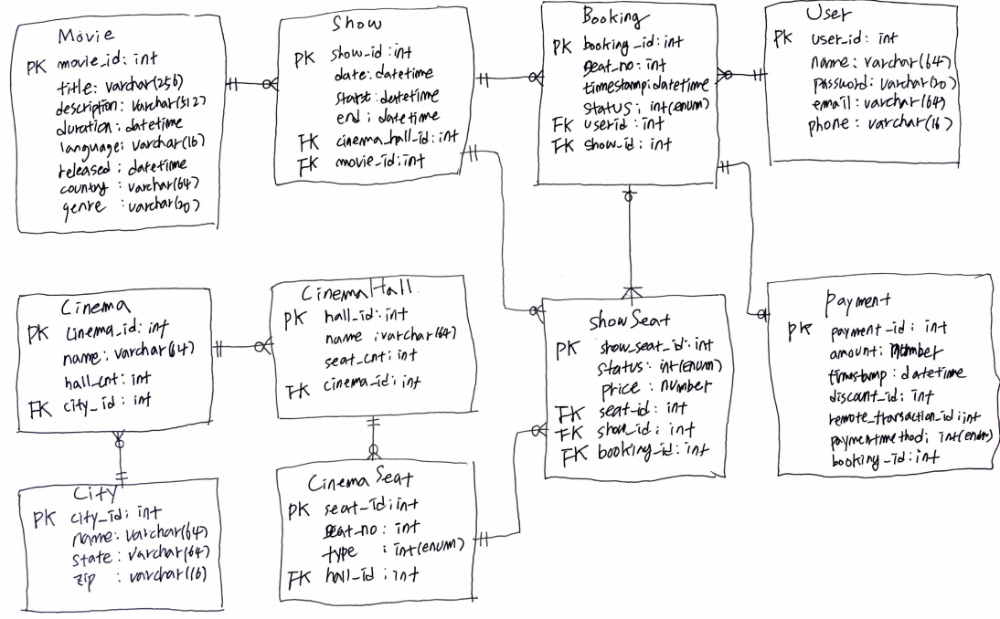
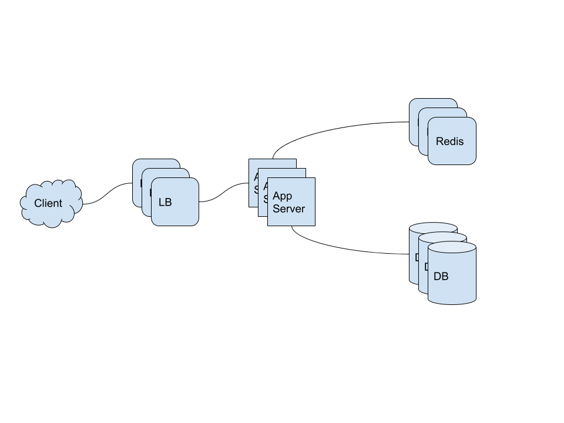

- [Requirements](#requirements)
  - [Functional Requirements](#functional-requirements)
  - [Non-Functional Requirements](#non-functional-requirements)
- [Estimation](#estimation)
  - [Traffic](#traffic)
  - [Storage](#storage)
- [High Level Design](#high-level-design)
  - [System APIs](#system-apis)
  - [Data Model](#data-model)
  - [High-level Architecture](#high-level-architecture)
- [High Level Design Deep Dive](#high-level-design-deep-dive)
- [References](#references)

-----

# Requirements

## Functional Requirements

* The system shows list of cities and cinemas
* When the user selects the city, the system shows list of movies released in that city.
* When the user selects the a movie, the system shows list of cinemas and available shows.
* The user selects a show at specific cinema and books a ticket.
* The system shows seating arrangement of the cinema. The user can selects multiple seats.
* The user can distinguish avilable seats and booked ones.
* The user can hold seats for 5 miniutes before payment.
* The user waits if there is a chance that the seats might be availble.
* Waiting should be fair. FIFO

## Non-Functional Requirements

* The system should be highly concurrent. Multiple requests for same seats are possible.
* The system provide finantial transactions.

# Estimation

## Traffic

| Number | Description |
| -------------------------------------------- | ---------------- |
| 3 Billion   | PV (page view) per month |
| 10 Million | Sold tickets per month |

## Storage

| Number | Description |
| -------------------------------------------- | ---------------- |
| 500   | cities |
| 10 | average cinemas of a city |
| 2000 | average seats of a cinema |
| 2 | average shows in a cinema per day |
| 50 bytes | booking data (IDs, NumberOfSeats, ShowID, MovieID, SeatNumbers, SeatStatus, Timestamp, etc.) | 
| 50 bytes | movies and cinemas | 
| 2 GB / day (500 cities * 10 cinemas * 2000 seats * 2 shows * (50 + 50)) | data size per day |

# High Level Design

## System APIs

```c
search_movies(
  api_key,
  keyword,
  city,
  latitude,
  longitude,
  radius,
  start_datetime,
  end_datetime,
  postal_code,
  include_spell_check,
  per_page,
  page_no,
  order_by
)

reserve_seats(
  api_key,
  session_id,
  movie_id,
  show_id, 
  seats_to_reserve[]
)
```

## Data Model



## High-level Architecture



# High Level Design Deep Dive

# References

* [DesigningHotelReservationSystem](/systemdesign/practices/DesigningHotelReservationSystem/DesigningHotelReservationSystem.md)
