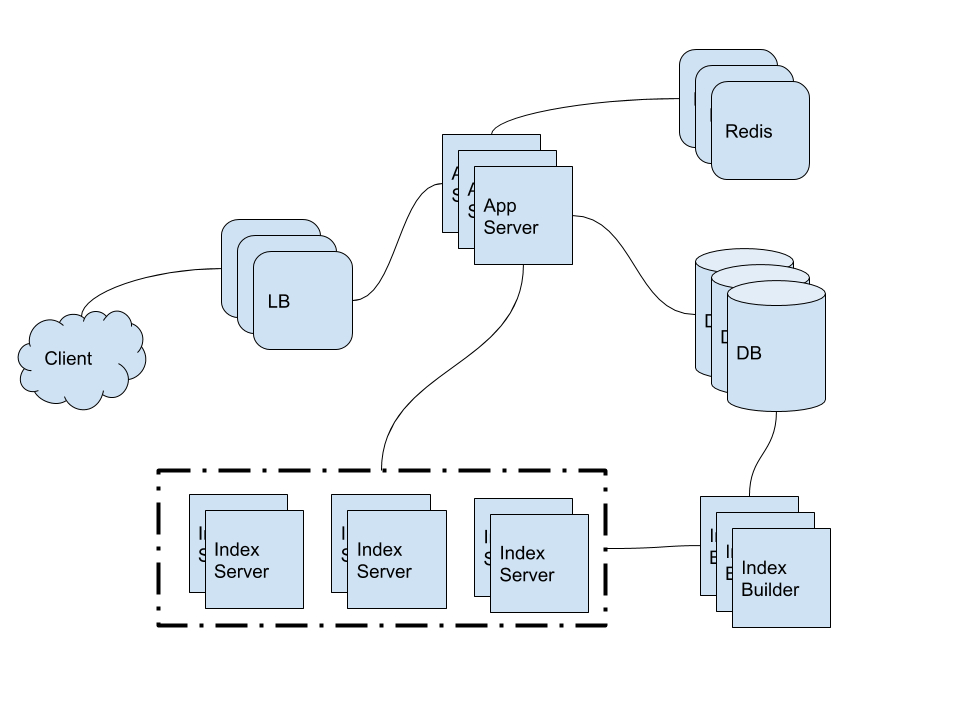

- [Requirements](#requirements)
  - [Twitter Search?](#twitter-search)
- [Estimation](#estimation)
  - [Traffic](#traffic)
  - [Storage](#storage)
- [System APIs](#system-apis)
- [High Level Architecture](#high-level-architecture)
- [Low Level Architecture](#low-level-architecture)
  - [Fault Tolerance](#fault-tolerance)
  - [Cache](#cache)
  - [Load Balancing](#load-balancing)
  - [Rangking](#rangking)
- [Q&A](#qa)
- [Implementation](#implementation)
- [References](#references)

-----

# Requirements

## Twitter Search?

트윗을 검색할 수 있다.

# Estimation

## Traffic

| Number                                       | Description      |
| -------------------------------------------- | ---------------- |
| 1.5 B  | RU    |
| 800 M | DAU    |
| 400 M tweets | tweets per day |
| 300 bytes / tweet | data size of a tweet |
| 500 M searches | searches per day |

## Storage

| Number                                       | Description      |
| -------------------------------------------- | ---------------- |
| 120 GB per day (400 M * 300)  | data size per day    |
| 1.38 MB / sec (120 GB / 86600 sec) | data size per sec   |

# System APIs

```c
search(api_dev_key,
  search_terms,
  maximum_results_to_return,
  sort,
  page_token)

paramters:
returns: (JSON)
  userID, name, tweet text, tweetID, creation time, number of likes
```

# High Level Architecture



# Low Level Architecture

* Storage
  * `120 GB * 365 days * 5 years = 200 TB`
* How can we create system-wide unique TweetIDs?
  * `400 M * 365 days * 5 years = 730 B`
* Index
* Sharding based on Words
* Sharding based on the tweet object

## Fault Tolerance

* Replicated servers

## Cache

* In front of Database like [Memcached](https://en.wikipedia.org/wiki/Memcached).
* LRU

## Load Balancing

* Between Clients and Application servers
* Between Application servers and Backend server

## Rangking

* rank tweets by popularity
* The aggregator server combines all these results and sorts them based on the popularity number

# Q&A

# Implementation

* [scalable-twitter-search @ github](https://github.com/agconti/scalable-twitter-search)

# References
