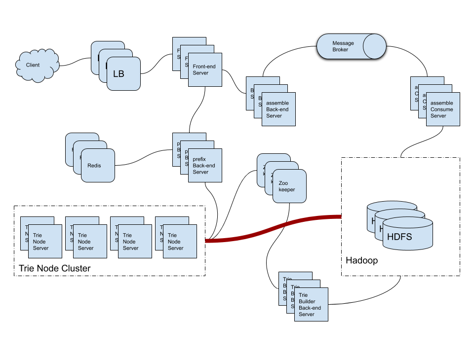

- [References](#references)

----

- [Requirements](#requirements)
  - [Functional Requirements](#functional-requirements)
  - [Non-functional Requirements](#non-functional-requirements)
- [System APIs](#system-apis)
- [Capacity Estimation and Constraints](#capacity-estimation-and-constraints)
  - [Traffic Estimation](#traffic-estimation)
  - [Storage Estimation](#storage-estimation)
  - [High level Estimation](#high-level-estimation)
- [High-level Architecture](#high-level-architecture)
- [Low-level Architecture](#low-level-architecture)
  - [Prefix Server](#prefix-server)
  - [Assemble Server](#assemble-server)
  - [Trie Build Server](#trie-build-server)
  - [Trie Node Server](#trie-node-server)
  - [Cache](#cache)
  - [Replication and Load Balancer](#replication-and-load-balancer)
  - [Fault Tolerance](#fault-tolerance)
  - [Typeahead Client](#typeahead-client)
  - [File System](#file-system)
- [System Extentions](#system-extentions)
- [Q&A](#qa)
- [Implementations](#implementations)
- [References](#references)

-----

# Requirements

## Functional Requirements

* As the user types the query, the system recommends top 10 terms starting with the user has typed.

## Non-functional Requirements

* The latency should be less than 200ms.

# System APIs

```c
search(
  api_key,
  query
)

query: The term for search. The system increment hits of the term and this will be used for rank of the term.

get_top_terms(
  api_key,
  prefix
)

prefix: The system recommend top 10 candidates which starts with the prefix.
```

# Capacity Estimation and Constraints

## Traffic Estimation

| Number          | Description                       |
| --------------- | --------------------------------- |
| 5 billion per day | search for each day  |
| 60 k / sec (5 billion per day / 86600) | search for sec  |
| 20 % | unique terms percent for each day |
| 100 million | unique terms for rank per day |

## Storage Estimation

| Number          | Description                       |
| --------------- | --------------------------------- |
| 3 words | average word count of query  |
| 5 characters | average length of the word |
| 15 characters | average length of the query |
| 30 bytes (15 characters * 2) | average bytes to index of the query |
| 3 GB (100 million * 30 bytes) | total bytes to index per day |
| 25 GB (3 GB + (0.02 * 3 GB * 365 days)) | total bytes to index for 1 year with 2% new terms per day |

## High level Estimation

| Number          | Description                       |
| --------------- | --------------------------------- |
| 250 GB (25 GB * 10 year)  | total bytes to index for 10 years |
| ??? | total bytes with index for 10 years |

# High-level Architecture



# Low-level Architecture

## Prefix Server

When client request `get_top_terms`, the prefix server try to get recommened terms in cache server or get data from trie-node cluster.

## Assemble Server

When client request `search`, the assemble server publish query to message borker such as Kafka. And assemble consume server consumes query from kafka and process data pipeline in Hadoop cluster.

## Trie Build Server

When data pipe line was finished in Hadoop cluster, trie build server build trie and save searialized data in HDFS and notify to zookeeper. Zookeeper will notify to trie node servers.

## Trie Node Server

When trie node servers get event from zookeeper for refreshing index, they download searialized trie  data from HDFS and load trie data. 

Trie Node Clusters provide replications and high availability with zookeeper.

## Cache

Redis

## Replication and Load Balancer

## Fault Tolerance

## Typeahead Client

When the user type one character, it requets `get_top_terms` with prefix.

## File System

HDFS, GlusterFS

# System Extentions

# Q&A

# Implementations

* [Implementation: Autocomplete/Typeahead Suggestions System Design @ github](https://github.com/lopespm/autocomplete)
  * [Implementation: Autocomplete System Design for Large Scale](https://lopespm.github.io/2020/08/03/implementation-autocomplete-system-design.html)
  * [Learning to build an Autocomplete System. Part 1](https://medium.com/@iftimiealexandru/learning-to-build-an-autocomplete-system-2c2e9f423537)
    * [Learning to build an Autocomplete System. Part 2](https://medium.com/@iftimiealexandru/learning-to-build-an-autocomplete-system-part-2-110c71c772aa) 

# References

* [A Complete Guide for Lighting Fast Autocomplete Search Suggestion](https://www.linkedin.com/pulse/complete-guide-lighting-fast-autocomplete-search-suggestion-arya/)
* [Trie implementation as Redis module](https://arashtaher.wordpress.com/2019/06/07/trie-implementation-as-redis-module/)
  * [cmsc22000-project-2018/redis-tries @ github](https://github.com/cmsc22000-project-2018/redis-tries)
* [Amazon interview question: System design / Architecture for auto suggestions | type ahead @ youtube](https://www.youtube.com/watch?v=xrYTjaK5QVM)
* [System design : Design Autocomplete or Typeahead Suggestions for Google search @ youtube](https://www.youtube.com/watch?v=us0qySiUsGU)
* [System design : Design Autocomplete or Typeahead Suggestions for Google search @ youtube](https://www.youtube.com/watch?v=us0qySiUsGU)
