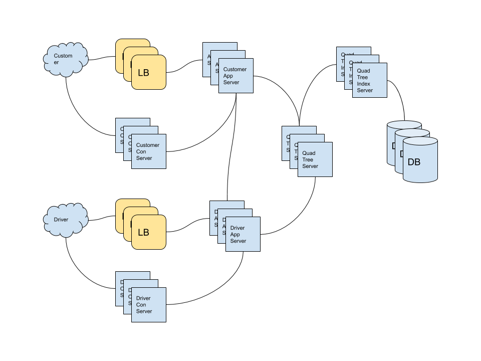

- [Requirements](#requirements)
  - [Functional Requirements](#functional-requirements)
  - [Non-functional Requirements](#non-functional-requirements)
- [Capacity Estimation and Constraints](#capacity-estimation-and-constraints)
  - [Traffic Estimates](#traffic-estimates)
  - [Storage Estimates](#storage-estimates)
  - [Network](#network)
- [System APIs](#system-apis)
- [High-level Architecture](#high-level-architecture)
- [Low-level Architecture](#low-level-architecture)
  - [Process of a ride.](#process-of-a-ride)
- [System Extentions](#system-extentions)
- [Q&A](#qa)
- [References](#references)

-----

# Requirements

## Functional Requirements

* Drivers notify the system their location and availability for passengers.
* Passengers check available drivers near around them.
* Customers request a ride and neary by drivers are notified.
* Once a driver and customer accept a ride, they can see each other's location, until the trip is finished.
* When they arrive the destination, the driver marks the ride completed and become available for the next ride.

## Non-functional Requirements

* Latency should be under 100 ms.
* The system should be high availble.

# Capacity Estimation and Constraints

## Traffic Estimates

| Number                                       | Description      |
| -------------------------------------------- | ---------------- |
| 300 M customers | RU of customers |
| 1 M drivers | RU of drivers |
| 1 M customers | DAU of customers |
| 500 K drivers | DAU of drivers |
| 3 per sec | drivers notify location per sec |

## Storage Estimates

| Number                                       | Description      |
| -------------------------------------------- | ---------------- |
| 3 bytes | driver_id |
| 8 bytes | latitude, longitude |
| 35 byets (3 + 8 + 8 + 8 + 8) | value of DriverLocationHashTable. `{driver_id:{old_latitude,old_longitude,new_latitude,new_longitude}}` |
| 35 MB (1 M * 35 bytes) | Hash Table for driver locations  |
| 5 customers | average subscribed customers for one driver |
| 8 bytes | customer_id |
| 21 MB (500 K * 3 bytes (driver_id) + 500K * 5 average subscribers * 8 bytes) | Hash Table of subscribers for drivers |

## Network


| Number                                       | Description      |
| -------------------------------------------- | ---------------- |
| 2.5 M (5 * 500 K) | total subscribers of drivers |
| 47.5 MB/s (2.5 M * 19 bytes) | egress of drivers' locations per sec |

# System APIs

```
view_drivers(api_key, customer_location)

request_ride(api_key, src_location, dst_location)

accept_driver(api_key, driver_id)

cancel_driver(api_key, ride_id)
```

```
accept_customer(api_key, customer_id)

notify_driver_location(api_key, driver_location)
```

# High-level Architecture



# Low-level Architecture

* The system should update Quad Tree every 10 seconds.
* The system store DriverLocationHashTable with `{driver_id:{old_latitude,old_longitude,new_latitude,new_longitude}}`.
  * driver_id : 3 bytes (RU of driver is 1 M)
  * others are 8 bytes
  * The size of value is 35 bytes without hash table overhead.
  * Driver Location Server will hold DriverLocationHashTable.
* Driver Notification Server will notify customers' location to drivers.
* Customer Notification Server will notify drivers' location to customers.
* Notification Server provide long polling or push.
* when the customer opens a application, the customer will subscribe to drivers which place in the area of the customer.When a new driver comes in the area a customer is looking at, the customer will be subscribed to the new driver. 

## Process of a ride.

* The customer send a request for a ride.
* The Application Server send a request to Quad Tree Server.
* The Application Server gather nearby drivers and sort them and responds to the customer.
* The Application Server notify a new ride to top 3 drivers.
* The driver which accept the ride first will be assgined the ride. What if no driver accept the Application Server notify to other 3 drivers.
* Once a driver accept a ride, the customer will be notified.

# System Extentions

# Q&A

# References

* [Build a Geospatial App with Redis 3.2- Andrew Bass, Coding House @ youtube](https://www.youtube.com/watch?v=94qOaGA31II)
* [REDIS Geo API @ joinc](https://www.joinc.co.kr/w/man/12/REDIS/geo)
* [GEOHASH @ joinc](https://www.joinc.co.kr/w/man/12/geohash)
* [UBER system design @ medium](https://medium.com/@narengowda/uber-system-design-8b2bc95e2cfe)
* [System Design Interview: mini Uber @ medium](https://medium.com/@eileen.code4fun/system-design-interview-mini-uber-a48444258402)
* [Uber System Design | Ola System Design | System Design Interview Question - Grab, Lyft @ youtube](https://www.youtube.com/watch?v=Tp8kpMe-ZKw)
  * [Uber System Design Diagram @ github](https://github.com/codekarle/system-design/blob/master/system-design-prep-material/architecture-diagrams/Uber%20System%20Design.png)
