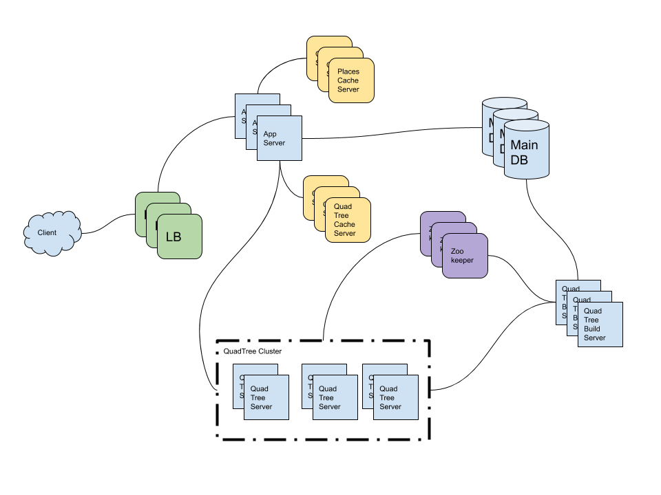

- [Requirements](#requirements)
  - [Functional Requirements](#functional-requirements)
  - [Non-functional Requirements](#non-functional-requirements)
- [Capacity Estimation and Constraints](#capacity-estimation-and-constraints)
  - [Traffic Estimates](#traffic-estimates)
  - [Storage Estimates](#storage-estimates)
- [System APIs](#system-apis)
- [DataBase Schema](#database-schema)
- [High-level Architecture](#high-level-architecture)
  - [Components](#components)
- [Low-level Architecture](#low-level-architecture)
  - [Search with Simple RDBMS SQL](#search-with-simple-rdbms-sql)
  - [Search with static size grids](#search-with-static-size-grids)
  - [Search with dynamic size grids (QuardTree)](#search-with-dynamic-size-grids-quardtree)
  - [Sharding](#sharding)
    - [Based on region](#based-on-region)
    - [Based on capacity](#based-on-capacity)
  - [Replication and Fault Tolerance](#replication-and-fault-tolerance)
- [System Extentions](#system-extentions)
- [Q&A](#qa)
- [References](#references)

-----

# Requirements

## Functional Requirements

* Users add, delete, update places.
* Users search places with terms, longitude, latitude.
* Users add, delete, update feedback of places.

## Non-functional Requirements

* The system provides real-time search result.
* The system provides heavy search load.

# Capacity Estimation and Constraints

## Traffic Estimates

| Number                                       | Description      |
| -------------------------------------------- | ---------------- |
| 500 M places | the number of places |
| 100 K | queries per sec |
| 20 % | growth of places, QPS each year |

## Storage Estimates

| Number                                       | Description      |
| -------------------------------------------- | ---------------- |
| 0.5 TB (500 M * 1 K) | storage for 1 year |
| 2 Billion | places for 10 year |
| 2 TB (2 Billion * 1 K) | storage for 10 year |

# System APIs

```cpp
search(
  api_key,
  terms,
  radius,
  category,
  filter,
  page_size,
  page_no
)
```

```cpp
add_place(
  api_key,
  name,
  latitude,
  longitude,
  category,
  description,
  photos
)
```

```cpp
add_review(
  user_id,
  place_id,
  rating,
  review,
  photos
)
```

# DataBase Schema

```sql
CREATE TABLE user (
    user_id int PRIMARY KEY,
    username text,
    password text,
    email text,
    created_at timestamp,
    created_by int,
    updated_at timestamp,
    updated_by int,
    last_login timestamp
);

CREATE TABLE place (
    place_id int PRIMARY KEY,
    description text,
    latitude float,
    longitude float,
    created_at timestamp,
    created_by int,
    updated_at timestamp,
    updated_by int,
);

CREATE TABLE review (
    review_id int PRIMARY KEY,
    place_id int,
    user_id int,
    rating int,
    description text,
    created_at timestamp,
    created_by int,
    updated_at timestamp,
    updated_by int,
);
```

# High-level Architecture



## Components

* QuardTree Server: subtree of QuardTree
* QuardTree Build Server: Store `{quard_tree_server_id : [{place_id, latitude, longitude},...]}`.

# Low-level Architecture

## Search with Simple RDBMS SQL

This is query will return huge search results.

```sql
SELECT * 
  FROM place 
 WHERE latitude BETWEEN 100 - 10 AND 100 + 10 AND
       longitude BETWEEN 85 - 10 AND 85 + 10
```

## Search with static size grids

* [Earth Data Analytics Online Certificate](https://www.earthdatascience.org/courses/use-data-open-source-python/intro-vector-data-python/spatial-data-vector-shapefiles/geographic-vs-projected-coordinate-reference-systems-python/)

----

Let's assume specific grid is `[x1,y1,x2,y2]`. These are it's 8 neighbors.

```
Left:         ([x1-10,x2-10], [y1,y2])
Right:        ([x1+10,x2+10], [y1,y2])   
Top:          ([x1,x2], [y1-10,y2-10])   
Bottom:       ([x1,x2], [y1+10,y2+10]) 
Top-Left:     ([x1-10,x2-10], [y1-10,y2-10])
Top-Right:    ([x1+10,x2+10], [y1-10,y2-10])
Bottom-Left:  ([x1-10,x2-10], [y1+10,y2+10])
Bottom-Right: ([x1+10,x2+10], [y1+10,y2+10])
```

This sql improve the overall runtime perfomance. But in case of hot locations, this will return huge search results.

```sql
SELECT * 
  FROM place
 WHERE latitude BETWEEN 100 - 10 AND 100 + 10 AND
       longitude BETWEEN 85 - 10 AND 85 + 10 AND
       grid_id in (<main_grid_id>, 
                   <left_grid_id>,
                   <right_grid_id>,
                   <top_grid_id>,
                   <bottom_grid_id>,
                   <top_left_grid_id>,
                   <top_right_grid_id>,
                   <bottom_left_grid_id>,
                   <bottom_right_grid_id>);
```


These are numbers for GRID cache.

| Number                                       | Description      |
| -------------------------------------------- | ---------------- |
| 10 miles | radius |
| 200 M square miles | miles of the earth |
| 20 M grids (200 M square miles / 10 miles) | the number of grids |
| 4 bytes | id for grid |
| 8 bytes | location id |
| 4 GB (20 M grids * 4 + 500 M * 8) | total grid data size for all places |

## Search with dynamic size grids (QuardTree)

If we use quard tree, we can make every grid has 500 places at most. And the number of search results will be small such as 500.


```java
// arguments:
//   root node of QuardTree
//   latitude
//   longitude
//   radius
List<Places> places = getNearByPlaces(root, 100, 85, 10);

Place getNearByPlaces(root, latitude, longitude, radius) {
    Place places = new ArrayList<Place>();
    // If there is no intersection within the area, return empty list
    if (!root.intersect(latitude, longitude, radius))
        return places;
    // Return all the places of the leaf node
    if (root.isLeaf()) {
        places.addAll(root.getPlaces());
        return places;
    }
    // Recursively append the places from the 4 quadrants
    places.addAll(getNearByPlaces(root.northEast, latitude, longitude, radius));
    places.addAll(getNearByPlaces(root.northWest, latitude, longitude, radius));
    places.addAll(getNearByPlaces(root.southEast, latitude, longitude, radius));
    places.addAll(getNearByPlaces(root.southWest, latitude, longitude, radius));
    return places;
}
```

These are numbers for QuardTree cache. We need to divide nodes until one QuardTree node has 500 places.

| Number                                       | Description      |
| -------------------------------------------- | ---------------- |
| 500 M | all places |
| 8 bytes | data size of location_id, latitude, longitude |
| 12 GB ((8 + 8 + 8) * 500 M) | location_id, latitude, longitude for all places |
| 1 M grids (500 M / 500) | leaf nodes |
| 0.33 M grids (1 M grids * 1/3 )| internal nodes |
| 10 MB (1M * 1/3 * 4 * 8) | pointer size of internal nodes. 4 is number of children. 8 is size of a pointer |
| 12 GB (12 GB + 10 MB) | total grid data size for all places. |

## Sharding

### Based on region

* It is possible to have a hot QuardTree server because of hot locations.

### Based on capacity

* Quad Tree Build Server will allocate quard tree to quad tree server based on number of places.

## Replication and Fault Tolerance

* What if primary and secondary Quad Tree Server die at the same time?
  * Zookeeper catch the event and route it to Quad Tree Build Server
  * Quad Tree Build Server will provision Quad Tree servers.
  * Quad Tree Server will build quad tree after pulling data from Quad Tree Build Server.

# System Extentions

# Q&A

# References

* [Yelp system design | amazon interview question Yelp software architecture @ youtube](https://www.youtube.com/watch?v=TCP5iPy8xqo)
* [Design a proximity server like NearBy or Yelp Part — 1 @ medium](https://medium.com/swlh/design-a-proximity-server-like-nearby-or-yelp-part-1-c8fe2951c534)
  * [Design a proximity server like Yelp Part — 2 @ medium](https://codeburst.io/design-a-proximity-server-like-yelp-part-2-d430879203a5)
* [Quad Tree @ geeksforgeeks](https://www.geeksforgeeks.org/quad-tree/)
* [An interactive explanation of quadtrees.](https://jimkang.com/quadtreevis/)
