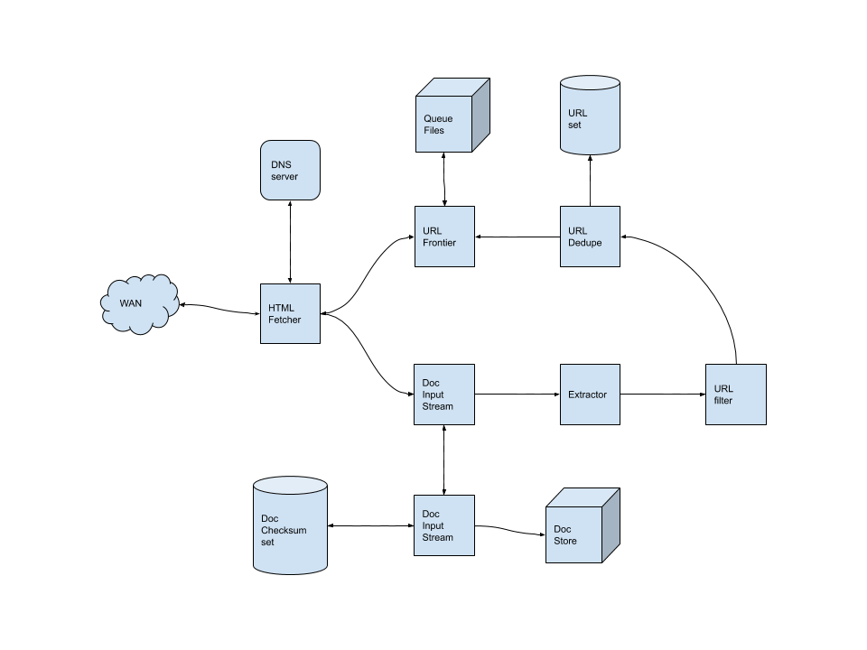

- [Requirements](#requirements)
  - [Functional Requirements](#functional-requirements)
  - [Non-functional Requirements](#non-functional-requirements)
  - [Extended Requirements](#extended-requirements)
- [Estimation](#estimation)
  - [Traffic](#traffic)
  - [Storage](#storage)
- [High Level Design](#high-level-design)
  - [How to process](#how-to-process)
  - [System APIs](#system-apis)
- [Low Level Design](#low-level-design)
  - [How to crawl ?](#how-to-crawl-)
  - [Components](#components)
- [Extentions](#extentions)
- [Q&A](#qa)
- [Implementation](#implementation)
- [References](#references)

-----

# Requirements

## Functional Requirements

* It collects web documents recursively.

## Non-functional Requirements

* Scalability
* Extensibility

## Extended Requirements

* HTML only. Supports other media types.
* Supports FTP.
* Limit of pages.
* Robots exclusion protocol (robot.txt).

# Estimation

## Traffic

| Number                                       | Description      |
| -------------------------------------------- | ---------------- |
| 15 Billioin pages   | pages for 4 weeks |
| 6200 pages/sec (15B / (4 weeks * 7 days * 86400 sec) | pages per sec |

## Storage

| Number                                       | Description      |
| -------------------------------------------- | ---------------- |
| 100 KB | average page size |
| 500 B  | average meta data size per a page |
| 1.5 PB (15B * (100KB + 500)) | total data size  |
| 2.14 PB (1.5 PB / 0.7) | total data size after 70% rule |

# High Level Design

## How to process

* Gather urls not visited.
* Find out IP Address from urls.
* Eastablishes a connection and download web documents.
* Parse web documents to look for new urls.
* Add new urls to the not-visited urls.
* Store documents and make an index.

## System APIs

```
collect(api_key,
        root_url)
```

# Low Level Design



## How to crawl ?

* BFS
* DFS
* Path-ascending crawling
  * `/a/b/`, `/a/`, and `/` for http://foo.com/a/b/page.html

## Components

* URL Frontier
  * Store urls and prioritize them.
* Queue Files
* DNS Resolver
  * Requesting DNS is a bottle kneck. We need to make a local DNS server for caching.
* HTML Fetcher
  * Download web documents.
* DIS (Document Input Stream)
  * This is a cache for web documents.
* Document Dedupe Test
  * This prevents to download same documents with different urls multiple times.
  * This uses checksum to distinguish documents including MD5, SHA1.
* Document Store
  * Store web documents, urls, meta-data.
* Document Checksum Set
* Extractor
  * Extract links from web documents.
* URL filters
  * This filters urls including black list.
* URL dedupe test
  * Make urls unique.
* URL set
* Checkpointing
  * Save checkpoints and restore them.

# Extentions

# Q&A

# Implementation

* [crawler4j @ github](https://github.com/yasserg/crawler4j)

# References

* [Crawler @ github](https://github.com/DreamOfTheRedChamber/system-design/blob/master/crawler.md)
* [awesome crawler @ github](https://github.com/BruceDone/awesome-crawler)
