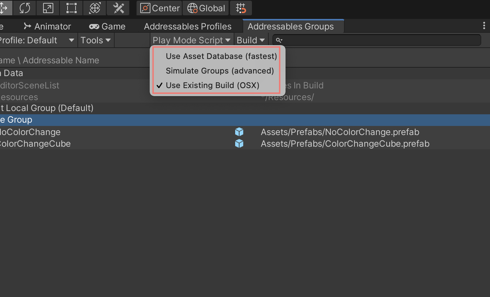
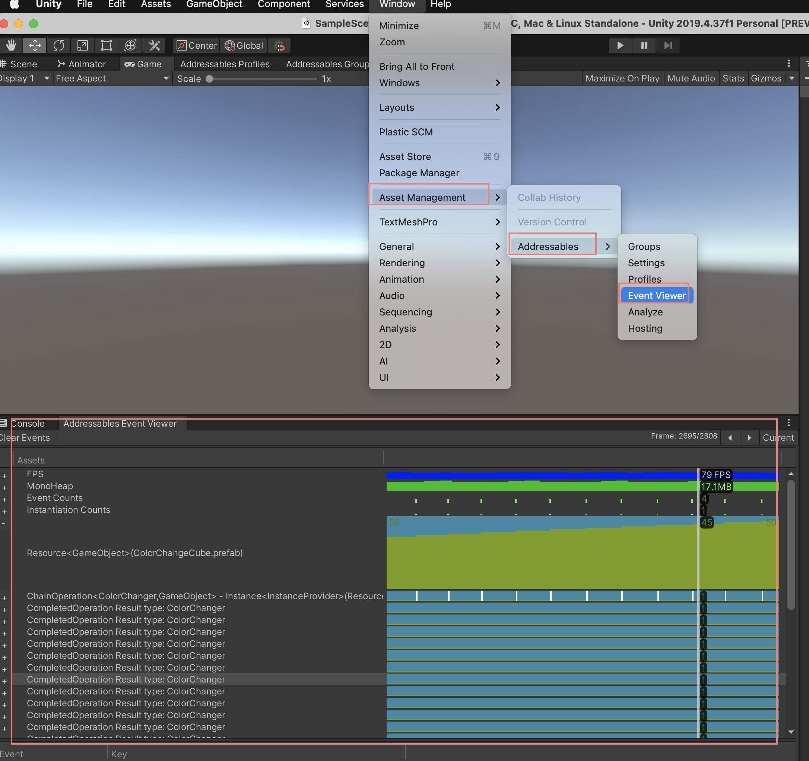
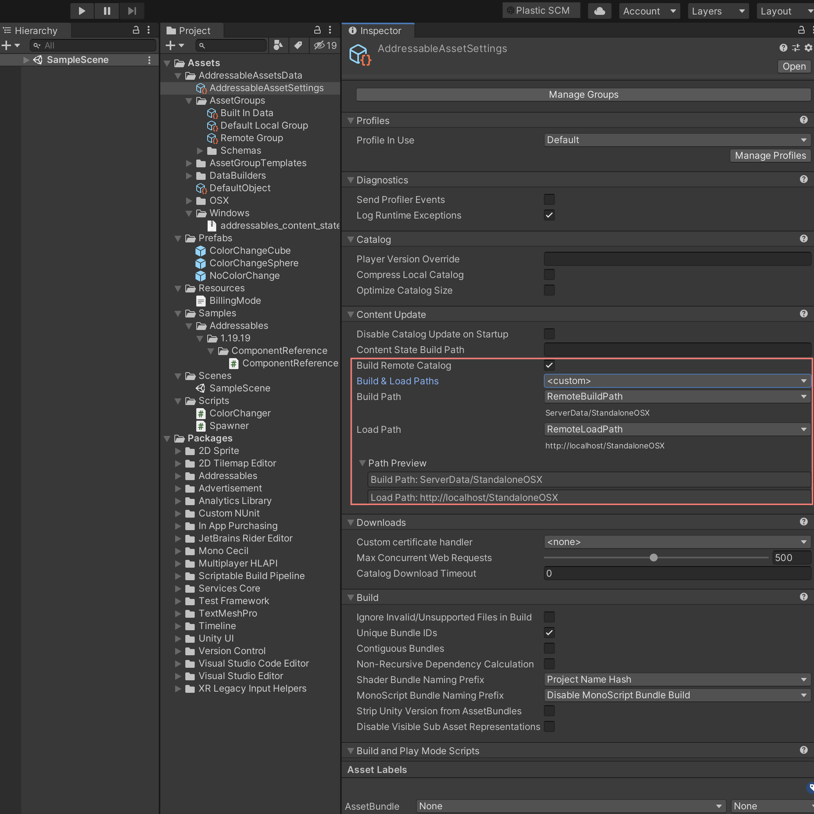
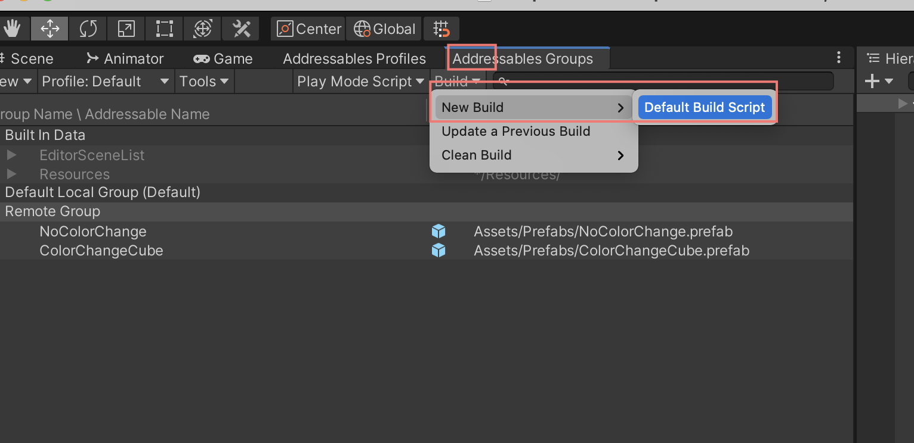

# Abstract

Unity 의 새로운 Asset Management System 이다. Asset Bundle 을 이용한다. Dependency 문제를 해결해 준다. 변경된 Asset 만 다운로드 할 수 있다.

# Materials

* [Addressables](https://docs.unity3d.com/Packages/com.unity.addressables@1.19/manual/index.html)
* [Unity Addressable Asset System 기본 개념](https://young-94.tistory.com/47)
* [Addressables-Sample | github](https://github.com/Unity-Technologies/Addressables-Sample)
* [어드레서블(Addressable) (4) - 서버와 함께 사용하기! (완) | youtube](https://www.youtube.com/watch?v=qL7PXAFNP5M&list=PLmRK0lH8TNCo7K4xmLpEov4llbVTwf29s&index=6)
  * AWS S3 에 Asset Bundle 을 Upload 하고 Unity Player 에서 다운로드하는 것을 시연함.
  * [유니티(Unity) - Addressable(어드레서블) 사용법(8). 서버에서 다운로드하기 2편[Catalog 이해]](https://blog.naver.com/cdw0424/221756844361)

# Basic

## Dependency Issues

Asset Bundle 을 사용하면 다음과 같은 상황에서 `a.png` 가 `A.bundle, B.bundle` 에 똑같이 포함된다.

```
A.prefab (a.png) -> A.bundle
B.prefab (a.png) -> B.bundle
```

Addressable 을 사용하면 이 것이 어떻게 해결된다는 것임?

## Play Mode

다음과 같은 3 가지 Play Mode 가 있다.

* Use Asset Database
* Simulate Groups
* Use Existing Build



## Load Remote Bundles

Addressable Asset 을 load 하는 방법을 설명한다.

* `InstanciateAsync()`
  * 아직 다운로드 되어있지 않는 asset 들을 다운로드 하고 load 한다.
* `DownloadDependenciesAsync()`
  * 의존성이 있는 asset 들을 한번에 다운받는다.
* `GetDownloadSizeAsync()`
  * Download Size 를 미리 알 수 있다??? 

## Addressable Event Viewer

Addressable Event Viewer 로 Asset 을 Profiling 할 수 있다.
반드시 `~/Assets/AddressableAssetData/AddressableAssetSettings` 의 `Send Profiler Events` 가 켜있어야 한다.



## Build Remote Bundles

AWS S3 에 upload 할 remote bundle 을 export 하자.

export 를 원하는 addressable group 의 `Build Path, Load Path` 를 `Remote Build Path, Remote Load Path` 로 수정한다. 반드시 `~/Assets/AddressableAssetData/AddressableAssetSettings` 의 `Build Remote Catalog` 를 켜야한다.



그리고 `New Build | Default Build Script` 를 선택한다.



`catalog*.json, catalog*.hash, remote*.bundle` 이 export 되었다.
