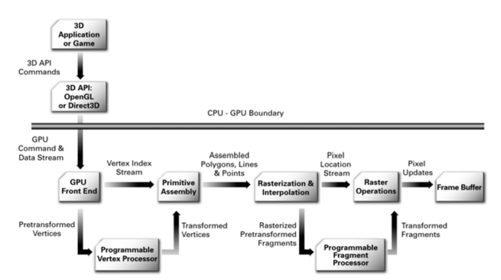
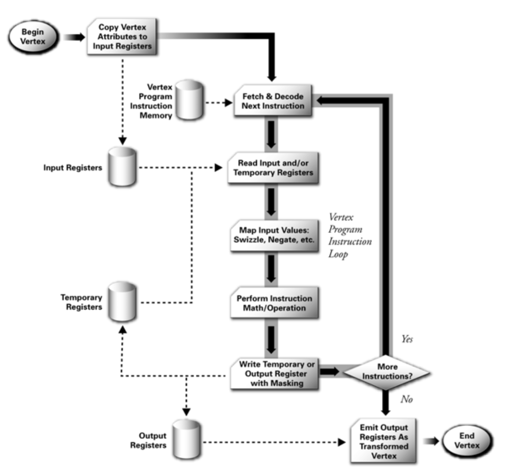
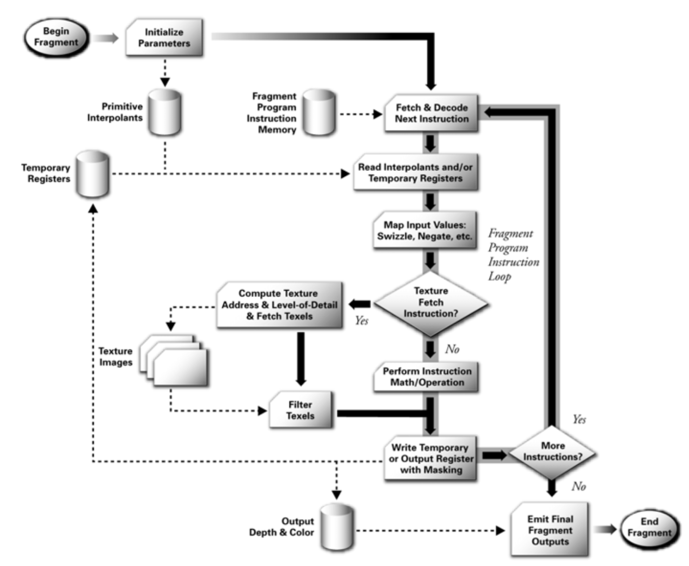
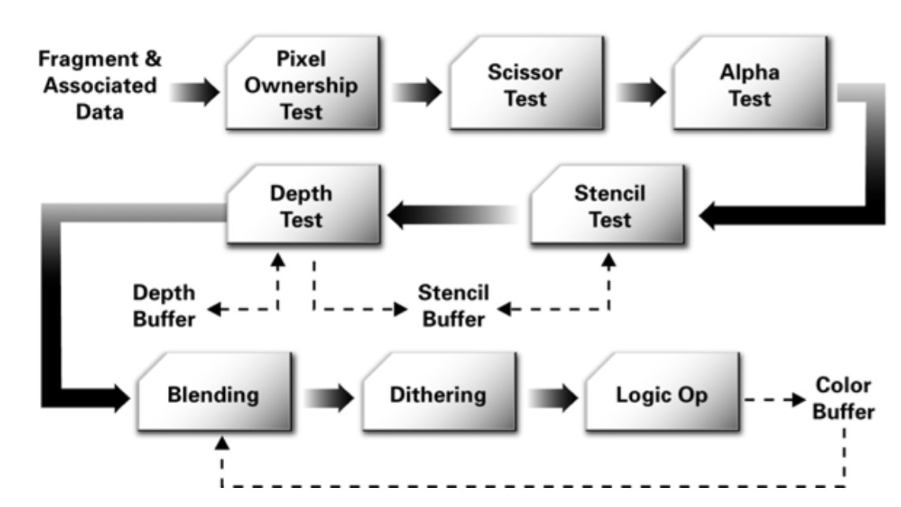

# abstract

- untity3d의 shader에 대해 정리해본다.
- unity3d는 shader lab이라는 language로 shader를 표현한다.
- unity3d shader lab은 fixed function과 programmable pipeline으로 표현할 수 있다.
- programmable pipeline에는 vertex, fragment, surface shader가 있다.
- shader lab은 여러개의 subshader로 구성되어 있다. subshader는
  여러개의 pass로 구성될 수 있다. subshader는 하드웨어의 성능이 열악한 순서대로 기록한다.
- shader lab은 중간에 cg를 사용할 것을 추천한다. cg는 nvidia가 microsoft와 
  함께 개발한 shading language이다. directx, opengl을 지원한다. 그래서 unity3d shader
  lab이 cg사용을 권고하는 것 같다. 하지만 2012년 이후 개발이
  중단됬다. directx의 hlsl, opengl의 glsl은 사용할 일이 없을까???
- vertex shader는 vertex를 기준으로 연산한다. fragment shader는
  pixel을 기준으로 연산한다. fragment shader가 vertext shader보다 더
  많이 호출된다.
  - [cg tutorial](http://http.developer.nvidia.com/CgTutorial/cg_tutorial_chapter10.html)에
  다음과 같은 언급이 있다.  A fragment program executes for each
  fragment that is generated, so fragment programs typically run
  several million times per frame. On the other hand, vertex programs
  normally run only tens of thousands of times per frame
- suface shader로 작성하면 vertex, fragment shader로 코드가 변환되고 컴파일된다.
- fixed function shader로 작성하면 내부적으로 shader import time에
  vertex, fragment shader로 변환된다.

# learning material

- [shader development using unity5](http://shaderdev.com/p/shader-development-using-unity-5)
  - 유료이긴 하지만 가장 자세히 설명하는 동영상 강좌이다. 174$
- [1.2.3 The Graphics Hardware Pipeline](http://http.developer.nvidia.com/CgTutorial/cg_tutorial_chapter01.html)
  - shader를 잘 작성하기 위해 rendering pipeline을 잘 이해해야한다.
- [Unity 5.x Shaders and Effects Cookbook](https://books.google.co.kr/books?id=-llLDAAAQBAJ&printsec=frontcover&dq=unity3d+5.x+shader+cook+book&hl=ko&sa=X&redir_esc=y#v=onepage&q=unity3d%205.x%20shader%20cook%20book&f=false)
  - unity3d shader를 가장 잘 설명한 책이다. 
- [a gentle introduction to shaders in unity3d](http://www.alanzucconi.com/2015/06/10/a-gentle-introduction-to-shaders-in-unity3d/)
  - [Unity 5.x Shaders and Effects Cookbook](https://books.google.co.kr/books?id=-llLDAAAQBAJ&printsec=frontcover&dq=unity3d+5.x+shader+cook+book&hl=ko&sa=X&redir_esc=y#v=onepage&q=unity3d%205.x%20shader%20cook%20book&f=false) 저자 블로그이다.
  - PBR을 쉽게 이해할 수 있었다. PBR은 Lambertian처럼 lighting model중
    하나이다. unity3d에서 Standard라는 이름으로 사용된다. Metalic,
    Specular두가지가 중요하다.
- [Unity3d Shader Reference](https://docs.unity3d.com/Manual/SL-Reference.html)
  - RTFM
- [nvidia cg tutorial](http://http.developer.nvidia.com/CgTutorial/cg_tutorial_chapter01.html)
  - unity3d shader lab은 cg를 권고 하고 있다. cg에 대해 알아둘 필요가 있다.
- [unity cg programming](https://en.wikibooks.org/wiki/Cg_Programming/Unity)
  - 여러가지 예제들과 이론들이 풍부하다.
- [scratchapixel](http://www.scratchapixel.com/)
  - 밑바닥부터 설명하는 computer graphics

# The Graphics Hardware Pipeline

- Vertex Transformation
  - vertex의 screen position을 만들어낸다.
  - vertex의 텍스처 좌표를 만들어낸다.
  - vertex의 라이팅 정보를 만들어낸다.
- Primitive Assembly and Rasterization
  - 이전 단계에서 전달된 vertex들은 geometric primitive들로 조립된다.
  - 조립된 primitive들은 view frustum clipping, back face culling된다. 
  - clipping, culling에서 살아남은 polygon들은 rasterize되어 fragment들을 만들어낸다.
  - fragment는 번데기 pixel은 나비와 같다. fragment는 여러 처리를
    거쳐서 framebuffer의 pixel로 전환된다. 그래서 potential
    pixel이라고 한다.
    - A fragment has an associated pixel location, a depth value, and a
    set of interpolated parameters such as a color, a secondary
    (specular) color, and one or more texture coordinate sets.
- Interpolation, Texturing, and Coloring
  - fragment의 parameter들을 interpolate하고 fragment의 final color를 결정한다.
- Raster Operations
  - fragment마다 실행된다. depth testing, blending, sencil test가 수행된다.
  - 결국 frame buffer는 최종 처리된 컬러값을 쓴다.

- The Programmable Graphics Pipeline



- programmable vertex processor flow chart



- programmable fragment processor flow chart



- standard opengl and direct3d raster operations



# tutorial reference

- [fixed function shader tutorial](https://docs.unity3d.com/Manual/ShaderTut1.html)
- [vertex, fragment shader tutorial](https://docs.unity3d.com/Manual/SL-VertexFragmentShaderExamples.html)
- [surface shader tutorial](https://docs.unity3d.com/Manual/SL-SurfaceShaderExamples.html)

# tutorial

## fixed function shader

- 빨간 색으로 칠하자.

```
Shader "Custom/A" {
    SubShader { 
        Pass {
            Color (1,0,0,1)
        } 
    } 
}
```

- Direct Light를 배치하고 Cube의 표면에 Diffuse, Ambient를 적용하자. 
  - Direct Light를 활성화 비활성화 해보면 차이를 알 수 있다.
  - Lighting On은 Material이 없으면 작동하지 않는다.

```
Shader "Custom/A"{ 
    SubShader { 
        Pass { 
            Material { 
                Diffuse (1,1,1,1) 
                Ambient (1,1,1,1) 
            } 
            Lighting On 
        } 
    } 
}
```

- Properties를 이용하여 Diffuse, Ambient를 조정할 수 있게 해보자.

```
Shader "Custom/A"{ 
    Properties { 
        _MyColor ("Main Color", COLOR) = (0,0,1,1) 
    } 
    SubShader { 
        Pass { 
            Material { 
                Diffuse [_MyColor] 
                Ambient [_MyColor] 
            } 
            Lighting On 
        } 
    } 
} 
```

- Properties를 이용하여 texture를 지정해 보자.

```
Shader "Custom/A" { 
    Properties { 
        _MyColor ("Main Color", COLOR) = (1,1,1,1) 
        _MainTex ("Base Texture", 2D) = "white" {} 
    } 
    SubShader { 
        Pass { 
            Material { 
                Diffuse [_MyColor] 
                Ambient [_MyColor] 
            } 
            Lighting On 

            SetTexture [_MainTex]  
        } 
    } 
} 
```

- texture는 color와 blending되고 light적용도 받게 해보자.

```
Shader "Custom/A"{ 
    Properties { 
        _MyColor ("Main Color", COLOR) = (0,0,1,1) 
        _MainTex ("Base Texture", 2D) = "white" {} 
    } 
    SubShader { 
        Pass { 
            Material { 
                Diffuse [_MyColor] 
                Ambient [_MyColor] 
            } 
            Lighting On 

            SetTexture [_MainTex] { 
                    Combine texture * primary DOUBLE 
            } 
        } 
    } 
} 
```

- 두장의 텍스처를 섞어 보자.
  - A lerp(B) C 의 의미는 다음과 같다.
    - B의 alpha값을 확인해서 A와 B값을 보간하여 사용한다.
    - B의 alpha값이 1이면 A를 사용하고 0이면 B를 사용한다.

```
Shader "Custom/A"{ 
    Properties { 
         _MainTex("Texture", 2D) = "white" {} 
         _SubTex("Texture", 2D) = "white" {} 
    } 
    SubShader { 
           Pass { 
               SetTexture [_MainTex] { 
                 Combine texture
               } 
                                                 
               SetTexture [_SubTex] { 
                 Combine texture lerp(texture) previous 
               } 
           } 
    } 
}
```

- 반 투명한 물체를 만들어 보자.
  - _Color의 alpha값을 조정해보니 투명해진다. 하지만 가려진 물체는 안그려진다. 왜지???
  

```
Shader "Custom/A"{ 
    Properties { 
        _Color ("Main Color", COLOR) = (1,1,1,1) 
        _MainTex("Texture", 2D) = "white" {} 
        _SubTex("Texture", 2D) = "white" {} 
    } 
    SubShader { 
        Pass { 
                 Blend SrcAlpha OneMinusSrcAlpha 
                
                 SetTexture [_MainTex] { 
                          Combine texture 
                 } 
                                                                       
                 SetTexture [_SubTex] { 
                          ConstantColor[_Color] 
                          Combine texture lerp(texture) previous, constant 
                 }
        } 
    } 
} 
```

- cg를 이용해서 simple unlit을 만들어 보자.
  - Light와 상관없이 텍스처를 보여주자.
  - : POSITION, : TEXCOORD0, : SV_Target 등은 semantic이라고 한다.
    - cg에게 해당 변수를 어떤 용도로 사용하겠다는 의도를 표현한다.
    - [이곳](https://docs.unity3d.com/Manual/SL-ShaderSemantics.html)에 자세한 설명이 있다.

```cg
Shader "Custom/A"
{
    Properties
    {
        // we have removed support for texture tiling/offset,
        // so make them not be displayed in material inspector
        [NoScaleOffset] _MainTex ("Texture", 2D) = "white" {}
    }
    SubShader
    {
        Pass
        {
            CGPROGRAM
            // use "vert" function as the vertex shader
            #pragma vertex vert
            // use "frag" function as the pixel (fragment) shader
            #pragma fragment frag

            // vertex shader inputs
            struct appdata
            {
                float4 vertex : POSITION; // vertex position
                float2 uv : TEXCOORD0; // texture coordinate
            };

            // vertex shader outputs ("vertex to fragment")
            struct v2f
            {
                float2 uv : TEXCOORD0; // texture coordinate
                float4 vertex : SV_POSITION; // clip space position
            };

            // vertex shader
            v2f vert (appdata v)
            {
                v2f o;
                // transform position to clip space
                // (multiply with model*view*projection matrix)
                o.vertex = mul(UNITY_MATRIX_MVP, v.vertex);
                // just pass the texture coordinate
                o.uv = v.uv;
                return o;
            }
            
            // texture we will sample
            sampler2D _MainTex;

            // pixel shader; returns low precision ("fixed4" type)
            // color ("SV_Target" semantic)
            fixed4 frag (v2f i) : SV_Target
            {
                // sample texture and return it
                fixed4 col = tex2D(_MainTex, i.uv);
                return col;
            }
            ENDCG
        }
    }
}
```

- culling을 적용해 보자.
  - front를 culling하자 backface만 rendering된다.
  - 자세한 설명은 [이곳](https://docs.unity3d.com/Manual/SL-CullAndDepth.html)을 참고하자.
  
```
Shader "Show Insides" {
    SubShader {
        Pass {
            Material {
                Diffuse (1,1,1,1)
            }
            Lighting On
            Cull Front
        }
    }
}
```

- depth testing을 적용해 보자.
  - 특정 fragment는 depth testing을 통과할때 frame buffer에 쓰자.
  - 자세한 설명은 [이곳](https://docs.unity3d.com/Manual/SL-CullAndDepth.html)을 참고하자.
  
```
Shader "Transparent/Diffuse ZWrite" {
Properties {
    _Color ("Main Color", Color) = (1,1,1,1)
    _MainTex ("Base (RGB) Trans (A)", 2D) = "white" {}
}
SubShader {
    Tags {"Queue"="Transparent" "IgnoreProjector"="True" "RenderType"="Transparent"}
    LOD 200

    // extra pass that renders to depth buffer only
    Pass {
        ZWrite On
        ColorMask 0
    }

    // paste in forward rendering passes from Transparent/Diffuse
    UsePass "Transparent/Diffuse/FORWARD"
}
Fallback "Transparent/VertexLit"
}
```

- stencil testing을 적용해 보자.
  - 특정 fragment는 stencil testing을 통과할때 framebuffer에 쓰자.
  - 자세한 설명은 [이곳](https://docs.unity3d.com/Manual/SL-Stencil.html)을 참고하자.
  - 연두색 물체는 빨강색 물체보다 앞에 있지만 stencil testing을 통과한 fragment들만 렌더링 된다.
  - stencil buffer는 기본적으로 0값을 가지고 있다.
  - Editor를 통해서 값을 변경해 가면서 이해하자.
  
```
Shader "Red" {
    SubShader {
        Tags { "RenderType"="Opaque" "Queue"="Geometry"}
        Pass {
            Stencil {
                Ref 2
                Comp always
                Pass replace
            }
        
            CGPROGRAM
            #pragma vertex vert
            #pragma fragment frag
            struct appdata {
                float4 vertex : POSITION;
            };
            struct v2f {
                float4 pos : SV_POSITION;
            };
            v2f vert(appdata v) {
                v2f o;
                o.pos = UnityObjectToClipPos(v.vertex);
                return o;
            }
            half4 frag(v2f i) : SV_Target {
                return half4(1,0,0,1);
            }
            ENDCG
        }
    } 
}
```

```
Shader "Green" {
    SubShader {
        Tags { "RenderType"="Opaque" "Queue"="Geometry+1"}
        Pass {
            Stencil {
                Ref 2
                Comp equal
                Pass keep 
                ZFail decrWrap
            }
        
            CGPROGRAM
            #pragma vertex vert
            #pragma fragment frag
            struct appdata {
                float4 vertex : POSITION;
            };
            struct v2f {
                float4 pos : SV_POSITION;
            };
            v2f vert(appdata v) {
                v2f o;
                o.pos = UnityObjectToClipPos(v.vertex);
                return o;
            }
            half4 frag(v2f i) : SV_Target {
                return half4(0,1,0,1);
            }
            ENDCG
        }
    } 
}
```

- blending 을 적용해보자.
  - Blend의 [문법](https://docs.unity3d.com/460/Documentation/Manual/SL-Blend.html)을 먼저 이해해야 한다.
  - blend의 문법은 다음과 같다. Blend SrcFactor DstFactor
    - src는 현재 fragment의 color이다. dst는 framebuffer에 이미 존재하는 color이다.
    - srcFactor를 src의 color에 곱하고 dstFactor를 dst의 color에 곱한후 두가지를 더한다.
    - 물론 더하기 말고 다양한 blend operation들을 적용할 수 있다.
  
```
Shader "Simple Additive" {
    Properties {
        _MainTex ("Texture to blend", 2D) = "black" {}
    }
    SubShader {
        Tags { "Queue" = "Transparent" }
        Pass {
            Blend One One
            SetTexture [_MainTex] { combine texture }
        }
    }
}
```


## vertex, fragment shader

- vertex, fragment shader를 이용하여 한가지 색으로 칠해보자.

```
// Upgrade NOTE: replaced 'mul(UNITY_MATRIX_MVP,*)' with 'UnityObjectToClipPos(*)'

Shader "Unlit/SingleColor"
{
    Properties
    {
        // Color property for material inspector, default to white
        _Color ("Main Color", Color) = (1,1,1,1)
    }
    SubShader
    {
        Pass
        {
            CGPROGRAM
            #pragma vertex vert
            #pragma fragment frag

            // vertex shader
            // this time instead of using "appdata" struct, just spell inputs manually,
            // and instead of returning v2f struct, also just return a single output
            // float4 clip position
            float4 vert (float4 vertex : POSITION) : SV_POSITION
            {
                return UnityObjectToClipPos(vertex);
            }
            
            // color from the material
            fixed4 _Color;

            // pixel shader, no inputs needed
            fixed4 frag () : SV_Target
            {
                return _Color; // just return it
            }
            ENDCG
        }
    }
}

```

- normal맵을 적용해보자.

```
Shader "Unlit/WorldSpaceNormals"
{
    // no Properties block this time!
    SubShader
    {
        Pass
        {
            CGPROGRAM
            #pragma vertex vert
            #pragma fragment frag
            #include "UnityCG.cginc"

            struct v2f {
                half3 worldNormal : TEXCOORD0;
                float4 pos : SV_POSITION;
            };

            v2f vert (float4 vertex : POSITION, float3 normal : NORMAL)
            {
                v2f o;
                o.pos = UnityObjectToClipPos(vertex);
                o.worldNormal = UnityObjectToWorldNormal(normal);
                return o;
            }
            
            fixed4 frag (v2f i) : SV_Target
            {
                fixed4 c = 0;
                c.rgb = i.worldNormal*0.5+0.5;
                return c;
            }
            ENDCG
        }
    }
}

```

- skymap을 reflect해보자.
  - worldViewDir는 특정 정점에서 카메라를 바라보는 vector이다.
  - refelct는 builtin cg function이다. I와 N을 입력받아 반사된 벡터 R을 리턴한다.
    - [reflect in cg](http://http.developer.nvidia.com/Cg/reflect.html)
    
```
Shader "Unlit/SkyReflection"
{
    SubShader
    {
        Pass
        {
            CGPROGRAM
            #pragma vertex vert
            #pragma fragment frag
            #include "UnityCG.cginc"

            struct v2f {
                half3 worldRefl : TEXCOORD0;
                float4 pos : SV_POSITION;
            };

            v2f vert (float4 vertex : POSITION, float3 normal : NORMAL)
            {
                v2f o;
                o.pos = UnityObjectToClipPos(vertex);
                // compute world space position of the vertex
                float3 worldPos = mul(_Object2World, vertex).xyz;
                // compute world space view direction
                float3 worldViewDir = normalize(UnityWorldSpaceViewDir(worldPos));
                // world space normal
                float3 worldNormal = UnityObjectToWorldNormal(normal);
                // world space reflection vector
                o.worldRefl = reflect(-worldViewDir, worldNormal);
                return o;
            }
        
            fixed4 frag (v2f i) : SV_Target
            {
                // sample the default reflection cubemap, using the reflection vector
                half4 skyData = UNITY_SAMPLE_TEXCUBE(unity_SpecCube0, i.worldRefl);
                // decode cubemap data into actual color
                half3 skyColor = DecodeHDR (skyData, unity_SpecCube0_HDR);
                // output it!
                fixed4 c = 0;
                c.rgb = skyColor;
                return c;
            }
            ENDCG
        }
    }
}
```

- skymap을 normal map과 함께 reflect해보자.
  - tangent space는 3차원의 물체를 2차원으로 만들때 다시 3차원으로
    복원하기 위해 2차원의 각 vertex마다 저장해 두는 정보이다. 3차원에
    복원에 사용되는 정보이다. 자세한 설명은 [이곳](http://rapapa.net/?p=2419) 참고
  
```
Shader "Unlit/SkyReflection Per Pixel"
{
    Properties {
        // normal map texture on the material,
        // default to dummy "flat surface" normalmap
        _BumpMap("Normal Map", 2D) = "bump" {}
    }
    SubShader
    {
        Pass
        {
            CGPROGRAM
            #pragma vertex vert
            #pragma fragment frag
            #include "UnityCG.cginc"

            struct v2f {
                float3 worldPos : TEXCOORD0;
                // these three vectors will hold a 3x3 rotation matrix
                // that transforms from tangent to world space
                half3 tspace0 : TEXCOORD1; // tangent.x, bitangent.x, normal.x
                half3 tspace1 : TEXCOORD2; // tangent.y, bitangent.y, normal.y
                half3 tspace2 : TEXCOORD3; // tangent.z, bitangent.z, normal.z
                // texture coordinate for the normal map
                float2 uv : TEXCOORD4;
                float4 pos : SV_POSITION;
            };

            // vertex shader now also needs a per-vertex tangent vector.
            // in Unity tangents are 4D vectors, with the .w component used to
            // indicate direction of the bitangent vector.
            // we also need the texture coordinate.
            v2f vert (float4 vertex : POSITION, float3 normal : NORMAL, float4 tangent : TANGENT, float2 uv : TEXCOORD0)
            {
                v2f o;
                o.pos = UnityObjectToClipPos(vertex);
                o.worldPos = mul(_Object2World, vertex).xyz;
                half3 wNormal = UnityObjectToWorldNormal(normal);
                half3 wTangent = UnityObjectToWorldDir(tangent.xyz);
                // compute bitangent from cross product of normal and tangent
                half tangentSign = tangent.w * unity_WorldTransformParams.w;
                half3 wBitangent = cross(wNormal, wTangent) * tangentSign;
                // output the tangent space matrix
                o.tspace0 = half3(wTangent.x, wBitangent.x, wNormal.x);
                o.tspace1 = half3(wTangent.y, wBitangent.y, wNormal.y);
                o.tspace2 = half3(wTangent.z, wBitangent.z, wNormal.z);
                o.uv = uv;
                return o;
            }

            // normal map texture from shader properties
            sampler2D _BumpMap;
        
            fixed4 frag (v2f i) : SV_Target
            {
                // sample the normal map, and decode from the Unity encoding
                half3 tnormal = UnpackNormal(tex2D(_BumpMap, i.uv));
                // transform normal from tangent to world space
                half3 worldNormal;
                worldNormal.x = dot(i.tspace0, tnormal);
                worldNormal.y = dot(i.tspace1, tnormal);
                worldNormal.z = dot(i.tspace2, tnormal);

                // rest the same as in previous shader
                half3 worldViewDir = normalize(UnityWorldSpaceViewDir(i.worldPos));
                half3 worldRefl = reflect(-worldViewDir, worldNormal);
                half4 skyData = UNITY_SAMPLE_TEXCUBE(unity_SpecCube0, worldRefl);
                half3 skyColor = DecodeHDR (skyData, unity_SpecCube0_HDR);
                fixed4 c = 0;
                c.rgb = skyColor;
                return c;
            }
            ENDCG
        }
    }
}
```
 
- skymap을 reflect하면서 normal map과 occlusion map을 적용해보자.

```
Shader "Unlit/More Textures"
{
    Properties {
        // three textures we'll use in the material
        _MainTex("Base texture", 2D) = "white" {}
        _OcclusionMap("Occlusion", 2D) = "white" {}
        _BumpMap("Normal Map", 2D) = "bump" {}
    }
    SubShader
    {
        Pass
        {
            CGPROGRAM
            #pragma vertex vert
            #pragma fragment frag
            #include "UnityCG.cginc"

            // exactly the same as in previous shader
            struct v2f {
                float3 worldPos : TEXCOORD0;
                half3 tspace0 : TEXCOORD1;
                half3 tspace1 : TEXCOORD2;
                half3 tspace2 : TEXCOORD3;
                float2 uv : TEXCOORD4;
                float4 pos : SV_POSITION;
            };
            v2f vert (float4 vertex : POSITION, float3 normal : NORMAL, float4 tangent : TANGENT, float2 uv : TEXCOORD0)
            {
                v2f o;
                o.pos = UnityObjectToClipPos(vertex);
                o.worldPos = mul(_Object2World, vertex).xyz;
                half3 wNormal = UnityObjectToWorldNormal(normal);
                half3 wTangent = UnityObjectToWorldDir(tangent.xyz);
                half tangentSign = tangent.w * unity_WorldTransformParams.w;
                half3 wBitangent = cross(wNormal, wTangent) * tangentSign;
                o.tspace0 = half3(wTangent.x, wBitangent.x, wNormal.x);
                o.tspace1 = half3(wTangent.y, wBitangent.y, wNormal.y);
                o.tspace2 = half3(wTangent.z, wBitangent.z, wNormal.z);
                o.uv = uv;
                return o;
            }

            // textures from shader properties
            sampler2D _MainTex;
            sampler2D _OcclusionMap;
            sampler2D _BumpMap;
        
            fixed4 frag (v2f i) : SV_Target
            {
                // same as from previous shader...
                half3 tnormal = UnpackNormal(tex2D(_BumpMap, i.uv));
                half3 worldNormal;
                worldNormal.x = dot(i.tspace0, tnormal);
                worldNormal.y = dot(i.tspace1, tnormal);
                worldNormal.z = dot(i.tspace2, tnormal);
                half3 worldViewDir = normalize(UnityWorldSpaceViewDir(i.worldPos));
                half3 worldRefl = reflect(-worldViewDir, worldNormal);
                half4 skyData = UNITY_SAMPLE_TEXCUBE(unity_SpecCube0, worldRefl);
                half3 skyColor = DecodeHDR (skyData, unity_SpecCube0_HDR);                
                fixed4 c = 0;
                c.rgb = skyColor;

                // modulate sky color with the base texture, and the occlusion map
                fixed3 baseColor = tex2D(_MainTex, i.uv).rgb;
                fixed occlusion = tex2D(_OcclusionMap, i.uv).r;
                c.rgb *= baseColor;
                c.rgb *= occlusion;

                return c;
            }
            ENDCG
        }
    }
}
```

- 체커보드 패턴으로 텍스처링 해보자.
  - frag()는 0(black) 아니면 1(white)을 리턴한다.
  - frac()는 0 아니면 0.5를 리턴한다.

```
Shader "Unlit/Checkerboard"
{
    Properties
    {
        _Density ("Density", Range(2,50)) = 30
    }
    SubShader
    {
        Pass
        {
            CGPROGRAM
            #pragma vertex vert
            #pragma fragment frag
            #include "UnityCG.cginc"

            struct v2f
            {
                float2 uv : TEXCOORD0;
                float4 vertex : SV_POSITION;
            };

            float _Density;

            v2f vert (float4 pos : POSITION, float2 uv : TEXCOORD0)
            {
                v2f o;
                o.vertex = UnityObjectToClipPos(pos);
                o.uv = uv * _Density;
                return o;
            }
            
            fixed4 frag (v2f i) : SV_Target
            {
                float2 c = i.uv;
                c = floor(c) / 2;
                float checker = frac(c.x + c.y) * 2;
                return checker;
            }
            ENDCG
        }
    }
}
```

- tri-planar texturing해보자.
  - 터레인(Height Field)에서 텍스쳐 매핑을 할 경우, 높이를 조절하면서
    텍스쳐가 늘어나는 현상을 방지하기 위해서, 축에 따라서 텍스쳐 uv를
    적용해주는 기술을 "Tri-Planar Texture Mapping" 이라고 한다.

```
Shader "Unlit/Triplanar"
{
    Properties
    {
        _MainTex ("Texture", 2D) = "white" {}
        _Tiling ("Tiling", Float) = 1.0
        _OcclusionMap("Occlusion", 2D) = "white" {}
    }
    SubShader
    {
        Pass
        {
            CGPROGRAM
            #pragma vertex vert
            #pragma fragment frag
            #include "UnityCG.cginc"

            struct v2f
            {
                half3 objNormal : TEXCOORD0;
                float3 coords : TEXCOORD1;
                float2 uv : TEXCOORD2;
                float4 pos : SV_POSITION;
            };

            float _Tiling;

            v2f vert (float4 pos : POSITION, float3 normal : NORMAL, float2 uv : TEXCOORD0)
            {
                v2f o;
                o.pos = UnityObjectToClipPos(pos);
                o.coords = pos.xyz * _Tiling;
                o.objNormal = normal;
                o.uv = uv;
                return o;
            }

            sampler2D _MainTex;
            sampler2D _OcclusionMap;
            
            fixed4 frag (v2f i) : SV_Target
            {
                // use absolute value of normal as texture weights
                half3 blend = abs(i.objNormal);
                // make sure the weights sum up to 1 (divide by sum of x+y+z)
                blend /= dot(blend,1.0);
                // read the three texture projections, for x,y,z axes
                fixed4 cx = tex2D(_MainTex, i.coords.yz);
                fixed4 cy = tex2D(_MainTex, i.coords.xz);
                fixed4 cz = tex2D(_MainTex, i.coords.xy);
                // blend the textures based on weights
                fixed4 c = cx * blend.x + cy * blend.y + cz * blend.z;
                // modulate by regular occlusion map
                c *= tex2D(_OcclusionMap, i.uv);
                return c;
            }
            ENDCG
        }
    }
}
```

- 간단한 diffuse lighting을 적용해보자.
  - Tags를 이용해서 forward rendering pipeline을 이용하고 있다.

```
Shader "Lit/Simple Diffuse"
{
    Properties
    {
        [NoScaleOffset] _MainTex ("Texture", 2D) = "white" {}
    }
    SubShader
    {
        Pass
        {
            // indicate that our pass is the "base" pass in forward
            // rendering pipeline. It gets ambient and main directional
            // light data set up; light direction in _WorldSpaceLightPos0
            // and color in _LightColor0
            Tags {"LightMode"="ForwardBase"}
        
            CGPROGRAM
            #pragma vertex vert
            #pragma fragment frag
            #include "UnityCG.cginc" // for UnityObjectToWorldNormal
            #include "UnityLightingCommon.cginc" // for _LightColor0

            struct v2f
            {
                float2 uv : TEXCOORD0;
                fixed4 diff : COLOR0; // diffuse lighting color
                float4 vertex : SV_POSITION;
            };

            v2f vert (appdata_base v)
            {
                v2f o;
                o.vertex = UnityObjectToClipPos(v.vertex);
                o.uv = v.texcoord;
                // get vertex normal in world space
                half3 worldNormal = UnityObjectToWorldNormal(v.normal);
                // dot product between normal and light direction for
                // standard diffuse (Lambert) lighting
                half nl = max(0, dot(worldNormal, _WorldSpaceLightPos0.xyz));
                // factor in the light color
                o.diff = nl * _LightColor0;
                return o;
            }
            
            sampler2D _MainTex;

            fixed4 frag (v2f i) : SV_Target
            {
                // sample texture
                fixed4 col = tex2D(_MainTex, i.uv);
                // multiply by lighting
                col *= i.diff;
                return col;
            }
            ENDCG
        }
    }
}
```

- diffuse lighting에 ambient lighting과 light probe를 적용해보자.
  - ambient와 light probe 데이터는 Spherical Harmonics form으로
    제공된다. UnityCG.cginc의 ShadeSH9함수는 world space normal 이
    주어지면 언급한 데이터를 계산해 낸다.
    
```
Shader "Lit/Diffuse With Ambient"
{
    Properties
    {
        [NoScaleOffset] _MainTex ("Texture", 2D) = "white" {}
    }
    SubShader
    {
        Pass
        {
            Tags {"LightMode"="ForwardBase"}
        
            CGPROGRAM
            #pragma vertex vert
            #pragma fragment frag
            #include "UnityCG.cginc"
            #include "UnityLightingCommon.cginc"

            struct v2f
            {
                float2 uv : TEXCOORD0;
                fixed4 diff : COLOR0;
                float4 vertex : SV_POSITION;
            };

            v2f vert (appdata_base v)
            {
                v2f o;
                o.vertex = UnityObjectToClipPos(v.vertex);
                o.uv = v.texcoord;
                half3 worldNormal = UnityObjectToWorldNormal(v.normal);
                half nl = max(0, dot(worldNormal, _WorldSpaceLightPos0.xyz));
                o.diff = nl * _LightColor0;

                // the only difference from previous shader:
                // in addition to the diffuse lighting from the main light,
                // add illumination from ambient or light probes
                // ShadeSH9 function from UnityCG.cginc evaluates it,
                // using world space normal
                o.diff.rgb += ShadeSH9(half4(worldNormal,1));
                return o;
            }
            
            sampler2D _MainTex;

            fixed4 frag (v2f i) : SV_Target
            {
                fixed4 col = tex2D(_MainTex, i.uv);
                col *= i.diff;
                return col;
            }
            ENDCG
        }
    }
}
```

- builtin pass를 이용하여 그림자를 만들어 보자.

```
Pass
{
    // regular lighting pass
}
// pull in shadow caster from VertexLit built-in shader
UsePass "Legacy Shaders/VertexLit/SHADOWCASTER"
```

- builtin pass사용하지 않고 그림자를 만들어 보자.

```
Shader "Lit/Shadow Casting"
{
    SubShader
    {
        // very simple lighting pass, that only does non-textured ambient
        Pass
        {
            Tags {"LightMode"="ForwardBase"}
            CGPROGRAM
            #pragma vertex vert
            #pragma fragment frag
            #include "UnityCG.cginc"
            struct v2f
            {
                fixed4 diff : COLOR0;
                float4 vertex : SV_POSITION;
            };
            v2f vert (appdata_base v)
            {
                v2f o;
                o.vertex = UnityObjectToClipPos(v.vertex);
                half3 worldNormal = UnityObjectToWorldNormal(v.normal);
                // only evaluate ambient
                o.diff.rgb = ShadeSH9(half4(worldNormal,1));
                o.diff.a = 1;
                return o;
            }
            fixed4 frag (v2f i) : SV_Target
            {
                return i.diff;
            }
            ENDCG
        }

        // shadow caster rendering pass, implemented manually
        // using macros from UnityCG.cginc
        Pass
        {
            Tags {"LightMode"="ShadowCaster"}

            CGPROGRAM
            #pragma vertex vert
            #pragma fragment frag
            #pragma multi_compile_shadowcaster
            #include "UnityCG.cginc"

            struct v2f { 
                V2F_SHADOW_CASTER;
            };

            v2f vert(appdata_base v)
            {
                v2f o;
                TRANSFER_SHADOW_CASTER_NORMALOFFSET(o)
                return o;
            }

            float4 frag(v2f i) : SV_Target
            {
                SHADOW_CASTER_FRAGMENT(i)
            }
            ENDCG
        }
    }
}
```

- 그림자를 드리워 보자.

```
Shader "Lit/Diffuse With Shadows"
{
    Properties
    {
        [NoScaleOffset] _MainTex ("Texture", 2D) = "white" {}
    }
    SubShader
    {
        Pass
        {
            Tags {"LightMode"="ForwardBase"}
            CGPROGRAM
            #pragma vertex vert
            #pragma fragment frag
            #include "UnityCG.cginc"
            #include "Lighting.cginc"

            // compile shader into multiple variants, with and without shadows
            // (we don't care about any lightmaps yet, so skip these variants)
            #pragma multi_compile_fwdbase nolightmap nodirlightmap nodynlightmap novertexlight
            // shadow helper functions and macros
            #include "AutoLight.cginc"

            struct v2f
            {
                float2 uv : TEXCOORD0;
                SHADOW_COORDS(1) // put shadows data into TEXCOORD1
                fixed3 diff : COLOR0;
                fixed3 ambient : COLOR1;
                float4 pos : SV_POSITION;
            };
            v2f vert (appdata_base v)
            {
                v2f o;
                o.pos = UnityObjectToClipPos(v.vertex);
                o.uv = v.texcoord;
                half3 worldNormal = UnityObjectToWorldNormal(v.normal);
                half nl = max(0, dot(worldNormal, _WorldSpaceLightPos0.xyz));
                o.diff = nl * _LightColor0.rgb;
                o.ambient = ShadeSH9(half4(worldNormal,1));
                // compute shadows data
                TRANSFER_SHADOW(o)
                return o;
            }

            sampler2D _MainTex;

            fixed4 frag (v2f i) : SV_Target
            {
                fixed4 col = tex2D(_MainTex, i.uv);
                // compute shadow attenuation (1.0 = fully lit, 0.0 = fully shadowed)
                fixed shadow = SHADOW_ATTENUATION(i);
                // darken light's illumination with shadow, keep ambient intact
                fixed3 lighting = i.diff * shadow + i.ambient;
                col.rgb *= lighting;
                return col;
            }
            ENDCG
        }

        // shadow casting support
        UsePass "Legacy Shaders/VertexLit/SHADOWCASTER"
    }
}
```

- 안개효과

```
Shader "Custom/TextureCoordinates/Fog" {
    SubShader {
        Pass {
            CGPROGRAM
            #pragma vertex vert
            #pragma fragment frag
            
            //Needed for fog variation to be compiled.
            #pragma multi_compile_fog

            #include "UnityCG.cginc"

            struct vertexInput {
                float4 vertex : POSITION;
                float4 texcoord0 : TEXCOORD0;
            };

            struct fragmentInput{
                float4 position : SV_POSITION;
                float4 texcoord0 : TEXCOORD0;
                
                //Used to pass fog amount around number should be a free texcoord.
                UNITY_FOG_COORDS(1)
            };

            fragmentInput vert(vertexInput i){
                fragmentInput o;
                o.position = UnityObjectToClipPos(i.vertex);
                o.texcoord0 = i.texcoord0;
                
                //Compute fog amount from clip space position.
                UNITY_TRANSFER_FOG(o,o.position);
                return o;
            }

            fixed4 frag(fragmentInput i) : SV_Target {
                fixed4 color = fixed4(i.texcoord0.xy,0,0);
                
                //Apply fog (additive pass are automatically handled)
                UNITY_APPLY_FOG(i.fogCoord, color); 
                
                //to handle custom fog color another option would have been 
                //#ifdef UNITY_PASS_FORWARDADD
                //  UNITY_APPLY_FOG_COLOR(i.fogCoord, color, float4(0,0,0,0));
                //#else
                //  fixed4 myCustomColor = fixed4(0,0,1,0);
                //  UNITY_APPLY_FOG_COLOR(i.fogCoord, color, myCustomColor);
                //#endif
                
                return color;
            }
            ENDCG
        }
    }
}
```

## surface shader

- ...

# usage

- unity3d 에서 shader는 unity3d shader lab과 cg를 이용해서 제작한다.
  shader lab에서 cg를 이용하는 방식이다. cg는 nvidia가 주도로 제작한
  shading language이다. directx와 opengl이 지원한다.
- shader lab은 properties, sub-shader, pass, vertex shader input,
  vertex shader, vertex shader output, fragment shader등으로 구성된다.
- shader lab의 기본 구조는 다음과 같다. 아럐 코드에서 POSITION,
  SV_POSITION, COLOR과 같은 것들을 shader semantics라고 한다.  shader
  semantics는 shader가 처리되는 단계들 사이에 전달되는 parameter가
  어떤 의도로 사용될 것인지 정의하는 것이다. [이곳](https://docs.unity3d.com/Manual/SL-ShaderSemantics.html)을
  참고해서 여러가지 semantics에 대해 파악해 두자.

```cg
Shader "Custom/skeleton"
{
    Properties
    {
        _Color ("Main Color", Color) = (1, 1, 1, 1)
    }
    
    Subshader
    {
        Pass
        {
            CGPROGRAM
            #pragma vertex vert
            #pragma fragment frag
            
            struct vertexInput
            {
                float4 vertex : POSITION;
            };
            
            struct vertexOutput
            {
                float4 pos : SV_POSITION;
            };
            
            vertexOutput vert(vertexInput v) 
            {
                vertexOutput o;
                o.pos = mul(UNITY_MATRIX_MVP, v.vertex);
                return o;
            }
            
            half4 frag(vertexOutput i) : COLOR
            {
            }
        }
    }
}
```

- 두가지 coordinate system을 주목하자. cartesian coordinate system과 
  homogeneous coordinate system이다. homogeneous coordinate system은 
  cartesian coordinate system에 matrix 연산을 위해 한개의 포지션을 추가한 것이다. 
  네가지 coordinate space를 주목하자. object coordinate space, 
  world coordinate space, camera coordinate space,
  projection coordinate space이다. 특정한 object를 projection coordinate space로
  표현해야 rasterizer를 통해 fragment shader로 보낼 수 있다. 특정한 object의 object
  space에서의 position을 model matrix와 곱하면 world space에서의 position을 얻고
  이것을 view matrix와 곱하면 camera coordinate space에서의 position을 얻을 수 있다.
  앞서 얻은 결과를 projection matrix와 곱하면 projection coordinate space에서의
  position을 얻을 수 있다.
- unity3d는 render queue그리고 depth sorting을 통해 화면에 순서대로 그려진다.
  render queue값이 작은 순서 대로 그려지고 render queue값이 같다면 
  카메라에서 멀리 떨어진 순서 즉 depth값이 큰 순서대로 그려진다.
  이때 color buffer와 똑같은 픽셀수의 depth buffer에 depth값이 기록된다.
  depth buffer는 shader lab에서 접근하여 다양하게 활용할 수 있다.
- sub-shader 와 pass는 tags를 가질 수 있다. tags는 key, value의 짝이 모여있는 형태이다.
  구분자는 공백이라는 점이 특이하다. tags는 선언한 위치에 따라 scope이 적용된다.
  pass tags는 선언된 pass에서만 유효하고 subshader tags는 선언된
  subshader에서만 유효하다. Queue 는 render queue를 설정할 수 있고
  IgnoreProjector는 Projector component의 적용 여부를 설정할 수 있고
  RenderType는 Camera.RenderWithShader 혹은 Camera.SetReplacementShader
  의 적용 여부를 설정 할 수 있다.
- shader lab은 Blend command를 통해 blending할 수 있다. src prefix는 지금
  그릴 오브젝트의 픽셀을 나타내고 dst prefix는 이미 그려진 color buffer의 픽셀을
  의미한다.
- 3d max와 같은 프로그램에서 제작된 *.fbx는 특정 오브젝트의 vertex position,
  vertex normal, vertex color, uv position등을 포함한다. unity3d는 *.fbx
  를 import하면 fragment shader단계에서 보간된 uv position을 이용하여 
  color buffer에 기록한다.

```
            // pixel shader; returns low precision ("fixed4" type)
            // color ("SV_Target" semantic)
            fixed4 frag (v2f i) : SV_Target
            {
                // sample texture and return it
                fixed4 col = tex2D(_MainTex, i.uv);
                return col;
            }
```

- texture의 wrap mode를 repeat으로 하고 shader lab의 verex shader를 다음과 같이 
  수정하면 tiling값을 조절하여 texture를 tiling할 수 있다. _MainTex_ST.xy는 tiling
  의 x, y를 _MainTex_ST.zw는 offset의 x, y를 의미한다.

```
			uniform sampler2D _MainTex;
			uniform float4 _MainTex_ST;
...
			vertexOutput vert(vertexInput v)
			{
				vertexOutput o; UNITY_INITIALIZE_OUTPUT(vertexOutput, o); // d3d11 requires initialization
				o.pos = mul(UNITY_MATRIX_MVP , v.vertex);
				o.texcoord.xy = (v.texcoord.xy * _MainTex_ST.xy + _MainTex_ST.zw);
				return o;
			}
```
- normal map은 object space normal map, tagent space normal map과 같이
  두가지 종류가 있다. object space normal map은 object의 pivot을
  기준으로 vertex의 단위 normal vector를 texture에 저장한 것이다.
  단위 vector는 크기가 1이므로 x, y, z중 두가지만 저장해도 나머지는
  계산에 의해서 구할 수 있다. 이것은 skin animation을 적용할 때
  skinned world position을 계산하기 곤란하다??? tangent space normal
  map은 vertex의 단위 tangent space normal vector를 저장한다.  tangent
  space normal map은 skin animation 적용이 가능하다.  tangent space
  normal map을 더욱 많이 사용한다.
- tangent space normal map의 tangent space normal vector는 TBN
  (tangent, bitangent, normal) matrices와 multiplay하여 final normal
  vector를 구한다. 이때 TBN의 N이 object space normal vector 이라면
  final normal vector는 object space normal vector가 되고 N이 world
  space normal vector 라면 final normal vector는 world space normal
  vector가 된다.
- world normal vector를 구하기 위해 vertex normal vector에
  model matrix를 곱하지 않고 inverse of model matrix를 곱한다???
  skewing problem with normal when object is non-uniformly scaled
  because normal is orthogonal to mesh-surface.

```
			struct vertexInput
			{
				float4 vertex : POSITION;
				float4 normal : NORMAL;
				float4 tangent : TANGENT;
				float4 texcoord : TEXCOORD0;
			};
			
			struct vertexOutput
			{
				float4 pos : SV_POSITION;
				float4 texcoord : TEXCOORD0;
				
				float4 normalWorld : TEXCOORD1;
				float4 tangentWorld : TEXCOORD2;
				float3 binormalWorld : TEXCOORD3;
				float4 normalTexCoord : TEXCOORD4;
			};
			
			float3 normalFromColor (float4 colorVal)
			{
				#if defined(UNITY_NO_DXT5nm)
					return colorVal.xyz * 2 - 1;
				#else
					float3 normalVal;
					normalVal = float3 (colorVal.a * 2.0 - 1.0,
										colorVal.g * 2.0 - 1.0,
										0.0);
					normalVal.z = sqrt(1.0 - dot(normalVal, normalVal));
					return normalVal;
				#endif
			}
			
			
			vertexOutput vert(vertexInput v)
			{
				vertexOutput o; UNITY_INITIALIZE_OUTPUT(vertexOutput, o); // d3d11 requires initialization
				o.pos = mul(UNITY_MATRIX_MVP , v.vertex);
				o.texcoord.xy = (v.texcoord.xy * _MainTex_ST.xy + _MainTex_ST.zw);
				o.normalTexCoord.xy = (v.texcoord.xy * _NormalMap_ST.xy + _NormalMap_ST.zw);

                o.normalWorld = normalize(mul(v.normal, unity_WorldToObject));
				o.tangentWorld = normalize(mul(v.tangent,unity_ObjectToWorld));
				o.binormalWorld = normalize(cross(o.normalWorld, o.tangentWorld) * v.tangent.w);

				return o;
			}
			
			half4 frag(vertexOutput i) : COLOR
			{
				float4 colorAtPixel = tex2D(_NormalMap, i.normalTexCoord);			
				float3 normalAtPixel = normalFromColor(colorAtPixel);
				
				float3x3 TBNWorld = float3x3(i.tangentWorld.xyz, i.binormalWorld.xyz, i.normalWorld.xyz);
				float3 worldNormalAtPixel = normalize(mul(normalAtPixel, TBNWorld));
				
				return float4(worldNormalAtPixel,1);
			}
```

- outline shader는 특정 object의 scale를 늘리고 
  ZWrite Off, Cull Front 를 통해 구현한다.
- multi variant shader는 properties의 KeywordEnum과 
  #pragma multi_compile 혹은 #pragma shader_feature directive 
  에 의해 이루어진다. multi_compile은 모든 variant가 만들어지지만 
  shader_feature는 특정 variant만 만들어진다.
  
```
	Properties 
	{
		_Color ("Main Color", Color) = (1,1,1,1)
		_MainTex("Main Texture", 2D) = "white" {}
		_NormalMap("Normal map", 2D) = "white" {}
		[KeywordEnum(Off,On)] _UseNormal("Use Normal", Float) = 0
	}
    ...
    			#pragma vertex vert
			#pragma fragment frag
			#pragma shader_feature _USENORMAL_OFF _USENORMAL_ON
```

- basic lighting model에서 surface color는 다음과 같이 얻어낸다.
  surface color = emission + ambient + diffuse + specular
  이것을 BEADS로 기억하자.
- unity3d의 rendering path는 foward, legacy deferred,
  deferred shading, legacy vertex lit등 이 있다.
- forward path는 다시 forward base, forward additional로 나누어 진다.
  forward base는 가장 밝은 directional light를 반영해서 SH (spherical
  harmonic) lighting (light probe, GI, sky ambient)과 함께
  rendering한다.  forward additional은 forward base에서 처리되지 않은
  light를 rendering한다.  LightMode tag를 이용해서 shader의 forward
  base, forward additional pass를 설정할 수 있다.
  
```
Tags { "LightMode" = "ForwardBase" 
```
- legacy deferred path는 3가지 단계로 진행된다. 첫째 geometry buffer에
  depth, normal, specular power등의 정보를 rendering한다.
  둘째 각 light에 영향 받는 pixe들을 모아서 geometry buffer에서 데이터를
  읽어 들인다. 그리고 light vlaue를 기록하고 light-accumulation buffer에
  다시 저장한다. 셋째 accumulated light value와 mesh color를 이용하여
  다시 scene을 렌더링한다. 두번 렌더링하게 된다. 
- deferred shading path는 2가지 단계로 진행된다. 첫째 geometry buffer에
  depth, diffuse color, world space normal, specular color, smoothness,
  emmission등을 rendering한다. 둘째 각 light에 영향 받는 pixel들을 찾아서
  geometry buffer에서 데이터를 읽어들인다. 그리고 light value를 계산하고 
  light-accumulation buffer에 기록한다. accumulated-light value와
  diffuse color, specular, emission등을 결합해서 color를 완성한다.
  legacy deferred lighting path와 다르게 한번만 렌더링하게 된다.
- object의 appearance는 lighting과 object's material
  properties(albedo, alpha, emissive, gloss, etc...)로 결정된다.
  lighting model은 lighting과 object가 어떻게 상호작용하는지 기술하는
  것이다. 예를 들어 lighting model은 phong ,anisotropic ,fresnel
  lighting ,Blinn lighting model이 있다. directX와 opengl은 동일하게
  fixed function lighting model 을 제공한다. nvidia 문서는 이것을 좀 더
  단순화 시켜 Basic Model이라고 이름지었다. Basic lighting Model은
  directX와 opengl처럼 classic phong model을 수정하고 확장한 것이다.
- IBL (image based lighting)
- Irradiance Map
- image based relection
- image based refraction
- image based fresnel
- coordinate spaces
- shadow mapping
- BRDF (bidirectional reflectance distribution function)
- anisotropic BRDF

# snippets

- ...

# reference

- [Resources for Writing Shaders in Unity](https://github.com/VoxelBoy/Resources-for-Writing-Shaders-in-Unity)
  - 다양한 링크 모음
