- [Abstract](#abstract)
- [Materials](#materials)
- [References](#references)
- [The Graphics Hardware Pipeline](#the-graphics-hardware-pipeline)
- [Fixed function shader tutorial](#fixed-function-shader-tutorial)
- [Vertex, fragment shader tutorial](#vertex-fragment-shader-tutorial)
- [Surface Shader Tutorial](#surface-shader-tutorial)
- [Unity Built-in Shaders](#unity-built-in-shaders)
- [Built-in Shader Variables](#built-in-shader-variables)
  - [Transformations](#transformations)
  - [Camera and screen](#camera-and-screen)
  - [Time](#time)
  - [Lighting](#lighting)
  - [Fog and Ambient](#fog-and-ambient)
  - [Various](#various)
- [Usages](#usages)
  - [Unity Shader Lab](#unity-shader-lab)
  - [Barebones Shader](#barebones-shader)
  - [Model View Projection Matrix](#model-view-projection-matrix)
  - [Depth Sorting, Z Sorting](#depth-sorting-z-sorting)
  - [Subshader Tags](#subshader-tags)
  - [Blending](#blending)
  - [Texture Mapping](#texture-mapping)
  - [Normalmap Shader](#normalmap-shader)
  - [Outline Shader](#outline-shader)
  - [Multi Variant Shader](#multi-variant-shader)
  - [Basic Lighting Model and Rendering Path](#basic-lighting-model-and-rendering-path)
  - [Diffuse Reflection](#diffuse-reflection)
  - [Specular Reflection](#specular-reflection)
  - [Ambient Reflection](#ambient-reflection)
  - [Wrap up Basic Lighting Model](#wrap-up-basic-lighting-model)
  - [Advanced Lighting Model](#advanced-lighting-model)
  - [Hemispherical Lighting Model](#hemispherical-lighting-model)
  - [IBL (image based lighting)](#ibl-image-based-lighting)
  - [Irradiance Map](#irradiance-map)
  - [Image based Relection](#image-based-relection)
  - [Image based Refraction](#image-based-refraction)
  - [Image based Fresnel](#image-based-fresnel)
  - [Shadow mapping](#shadow-mapping)
  - [BRDF (bidirectional reflectance distribution function)](#brdf-bidirectional-reflectance-distribution-function)
- [Snippets](#snippets)
  - [Outline](#outline)
  - [Holographic](#holographic)
  - [Rimlight](#rimlight)
  - [Ramp](#ramp)
  - [Dissolve](#dissolve)
  - [Space Distortion](#space-distortion)
  - [Matcap](#matcap)
  - [Water](#water)
  - [Bloom](#bloom)
  - [Blur](#blur)
  - [Depth of field](#depth-of-field)
  - [Vignette](#vignette)
  - [Oren Nayar](#oren-nayar)
  - [Physicall Based Rendering](#physicall-based-rendering)
-------------------------------------------------------------------------------

# Abstract

unity3d는 shader lab 이라는 language 로 shader 를 표현한다. unity3d
shader lab 은 fixed function 과 programmable pipeline 으로 표현할 수
있다.

programmable pipeline 에는 vertex, fragment, surface shader 가 있다.
shader lab 은 여러개의 subshader 로 구성되어 있다. subshader 는 여러개의
pass 로 구성될 수 있다. subshader 는 하드웨어의 성능이 열악한 순서대로
기록한다. 

shader lab 은 중간에 cg 를 사용할 것을 추천한다. cg 는 nvidia 가
microsoft 와 함께 개발한 shading language 이다. directx, opengl 을
지원한다. 그래서 unity3d shader lab 이 cg 사용을 권고하는 것
같다. 하지만 2012년 이후 개발이 중단됬다. directx 의 hlsl, opengl 의
glsl 은 사용할 일이 없을까???

vertex shader 는 vertex 를 기준으로 연산한다. fragment shader 는 pixel 을
기준으로 연산한다.

suface shader 로 작성하면 vertex, fragment shader 로 코드가 변환되고
컴파일된다. fixed function shader 로 작성하면 내부적으로 shader import time 에 vertex, fragment shader 로 변환된다.

# Materials

- [nvidia cg tutorial](http://http.developer.nvidia.com/CgTutorial/cg_tutorial_chapter01.html)
  - computer graphics 기반 지식들이 잘 정리되어 있다.
- [fixed function shader tutorial](https://docs.unity3d.com/Manual/ShaderTut1.html)
- [vertex, fragment shader tutorial](https://docs.unity3d.com/Manual/SL-VertexFragmentShaderExamples.html)
- [surface shader tutorial](https://docs.unity3d.com/Manual/SL-SurfaceShaderExamples.html)
- [Unity Built-in Shaders](http://unity3d.com/unity/download/archive)
  - Unity 에 포함된 쉐이더들이다.
- [shader development using unity5](http://shaderdev.com/p/shader-development-using-unity-5)
  - 유료이긴 하지만 기반기술을 가장 자세히 설명하는 동영상 강좌이다. 174$
- [Unity 2018 Shaders and Effects Cookbook - Third Edition](https://www.alanzucconi.com/books/)
  - unity3d shader를 가장 잘 설명한 책이다. 
  - [src](https://www.packtpub.com/books/content/support/33527)
  - [blog](https://www.alanzucconi.com/)
- [writing shaders in unity](http://www.jordanstevenstechart.com/writing-shaders-in-unity)
  - unity3d shaderlab의 기본기를 잘 정리한 블로그이다.
- [C# and Shader Tutorials for the Unity Engine](https://catlikecoding.com/unity/tutorials/rendering/)
- [unity cg programming](https://en.wikibooks.org/wiki/Cg_Programming/Unity)
  - 여러가지 예제들과 이론들이 풍부하다.
- [shaders @ unitywiki](http://wiki.unity3d.com/index.php/Shaders)
  - 다양한 shader 예제가 가득하다.
- [a gentle introduction to shaders in unity3d](http://www.alanzucconi.com/2015/06/10/a-gentle-introduction-to-shaders-in-unity3d/)
  - [Unity 5.x Shaders and Effects Cookbook](https://books.google.co.kr/books?id=-llLDAAAQBAJ&printsec=frontcover&dq=unity3d+5.x+shader+cook+book&hl=ko&sa=X&redir_esc=y#v=onepage&q=unity3d%205.x%20shader%20cook%20book&f=false) 저자 블로그이다.
  - PBR을 쉽게 이해할 수 있었다. PBR은 Lambertian처럼 lighting model중
    하나이다. 
- [scratchapixel](http://www.scratchapixel.com/)
  - 밑바닥부터 설명하는 computer graphics
- [Resources for Writing Shaders in Unity](https://github.com/VoxelBoy/Resources-for-Writing-Shaders-in-Unity)
  - 다양한 링크 모음

# References

- [Unity3d Shader Tutorial @ github](https://github.com/iamslash/UnityShaderTutorial)
- [Unity3d Shader Reference](https://docs.unity3d.com/Manual/SL-Reference.html)
  - RTFM

# The Graphics Hardware Pipeline

- Vertex Transformation
  - vertex의 screen position을 만들어낸다.
  - vertex의 텍스처 좌표를 만들어낸다.
  - vertex의 라이팅 정보를 만들어낸다.
- Primitive Assembly and Rasterization
  - 이전 단계에서 전달된 vertex들은 geometric primitive들로 조립된다.
  - 조립된 primitive들은 view frustum clipping, back face culling된다. 
  - clipping, culling에서 살아남은 polygon들은 rasterize되어 fragment들을 만들어낸다.
  - fragment는 번데기 pixel은 나비와 같다. fragment는 여러 처리를
    거쳐서 framebuffer의 pixel로 전환된다. 그래서 potential
    pixel이라고 한다.
    - A fragment has an associated pixel location, a depth value, and a
    set of interpolated parameters such as a color, a secondary
    (specular) color, and one or more texture coordinate sets.
- Interpolation, Texturing, and Coloring
  - fragment의 parameter들을 interpolate하고 fragment의 final color를 결정한다.
- Raster Operations
  - fragment마다 실행된다. depth testing, blending, sencil test가 수행된다.
  - 결국 frame buffer는 최종 처리된 컬러값을 쓴다.

- The Programmable Graphics Pipeline


- programmable vertex processor flow chart


- programmable fragment processor flow chart


- standard opengl and direct3d raster operations


# Fixed function shader tutorial

- 빨간 색으로 칠하자.

```
Shader "Custom/A" {
    SubShader { 
        Pass {
            Color (1,0,0,1)
        } 
    } 
}
```

- Direct Light를 배치하고 Cube의 표면에 Diffuse, Ambient를 적용하자. 
  - Direct Light를 활성화 비활성화 해보면 차이를 알 수 있다.
  - Lighting On은 Material이 없으면 작동하지 않는다.

```
Shader "Custom/A"{ 
    SubShader { 
        Pass { 
            Material { 
                Diffuse (1,1,1,1) 
                Ambient (1,1,1,1) 
            } 
            Lighting On 
        } 
    } 
}
```

- Properties를 이용하여 Diffuse, Ambient를 조정할 수 있게 해보자.

```
Shader "Custom/A"{ 
    Properties { 
        _MyColor ("Main Color", COLOR) = (0,0,1,1) 
    } 
    SubShader { 
        Pass { 
            Material { 
                Diffuse [_MyColor] 
                Ambient [_MyColor] 
            } 
            Lighting On 
        } 
    } 
} 
```

- Properties를 이용하여 texture를 지정해 보자.

```
Shader "Custom/A" { 
    Properties { 
        _MyColor ("Main Color", COLOR) = (1,1,1,1) 
        _MainTex ("Base Texture", 2D) = "white" {} 
    } 
    SubShader { 
        Pass { 
            Material { 
                Diffuse [_MyColor] 
                Ambient [_MyColor] 
            } 
            Lighting On 

            SetTexture [_MainTex]  
        } 
    } 
} 
```

- texture는 color와 blending되고 light적용도 받게 해보자.

```
Shader "Custom/A"{ 
    Properties { 
        _MyColor ("Main Color", COLOR) = (0,0,1,1) 
        _MainTex ("Base Texture", 2D) = "white" {} 
    } 
    SubShader { 
        Pass { 
            Material { 
                Diffuse [_MyColor] 
                Ambient [_MyColor] 
            } 
            Lighting On 

            SetTexture [_MainTex] { 
                    Combine texture * primary DOUBLE 
            } 
        } 
    } 
} 
```

- 두장의 텍스처를 섞어 보자.
  - A lerp(B) C 의 의미는 다음과 같다.
    - B의 alpha값을 확인해서 A와 B값을 보간하여 사용한다.
    - B의 alpha값이 1이면 A를 사용하고 0이면 B를 사용한다.

```
Shader "Custom/A"{ 
    Properties { 
         _MainTex("Texture", 2D) = "white" {} 
         _SubTex("Texture", 2D) = "white" {} 
    } 
    SubShader { 
           Pass { 
               SetTexture [_MainTex] { 
                 Combine texture
               } 
                                                 
               SetTexture [_SubTex] { 
                 Combine texture lerp(texture) previous 
               } 
           } 
    } 
}
```

- 반 투명한 물체를 만들어 보자.
  - _Color의 alpha값을 조정해보니 투명해진다. 하지만 가려진 물체는 안그려진다. 왜지???
  

```
Shader "Custom/A"{ 
    Properties { 
        _Color ("Main Color", COLOR) = (1,1,1,1) 
        _MainTex("Texture", 2D) = "white" {} 
        _SubTex("Texture", 2D) = "white" {} 
    } 
    SubShader { 
        Pass { 
                 Blend SrcAlpha OneMinusSrcAlpha 
                
                 SetTexture [_MainTex] { 
                          Combine texture 
                 } 
                                                                       
                 SetTexture [_SubTex] { 
                          ConstantColor[_Color] 
                          Combine texture lerp(texture) previous, constant 
                 }
        } 
    } 
} 
```

- cg를 이용해서 simple unlit을 만들어 보자.
  - Light와 상관없이 텍스처를 보여주자.
  - : POSITION, : TEXCOORD0, : SV_Target 등은 semantic이라고 한다.
    - cg에게 해당 변수를 어떤 용도로 사용하겠다는 의도를 표현한다.
    - [이곳](https://docs.unity3d.com/Manual/SL-ShaderSemantics.html)에 자세한 설명이 있다.

```cg
Shader "Custom/A"
{
    Properties
    {
        // we have removed support for texture tiling/offset,
        // so make them not be displayed in material inspector
        [NoScaleOffset] _MainTex ("Texture", 2D) = "white" {}
    }
    SubShader
    {
        Pass
        {
            CGPROGRAM
            // use "vert" function as the vertex shader
            #pragma vertex vert
            // use "frag" function as the pixel (fragment) shader
            #pragma fragment frag

            // vertex shader inputs
            struct appdata
            {
                float4 vertex : POSITION; // vertex position
                float2 uv : TEXCOORD0; // texture coordinate
            };

            // vertex shader outputs ("vertex to fragment")
            struct v2f
            {
                float2 uv : TEXCOORD0; // texture coordinate
                float4 vertex : SV_POSITION; // clip space position
            };

            // vertex shader
            v2f vert (appdata v)
            {
                v2f o;
                // transform position to clip space
                // (multiply with model*view*projection matrix)
                o.vertex = mul(UNITY_MATRIX_MVP, v.vertex);
                // just pass the texture coordinate
                o.uv = v.uv;
                return o;
            }
            
            // texture we will sample
            sampler2D _MainTex;

            // pixel shader; returns low precision ("fixed4" type)
            // color ("SV_Target" semantic)
            fixed4 frag (v2f i) : SV_Target
            {
                // sample texture and return it
                fixed4 col = tex2D(_MainTex, i.uv);
                return col;
            }
            ENDCG
        }
    }
}
```

- culling을 적용해 보자.
  - front를 culling하자 backface만 rendering된다.
  - 자세한 설명은 [이곳](https://docs.unity3d.com/Manual/SL-CullAndDepth.html)을 참고하자.
  
```
Shader "Show Insides" {
    SubShader {
        Pass {
            Material {
                Diffuse (1,1,1,1)
            }
            Lighting On
            Cull Front
        }
    }
}
```

- depth testing을 적용해 보자.
  - 특정 fragment는 depth testing을 통과할때 frame buffer에 쓰자.
  - 자세한 설명은 [이곳](https://docs.unity3d.com/Manual/SL-CullAndDepth.html)을 참고하자.
  
```
Shader "Transparent/Diffuse ZWrite" {
Properties {
    _Color ("Main Color", Color) = (1,1,1,1)
    _MainTex ("Base (RGB) Trans (A)", 2D) = "white" {}
}
SubShader {
    Tags {"Queue"="Transparent" "IgnoreProjector"="True" "RenderType"="Transparent"}
    LOD 200

    // extra pass that renders to depth buffer only
    Pass {
        ZWrite On
        ColorMask 0
    }

    // paste in forward rendering passes from Transparent/Diffuse
    UsePass "Transparent/Diffuse/FORWARD"
}
Fallback "Transparent/VertexLit"
}
```

- stencil testing을 적용해 보자.
  - 특정 fragment는 stencil testing을 통과할때 framebuffer에 쓰자.
  - 자세한 설명은 [이곳](https://docs.unity3d.com/Manual/SL-Stencil.html)을 참고하자.
  - 연두색 물체는 빨강색 물체보다 앞에 있지만 stencil testing을 통과한 fragment들만 렌더링 된다.
  - stencil buffer는 기본적으로 0값을 가지고 있다.
  - Editor를 통해서 값을 변경해 가면서 이해하자.
  
```
Shader "Red" {
    SubShader {
        Tags { "RenderType"="Opaque" "Queue"="Geometry"}
        Pass {
            Stencil {
                Ref 2
                Comp always
                Pass replace
            }
        
            CGPROGRAM
            #pragma vertex vert
            #pragma fragment frag
            struct appdata {
                float4 vertex : POSITION;
            };
            struct v2f {
                float4 pos : SV_POSITION;
            };
            v2f vert(appdata v) {
                v2f o;
                o.pos = UnityObjectToClipPos(v.vertex);
                return o;
            }
            half4 frag(v2f i) : SV_Target {
                return half4(1,0,0,1);
            }
            ENDCG
        }
    } 
}
```

```
Shader "Green" {
    SubShader {
        Tags { "RenderType"="Opaque" "Queue"="Geometry+1"}
        Pass {
            Stencil {
                Ref 2
                Comp equal
                Pass keep 
                ZFail decrWrap
            }
        
            CGPROGRAM
            #pragma vertex vert
            #pragma fragment frag
            struct appdata {
                float4 vertex : POSITION;
            };
            struct v2f {
                float4 pos : SV_POSITION;
            };
            v2f vert(appdata v) {
                v2f o;
                o.pos = UnityObjectToClipPos(v.vertex);
                return o;
            }
            half4 frag(v2f i) : SV_Target {
                return half4(0,1,0,1);
            }
            ENDCG
        }
    } 
}
```

- blending 을 적용해보자.
  - Blend의 [문법](https://docs.unity3d.com/460/Documentation/Manual/SL-Blend.html)을 먼저 이해해야 한다.
  - blend의 문법은 다음과 같다. Blend SrcFactor DstFactor
    - src는 현재 fragment의 color이다. dst는 framebuffer에 이미 존재하는 color이다.
    - srcFactor를 src의 color에 곱하고 dstFactor를 dst의 color에 곱한후 두가지를 더한다.
    - 물론 더하기 말고 다양한 blend operation들을 적용할 수 있다.
  
```
Shader "Simple Additive" {
    Properties {
        _MainTex ("Texture to blend", 2D) = "black" {}
    }
    SubShader {
        Tags { "Queue" = "Transparent" }
        Pass {
            Blend One One
            SetTexture [_MainTex] { combine texture }
        }
    }
}
```


# Vertex, fragment shader tutorial

- vertex, fragment shader를 이용하여 한가지 색으로 칠해보자.

```
// Upgrade NOTE: replaced 'mul(UNITY_MATRIX_MVP,*)' with 'UnityObjectToClipPos(*)'

Shader "Unlit/SingleColor"
{
    Properties
    {
        // Color property for material inspector, default to white
        _Color ("Main Color", Color) = (1,1,1,1)
    }
    SubShader
    {
        Pass
        {
            CGPROGRAM
            #pragma vertex vert
            #pragma fragment frag

            // vertex shader
            // this time instead of using "appdata" struct, just spell inputs manually,
            // and instead of returning v2f struct, also just return a single output
            // float4 clip position
            float4 vert (float4 vertex : POSITION) : SV_POSITION
            {
                return UnityObjectToClipPos(vertex);
            }
            
            // color from the material
            fixed4 _Color;

            // pixel shader, no inputs needed
            fixed4 frag () : SV_Target
            {
                return _Color; // just return it
            }
            ENDCG
        }
    }
}

```

- normal맵을 적용해보자.

```
Shader "Unlit/WorldSpaceNormals"
{
    // no Properties block this time!
    SubShader
    {
        Pass
        {
            CGPROGRAM
            #pragma vertex vert
            #pragma fragment frag
            #include "UnityCG.cginc"

            struct v2f {
                half3 worldNormal : TEXCOORD0;
                float4 pos : SV_POSITION;
            };

            v2f vert (float4 vertex : POSITION, float3 normal : NORMAL)
            {
                v2f o;
                o.pos = UnityObjectToClipPos(vertex);
                o.worldNormal = UnityObjectToWorldNormal(normal);
                return o;
            }
            
            fixed4 frag (v2f i) : SV_Target
            {
                fixed4 c = 0;
                c.rgb = i.worldNormal*0.5+0.5;
                return c;
            }
            ENDCG
        }
    }
}

```

- skymap을 reflect해보자.
  - worldViewDir는 특정 정점에서 카메라를 바라보는 vector이다.
  - refelct는 builtin cg function이다. I와 N을 입력받아 반사된 벡터 R을 리턴한다.
    - [reflect in cg](http://http.developer.nvidia.com/Cg/reflect.html)
    
```
Shader "Unlit/SkyReflection"
{
    SubShader
    {
        Pass
        {
            CGPROGRAM
            #pragma vertex vert
            #pragma fragment frag
            #include "UnityCG.cginc"

            struct v2f {
                half3 worldRefl : TEXCOORD0;
                float4 pos : SV_POSITION;
            };

            v2f vert (float4 vertex : POSITION, float3 normal : NORMAL)
            {
                v2f o;
                o.pos = UnityObjectToClipPos(vertex);
                // compute world space position of the vertex
                float3 worldPos = mul(_Object2World, vertex).xyz;
                // compute world space view direction
                float3 worldViewDir = normalize(UnityWorldSpaceViewDir(worldPos));
                // world space normal
                float3 worldNormal = UnityObjectToWorldNormal(normal);
                // world space reflection vector
                o.worldRefl = reflect(-worldViewDir, worldNormal);
                return o;
            }
        
            fixed4 frag (v2f i) : SV_Target
            {
                // sample the default reflection cubemap, using the reflection vector
                half4 skyData = UNITY_SAMPLE_TEXCUBE(unity_SpecCube0, i.worldRefl);
                // decode cubemap data into actual color
                half3 skyColor = DecodeHDR (skyData, unity_SpecCube0_HDR);
                // output it!
                fixed4 c = 0;
                c.rgb = skyColor;
                return c;
            }
            ENDCG
        }
    }
}
```

- skymap을 normal map과 함께 reflect해보자.
  - tangent space는 3차원의 물체를 2차원으로 만들때 다시 3차원으로
    복원하기 위해 2차원의 각 vertex마다 저장해 두는 정보이다. 3차원에
    복원에 사용되는 정보이다. 자세한 설명은 [이곳](http://rapapa.net/?p=2419) 참고
  
```
Shader "Unlit/SkyReflection Per Pixel"
{
    Properties {
        // normal map texture on the material,
        // default to dummy "flat surface" normalmap
        _BumpMap("Normal Map", 2D) = "bump" {}
    }
    SubShader
    {
        Pass
        {
            CGPROGRAM
            #pragma vertex vert
            #pragma fragment frag
            #include "UnityCG.cginc"

            struct v2f {
                float3 worldPos : TEXCOORD0;
                // these three vectors will hold a 3x3 rotation matrix
                // that transforms from tangent to world space
                half3 tspace0 : TEXCOORD1; // tangent.x, bitangent.x, normal.x
                half3 tspace1 : TEXCOORD2; // tangent.y, bitangent.y, normal.y
                half3 tspace2 : TEXCOORD3; // tangent.z, bitangent.z, normal.z
                // texture coordinate for the normal map
                float2 uv : TEXCOORD4;
                float4 pos : SV_POSITION;
            };

            // vertex shader now also needs a per-vertex tangent vector.
            // in Unity tangents are 4D vectors, with the .w component used to
            // indicate direction of the bitangent vector.
            // we also need the texture coordinate.
            v2f vert (float4 vertex : POSITION, float3 normal : NORMAL, float4 tangent : TANGENT, float2 uv : TEXCOORD0)
            {
                v2f o;
                o.pos = UnityObjectToClipPos(vertex);
                o.worldPos = mul(_Object2World, vertex).xyz;
                half3 wNormal = UnityObjectToWorldNormal(normal);
                half3 wTangent = UnityObjectToWorldDir(tangent.xyz);
                // compute bitangent from cross product of normal and tangent
                half tangentSign = tangent.w * unity_WorldTransformParams.w;
                half3 wBitangent = cross(wNormal, wTangent) * tangentSign;
                // output the tangent space matrix
                o.tspace0 = half3(wTangent.x, wBitangent.x, wNormal.x);
                o.tspace1 = half3(wTangent.y, wBitangent.y, wNormal.y);
                o.tspace2 = half3(wTangent.z, wBitangent.z, wNormal.z);
                o.uv = uv;
                return o;
            }

            // normal map texture from shader properties
            sampler2D _BumpMap;
        
            fixed4 frag (v2f i) : SV_Target
            {
                // sample the normal map, and decode from the Unity encoding
                half3 tnormal = UnpackNormal(tex2D(_BumpMap, i.uv));
                // transform normal from tangent to world space
                half3 worldNormal;
                worldNormal.x = dot(i.tspace0, tnormal);
                worldNormal.y = dot(i.tspace1, tnormal);
                worldNormal.z = dot(i.tspace2, tnormal);

                // rest the same as in previous shader
                half3 worldViewDir = normalize(UnityWorldSpaceViewDir(i.worldPos));
                half3 worldRefl = reflect(-worldViewDir, worldNormal);
                half4 skyData = UNITY_SAMPLE_TEXCUBE(unity_SpecCube0, worldRefl);
                half3 skyColor = DecodeHDR (skyData, unity_SpecCube0_HDR);
                fixed4 c = 0;
                c.rgb = skyColor;
                return c;
            }
            ENDCG
        }
    }
}
```
 
- skymap을 reflect하면서 normal map과 occlusion map을 적용해보자.

```
Shader "Unlit/More Textures"
{
    Properties {
        // three textures we'll use in the material
        _MainTex("Base texture", 2D) = "white" {}
        _OcclusionMap("Occlusion", 2D) = "white" {}
        _BumpMap("Normal Map", 2D) = "bump" {}
    }
    SubShader
    {
        Pass
        {
            CGPROGRAM
            #pragma vertex vert
            #pragma fragment frag
            #include "UnityCG.cginc"

            // exactly the same as in previous shader
            struct v2f {
                float3 worldPos : TEXCOORD0;
                half3 tspace0 : TEXCOORD1;
                half3 tspace1 : TEXCOORD2;
                half3 tspace2 : TEXCOORD3;
                float2 uv : TEXCOORD4;
                float4 pos : SV_POSITION;
            };
            v2f vert (float4 vertex : POSITION, float3 normal : NORMAL, float4 tangent : TANGENT, float2 uv : TEXCOORD0)
            {
                v2f o;
                o.pos = UnityObjectToClipPos(vertex);
                o.worldPos = mul(_Object2World, vertex).xyz;
                half3 wNormal = UnityObjectToWorldNormal(normal);
                half3 wTangent = UnityObjectToWorldDir(tangent.xyz);
                half tangentSign = tangent.w * unity_WorldTransformParams.w;
                half3 wBitangent = cross(wNormal, wTangent) * tangentSign;
                o.tspace0 = half3(wTangent.x, wBitangent.x, wNormal.x);
                o.tspace1 = half3(wTangent.y, wBitangent.y, wNormal.y);
                o.tspace2 = half3(wTangent.z, wBitangent.z, wNormal.z);
                o.uv = uv;
                return o;
            }

            // textures from shader properties
            sampler2D _MainTex;
            sampler2D _OcclusionMap;
            sampler2D _BumpMap;
        
            fixed4 frag (v2f i) : SV_Target
            {
                // same as from previous shader...
                half3 tnormal = UnpackNormal(tex2D(_BumpMap, i.uv));
                half3 worldNormal;
                worldNormal.x = dot(i.tspace0, tnormal);
                worldNormal.y = dot(i.tspace1, tnormal);
                worldNormal.z = dot(i.tspace2, tnormal);
                half3 worldViewDir = normalize(UnityWorldSpaceViewDir(i.worldPos));
                half3 worldRefl = reflect(-worldViewDir, worldNormal);
                half4 skyData = UNITY_SAMPLE_TEXCUBE(unity_SpecCube0, worldRefl);
                half3 skyColor = DecodeHDR (skyData, unity_SpecCube0_HDR);                
                fixed4 c = 0;
                c.rgb = skyColor;

                // modulate sky color with the base texture, and the occlusion map
                fixed3 baseColor = tex2D(_MainTex, i.uv).rgb;
                fixed occlusion = tex2D(_OcclusionMap, i.uv).r;
                c.rgb *= baseColor;
                c.rgb *= occlusion;

                return c;
            }
            ENDCG
        }
    }
}
```

- 체커보드 패턴으로 텍스처링 해보자.
  - frag()는 0(black) 아니면 1(white)을 리턴한다.
  - frac()는 0 아니면 0.5를 리턴한다.

```
Shader "Unlit/Checkerboard"
{
    Properties
    {
        _Density ("Density", Range(2,50)) = 30
    }
    SubShader
    {
        Pass
        {
            CGPROGRAM
            #pragma vertex vert
            #pragma fragment frag
            #include "UnityCG.cginc"

            struct v2f
            {
                float2 uv : TEXCOORD0;
                float4 vertex : SV_POSITION;
            };

            float _Density;

            v2f vert (float4 pos : POSITION, float2 uv : TEXCOORD0)
            {
                v2f o;
                o.vertex = UnityObjectToClipPos(pos);
                o.uv = uv * _Density;
                return o;
            }
            
            fixed4 frag (v2f i) : SV_Target
            {
                float2 c = i.uv;
                c = floor(c) / 2;
                float checker = frac(c.x + c.y) * 2;
                return checker;
            }
            ENDCG
        }
    }
}
```

- tri-planar texturing해보자.
  - 터레인(Height Field)에서 텍스쳐 매핑을 할 경우, 높이를 조절하면서
    텍스쳐가 늘어나는 현상을 방지하기 위해서, 축에 따라서 텍스쳐 uv를
    적용해주는 기술을 "Tri-Planar Texture Mapping" 이라고 한다.

```
Shader "Unlit/Triplanar"
{
    Properties
    {
        _MainTex ("Texture", 2D) = "white" {}
        _Tiling ("Tiling", Float) = 1.0
        _OcclusionMap("Occlusion", 2D) = "white" {}
    }
    SubShader
    {
        Pass
        {
            CGPROGRAM
            #pragma vertex vert
            #pragma fragment frag
            #include "UnityCG.cginc"

            struct v2f
            {
                half3 objNormal : TEXCOORD0;
                float3 coords : TEXCOORD1;
                float2 uv : TEXCOORD2;
                float4 pos : SV_POSITION;
            };

            float _Tiling;

            v2f vert (float4 pos : POSITION, float3 normal : NORMAL, float2 uv : TEXCOORD0)
            {
                v2f o;
                o.pos = UnityObjectToClipPos(pos);
                o.coords = pos.xyz * _Tiling;
                o.objNormal = normal;
                o.uv = uv;
                return o;
            }

            sampler2D _MainTex;
            sampler2D _OcclusionMap;
            
            fixed4 frag (v2f i) : SV_Target
            {
                // use absolute value of normal as texture weights
                half3 blend = abs(i.objNormal);
                // make sure the weights sum up to 1 (divide by sum of x+y+z)
                blend /= dot(blend,1.0);
                // read the three texture projections, for x,y,z axes
                fixed4 cx = tex2D(_MainTex, i.coords.yz);
                fixed4 cy = tex2D(_MainTex, i.coords.xz);
                fixed4 cz = tex2D(_MainTex, i.coords.xy);
                // blend the textures based on weights
                fixed4 c = cx * blend.x + cy * blend.y + cz * blend.z;
                // modulate by regular occlusion map
                c *= tex2D(_OcclusionMap, i.uv);
                return c;
            }
            ENDCG
        }
    }
}
```

- 간단한 diffuse lighting을 적용해보자.
  - Tags를 이용해서 forward rendering pipeline을 이용하고 있다.

```
Shader "Lit/Simple Diffuse"
{
    Properties
    {
        [NoScaleOffset] _MainTex ("Texture", 2D) = "white" {}
    }
    SubShader
    {
        Pass
        {
            // indicate that our pass is the "base" pass in forward
            // rendering pipeline. It gets ambient and main directional
            // light data set up; light direction in _WorldSpaceLightPos0
            // and color in _LightColor0
            Tags {"LightMode"="ForwardBase"}
        
            CGPROGRAM
            #pragma vertex vert
            #pragma fragment frag
            #include "UnityCG.cginc" // for UnityObjectToWorldNormal
            #include "UnityLightingCommon.cginc" // for _LightColor0

            struct v2f
            {
                float2 uv : TEXCOORD0;
                fixed4 diff : COLOR0; // diffuse lighting color
                float4 vertex : SV_POSITION;
            };

            v2f vert (appdata_base v)
            {
                v2f o;
                o.vertex = UnityObjectToClipPos(v.vertex);
                o.uv = v.texcoord;
                // get vertex normal in world space
                half3 worldNormal = UnityObjectToWorldNormal(v.normal);
                // dot product between normal and light direction for
                // standard diffuse (Lambert) lighting
                half nl = max(0, dot(worldNormal, _WorldSpaceLightPos0.xyz));
                // factor in the light color
                o.diff = nl * _LightColor0;
                return o;
            }
            
            sampler2D _MainTex;

            fixed4 frag (v2f i) : SV_Target
            {
                // sample texture
                fixed4 col = tex2D(_MainTex, i.uv);
                // multiply by lighting
                col *= i.diff;
                return col;
            }
            ENDCG
        }
    }
}
```

- diffuse lighting에 ambient lighting과 light probe를 적용해보자.
  - ambient와 light probe 데이터는 Spherical Harmonics form으로
    제공된다. UnityCG.cginc의 ShadeSH9함수는 world space normal 이
    주어지면 언급한 데이터를 계산해 낸다.
    
```
Shader "Lit/Diffuse With Ambient"
{
    Properties
    {
        [NoScaleOffset] _MainTex ("Texture", 2D) = "white" {}
    }
    SubShader
    {
        Pass
        {
            Tags {"LightMode"="ForwardBase"}
        
            CGPROGRAM
            #pragma vertex vert
            #pragma fragment frag
            #include "UnityCG.cginc"
            #include "UnityLightingCommon.cginc"

            struct v2f
            {
                float2 uv : TEXCOORD0;
                fixed4 diff : COLOR0;
                float4 vertex : SV_POSITION;
            };

            v2f vert (appdata_base v)
            {
                v2f o;
                o.vertex = UnityObjectToClipPos(v.vertex);
                o.uv = v.texcoord;
                half3 worldNormal = UnityObjectToWorldNormal(v.normal);
                half nl = max(0, dot(worldNormal, _WorldSpaceLightPos0.xyz));
                o.diff = nl * _LightColor0;

                // the only difference from previous shader:
                // in addition to the diffuse lighting from the main light,
                // add illumination from ambient or light probes
                // ShadeSH9 function from UnityCG.cginc evaluates it,
                // using world space normal
                o.diff.rgb += ShadeSH9(half4(worldNormal,1));
                return o;
            }
            
            sampler2D _MainTex;

            fixed4 frag (v2f i) : SV_Target
            {
                fixed4 col = tex2D(_MainTex, i.uv);
                col *= i.diff;
                return col;
            }
            ENDCG
        }
    }
}
```

- builtin pass를 이용하여 그림자를 만들어 보자.

```
Pass
{
    // regular lighting pass
}
// pull in shadow caster from VertexLit built-in shader
UsePass "Legacy Shaders/VertexLit/SHADOWCASTER"
```

- builtin pass사용하지 않고 그림자를 만들어 보자.

```
Shader "Lit/Shadow Casting"
{
    SubShader
    {
        // very simple lighting pass, that only does non-textured ambient
        Pass
        {
            Tags {"LightMode"="ForwardBase"}
            CGPROGRAM
            #pragma vertex vert
            #pragma fragment frag
            #include "UnityCG.cginc"
            struct v2f
            {
                fixed4 diff : COLOR0;
                float4 vertex : SV_POSITION;
            };
            v2f vert (appdata_base v)
            {
                v2f o;
                o.vertex = UnityObjectToClipPos(v.vertex);
                half3 worldNormal = UnityObjectToWorldNormal(v.normal);
                // only evaluate ambient
                o.diff.rgb = ShadeSH9(half4(worldNormal,1));
                o.diff.a = 1;
                return o;
            }
            fixed4 frag (v2f i) : SV_Target
            {
                return i.diff;
            }
            ENDCG
        }

        // shadow caster rendering pass, implemented manually
        // using macros from UnityCG.cginc
        Pass
        {
            Tags {"LightMode"="ShadowCaster"}

            CGPROGRAM
            #pragma vertex vert
            #pragma fragment frag
            #pragma multi_compile_shadowcaster
            #include "UnityCG.cginc"

            struct v2f { 
                V2F_SHADOW_CASTER;
            };

            v2f vert(appdata_base v)
            {
                v2f o;
                TRANSFER_SHADOW_CASTER_NORMALOFFSET(o)
                return o;
            }

            float4 frag(v2f i) : SV_Target
            {
                SHADOW_CASTER_FRAGMENT(i)
            }
            ENDCG
        }
    }
}
```

- 그림자를 드리워 보자.

```
Shader "Lit/Diffuse With Shadows"
{
    Properties
    {
        [NoScaleOffset] _MainTex ("Texture", 2D) = "white" {}
    }
    SubShader
    {
        Pass
        {
            Tags {"LightMode"="ForwardBase"}
            CGPROGRAM
            #pragma vertex vert
            #pragma fragment frag
            #include "UnityCG.cginc"
            #include "Lighting.cginc"

            // compile shader into multiple variants, with and without shadows
            // (we don't care about any lightmaps yet, so skip these variants)
            #pragma multi_compile_fwdbase nolightmap nodirlightmap nodynlightmap novertexlight
            // shadow helper functions and macros
            #include "AutoLight.cginc"

            struct v2f
            {
                float2 uv : TEXCOORD0;
                SHADOW_COORDS(1) // put shadows data into TEXCOORD1
                fixed3 diff : COLOR0;
                fixed3 ambient : COLOR1;
                float4 pos : SV_POSITION;
            };
            v2f vert (appdata_base v)
            {
                v2f o;
                o.pos = UnityObjectToClipPos(v.vertex);
                o.uv = v.texcoord;
                half3 worldNormal = UnityObjectToWorldNormal(v.normal);
                half nl = max(0, dot(worldNormal, _WorldSpaceLightPos0.xyz));
                o.diff = nl * _LightColor0.rgb;
                o.ambient = ShadeSH9(half4(worldNormal,1));
                // compute shadows data
                TRANSFER_SHADOW(o)
                return o;
            }

            sampler2D _MainTex;

            fixed4 frag (v2f i) : SV_Target
            {
                fixed4 col = tex2D(_MainTex, i.uv);
                // compute shadow attenuation (1.0 = fully lit, 0.0 = fully shadowed)
                fixed shadow = SHADOW_ATTENUATION(i);
                // darken light's illumination with shadow, keep ambient intact
                fixed3 lighting = i.diff * shadow + i.ambient;
                col.rgb *= lighting;
                return col;
            }
            ENDCG
        }

        // shadow casting support
        UsePass "Legacy Shaders/VertexLit/SHADOWCASTER"
    }
}
```

- 안개효과

```
Shader "Custom/TextureCoordinates/Fog" {
    SubShader {
        Pass {
            CGPROGRAM
            #pragma vertex vert
            #pragma fragment frag
            
            //Needed for fog variation to be compiled.
            #pragma multi_compile_fog

            #include "UnityCG.cginc"

            struct vertexInput {
                float4 vertex : POSITION;
                float4 texcoord0 : TEXCOORD0;
            };

            struct fragmentInput{
                float4 position : SV_POSITION;
                float4 texcoord0 : TEXCOORD0;
                
                //Used to pass fog amount around number should be a free texcoord.
                UNITY_FOG_COORDS(1)
            };

            fragmentInput vert(vertexInput i){
                fragmentInput o;
                o.position = UnityObjectToClipPos(i.vertex);
                o.texcoord0 = i.texcoord0;
                
                //Compute fog amount from clip space position.
                UNITY_TRANSFER_FOG(o,o.position);
                return o;
            }

            fixed4 frag(fragmentInput i) : SV_Target {
                fixed4 color = fixed4(i.texcoord0.xy,0,0);
                
                //Apply fog (additive pass are automatically handled)
                UNITY_APPLY_FOG(i.fogCoord, color); 
                
                //to handle custom fog color another option would have been 
                //#ifdef UNITY_PASS_FORWARDADD
                //  UNITY_APPLY_FOG_COLOR(i.fogCoord, color, float4(0,0,0,0));
                //#else
                //  fixed4 myCustomColor = fixed4(0,0,1,0);
                //  UNITY_APPLY_FOG_COLOR(i.fogCoord, color, myCustomColor);
                //#endif
                
                return color;
            }
            ENDCG
        }
    }
}
```
# Surface Shader Tutorial

surface shader 는 unity 에 의해 vertex, fragment shader 로 변환된다. vertex, fragment 함수의 boiler-plate 코드들을 생략하고  하나의 surf 함수로 구현할 수 있는 장점이 있다. `#pragma surface surf Lambert` 는 surface function 으로 `surf` 를 사용하고 램버트 라이팅 모델을 사용하겠다는 의미이다. 

예를 들어서 다음과 같이 두 파일을 비교해보자. Surface Shader 로 작성된 `Custom/SimpleDiffuse` 를 트랜스파일링한 결과는 `Custom/SimpleDiffuseVF` 와 같다. LightMode 가 다양하게 여러 PASS 가 존재하지만 변화된 결과를 단순하게 이해하기 위해 `ForwardBase` 만 남겨두었다.

* `Custom/SimpleDiffuse`

```c
Shader "Custom/SimpleDiffuse" {
	Properties{
		_Color("Main Color", Color) = (1,1,1,1)
		_MainTex("Base (RGB)", 2D) = "white" {}
	}
		SubShader{
		Tags{ "RenderType" = "Opaque" }
		LOD 200

		CGPROGRAM
#pragma surface surf Lambert

		sampler2D _MainTex;
	fixed4 _Color;

	struct Input {
		float2 uv_MainTex;
	};

	void surf(Input IN, inout SurfaceOutput o) {
		fixed4 c = tex2D(_MainTex, IN.uv_MainTex) * _Color;
		o.Albedo = c.rgb;
		o.Alpha = c.a;
	}
	ENDCG
	}
}
```

* `Custom/SimpleDiffuseVF`

```c
Shader "Custom/SimpleDiffuseVF" {
	Properties{
		_Color("Main Color", Color) = (1,1,1,1)
		_MainTex("Base (RGB)", 2D) = "white" {}
	}
	SubShader{
		Tags{ "RenderType" = "Opaque" }
		LOD 200

		// ---- forward rendering base pass:
		Pass{
			Name "FORWARD"
			Tags{ "LightMode" = "ForwardBase" }

CGPROGRAM
		// compile directives
#pragma vertex vert_surf
#pragma fragment frag_surf
#pragma multi_compile_instancing
#pragma multi_compile_fog
#pragma multi_compile_fwdbase
#include "HLSLSupport.cginc"
#include "UnityShaderVariables.cginc"
#include "UnityShaderUtilities.cginc"
		// -------- variant for: <when no other keywords are defined>

		// Surface shader code generated based on:
		// writes to per-pixel normal: no
		// writes to emission: no
		// writes to occlusion: no
		// needs world space reflection vector: no
		// needs world space normal vector: no
		// needs screen space position: no
		// needs world space position: no
		// needs view direction: no
		// needs world space view direction: no
		// needs world space position for lighting: YES
		// needs world space view direction for lighting: no
		// needs world space view direction for lightmaps: no
		// needs vertex color: no
		// needs VFACE: no
		// passes tangent-to-world matrix to pixel shader: no
		// reads from normal: no
		// 1 texcoords actually used
		//   float2 _MainTex
#define UNITY_PASS_FORWARDBASE
#include "UnityCG.cginc"
#include "Lighting.cginc"
#include "AutoLight.cginc"

#define INTERNAL_DATA
#define WorldReflectionVector(data,normal) data.worldRefl
#define WorldNormalVector(data,normal) normal

		// Original surface shader snippet:
#line 10 ""
#ifdef DUMMY_PREPROCESSOR_TO_WORK_AROUND_HLSL_COMPILER_LINE_HANDLING
#endif
		/* UNITY: Original start of shader */
		//#pragma surface surf Lambert

			sampler2D _MainTex;
			fixed4 _Color;

			struct Input {
				float2 uv_MainTex;
			};

			void surf(Input IN, inout SurfaceOutput o) {
				fixed4 c = tex2D(_MainTex, IN.uv_MainTex) * _Color;
				o.Albedo = c.rgb;
				o.Alpha = c.a;
			}

	// vertex-to-fragment interpolation data
	// no lightmaps:
#ifndef LIGHTMAP_ON
			struct v2f_surf {
				UNITY_POSITION(pos);
				float2 pack0 : TEXCOORD0; // _MainTex
				float3 worldNormal : TEXCOORD1;
				float3 worldPos : TEXCOORD2;
#if UNITY_SHOULD_SAMPLE_SH
				half3 sh : TEXCOORD3; // SH
#endif
				UNITY_SHADOW_COORDS(4)
				UNITY_FOG_COORDS(5)
#if SHADER_TARGET >= 30
				float4 lmap : TEXCOORD6;
#endif
				UNITY_VERTEX_INPUT_INSTANCE_ID
				UNITY_VERTEX_OUTPUT_STEREO
			};
#endif
	// with lightmaps:
#ifdef LIGHTMAP_ON
			struct v2f_surf {
				UNITY_POSITION(pos);
				float2 pack0 : TEXCOORD0; // _MainTex
				float3 worldNormal : TEXCOORD1;
				float3 worldPos : TEXCOORD2;
				float4 lmap : TEXCOORD3;
				UNITY_SHADOW_COORDS(4)
				UNITY_FOG_COORDS(5)
#ifdef DIRLIGHTMAP_COMBINED
				float3 tSpace0 : TEXCOORD6;
				float3 tSpace1 : TEXCOORD7;
				float3 tSpace2 : TEXCOORD8;
#endif
				UNITY_VERTEX_INPUT_INSTANCE_ID
				UNITY_VERTEX_OUTPUT_STEREO
			};
#endif
			float4 _MainTex_ST;

	// vertex shader
			v2f_surf vert_surf(appdata_full v) {
				UNITY_SETUP_INSTANCE_ID(v);
				v2f_surf o;
				UNITY_INITIALIZE_OUTPUT(v2f_surf,o);
				UNITY_TRANSFER_INSTANCE_ID(v,o);
				UNITY_INITIALIZE_VERTEX_OUTPUT_STEREO(o);
				o.pos = UnityObjectToClipPos(v.vertex);
				o.pack0.xy = TRANSFORM_TEX(v.texcoord, _MainTex);
				float3 worldPos = mul(unity_ObjectToWorld, v.vertex).xyz;
				float3 worldNormal = UnityObjectToWorldNormal(v.normal);
#if defined(LIGHTMAP_ON) && defined(DIRLIGHTMAP_COMBINED)
				fixed3 worldTangent = UnityObjectToWorldDir(v.tangent.xyz);
				fixed tangentSign = v.tangent.w * unity_WorldTransformParams.w;
				fixed3 worldBinormal = cross(worldNormal, worldTangent) * tangentSign;
#endif
#if defined(LIGHTMAP_ON) && defined(DIRLIGHTMAP_COMBINED)
				o.tSpace0 = float4(worldTangent.x, worldBinormal.x, worldNormal.x, worldPos.x);
				o.tSpace1 = float4(worldTangent.y, worldBinormal.y, worldNormal.y, worldPos.y);
				o.tSpace2 = float4(worldTangent.z, worldBinormal.z, worldNormal.z, worldPos.z);
#endif
				o.worldPos = worldPos;
				o.worldNormal = worldNormal;
#ifdef DYNAMICLIGHTMAP_ON
				o.lmap.zw = v.texcoord2.xy * unity_DynamicLightmapST.xy + unity_DynamicLightmapST.zw;
#endif
#ifdef LIGHTMAP_ON
				o.lmap.xy = v.texcoord1.xy * unity_LightmapST.xy + unity_LightmapST.zw;
#endif

		// SH/ambient and vertex lights
#ifndef LIGHTMAP_ON
#if UNITY_SHOULD_SAMPLE_SH && !UNITY_SAMPLE_FULL_SH_PER_PIXEL
				o.sh = 0;
		// Approximated illumination from non-important point lights
#ifdef VERTEXLIGHT_ON
				o.sh += Shade4PointLights(
					unity_4LightPosX0, unity_4LightPosY0, unity_4LightPosZ0,
					unity_LightColor[0].rgb, unity_LightColor[1].rgb, unity_LightColor[2].rgb, unity_LightColor[3].rgb,
					unity_4LightAtten0, worldPos, worldNormal);
#endif
				o.sh = ShadeSHPerVertex(worldNormal, o.sh);
#endif
#endif // !LIGHTMAP_ON

				UNITY_TRANSFER_SHADOW(o,v.texcoord1.xy); // pass shadow coordinates to pixel shader
				UNITY_TRANSFER_FOG(o,o.pos); // pass fog coordinates to pixel shader
				return o;
			}

			// fragment shader
			fixed4 frag_surf(v2f_surf IN) : SV_Target{
				UNITY_SETUP_INSTANCE_ID(IN);
				// prepare and unpack data
				Input surfIN;
				UNITY_INITIALIZE_OUTPUT(Input,surfIN);
				surfIN.uv_MainTex.x = 1.0;
				surfIN.uv_MainTex = IN.pack0.xy;
				float3 worldPos = IN.worldPos;
#ifndef USING_DIRECTIONAL_LIGHT
				fixed3 lightDir = normalize(UnityWorldSpaceLightDir(worldPos));
#else
				fixed3 lightDir = _WorldSpaceLightPos0.xyz;
#endif
#ifdef UNITY_COMPILER_HLSL
				SurfaceOutput o = (SurfaceOutput)0;
#else
				SurfaceOutput o;
#endif
				o.Albedo = 0.0;
				o.Emission = 0.0;
				o.Specular = 0.0;
				o.Alpha = 0.0;
				o.Gloss = 0.0;
				fixed3 normalWorldVertex = fixed3(0,0,1);
				o.Normal = IN.worldNormal;
				normalWorldVertex = IN.worldNormal;

				// call surface function
				surf(surfIN, o);

				// compute lighting & shadowing factor
				UNITY_LIGHT_ATTENUATION(atten, IN, worldPos)
					fixed4 c = 0;

				// Setup lighting environment
				UnityGI gi;
				UNITY_INITIALIZE_OUTPUT(UnityGI, gi);
				gi.indirect.diffuse = 0;
				gi.indirect.specular = 0;
				gi.light.color = _LightColor0.rgb;
				gi.light.dir = lightDir;
				// Call GI (lightmaps/SH/reflections) lighting function
				UnityGIInput giInput;
				UNITY_INITIALIZE_OUTPUT(UnityGIInput, giInput);
				giInput.light = gi.light;
				giInput.worldPos = worldPos;
				giInput.atten = atten;
#if defined(LIGHTMAP_ON) || defined(DYNAMICLIGHTMAP_ON)
				giInput.lightmapUV = IN.lmap;
#else
				giInput.lightmapUV = 0.0;
#endif
#if UNITY_SHOULD_SAMPLE_SH && !UNITY_SAMPLE_FULL_SH_PER_PIXEL
				giInput.ambient = IN.sh;
#else
				giInput.ambient.rgb = 0.0;
#endif
				giInput.probeHDR[0] = unity_SpecCube0_HDR;
				giInput.probeHDR[1] = unity_SpecCube1_HDR;
#if defined(UNITY_SPECCUBE_BLENDING) || defined(UNITY_SPECCUBE_BOX_PROJECTION)
				giInput.boxMin[0] = unity_SpecCube0_BoxMin; // .w holds lerp value for blending
#endif
#ifdef UNITY_SPECCUBE_BOX_PROJECTION
				giInput.boxMax[0] = unity_SpecCube0_BoxMax;
				giInput.probePosition[0] = unity_SpecCube0_ProbePosition;
				giInput.boxMax[1] = unity_SpecCube1_BoxMax;
				giInput.boxMin[1] = unity_SpecCube1_BoxMin;
				giInput.probePosition[1] = unity_SpecCube1_ProbePosition;
#endif
				LightingLambert_GI(o, giInput, gi);

				// realtime lighting: call lighting function
				c += LightingLambert(o, gi);
				UNITY_APPLY_FOG(IN.fogCoord, c); // apply fog
				UNITY_OPAQUE_ALPHA(c.a);
				return c;
			}
ENDCG
		}
	}
}
```

위의 `Custom/SimpleDiffuseVF` 를 살펴보면 중간에 `surf` 와 `LightingLambert` 가 호출됨을 알 수 있다. 그외 나머지 코드는 boiler-plate 코드라고 할 만하다.

다음은 Lambert 라이팅 모델을 사용하고 물체의 표면을 하얀색으로 칠하는 예이다.

```c
  Shader "Example/Diffuse Simple" {
    SubShader {
      Tags { "RenderType" = "Opaque" }
      CGPROGRAM
      #pragma surface surf Lambert
      struct Input {
          float4 color : COLOR;
      };
      void surf (Input IN, inout SurfaceOutput o) {
          o.Albedo = 1;
      }
      ENDCG
    }
    Fallback "Diffuse"
  }
```

다음은 물체의 표면을 텍스처로 채우는 예이다.

```c
  Shader "Example/Diffuse Texture" {
    Properties {
      _MainTex ("Texture", 2D) = "white" {}
    }
    SubShader {
      Tags { "RenderType" = "Opaque" }
      CGPROGRAM
      #pragma surface surf Lambert
      struct Input {
          float2 uv_MainTex;
      };
      sampler2D _MainTex;
      void surf (Input IN, inout SurfaceOutput o) {
          o.Albedo = tex2D (_MainTex, IN.uv_MainTex).rgb;
      }
      ENDCG
    } 
    Fallback "Diffuse"
  }
```

다음은 디퓨즈맵과 노멀맵을 사용한 예이다. vertex, fragment shader 로 노멀맵을 구현했을 때와 비교하면 코드의 양이 상당히 작다.

```c
  Shader "Example/Diffuse Bump" {
    Properties {
      _MainTex ("Texture", 2D) = "white" {}
      _BumpMap ("Bumpmap", 2D) = "bump" {}
    }
    SubShader {
      Tags { "RenderType" = "Opaque" }
      CGPROGRAM
      #pragma surface surf Lambert
      struct Input {
        float2 uv_MainTex;
        float2 uv_BumpMap;
      };
      sampler2D _MainTex;
      sampler2D _BumpMap;
      void surf (Input IN, inout SurfaceOutput o) {
        o.Albedo = tex2D (_MainTex, IN.uv_MainTex).rgb;
        o.Normal = UnpackNormal (tex2D (_BumpMap, IN.uv_BumpMap));
      }
      ENDCG
    } 
    Fallback "Diffuse"
  }
```

다음은 물체의 가장자리를 빛나게 하는 림라이팅을 구현한 예이다.

```c
  Shader "Example/Rim" {
    Properties {
      _MainTex ("Texture", 2D) = "white" {}
      _BumpMap ("Bumpmap", 2D) = "bump" {}
      _RimColor ("Rim Color", Color) = (0.26,0.19,0.16,0.0)
      _RimPower ("Rim Power", Range(0.5,8.0)) = 3.0
    }
    SubShader {
      Tags { "RenderType" = "Opaque" }
      CGPROGRAM
      #pragma surface surf Lambert
      struct Input {
          float2 uv_MainTex;
          float2 uv_BumpMap;
          float3 viewDir;
      };
      sampler2D _MainTex;
      sampler2D _BumpMap;
      float4 _RimColor;
      float _RimPower;
      void surf (Input IN, inout SurfaceOutput o) {
          o.Albedo = tex2D (_MainTex, IN.uv_MainTex).rgb;
          o.Normal = UnpackNormal (tex2D (_BumpMap, IN.uv_BumpMap));
          half rim = 1.0 - saturate(dot (normalize(IN.viewDir), o.Normal));
          o.Emission = _RimColor.rgb * pow (rim, _RimPower);
      }
      ENDCG
    } 
    Fallback "Diffuse"
  }
```

다음은 두종류의 텍스처를 블렌딩한 예이다.

```c
  Shader "Example/Detail" {
    Properties {
      _MainTex ("Texture", 2D) = "white" {}
      _BumpMap ("Bumpmap", 2D) = "bump" {}
      _Detail ("Detail", 2D) = "gray" {}
    }
    SubShader {
      Tags { "RenderType" = "Opaque" }
      CGPROGRAM
      #pragma surface surf Lambert
      struct Input {
          float2 uv_MainTex;
          float2 uv_BumpMap;
          float2 uv_Detail;
      };
      sampler2D _MainTex;
      sampler2D _BumpMap;
      sampler2D _Detail;
      void surf (Input IN, inout SurfaceOutput o) {
          o.Albedo = tex2D (_MainTex, IN.uv_MainTex).rgb;
          o.Albedo *= tex2D (_Detail, IN.uv_Detail).rgb * 2;
          o.Normal = UnpackNormal (tex2D (_BumpMap, IN.uv_BumpMap));
      }
      ENDCG
    } 
    Fallback "Diffuse"
  }
```

다음은 두종류의 텍스처를 블렌딩할 때 스크린 좌표를 이용하여 구현한 예이다.

```c
  Shader "Example/ScreenPos" {
    Properties {
      _MainTex ("Texture", 2D) = "white" {}
      _Detail ("Detail", 2D) = "gray" {}
    }
    SubShader {
      Tags { "RenderType" = "Opaque" }
      CGPROGRAM
      #pragma surface surf Lambert
      struct Input {
          float2 uv_MainTex;
          float4 screenPos;
      };
      sampler2D _MainTex;
      sampler2D _Detail;
      void surf (Input IN, inout SurfaceOutput o) {
          o.Albedo = tex2D (_MainTex, IN.uv_MainTex).rgb;
          float2 screenUV = IN.screenPos.xy / IN.screenPos.w;
          screenUV *= float2(8,6);
          o.Albedo *= tex2D (_Detail, screenUV).rgb * 2;
      }
      ENDCG
    } 
    Fallback "Diffuse"
  }
```

다음은 큐브맵을 반사시킨 예이다.

```c
  Shader "Example/WorldRefl" {
    Properties {
      _MainTex ("Texture", 2D) = "white" {}
      _Cube ("Cubemap", CUBE) = "" {}
    }
    SubShader {
      Tags { "RenderType" = "Opaque" }
      CGPROGRAM
      #pragma surface surf Lambert
      struct Input {
          float2 uv_MainTex;
          float3 worldRefl;
      };
      sampler2D _MainTex;
      samplerCUBE _Cube;
      void surf (Input IN, inout SurfaceOutput o) {
          o.Albedo = tex2D (_MainTex, IN.uv_MainTex).rgb * 0.5;
          o.Emission = texCUBE (_Cube, IN.worldRefl).rgb;
      }
      ENDCG
    } 
    Fallback "Diffuse"
  }
```

다음은 큐브맵을 노멀맵을 고려하여 반사시킨 예이다. `Input` struct 안에 `INTERNAL_DATA` 가 사용되었다는 점을 주목하자.

```c
  Shader "Example/WorldRefl Normalmap" {
    Properties {
      _MainTex ("Texture", 2D) = "white" {}
      _BumpMap ("Bumpmap", 2D) = "bump" {}
      _Cube ("Cubemap", CUBE) = "" {}
    }
    SubShader {
      Tags { "RenderType" = "Opaque" }
      CGPROGRAM
      #pragma surface surf Lambert
      struct Input {
          float2 uv_MainTex;
          float2 uv_BumpMap;
          float3 worldRefl;
          INTERNAL_DATA
      };
      sampler2D _MainTex;
      sampler2D _BumpMap;
      samplerCUBE _Cube;
      void surf (Input IN, inout SurfaceOutput o) {
          o.Albedo = tex2D (_MainTex, IN.uv_MainTex).rgb * 0.5;
          o.Normal = UnpackNormal (tex2D (_BumpMap, IN.uv_BumpMap));
          o.Emission = texCUBE (_Cube, WorldReflectionVector (IN, o.Normal)).rgb;
      }
      ENDCG
    } 
    Fallback "Diffuse"
  }
```

다음은 특정 행의 픽셀들을 렌더링을 생략하여 마치 가위로 잘린 것 처럼 표현한 예이다.

```c
  Shader "Example/Slices" {
    Properties {
      _MainTex ("Texture", 2D) = "white" {}
      _BumpMap ("Bumpmap", 2D) = "bump" {}
    }
    SubShader {
      Tags { "RenderType" = "Opaque" }
      Cull Off
      CGPROGRAM
      #pragma surface surf Lambert
      struct Input {
          float2 uv_MainTex;
          float2 uv_BumpMap;
          float3 worldPos;
      };
      sampler2D _MainTex;
      sampler2D _BumpMap;
      void surf (Input IN, inout SurfaceOutput o) {
          clip (frac((IN.worldPos.y+IN.worldPos.z*0.1) * 5) - 0.5);
          o.Albedo = tex2D (_MainTex, IN.uv_MainTex).rgb;
          o.Normal = UnpackNormal (tex2D (_BumpMap, IN.uv_BumpMap));
      }
      ENDCG
    } 
    Fallback "Diffuse"
  }
```

다음은 vertex 정보를 동적으로 수정하여 물체가 볼록하게 보이도록 하는 예이다.

```c
  Shader "Example/Normal Extrusion" {
    Properties {
      _MainTex ("Texture", 2D) = "white" {}
      _Amount ("Extrusion Amount", Range(-1,1)) = 0.5
    }
    SubShader {
      Tags { "RenderType" = "Opaque" }
      CGPROGRAM
      #pragma surface surf Lambert vertex:vert
      struct Input {
          float2 uv_MainTex;
      };
      float _Amount;
      void vert (inout appdata_full v) {
          v.vertex.xyz += v.normal * _Amount;
      }
      sampler2D _MainTex;
      void surf (Input IN, inout SurfaceOutput o) {
          o.Albedo = tex2D (_MainTex, IN.uv_MainTex).rgb;
      }
      ENDCG
    } 
    Fallback "Diffuse"
  }
```

다음은 custom vertex function 을 사용하여 물체의 색을 노멀값으로 표현한 예이다. `vertex` modifier 를 이용하면 vertex function을 정의할 수 있다.

```c
  Shader "Example/Custom Vertex Data" {
    Properties {
      _MainTex ("Texture", 2D) = "white" {}
    }
    SubShader {
      Tags { "RenderType" = "Opaque" }
      CGPROGRAM
      #pragma surface surf Lambert vertex:vert
      struct Input {
          float2 uv_MainTex;
          float3 customColor;
      };
      void vert (inout appdata_full v, out Input o) {
          UNITY_INITIALIZE_OUTPUT(Input,o);
          o.customColor = abs(v.normal);
      }
      sampler2D _MainTex;
      void surf (Input IN, inout SurfaceOutput o) {
          o.Albedo = tex2D (_MainTex, IN.uv_MainTex).rgb;
          o.Albedo *= IN.customColor;
      }
      ENDCG
    } 
    Fallback "Diffuse"
  }
```

다음은 `finalcolor` modifier 를 이용하여 마지막 색을 수정한 예이다.

```c
  Shader "Example/Tint Final Color" {
    Properties {
      _MainTex ("Texture", 2D) = "white" {}
      _ColorTint ("Tint", Color) = (1.0, 0.6, 0.6, 1.0)
    }
    SubShader {
      Tags { "RenderType" = "Opaque" }
      CGPROGRAM
      #pragma surface surf Lambert finalcolor:mycolor
      struct Input {
          float2 uv_MainTex;
      };
      fixed4 _ColorTint;
      void mycolor (Input IN, SurfaceOutput o, inout fixed4 color)
      {
          color *= _ColorTint;
      }
      sampler2D _MainTex;
      void surf (Input IN, inout SurfaceOutput o) {
           o.Albedo = tex2D (_MainTex, IN.uv_MainTex).rgb;
      }
      ENDCG
    } 
    Fallback "Diffuse"
  }
```

다음은 `finalcolor, vertex` modifier  를 사용하여 안개를 표현한 예이다.

```c
  Shader "Example/Fog via Final Color" {
    Properties {
      _MainTex ("Texture", 2D) = "white" {}
      _FogColor ("Fog Color", Color) = (0.3, 0.4, 0.7, 1.0)
    }
    SubShader {
      Tags { "RenderType" = "Opaque" }
      CGPROGRAM
      #pragma surface surf Lambert finalcolor:mycolor vertex:myvert
      struct Input {
          float2 uv_MainTex;
          half fog;
      };
      void myvert (inout appdata_full v, out Input data)
      {
          UNITY_INITIALIZE_OUTPUT(Input,data);
          float4 hpos = UnityObjectToClipPos(v.vertex);
          hpos.xy/=hpos.w;
          data.fog = min (1, dot (hpos.xy, hpos.xy)*0.5);
      }
      fixed4 _FogColor;
      void mycolor (Input IN, SurfaceOutput o, inout fixed4 color)
      {
          fixed3 fogColor = _FogColor.rgb;
          #ifdef UNITY_PASS_FORWARDADD
          fogColor = 0;
          #endif
          color.rgb = lerp (color.rgb, fogColor, IN.fog);
      }
      sampler2D _MainTex;
      void surf (Input IN, inout SurfaceOutput o) {
           o.Albedo = tex2D (_MainTex, IN.uv_MainTex).rgb;
      }
      ENDCG
    } 
    Fallback "Diffuse"
  }
```

다음은 데칼의 예이다. 데칼은 deferred rendering 에서 유효하다. 데칼은 그림자를 만들어 내지 않기 때문에 `ForceNoShadowCasting` tag 가 사용되었다.

```c
Shader "Example/Decal" {
  Properties {
    _MainTex ("Base (RGB)", 2D) = "white" {}
  }
  SubShader {
    Tags { "RenderType"="Opaque" "Queue"="Geometry+1" "ForceNoShadowCasting"="True" }
    LOD 200
    Offset -1, -1
    
    CGPROGRAM
    #pragma surface surf Lambert decal:blend
    
    sampler2D _MainTex;
    
    struct Input {
      float2 uv_MainTex;
    };
    
    void surf (Input IN, inout SurfaceOutput o) {
        half4 c = tex2D (_MainTex, IN.uv_MainTex);
        o.Albedo = c.rgb;
        o.Alpha = c.a;
      }
    ENDCG
    }
}
```

# Unity Built-in Shaders

Unity 에 포함된 쉐이더들중 주목할 만 한 것들 몇가지를 적어본다.

* `Normal-Diffuse`

```c
Shader "Legacy Shaders/Diffuse" {
    Properties {
        _Color ("Main Color", Color) = (1,1,1,1)
        _MainTex ("Base (RGB)", 2D) = "white" {}
    }
    SubShader {
        Tags { "RenderType"="Opaque" }
        LOD 200

CGPROGRAM
    #pragma surface surf Lambert

    sampler2D _MainTex;
    fixed4 _Color;

    struct Input {
        float2 uv_MainTex;
    };

    void surf (Input IN, inout SurfaceOutput o) {
        fixed4 c = tex2D(_MainTex, IN.uv_MainTex) * _Color;
        o.Albedo = c.rgb;
        o.Alpha = c.a;
    }
ENDCG
    }
    Fallback "Legacy Shaders/VertexLit"
}
```

`surf` 에서 해주는 일은 texture 에서 읽어온 컬러를 `SurfaceOutput` 의 `Albedo, Alpha` 에 채워주는 일이 전부이다. 이후 `SurfaceOutput` 에 대해 `LightingLambert` 를 포함한 많은 처리가 수행될 것이다.

* `Mobile/Diffuse`

```c
Shader "Mobile/Diffuse" {
    Properties {
        _MainTex ("Base (RGB)", 2D) = "white" {}
    }
    SubShader {
        Tags { "RenderType"="Opaque" }
        LOD 150

CGPROGRAM
        #pragma surface surf Lambert noforwardadd

        sampler2D _MainTex;

        struct Input {
            float2 uv_MainTex;
        };

        void surf (Input IN, inout SurfaceOutput o) {
            fixed4 c = tex2D(_MainTex, IN.uv_MainTex);
            o.Albedo = c.rgb;
            o.Alpha = c.a;
        }
ENDCG
    }
    Fallback "Mobile/VertexLit"
}
```

`Normal-Diffuse` 와 비교해 보자. `_Color` 를 곱하는 연산을 하지 않는다. `noforwardadd` 가 사용되었다.

# Built-in Shader Variables

* [Built-in Shader Variables @ unity](https://docs.unity3d.com/Manual/SL-UnityShaderVariables.html)

## Transformations

| Name |	Value |
|:-----|:---------|
| UNITY_MATRIX_MVP | Current model * view * projection matrix. |
|UNITY_MATRIX_MV|	Current model * view matrix. |
|UNITY_MATRIX_V|	Current view matrix. |
|UNITY_MATRIX_P	|Current projection matrix. |
|UNITY_MATRIX_VP|	Current view * projection matrix. |
|UNITY_MATRIX_T_MV|	Transpose of model * view matrix. |
|UNITY_MATRIX_IT_MV|	Inverse transpose of model * view matrix. |
|unity_ObjectToWorld|	Current model matrix. |
|unity_WorldToObject|	Inverse of current world matrix. |

## Camera and screen

| Name | Type |	Value |
|:-----|:-----|:------|
| _WorldSpaceCameraPos | float3 | World space position of the camera. |
| _ProjectionParams | float4 | x is 1.0 (or –1.0 if currently rendering with a flipped projection matrix), y is the camera’s near plane, z is the camera’s far plane and w is 1/FarPlane. |
| _ScreenParams | float4 | x is the width of the camera’s target texture in pixels , y is the height of the camera’s target texture in pixels, z is 1.0 + 1.0/width and w is 1.0 + 1.0/height. |
| _ZBufferParams | float4 | Used to linearize Z buffer values. x is (1-far/near), y is (far/near), z is (x/far) and w is (y/far). |
| unity_OrthoParams | float4 | x is orthographic camera’s width, y is orthographic camera’s height, z is unused and w is 1.0 when camera is orthographic, 0.0 when perspective. |
| unity_CameraProjection | float4x4 | Camera’s projection matrix. |
| unity_CameraInvProjection | float4x4 | Inverse of camera’s projection matrix. |
| unity_CameraWorldClipPlanes[6] | float4 | Camera frustum plane world space equations, in this order: left, right, bottom, top, near, far. |

## Time

| Name | Type | Value |
|:-----|:-----|:------|
| _Time | float4 | Time since level load (t/20, t, t*2, t*3), use to animate things inside the shaders. |
| _SinTime | float4 | Sine of time: (t/8, t/4, t/2, t). |
| _CosTime | float4 | Cosine of time: (t/8, t/4, t/2, t). |
| unity_DeltaTime | float4 | Delta time: (dt, 1/dt, smoothDt, 1/smoothDt). |

## Lighting

| Name | Type | Value |
|:-----|:-----|:------|
| _LightColor0 (declared in Lighting.cginc)	| fixed4 | Light color. |
| _WorldSpaceLightPos0 | float4 | Directional lights: (world space direction, 0). Other lights: (world space position, 1). |
| _LightMatrix0 (declared in AutoLight.cginc) | float4x4 | World-to-light matrix. Used to sample cookie & attenuation textures. |
| unity_4LightPosX0, unity_4LightPosY0, unity_4LightPosZ0 | float4 | (ForwardBase pass only) world space positions of first four non-important point lights. |
| unity_4LightAtten0 | float4 | (ForwardBase pass only) attenuation factors of first four non-important point lights. |
| unity_LightColor	| half4[4] | (ForwardBase pass only) colors of of first four non-important point lights. |
| unity_WorldToShadow | float4x4[4] | World-to-shadow matrices. One matrix for spot lights, up to four for directional light cascades. |

## Fog and Ambient

| Name | Type | Value |
|:-----|:-----|:------|
| unity_AmbientSky	| fixed4 |	Sky ambient lighting color in gradient ambient lighting case. |
| unity_AmbientEquator | fixed4 | Equator ambient lighting color in gradient ambient lighting case. |
| unity_AmbientGround | fixed4 | Ground ambient lighting color in gradient ambient lighting case. |
| UNITY_LIGHTMODEL_AMBIENT	| fixed4 | Ambient lighting color (sky color in gradient ambient case). Legacy variable. |
| unity_FogColor | fixed4 | Fog color. |
| unity_FogParams | float4 | Parameters for fog calculation: (density / sqrt(ln(2)), density / ln(2), –1/(end-start), end/(end-start)). x is useful for Exp2 fog mode, y for Exp mode, z and w for Linear mode. |

## Various

| Name | Type | Value |
|:-----|:-----|:------|
| unity_LODFade	| float4 | Level-of-detail fade when using LODGroup. x is fade (0..1), y is fade quantized to 16 levels, z and w unused. |
| _TextureSampleAdd	| float4 | Set automatically by Unity for UI only based on whether the texture being used is in Alpha8 format (the value is set to (1,1,1,0)) or not (the value is set to (0,0,0,0)). |

# Usages

## Unity Shader Lab

- unity3d 에서 shader는 unity3d shader lab과 cg를 이용해서 제작한다.
  shader lab에서 cg를 이용하는 방식이다. cg는 nvidia가 주도로 제작한
  shading language이다. directx와 opengl이 지원한다.
- shader lab은 properties, sub-shader, pass, vertex shader input,
  vertex shader, vertex shader output, fragment shader등으로 구성된다.
- cg 는 packed arrays 와 packed matrices 를 지원한다. packed arrays 는 `float4` 와 같은 표현이다. packed matrices 는 `float4x4` 와 같은 표현이다. 특히 다음과 같이 packed matrices 의 멤버들을 접근할 수 있다.

```
float4x4 matrix;

float first = matrix_m00;
float last = matrix_m33;

float4 diagonal = matrix_m00_m11_m22_m33;
float4 firstrow = matrix[0];
float4 firstrow = matrix_m00_m01_m02_m03;
```

## Barebones Shader

- shader lab의 기본 구조는 다음과 같다. 아럐 코드에서 POSITION,
  SV_POSITION, COLOR과 같은 것들을 shader semantics라고 한다.  shader
  semantics는 shader가 처리되는 단계들 사이에 전달되는 parameter가
  어떤 의도로 사용될 것인지 정의하는 것이다. [이곳](https://docs.unity3d.com/Manual/SL-ShaderSemantics.html)을
  참고해서 여러가지 semantics에 대해 파악해 두자.

```c
Shader "Custom/skeleton"
{
    Properties
    {
        _Color ("Main Color", Color) = (1, 1, 1, 1)
    }
    
    Subshader
    {
        Pass
        {
            CGPROGRAM
            #pragma vertex vert
            #pragma fragment frag
            
            struct vertexInput
            {
                float4 vertex : POSITION;
            };
            
            struct vertexOutput
            {
                float4 pos : SV_POSITION;
            };
            
            vertexOutput vert(vertexInput v) 
            {
                vertexOutput o;
                o.pos = mul(UNITY_MATRIX_MVP, v.vertex);
                return o;
            }
            
            half4 frag(vertexOutput i) : COLOR
            {
            }
        }
    }
}
```

## Model View Projection Matrix

- 두가지 coordinate system을 주목하자. cartesian coordinate system과 
  homogeneous coordinate system이다. homogeneous coordinate system은 
  cartesian coordinate system에 matrix 연산을 위해 한개의 포지션을 추가한 것이다. 
  네가지 coordinate space를 주목하자. object coordinate space, 
  world coordinate space, camera coordinate space,
  projection coordinate space이다. 특정한 object를 projection coordinate space로
  표현해야 rasterizer를 통해 fragment shader로 보낼 수 있다. 특정한 object의 object
  space에서의 position을 model matrix와 곱하면 world space에서의 position을 얻고
  이것을 view matrix와 곱하면 camera coordinate space에서의 position을 얻을 수 있다.
  앞서 얻은 결과를 projection matrix와 곱하면 projection coordinate space에서의
  position을 얻을 수 있다.

## Depth Sorting, Z Sorting

- unity3d는 render queue그리고 depth sorting을 통해 화면에 순서대로 그려진다.
  render queue값이 작은 순서 대로 그려지고 render queue값이 같다면 
  카메라에서 멀리 떨어진 순서 즉 depth값이 큰 순서대로 그려진다.
  이때 color buffer와 똑같은 픽셀수의 depth buffer에 depth값이 기록된다.
  depth buffer는 shader lab에서 접근하여 다양하게 활용할 수 있다.

## Subshader Tags

- sub-shader 와 pass는 tags를 가질 수 있다. tags는 key, value의 짝이 모여있는 형태이다.
  구분자는 공백이라는 점이 특이하다. tags는 선언한 위치에 따라 scope이 적용된다.
  pass tags는 선언된 pass에서만 유효하고 subshader tags는 선언된
  subshader에서만 유효하다. Queue 는 render queue를 설정할 수 있고
  IgnoreProjector는 Projector component의 적용 여부를 설정할 수 있고
  RenderType는 Camera.RenderWithShader 혹은 Camera.SetReplacementShader
  의 적용 여부를 설정 할 수 있다.

## Blending  

- shader lab은 Blend command를 통해 blending할 수 있다. src prefix는 지금
  그릴 오브젝트의 픽셀을 나타내고 dst prefix는 이미 그려진 color buffer의 픽셀을
  의미한다.

## Texture Mapping

- 3d max와 같은 프로그램에서 제작된 *.fbx는 특정 오브젝트의 vertex position,
  vertex normal, vertex color, uv position등을 포함한다. unity3d는 *.fbx
  를 import하면 fragment shader단계에서 보간된 uv position을 이용하여 
  color buffer에 기록한다.

```c
            // pixel shader; returns low precision ("fixed4" type)
            // color ("SV_Target" semantic)
            fixed4 frag (v2f i) : SV_Target
            {
                // sample texture and return it
                fixed4 col = tex2D(_MainTex, i.uv);
                return col;
            }
```

- texture의 wrap mode를 repeat으로 하고 shader lab의 verex shader를 다음과 같이 
  수정하면 tiling값을 조절하여 texture를 tiling할 수 있다. _MainTex_ST.xy는 tiling
  의 x, y를 _MainTex_ST.zw는 offset의 x, y를 의미한다.

```c
			uniform sampler2D _MainTex;
			uniform float4 _MainTex_ST;
...
			vertexOutput vert(vertexInput v)
			{
				vertexOutput o; UNITY_INITIALIZE_OUTPUT(vertexOutput, o); // d3d11 requires initialization
				o.pos = mul(UNITY_MATRIX_MVP , v.vertex);
				o.texcoord.xy = (v.texcoord.xy * _MainTex_ST.xy + _MainTex_ST.zw);
				return o;
			}
```

## Normalmap Shader

- normal map은 object space normal map, tagent space normal map과 같이
  두가지 종류가 있다. object space normal map은 object의 pivot을
  기준으로 vertex의 단위 normal vector를 texture에 저장한 것이다.
  단위 vector는 크기가 1이므로 x, y, z중 두가지만 저장해도 나머지는
  계산에 의해서 구할 수 있다. 이것은 skin animation을 적용할 때
  skinned world position을 계산하기 곤란하다??? tangent space normal
  map은 vertex의 단위 tangent space normal vector를 저장한다.  tangent
  space normal map은 skin animation 적용이 가능하다.  tangent space
  normal map을 더욱 많이 사용한다.
- tangent space normal map의 tangent space normal vector는 TBN
  (tangent, bitangent, normal) matrices와 multiplay하여 final normal
  vector를 구한다. 이때 TBN의 N이 object space normal vector 이라면
  final normal vector는 object space normal vector가 되고 N이 world
  space normal vector 라면 final normal vector는 world space normal
  vector가 된다.
- world normal vector를 구하기 위해 vertex normal vector에
  model matrix를 곱하지 않고 inverse of model matrix를 곱한다???
  skewing problem with normal when object is non-uniformly scaled
  because normal is orthogonal to mesh-surface.

```c
			struct vertexInput
			{
				float4 vertex : POSITION;
				float4 normal : NORMAL;
				float4 tangent : TANGENT;
				float4 texcoord : TEXCOORD0;
			};
			
			struct vertexOutput
			{
				float4 pos : SV_POSITION;
				float4 texcoord : TEXCOORD0;
				
				float4 normalWorld : TEXCOORD1;
				float4 tangentWorld : TEXCOORD2;
				float3 binormalWorld : TEXCOORD3;
				float4 normalTexCoord : TEXCOORD4;
			};
			
			float3 normalFromColor (float4 colorVal)
			{
				#if defined(UNITY_NO_DXT5nm)
					return colorVal.xyz * 2 - 1;
				#else
					float3 normalVal;
					normalVal = float3 (colorVal.a * 2.0 - 1.0,
										colorVal.g * 2.0 - 1.0,
										0.0);
					normalVal.z = sqrt(1.0 - dot(normalVal, normalVal));
					return normalVal;
				#endif
			}
			
			
			vertexOutput vert(vertexInput v)
			{
				vertexOutput o; UNITY_INITIALIZE_OUTPUT(vertexOutput, o); // d3d11 requires initialization
				o.pos = mul(UNITY_MATRIX_MVP , v.vertex);
				o.texcoord.xy = (v.texcoord.xy * _MainTex_ST.xy + _MainTex_ST.zw);
				o.normalTexCoord.xy = (v.texcoord.xy * _NormalMap_ST.xy + _NormalMap_ST.zw);

                o.normalWorld = normalize(mul(v.normal, unity_WorldToObject));
				o.tangentWorld = normalize(mul(v.tangent,unity_ObjectToWorld));
				o.binormalWorld = normalize(cross(o.normalWorld, o.tangentWorld) * v.tangent.w);

				return o;
			}
			
			half4 frag(vertexOutput i) : COLOR
			{
				float4 colorAtPixel = tex2D(_NormalMap, i.normalTexCoord);			
				float3 normalAtPixel = normalFromColor(colorAtPixel);
				
				float3x3 TBNWorld = float3x3(i.tangentWorld.xyz, i.binormalWorld.xyz, i.normalWorld.xyz);
				float3 worldNormalAtPixel = normalize(mul(normalAtPixel, TBNWorld));
				
				return float4(worldNormalAtPixel,1);
			}
```

## Outline Shader

- outline shader는 특정 object의 scale를 늘리고 
  ZWrite Off, Cull Front 를 통해 구현한다.

## Multi Variant Shader

- multi variant shader 는 properties 의 KeywordEnum 과 
  #pragma multi_compile 혹은 #pragma shader_feature directive 
  에 의해 이루어진다. multi_compile 은 모든 variant 가 만들어지지만 
  shader_feature 는 특정 variant 만 만들어진다.
  
```c
	Properties 
	{
		_Color ("Main Color", Color) = (1,1,1,1)
		_MainTex("Main Texture", 2D) = "white" {}
		_NormalMap("Normal map", 2D) = "white" {}
		[KeywordEnum(Off,On)] _UseNormal("Use Normal", Float) = 0
	}
    ...
    			#pragma vertex vert
			#pragma fragment frag
			#pragma shader_feature _USENORMAL_OFF _USENORMAL_ON
```

## Basic Lighting Model and Rendering Path

- object 의 appearance 는 lighting 과 object's material
  properties(albedo, alpha, emissive, gloss, etc...)로 결정된다.
  lighting model 은 lighting 과 object 가 어떻게 상호작용하는지 기술하는
  것이다. 예를 들어 lighting model 은 phong, anisotropic, fresnel lighting, Blinn lighting model 이 있다. directX 와 opengl 은 동일하게
  fixed function lighting model 을 제공한다. nvidia 문서는 이것을 좀 더
  단순화 시켜 Basic Model 이라고 이름지었다. Basic lighting Model 은
  directX 와 opengl 처럼 classic phong model 을 수정하고 확장한 것이다.
- basic lighting model 에서 surface color 는 다음과 같이 구할 수 있다. 이것을 BEADS 로 기억하자.
  
```
Basic lighting model

surface color = Emission + Ambient + Diffuse + Specular
```
- unity3d의 rendering path는 foward, legacy deferred,
  deferred shading, legacy vertex lit 등 이 있다.
- forward path 는 다시 forward base, forward additional 로 나누어 진다.
  forward base 는 가장 밝은 directional light 를 Spherical Harmonic lighting (light probe, GI, sky ambient) 과 함께 rendering 한다. forward additional 은 forward base 에서 처리되지 않은 light 를 rendering 한다. LightMode tag 를 이용해서 shader 의 forward base 혹은 forward additional pass 를 설정할 수 있다.
  
```
Tags { "LightMode" = "ForwardBase" 
```
- legacy deferred path 는 deferred lighting path 라고도 하며 다음과 같이 3 가지 단계로 진행된다. 첫째,     geometry buffer 에 depth, normal, specular power    등의 정보를 렌더링한다. 둘째, 각 light 에 영향 받는 pixel      들을 모아서 geometry buffer 에서 데이터를 읽어 들인다.      그리고 light vlaue 를 기록하고 light-accumulation       buffer 에 다시 저장한다. 셋째, accumulated light value   와 mesh color 를 이용하여 다시 scene 을 렌더링한다. 전체적으로 두번 렌더링하게 된다. 
- deferred shading path 는 2 가지 단계로 진행된다. 첫째, geometry buffer 에
  depth, diffuse color, world space normal, specular color, smoothness,
  emmission 등을 rendering 한다. legacy deferred path 보다 더 많은 정보를 저장한다. 둘째, 각 light 에 영향 받는 pixel 들을 찾아서
  geometry buffer 에서 데이터를 읽어들인다. 그리고 light value 를 계산하고 
  light-accumulation buffer 에 기록한다. accumulated-light value 와
  diffuse color, specular, emission 등을 결합해서 color 를 완성한다.
  legacy deferred lighting path 와 다르게 한번만 렌더링 하기 때문에 더욱 효율적이다??? 그러나 GPU 가 multiple render target, shader model 3.0 or later, depth render texture 등을 지원해야 가능하다. 

## Diffuse Reflection

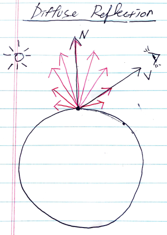

- 빛이 표면을 비출 때 표면의 점에서 빛이 난반사하는 현상을 Diffuse Reflection 이라고 한다. 빛이 여러 방향으로 퍼지는 현상이다. 위의 그림과 같이 특정 점에서 난반사하는 정도는 특정 점의 Normal vector 와 Diffuse Reflection vector 가 이루는 사이각에 따라 다르다. Normal vector 를 `N` 이라고 하고 View vector 를 `V` 라 할때 diffuse reflection 은 `dot(N,V)` 와 비례한다. 이때 `dot(N,V)` 의 범위는 `[0,1]` 이기 때문에 `max(0, dot(N,V))` 를 이용한다.
- Lambertian reflectance 의 수식을 이용하여 다음과 같이 Basic Lighting Model 의 Diffuse term 을 구한다.

```
  diffuse = lightColor * diffuseFactor * attenuation * max(0, dot(normalVal, lightDir)
```

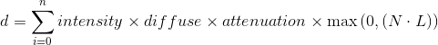

```c
float3 DiffuseLambert(float3 normalVal, float3 lightDir, float3 lightColor, float diffuseFactor, float attenuation)
{
	return lightColor * diffuseFactor * attenuation * max(0, dot(normalVal,lightDir));
}
...
			half4 frag(vertexOutput i) : COLOR
			{
				#if _USENORMAL_ON
					float3 worldNormalAtPixel = WorldNormalFromNormalMap(_NormalMap, i.normalTexCoord.xy, i.tangentWorld.xyz, i.binormalWorld.xyz, i.normalWorld.xyz);
					//return tex2D(_MainTex, i.texcoord) * _Color;
				#else
					float3 worldNormalAtPixel = i.normalWorld.xyz;
				#endif
				
				#if _LIGHTING_FRAG
					float3 lightDir  = normalize(_WorldSpaceLightPos0.xyz);
					float3 lightColor = _LightColor0.xyz;
					float attenuation = 1;
					return float4(DiffuseLambert(worldNormalAtPixel, lightDir, lightColor, _Diffuse, attenuation),1);
				#elif _LIGHTING_VERT
					return i.surfaceColor;
				#else
					return float4(worldNormalAtPixel,1);
				#endif
			}
```

전체 코드는 [Wrap up Basic Lighting Model](#wrap-up-basic-lighting-model) 코드를 참고한다.

## Specular Reflection

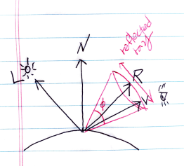

빛이 표면을 비출 때 특정 점에서 정반사하는 현상을 Specular Reflection 이라고 한다. Specular reflection vector `R` 을 중심으로 원뿔이 형성되고 원뿔의 영역에서만 반사되는 현상이다. View vector `V` 가 이 영역안에 존재하면 눈으로 Specular Reflection 을 볼 수 있다. Specular reflection 의 정도는 `R` 과 `V` 가 이루는 사이각이 0 에 가까울 수록 강해진다. Phong 에 의하면 Specular reflection 의 정도는 다음에 비례한다.

```
max(0, dot(R,V))^sharness
```

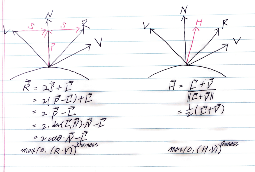

왼쪽은 Phong 이 제안한 model 이고 `R` 과 `V` 의 내적을 이용하여 Specular reflection 정도를 구한다. 오른쪽은 blinn 과 phong 에 의해 제안된 model 이고 `H` 과 `V` 의 내적을 이요하여 Specular reflection 정도를 구한다. Basic lighting model 의 specular term 은 다음과 같이 blinn-phong model 을 이용하여 구한다.

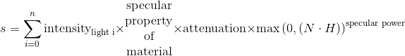

```latex
s = \sum_{i=0}^{n}\text{intensity}_\text{light i} \times 
\begin{matrix}
  \text{specular} \\
  \text{property} \\
  \text{of} \\
  \text{material} \\
 \end{matrix}
\times \text{attenuation} \times \max\left(0, ({N} \cdot {H}) \right)^\text{specular power}
```

다음은 blinn phong model 을 이용하여 basic lighting model 의 specular term 을 구현한 것이다.

```c
float3 SpecularBlinnPhong(float3 normalDir, float3 lightDir, float3 worldSpaceViewDir, float3 specularColor, float specularFactor, float attenuation, float specularPower)
{
	float3 halfwayDir = normalize(lightDir + worldSpaceViewDir);
	return specularColor * specularFactor * attenuation * pow(max(0,dot(normalDir,halfwayDir)),specularPower);
}
...
			half4 frag(vertexOutput i) : COLOR
			{
				#if _USENORMAL_ON
					float3 worldNormalAtPixel = WorldNormalFromNormalMap(_NormalMap, i.normalTexCoord.xy, i.tangentWorld.xyz, i.binormalWorld.xyz, i.normalWorld.xyz);
					//return tex2D(_MainTex, i.texcoord) * _Color;
				#else
					float3 worldNormalAtPixel = i.normalWorld.xyz;
				#endif
				
				#if _LIGHTING_FRAG
					float3 lightDir  = normalize(_WorldSpaceLightPos0.xyz);
					float3 lightColor = _LightColor0.xyz;
					float attenuation = 1;
					float3 diffuseCol =  DiffuseLambert(worldNormalAtPixel, lightDir, lightColor, _Diffuse, attenuation);
					
					float4 specularMap = tex2D(_SpecularMap, i.texcoord.xy);
					
					float3 worldSpaceViewDir = normalize(_WorldSpaceCameraPos - i.posWorld);
					float3 specularCol = SpecularBlinnPhong(worldNormalAtPixel, lightDir, worldSpaceViewDir, specularMap.rgb , _SpecularFactor, attenuation, _SpecularPower);
					return float4(diffuseCol + specularCol,1);
					
				#elif _LIGHTING_VERT
					return i.surfaceColor;
				#else
					return float4(worldNormalAtPixel,1);
				#endif
			}
```

전체 코드는 [Wrap up Basic Lighting Model](#wrap-up-basic-lighting-model) 코드를 참고한다.

## Ambient Reflection

물체의 reflection 처리를 할 때 indirect lighting 도 처리를 해주어야 하는데 이것은 상당히 번거롭다. 그래서 scene 의 indirect lighting 들을 한가지 값으로 간략화 하는데 이것을 ambient reflection 이라고 한다. 주로 게임엔진에서 ambient reflection 값을 이용한다. Unity 의 경우 `UNITY_LIGHTMODEL_AMBIENT` 을 이용하여 ambient reflection 의 정도를 얻어 올 수 있다.

Basic Lighting Model 의 ambient term 은 다음과 같은 식을 이용하여 구현 할 수 있다. 

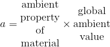


```latex
a = \begin{matrix}
  \text{ambient} \\
  \text{property} \\
  \text{of} \\
  \text{material} \\
\end{matrix} 
\times
\begin{matrix} 
  \text{global} \\
  \text{ambient} \\
  \text{value} \\
\end{matrix}
```

다음은 Basic Lighting Model 의 ambient term 을 unity shader lab 을 이용하여 구현한 것이다.

```c
	Properties 
	{
        ...
		[Toggle] _AmbientMode("Ambient Light?", Float) = 0
		_AmbientFactor("Ambient %", Range(0,1)) = 1
        ...
	}
			half4 frag(vertexOutput i) : COLOR
			{
                ...    
	#if _AMBIENTMODE_ON
				float3 ambientColor = _AmbientFactor * UNITY_LIGHTMODEL_AMBIENT;
				finalColor.rgb += ambientColor;
	#endif    
                ...
            }

```

전체 코드는 [Wrap up Basic Lighting Model](#wrap-up-basic-lighting-model) 코드를 참고한다.

## Wrap up Basic Lighting Model 

Basic Lighting Model 은 BEADS 로 기억하자.

```
Basic lighting model

surface color = Emission + Ambient + Diffuse + Specular
```

다음은 Basic Lighting Model 을 Texture 와 Tint Color 를 적용하여 구현한 것이다.

```c
Shader "Custom/Lighting_basicLighting"
{
	Properties
	{
		_Color("Main Color", Color) = (1,1,1,1)
		_MainTex("Main Texture", 2D) = "white" {}
		_NormalMap("Normal map", 2D) = "white" {}
		[KeywordEnum(Off,On)] _UseNormal("Use Normal Map?", Float) = 0
		_Diffuse("Diffuse %", Range(0,1)) = 1
		[KeywordEnum(Off, Vert, Frag)] _Lighting("Lighting Mode", Float) = 0
		_SpecularMap("Specular Map", 2D) = "black" {}
		_SpecularFactor("Specular %",Range(0,1)) = 1
		_SpecularPower("Specular Power", Float) = 100
		[Toggle] _AmbientMode("Ambient Light?", Float) = 0
		_AmbientFactor("Ambient %", Range(0,1)) = 1
	}

	Subshader
	{
		//http://docs.unity3d.com/462/Documentation/Manual/SL-SubshaderTags.html
		// Background : 1000     -        0 - 1499 = Background
		// Geometry   : 2000     -     1500 - 2399 = Geometry
		// AlphaTest  : 2450     -     2400 - 2699 = AlphaTest
		// Transparent: 3000     -     2700 - 3599 = Transparent
		// Overlay    : 4000     -     3600 - 5000 = Overlay

		Tags {"Queue" = "Transparent" "IgnoreProjector" = "True" "RenderType" = "Transparent" }
		Pass
		{
			Tags {"LightMode" = "ForwardBase"}
			Blend SrcAlpha OneMinusSrcAlpha

CGPROGRAM
			//http://docs.unity3d.com/Manual/SL-ShaderPrograms.html
			#pragma vertex vert
			#pragma fragment frag
			#pragma shader_feature _USENORMAL_OFF _USENORMAL_ON
			#pragma shader_feature _LIGHTING_OFF _LIGHTING_VERT _LIGHTING_FRAG
			#pragma shader_feature _AMBIENTMODE_OFF _AMBIENTMODE_ON


float3 normalFromColor(float4 colorVal)
{
#if defined(UNITY_NO_DXT5nm)
	return colorVal.xyz * 2 - 1;
#else
		// R => x => A
		// G => y
		// B => z => ignored

		float3 normalVal;
		normalVal = float3 (colorVal.a * 2.0 - 1.0,
							colorVal.g * 2.0 - 1.0,
							0.0);
		normalVal.z = sqrt(1.0 - dot(normalVal, normalVal));
		return normalVal;
	#endif
}

float3 WorldNormalFromNormalMap(sampler2D normalMap, float2 normalTexCoord, float3 tangentWorld, float3 binormalWorld, float3 normalWorld)
{
	// Color at Pixel which we read from Tangent space normal map
	float4 colorAtPixel = tex2D(normalMap, normalTexCoord);

	// Normal value converted from Color value
	float3 normalAtPixel = normalFromColor(colorAtPixel);

	// Compose TBN matrix
	float3x3 TBNWorld = float3x3(tangentWorld, binormalWorld, normalWorld);
	return normalize(mul(normalAtPixel, TBNWorld));
}

float3 DiffuseLambert(float3 normalVal, float3 lightDir, float3 lightColor, float diffuseFactor, float attenuation)
{
return lightColor * diffuseFactor * attenuation * max(0, dot(normalVal,lightDir));
}

float3 SpecularBlinnPhong(float3 normalDir, float3 lightDir, float3 worldSpaceViewDir, float3 specularColor, float specularFactor, float attenuation, float specularPower)
{
float3 halfwayDir = normalize(lightDir + worldSpaceViewDir);
return specularColor * specularFactor * attenuation * pow(max(0,dot(normalDir,halfwayDir)),specularPower);
}

float3 IBLRefl(samplerCUBE cubeMap, half detail, float3 worldRefl, float exposure, float reflectionFactor)
{
float4 cubeMapCol = texCUBElod(cubeMap, float4(worldRefl, detail)).rgba;
return reflectionFactor * cubeMapCol.rgb * (cubeMapCol.a * exposure);
}

inline float4 ProjectionToTextureSpace(float4 pos)
{
float4 textureSpacePos = pos;
#if defined(UNITY_HALF_TEXEL_OFFSET)
textureSpacePos.xy = float2 (textureSpacePos.x, textureSpacePos.y * _ProjectionParams.x) + textureSpacePos.w * _ScreenParams.zw;
#else
textureSpacePos.xy = float2 (textureSpacePos.x, textureSpacePos.y * _ProjectionParams.x) + textureSpacePos.w;
#endif
textureSpacePos.xy = float2 (textureSpacePos.x / textureSpacePos.w, textureSpacePos.y / textureSpacePos.w) * 0.5f;
return textureSpacePos;
}

			//http://docs.unity3d.com/ru/current/Manual/SL-ShaderPerformance.html
			//http://docs.unity3d.com/Manual/SL-ShaderPerformance.html
			uniform half4 _Color;
			uniform sampler2D _MainTex;
			uniform float4 _MainTex_ST;

			uniform sampler2D _NormalMap;
			uniform float4 _NormalMap_ST;

			uniform float _Diffuse;
			uniform float4 _LightColor0;

			uniform sampler2D _SpecularMap;
			uniform float _SpecularFactor;
			uniform float _SpecularPower;

#if _AMBIENTMODE_ON
			uniform float _AmbientFactor;
#endif

			//https://msdn.microsoft.com/en-us/library/windows/desktop/bb509647%28v=vs.85%29.aspx#VS
			struct vertexInput
			{
				float4 vertex : POSITION;
				float4 normal : NORMAL;
				float4 texcoord : TEXCOORD0;
#if _USENORMAL_ON
				float4 tangent : TANGENT;
#endif
			};

			struct vertexOutput
			{
				float4 pos : SV_POSITION;
				float4 texcoord : TEXCOORD0;
				float4 normalWorld : TEXCOORD1;
				float4 posWorld : TEXCOORD2;
#if _USENORMAL_ON
				float4 tangentWorld : TEXCOORD3;
				float3 binormalWorld : TEXCOORD4;
				float4 normalTexCoord : TEXCOORD5;
#endif
#if _LIGHTING_VERT
				float4 surfaceColor : COLOR0;
#endif
			};

			vertexOutput vert(vertexInput v)
			{
				vertexOutput o; UNITY_INITIALIZE_OUTPUT(vertexOutput, o); // d3d11 requires initialization
				o.pos = UnityObjectToClipPos(v.vertex);
				o.texcoord.xy = (v.texcoord.xy * _MainTex_ST.xy + _MainTex_ST.zw);
				o.normalWorld = float4(normalize(mul(normalize(v.normal.xyz),(float3x3)unity_WorldToObject)),v.normal.w);
				o.posWorld = mul(unity_ObjectToWorld, v.vertex); // added in chapter of IBL-Reflection
#if _USENORMAL_ON
				// World space T, B, N values
				o.normalTexCoord.xy = (v.texcoord.xy * _NormalMap_ST.xy + _NormalMap_ST.zw);
				//o.tangentWorld = normalize(mul(v.tangent,_Object2World));
				o.tangentWorld = (normalize(mul((float3x3)unity_ObjectToWorld, v.tangent.xyz)),v.tangent.w);
				o.binormalWorld = normalize(cross(o.normalWorld, o.tangentWorld) * v.tangent.w);
#endif
#if _LIGHTING_VERT
				float3 lightDir = normalize(_WorldSpaceLightPos0.xyz);
				float3 lightColor = _LightColor0.xyz;
				float attenuation = 1;
				float3 diffuseCol = DiffuseLambert(o.normalWorld, lightDir, lightColor, _Diffuse, attenuation);

				float4 specularMap = tex2Dlod(_SpecularMap, float4(o.texcoord.xy, 0, 0));//float4 specularMap = tex2D(_SpecularMap, o.texcoord.xy);//float4 specularMap = tex2D(_SpecularMap, o.texcoord.xy);
				//o.posWorld = mul(_Object2World, v.vertex);// commented out in chapter of IBL-Reflection
				float3 worldSpaceViewDir = normalize(_WorldSpaceCameraPos - o.posWorld);
				float3 specularCol = SpecularBlinnPhong(o.normalWorld, lightDir, worldSpaceViewDir, specularMap.rgb , _SpecularFactor, attenuation, _SpecularPower);

				float3 mainTexCol = tex2Dlod(_MainTex, float4(o.texcoord.xy, 0,0));

				o.surfaceColor = float4(mainTexCol * _Color * diffuseCol + specularCol,1);
	#if _AMBIENTMODE_ON
				float3 ambientColor = _AmbientFactor * UNITY_LIGHTMODEL_AMBIENT;
				o.surfaceColor = float4(o.surfaceColor.rgb + ambientColor,1);
	#endif
#endif
				return o;
			}

			half4 frag(vertexOutput i) : COLOR
			{
#if _USENORMAL_ON
				float3 worldNormalAtPixel = WorldNormalFromNormalMap(_NormalMap, i.normalTexCoord.xy, i.tangentWorld.xyz, i.binormalWorld.xyz, i.normalWorld.xyz);
				//return tex2D(_MainTex, i.texcoord) * _Color;
#else
				float3 worldNormalAtPixel = i.normalWorld.xyz;
#endif

#if _LIGHTING_FRAG
				float3 lightDir = normalize(_WorldSpaceLightPos0.xyz);
				float3 lightColor = _LightColor0.xyz;
				float attenuation = 1;
				float3 diffuseCol = DiffuseLambert(worldNormalAtPixel, lightDir, lightColor, _Diffuse, attenuation);

				float4 specularMap = tex2D(_SpecularMap, i.texcoord.xy);

				float3 worldSpaceViewDir = normalize(_WorldSpaceCameraPos - i.posWorld);
				float3 specularCol = SpecularBlinnPhong(worldNormalAtPixel, lightDir, worldSpaceViewDir, specularMap.rgb , _SpecularFactor, attenuation, _SpecularPower);

				float3 mainTexCol = tex2D(_MainTex, i.texcoord.xy);
	#if _AMBIENTMODE_ON
				float3 ambientColor = _AmbientFactor * UNITY_LIGHTMODEL_AMBIENT;
				return float4(mainTexCol * _Color * diffuseCol + specularCol + ambientColor,1);
	#else
				return float4(mainTexCol * _Color * diffuseCol + specularCol,1);
	#endif

#elif _LIGHTING_VERT
				return i.surfaceColor;
#else
				return float4(worldNormalAtPixel,1);
#endif
			}
			ENDCG
		}
	}
}
```

## Advanced Lighting Model

Basic Lighting Model 은 Photo realism 을 표현하기에 부족하다. 예를 들어서 Shadow 를 표현할 수 없다. 그리고 Inter object interaction 을 표현할 수 없다. 즉 간접광을 처리하지 앟는다. Energy Balance 를 표현할 수 없다. 즉 에너지 보존법칙을 고려하지 않는다.

Advanced Lighting Model 은 Basic Lighting Model 보다 발전된 것이며 Photo Realism 을 표현할 수 있다. [Physically Based Rendering](/pbr/README.md) 은 Advanced Lighting Model 의 대표적인 예이다. Advanced Lighting Model 을 구현하기 위해서는 `reflection, refraction, fresnel` 등을 잘 익혀야 한다.

## Hemispherical Lighting Model

Hemispherical Lighting Model 은 두개의 반구를 이용하여 구현한 Lighting Model 이다. 렌더링한 물체를 중심으로 위부분은 sky light 를 의미하고 아래 부분은 ground light 를 의미한다. 만약 물체의 한점의 normal vector 를 `N` 이라고 하고 light 의 vector 를 `L` 이라고 했을 때 `dot(N, L)` 이 0 보다 크거나 같으면 sky light 를 적용하고  0 보다 작으면 ground light 를 적용한다. 

## IBL (image based lighting)

scene 을 rendering 할 때 lighting 을 실시간으로 계산하지 않는다. lighting 을 미리 계산하여 image 에 저장하고 scene 을 rendering 할 때 그 image 를 lighting 연산에 사용하는 것을 IBL 이라고 한다.

## Irradiance Map

radiance 는 단위 면적당 발산하는 빛의 에너지이다. irradiance 는 단위 면적당 들어오는 빛의 에너지이다. 둘다 단위는 `watt / m^2` 을 사용한다. 

scene 에 sphere 가 하나 있고 directional light 가 9개 있다고 해보자. sphere 의 특정 점 하나를 렌더링 해보자. 그 점의 normal vector 와 각각의 light vector 의 dot product 를 구해서 모두 9번 더해야 한다. dot product 연산을 하고 9번 더한 것을 미리 계산하여 image 에 저장해두고 렌더링 할 때 사용하면 렌더링의 성능을 향살 할 수 있다. 미리 계산된 irradiance 값이 저장된 image 를 irradiance map 이라고 한다. irradiance map 은 cubemap 으로 제작된다. 물론 lighting environment map 으로 저장해도 된다. 그러나 sphere 가 움직이면 변경된 위치의 irradiance 값을 얻어올 수 없기 때문에 보통 lighting environment map 과 irradiance map 을 함께 사용한다.

이번에는 잘 만들어둔 irradiance map 을 사용하여 irradiance 값을 얻어오자. sphere 의 특정 점의 normal vector 를 irradiance map 이 구성하는 정육면체의 중앙으로 가져온 다음 그 normal vector 와 mapping 되는 irradiance map 의 texel 이 곧 irradiance 값이다. cg function 을 이용하면 다음과 같이 구할 수 있다.

```c
color of texel = texCube(irradianceMap, normal vector)
```

point light 는 물체와의 거리에 따라 attenuation 이 달라지는데 irradiance map 은 거리에 따른 attenuation 을 저장할 수 없다. 따라서 irradiance map 은 directional light 의 irradiance 값만 저장한다.

이번에는 irradiance map 을 만들어 보자. lighting environment map 은 이미 제작했다고 하자. irradiance map 과 lighting environment map 으로 정육면체를 구성할 수 있다. 그 정육면체의 한면을 4 구역으로 나눈다. 그러면 모두 24 개의 면이 만들어지고 각각을 `L_i` 라고 부르자. irradiance map 으로 구성할 수 있는 정육면체 공간의 중앙을 점 C 라고 하자. 

irradiance map 의 각 texel 을 순회한다. 점 C 에서 irradiance map 의 texel 로 향하는 vector 을 `N` 이라고 하자. 그럼 다음과 같이 lighting environment map 의 `L_i` 와 dot product 하여 모두 합한 값을 irradiance map 의 texel 에 저장한다.

```c
for (all texel of Irradiance map) {
    N = calDirFromCenterOfIrradianceSquare()
    diffuseCol = 0
    for (all texel of Lighting env map) {
        L = calDirFromCenterOfLightingSquare()
        diffuseCol += dot(N, L)
    }
    texel = diffuseCol
}
```

## Image based Relection

reflection factor 를 Irradiance map 에서 얻어와 color 에 연산하자.

```c
...
float3 IBLRefl(samplerCUBE cubeMap, half detail, float3 worldRefl, float exposure, float reflectionFactor)
{
	float4 cubeMapCol = texCUBElod(cubeMap, float4(worldRefl, detail)).rgba;
	return reflectionFactor * cubeMapCol.rgb * (cubeMapCol.a * exposure);
}
...
finalColor.rgb += IBLRefl(_Cube, _Detail, worldRefl,  _ReflectionExposure, _ReflectionFactor);
...
```

전체 코드는 [BRDF](#brdf-bidirectional-reflectance-distribution-function) 코드를 참고한다.

## Image based Refraction

빛은 서로다른 매질을 통과할 때 방향이 달라진다. 이것을 굴절(Refraction)현상이라고 한다. 방향이 달라지는 정도는 각 매질의 IOR(Index of Rfraction) 에 따라 다르다.

IOR 은 진공매질에서 빛의 휘어짐과 특정매질의 빛의 휘어짐의 비율이다.

```
IOR = velocity of light in vaccum / velocity of light in medium
    = 1 / vecltocity of light in medium
```

Refraction vector 를 구하기 위해서는 Snell 의 법칙을 이해해야 한다.

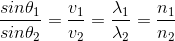

Refraction vector 를 다음과 같이 유도한다.

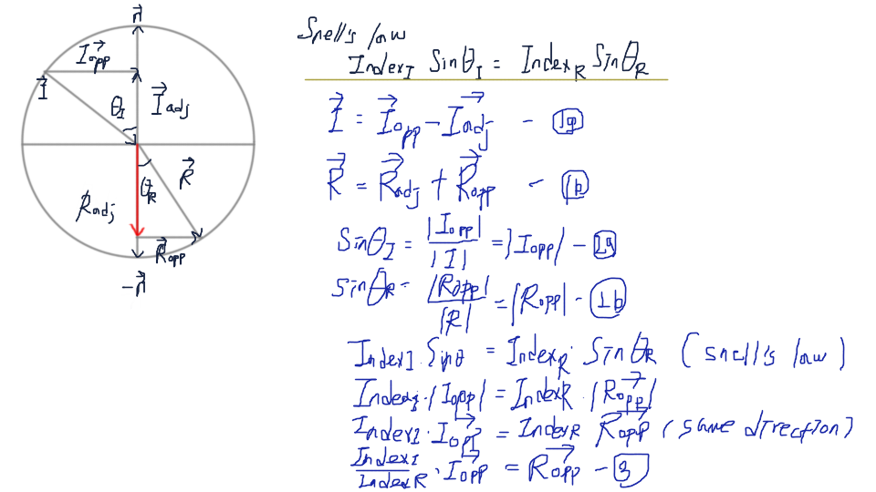

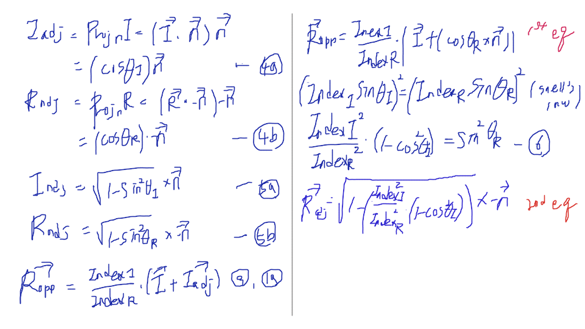

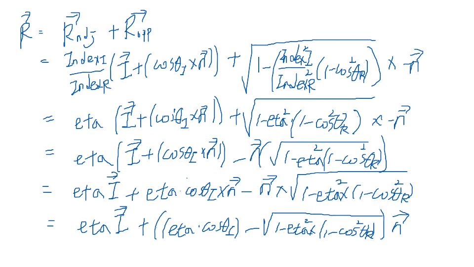

Refraction vector 는 cg function 중 `reflect` 를 이용하여 구한다. reflect 는 앞서 유도한 식과 똑같다.

```c
float3 refract( float3 i, float3 n, float eta )
{
  float cosi = dot(-i, n);
  float cost2 = 1.0f - eta * eta * (1.0f - cosi*cosi);
  float3 t = eta*i + ((eta*cosi - sqrt(abs(cost2))) * n);
  return t * (float3)(cost2 > 0);
}
```

다음은 Reflection Vector 혹은 Reflection vector 와 매핑되는 Irradiance Map 의 값을 얻어오는 것을 구현한 것이다. Reflection Vector 를 선택하면 재질에 반사현상이 일어나고 Refraction vector 를 선택하면 재질에 굴절현상이 일어난다.

```c
	Properties
	{
        ...
		_RefractionFactor("Refraction %",Range(0,1)) = 1
		_RefractiveIndex("Refractive Index", Range(0,50)) = 1
        ...
    }
			half4 frag(vertexOutput i) : COLOR
			{
                ...
float3 IBLRefl (samplerCUBE cubeMap, half detail, float3 worldRefl, float exposure, float reflectionFactor)
{
	float4 cubeMapCol = texCUBElod(cubeMap, float4(worldRefl, detail)).rgba;
	return reflectionFactor * cubeMapCol.rgb * (cubeMapCol.a * exposure);
}                
                ...
	#if _IBLMODE_REFL
				float3 worldSpaceViewDir = normalize(_WorldSpaceCameraPos - i.posWorld);
				float3 worldRefl = reflect(-worldSpaceViewDir, worldNormalAtPixel);
				finalColor.rgb += IBLRefl(_Cube, _Detail, worldRefl,  _ReflectionExposure, _ReflectionFactor);
	#endif	

	#if _IBLMODE_REFR
				float3 worldSpaceViewDir = normalize(_WorldSpaceCameraPos - i.posWorld);
				float3 worldRefr = refract(-worldSpaceViewDir, worldNormalAtPixel, 1 / _RefractiveIndex);
				finalColor.rgb += IBLRefl(_Cube, _Detail, worldRefr,  _ReflectionExposure, _RefractionFactor);
	#endif                
                ...
            }
```

전체 코드는 [BRDF](#brdf-bidirectional-reflectance-distribution-function) 코드를 참고한다.

## Image based Fresnel

Fresnel 은 물체를 보는 각도에 따라 반사되는 정도가 다른 현상이다.

다음은 Irradiance Map 을 이용하여 fresnel 을 구현한 것이다. reflColor 가 반영되지 않는 Color 와 반영된 Color 사이를 `fresnel` 값으로 조정하여 새로운 Color 를 계산한다. 참고로 `fresnel` 의 범위는 `[0, 1]` 이다.

```
	Properties
	{
        ...
		_FresnelWidth("FresnelWidth", Range(0,1)) = 0.3
        ...
    }
			half4 frag(vertexOutput i) : COLOR
			{
                ...
	#if _IBLMODE_FRES
				float3 worldSpaceViewDir = normalize(_WorldSpaceCameraPos - i.posWorld);
				float3 worldRefl = reflect(-worldSpaceViewDir, worldNormalAtPixel);
				float3 reflColor = IBLRefl(_Cube, _Detail, worldRefl,  _ReflectionExposure, _ReflectionFactor);

				float fresnel = 1 - saturate(dot(worldSpaceViewDir,worldNormalAtPixel));
				fresnel = smoothstep(1 - _FresnelWidth, 1, fresnel);
				float3 mainTexCol = tex2D(_MainTex, i.texcoord.xy);

				finalColor.rgb = lerp(mainTexCol * _Color.rgb, finalColor.rgb + reflColor, fresnel);
	#endif
                ...
            }
```

전체 코드는 [BRDF](#brdf-bidirectional-reflectance-distribution-function) 코드를 참고한다.

## Shadow mapping

빛이 표면을 비추고 있을 때 그림자는 만들어진다. 빛이 바라보는 scene 을 렌더링해보자. 이때 빛이 directional light 이면 orthographic frustumn 이 만들어지고 point light 이면 perspective frustumn 이 만들어진다. 렌더링된 scene 은 depth map 에 저장된다. 이것을 shadow map 이라고 하자. 

이제 camera 가 바라보는 scene 을 렌더링해보자. 픽셀하나를 렌더링할 때 그 shadow map 과 비교해서 그림자 영역에 해당하는지 조사하고 그림자 영역에 해당된다면 어둡게 하자. 이때 앞서 언급한 픽셀의 world position 을 shadow map 의 texture position 으로 변환 하는 것이 중요하다. 

light 의 입장에서 projection space 의 x, y 를 w 로 나누면 clip space 의 coordinates 가 된다. NDC 의 성질에 따라 x/w, y/w 의 범위는 `[-1, 1]` 이다. 그러나 shadow map 의 x, y 의 범위는 `[0, 1]` 이다. clip space coordinates 의 x, y 를 texture space coordinates 의 u, v 로 매핑하기 위해서는 다음 공식을 이용해야 한다.

```
u = (x/w + 1) * 0.5
v = (x/y + 1) * 0.5
```

shadow map 은 각각의 라이트별로 각각의 쉐이더마다 한장씩 필요하다.

다음은 camera 가 scene 을 렌더링할 때 특정 fragment 의 world space position 을 shadow map 의 texture space position 으로 변환 하는 함수를 구현한 것이다. direct 와 opengl 은 texture 의 uv 좌표의 원점위치가 다르다. 따라서 `UNITY_HALF_TEXEL_OFFSET` 를 이용해서 플래폼별로 구현을 다르게 해야 한다.

```c
inline float4 ProjectionToTextureSpace(float4 pos)
{
	float4 textureSpacePos = pos;
#if defined(UNITY_HALF_TEXEL_OFFSET)
	textureSpacePos.xy = float2 (textureSpacePos.x, textureSpacePos.y * _ProjectionParams.x) + textureSpacePos.w * _ScreenParams.zw;
#else
	textureSpacePos.xy = float2 (textureSpacePos.x, textureSpacePos.y * _ProjectionParams.x) + textureSpacePos.w;
#endif
	textureSpacePos.xy = float2 (textureSpacePos.x/textureSpacePos.w, textureSpacePos.y/textureSpacePos.w) * 0.5f;
	return textureSpacePos;
}
```

전체 코드는 [BRDF](#brdf-bidirectional-reflectance-distribution-function) 코드를 참고한다.

## BRDF (bidirectional reflectance distribution function)

BRDF 는 빛이 불투명한 표면에서 어떤 방식으로 반사되는지를 정의하는 4차원 함수이다. BRDF 는 추상적으로 다음과 같이 정의할 수 있다.

```
BRDF = 반사되는 빛의 양 / 들어오는 빛의 양
     = radiance / irradiance

radiance = 단위면적당 에너지
         = watt / area(m^2)
```

BRDF 는 [PBR(Physically based rendering)](/pbr/README.md) 에서 반사를 담당한다.

표면에 들어오는 빛은 일부는 흡수 및 굴절되고 일부는 반사된다. 반사는 다시 난반사(diffuse reflection), 정반사(specular reflection) 로 나눌 수 있다. 

[An Anisotropic Phong BRDF Model, Michael Ashikhmin Peter Shirley](https://www.cs.utah.edu/~shirley/papers/jgtbrdf.pdf) 에 의하면 다음과 같은 공식으로 specular refelction term 를 얻어낼 수 있다.

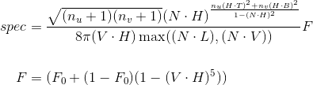

```latex
\begin{align*}
spec &= \frac { \sqrt{(n_{u}+1)(n_{v}+1)}
               (N \cdot H)^{\frac{n_{u}(H \cdot T)^{2}+n_{v}(H \cdot B)^{2}}{1-(N \cdot H)^{2}}}
             }
             { 8 \pi (V \cdot H) \max((N \cdot L), (N \cdot V))} F 
\\\\
F &= (F_{0} + (1 - F_{0})(1-(V \cdot H)^{5}))
\end{align*}
```

다음은 위의 수식을 이용하여 unityshaderlab 으로 구현한 것이다. `float AshikhminShirleyPremoze_BRDF` 은 `specular reflection term` 을 반환한다.

```c
			float AshikhminShirleyPremoze_BRDF(float nU, float nV, float3 tangentDir, float3 normalDir, float3 lightDir, float3 viewDir, float reflectionFactor)
			{
				float pi = 3.141592;
				float3 halfwayVector = normalize(lightDir + viewDir);
				float3 NdotH = dot(normalDir, halfwayVector);
				float3 NdotL = dot(normalDir, lightDir);
				float3 NdotV = dot(normalDir, viewDir);
				float3 HdotT = dot(halfwayVector, tangentDir);
				float3 HdotB = dot(halfwayVector, cross(tangentDir, normalDir));
				float3 VdotH = dot(viewDir, halfwayVector);

				float power = nU * pow(HdotT,2) + nV * pow(HdotB,2);
				power /= 1.0 - pow(NdotH,2);

				float spec = sqrt((nU + 1) * (nV + 1)) * pow(NdotH, power);
				spec /= 8.0 * pi * VdotH * max(NdotL, NdotV);

				float Fresnel = reflectionFactor + (1.0 - reflectionFactor) * pow(1.0 - VdotH, 5.0);
				spec *= Fresnel;
				return spec;
			}
```

다음은 전체 코드이다.

```c
Shader "Custom/Lighting_BRDF_Anisotrophy" 
{
	Properties
	{
		_Color("Main Color", Color) = (1,1,1,1)
		_MainTex("Main Texture", 2D) = "white" {}
		_NormalMap("Normal map", 2D) = "white" {}
		[KeywordEnum(Off,On)] _UseNormal("Use Normal Map?", Float) = 0
		_Diffuse("Diffuse %", Range(0,1)) = 1
		[KeywordEnum(Off, Vert, Frag)] _Lighting("Lighting Mode", Float) = 0
		_SpecularMap("Specular Map", 2D) = "black" {}
		_SpecularFactor("Specular %",Range(0,1)) = 1
		_SpecularPower("Specular Power", Float) = 100

		[KeywordEnum(Off, Map, Nomap, Aniso)] _Specular("Specular Mode", Float) = 1
		_TangentMap("Tangent Map", 2D) = "black" {}
		_AnisoU("Aniso U", Float) = 1
		_AnisoV("Aniso V", Float) = 1

		[Toggle] _AmbientMode("Ambient Light?", Float) = 0
		_AmbientFactor("Ambient %", Range(0,1)) = 1

		[KeywordEnum(Off, Refl, Refr, Fres)] _IBLMode("IBL Mode", Float) = 0
		_ReflectionFactor("Reflection %",Range(0,1)) = 1

		_Cube("Cube Map", Cube) = "" {}
		_Detail("Reflection Detail", Range(1,9)) = 1.0
		_ReflectionExposure("HDR Exposure", float) = 1.0

		_RefractionFactor("Refraction %",Range(0,1)) = 1
		_RefractiveIndex("Refractive Index", Range(0,50)) = 1

		_FresnelWidth("FresnelWidth", Range(0,1)) = 0.3

		[Toggle] _ShadowMode("Shadow On/Off?", Float) = 0
	}

	Subshader
	{
		//http://docs.unity3d.com/462/Documentation/Manual/SL-SubshaderTags.html
		// Background : 1000     -        0 - 1499 = Background
		// Geometry   : 2000     -     1500 - 2399 = Geometry
		// AlphaTest  : 2450     -     2400 - 2699 = AlphaTest
		// Transparent: 3000     -     2700 - 3599 = Transparent
		// Overlay    : 4000     -     3600 - 5000 = Overlay

		Tags {"Queue" = "Transparent" "IgnoreProjector" = "True" "RenderType" = "Transparent" }
		// Pass for Shadow Map
		Pass
		{
			Name "ShadowCaster"
			Tags { "Queue" = "Opaque" "LightMode" = "ShadowCaster" }
			ZWrite On
			Cull Off

			CGPROGRAM
			#pragma vertex vert
			#pragma fragment frag

			struct vertexInput
			{
				float4 vertex : POSITION;
			};
			struct vertexOutput
			{
				float4 pos : SV_POSITION;
			};

			vertexOutput vert(vertexInput v)
			{
				vertexOutput o;
				o.pos = UnityObjectToClipPos(v.vertex);
				return o;
			}

			float4 frag(vertexOutput i) : SV_Target
			{
				return 0;
			}
			ENDCG
		}

		Pass
		{
			Tags {"LightMode" = "ForwardBase"}
			Blend SrcAlpha OneMinusSrcAlpha

CGPROGRAM
			//http://docs.unity3d.com/Manual/SL-ShaderPrograms.html
			#pragma vertex vert
			#pragma fragment frag
			#pragma shader_feature _USENORMAL_OFF _USENORMAL_ON
			#pragma shader_feature _LIGHTING_OFF _LIGHTING_VERT _LIGHTING_FRAG
			#pragma shader_feature _SPECULAR_OFF _SPECULAR_MAP _SPECULAR_NOMAP _SPECULAR_ANISO
			#pragma shader_feature _AMBIENTMODE_OFF _AMBIENTMODE_ON
			#pragma shader_feature _IBLMODE_OFF _IBLMODE_REFL _IBLMODE_REFR _IBLMODE_FRES
			#pragma shader_feature _SHADOWMODE_OFF _SHADOWMODE_ON
			#include "CVGLighting.cginc" 
			//http://docs.unity3d.com/ru/current/Manual/SL-ShaderPerformance.html
			//http://docs.unity3d.com/Manual/SL-ShaderPerformance.html
			uniform half4 _Color;
			uniform sampler2D _MainTex;
			uniform float4 _MainTex_ST;

			uniform sampler2D _NormalMap;
			uniform float4 _NormalMap_ST;

			uniform float _Diffuse;
			uniform float4 _LightColor0;

#if _SPECULAR_MAP
			uniform sampler2D _SpecularMap;
#endif

#if _SPECULAR_MAP || _SPECULAR_NOMAP
			uniform float _SpecularFactor;
			uniform float _SpecularPower;
#endif

#if _SPECULAR_ANISO
			uniform sampler2D _TangentMap;
			uniform float _AnisoU;
			uniform float _AnisoV;
#endif

#if _IBLMODE_REFL || _IBLMODE_REFR || _IBLMODE_FRES
			uniform samplerCUBE _Cube;
			uniform half _Detail;
			uniform float _ReflectionExposure;
#endif

#if _IBLMODE_REFL || _IBLMODE_FRES || _SPECULAR_ANISO
			uniform float _ReflectionFactor;
#endif

#if _IBLMODE_REFR
			uniform float _RefractionFactor;
			uniform float _RefractiveIndex;
#endif

#if _IBLMODE_FRES
			uniform float _FresnelWidth;
#endif

#if _AMBIENTMODE_ON
			uniform float _AmbientFactor;
#endif

#if _SHADOWMODE_ON
	#if defined(SHADER_TARGET_GLSL)
			sampler2DShadow _ShadowMapTexture;
	#else
			sampler2D _ShadowMapTexture;
	#endif

#endif
					//https://msdn.microsoft.com/en-us/library/windows/desktop/bb509647%28v=vs.85%29.aspx#VS
			struct vertexInput
			{
				float4 vertex : POSITION;
				float4 normal : NORMAL;
				float4 texcoord : TEXCOORD0;
#if _USENORMAL_ON
				float4 tangent : TANGENT;
#endif
			};

			struct vertexOutput
			{
				float4 pos : SV_POSITION;
				float4 texcoord : TEXCOORD0;
				float4 normalWorld : TEXCOORD1;
				float4 posWorld : TEXCOORD2;
#if _USENORMAL_ON
				float4 tangentWorld : TEXCOORD3;
				float3 binormalWorld : TEXCOORD4;
				float4 normalTexCoord : TEXCOORD5;
#endif

#if _LIGHTING_VERT ||  _IBLMODE_REFL || _IBLMODE_REFR || _IBLMODE_FRES
				float4 surfaceColor : COLOR0;
#endif

#if _SHADOWMODE_ON
				float4 shadowCoord : COLOR1;
#endif
			};

			float AshikhminShirleyPremoze_BRDF(float nU, float nV, float3 tangentDir, float3 normalDir, float3 lightDir, float3 viewDir, float reflectionFactor)
			{
				float pi = 3.141592;
				float3 halfwayVector = normalize(lightDir + viewDir);
				float3 NdotH = dot(normalDir, halfwayVector);
				float3 NdotL = dot(normalDir, lightDir);
				float3 NdotV = dot(normalDir, viewDir);
				float3 HdotT = dot(halfwayVector, tangentDir);
				float3 HdotB = dot(halfwayVector, cross(tangentDir, normalDir));
				float3 VdotH = dot(viewDir, halfwayVector);

				float power = nU * pow(HdotT,2) + nV * pow(HdotB,2);
				power /= 1.0 - pow(NdotH,2);

				float spec = sqrt((nU + 1) * (nV + 1)) * pow(NdotH, power);
				spec /= 8.0 * pi * VdotH * max(NdotL, NdotV);

				float Fresnel = reflectionFactor + (1.0 - reflectionFactor) * pow(1.0 - VdotH, 5.0);
				spec *= Fresnel;
				return spec;
			}

			vertexOutput vert(vertexInput v)
			{
				vertexOutput o; UNITY_INITIALIZE_OUTPUT(vertexOutput, o); // d3d11 requires initialization
				o.pos = UnityObjectToClipPos(v.vertex);
				o.texcoord.xy = (v.texcoord.xy * _MainTex_ST.xy + _MainTex_ST.zw);
				o.normalWorld = float4(normalize(mul(normalize(v.normal.xyz),(float3x3)unity_WorldToObject)),v.normal.w);

				o.posWorld = mul(unity_ObjectToWorld, v.vertex);
#if _SHADOWMODE_ON
	#if defined(UNITY_NO_SCREENSPACE_SHADOWS)
				o.shadowCoord = mul(unity_WorldToShadow[0], o.posWorld);
	#else
				o.shadowCoord = ProjectionToTextureSpace(o.pos);
	#endif

#endif

#if _USENORMAL_ON
				// World space T, B, N values
				o.normalTexCoord.xy = (v.texcoord.xy * _NormalMap_ST.xy + _NormalMap_ST.zw);
				o.tangentWorld = (normalize(mul((float3x3)unity_ObjectToWorld, v.tangent.xyz)),v.tangent.w);
				o.binormalWorld = normalize(cross(o.normalWorld, o.tangentWorld) * v.tangent.w);
#endif
#if _LIGHTING_VERT
				float3 lightDir = normalize(_WorldSpaceLightPos0.xyz);
				float3 lightColor = _LightColor0.xyz;
				float attenuation = 1;
				float3 diffuseCol = DiffuseLambert(o.normalWorld, lightDir, lightColor, _Diffuse, attenuation);

				float3 worldSpaceViewDir = normalize(_WorldSpaceCameraPos - o.posWorld);
	#if _SPECULAR_MAP
				float4 specularMap = tex2Dlod(_SpecularMap, float4(o.texcoord.xy, 0, 0));//float4 specularMap = tex2D(_SpecularMap, o.texcoord.xy);//float4 specularMap = tex2D(_SpecularMap, o.texcoord.xy);
				float3 specularCol = SpecularBlinnPhong(o.normalWorld, lightDir, worldSpaceViewDir, specularMap.rgb , _SpecularFactor, attenuation, _SpecularPower);
	#endif

	#if _SPECULAR_NOMAP
				float3 specularCol = SpecularBlinnPhong(o.normalWorld, lightDir, worldSpaceViewDir, 1 , _SpecularFactor, attenuation, _SpecularPower);
	#endif

	#if _SPECULAR_ANISO
				float4 tangentMap = tex2D(_TangentMap, o.texcoord.xy);
				float3 specularCol = AshikhminShirleyPremoze_BRDF(_AnisoU, _AnisoV, tangentMap.xyz, o.normalWorld, lightDir, worldSpaceViewDir, _ReflectionFactor);
	#endif

				float3 mainTexCol = tex2Dlod(_MainTex, float4(o.texcoord.xy, 0,0));

				o.surfaceColor = float4(mainTexCol * _Color * diffuseCol + specularCol,1);
	#if _AMBIENTMODE_ON
				float3 ambientColor = _AmbientFactor * UNITY_LIGHTMODEL_AMBIENT;
				o.surfaceColor = float4(o.surfaceColor.rgb + ambientColor,1);
	#endif

	#if _IBLMODE_REFL
				float3 worldRefl = reflect(-worldSpaceViewDir, o.normalWorld.xyz);
				o.surfaceColor.rgb *= IBLRefl(_Cube, _Detail, worldRefl,  _ReflectionExposure, _ReflectionFactor);
	#endif
	#if _IBLMODE_REFR
				float3 worldRefr = refract(-worldSpaceViewDir, o.normalWorld.xyz, 1 / _RefractiveIndex);
				o.surfaceColor.rgb *= IBLRefl(_Cube, _Detail, worldRefr,  _ReflectionExposure, _RefractionFactor);
	#endif

	#if _IBLMODE_FRES
				float3 worldRefl = reflect(-worldSpaceViewDir, o.normalWorld.xyz);
				float3 reflColor = IBLRefl(_Cube, _Detail, worldRefl,  _ReflectionExposure, _ReflectionFactor);

				float fresnel = 1 - saturate(dot(worldSpaceViewDir,o.normalWorld.xyz));
				fresnel = smoothstep(1 - _FresnelWidth, 1, fresnel);
				o.surfaceColor.rgb = lerp(o.surfaceColor.rgb, o.surfaceColor.rgb * reflColor, fresnel);
	#endif
#endif
				return o;
			}

			half4 frag(vertexOutput i) : COLOR
			{
				float4 finalColor = float4(0,0,0,_Color.a);

#if _USENORMAL_ON
				float3 worldNormalAtPixel = WorldNormalFromNormalMap(_NormalMap, i.normalTexCoord.xy, i.tangentWorld.xyz, i.binormalWorld.xyz, i.normalWorld.xyz);
#else
				float3 worldNormalAtPixel = i.normalWorld.xyz;
#endif

#if _LIGHTING_FRAG
				float3 lightDir = normalize(_WorldSpaceLightPos0.xyz);
				float3 lightColor = _LightColor0.xyz;
				float attenuation = 1;
				float3 diffuseCol = DiffuseLambert(worldNormalAtPixel, lightDir, lightColor, _Diffuse, attenuation);

				float3 worldSpaceViewDir = normalize(_WorldSpaceCameraPos - i.posWorld);
	#if _SPECULAR_OFF
				float specularCol = 0;
	#endif
	#if _SPECULAR_MAP
				float4 specularMap = tex2D(_SpecularMap, i.texcoord.xy);
				float3 specularCol = SpecularBlinnPhong(worldNormalAtPixel, lightDir, worldSpaceViewDir, specularMap.rgb , _SpecularFactor, attenuation, _SpecularPower);
	#endif

	#if _SPECULAR_NOMAP
				float3 specularCol = SpecularBlinnPhong(worldNormalAtPixel, lightDir, worldSpaceViewDir, 1, _SpecularFactor, attenuation, _SpecularPower);
	#endif

	#if _SPECULAR_ANISO
				float4 tangentMap = tex2D(_TangentMap, i.texcoord.xy);
				float3 specularCol = AshikhminShirleyPremoze_BRDF(_AnisoU, _AnisoV, tangentMap.xyz, worldNormalAtPixel, lightDir, worldSpaceViewDir, _ReflectionFactor);
	#endif


				float3 mainTexCol = tex2D(_MainTex, i.texcoord.xy);
				finalColor.rgb += mainTexCol * _Color * diffuseCol + specularCol;
	#if _SHADOWMODE_ON
		#if defined(SHADER_TARGET_GLSL)
				float shadow = shadow2D(_ShadowMapTexture, i.shadowCoord);
		#else
				float shadow = tex2D(_ShadowMapTexture, i.shadowCoord).a;
		#endif
				finalColor.rgb *= shadow;
	#endif

	#if _AMBIENTMODE_ON
				float3 ambientColor = _AmbientFactor * UNITY_LIGHTMODEL_AMBIENT;
				finalColor.rgb += ambientColor;
	#endif

	#if _IBLMODE_REFL
				float3 worldRefl = reflect(-worldSpaceViewDir, worldNormalAtPixel);
				finalColor.rgb *= IBLRefl(_Cube, _Detail, worldRefl,  _ReflectionExposure, _ReflectionFactor);
	#endif

	#if _IBLMODE_REFR
				float3 worldRefr = refract(-worldSpaceViewDir, worldNormalAtPixel, 1 / _RefractiveIndex);
				finalColor.rgb *= IBLRefl(_Cube, _Detail, worldRefr,  _ReflectionExposure, _RefractionFactor);
	#endif

	#if _IBLMODE_FRES
				float3 worldRefl = reflect(-worldSpaceViewDir, worldNormalAtPixel);
				float3 reflColor = IBLRefl(_Cube, _Detail, worldRefl,  _ReflectionExposure, _ReflectionFactor);

				float fresnel = 1 - saturate(dot(worldSpaceViewDir,worldNormalAtPixel));
				fresnel = smoothstep(1 - _FresnelWidth, 1, fresnel);
				finalColor.rgb = lerp(finalColor.rgb, finalColor.rgb * reflColor, fresnel);
	#endif

#elif _LIGHTING_VERT
				finalColor = i.surfaceColor;
	#if _SHADOWMODE_ON
		#if defined(SHADER_TARGET_GLSL)
				float shadow = shadow2D(_ShadowMapTexture, i.shadowCoord);
		#else
				float shadow = tex2D(_ShadowMapTexture, i.shadowCoord).a;
		#endif
				finalColor.rgb *= shadow;
	#endif
#else
	#if _IBLMODE_REFL
				float3 worldSpaceViewDir = normalize(_WorldSpaceCameraPos - i.posWorld);
				float3 worldRefl = reflect(-worldSpaceViewDir, worldNormalAtPixel);
				finalColor.rgb += IBLRefl(_Cube, _Detail, worldRefl,  _ReflectionExposure, _ReflectionFactor);
	#endif	

	#if _IBLMODE_REFR
				float3 worldSpaceViewDir = normalize(_WorldSpaceCameraPos - i.posWorld);
				float3 worldRefr = refract(-worldSpaceViewDir, worldNormalAtPixel, 1 / _RefractiveIndex);
				finalColor.rgb += IBLRefl(_Cube, _Detail, worldRefr,  _ReflectionExposure, _RefractionFactor);
	#endif

	#if _IBLMODE_FRES
				float3 worldSpaceViewDir = normalize(_WorldSpaceCameraPos - i.posWorld);
				float3 worldRefl = reflect(-worldSpaceViewDir, worldNormalAtPixel);
				float3 reflColor = IBLRefl(_Cube, _Detail, worldRefl,  _ReflectionExposure, _ReflectionFactor);

				float fresnel = 1 - saturate(dot(worldSpaceViewDir,worldNormalAtPixel));
				fresnel = smoothstep(1 - _FresnelWidth, 1, fresnel);
				float3 mainTexCol = tex2D(_MainTex, i.texcoord.xy);

				finalColor.rgb = lerp(mainTexCol * _Color.rgb, finalColor.rgb + reflColor, fresnel);
	#endif
#endif
				return finalColor;
			}
ENDCG
		}
	}
}
```

# Snippets

## Outline

물체의 외곽선을 그리는 효과

```c
Shader "Custom/Outlined Diffuse" 
{
    Properties {
        _MainTex ("Texture", 2D) = "white" {}
        _OutlineColor("Outline Color", Color) = (0, 0, 0, 1)
        _OutlineWidth("Outline Width", Range(0, 5)) = 1
    }

    SubShader {
        Tags{ "Queue" = "Geometry"}

        Pass {  // Render Outline
            ZWrite OFF
            CULL FRONT

CGPROGRAM
            #pragma vertex vert
            #pragma fragment frag

            struct appdata {
                float4 vertex : POSITION;
            };

            struct v2f {
                float4 pos : SV_POSITION;
            };

            float _OutlineWidth;
            float4 _OutlineColor;

            v2f vert(appdata v) {
                v.vertex *= _OutlineWidth;

                v2f o;
                o.pos = UnityObjectToClipPos(v.vertex);
                return o;
            }

            float4 frag(v2f i) : COLOR {
                return _OutlineColor;
            }
ENDCG
        }

        Pass {  // Normal Render
            ZWrite ON
            CULL BACK

            SetTexture[_MainTex]
        }
    }
}
```

## Holographic

홀로그램효과

## Rimlight

물체의 가장자리가 두드러지게 빛나는 효과

## Ramp 

음영을 임의의 단계로 표현하는 효과

## Dissolve

낙엽이 타서 없어지는 것 같은 효과

## Space Distortion

특정 공간이 왜곡되는 효과

## Matcap

텍스처를 이용하여 물체의 재질을 표현할 수 있는 효과

## Water

물을 표현하는 효과

## Bloom

## Blur

## Depth of field

## Vignette

## Oren Nayar

## Physicall Based Rendering
