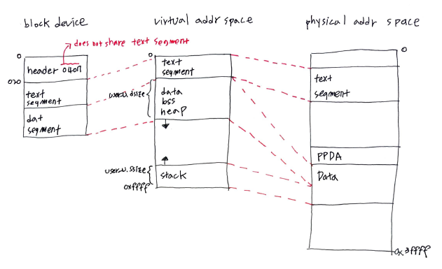
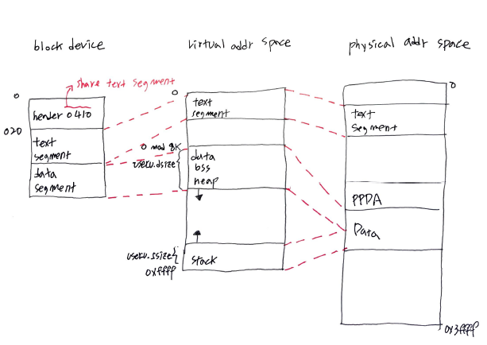
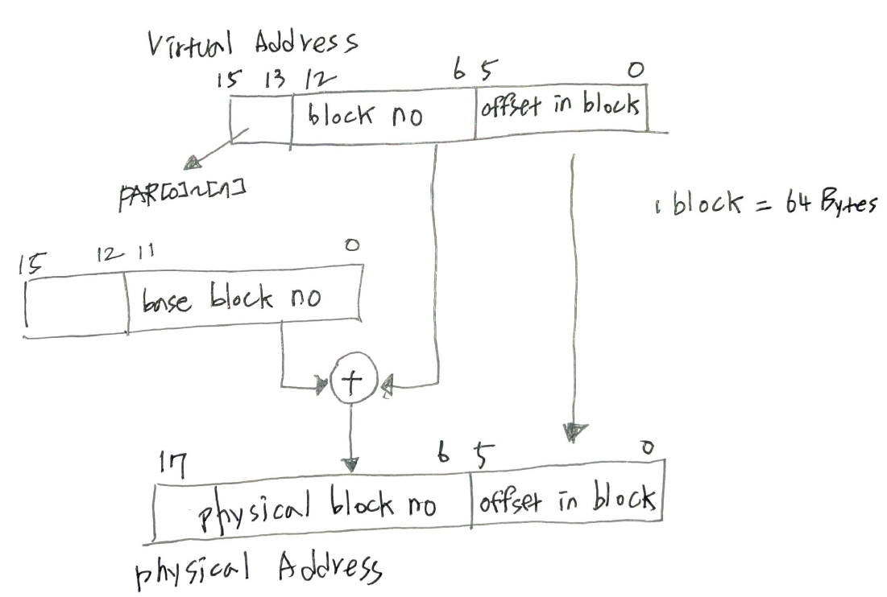

- [Abstract](#abstract)
- [Materials](#materials)
- [Prerequisites](#prerequisites)
- [PSW (Process Status Word)](#psw-process-status-word)
- [Global Registers](#global-registers)
- [Process Memory Structure](#process-memory-structure)
- [proc struct](#proc-struct)
- [user struct](#user-struct)
- [Memory Management Status Regiters](#memory-management-status-regiters)
- [Virtual Address to Physical Address Translation](#virtual-address-to-physical-address-translation)
- [Pre K&R](#pre-kr)
- [Assembly Syntax](#assembly-syntax)
	- [Overview](#overview)
	- [Register Mode](#register-mode)
	- [Register Deferred Mode](#register-deferred-mode)
	- [Autoincrement Mode](#autoincrement-mode)
	- [Autodecrement Mode](#autodecrement-mode)
	- [Index Mode](#index-mode)
	- [Autoincrement Deferred Mode](#autoincrement-deferred-mode)
	- [Autodecrement Deferred](#autodecrement-deferred)
	- [Index Deferred](#index-deferred)
	- [Immediate](#immediate)
	- [Immediate Deferred (Absolute)](#immediate-deferred-absolute)
	- [Relative](#relative)
	- [Relative Deferred](#relative-deferred)
- [fork systemcall](#fork-systemcall)
- [Swap](#swap)
- [Interupt](#interupt)
- [Trap](#trap)
- [Signal](#signal)
- [Block Sub System](#block-sub-system)
- [Block Device Driver](#block-device-driver)
- [File System](#file-system)
- [Pipe](#pipe)
- [Character Device](#character-device)
- [Terminal](#terminal)
- [Boot Sequence](#boot-sequence)

----

# Abstract

UNIX V6 의 source 를 분석한다.

# Materials

* [Linux Kernel Boot Process by 조만석 pdf](https://www.sosconhistory.net/2015/download/day28/ST3/S_28_1000_%EC%A1%B0%EB%A7%8C%EC%84%9D.pdf)
  * [UNIX V6로 배우는 커널의 원리와 구조 @ yes24](http://www.yes24.com/Product/Goods/12982537)
  * [The Unix Tree](https://minnie.tuhs.org/cgi-bin/utree.pl)
  * [Unix V6 Manuals](http://man.cat-v.org/unix-6th/)
* [Xv6, a simple Unix-like teaching operating system @ mit](https://pdos.csail.mit.edu/6.828/2012/xv6.html)
  * unix v6 를 x86 실행환경으로 다시 개발한 것
  * `git clone git://github.com/mit-pdos/xv6-public.git`
  * [textbook/commentary pdf](https://pdos.csail.mit.edu/6.828/2012/xv6/book-rev7.pdf)
* [Commentary on the Sixth Edition UNIX Operating System](http://www.lemis.com/grog/Documentation/Lions/)
  * [src @ minnie](https://minnie.tuhs.org/cgi-bin/utree.pl?file=V6/usr)
  * [src @ github](https://github.com/memnoth/unix-v6)

# Prerequisites

> * [src @ github](https://github.com/memnoth/unix-v6)
> * [UNIX Assembler Reference Manual](http://www.tom-yam.or.jp/2238/ref/as.pdf)
> * [Unix V6 Manuals](http://man.cat-v.org/unix-6th/)
> * [Commentary on the Sixth Edition UNIX Operating System](http://www.lemis.com/grog/Documentation/Lions/)
> * [The PDP-11 Assembly Language](https://programmer209.wordpress.com/2011/08/03/the-pdp-11-assembly-language/)

# PSW (Process Status Word)

**PSW**

| bit | Description |
|--|--|
| 15-14 | 현재 모드 (00: 커널, 11:사용자) |
| 13-12 | 이전 모드 (00: 커널, 11:사용자) |
| 7-5 | 프로세서 우선순위 (7~0) |
| 4 | trap bit |
| 3 | N (negative) 명령어 실행 결과가 음수 |
| 2 | Z (zero) 명령어 실행 결과가 0|
| 1 | V (overflow) 명령어 실행 결과가 overflow |
| 0 | C (carry) 명령어 실행 결과가 carry 발생 |

**PSW** is defined as `PS` in `param.h`

```c
#define PS 01777776
```

# Global Registers

| Name | Description |
|--|--|
| r0, r1 | 계산용, 함수의 리턴값 |
| r2, r3, r4 | 로컬처리 |
| r5 | 프레임 포인터, 환경포인터 |
| r6 (sp) | 스택 포인터 |
| r7 (pc) | 프로그램 카운터 |

# Process Memory Structure





# proc struct

```c
struct	proc
{
	char	p_stat;   
	char	p_flag;
	char	p_pri;		/* priority, negative is high */
	char	p_sig;		/* signal number sent to this process */
	char	p_uid;		/* user id, used to direct tty signals */
	char	p_time;		/* resident time for scheduling */
	char	p_cpu;		/* cpu usage for scheduling */
	char	p_nice;		/* nice for scheduling */
	int	p_ttyp;		/* controlling tty */
	int	p_pid;		/* unique process id */
	int	p_ppid;		/* process id of parent */
	int	p_addr;		/* address of swappable image */
	int	p_size;		/* size of swappable image (*64 bytes) */
	int	p_wchan;	/* event process is awaiting */
	int	*p_textp;	/* pointer to text structure */
} proc[NPROC];

/* stat codes */
#define	SSLEEP	1		/* sleeping on high priority */
#define	SWAIT	2		/* sleeping on low priority */
#define	SRUN	3		/* running */
#define	SIDL	4		/* intermediate state in process creation */
#define	SZOMB	5		/* intermediate state in process termination */
#define	SSTOP	6		/* process being traced */

/* flag codes */
#define	SLOAD	01		/* in core, in memory*/
#define	SSYS	02		/* scheduling process */
#define	SLOCK	04		/* process cannot be swapped */
#define	SSWAP	010		/* process is being swapped out */
#define	STRC	020		/* process is being traced */
#define	SWTED	040		/* another tracing flag */
```

# user struct

```c
/*
 * The user structure.
 * One allocated per process.
 * Contains all per process data
 * that doesn't need to be referenced
 * while the process is swapped.
 * The user block is USIZE*64 bytes
 * long; resides at virtual kernel
 * loc 140000; contains the system
 * stack per user; is cross referenced
 * with the proc structure for the
 * same process.
 */
struct user
{
	int	u_rsav[2];		/* save r5,r6 when exchanging stacks */
	int	u_fsav[25];		/* save fp registers */
					/* rsav and fsav must be first in structure */
	char	u_segflg;		/* flag for IO; user or kernel space */
	char	u_error;		/* return error code */
	char	u_uid;			/* effective user id */
	char	u_gid;			/* effective group id */
	char	u_ruid;			/* real user id */
	char	u_rgid;			/* real group id */
	int	u_procp;		/* pointer to proc structure */
	char	*u_base;		/* base address for IO */
	char	*u_count;		/* bytes remaining for IO */
	char	*u_offset[2];		/* offset in file for IO */
	int	*u_cdir;		/* pointer to inode of current directory */
	char	u_dbuf[DIRSIZ];		/* current pathname component */
	char	*u_dirp;		/* current pointer to inode */
	struct	{			/* current directory entry */
		int	u_ino;
		char	u_name[DIRSIZ];
	} u_dent;
	int	*u_pdir;		/* inode of parent directory of dirp */
	int	u_uisa[16];		/* prototype of segmentation addresses */
	int	u_uisd[16];		/* prototype of segmentation descriptors */
	int	u_ofile[NOFILE];	/* pointers to file structures of open files */
	int	u_arg[5];		/* arguments to current system call */
	int	u_tsize;		/* text size (*64) */
	int	u_dsize;		/* data size (*64) */
	int	u_ssize;		/* stack size (*64) */
	int	u_sep;			/* flag for I and D separation */
	int	u_qsav[2];		/* label variable for quits and interrupts */
	int	u_ssav[2];		/* label variable for swapping */
	int	u_signal[NSIG];		/* disposition of signals */
	int	u_utime;		/* this process user time */
	int	u_stime;		/* this process system time */
	int	u_cutime[2];		/* sum of childs' utimes */
	int	u_cstime[2];		/* sum of childs' stimes */
	int	*u_ar0;			/* address of users saved R0 */
	int	u_prof[4];		/* profile arguments */
	char	u_intflg;		/* catch intr from sys */
					/* kernel stack per user
					 * extends from u + USIZE*64
					 * backward not to reach here
					 */
} u;

/* u_error codes */
#define	EFAULT	106
#define	EPERM	1
#define	ENOENT	2
#define	ESRCH	3
#define	EINTR	4
#define	EIO	5
#define	ENXIO	6
#define	E2BIG	7
#define	ENOEXEC	8
#define	EBADF	9
#define	ECHILD	10
#define	EAGAIN	11
#define	ENOMEM	12
#define	EACCES	13
#define	ENOTBLK	15
#define	EBUSY	16
#define	EEXIST	17
#define	EXDEV	18
#define	ENODEV	19
#define	ENOTDIR	20
#define	EISDIR	21
#define	EINVAL	22
#define	ENFILE	23
#define	EMFILE	24
#define	ENOTTY	25
#define	ETXTBSY	26
#define	EFBIG	27
#define	ENOSPC	28
#define	ESPIPE	29
#define	EROFS	30
#define	EMLINK	31
#define	EPIPE	32
```

# Memory Management Status Regiters

MMU (Memory Management Unit) has **8 APR (Active Page Register)** per modes (kernal, user). and it is consisted of **PAR (Page Address Register), PDR (Page Description Register)**.

**PAR**

| bit | Description |
|--|--|
| 11~0 | base address (1 unit means 64 Bytes) |

**PDR**

| bit | Description |
|--|--|
| 14~8 | The number of page blocks |
| 6 | Data bit, represents updates |
| 3 | If the bit is 1. it means allocate memory low address to hi address. |
| 2~1 | 00: no allocation, 01: read only, 11: write available |

MMU (Memory Management Unit) has 2 registers such as **SR0**, **SR2**. **SR0** 은 메모리 관리 유효화 플래그와 에러 정보를 포함한다. **SR2** 은 실행할 명령어의 16비트 가상 어드레스를 나타낸다.

**SR0**

| bit | Description |
|--|--|
| 15 | 설정에 맞지 않는 페이지를 접근하려 했을 때 1 이 된다. |
| 14 | PDR 이 표시하는 페이지 길이보다 바깥 영역을 엑세스했을 때 1 이 된다. |
| 13 | 읽기 전용 영역에 값을 쓰려고 했을 때 1 이 된다. |
| 8 | 유지보수 모드일 때 1 이 된다. |
| 6~5 | 에러를 발생시킨 프로세스 모드 (00: 커널, 11:사용자) |
| 3~1 | 페이지 번호, 에러를 발생시킨 페이지를 참조하려는 경우 사용된다. |
| 0 | 1 이 되면 MMU 에서 메모리 관리를 활성화 한다. |

**SR2**

| bit | Description |
|--|--|
| 15-0 | 실행할 명령어의 가상 어드레스를 나타낸다. 명령어를 가져오는데 실패했다면 값이 업데이트되지 않는다. `SR0[15-13]` 에 어떤 값이라도 1 이면, 값이 업데이트되어 원래 값을 잃어 버린다. |

# Virtual Address to Physical Address Translation

The process has virtual address space **64 KBytes** because The process uses **16 bit** as an virtual memory address. `2^16 Bytes = 64 KBytes`.

The system has physical address space **256 KBytes** because the system uses **18 bit** as an physical memory address. `2^18 Bytes = 256 KBytes`



# Pre K&R

**Assignment**

```c
a =+ 1;
a =- 1;
a =* 1;
a =/ 1;
a =% 1;
a =>> 1;
a =<< 1;
a =& 1;
a =^ 1;
a =| 1;
```

**Anonymous Struct**

`PS` 는 `PSW` 에 대응하는 kernel space 의 memory address 이다. pre K&R C 는 cast operator 가 없다. 따라서 int integ 라는 anonymous struct 를 이용한다. 

다음과 같이 `PS->integ` 를 사용하면 `PS` 가 가리키는 주소의 한 word 를 int type 으로 가져온다. 즉, PSW 를 가져온다.

```c
/* param.h */
#define PS 01777776

struct
{
	int integ;
};

/* ken/slp.c */
/* in sleep() */
s = PS->integ;
```

이번에는 `RKADDR->rkcs` 를 사용하면 `RKADDR` 이 가리키는 주소의 메모리에 접근한다. 즉, `0177400` 에 해당하는 RK 디시크 레지스터의 rkcs 레지스터에 접근한다.

```c
/* dmr/rk.c */
#define RKADDR 0177400

struct {
	int rkds;
	int rker;
	int rkcs;
	int rkwc;
	int rkba;
	int rkda;
};

/* in rkstart(0 */
RKADDR->rkcs = RESET | GOl;
```

**32 bit data**

pre K&R C 는 unsigned type 이 없다. 또한 최대 1 word(16 bit) 만 다룰 수 있다. 32 bit 를 다루고 싶다면 array 를 이용한다. 32 bit 를 다루는 함수는 `dpadd() 덧셈`, `dpcmp() 뺄셈` 가 있다.

```c
/* file.h */
struct file
{
	char f_flag;
	char f_count;
	int f_inode;
	char *f_offset[2];
} file[NFILE]

/* ken/sys2.c */
/* in rdwr() */
dpadd(fp->f_offset, u.u_arg[1] - u.u_count);
```

# Assembly Syntax

> * [The PDP-11 Addressing Modes](https://programmer209.wordpress.com/2011/08/03/the-pdp-11-assembly-language/)

## Overview

| Syntax | Mode | Action | Machine Code | Extra Word |
|--|--|--|--|--|
| Rn | Register | Data = Rn | 0n | - |
| (Rn)+ | Autoincrement | Data = (Rn), Rn++ | 2n | - |
| -(Rn) | Autodecrement | Rn--, Data = (Rn) | 4n | - |
| X(Rn) | Index | Offset address X = (PC), PC += 2, Base address = rn, Data = (Rn + X) | 6n | Yes |
| @Rn or (Rn) | Register Deferred | Data = (Rn) | 1n | - |
| @(Rn)+ | Autoincrement Deferred | Data =((Rn)), Rn++ | 3n | - |
| @-(Rn) | Autodecrement Deferred | Rn–, Data =((Rn)) | 5n | - |
| @X(Rn) | Index Deferred | Offset address X = (PC), PC += 2, Base address = Rn, Data = ((Rn + X)) | 7n | Yes |
| #n | Immediate | Data = (PC) = n | 27 | Yes |
| @#A | Immediate Deferred (Absolute) | Data = ((PC)) = (A) | 37 | Yes |
| A or X(PC) | Relative | 	Offset address X = (PC), PC += 2, Data = (PC + X) = (A) | 67 | Yes |
| @A or @X(PC) | Relative Deferred | Offset address X = (PC), PC += 2, Data = ((PC + X)) = ((A)) | 77 | Yes |

## Register Mode

```s
mov r0 r1
```

## Register Deferred Mode

```s
# These are same
MOV R0 @R1
MOV R0 (R1)

# These are same
ADD @R0 @R1
ADD (R0) (R1)
add (r0) (r1)
```

## Autoincrement Mode

```s
movb r0 (r1)+

mov r0 (r1)+

# Copy the byte at the memory location pointed to by sp (r6)
#   to the low byte of the register r0
# Increment the contents of the register sp (r6) 2 bytes
movb (sp)+ r0
```

## Autodecrement Mode

```s
```

## Index Mode

```s
```


## Autoincrement Deferred Mode

```s
```

## Autodecrement Deferred

```s
```

## Index Deferred

```s
```

## Immediate

```s
```

## Immediate Deferred (Absolute)

```s
```

## Relative

```s
```

## Relative Deferred

```s
```

# fork systemcall

> `source/s4/fork.s`

```s
/ C library -- fork

/ pid = fork();
/
/ pid == 0 in child process; pid == -1 means error return
/ in child, parents id is in par_uid if needed

.globl	_fork, cerror, _par_uid

_fork:
	mov	r5,-(sp)
	mov	sp,r5
	sys	fork
		br 1f
	bec	2f
	jmp	cerror
1:
	mov	r0,_par_uid
	clr	r0
2:
	mov	(sp)+,r5
	rts	pc
.bss
_par_uid: .=.+2
```

> `sys/ken/sys1.c`

```c
fork()
{
	register struct proc *p1, *p2;

	p1 = u.u_procp;
	for(p2 = &proc[0]; p2 < &proc[NPROC]; p2++)
		if(p2->p_stat == NULL)
			goto found;
	u.u_error = EAGAIN;
	goto out;

found:
	if(newproc()) {
		u.u_ar0[R0] = p1->p_pid;
		u.u_cstime[0] = 0;
		u.u_cstime[1] = 0;
		u.u_stime = 0;
		u.u_cutime[0] = 0;
		u.u_cutime[1] = 0;
		u.u_utime = 0;
		return;
	}
	u.u_ar0[R0] = p2->p_pid;

out:
	u.u_ar0[R7] =+ 2;
}
```

> `sys/ken/slp.c`

```c
/*
 * Create a new process-- the internal version of
 * sys fork.
 * It returns 1 in the new process.
 * How this happens is rather hard to understand.
 * The essential fact is that the new process is created
 * in such a way that appears to have started executing
 * in the same call to newproc as the parent;
 * but in fact the code that runs is that of swtch.
 * The subtle implication of the returned value of swtch
 * (see above) is that this is the value that newproc's
 * caller in the new process sees.
 */
newproc()
{
	int a1, a2;
	struct proc *p, *up;
	register struct proc *rpp;
	register *rip, n;

	p = NULL;
	/*
	 * First, just locate a slot for a process
	 * and copy the useful info from this process into it.
	 * The panic "cannot happen" because fork has already
	 * checked for the existence of a slot.
	 */
retry:
	mpid++;
	if(mpid < 0) {
		mpid = 0;
		goto retry;
	}
	for(rpp = &proc[0]; rpp < &proc[NPROC]; rpp++) {
		if(rpp->p_stat == NULL && p==NULL)
			p = rpp;
		if (rpp->p_pid==mpid)
			goto retry;
	}
	if ((rpp = p)==NULL)
		panic("no procs");

	/*
	 * make proc entry for new proc
	 */

	rip = u.u_procp;
	up = rip;
	rpp->p_stat = SRUN;
	rpp->p_flag = SLOAD;
	rpp->p_uid = rip->p_uid;
	rpp->p_ttyp = rip->p_ttyp;
	rpp->p_nice = rip->p_nice;
	rpp->p_textp = rip->p_textp;
	rpp->p_pid = mpid;
	rpp->p_ppid = rip->p_pid;
	rpp->p_time = 0;

	/*
	 * make duplicate entries
	 * where needed
	 */

	for(rip = &u.u_ofile[0]; rip < &u.u_ofile[NOFILE];)
		if((rpp = *rip++) != NULL)
			rpp->f_count++;
	if((rpp=up->p_textp) != NULL) {
		rpp->x_count++;
		rpp->x_ccount++;
	}
	u.u_cdir->i_count++;
	/*
	 * Partially simulate the environment
	 * of the new process so that when it is actually
	 * created (by copying) it will look right.
	 */
	savu(u.u_rsav);
	rpp = p;
	u.u_procp = rpp;
	rip = up;
	n = rip->p_size;
	a1 = rip->p_addr;
	rpp->p_size = n;
	a2 = malloc(coremap, n);
	/*
	 * If there is not enough core for the
	 * new process, swap out the current process to generate the
	 * copy.
	 */
	if(a2 == NULL) {
		rip->p_stat = SIDL;
		rpp->p_addr = a1;
		savu(u.u_ssav);
		xswap(rpp, 0, 0);
		rpp->p_flag =| SSWAP;
		rip->p_stat = SRUN;
	} else {
	/*
	 * There is core, so just copy.
	 */
		rpp->p_addr = a2;
		while(n--)
			copyseg(a1++, a2++);
	}
	u.u_procp = rip;
	return(0);
}
```

# Swap

# Interupt

# Trap

# Signal

# Block Sub System

# Block Device Driver

# File System

# Pipe

# Character Device 

# Terminal

# Boot Sequence
