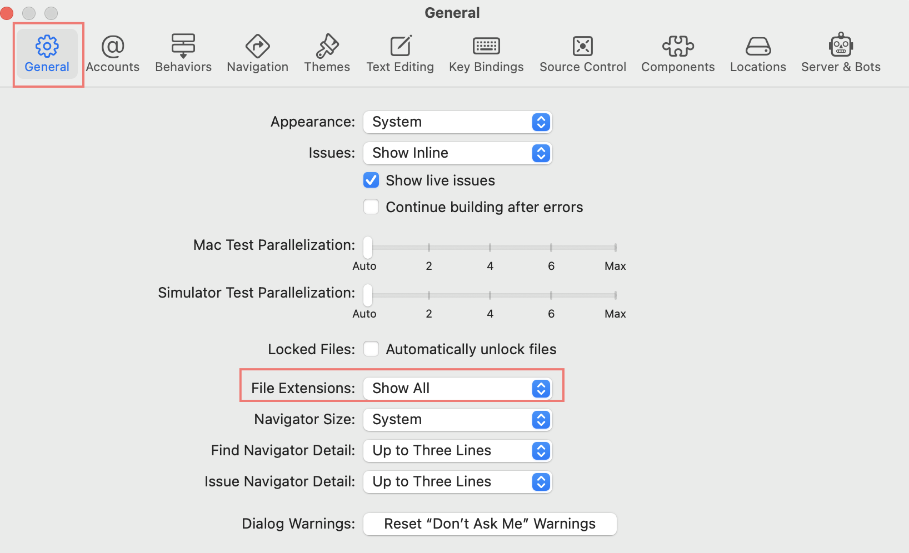
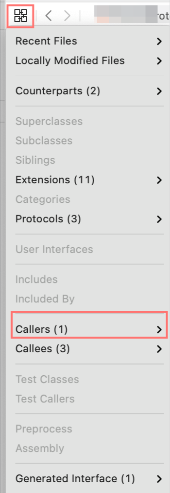

# Materials

* [awesome ios @ github ](https://github.com/vsouza/awesome-ios)
* [awesome ios ui @ github](https://github.com/cjwirth/awesome-ios-ui)
* [iOS-Sample-Code @ github](https://github.com/xcatsan/iOS-Sample-Code)
* [ios-sample-apps @ github](https://github.com/ooyala/ios-sample-apps)

# Basic

## Shorcuts

| ShortCut | Description |
|:--------|:---------|
| `^ L Click` | Quick Help |
| `⇧ ⌘ O` | Open Quickly |
| `^ ⌥ ⌘ Enter` | Assistant View on storyboard |
| `⇧ ⌘ L` | Library Window |
| `⌘ B` | Build |
| `⌘ R` | Run |
| `^ ⌘ <-` | Back |
| `^ ⌘ ->` | Forward |
| `^ ⌘ J` | Jump to definition |

## File Extensions

Project View 의 File Extension 을 보이게 하자.



## Find References

검색을 원하는 함수에 cursor 를 놓는다. Editor View 왼쪽 위 아이콘을 클릭하고 Caller 를 확인한다.



## How to make a iOS app with cocoapods 

## How to make a iOS library with cocoapods

> [[iOS] 나만의 라이브러리 만들기(feat. CocoaPods)](https://fomaios.tistory.com/entry/iOS-%EB%82%98%EB%A7%8C%EC%9D%98-%EB%9D%BC%EC%9D%B4%EB%B8%8C%EB%9F%AC%EB%A6%AC-%EB%A7%8C%EB%93%A4%EA%B8%B0feat-CocoaPods)

```
$ pod lib create MyLib
```
