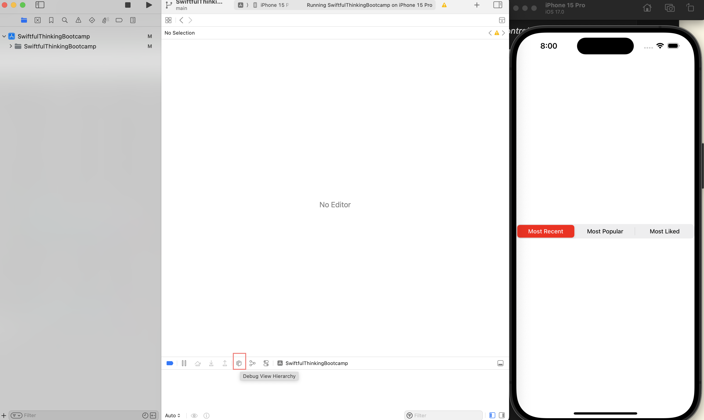
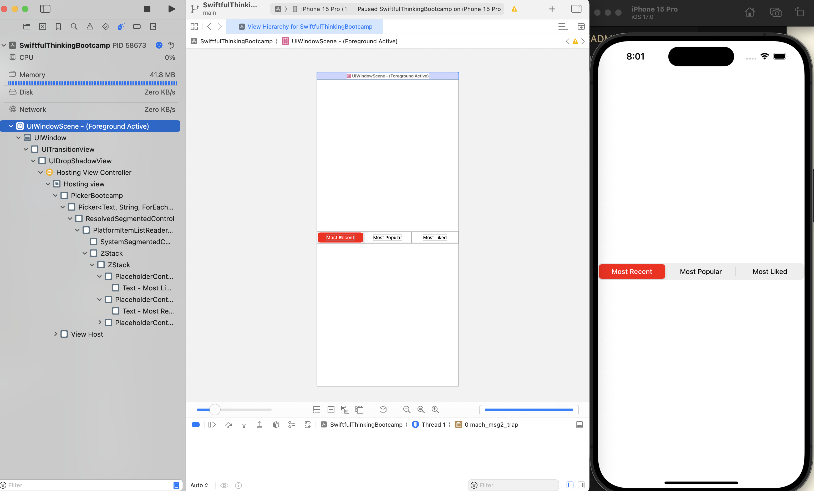

- [Materials](#materials)
- [Basic](#basic)
  - [Install](#install)
  - [Shorcuts](#shorcuts)
  - [Terms](#terms)
  - [Show File Extensions](#show-file-extensions)
  - [Find References](#find-references)
  - [How to make a iOS app with cocoapods](#how-to-make-a-ios-app-with-cocoapods)
  - [How to make a iOS library with cocoapods](#how-to-make-a-ios-library-with-cocoapods)
- [Advanced](#advanced)
  - [Navigate to the file](#navigate-to-the-file)
  - [Debug Hierarchy View](#debug-hierarchy-view)
  - [`Show Callers` Short Cut](#show-callers-short-cut)

-----

# Materials

* [xcode | apple](https://developer.apple.com/documentation/xcode)
* [awesome ios | github ](https://github.com/vsouza/awesome-ios)
* [awesome ios ui | github](https://github.com/cjwirth/awesome-ios-ui)
* [iOS-Sample-Code | github](https://github.com/xcatsan/iOS-Sample-Code)
* [ios-sample-apps | github](https://github.com/ooyala/ios-sample-apps)

# Basic

## Install

Appstore 는 느리다. [xcodes](https://github.com/XcodesOrg/xcodes) command line 을
이용하면 빠르다.

```bash
$ brew install xcodesorg/made/xcodes
$ xcodes install --latest
```

## Shorcuts

| ShortCut | Description |
|:--------|:---------|
| `^ L Click` | Quick Help |
| `⇧ ⌘ O` | **Open Quickly** |
| `^ ⌥ ⌘ Enter` | Assistant View on storyboard |
| `⌥ ⌘ Enter` | Canvas View on SwiftUI |
| `⇧ ⌥ ⌘ Enter` | Enable Code Review on storyboard |
| `⇧ ⌘ L` | Show library window |
| `^ ⇧ ⌘ M` | Show/Hide Minimap |
| `⌘ B` | Build |
| `⌘ R` | Run |
| `^ ⌘ <-` | **Back** |
| `^ ⌘ ->` | **Forward** |
| `^ ⌘ J` | **Jump to definition** |
| `⇧ ⌘ J` | **Reveal in project navigator** |
| `^ ⇧ ⌘ F` | Find selected symbol in workspace |
| `^ ⇧ ⌘ H` | Find call hierarchy |
| `⌘ 0` | Show/Hide Navigator |
| `⌥ ⌘ 0` | Show/Hide Inspector |
| `⇧ ⌘ Y` | Activate Debug Console |
| `⇧ ⌘ C` | Show/Hide Debug Area |
| `^ I` | Reindent |

## Terms

* Workspace vs Project
  * an Xcode project is focused on building a specific product using
    a defined set of resources and settings, while a workspace allows you to
    work with multiple projects and their dependencies in a unified environment.
    Deciding which to use depends on the complexity of your application and the
    degree of modularity and collaboration required in your development process.

* Scheme
  * a collection of settings and configurations used to define how to build,
    run, test, profile, analyze, and archive your app.
  * The scheme content is stored in a `.xcscheme file`, which is located within
    your project's `.xcworkspace` or `.xcodeproj` directories. The `.xcscheme` file is
    an XML-based file that stores the information about your scheme, such as
    build targets, build configurations, and environment settings.
  * If your project uses an Xcode workspace (`.xcworkspace`): In this case, your
    scheme files are located inside the
    `<ProjectName>.xcworkspace/xcshareddata/xcschemes/` directory.
  * If your project uses an Xcode project file (`.xcodeproj`): Custom scheme
    files are located inside the
    `<ProjectName>.xcodeproj/xcuserdata/[username].xcuserdatad/xcschemes/`
    directory, while shared scheme files are in
    `<ProjectName>.xcodeproj/xcshareddata/xcschemes/`.

* Target
  * set of build configurations and settings used to create a specific product
    or output from your project, such as an app, a library, a framework, or a
    test bundle. Each target contains the necessary instructions on how to
    process your project's source code, resources, and dependencies to produce
    the desired outcome.
  * Saved in `project.pbxproj` and `.xcodeproj`

## Show File Extensions

Project View 의 File Extension 을 보이게 하자.


## Find References

검색을 원하는 함수에 cursor 를 놓는다. Editor View 왼쪽 위 아이콘을 클릭하고 Caller 를 확인한다.


## How to make a iOS app with cocoapods 

[cocoapods create application](/cocoapods/README.md#using-pod-application-create)

## How to make a iOS library with cocoapods

[cocoapods create library](/cocoapods/README.md#using-pod-lib-create)

# Advanced

## Navigate to the file

- 자동 파일 탐색 설정:
  - Xcode에는 현재 열려 있는 파일을 네비게이터에서 자동으로 선택하도록 설정하는 기능이 있습니다.
  - 메뉴에서 File > Project Settings 또는 Preferences > Navigation으로 이동합니다.
  - "Navigation" 탭에서 Automatically Select Currently Edited File 옵션을 활성화합니다.
- 단축키 사용:
  - `Command + Shift + J`: 현재 열려 있는 파일을 네비게이터 창에서 자동으로 선택하여 강조 표시합니다. Jump to Definition으로 이동한 후, 이 단축키를 누르면 파일이 워크스페이스에서 선택됩니다.

## Debug Hierarchy View

- app 을 실행후 Debug Hierarchy View 를 선택하면 UI Hierarchy 를 쉽게 파악할 수 있다.





## `Show Callers` Short Cut

- Show Callers 는 자주사용하는 기능이지만 기본 단축키가 없다.
- `Settings... | Key Bingins` 에서 `^ ⇧ C` 로 설정한다.
